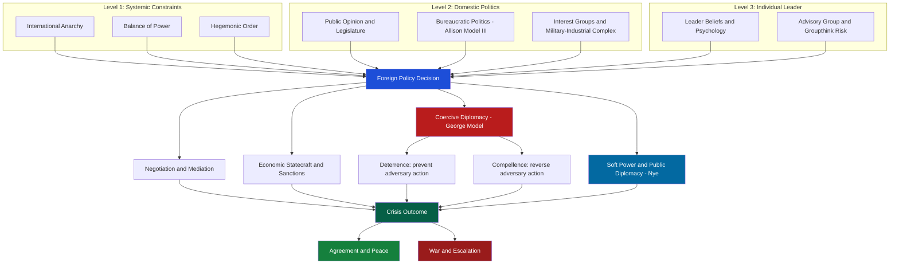

> [!abstract] TL;DR
> Diplomacy is the art of managing interstate relations through communication and negotiation rather than force; foreign policy is the set of goals and strategies a state uses to pursue its interests internationally. The field spans the mechanics of diplomatic institutions (Vienna Convention, 1961), the psychology of decision-making (Allison's bureaucratic politics), the logic of coercive threats (George's coercive diplomacy, Schelling's compellence), and the soft power of attraction versus the hard power of coercion. Understanding when states cooperate, coerce, or fight requires bridging history, game theory, and political psychology.

---

## Intuition

**Analogy:** A labor union negotiating with management has **demands** (goals), **leverage** (the credible threat of a strike), and **interests** (wages, conditions) that lie beneath its stated **positions** (specific demands). The union cannot simply threaten a strike for every grievance — strikes are costly to both sides. The credible threat works precisely because management believes the union *would* actually strike if pushed far enough, even at cost to itself. The art of the negotiation is convincing management of that resolve without having to actually strike.

This maps directly onto interstate diplomacy. States have interests, positions, leverage (military and economic power), and credibility problems. A superpower that threatens war over a trivial issue is not believed; a small power that demonstrates genuine resolve over a core interest can compel a larger adversary to back down. Diplomacy is the sustained, institutionalised practice of navigating exactly this logic across all state pairs, simultaneously, indefinitely.

---

## How It Works



---

## Key Concepts

### Secondary Level

#### History of Diplomacy: From Ancient to Modern

Diplomacy is not a modern invention. The **Amarna Letters** (c. 1350 BCE) preserve cuneiform tablets exchanged between Egyptian pharaohs and Mesopotamian kings — a Bronze Age diplomatic archive covering alliance negotiations, royal marriages, and trade. The Indian **Arthashastra** (Kautilya, c. 300 BCE) systematised foreign policy as the science of statecraft (*dandaniti*), categorising relations among states as friend, enemy, and neutral in a circle (*mandala*) of neighbouring powers.

| Era | Landmark | Significance |
|-----|----------|--------------|
| Ancient Greece | *Proxenos* (guest-friend) system | First permanent inter-state diplomatic representatives |
| Roman Republic | *Fetial priests*, legates | Sacralised declaration of war and peace; early diplomatic immunity concept |
| Byzantine Empire | 6th–15th c. | Sophisticated gift diplomacy, espionage, manipulation of barbarian rivalries |
| Italian City-States | Venice, Milan, Florence (15th c.) | Permanent resident embassies — the modern ambassador system is born |
| **Peace of Westphalia** | **1648** | Ended 30 Years War; codified **state sovereignty** as the organising principle of international order |
| **Congress of Vienna** | **1815** | Established diplomatic ranks (ambassador > envoy > minister resident > charge d'affaires); created Concert of Europe; first modern multilateral diplomacy |
| Wilson's Fourteen Points | 1918 | Point 1: "open covenants of peace, openly arrived at" — rejection of secret treaties that had contributed to WWI; led to League of Nations |
| **Vienna Convention** | **1961** | UN-codified treaty governing diplomatic missions; 193 state parties; still the governing law |
| Contemporary | UN, WTO, ICC, bilateral FTAs | Institutionalised multilateralism; digital diplomacy; track II diplomacy |

#### The Concert of Europe and Balance of Power

After the Napoleonic Wars, Metternich, Castlereagh, and Talleyrand designed the **Concert of Europe** (1815–1914): great powers (Austria, Prussia, Russia, Britain, France) coordinated to manage crises and prevent hegemony. This was the first sustained attempt at **collective security management** through regular great-power congresses. Its collapse in 1914 — driven by the alliance system, nationalism, and miscalculation — drove Woodrow Wilson's vision for the League of Nations and later the United Nations.

#### Diplomatic Instruments: A Spectrum

From softest to hardest:

1. **Public diplomacy** — government communication to foreign publics; cultural diplomacy, broadcasting, educational exchanges (Fulbright, Goethe-Institut)
2. **Negotiation** — direct bilateral or multilateral talks; Fisher and Ury (1981): separate people from problem, focus on interests not positions, invent options, insist on objective criteria
3. **Mediation** — third-party facilitation (Jimmy Carter at Camp David, 1978; Norway in Oslo Accords, 1993)
4. **Arbitration** — binding third-party adjudication; Permanent Court of Arbitration (1899)
5. **Economic inducements** — foreign aid, trade preferences, investment guarantees
6. **Economic sanctions** — trade embargoes, asset freezes, financial exclusion (SWIFT removal)
7. **Coercive diplomacy** — military threats short of war; naval deployments, no-fly zones
8. **Military force** — the *ultima ratio regum* (last argument of kings)

#### The Vienna Convention on Diplomatic Relations (1961)

The most widely ratified treaty in history, governing:

- **Inviolability of mission premises**: host state may not enter without permission; must protect embassy from third-party attack
- **Inviolability of diplomatic agents**: diplomats cannot be arrested or detained; full immunity from criminal jurisdiction in host state
- **Diplomatic bag**: communications/pouches exempt from inspection
- **Persona non grata**: host state may declare any diplomat unwelcome without explanation; the sending state must then recall that person

The Vienna Convention operates on **reciprocity**: every state wants its own diplomats protected abroad, so every state extends protections to foreign diplomats at home. Self-interest enforces compliance even without a supranational enforcer.

---

### Undergraduate Level

#### Foreign Policy Analysis: Levels of Analysis

**Kenneth Waltz's Three Images** (*Man, the State, and War*, 1959):
- **First image (individual)**: wars/policies caused by human nature, psychology, and leader miscalculation
- **Second image (domestic)**: state's internal political structure shapes foreign policy (democratic peace theory, bureaucratic politics)
- **Third image (systemic)**: anarchic international structure drives state behaviour regardless of domestic character (structural realism)

**James Rosenau's Pre-Theory** (1966) added idiosyncratic (leader personality), role (positional constraints), governmental, societal, and systemic variables — a multi-level framework anticipating modern FPA.

**Graham Allison's Three Models** (*Essence of Decision*, 1971; Cuban Missile Crisis case):

| Model | Core Assumption | Key Mechanism | Prediction |
|-------|-----------------|---------------|------------|
| **I: Rational Actor** | State as unitary, rational agent | Maximise expected utility | Optimal response to strategic environment |
| **II: Organisational Process** | Decisions = output of standard operating procedures | Bureaucratic routines, repertoires | Satisficing, not optimising; path-dependent |
| **III: Bureaucratic Politics** | Decisions = resultant of inter-agency bargaining | "Where you stand depends on where you sit" | Policy reflects organisational interests, not national interest |

Allison showed all three models explain different aspects of Kennedy's handling of the Cuban Missile Crisis (October 1962). Model I explains the naval quarantine decision; Model II explains why the U-2 overflew Soviet territory at a critical moment (SAC routine, not deliberate provocation); Model III explains why ExComm's options were constrained by what the Air Force, Navy, and CIA were already prepared to do.

**Robert Putnam's Two-Level Game** (*International Organization*, 1988):
International negotiations occur simultaneously at two tables:
- **Level I**: the international bargaining table (between states)
- **Level II**: the domestic ratification table (the negotiator must sell the deal at home)

The critical concept is **win-set**: the set of international agreements that a domestic constituency would ratify. A negotiator with a small win-set (e.g., facing a hostile Senate) paradoxically gains **bargaining leverage** internationally — "I cannot accept that; my Senate would reject it." Putnam explains why domestic political constraints are not just obstacles to diplomacy but **instruments** of it.

#### Coercive Diplomacy: Alexander George's Model

George (1991, *Forceful Persuasion*) defined coercive diplomacy as the **defensive use of threats or limited force** to persuade an adversary to stop or reverse an action already underway, without crossing into full-scale war.

**Conditions for Success** (George's three requirements):
1. **Strength of motivation**: the coercing state must care deeply enough about the issue to threaten war credibly
2. **Asymmetry of motivation**: the coercing state must value the objective *more* than the target values its resistance — if the target cares more, it will call the bluff
3. **Sense of urgency**: the ultimatum must convey that time is limited, that concession must happen now

**Type of ultimatum**:
- **Try-and-see**: take limited action, signal willingness to escalate; watch for compliance (risky: may not convey urgency)
- **Gradual escalation**: progressive escalation of threats/force; time-consuming, can allow adversary to entrench
- **Tacit ultimatum**: no formal ultimatum, but the deployment itself conveys credible intent (e.g., moving carrier battle groups)

**Historical cases**:
- **Cuban Missile Crisis (1962)**: Kennedy's naval quarantine combined coercive and reassuring signals; Khrushchev backed down when asymmetry of motivation (US cares more about Cuba than USSR cares about missiles there) became clear
- **Kosovo (1999)**: NATO's coercive campaign against Milosevic failed initially (he did not comply to initial air campaign) but ultimately succeeded after 78 days, illustrating that coercive diplomacy can shade into compellence requiring sustained military punishment
- **Gulf War (1990–91)**: Coercive diplomacy against Saddam Hussein's Iraq failed — Saddam did not believe the US would actually fight; miscalculated the asymmetry of motivation

#### Deterrence vs. Compellence (Schelling)

Thomas Schelling (*The Strategy of Conflict*, 1960; *Arms and Influence*, 1966) drew the sharpest analytical distinction:

| Concept | Goal | Timing | Logical Form |
|---------|------|---------|--------------|
| **Deterrence** | Prevent an action not yet taken | Before the adversary acts | "If you do X, I will do Y" |
| **Compellence** | Reverse an action already taken | After the adversary has acted | "Do Y (or stop X), or I will do Z" |

**Compellence is harder than deterrence** because:
- The adversary has already committed; conceding = public loss of face
- The burden of action shifts to the defender/coercer — the threat must be executed if ignored
- The adversary can test resolve by simply waiting ("salami slicing")

Schelling's insight: **the power to hurt** — the capacity to inflict pain on an adversary's values (cities, economy, leadership) — is the ultimate source of bargaining power. Nuclear deterrence is the limiting case where mutual vulnerability creates stability through the logic of "mutually assured destruction."

---

### Graduate Level

#### Economic Statecraft and Sanctions Effectiveness

**Hufbauer, Schott, and Elliott** (*Economic Sanctions Reconsidered*, 1990, 2007) conducted the most comprehensive empirical study, analysing 204 cases from 1914–2007:
- Success rate: roughly **34%** — sanctions achieve significant policy changes roughly one-third of the time
- Most effective when: target is small, economically dependent on sender, sanction is applied swiftly and multilaterally, demands are modest
- Least effective when: target has alternative trading partners, is a large economy, faces existential demands (regime change), or "rallies around the flag"

**Smart sanctions** (post-1990s evolution): moved from blunt comprehensive embargoes (Iraq 1990–2003 caused mass civilian suffering with limited political effect) to targeted/individualised measures:
- Travel bans and asset freezes on specific leaders and elites
- Sectoral sanctions (energy, defence, financial)
- Financial exclusion: removing states from SWIFT interbank messaging (Iran 2012, Russia 2022) cuts off international payments

**Sanctions paradox**: comprehensive sanctions can strengthen authoritarian governments by controlling scarce goods distribution, reinforcing patronage networks, and allowing the regime to blame external enemies for economic hardship.

#### Soft Power, Hard Power, and Smart Power (Nye)

Joseph Nye (*Bound to Lead*, 1990; *Soft Power*, 2004):

| Concept | Mechanism | Examples |
|---------|-----------|---------|
| **Hard power** | Coercion and inducement | Military force, sanctions, bribery |
| **Soft power** | Attraction and persuasion | Culture, values, political institutions, perceived legitimacy of foreign policy |
| **Smart power** | Strategic combination | US Cold War: military containment (hard) + Marshall Plan + VOA + Fulbright (soft) |

**Sources of soft power**: a country's culture (when attractive to others), its political values (when it lives up to them), and its foreign policies (when seen as legitimate and having moral authority).

**Public diplomacy** is the instrument: direct government communication to foreign publics, bypassing foreign governments. Cold War examples: Voice of America, Radio Free Europe; modern examples: BBC World Service, Al Jazeera, China's CGTN.

**Limits of soft power**: cannot be switched on immediately; is produced by civil society and culture as much as government; can be destroyed by perceived hypocrisy (Abu Ghraib devastated US soft power in the Arab world). Nye's key point: **attraction is not the same as consent**, and soft power alone rarely achieves concrete policy changes against resistant targets.

#### Open vs. Secret Diplomacy

Woodrow Wilson's **Point 1** of the Fourteen Points (January 1918): "Open covenants of peace, openly arrived at, after which there shall be no private international understandings of any kind but diplomacy shall proceed always frankly and in the public view."

This was an explicit rejection of the secret treaties (Sykes-Picot, Treaty of London, etc.) and alliance entanglements that many believed contributed to WWI's escalation.

**The tension in practice**: Wilson himself then negotiated the Treaty of Versailles in secret sessions. The scholarly consensus is that "open covenants" (published agreements) is achievable, but "openly arrived at" (public negotiations) is often counterproductive — negotiators need space to make concessions without losing face domestically. The Kissinger-era back-channel to China (1971–72) and the Oslo process (1993) are canonical examples where secret diplomacy enabled breakthroughs impossible in public.

**Track II diplomacy**: unofficial, informal contacts between academics, think-tankers, NGOs, or retired officials — not representing governments but creating intellectual and relational groundwork for formal Track I negotiations. Used extensively in Israeli-Palestinian diplomacy, India-Pakistan nuclear risk reduction, and Cuba-US normalisation.

#### Groupthink and the Psychology of Foreign Policy Decisions

Irving Janis (1972) developed the **groupthink** concept explicitly from the **Bay of Pigs** (1961) case — Kennedy's advisory group, despite containing brilliant individuals, suppressed doubts, stereotyped the adversary, and produced the catastrophically flawed invasion plan. Janis's eight symptoms of groupthink (illusion of invulnerability, collective rationalisation, belief in group morality, stereotyped out-groups, pressure on dissenters, self-censorship, illusion of unanimity, self-appointed mindguards) are directly applicable to NSC decision-making.

**Operational code** (George, 1969): leaders bring **philosophical beliefs** (nature of politics, role of chance) and **instrumental beliefs** (best approach to goals) that filter incoming information. Miscalculation in foreign policy often stems from leaders projecting their own operational code onto adversaries — assuming the adversary values the same things in the same way.

**Prospect theory in foreign policy** (Levy, 1992): Kahneman and Tversky's finding that losses loom larger than gains translates into foreign policy as **loss aversion** — leaders are more willing to take risks to avoid losses than to achieve equivalent gains. This explains why states fight harder to retain territory than to acquire it.

---

## Python Demo

```python
import numpy as np
import matplotlib.pyplot as plt
import matplotlib.colors as mcolors
from matplotlib.patches import Patch

# =============================================================
# Crisis Bargaining Model — When Does Coercive Diplomacy Work?
# Based on: Schelling (1960), George (1991), Fearon (1995)
# =============================================================
#
# Setup: State A (coercer) issues ultimatum to State B (target).
#   B chooses: comply or resist (= war).
#
# State A demands iff:  EU_A(war) > 0
#   => p * v_A - c_A > 0  =>  p > c_A / v_A
#
# State B resists iff:  EU_B(resist) > EU_B(comply = 0)
#   EU_B(war) = (1-p)*v_B - c_B > 0
#   Dividing by c_B:  (1-p)*(v_B/c_B) > 1
#   Define R = v_B / c_B  (B's resolve ratio)
#   B resists iff:  R > 1/(1-p)   [threshold R* = 1/(1-p)]
#
# Coercive success (no war): A demands AND B complies (R < R*)
# War:                        A demands AND B resists  (R > R*)

np.random.seed(42)

v_A = 1.0
c_A = 0.25   # A's war cost (25% of prize value)

# Grid over capability p and B's resolve ratio R = v_B / c_B
p_vals = np.linspace(0.01, 0.99, 300)
R_vals = np.linspace(0.05, 5.0, 300)
P, R = np.meshgrid(p_vals, R_vals)

a_demands = P * v_A > c_A          # A has incentive to issue ultimatum
b_resists  = R > 1.0 / (1.0 - P)  # B prefers war to compliance

# Outcomes: 0=no crisis, 1=war, 2=coercive success
outcome = np.where(~a_demands, 0,
          np.where(b_resists, 1, 2))

fig, (ax1, ax2) = plt.subplots(1, 2, figsize=(14, 6))
fig.suptitle(
    "Crisis Bargaining: Equilibrium Space for Coercive Diplomacy",
    fontsize=13, fontweight="bold"
)

# --- Left: equilibrium heatmap ---
cmap = mcolors.ListedColormap(["#3b82f6", "#ef4444", "#22c55e"])
ax1.contourf(P, R, outcome, levels=[-0.5, 0.5, 1.5, 2.5], cmap=cmap, alpha=0.85)

demand_threshold = c_A / v_A
ax1.axvline(demand_threshold, color="black", lw=2.0, ls="--")

# B compliance boundary: R* = 1/(1-p)
p_range = np.linspace(0.01, 0.989, 300)
r_star  = 1.0 / (1.0 - p_range)
mask = r_star <= 5.0
ax1.plot(p_range[mask], r_star[mask], color="white", lw=2.5, ls="-")

ax1.set_xlabel("A's Capability  p = P(A wins war)", fontsize=10)
ax1.set_ylabel("B's Resolve Ratio  R = v_B / c_B", fontsize=10)
ax1.set_title("Equilibrium Regions", fontsize=11)
ax1.set_xlim(0, 1); ax1.set_ylim(0.05, 5.0)

patches = [
    Patch(fc="#3b82f6", label="No crisis: A lacks incentive to demand"),
    Patch(fc="#ef4444", label="War: B resolute enough to resist"),
    Patch(fc="#22c55e", label="Coercive success: B complies"),
    plt.Line2D([0],[0], color="black", lw=2, ls="--",
               label=f"A demand threshold  p = {demand_threshold:.2f}"),
    plt.Line2D([0],[0], color="white", lw=2.5, ls="-",
               label="B compliance boundary  R* = 1/(1-p)"),
]
ax1.legend(handles=patches, loc="upper left", fontsize=8, framealpha=0.9)

# --- Right: compliance threshold shift with capability ---
ax2.set_facecolor("#f8fafc")
capability_levels = [(0.35, "#6366f1"), (0.55, "#f97316"),
                     (0.75, "#ec4899"), (0.92, "#14b8a6")]

for p_fixed, color in capability_levels:
    r_threshold = 1.0 / (1.0 - p_fixed)
    ax2.axvline(r_threshold, color=color, lw=2, ls="--",
                label=f"p = {p_fixed:.2f}  ->  R* = {r_threshold:.2f}")
    ax2.annotate(
        f"p={p_fixed:.2f}", xy=(r_threshold, 0.88), fontsize=8,
        color=color, ha="center", va="bottom"
    )

ax2.set_xlabel("B's Resolve Ratio  R = v_B / c_B", fontsize=10)
ax2.set_ylabel("Threshold line (B complies left, resists right)", fontsize=9)
ax2.set_title(
    "How Capability Shifts the Compliance Threshold R*",
    fontsize=10
)
ax2.set_xlim(0.05, 5.0); ax2.set_ylim(0, 1.2)
ax2.legend(fontsize=9, loc="upper right")
ax2.text(
    0.5, 0.45,
    "Higher A capability -> larger R* tolerated\n"
    "Credible military power expands the space\n"
    "where coercion prevents war without fighting",
    ha="center", va="center", fontsize=9, transform=ax2.transAxes,
    bbox=dict(boxstyle="round,pad=0.4", fc="#fffbeb", ec="#fbbf24", lw=1.5)
)

plt.tight_layout()
plt.savefig("crisis_bargaining_equilibrium.png", dpi=100, bbox_inches="tight")
plt.show()

# Summary table
print("=== Crisis Bargaining Threshold Summary ===")
print(f"{'Capability (p)':>15} | {'B Compliance Threshold R*':>25}")
print("-" * 45)
for p in [0.35, 0.50, 0.65, 0.80, 0.92]:
    rt = 1.0 / (1.0 - p)
    print(f"{p:>15.2f} | {rt:>25.3f}")

print("\nSchelling's insight:")
print("States that cannot credibly threaten war lose all coercive leverage.")
print("George's key condition: asymmetry of motivation, not raw capability,")
print("determines whether an ultimatum will be believed.")
```

---

## Real-World Applications

> **Cuban Missile Crisis (1962) — All Three Allison Models in Action:**
> Kennedy's ExComm decision to impose a naval *quarantine* (not blockade — the legal difference mattered) illustrates Allison's framework simultaneously. Model I: the quarantine was the expected utility-maximising response, avoiding both capitulation and nuclear war. Model II: the quarantine's exact form was constrained by Navy SOPs — admirals wanted to operate at full ASW range (500 miles), not the 300 miles McNamara insisted on. Model III: the Air Force lobbied hard for air strikes; Adlai Stevenson's dovish position nearly ended his career. The "decision" was a resultant of all three forces.

> **Oslo Accords (1993) — Track II to Track I:**
> Israeli and PLO negotiators had been meeting secretly in Norway — facilitated by the Norwegian Foreign Ministry and academic intermediaries — for months before the official negotiating channel knew. Public negotiations in Washington had stalled because both delegations were too constrained by domestic audiences. The secret Oslo channel allowed both sides to explore compromises that neither could admit to in public. The September 1993 handshake between Rabin and Arafat was made possible by diplomacy that Wilson's "open covenants, openly arrived at" would have prevented.

> **Russia-SWIFT Exclusion (2022) — Smart Sanctions in the Ukraine Conflict:**
> Following Russia's invasion of Ukraine, Western allies removed major Russian banks from the SWIFT interbank messaging system — a "nuclear option" in financial diplomacy that the EU had previously avoided due to concerns about collateral damage to European banks. The measure, combined with asset freezes on the Russian Central Bank ($300B of reserves frozen), demonstrated the shift to targeted financial statecraft. Its effectiveness in changing Russian behaviour remained limited by Russia's extensive prior de-dollarisation and the availability of Chinese financial channels — confirming Hufbauer et al.'s finding that sanctions with alternative trading partners available are less effective.

> **China's Belt and Road Initiative — Soft Power as Grand Strategy:**
> China's BRI (launched 2013) is textbook Nye-style economic statecraft combined with soft power projection: infrastructure investment in 140+ countries builds economic dependence, political goodwill, and reputational influence. Critics argue it constitutes "debt trap diplomacy" (hard power dressed as soft power), while proponents note it fills genuine infrastructure gaps. Either way, it illustrates that the hard/soft power distinction is often analytical rather than practical — economic instruments serve both coercive and attractive functions simultaneously.

---

## Common Pitfalls

- **Assuming rational unitary actors** — Allison's lesson is constantly re-learned. Treating "China decided" or "the US chose" as if a coherent entity made a rational calculation obscures the bureaucratic battles, cognitive limitations, and organisational routines that shape actual decisions. Policy analysis that skips to the system level misses where the leverage actually lies.

- **Ignoring asymmetry of motivation** — The most common failure in coercive diplomacy is the coercer underestimating how much the target cares about the contested issue. The US in Vietnam, the Soviet Union in Afghanistan, and the UK in the Falklands crisis (from Argentina's perspective) all suffered from this error. Asymmetry of motivation, not balance of capabilities, is the decisive variable.

- **Sanctions as symbolic politics** — Sanctions are frequently imposed as a domestic political signal (showing voters "we are doing something") rather than as a calibrated instrument designed to change target behaviour. This produces comprehensive sanctions with clear humanitarian costs and unclear strategic goals — the Iraq sanctions of the 1990s being the paradigmatic case. Effective sanctions require specific, achievable demands communicated clearly to the target.

- **Soft power as a substitute for policy** — Governments frequently confuse soft power (attraction that emerges from values and culture) with public diplomacy (communication campaigns). Broadcasting a different narrative cannot substitute for changing underlying policies. Abu Ghraib undermined US soft power not because the story was told poorly but because the underlying reality was there. Nye's key point: soft power is earned by what you are and do, not by what you say.

- **Groupthink in advisory processes** — High-cohesion, high-stress advisory groups with directive leaders are systematically prone to groupthink. The Bay of Pigs failed because Kennedy's ExComm suppressed doubts about the invasion's feasibility. Post-Bay of Pigs, Kennedy explicitly restructured ExComm for the Missile Crisis — he sometimes left the room so advisors would speak more freely, appointed Robert Kennedy as devil's advocate, and sought outside opinion. Structural remedies, not willpower, prevent groupthink in foreign policy.

- **Confusing deterrence and compellence** — Deterrence is generally easier because the target can claim it never intended to act anyway; compellence requires a public reversal that the target must justify domestically. Threatening deterrence-style when you actually need compellence (demanding the adversary stop something already underway) leads to under-specification of demands and inadequate pressure — the adversary waits you out.

---

## Related Concepts

- [[Bargaining_Theory]] — Nash bargaining and Rubinstein alternating offers model the formal logic of diplomatic negotiation: how parties split cooperative surplus depends on their disagreement points and patience; directly applicable to international deal-making
- [[Signaling_Games]] — States must credibly signal type (resolve, capability) to adversaries who cannot observe it directly; separating vs. pooling equilibria map onto whether diplomatic signals reveal or conceal genuine intentions
- [[Repeated_Games_and_Folk_Theorems]] — International cooperation (arms control, trade agreements, alliance commitments) is sustained by the shadow of the future — the threat of future retaliation deters defection, explaining why reputation for keeping commitments is a strategic asset
- [[Nash_Equilibrium]] — Crisis bargaining outcomes are Nash equilibria: each state's choice (escalate/concede) is a best response to the other's strategy given beliefs about resolve and capability
- [[Nash_Equilibrium_Applications]] — Oligopoly coordination and arms race dynamics are formally analogous; the security dilemma (both sides arming because the other is arming) is a coordination game with multiple equilibria
- [[Group_Dynamics]] — Janis's groupthink — developed from the Bay of Pigs case — identifies the social-psychological failure mode of foreign policy advisory groups; high cohesion and directive leadership suppress dissent and produce catastrophic decisions
- [[Cognitive_Biases]] — Loss aversion (prospect theory), availability heuristic, and mirror imaging (projecting one's own decision logic onto adversaries) are among the most consequential biases in foreign policy decision-making
- [[Attitudes_and_Persuasion]] — Negotiation and public diplomacy are fundamentally persuasion operations; Elaboration Likelihood Model and attitude change research inform both diplomatic messaging and the psychology of concession-making

---

## Review Questions

### Secondary

1. What did the Congress of Vienna (1815) establish that made it a landmark in diplomatic history, and why was the Concert of Europe it created considered stable for nearly a century?
2. Explain the difference between bilateral and multilateral diplomacy, and give a real-world example of each. What are the main advantages of each approach?
3. What does the Vienna Convention protect diplomats from, and why is the system of diplomatic immunity in the mutual self-interest of all states even when individual cases seem unfair?

### Undergraduate

1. A state is considering imposing sanctions on a neighbouring country to compel it to abandon its nuclear programme. Using Hufbauer et al.'s conditions for sanctions effectiveness, evaluate the likelihood of success and identify the two factors most likely to cause failure.
2. Allison's bureaucratic politics model (Model III) predicts that foreign policy decisions reflect organisational interests rather than national interests. Choose a contemporary foreign policy decision and show how Model III would explain aspects of it that Model I (rational actor) would miss.
3. Schelling argues that compellence is harder than deterrence. Using the logical structure of each concept, explain why the asymmetry exists, and give one historical example where a state attempted compellence and failed because of this difficulty.

### Graduate

1. Putnam's two-level game framework suggests that domestic political constraints can be a diplomatic asset. Design a negotiating strategy for a trade negotiator whose legislature is hostile to the deal being negotiated — explain specifically how the small win-set creates leverage at Level I while posing a ratification risk, and how the negotiator should manage this tension.
2. A state with substantial military capability but low perceived resolve is attempting to deter a revisionist adversary. Using the crisis bargaining model, identify the equilibrium condition under which the deterrent threat fails and specify — drawing on George's three requirements — what specific diplomatic signals and military postures would most efficiently restore credibility without escalation.
3. Compare the utility of soft power and economic sanctions as instruments of influence in a case where the target state is an authoritarian regime with significant domestic legitimacy. Under what conditions would each instrument be expected to work, and how might they interact — positively or negatively — when deployed simultaneously?

---

## Sources

- [Allison's Three Models of Foreign Policy Analysis — Academia.edu](https://www.academia.edu/592889/Making_a_Difference_Allisons_Three_Models_of_Foreign_Policy_Analysis)
- [Two-Level Games: Putnam (1988) — Cambridge Core](https://www.cambridge.org/core/journals/international-organization/article/abs/diplomacy-and-domestic-politics-the-logic-of-two-level-games/B2E11FB757C4465C4097015BD421035F)
- [Deterrence and Coercive Diplomacy: Alexander George — ResearchGate](https://researchgate.net/publication/229742590_Deterrence_and_Coercive_Diplomacy_The_Contributions_of_Alexander_George)
- [Coercive Diplomacy — ResearchGate](https://www.researchgate.net/publication/324925987_Coercive_Diplomacy)
- [Compellence — Wikipedia](https://en.wikipedia.org/wiki/Compellence)
- [History of Diplomacy — The Diplomatic Insight](https://thediplomaticinsight.com/history-of-diplomacy-from-ancient-times-to-modern-era/)
- [Congress of Vienna — Wikipedia](https://en.wikipedia.org/wiki/Congress_of_Vienna)
- [Vienna Convention on Diplomatic Relations (1961) — UN Legal](https://legal.un.org/ilc/texts/instruments/english/conventions/9_1_1961.pdf)
- [Diplomatic Immunity — LegalClarity](https://legalclarity.org/what-is-the-vienna-convention-diplomatic-immunity-rules/)
- [Multilateral Diplomacy — Diplo Foundation](https://www.diplomacy.edu/topics/multilateral-diplomacy/)
- [Bureaucratic Politics and Organizational Process — Oxford RE of International Studies](https://oxfordre.com/internationalstudies/abstract/10.1093/acrefore/9780190846626.001.0001/acrefore-9780190846626-e-2)

---

#PoliticalScience #InternationalRelations #Diplomacy #ForeignPolicy
