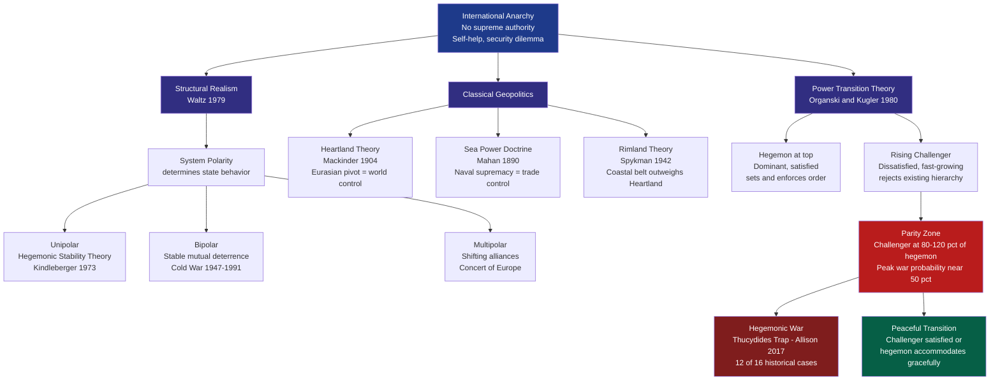

# Geopolitics and Power Politics

> [!abstract] TL;DR
> Geopolitics studies how geography, territory, and natural resources shape national power and foreign policy strategy. Power Politics (Realpolitik) holds that states pursue national interest through the rational management of power in an anarchic international system — unconstrained by morality. These two frameworks converge in **Power Transition Theory** (Organski & Kugler 1980): the highest risk of hegemonic war arises not when states are very unequal, but precisely when a dissatisfied challenger approaches **power parity** with the dominant hegemon — the moment captured by Allison's "Thucydides Trap."

---

## Intuition

**Analogy:** Think of the international system as a prison yard with no guards. Every prisoner (state) must secure their own safety — no external authority will protect them. The biggest prisoner (hegemon) set the informal rules: leave me alone and I will let you trade in my markets and use my currency. For decades, everyone accepts this because the dominant prisoner can enforce it. Now a second prisoner who has been working out (fast GDP growth) starts approaching the size of the dominant one. The yard gets tense. The original ruler fears displacement; the newcomer chafes under rules they had no say in setting. This is the essence of power politics: **anarchy + relative power + fear of the future**.

The geographical dimension adds another layer: just as a prisoner's cell block location (near the guards, near the food, near the exits) determines their strategic position, a state's physical geography — mountains, rivers, ocean access, resource endowments, proximity to rivals — shapes how it can project and protect power. Mackinder's 1904 observation that whoever controls the Eurasian heartland controls the world is the geographic version of the biggest prisoner controlling the best cell block.

---

## How It Works



---

## Key Concepts

### Secondary Level

**Geography as destiny — or at least constraint.** Every state's strategic choices are shaped by its physical position. Britain was protected from continental invasion by the English Channel and therefore invested in naval power rather than continental armies. Russia, with no natural western frontier, repeatedly sought buffer zones westward — from Peter the Great to Stalin to Putin. Germany, trapped between France and Russia, historically faced a two-front war problem that drove its grand strategy toward rapid offensive warfare.

**Classical geopolitical theories:**

| Theorist | Date | Core Claim | Strategic Implication |
|----------|------|-----------|----------------------|
| Friedrich Ratzel | 1897 | States need Lebensraum (living space) to grow; borders are organic, not fixed | Expansion is biologically necessary |
| Alfred T. Mahan | 1890 | Sea power — a strong navy + merchant fleet + overseas bases — creates national wealth and imperial reach | Build navies; control chokepoints (Suez, Panama, Hormuz) |
| Halford Mackinder | 1904 | Who rules the Heartland (Eurasia's inner core) rules the World Island; who rules the World Island rules the world | Stop any single power from dominating continental Eurasia — the logic behind NATO and containment |
| Karl Haushofer | 1920s | German Geopolitik combining Ratzel + Mackinder; Germany must control Eurasian Heartland | Provided intellectual cover for Nazi Drang nach Osten; later discredited |
| Nicholas Spykman | 1942 | Rimland thesis: the coastal crescent of Eurasia (Western Europe, Middle East, South and East Asia) matters more than the Heartland | US must control the Rimland, not just prevent Heartland domination — basis for containment strategy |
| Zbigniew Brzezinski | 1997 | Central Asia is the "Grand Chessboard"; US must prevent any Eurasian challenger by managing a web of dependencies | Supports NATO expansion, engagement with Ukraine, containing both Russia and China |

**Balance of power:** The oldest principle in international relations. States form alliances against the most powerful state (balancing), not necessarily the most threatening one (Walt's balance-of-threat variant). The Concert of Europe (1815-1914) was the institutionalised form: the great powers of Austria, Britain, France, Prussia/Germany, and Russia managed their competition through periodic conferences.

---

### Undergraduate Level

**Structural Realism (Waltz 1979).** The international system's *structure* — anarchy (no world government) plus the distribution of capabilities — determines state behavior, regardless of individual leaders or regime types. Under anarchy, states must help themselves; they worry about *relative* gains, not just absolute gains. This produces the **security dilemma**: one state's defensive arms build-up looks offensive to its neighbours, triggering a spiral of mutual armament even when neither side wants war.

**Polarity and stability.** Waltz argued *bipolarity* is the most stable configuration: only two superpowers, simple deterrence dynamics, no misperception about who to balance against. Multipolar systems are more war-prone (more uncertainty, more miscalculation). The Unipolar Moment (US after 1991) is potentially unstable because the hegemon faces no peer competitor to discipline it — overreach becomes tempting.

**Offensive Realism (Mearsheimer 2001).** States are never satisfied with the current distribution of power. They seek to maximise their share of world power because in an anarchic world, more power = more security. The *ideal* endgame is regional hegemony (like the US in the Western Hemisphere after 1900). When another regional hegemon emerges elsewhere, great powers engage as "offshore balancers" to prevent it.

**Power Transition Theory (Organski 1958, Organski & Kugler 1980).**

The international system is not anarchic but *hierarchical*: a dominant power sits at the top, content great powers below it, and dissatisfied minor powers at the bottom. War is most likely when:
1. A dissatisfied challenger has been growing faster than the hegemon
2. The challenger approaches **power parity** (approximately 80–120% of hegemon power)
3. The challenger continues to *overtake* (is still growing faster)

Power is measured as: $\text{Power} = \text{GDP} \times \text{RPC}$, where RPC (Relative Political Capacity) is the ratio of actual to expected government revenue extraction — a proxy for state effectiveness.

The empirical finding (The War Ledger, 1980): **the probability of hegemonic war when a dissatisfied challenger reaches parity is approximately 50%.**

**Hegemonic Stability Theory (Kindleberger 1973, Gilpin 1981).** A hegemon provides international public goods: open trade, a reserve currency (dollar/sterling), freedom of navigation, a lender of last resort during crises. When the hegemon declines, these goods are under-provided — Kindleberger blamed the Great Depression on the absence of a stable hegemon between Britain's decline and America's rise. Gilpin argues that hegemons bear disproportionate costs of maintaining order, which eventually weakens them — creating the conditions for a challenger to rise and fight to restructure the international order.

**Thucydides Trap (Allison 2017).** Named after Thucydides' explanation for the Peloponnesian War: "It was the rise of Athens and the fear that this instilled in Sparta that made war inevitable." Allison catalogued 16 cases of power transition since 1500: in **12 of 16 cases, war resulted**. The four peaceful cases (notably Britain accommodating the US in the early 20th century) all shared a key feature: the rising power was either satisfied with the existing order or was offered genuine accommodation.

**Hard, Soft, and Smart Power (Nye 1990, 2004).**

| Type | Instruments | Examples |
|------|------------|---------|
| Hard power | Military force, economic coercion, sanctions | US carrier groups; SWIFT exclusions |
| Soft power | Cultural attraction, values, institutions | Hollywood, universities, democracy promotion |
| Smart power | Calibrated combination of hard + soft | Marshall Plan (economic aid that also spread liberal values) |

**Grand Strategy** is the coherent, long-term plan that matches a state's *ends* (objectives) with its *ways* (diplomatic, military, economic instruments) and *means* (available resources). The US Cold War grand strategy — containment, articulated by George Kennan's "Long Telegram" (1946) and formalised in NSC-68 (1950) — is the canonical example: prevent Soviet expansion by maintaining a ring of alliances around the Soviet periphery, while waiting for internal contradictions to weaken the Soviet system.

---

### Graduate Level

**Rationalist Explanations for War (Fearon 1995).** If war is costly for both sides, why do rational states not always negotiate a deal that makes both better off than fighting? Fearon identified three causes that prevent bargaining from succeeding:

1. **Private information with incentives to misrepresent:** Each state has private information about its resolve and capabilities, and an incentive to bluff strength. This leads to bargaining failures and potentially war.
2. **Commitment problems:** Even if a deal exists today, it may not be credible tomorrow. If one state is growing rapidly, the other may prefer to fight now (preventive war) rather than accept an agreement it fears the rising state will renege on once powerful enough. This is the formal mechanism underlying Power Transition Theory's "parity zone" war risk.
3. **Issue indivisibility:** Some goods (Jerusalem; Taiwan) cannot be divided and shared — any deal requires one side to accept symbolically unacceptable terms.

**The commitment problem and power transitions.** The core PTT mechanism is a commitment problem: the declining hegemon cannot credibly commit not to exploit its window of advantage; the rising challenger cannot credibly commit to remain satisfied once it achieves parity. Preventive war logic says the hegemon should fight before being overtaken; revisionist-war logic says the challenger should strike while it has momentum. Neither can make binding agreements about their future behavior — and so the parity zone is dangerous.

**Empirical tests and critics of PTT.** Lemke & Werner (1996) extended PTT to regional subsystems; Rasler & Thompson (2000) examined the role of long economic cycles. Key criticisms:

- *Operationalising satisfaction* is extraordinarily difficult. How do we know who is "dissatisfied" before war? The theory risks circularity.
- *Nuclear weapons* fundamentally alter the calculation: two nuclear-armed states at power parity face mutual assured destruction, which should suppress direct conflict (Waltz). This may explain why the US-Soviet transition never became a hot war — and is relevant to any US-China confrontation.
- *Selection bias in the Thucydides Trap:* Allison's 16 cases were not randomly selected, and the definition of "power transition" and "war" involves significant judgment calls.
- *Alliance structures:* NATO, the US-Japan alliance, and US-South Korea alliance mean a US-China parity assessment based on bilateral GDP/RPC ratios understates the effective power of the US-led coalition.

**Contemporary US-China competition.** China's PPP-adjusted GDP exceeded that of the US around 2017 by some measures (market-rate GDP still favours the US). Xi Jinping's "new model of great power relations" (2013) asserts China as a satisfied power seeking mutual respect — but PRC actions in the South China Sea, Taiwan Strait, and Xinjiang suggest a revisionist agenda. The parity zone, by PTT logic, is approximately 2020–2040. Whether institutional engagement, economic interdependence, or nuclear deterrence can manage this transition is the defining strategic question of the 21st century.

---

## Python Demo

```python
import numpy as np
import matplotlib.pyplot as plt

# -----------------------------------------------------------------------
# Organski-Kugler Power Transition Model
# Power(state) = GDP(state) * RPC(state)
#   RPC = Relative Political Capacity (actual / expected government revenue)
# War risk peaks when  challenger power / hegemon power  ≈ 1.0  (parity zone)
# The War Ledger (Organski & Kugler, 1980):
#   P(war | parity + dissatisfied challenger) ≈ 0.50
# -----------------------------------------------------------------------

years = np.arange(1950, 2071)          # 121 annual time steps
t     = np.arange(len(years))

# --- Hegemon: starts at index 100, grows at 2 %/yr, high political capacity ---
hegemon = 100.0 * (1.02 ** t)

# --- Challenger: starts far behind, rapid growth that gradually decelerates ---
# Growth rate: g(t) = G_MIN + (G0 - G_MIN) * exp(-t / TAU)
# Mimics a developing economy with diminishing-returns catch-up dynamics
G0, G_MIN, TAU = 0.080, 0.025, 40     # initial 8 %, floor 2.5 %, decay constant 40 yr
challenger = np.zeros(len(t))
challenger[0] = 12.0                   # starts at 12 % of hegemon (post-WWII analogy)
for i in range(1, len(t)):
    g_i = G_MIN + (G0 - G_MIN) * np.exp(-t[i] / TAU)
    challenger[i] = challenger[i - 1] * (1.0 + g_i)

# --- Power ratio and Organski-Kugler war probability ---
ratio = challenger / hegemon

# War probability: Gaussian centred at parity (ratio = 1.0), sigma = 0.12
# Peak = 0.50 matching The War Ledger's empirical finding
P_PEAK, SIGMA = 0.50, 0.12
p_war = P_PEAK * np.exp(-((ratio - 1.0) ** 2) / (2 * SIGMA ** 2))

parity_year  = int(years[np.argmin(np.abs(ratio - 1.0))])
parity_zone  = (ratio >= 0.80) & (ratio <= 1.20)

# --- Plot ---
fig, (ax1, ax2) = plt.subplots(2, 1, figsize=(10, 8), sharex=True)

# Upper panel: power trajectories
ax1.plot(years, hegemon,    'b-', lw=2, label='Hegemon')
ax1.plot(years, challenger, 'r-', lw=2, label='Challenger (rising power)')
if parity_zone.any():
    ax1.axvspan(years[parity_zone][0], years[parity_zone][-1],
                alpha=0.15, color='orange', label='Parity zone (ratio 0.80-1.20)')
ax1.axvline(parity_year, color='#6b7280', ls='--', lw=1)
ax1.set_ylabel('Power Index  (GDP x RPC)')
ax1.set_title('Organski-Kugler Power Transition: GDP-Based Power Trajectories')
ax1.legend(loc='upper left')
ax1.grid(alpha=0.3)

# Lower panel: war probability
ax2.plot(years, p_war * 100, 'r-', lw=2, label='P(war | dissatisfied challenger)')
ax2.fill_between(years, p_war * 100, where=parity_zone,
                 color='red', alpha=0.25, label='Highest-risk window')
ax2.axhline(50, color='#6b7280', ls=':', lw=1.5, label='50% ceiling (War Ledger)')
ax2.axvline(parity_year, color='#6b7280', ls='--', lw=1,
            label=f'Parity ~{parity_year}')
ax2.set_xlabel('Year')
ax2.set_ylabel('War Probability (%)')
ax2.set_title('War Risk Peaks at Power Parity — Then Declines as Challenger Dominates')
ax2.set_ylim(0, 60)
ax2.legend(loc='upper left')
ax2.grid(alpha=0.3)

plt.tight_layout()
plt.show()

print(f"Parity year:          {parity_year}")
print(f"Peak war probability: {p_war.max() * 100:.1f}%")
if parity_zone.any():
    print(f"Parity zone span:     {years[parity_zone][0]} to {years[parity_zone][-1]}")
```

**What the model shows:** War probability is *not* highest when the gap is largest (early years) or when the challenger has clearly won (late years). It peaks precisely during the **transition window** — when neither state can be confident of its own advantage, and the declining hegemon has the strongest incentive to fight a preventive war before it is too late.

---

## Real-World Applications

**1. US Cold War Containment (1947–1991).** The archetypal grand strategy application of Spykman's Rimland thesis. The US organised a network of alliances (NATO in Western Europe, US-Japan in East Asia, SEATO in Southeast Asia) to prevent the Soviet Union from dominating the Eurasian coastal belt. Kennan's containment doctrine was fundamentally geopolitical: hold the Rimland, let the Heartland power exhaust itself.

**2. US-China Competition (2010-present).** The defining power transition of the 21st century. China's GDP growth (averaging ~9% from 1980–2010, ~6% from 2010–2019) is the most dramatic challenger surge in the historical record. Allison (2017) placed this as the 17th case in his Thucydides Trap series. The US response — the "Pivot to Asia" (2011), AUKUS (2021), CHIPS Act (2022), de-risking supply chains — reflects a combination of soft internal balancing and alliance-based external balancing.

**3. Russia's Near-Abroad Strategy.** Russia's 2022 invasion of Ukraine is explicable in Mackinderian terms: NATO expansion into Eastern Europe threatens the buffer zone that Russia historically required to protect the Heartland from western penetration. Putin's stated rationale — that Ukraine represents an existential threat — maps onto classic Heartland logic, even if the execution was catastrophically miscalculated.

**4. South China Sea and Mahanian Sea Power.** China's island-building campaign in the Spratlys and Paracels, its PLAN (People's Liberation Army Navy) expansion, and its carrier programme all reflect absorption of Mahan's doctrine: control of the Western Pacific sea lanes is the prerequisite for regional hegemony. The US response (freedom of navigation operations) asserts Mahanian sea power in return.

**5. Dollar Hegemony as Structural Power.** The US benefits from the "exorbitant privilege" (Giscard d'Estaing's phrase) of issuing the world's reserve currency: it can run persistent current account deficits and borrow cheaply. This is a form of structural economic hard power that is difficult to measure in PTT's GDP × RPC formula but is central to hegemonic stability theory. China's CIPS payment system, yuan internationalisation, and digital yuan are challenges to this structural dimension of US power.

---

## Common Pitfalls

- **Geographic determinism.** Geopolitics is probabilistic, not deterministic. Mackinder himself acknowledged that technology (aviation, missiles) could alter the Heartland calculus. A state's geography constrains but does not fully determine its foreign policy — domestic politics, leadership ideology, and institutional factors all matter.

- **Ignoring the satisfaction variable.** PTT's most important and least operationalised variable is dissatisfaction. The Britain-to-US power transition was peaceful precisely because the US was largely satisfied with the British-led international order (free trade, rule of law, shared language and values). When analysts focus only on the power ratio and ignore the orientation of the challenger, they systematically overestimate war risk.

- **Treating nuclear parity as indistinguishable from conventional parity.** Waltz's nuclear deterrence argument substantially complicates PTT: two nuclear states approaching conventional parity still face mutual assured destruction. The US and Soviet Union reached conventional parity in the early 1970s without fighting a direct war — because nuclear weapons created a separate deterrent floor. Any PTT application to nuclear-armed rivals needs to account for this.

- **Allison's 12/16 base rate.** The Thucydides Trap's 75% war rate involves significant case selection subjectivity (which transitions count? what counts as war?). The sample is small and non-random. The 75% figure should be treated as an illustrative heuristic, not a probability estimate.

- **Conflating relative and absolute power.** Hegemonic Stability Theory focuses on the absolute power of the hegemon (can it afford to provide global public goods?). PTT focuses on the relative power ratio. Balance of Power theory focuses on the distribution across all great powers. Using the wrong metric for the wrong question produces misleading conclusions.

- **Neglecting economic interdependence.** Liberals argue that deep trade and financial ties raise the costs of war, potentially suppressing the PTT mechanism. The US and China in 2024 have over $700B in bilateral trade annually. Whether this interdependence is "weaponisable" (Farrell & Newman 2019) or pacifying is the central empirical debate in contemporary IR.

---

## Related Concepts

- [[Nash_Equilibrium]] — strategic interdependence between great powers is an iterated game; equilibria explain why arms races and alliance formation emerge even without malicious intent
- [[Repeated_Games_and_Folk_Theorems]] — international cooperation (trade agreements, arms control treaties) is sustained by the shadow of future retaliation; the folk theorem explains why international norms can persist without enforcement
- [[Bargaining_Theory]] — crisis bargaining models formalise the PTT commitment problem: when can states credibly signal resolve and reach peaceful settlements vs. when does bargaining break down into war
- [[Solow_Growth_Model]] — differential GDP growth rates between states are the driver of power transitions; the Solow model explains why developing economies can sustain higher growth rates (convergence) until they approach the frontier
- [[GDP_and_Measurement]] — the primary power metric in Organski-Kugler; PPP-adjusted vs. market-rate GDP gives dramatically different estimates of the US-China power ratio
- [[Balance_of_Payments]] — current account positions, reserve accumulation, and capital flows are instruments of economic statecraft; dollar hegemony is a balance-of-payments phenomenon
- [[Economic_Geology_and_Resources]] — resource geography (oil, rare earth elements, water) underlies geopolitical competition; control of critical resources has motivated territorial expansion from 19th-century imperialism to contemporary Arctic claims
- [[Continental_Drift_and_the_Plate_Tectonics_Revolution]] — the physical geography that determines strategic geography (mountain ranges as natural frontiers, river systems as invasion corridors, peninsulas as sea power projection platforms) is a product of tectonic history
- [[Oligopoly]] — great power competition is structurally analogous to strategic oligopoly: a small number of states with interdependent payoffs, each choosing strategies (arms, alliances, trade) in response to others; Cournot and Bertrand models map onto arms race and trade war dynamics
- [[Decision_Making_and_Reward_Circuits]] — political leaders make war-and-peace decisions under risk and uncertainty; prospect theory (Kahneman-Tversky) predicts that loss-averse leaders facing power decline will accept gambles that expected-utility theory says they should refuse — a micro-foundation for preventive war logic

---

## Review Questions

### Secondary

1. Russia has fought multiple wars throughout history to secure access to warm-water ports (Black Sea, Baltic Sea, Pacific). Using Mahan's sea power theory and Mackinder's Heartland concept, explain why geographic factors have consistently driven Russian foreign policy expansionism. What geographic constraints make Russia simultaneously a land power and a frustrated naval power?

2. During the Cold War, the US maintained alliances in Western Europe (NATO), East Asia (US-Japan), and Southeast Asia (SEATO). Identify which classical geopolitical theory — Mackinder's Heartland or Spykman's Rimland — best explains this global alliance structure, and defend your answer with specific geographic reasoning.

### Undergraduate

3. Waltz (1979) argued that bipolarity is more stable than multipolarity, while Mearsheimer (2001) argued that multipolarity with a clear potential hegemon is the most dangerous configuration. Using historical evidence from the Concert of Europe (1815-1914) and the Cold War (1947-1991), evaluate these competing claims. What empirical evidence could adjudicate between them?

4. The Britain-to-United States power transition (approximately 1870-1945) is one of only four peaceful transitions in Allison's 16-case dataset. Apply Power Transition Theory to explain both (a) why the transition was expected to be dangerous and (b) what factors enabled it to remain peaceful. What does this case imply for the US-China transition today?

### Graduate

5. James Fearon (1995) argues that war is a costly gamble that rational states should almost always prefer to avoid through negotiated settlement. Using Fearon's three rationalist explanations (private information, commitment problems, issue indivisibility), construct a formal account of why power parity creates a particularly high risk of war in Organski-Kugler's framework. Which of Fearon's three mechanisms is most central to PTT, and why?

6. Critics of Power Transition Theory argue that nuclear weapons fundamentally break the model: once both states in a dyad possess second-strike nuclear capability, the parity zone should not be especially dangerous because MAD deters direct conflict. Evaluate this critique. Does the historical record (US-Soviet competition from 1945-1991; India-Pakistan tensions) support the nuclear correction? What modifications to PTT would you propose to incorporate nuclear deterrence while preserving the model's core logic?

---

## Sources

- [Mackinder, H.J. (1904). "The Geographical Pivot of History." *Geographical Journal*](https://www.jstor.org/stable/1775498)
- [Organski, A.F.K. & Kugler, J. (1980). *The War Ledger*. University of Chicago Press](https://www.ucpress.edu/book/9780520036826/the-war-ledger)
- [Waltz, K. (1979). *Theory of International Politics*. McGraw-Hill](https://www.waveland.com/browse.php?t=243)
- [Mearsheimer, J.J. (2001). *The Tragedy of Great Power Politics*. Norton](https://wwnorton.com/books/9780393349276)
- [Fearon, J. (1995). "Rationalist Explanations for War." *International Organization* 49(3)](https://www.cambridge.org/core/journals/international-organization/article/rationalist-explanations-for-war/B0A2BB00CBAE7FE4F7DE1C89E3F08EA6)
- [Allison, G. (2017). *Destined for War: Can America and China Escape Thucydides's Trap?* Houghton Mifflin Harcourt](https://www.thucydidestrapproject.com/)
- [Nye, J. (2004). *Soft Power: The Means to Success in World Politics*. PublicAffairs](https://en.wikipedia.org/wiki/Soft_Power_(book))
- [Kindleberger, C. (1973). *The World in Depression, 1929-1939*. University of California Press](https://www.ucpress.edu/book/9780520275850/the-world-in-depression-1929-1939)
- [Brzezinski, Z. (1997). *The Grand Chessboard: American Primacy and Its Geostrategic Imperatives*. Basic Books](https://www.basicbooks.com/titles/zbigniew-brzezinski/the-grand-chessboard/9780465027309/)
- [Spykman, N. (1942). *America's Strategy in World Politics*. Harcourt Brace](https://www.taylorfrancis.com/books/mono/10.4324/9781315528496/america-s-strategy-world-politics-nicholas-spykman)

---

#PoliticalScience #InternationalRelations #Geopolitics #PowerPolitics #Realism #Hegemony #PowerTransition #GrandStrategy #ThucydidesTrap
