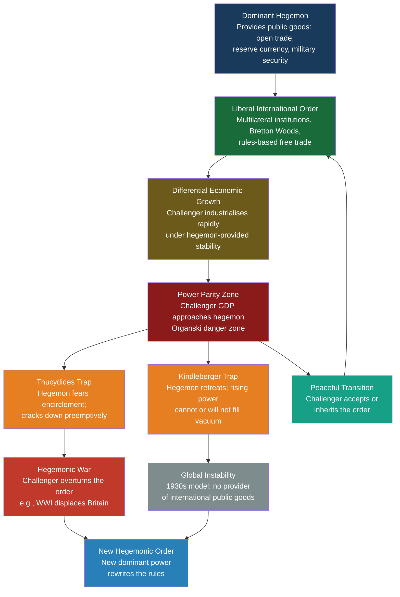

# Global Order and Hegemony

> [!abstract] TL;DR
> A hegemon is the single state powerful enough to set and enforce the rules of the international system; hegemonic stability theory holds that such a dominant power must actively supply global public goods — open trade, a stable reserve currency, security — or the whole system degrades into the protectionism and financial chaos of the 1930s. When a challenger's GDP approaches the hegemon's (the Organski danger zone), the risk of hegemonic war surges — Graham Allison's "Thucydides Trap" — unless both powers can negotiate a managed transition.

---

## Intuition

**Analogy:** Imagine a vast highway network with no national authority to maintain it. One wealthy city-state — call it Hegemon City — funds the roads, sets the traffic code, patrols the routes, and accepts the currency that pays every toll. All other cities trade freely because the roads are open and the rules are enforced. Over decades, a fast-growing rival city — Challenger City — industrialises under the protection of those very roads, grows enormously wealthy, and eventually asks: "Why does Hegemon City write all the rules?" Hegemon City, nervous, begins closing lanes to slow the challenger down. Now neither city can move goods freely. The highway system itself — the shared infrastructure everyone depended on — begins to fail. This is hegemonic transition: the most dangerous inflection point in world politics.

In the international system, the roads are open sea lanes, the rules are WTO trade law and IMF monetary frameworks, and the toll currency is the US dollar. The core tension: the hegemon's dominance created the conditions under which its challenger could rise.

---

## How It Works



---

## Key Concepts

### Secondary Level

**What is a Hegemon?**

A hegemon is a state so dominant in military power, economic output, and normative reach that it can unilaterally shape the rules of the international system and enforce compliance. Hegemony is not mere great-power status — it requires the combination of preponderant capability and the *will* to deploy it in service of a broader order. The British Empire from roughly 1815–1914 (Pax Britannica) and the United States from 1945 to the present (Pax Americana) are the two canonical modern examples.

**Why Does Order Require a Hegemon?**

Charles Kindleberger's foundational 1973 study of the Great Depression identified the structural problem: the international economy requires someone to act as lender of last resort in crises, keep markets open during downturns, and manage the reserve currency. Britain did this through the nineteenth century. After WWI, Britain was too weakened to continue; the United States was unwilling to take over. Neither power provided these stabilising functions — and the result was the collapse of the gold standard, the spread of protectionist tariff wars (Smoot-Hawley 1930), and the Great Depression. Kindleberger's verdict: instability arose not from the absence of capability but from the *absence of leadership*.

**The Three Core Public Goods a Hegemon Provides:**

| Public Good | Description | Modern Provider |
|---|---|---|
| Open trade regime | Maintains free-trade rules even under domestic protectionist pressure; absorbs surplus exports from weaker states | WTO, with US as underwriter |
| Reserve currency and liquidity | Issues the currency others hold as reserves; acts as lender of last resort in global crises | US dollar, Federal Reserve swap lines |
| Security and enforcement | Polices sea lanes, deters aggression, backstops alliance commitments | US Navy, NATO Article 5 |

**Gramsci's Hegemony: Consent, Not Just Power**

Antonio Gramsci — an Italian Marxist writing from a fascist prison in the 1930s — made a distinction that international relations scholars later imported wholesale: hegemony is not pure domination but *consensual leadership*. The dominant class (or state) maintains its position by making its particular interests appear as the universal interest. Robert Cox applied this to world politics: US post-war hegemony succeeded not merely because of military superiority but because the liberal international order — Bretton Woods, the UN, free trade — was genuinely attractive to other states. They consented because they benefited (or believed they did). This "manufacturing of consent" is Gramsci's contribution: you cannot fully explain hegemony by counting battleships.

---

### Undergraduate Level

**Hegemonic Stability Theory: Kindleberger and Gilpin**

Kindleberger's economic public-goods argument was generalised into a full-scale political theory by Robert Gilpin in *War and Change in World Politics* (1981). Gilpin's synthesis:

1. **Hegemonic rise**: A dominant power emerges, creates a liberal international order reflecting its values and interests, and bears the disproportionate costs of maintaining it.
2. **Differential growth**: The hegemon's own economic dynamism and the stability it provides accelerate growth in other states — including eventual challengers. The hegemon's relative share of world output erodes over time (Kennedy's *imperial overstretch*).
3. **Hegemonic decline**: As costs mount and benefits diffuse, the hegemon can no longer or will no longer fund global public goods. Free-riding by lesser states accelerates the fiscal burden.
4. **Hegemonic war**: The gap between the declining hegemon and the rising challenger closes. Structural stress produces the conditions for hegemonic war — a system-transforming conflict that installs a new leader.

Robert Keohane's *After Hegemony* (1984) challenged the most fatalistic version: international institutions created by hegemons can persist even after relative power declines, because they reduce transaction costs and lengthen the shadow of the future. States continue cooperating not from benevolence but from the institutionalised logic already embedded in the system.

**The Liberal International Order (Ikenberry)**

G. John Ikenberry's *Liberal Leviathan* (2011) argues that the Pax Americana was distinctive among hegemonic orders: it was an *open, rules-based, multilateral* order in which the hegemon voluntarily constrained itself through institutions (NATO, GATT, IMF, World Bank). By binding itself to rules, the US made its power more legitimate and less threatening — other states were more willing to integrate into the order because they could not be arbitrarily coerced.

The three pillars of the Liberal International Order (LIO):

| Pillar | Institutions | Key Feature |
|---|---|---|
| Economic openness | GATT/WTO, IMF, World Bank | Non-discrimination, most-favoured-nation, free capital flows |
| Security alliances | NATO, US-Japan treaty, ANZUS | Extended deterrence; US umbrella reduces allies' need to arm independently |
| Political norms | UN Charter, Universal Declaration of Human Rights, R2P | Sovereignty and (increasingly) human rights |

Ikenberry's optimism: the LIO is "sticky" — even as US power declines relatively, the institutional infrastructure and the norms it embeds make a return to pure balance-of-power competition less likely.

**Paul Kennedy: Imperial Overstretch**

In *The Rise and Fall of the Great Powers* (1987), Paul Kennedy advanced a sweeping historical argument: great powers decline when their strategic commitments outpace their economic base. Britain maintained a global empire on an industrial economy that Germany and the United States were surpassing by 1900. The USSR maintained a massive military establishment on an economy one-seventh the size of the US economy. The US, Kennedy controversially argued (before the Cold War ended), faced similar overstretch: military commitments from Western Europe to Northeast Asia and the Middle East rested on a relative economic share that was declining from its 1945 peak.

Kennedy's contribution: *economic foundations determine long-run strategic capacity*. Military power is derived power; it ultimately rests on economic surplus.

**Polarity and Stability: Unipolar, Bipolar, Multipolar**

The distribution of power across states shapes the character of the international order:

| System Type | Definition | Stability Claim | Historical Example |
|---|---|---|---|
| **Unipolar** | One dominant power with preponderant capabilities | Realists disagree: Wohlforth argues stability; Waltz predicts balancing coalition | Post-1991 (US unipolar moment) |
| **Bipolar** | Two near-equal superpowers | Waltz: most stable — fewer miscalculation points, clear deterrence | Cold War 1947–1991 |
| **Multipolar** | Three or more major powers | Classical realists: unstable — more alliances, more miscalculation | Pre-WWI Europe, 1815–1914 Concert |
| **Non-polar** | Many actors, diffuse power | Haass: emerging post-US order; coordination harder than ever | Current transition? |

---

### Graduate Level

**Power Transition Theory: Organski and Kugler**

A. F. K. Organski's *World Politics* (1958) and his collaboration with Jacek Kugler in *The War Ledger* (1980) introduced power transition theory as a challenge to balance-of-power thinking. The core claims:

1. The international system is *hierarchically ordered* — not anarchic in the Waltzian sense — with a dominant power at the apex, a tier of great powers, middle powers, and small states below it.
2. **Uneven development**: States grow at different rates. A rising challenger can overtake the hegemon over decades of differential economic growth.
3. **The danger zone**: War risk is highest when a *dissatisfied* rising power reaches **approximately 80% of the dominant power's capabilities** — the "power parity" zone. Below that level, the challenger cannot win; above it, the hegemon cannot credibly resist. The inflection point is the most dangerous moment.
4. **Satisfaction vs. revision**: The critical variable distinguishing transition from war is whether the challenger is a *status-quo* power (satisfied with the existing order's distribution of benefits) or a *revisionist* power (seeking to overturn it). A satisfied rising power can be accommodated; a revisionist one is on a collision course.

The Kugler-Organski model predicts that power parity + dissatisfaction = war. It successfully retrodict WWI (Germany challenging Britain/France), the Sino-Soviet split (China dissatisfied with Soviet hierarchy), and plausibly frames the current US-China competition.

**The Thucydides Trap: Graham Allison**

Graham Allison's *Destined for War: Can America and China Escape Thucydides's Trap?* (2017) popularised the concept. Thucydides wrote of the Peloponnesian War: "It was the rise of Athens and the fear that this instilled in Sparta that made war inevitable." Allison operationalised this: in 12 of 16 historical cases where a rising power challenged an established one over the past 500 years, war resulted.

The mechanism is psychological as much as structural:
- The **hegemon's fear**: as the challenger grows, the incumbent feels its position eroding, its credibility weakening, its allies hedging. The temptation to act preventively while it still can ("better war now than later, when we're weaker") is acute.
- The **challenger's resentment**: the rising power increasingly chafes at an order it did not design and in which its status does not reflect its capabilities. It seeks "appropriate" recognition and influence.
- **Miscalculation**: both sides signal resolve, each interprets the other's signals as aggression, and the spiral of mutual provocation escalates into a crisis neither fully intended.

Allison's four non-war cases show peaceful transition is possible — but requires extraordinary statecraft, often involving the challenger accepting the existing order rather than overturning it (as Germany failed to do in 1914 and Japan failed to do in 1941).

**The Kindleberger Trap: Joseph Nye**

Joseph Nye coined the "Kindleberger Trap" in a 2017 Project Syndicate essay: if the United States retreats from global leadership (as under an "America First" posture), and China is not yet capable of or willing to fill the vacuum, the result is the 1930s scenario — a leadership vacuum that allows protectionism, financial instability, and aggression to spread unchecked.

The trap has two conditions:
1. The **established hegemon** is unwilling or unable to supply global public goods (either from decline, domestic politics, or ideological retreat).
2. The **rising challenger** lacks the capacity, the network of allies, or the normative legitimacy to replace the hegemon's provision.

The trap is distinct from the Thucydides Trap: the Thucydides Trap is about war; the Kindleberger Trap is about the public-goods gap that opens when neither power leads. Both can occur simultaneously, and both are features of the current US-China transition.

**Revisionist vs. Status-Quo Powers**

A central diagnostic in hegemonic transition theory: is the challenger revisionist (seeking to overturn the existing order) or status-quo (seeking a larger share of benefits within the existing order)?

- **China as ambiguous**: China has benefited enormously from the liberal international order (WTO accession, export-led growth). It is not obviously revisionist in the Hitlerian sense. Yet it is building alternative institutions (AIIB, BRI), establishing military facts in the South China Sea, and advocating a "pluralistic" world order that would reduce US normative dominance. Ikenberry calls this "partial revisionism": accepting economic openness while contesting political-normative elements.
- **The distinction matters**: A status-quo rising power can be accommodated within existing institutions (as the US was accommodated within the British-led order post-1918 — imperfectly). A fully revisionist power must be deterred or defeated.

**The Gramscian-Coxian Counter-Hegemony Framework**

Robert Cox, drawing on Gramsci, argued that hegemonic orders are not merely material power arrangements but **historic blocs** — coalitions of social forces, state institutions, and ideas that stabilise a particular world order. Counter-hegemony emerges when subordinate states and social forces develop an alternative "common sense." BRICS, China's discourse of "multipolarity" and "non-interference," and the Global South's resistance to Western conditionality in IMF lending are early signs of counter-hegemonic bloc formation — not yet sufficient to overturn the LIO, but eroding its normative consensus.

---

## Python Demo

```python
import numpy as np
from scipy.integrate import solve_ivp
import matplotlib.pyplot as plt

# ── Hegemonic Power Transition Simulation ─────────────────────────────────
# Model GDP trajectories using logistic growth: dP/dt = r * P * (1 - P/K)
# P = GDP in USD trillions (PPP-adjusted), K = carrying capacity, r = growth rate
# Calibrated to approximate 2024 baselines; projections are illustrative

def logistic_growth(t, P, r, K):
    return r * P * (1.0 - P / K)

# 2024 approximate GDP PPP baselines and growth parameters
powers = {
    "US":     {"P0": 27.0, "r": 0.020, "K": 48.0, "color": "#1f77b4"},
    "China":  {"P0": 19.0, "r": 0.042, "K": 58.0, "color": "#d62728"},
    "EU":     {"P0": 20.0, "r": 0.016, "K": 36.0, "color": "#2ca02c"},
    "India":  {"P0": 4.5,  "r": 0.062, "K": 42.0, "color": "#ff7f0e"},
}

t_span = (0, 40)          # 2024 to 2064
t_eval = np.linspace(*t_span, 600)
years = 2024 + t_eval

results = {}
for name, params in powers.items():
    sol = solve_ivp(
        logistic_growth,
        t_span,
        [params["P0"]],
        args=(params["r"], params["K"]),
        t_eval=t_eval,
        method="RK45",
        rtol=1e-8,
    )
    results[name] = sol.y[0]

# Relative power shares (Organski uses share of total system capabilities)
total_gdp = sum(results.values())
shares = {name: gdp / total_gdp * 100 for name, gdp in results.items()}

# Danger zone: Organski criterion — challenger reaches 80% of hegemon's GDP
danger_ratio = results["China"] / results["US"]
danger_mask = danger_ratio >= 0.80   # parity zone

# ── Plot ───────────────────────────────────────────────────────────────────
fig, (ax1, ax2, ax3) = plt.subplots(3, 1, figsize=(12, 14))

# Panel 1: Absolute GDP trajectories
for name, params in powers.items():
    ax1.plot(years, results[name], label=name, color=params["color"], linewidth=2.2)
ax1.set_ylabel("GDP (USD Trillion, PPP)", fontsize=11)
ax1.set_title(
    "Power Transition Simulation: GDP Trajectories 2024-2064\n"
    "(Logistic Growth — Illustrative Parameters)",
    fontsize=12,
)
ax1.legend(fontsize=10)
ax1.grid(True, alpha=0.3)
ax1.set_xlabel("Year")

# Panel 2: Relative power shares
for name, params in powers.items():
    ax2.plot(years, shares[name], label=name, color=params["color"], linewidth=2.2)
# Highlight danger zone on share plot
if danger_mask.any():
    ax2.fill_between(
        years, 0, 50, where=danger_mask,
        alpha=0.18, color="red",
        label="Organski Danger Zone (China >= 80% of US GDP)",
    )
ax2.set_ylabel("Share of 4-Power Total GDP (%)", fontsize=11)
ax2.set_title("Relative Power Shares and Hegemonic Danger Zone", fontsize=12)
ax2.legend(fontsize=9)
ax2.grid(True, alpha=0.3)
ax2.set_xlabel("Year")

# Panel 3: China/US GDP ratio — the Thucydides meter
ax3.plot(years, danger_ratio * 100, color="#8b1a1a", linewidth=2.5, label="China/US GDP Ratio")
ax3.axhline(80, color="orange", linestyle="--", linewidth=1.8, label="Organski Danger Threshold (80%)")
ax3.axhline(100, color="red", linestyle="--", linewidth=1.8, label="Full Parity (100%)")
ax3.fill_between(years, 80, danger_ratio * 100, where=danger_mask, alpha=0.2, color="red")
ax3.set_ylabel("China GDP as % of US GDP", fontsize=11)
ax3.set_title("Thucydides Meter: China/US Capability Ratio", fontsize=12)
ax3.legend(fontsize=10)
ax3.grid(True, alpha=0.3)
ax3.set_xlabel("Year")
ax3.set_ylim(50, 130)

plt.tight_layout()
plt.savefig("power_transition_simulation.png", dpi=150)
plt.show()

# ── Key transition moments ─────────────────────────────────────────────────
if danger_mask.any():
    danger_start_year = years[np.where(danger_mask)[0][0]]
    print(f"Danger zone entry (China reaches 80% of US GDP): ~{danger_start_year:.0f}")
else:
    print("China does not reach the danger threshold within the 40-year window.")

parity_idx = np.argmin(np.abs(results["US"] - results["China"]))
print(f"US-China GDP parity (PPP): ~{years[parity_idx]:.0f}")

india_parity_idx = np.argmin(np.abs(results["US"] - results["India"]))
print(f"India-US GDP parity (PPP): ~{years[india_parity_idx]:.0f}")
```

**Reading the output:**
- **Panel 1** shows absolute GDP: China's logistic curve overshoots the US under these parameters before both converge to their respective carrying capacities (K).
- **Panel 2** shows the power-share zero-sum: every point China gains is shared between US, EU, and India losses in relative terms.
- **Panel 3** is the "Thucydides meter" — the red shaded region marks the danger zone. When the line enters the shaded area, Organski's model predicts maximum war risk.
- The simulation is illustrative: real parameters are contested (China's slowdown post-2024, India's demographic dividend). Change `r` and `K` to stress-test different scenarios.

---

## Real-World Applications

**Pax Britannica (1815–1914): The Template**

Britain after the Napoleonic Wars emerged as the world's first genuine industrial hegemon. It managed the international order through: (1) the gold standard — sterling as the world's reserve currency, the Bank of England as implicit lender of last resort; (2) the Royal Navy's dominance of sea lanes; (3) free trade ideology backed by Britain's domestic commitment to unilateral tariff reduction (the Corn Laws repeal, 1846). The system produced a century of relative great-power peace (the Concert of Europe). It began unravelling after 1900 as Germany, the US, and Japan outpaced British industrial growth. Kennedy's overstretch argument finds its clearest confirmation here: British strategic commitments to India, the Far East, and the Western Hemisphere could not be funded by a declining industrial share. The outcome was WWI — the Gilpinian hegemonic war that terminated the British order.

**Bretton Woods and the Pax Americana (1944–1971): Institutional Hegemony**

The 1944 Bretton Woods conference — held as WWII approached its end — was a conscious act of hegemonic institution-building. The US, holding two-thirds of the world's monetary gold, designed a system of fixed exchange rates pegged to the dollar at USD 35 per ounce of gold, with the IMF providing liquidity support and the World Bank funding reconstruction. This was not purely altruistic: a stable, open international economy served US export and financial interests. The Marshall Plan ($13B, 1948–1952) rebuilt European purchasing power for US goods. The result: unprecedented economic growth in Western Europe and Japan — the very growth that eventually eroded US relative dominance (Triffin Dilemma: to supply world liquidity, the US ran persistent current account deficits, eventually making the gold peg unsustainable). Nixon's 1971 closure of the gold window ended Bretton Woods but not dollar hegemony — the petrodollar system and US Treasury market kept the dollar central.

**The Post-Cold War Unipolar Moment (1991–2008): Wohlforth's Stability Thesis**

William Wohlforth argued in 1999 that unipolarity was more durable than realists expected because the gap between the US and the next tier of states was so large — military, economic, technological — that balancing coalitions were impractical. The US could use this window to lock in liberal institutions (NATO expansion, WTO Chinese accession, bilateral security treaties). The 2003 Iraq War tested this: the US demonstrated that unipolar power could project force unilaterally, but also that such projection was domestically costly and internationally delegitimising — supporting the Gramscian point that hegemony requires consent, not just capability.

**The US-China Transition (2008–Present): Both Traps Simultaneously**

The 2008 financial crisis accelerated relative shifts: China's rapid fiscal stimulus and continued growth contrasted with Western recession. By 2010, China had become the world's second-largest economy. The Trump administration's 2018-2019 tariff war and the Biden administration's CHIPS Act and Inflation Reduction Act represent a partial US retreat from the free-trade principles of its own hegemonic order — validating the Kindleberger Trap concern. Simultaneously, Chinese military expansion in the South China Sea, Taiwan Strait tensions, and BRI infrastructure diplomacy display the revisionist ambiguity Ikenberry identifies. Graham Allison's danger-zone analysis puts US-China in historically unprecedented territory: the first time a non-Western, non-democratic challenger has approached parity with the leading Western liberal hegemon.

---

## Common Pitfalls

- **Conflating hegemony with imperialism** — A hegemon shapes the international system through structural dominance and institutional leadership, not necessarily through territorial colonisation. The Pax Americana was hegemonic without being colonial in the formal sense; confusing the two misidentifies both the mechanism and the potential transition pathways.

- **GDP parity as the only metric** — Organski's danger zone is GDP-based, but actual capabilities include nuclear arsenals, military technology, alliance networks, soft power, and financial integration. China's GDP may approach the US's before its military-technological or institutional reach does. Single-variable power indices consistently mislead; power is multidimensional.

- **Assuming hegemonic decline is inevitable or linear** — Kennedy's "imperial overstretch" is a long-run tendency, not a deterministic law. The US "declinism" argument was prominent in the late 1980s (Japan as rising hegemon), yet US primacy was restored by the 1990s IT boom. Technological innovation can reverse apparent structural decline — it is a key variable Organski's static model underweights.

- **Treating the Thucydides Trap as deterministic** — Allison himself emphasises 4 of 16 cases ended without war; his point is not that war is inevitable but that it is dangerously likely without deliberate management. Citing only "12 of 16 ended in war" while ignoring the four exceptions (including the Cold War) overstates the structural determinism.

- **Ignoring domestic politics within the hegemon** — Hegemonic stability theory treats the hegemon as a unitary rational actor. In reality, the willingness to provide global public goods is a domestic political question: "America First" protectionism, European integration failures, and British withdrawal from Empire were all driven by domestic coalitions, not only by relative power shifts. Putnam's two-level games framework is essential.

- **Confusing the Kindleberger Trap with the Thucydides Trap** — These are distinct failure modes. The Thucydides Trap is about war risk from rivalry. The Kindleberger Trap is about the public-goods vacuum created by leadership transition. They can coexist, but conflating them produces confused policy recommendations: deterring war (the Thucydides response) may accelerate the public-goods vacuum (the Kindleberger problem) if it prevents the challenger from taking on global responsibilities.

---

## Related Concepts

- [[International_Relations_Theories]] — Hegemonic stability theory sits at the intersection of neorealism (power drives order) and neoliberal institutionalism (institutions outlast hegemony); the Gramscian dimension is critical IR theory applied to world order.
- [[International_Institutions_and_Multilateralism]] — Keohane's "after hegemony" argument is the neoliberal answer to hegemonic decline: WTO, IMF, and NATO persist because their institutional logic is now self-sustaining.
- [[The_State_System_and_Sovereignty]] — The Westphalian state system is the structural backdrop; hegemonic orders operate atop formal sovereignty equality by exploiting material inequality.
- [[Nash_Equilibrium]] — The hegemonic order is a coordination equilibrium: all states benefit from the hegemon-provided rules even though they could defect on any individual commitment; transition disrupts this equilibrium.
- [[Repeated_Games_and_Folk_Theorems]] — Keohane's institutional persistence argument is the folk theorem applied to international cooperation: the shadow of the future sustains compliance after the hegemon's coercive enforcement capacity declines.
- [[Bargaining_Theory]] — Power transition theory is a special case of crisis bargaining: war occurs when declining hegemon and rising challenger cannot credibly commit to a negotiated transfer of privilege (commitment problem).
- [[Power_Indices]] — Formal measurement of voting power in multilateral institutions (UN Security Council, IMF quota system) operationalises the hegemon's structural advantage within international organisations.
- [[Public_Goods]] — Kindleberger's core framework: open trade, reserve currency, and security are non-excludable and non-rival goods that only a hegemon has the incentive and capability to provide unilaterally.
- [[Balance_of_Payments]] — The Triffin Dilemma (a country supplying the world's reserve currency must run current account deficits, eventually undermining confidence in that currency) links US hegemonic power directly to its BOP structure.
- [[Exchange_Rates]] — The Bretton Woods fixed-rate system and the post-1971 petrodollar arrangement are the monetary architecture of US hegemonic order; exchange-rate regimes reflect and reinforce the distribution of monetary power.
- [[Currency_Crises]] — Reserve currency challenges (e.g., 1971 dollar crisis, 1992 ERM crisis, 2008 dollar funding squeeze) are episodes of hegemonic monetary stress; swap lines and IMF bailouts are the hegemon's crisis-management toolkit.
- [[Development_Economics]] — Differential growth rates — the engine of power transition — are explained by the catch-up dynamics at the core of development theory; Organski's danger zone is essentially a development economics finding applied to security.
- [[Solow_Growth_Model]] — The conditional convergence prediction (poorer countries grow faster toward their steady state) underlies the empirical regularity that challengers industrialise faster than incumbents, mechanically driving hegemonic transitions.

---

## Review Questions

### Secondary

1. Why did the world economy collapse in the 1930s, according to Kindleberger? What role did the US play, and what does this tell us about what a hegemon must do to maintain international stability?
2. Britain was the dominant world power in 1850. By 1914 it was in relative decline. What caused this decline, and how does Paul Kennedy explain the link between economics and military power?
3. What is the "Thucydides Trap"? Use the example of Athens and Sparta to explain it, then identify one modern pair of countries where the same dynamic might apply.

### Undergraduate

1. Hegemonic stability theory argues that international order requires a dominant power willing and able to supply public goods. Keohane's "after hegemony" argument challenges the most pessimistic implications. Which position is better supported by the post-1971 evidence — Kindleberger's public-goods necessity claim or Keohane's institutional durability claim?
2. Organski distinguishes between *satisfied* and *revisionist* rising powers as the key variable in power transition. Is China best classified as revisionist, status-quo, or something in between? What evidence would you use to distinguish these categories empirically?
3. Ikenberry argues the liberal international order is unusually durable because it is "open and rules-based." What specific features make it sticky, and what are the key vulnerabilities that could unravel it despite those features?

### Graduate

1. Gramsci's concept of hegemony emphasises ideological consent rather than pure material dominance. Cox applied this to argue that US post-war hegemony succeeded because its particular interests were made to appear universal. As US material power declines relative to China, under what conditions could China construct a counter-hegemonic bloc? What normative resources would such a bloc require, and what domestic contradictions in the Chinese party-state might prevent it?
2. Power transition theory predicts that the danger zone — when a rising challenger reaches approximately 80% of the hegemon's capabilities — is the most war-prone moment. Yet the Soviet Union reached near-parity with the US during the Cold War without hegemonic war occurring. What factors explain this exception, and how do they modify Organski's theory? Does the US-China case resemble the US-Soviet exception or the WWI German case more closely?
3. The Kindleberger Trap (public-goods vacuum) and the Thucydides Trap (war from rivalry) represent two distinct failure modes in hegemonic transitions. Under what conditions do they interact synergistically to produce catastrophic outcomes, and under what conditions might managing one trap actually worsen the other? Develop a strategic logic for a declining hegemon seeking to avoid both traps simultaneously.

---

## Sources

- Kindleberger, C. P. (1973) — *The World in Depression, 1929–1939*. University of California Press.
- Gilpin, R. (1981) — *War and Change in World Politics*. Cambridge University Press.
- Keohane, R. (1984) — *After Hegemony: Cooperation and Discord in the World Political Economy*. Princeton University Press.
- Ikenberry, G. J. (2011) — *Liberal Leviathan: The Origins, Crisis, and Transformation of the American World Order*. Princeton University Press.
- Kennedy, P. (1987) — *The Rise and Fall of the Great Powers*. Random House.
- Organski, A. F. K. & Kugler, J. (1980) — *The War Ledger*. University of Chicago Press.
- Allison, G. (2017) — *Destined for War: Can America and China Escape Thucydides's Trap?* Houghton Mifflin Harcourt.
- Cox, R. W. (1981) — ["Social Forces, States and World Orders: Beyond International Relations Theory"](https://www.jstor.org/stable/40719881), *Millennium* 10(2): 126–155.
- Nye, J. S. Jr. (2017) — ["The Kindleberger Trap"](https://www.project-syndicate.org/commentary/trump-china-kindleberger-trap-by-joseph-s--nye-2017-01), *Project Syndicate*.
- Wohlforth, W. C. (1999) — ["The Stability of a Unipolar World"](https://www.jstor.org/stable/2539346), *International Security* 24(1): 5–41.
- Gramsci, A. (1971) — *Selections from the Prison Notebooks*. Lawrence & Wishart. (edited by Hoare & Nowell Smith)
- Allison, G. — [Thucydides Trap Case File, Belfer Center Harvard](https://www.belfercenter.org/programs/thucydidess-trap/thucydidess-trap-case-file)
- [Hegemonic Stability Theory — Grokipedia](https://grokipedia.com/page/Hegemonic_stability_theory)
- [Power Transition Theory — Wikipedia](https://en.wikipedia.org/wiki/Power_transition_theory)
- [China, America and the Kindleberger Trap — The Critic Magazine](https://thecritic.co.uk/china-america-and-the-kindleberger-trap/)

---

#PoliticalScience #InternationalRelations #Hegemony #GlobalOrder
