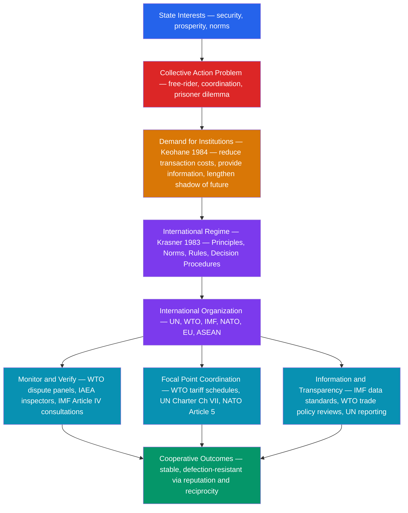

# International Institutions and Multilateralism

> [!abstract] TL;DR
> International institutions are durable sets of rules, norms, and procedures that structure how states interact in a given issue area; multilateralism — coordinating policy among three or more states on the basis of generalized principles — is the organizational form that lets those institutions solve collective action problems no state can resolve alone. Keohane's core argument: institutions reduce transaction costs and provide information even after hegemonic power declines, making post-hegemonic cooperation possible.

---

## Intuition

**Analogy:** Think of a large condominium building. Each resident owns their unit (sovereignty) but shares infrastructure — elevators, plumbing, parking (the global commons: trade routes, monetary stability, nuclear non-proliferation). No single resident can maintain all common infrastructure alone, and if everyone free-rides, the building deteriorates. The condo association (international institution) creates rules, collects dues, monitors compliance, and resolves disputes. Crucially, once established, the association persists even after founding residents move out — institutional resilience. Multilateralism insists that all residents use the same rule book: you cannot cut a private side deal with one neighbor to monopolize shared parking without the other residents invoking the association's bylaws.

The building analogy maps directly onto world politics: states are the residents, sovereignty is unit ownership, the global commons are the shared infrastructure, and international institutions are the condo association. The key question is whether the association's rules can enforce themselves without a single dominant resident permanently footing the bill.

---

## How It Works



---

## Key Concepts

### Secondary Level

**Multilateralism vs. bilateralism.** Multilateralism coordinates three or more states under generalized principles that apply equally to all members — no state gets a special carve-out by virtue of power alone. Bilateralism is a one-to-one deal. The US-China trade war (bilateral tariff escalation) is bilateralism; the WTO's most-favored-nation rule (any trade concession granted to one member must be granted to all) is multilateralism.

**The principal international organizations:**

| Organization | Founded | Core mandate |
|---|---|---|
| United Nations | 1945 | Collective security, human rights, development |
| UN Security Council | 1945 | Peace and security; P5 veto (US, UK, France, Russia, China) |
| IMF | 1944 | Macroeconomic stability, balance-of-payments support |
| World Bank | 1944 | Development lending to low- and middle-income countries |
| GATT / WTO | 1947 / 1995 | Multilateral trade rules, dispute settlement |
| NATO | 1949 | Collective defense (Article 5: attack on one = attack on all) |
| EU | 1957 (EEC) | Deepest regional integration: single market, common currency, political union |
| ASEAN | 1967 | Southeast Asian consultation; sovereignty-respecting (ASEAN Way) |

**The Bretton Woods system** (1944) created the IMF to manage exchange-rate stability, the World Bank to finance reconstruction, and the GATT to liberalize trade — the three pillars of the post-WWII economic order designed at the New Hampshire conference. All three institutions reflected US hegemony: the dollar as reserve currency, US design of the rules, US veto power in the IMF (largest quota share).

**The UN Security Council** is multilateralism's hardest case: the P5 veto means any great power can block binding resolutions. From 1990 onwards it authorized force (Gulf War, Libya) when great powers agreed, and remained paralyzed when they didn't (Syria, Ukraine). This veto structure reflects the founders' realist judgment that an organization the great powers could not exit had to give them exit-substitute power.

---

### Undergraduate Level

**Krasner's regime definition (1983).** A regime is "implicit or explicit principles, norms, rules, and decision-making procedures around which actors' expectations converge in a given area of international relations."

- **Principles** — beliefs of fact, causation, and rectitude: "free trade raises welfare" (WTO), "nuclear proliferation increases the risk of nuclear war" (NPT)
- **Norms** — standards of behavior in terms of rights and obligations: "states should not discriminate among trading partners" (MFN norm), "non-nuclear states shall not acquire nuclear weapons" (NPT obligation)
- **Rules** — specific prescriptions: WTO tariff schedules, IMF quota formulas, IAEA safeguard protocols
- **Decision procedures** — WTO consensus, UN Security Council voting, IMF weighted voting

Crucially, the regime is analytically distinct from the international organization (IO) that administers it. The GATT regime existed before the WTO organization; the climate regime (UNFCCC, Kyoto, Paris) operates across multiple organizational venues.

**Hegemonic Stability Theory (Kindleberger 1973, Gilpin 1987).** A stable international order requires a hegemon willing and able to supply global public goods: an open trading system, a stable reserve currency, and security guarantees. Britain played this role 1815–1914; the US from 1945 onwards. The 1930s depression was partly attributed to the US not yet willing to play Britain's role while Britain no longer could — the "interregnum." Prediction: hegemonic decline → institutional breakdown.

**Keohane's rational institutionalism (After Hegemony, 1984)** challenged hegemonic stability theory. Even after the US dollar left the gold standard (1971) and US economic preponderance declined, GATT, IMF, and NATO persisted. Why? Because institutions had locked in rules that reduced transaction costs for all members regardless of whether a hegemon enforced them:

1. **Reduce transaction costs** — no need to renegotiate every trade deal from scratch; GATT tariff schedules set a baseline
2. **Provide information** — IMF Article IV consultations reveal macroeconomic data; WTO trade policy reviews expose protectionism
3. **Make commitments credible** — binding WTO dispute settlement makes trade commitments more believable than a president's speech
4. **Establish focal points** — NATO Article 5 is a clear tripwire; ambiguity invites miscalculation
5. **Facilitate reciprocity** — WTO links market access across sectors, enabling package deals
6. **Extend the shadow of the future** — state reputation across repeated interactions (see [[Repeated_Games_and_Folk_Theorems]])

**Functionalism (Mitrany, 1943).** Cooperation should begin in technical, apolitical domains — food, health, labor — where functional needs overlap clearly across states. Technical cooperation builds habits of working together, and these habits gradually "spill over" into more political areas. The ILO, WHO, and FAO are functionalist institutions. Mitrany's prediction: political integration follows technical cooperation organically.

**Neofunctionalism (Haas, 1958).** Ernst Haas studying early European integration observed that economic integration in one sector created pressures in adjacent sectors (technical spillover) and mobilized business and labor groups who lobbied for further integration (political spillover). Neofunctionalism was discredited when De Gaulle's "empty chair" policy (1965) showed that political will could block spillover, but it was rehabilitated as a partial explanation for EU deepening from the Single European Act (1986) onwards.

---

### Graduate Level

**Abbott and Snidal's legalization framework (2000).** International law varies along three dimensions:

| Dimension | Definition | Example: WTO DSM | Example: Paris Agreement NDCs |
|---|---|---|---|
| **Obligation** | Legally binding vs. political commitment | High — WTO member bound by DSB rulings | Low — nationally determined, voluntary targets |
| **Precision** | Rules clearly define required conduct | High — specific tariff schedules, precise panels | Low — each state sets its own contribution |
| **Delegation** | Third-party authority to interpret and enforce | High — WTO Appellate Body had final authority | Low — no enforcement body; pledge-and-review |

Hard law (high O, P, D) is more credible but harder to join because it constrains sovereignty more. Soft law (low O, P, D) enables broader participation but generates weaker commitments. The Paris Agreement chose soft law deliberately — the lesson of Kyoto was that hard law with binding emissions targets drove the US to refuse ratification.

**Rational design (Koremenos, Lipson, and Snidal 2001).** Institutional design features — membership rules, scope, centralization, control, flexibility — are rational responses to specific cooperation problems:

- **Distribution problems** (who gets what) → centralized third-party arbitration (WTO panels)
- **Enforcement problems** (cheating incentives) → monitoring and graduated sanctions (NPT + IAEA)
- **Uncertainty about partner preferences** → flexibility provisions (escape clauses, accession procedures)
- **Large number of participants** → nested structure (WTO has 164 members; bilateral "plurilateral" agreements nest within it)

**Compliance and enforcement: two schools.** The managerial school (Chayes and Chayes 1993) argues most non-compliance is capacity or treaty-ambiguity, not strategic cheating. Prescriptions: technical assistance, capacity building, treaty management committees. The enforcement school (Downs, Rocke, and Barsoom 1996) argues that institutionalists confuse *selection* for *effect*: states only join agreements that ask for what they would do anyway. Deep agreements requiring genuine behavioral change need genuine enforcement capacity. Evidence: WTO dispute settlement produces compliance rates above 90%; UNFCCC pledge-and-review has not significantly reduced emissions trajectories.

**Forum shopping.** When multiple institutional venues exist, states strategically choose the arena that maximizes their power. The US preferred GATT (which it dominated) over the ITO (which had broader membership and an inconvenient charter). When WTO multilateral trade rounds stalled at Doha, the US pursued bilateral free trade agreements and the TPP plurilateral. China created the AIIB (2016) as an alternative to the World Bank; the SCO and BRI as alternatives to US-led security and development architecture. Forum shopping creates *regime complexity* — overlapping, partially conflicting institutional regimes in the same issue area (Alter and Meunier 2009).

**Hegemonic decline and institutional resilience.** US withdrawal from the Paris Agreement (2017), TPP (2017), UNESCO, WHO (temporarily), and WTO Appellate Body (blocked appointments from 2017) tested Keohane's prediction. Partial finding: some institutions showed resilience (the EU kept the Paris Agreement alive; the Comprehensive and Progressive Agreement for TPP proceeded without the US), while others were directly impaired (WTO Appellate Body paralysis). Resilience appears contingent on whether remaining members have sufficient interest alignment to absorb the hegemon's exit — which varies by institution.

---

## Python Demo

Model collective action problems in international institutions using the n-player Stag Hunt game. The tipping point shows when multilateral cooperation becomes self-sustaining versus collapsing to bilateral defection.

```python
import numpy as np


def run_n_player_stag_hunt(n, threshold_frac, R_success, D_bilateral, n_trials=500):
    """
    Simulate n-player Stag Hunt coordination game for international multilateralism.

    Each trial starts from a random number of cooperators and runs
    best-response dynamics until convergence. Reports the fraction of
    trials converging to full cooperation vs. full defection, and the
    analytical tipping point.

    Parameters
    ----------
    n : int
        Number of countries.
    threshold_frac : float
        Minimum fraction of n that must cooperate for the agreement to succeed.
    R_success : float
        Payoff to a cooperating country when agreement succeeds (>= threshold join).
    D_bilateral : float
        Payoff from bilateral fallback (always available); 0 < D_bilateral < R_success.
    n_trials : int
        Number of random starting conditions to simulate.
    """
    rng = np.random.default_rng(0)
    threshold = int(np.ceil(threshold_frac * n))

    def coop_payoff(n_total_coop):
        return R_success if n_total_coop >= threshold else 0.0

    end_fractions = []
    for _ in range(n_trials):
        n_coop = rng.integers(0, n + 1)
        for _ in range(500):
            new_n_coop = 0
            for i in range(n):
                # Country i's counterfactual: how many cooperate if it cooperates?
                others_coop = n_coop - (1 if i < n_coop else 0)
                p_coop = coop_payoff(others_coop + 1)
                p_def  = D_bilateral
                if p_coop > p_def:
                    new_n_coop += 1
                elif p_coop == p_def:
                    new_n_coop += (1 if i < n_coop else 0)
            if new_n_coop == n_coop:
                break
            n_coop = new_n_coop
        end_fractions.append(n_coop / n)

    end_fractions = np.array(end_fractions)
    frac_coop   = np.mean(end_fractions > 0.999)
    frac_defect = np.mean(end_fractions < 0.001)
    tipping     = threshold / n

    print(f"n={n}, threshold={threshold}/{n} ({tipping:.0%}), R={R_success}, D={D_bilateral}")
    print(f"  Converges to full cooperation : {frac_coop:.0%}")
    print(f"  Converges to full defection   : {frac_defect:.0%}")
    print(f"  Tipping point at {tipping:.0%} participation")
    print(f"  Below {tipping:.0%}: payoff from cooperating = 0 < D={D_bilateral} -> defect dominates")
    print(f"  Above {tipping:.0%}: payoff from cooperating = R={R_success} > D={D_bilateral} -> cooperate dominates")
    print()
    return end_fractions


print("N-Player Stag Hunt: Multilateral Cooperation Dynamics")
print("=" * 57)

# Scenario A: Deep trade agreement (WTO-like) — high threshold
print("Scenario A — Deep multilateral trade agreement (WTO-like)")
print("Requires 70% participation; rich payoff from open markets\n")
run_n_player_stag_hunt(n=30, threshold_frac=0.70, R_success=15.0, D_bilateral=4.0)

# Scenario B: Soft climate pledge (Paris Agreement-like) — lower threshold
print("Scenario B — Soft climate pledge (Paris NDC-like)")
print("Works with 40% participation; weaker commitment, easier to join\n")
run_n_player_stag_hunt(n=30, threshold_frac=0.40, R_success=10.0, D_bilateral=4.0)

# Scenario C: Hegemon deters bilateral defection — same deep agreement
print("Scenario C — Hegemon deters bilateral alternatives")
print("Same deep agreement but bilateral payoff reduced by sanctions\n")
run_n_player_stag_hunt(n=30, threshold_frac=0.70, R_success=15.0, D_bilateral=1.5)

# Key insight
print("Institutional design levers to shift equilibrium toward multilateralism:")
print("  1. Lower the threshold (soft law, variable geometry)")
print("  2. Raise R_success (credible enforcement, side payments)")
print("  3. Lower D_bilateral (hegemon punishes defectors, MFN conditionality)")
```

**Interpretation.** Scenario A (high threshold, strong bilateral alternative) converges to defection from most starting points — explaining why deep multilateral agreements like the Doha Round collapse. Scenario B (lower threshold) vastly expands the basin of attraction for cooperation — explaining why the Paris Agreement's voluntary NDC architecture achieved 195 signatories that Kyoto's binding targets never could. Scenario C shows hegemonic coercion as an institutional substitute: reducing the bilateral payoff tips borderline states toward multilateralism.

---

## Real-World Applications

**WTO dispute settlement as hard legalization.** The WTO Dispute Settlement Body is the gold standard of international legalization: high obligation (panel rulings are binding), high precision (GATT/TRIPS/GATS rules are specific), high delegation (Appellate Body reviews panel decisions). Compliance rate exceeds 90%. When the US blocked Appellate Body appointments from 2017, the entire system was crippled — demonstrating that hard institutions depend on hegemonic tolerance even when they have formal independence.

**IMF conditionality and the trilemma.** IMF lending comes with conditionality — macroeconomic policy adjustments (austerity, exchange-rate flexibility) as a condition of balance-of-payments support. Conditionality is the enforcement mechanism that makes IMF loans credible signals to private creditors. Controversy: the Asian Financial Crisis (1997–98) conditions were widely seen as contractionary and counterproductive — evidence that institutional design can fail when the model underlying the rules is wrong (see [[Global_Financial_Crises]]).

**NATO Article 5 as a focal point.** The alliance works primarily through the commitment mechanism of Article 5, not through a standing multilateral force. The deterrent value lies in making it credible that a US president would treat an attack on Estonia as an attack on Chicago. Extended deterrence under nuclear multilateralism is the hardest commitment problem in international relations: the credibility of the guarantee declines as the stakes rise.

**EU integration as neofunctionalism's laboratory.** The EU moved from a coal and steel community (1951) through a common market (1957), single market (1986), monetary union (1999), and Schengen (1985) largely via technical spillover and political lobbying by business. But Brexit (2016) showed the limits: when national identity became more salient than economic integration, political will reversed two decades of spillover. The EU case confirms both the power and the fragility of neofunctionalist dynamics.

**Bretton Woods breakdown (1971–1973) and institutional evolution.** When Nixon closed the gold window in 1971, the Bretton Woods fixed exchange-rate regime collapsed. Hegemonic Stability Theory predicted IMF irrelevance. Instead, the IMF evolved into a balance-of-payments lender and surveillance body (Article IV consultations), WTO succeeded GATT with stronger dispute settlement, and G7/G20 emerged as informal coordination forums. Institutional resilience via functional adaptation — consistent with Keohane, not Gilpin.

---

## Common Pitfalls

- **Conflating the institution with the organization.** Krasner's regime (principles, norms, rules, decision procedures) is analytically distinct from the secretariat and building in Geneva. The WTO regime is the GATT legal system plus accumulated jurisprudence; the WTO organization is the staff and the panels. Regimes can survive the dissolution of their host organization; organizations can persist after their founding regime collapses.

- **Assuming institutional creation solves the cooperation problem.** Creating an IO is the beginning, not the end. Commitment, monitoring, and enforcement mechanisms determine whether the institution changes behavior. The UN Framework Convention on Climate Change created the climate regime in 1992; global emissions are still rising in 2026. Institutional form without credible enforcement = empty multilateralism.

- **Hegemonic stability as a deterministic theory.** The theory correctly identifies the supply-side advantages of hegemonic order but overestimates the necessity of a hegemon. Post-1971 and post-Cold War experience shows institutions can persist and adapt. The stronger version — no hegemon, no order — is empirically falsified by three decades of post-Cold War multilateralism.

- **Ignoring distributional politics inside institutions.** Rational institutionalism treats institutions as efficiency-enhancing. But institutions also lock in distributional outcomes: the IMF's weighted-voting system overrepresents G7 countries; the WTO's historical tariff schedules embedded the preferences of states that negotiated first. Developing countries' persistent frustration with Bretton Woods institutions reflects genuine distributional grievances, not irrationality (see [[Development_Economics]]).

- **Treating soft law as no law.** Soft law (Paris Agreement NDCs, G20 communiques, OECD guidelines) is often more flexible and therefore achieves broader participation. States treat soft commitments as reputationally meaningful even without legal obligation — the norm of compliance can be self-enforcing when reputational costs are high. Dismissing soft law as "just words" misses how most interstate coordination actually operates.

- **Forum shopping as a sign of institutional failure.** It is also a sign of institutional vitality: states that cannot get what they want multilaterally will seek bilateral or plurilateral venues, creating competitive pressure on the original institution to reform. US bilateral FTAs after Doha's collapse forced non-FTA countries to liberalize or lose market access — multilateral-adjacent outcomes from bilateral negotiations.

---

## Related Concepts

- [[Nash_Equilibrium]] — the equilibrium concept underlying why cooperation problems (prisoner's dilemma, coordination) arise in the first place; institutions shift the payoff matrix to change equilibria
- [[Repeated_Games_and_Folk_Theorems]] — the shadow of the future mechanism that Keohane's institutionalism draws on directly; folk theorems explain why repeated state interaction can support cooperation without a third-party enforcer
- [[Public_Goods]] — global public goods (stable reserve currency, open trade system, climate stability) are the substantive problem international institutions exist to provide; free-rider logic explains why they are underprovided without institutional design
- [[Asymmetric_Information]] — institutions reduce information asymmetries between states (who is cheating? what are partners' true preferences?); IMF Article IV consultations, WTO transparency requirements are direct responses to this problem
- [[Balance_of_Payments]] — the IMF's core mandate; balance-of-payments crises are the trigger for IMF conditionality and the most direct application of Bretton Woods institutional logic
- [[Global_Financial_Crises]] — 2008 demonstrated both the importance of the IMF/G20 coordination forum and the limits of existing institutions (Basel II failed to prevent systemic risk); the G20 rose to prominence as an informal multilateral coordination body
- [[Development_Economics]] — World Bank lending and IMF structural adjustment are the primary institutional interventions in development; debate over Washington Consensus conditionality is a debate about institutional effectiveness
- [[Power_Indices]] — Shapley-Shubik and Banzhaf indices formalize voting power in institutions like the UN Security Council and IMF; veto players distort multilateral outcomes in predictable ways
- [[Coalitional_Games_and_Shapley_Value]] — cooperative game theory formalizes how multilateral coalitions form and how the surplus of cooperation should be distributed among participants

---

## Review Questions

### Secondary

1. Why does the United Nations Security Council give veto power to only five countries? What problem does the veto solve, and what problem does it create?
2. The WTO requires all members to grant "most-favored-nation" treatment: any trade concession given to one member must be given to all. Why might this rule be essential to multilateral trade cooperation?
3. Compare NATO and the EU as international organizations. In what ways are their institutional designs different, and why do these differences reflect different cooperation problems?

### Undergraduate

1. Keohane argues that international institutions can survive hegemonic decline because they have already reduced transaction costs. Test this claim against one case where it holds (name the institution and evidence) and one case where it fails. What accounts for the variation?
2. Apply Krasner's four-part regime definition (principles, norms, rules, decision procedures) to the nuclear non-proliferation regime. Identify one case where the regime's rules were violated but its norms remained intact, and one case where norm erosion occurred. What is the difference?
3. Mitrany's functionalism predicts that technical cooperation leads to political integration. The EU appears to confirm this; ASEAN appears to refute it. Explain what institutional and political conditions explain why one case supports and the other challenges the neofunctionalist prediction.

### Graduate

1. Abbott and Snidal's legalization framework treats obligation, precision, and delegation as independent dimensions. Using the WTO Dispute Settlement Mechanism (high on all three) and the Paris Agreement NDC architecture (low on all three), evaluate: which design better achieves behavioral change, and which achieves broader participation? Is there a systematic trade-off, and how should treaty designers navigate it?
2. Keohane's after-hegemony argument depends on a specific claim: institutions provide services (transaction cost reduction, information) that states value independently of who is currently most powerful. Assess this claim in light of: US withdrawal from the WTO Appellate Body (2017–2020); Chinese creation of the AIIB (2016); and the persistence of the IMF quota reform process (2010–2016). Does institutional resilience depend on the nature of the cooperation problem (enforcement vs. coordination vs. distribution)?
3. The enforcement school (Downs, Rocke, Barsoom) argues that IR institutionalists confuse selection for institutional effect: states only join treaties requiring what they would do anyway. Design a research strategy to distinguish the selection effect from the genuine compliance effect of WTO membership on trade policy. What data and what counterfactual identification strategy would you need?

---

## Sources

- [Krasner, Stephen D. (ed.), *International Regimes*, Cornell University Press, 1983](https://www.jstor.org/stable/j.ctt5hh9rm)
- [Keohane, Robert O., *After Hegemony: Cooperation and Discord in the World Political Economy*, Princeton University Press, 1984](https://press.princeton.edu/books/paperback/9780691022284/after-hegemony)
- [Abbott, K. W., Keohane, R. O., Moravcsik, A., Slaughter, A.-M., and Snidal, D., "The Concept of Legalization," *International Organization*, 54(3), 2000](https://www.cambridge.org/core/journals/international-organization/article/abs/concept-of-legalization/6A3D5C00E83F2665B48C91C64E0B1C90)
- [Abbott, K. W. and Snidal, D., "Hard and Soft Law in International Governance," *International Organization*, 54(3), 2000](https://www.cambridge.org/core/journals/international-organization/article/abs/hard-and-soft-law-in-international-governance/EC8091A89687FDF7FC9027D1717538BF)
- [Koremenos, B., Lipson, C., and Snidal, D., "The Rational Design of International Institutions," *International Organization*, 55(4), 2001](https://www.cambridge.org/core/journals/international-organization/article/abs/rational-design-of-international-institutions/8ABD8D748DEB9D26ED06A0F44C6A1CB0)
- [Ruggie, John Gerard, "Multilateralism: The Anatomy of an Institution," *International Organization*, 46(3), 1992](https://www.cambridge.org/core/journals/international-organization/article/abs/multilateralism-the-anatomy-of-an-institution/3C74E3D9C9E4FC3F2A5B9A43DC6CC0AC)
- [Haas, Ernst B., *The Uniting of Europe: Political, Social, and Economic Forces 1950-1957*, Stanford University Press, 1958](https://press.stanford.edu/books/title/?id=1009)
- [Chayes, A. and Chayes, A. H., "On Compliance," *International Organization*, 47(2), 1993](https://www.cambridge.org/core/journals/international-organization/article/abs/on-compliance/5E4F36EB7D406D3DB4A40BB82B28EC7F)

---

#PoliticalScience #InternationalRelations #InternationalInstitutions #Multilateralism
