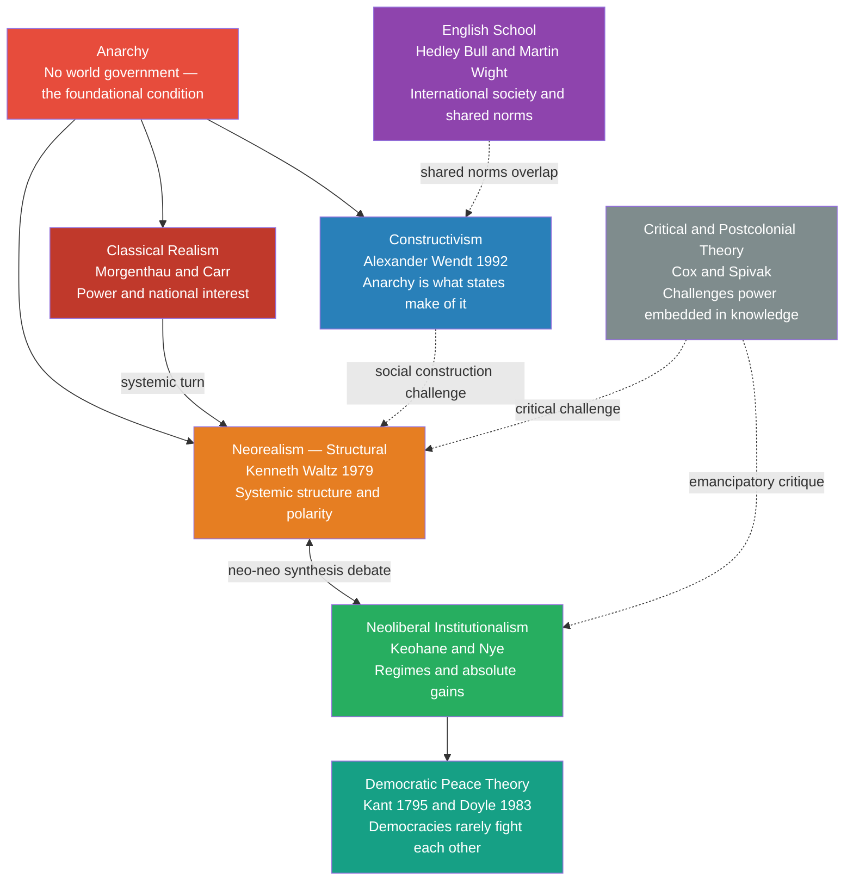

# 🌐 International Relations Theories

> [!abstract] TL;DR
> International Relations theories are competing analytical frameworks for explaining why sovereign states fight, cooperate, or build institutions under a condition of anarchy — the absence of a world government. The three dominant paradigms (Realism, Liberalism, Constructivism) disagree on what the fundamental unit of analysis is, what states want, and whether human nature or social construction drives world politics. Mastering all three is essential because each illuminates a different slice of the same event.

---

## Intuition — Analogy FIRST

Imagine a large apartment block with no building manager, no security guard, and no shared rulebook — just fifty self-governing households. Each household must protect its own belongings and make its own arrangements with neighbours.

A **Realist** household stockpiles deadbolts and assumes every neighbour is a potential thief; sharing a key is dangerous because you can never be sure their intentions won't change. A **Liberal** household proposes forming a residents' association with written rules, a shared entrance camera, and monthly dues — arguing that repeated interaction and mutual benefit make defection irrational. A **Constructivist** household argues that the very idea of "neighbours as threats" is a learned belief: if the block culturally normalised solidarity rather than suspicion, households would arm less and share more. The **English School** household points out that even without a manager, a loose set of customs and manners already governs the block — call it "international society."

Each household is a state. The apartment block is the international system. Anarchy is the absent manager.

---

## How It Works



---

## Key Concepts

### Secondary Level

**What is IR Theory?**

International Relations theory asks three foundational questions:
1. **Why does war occur?** Is it human nature, state interests, or the structure of the international system?
2. **Can states cooperate?** And if so, how durably and under what conditions?
3. **What counts as "power"?** Military force alone, or economic interdependence, soft power, and normative legitimacy?

Theories are **analytical lenses**, not laws of physics. A single event — say, the 2003 invasion of Iraq — looks different through each lens. Realism sees a powerful state exploiting unipolarity. Liberalism notes the failure of UN-sanctioned collective security. Constructivism examines how "WMD" and "rogue state" became unquestioned categories.

---

**Classical Realism — Thucydides, Machiavelli, Morgenthau**

| Core claim | Explanation |
|---|---|
| Human nature is power-seeking | Morgenthau's *Politics Among Nations* (1948): the desire for power is universal and ineradicable |
| States pursue national interest defined in terms of power | Foreign policy is not about morality but about survival and relative advantage |
| Morality in IR is a dangerous illusion | Ethics applies to individuals; states face a different, harsher logic |
| Balance of power is the natural regulator | Great powers balance against threats to prevent hegemony |

Thucydides' *Melian Dialogue* (431 BCE) is the locus classicus: Athens tells Melos "the strong do what they can, the weak suffer what they must." Classical realism grounds this in human psychology — ambition, fear, and the lust for glory.

**Classical Liberalism / Idealism — Wilson, Angell, Zimmern**

After World War I, liberal idealists argued that war was a product of militarism, secret diplomacy, and economic rivalry — correctable through collective security, international law, free trade, and democratic governance. Woodrow Wilson's Fourteen Points and the League of Nations embodied this project. E.H. Carr's *The Twenty Years' Crisis* (1939) devastatingly critiqued it as "wishful thinking" — the 1st Great Debate between idealism and realism — and Carr's realism largely "won" intellectually after World War II proved the League powerless.

---

### Undergraduate Level

**Neorealism — Structural Realism (Kenneth Waltz, 1979)**

Waltz's *Theory of International Politics* performs a decisive theoretical move: strip out human nature (Morgenthau's variable) and locate the cause of war in the **structure of the international system**.

Three structural properties determine state behaviour:

| Property | Content |
|---|---|
| **Ordering principle** | Anarchy — no overarching authority above states |
| **Character of units** | States are functionally similar (all must survive and self-help) |
| **Distribution of capabilities** | Polarity — how many great powers exist |

**Polarity and its consequences:**

- **Bipolarity** (e.g., Cold War): Waltz argued this is the *most stable* structure — only two powers to miscalculate, and each specialises in balancing the other.
- **Multipolarity** (e.g., pre-WWI Europe): more actors, more miscalculation, more instability.
- **Unipolarity** (post-1991): contested. Realists debate whether it generates complacency or overextension.

**Security Dilemma** — The mechanism at the heart of neorealism. When State A armours up for defensive reasons, State B cannot distinguish defensive from offensive intent. B responds by arming. A now faces a stronger B and arms further. Both end up less secure than before even though neither intended aggression. It is a structural logic, not a failure of goodwill.

**Defensive vs Offensive Realism:**

- **Defensive Realism** (Walt, Glaser): states seek *security*, not power maximisation. Excessive expansion invites balancing coalitions.
- **Offensive Realism** (Mearsheimer): given uncertainty about intentions, rational states always seek to *maximise* relative power. Hegemony is the only guarantee of security; hence great power conflict is endemic.

---

**Neoliberal Institutionalism — Keohane and Nye**

Robert Keohane and Joseph Nye's *Power and Interdependence* (1977) and Keohane's *After Hegemony* (1984) accept the neorealist premise of anarchy but argue it does **not** preclude durable cooperation.

Key concepts:

| Concept | Definition |
|---|---|
| **Complex interdependence** | Multiple channels of interaction beyond state-to-state; military force is costly to use and often irrelevant to economic or environmental issues |
| **International regimes** | "Sets of implicit or explicit principles, norms, rules and decision-making procedures around which actors' expectations converge" (Krasner 1983) — e.g., WTO, NPT, IMF |
| **Absolute vs relative gains** | Neorealists worry about *relative* position (if cooperation makes you +5 and me +3, I lose ground). Neoliberals argue states mostly pursue *absolute* gains: does the deal make me better off, regardless of my partner? |
| **Hegemonic stability theory** | A dominant power underwrites the global order (Bretton Woods system = US hegemony). When the hegemon declines, does cooperation survive? Keohane argued: *yes*, because institutions persist past the power that created them. |

The **neo-neo debate** of the 1980s–90s (Grieco, Powell, Baldwin) is fundamentally about relative vs absolute gains and whether anarchy forecloses cooperation. Most IR scholars now accept a "synthesis": states sometimes care about relative gains, especially in security domains.

---

**Democratic Peace Theory — Kant and Doyle**

Immanuel Kant's *Perpetual Peace* (1795) proposed three "definitive articles": republican constitutions, a federation of free states, and cosmopolitan hospitality. Michael Doyle's empirical articles (1983, 1986) operationalised this as a statistical regularity: **liberal democracies almost never go to war with one another**.

Two versions:

- **Dyadic** (the strong version): *this pair* of democracies won't fight. Strongly supported empirically.
- **Monadic** (the weak version): democracies are generally more peaceful. Weakly supported — democracies fight non-democracies frequently.

**Causal mechanisms** (contested):

1. **Normative/cultural**: democracies resolve disputes through compromise; they extend this norm externally toward other democracies.
2. **Structural/institutional**: elected leaders face domestic audience costs for starting wars; legislatures constrain executives.
3. **Commercial**: trading democracies have economic incentives to preserve the relationship.

**Critique**: Correlational (not causal). Post-colonial critics note the theory has been used to justify "democratisation by force" — a liberal imperialism that selectively applies Kantian norms.

---

**Constructivism — Alexander Wendt**

Wendt's 1992 article "Anarchy is What States Make of It" and his 1999 book *Social Theory of International Politics* offer the most systematic constructivist challenge to neorealism.

Core claims:

| Claim | Explanation |
|---|---|
| **Interests and identities are not given** | Neorealism assumes states always want survival and relative power. Constructivism: these are *socially constructed* interests that can change through interaction |
| **Anarchy has no logic of its own** | Three cultures of anarchy — Hobbesian, Lockean, Kantian — depending on how states have learned to relate to each other |
| **Agent-structure co-constitution** | States make the international system through practice; the system simultaneously shapes what states regard as their interests |
| **Norms matter** | The **norm lifecycle** (Finnemore and Sikkink 1998): norm emergence by entrepreneurs → norm cascade as states adopt it → norm internalisation where it becomes "taken for granted" |

**Three cultures of anarchy** (Wendt 1999):
1. **Hobbesian** — enemies; war of all against all
2. **Lockean** — rivals; bounded competition with recognition of sovereignty
3. **Kantian** — friends; disputes resolved peacefully, collective security

These are not fixed by structure but by the *intersubjective* understandings states have built through historical interaction. The US-Canada and US-Russia dyads both operate under anarchy yet inhabit entirely different cultures.

---

**English School — Hedley Bull, Martin Wight, Adam Watson**

The English School occupies a middle position: states exist in both an international *system* (like billiard balls following power logic) and an international *society* (where states share rules, institutions, and norms). Bull's *The Anarchical Society* (1977) is the foundational text.

| Level | Description |
|---|---|
| **International System** | States interact; their actions have consequences for each other — the Realist level |
| **International Society** | States share institutions: diplomacy, international law, the balance of power, great-power management, war as a regulated practice |
| **World Society** | Non-state actors, individuals, NGOs — Kant's cosmopolitan sphere |

**Solidarism vs Pluralism**: Can international society enforce human rights across borders (solidarism — Wheeler, Linklater)? Or does sovereignty protect states from humanitarian intervention (pluralism — Bull's early position)? This tension produced the doctrine of **Responsibility to Protect** (R2P, 2005).

---

### Graduate Level

**The Four Great Debates of IR**

| Debate | Period | Contestants | What was at stake |
|---|---|---|---|
| 1st | 1930s–40s | Idealism vs Classical Realism | Can international institutions prevent war, or is power the only currency? |
| 2nd | 1950s–60s | Traditionalism vs Behaviorism | Should IR use historical-philosophical methods or quantitative/scientific methods? |
| 3rd | 1970s–80s | Neorealism vs Neoliberalism | Do states care primarily about relative or absolute gains under anarchy? |
| 4th | 1980s–present | Rationalism vs Reflectivism | Are state interests and identities given exogenously, or socially constructed? |

The 4th debate is most fundamental: rationalists (neorealists, neoliberals) model states as pre-constituted actors with fixed preferences optimising under constraints. Reflectivists (constructivists, critical theorists, feminists, post-structuralists) argue preferences are *endogenous* — produced by norms, discourse, and social practice. This is an ontological divide, not merely a methodological one.

---

**Critical Theory — Robert Cox, Andrew Linklater**

Robert Cox's famous distinction (1981): "Theory is always for someone and for some purpose." He contrasted:

- **Problem-solving theory**: takes the existing world as given and improves its functioning (most neorealism and neoliberalism). Serves dominant interests by naturalising current structures.
- **Critical theory**: questions the origins of existing structures, asks whose interests they serve, and opens space for transformation. Draws on Gramsci: hegemony is maintained not only by military dominance but by ideological consent ("common sense").

Cox applied Gramsci to IR: American hegemony post-1945 was not merely power but also a set of norms and ideas (liberal international order, Bretton Woods) that made US dominance appear natural and beneficial. Hegemonic orders eventually face counter-hegemonic movements.

---

**Postcolonialism and Feminist IR**

Postcolonialism (Spivak, Bhabha, Inayatullah, Blaney) charges that IR theory is Eurocentric:
- The sovereign state was exported globally through colonialism, not "chosen" by colonised peoples.
- "Failed states" and "developing countries" are categories that encode colonial power hierarchies.
- Silences: IR theory has almost nothing to say about the 500-year history of colonial extraction.

**Feminist IR** (Cynthia Enloe, J. Ann Tickner, Christine Sylvester) asks: where are the women in IR theory? Enloe's *Bananas, Beaches and Bases* (1990) shows that military bases, diplomatic protocols, and global supply chains depend on gendered labour that mainstream IR renders invisible. Tickner argues that Morgenthau's "rational man" is a gendered construction — his notion of power is fundamentally masculine.

**Post-structuralism** (Ashley, Campbell, Der Derian) applies Foucault and Derrida to IR: state identity is discursively constructed through the production of "otherness" (Campbell's *Writing Security*). Security is a speech act (securitisation theory — Buzan, Waever, de Wilde).

---

**Levels of Analysis (Kenneth Waltz, J. David Singer)**

A methodological scaffold cutting across all theories:

| Level | Focus | Example |
|---|---|---|
| **Individual** | Leaders, psychology, misperception | Hitler's ideology, miscalculation in 1914 |
| **State / Unit** | Regime type, domestic politics, bureaucracy | Democratic peace, diversionary war |
| **System / Structure** | Polarity, anarchy, distribution of power | Cold War bipolarity stabilising Europe |

Waltz argued a systemic theory is the most parsimonious; unit-level variation is epiphenomenal. Constructivists and liberals work predominantly at state and societal levels. Critical theorists ask why "levels" themselves are a contested analytical choice.

---

## Python Demo

```python
import numpy as np
import matplotlib.pyplot as plt

# ── Security Dilemma: Iterated Prisoner's Dilemma ────────────────────────
# Payoff matrix (standard PD): T=temptation 5, R=reward 3, P=punishment 1, S=sucker 0
# Two states A and B choose to Cooperate (C) or Defect (D) each round.
# Defecting represents arming / aggressive foreign policy.
# Cooperating represents restraint / arms control.

T, R, P, S = 5, 3, 1, 0

def payoffs(action_a, action_b):
    """Return (payoff_A, payoff_B) given actions 'C' or 'D'."""
    if action_a == 'C' and action_b == 'C':
        return R, R
    elif action_a == 'D' and action_b == 'C':
        return T, S
    elif action_a == 'C' and action_b == 'D':
        return S, T
    else:
        return P, P

def always_defect(history):
    return 'D'

def always_cooperate(history):
    return 'C'

def tit_for_tat(history):
    """Start cooperative; mirror opponent's last move."""
    if not history:
        return 'C'
    return history[-1][1]          # copy what the opponent did last round

def simulate(strat_a, strat_b, n_rounds=1000, seed=42):
    rng = np.random.default_rng(seed)
    history = []
    cumulative_a, cumulative_b = [0], [0]
    for _ in range(n_rounds):
        a = strat_a(history)
        b = strat_b(history)
        pa, pb = payoffs(a, b)
        cumulative_a.append(cumulative_a[-1] + pa)
        cumulative_b.append(cumulative_b[-1] + pb)
        history.append((a, b))
    return np.array(cumulative_a), np.array(cumulative_b)

rounds = np.arange(1001)

scenarios = [
    ("Always Defect vs Always Defect\n(Hobbesian anarchy)", always_defect, always_defect),
    ("Tit-for-Tat vs Tit-for-Tat\n(shadow of the future enables cooperation)", tit_for_tat, tit_for_tat),
    ("Always Cooperate vs Always Cooperate\n(idealist optimum — fragile)", always_cooperate, always_cooperate),
    ("Tit-for-Tat vs Always Defect\n(exploiter meets conditionality)", tit_for_tat, always_defect),
]

fig, axes = plt.subplots(2, 2, figsize=(12, 8))
axes = axes.flatten()

for ax, (title, s_a, s_b) in zip(axes, scenarios):
    cum_a, cum_b = simulate(s_a, s_b)
    ax.plot(rounds, cum_a, label="State A", linewidth=1.8)
    ax.plot(rounds, cum_b, label="State B", linewidth=1.8, linestyle="--")
    ax.set_title(title, fontsize=9)
    ax.set_xlabel("Round", fontsize=8)
    ax.set_ylabel("Cumulative Payoff", fontsize=8)
    ax.legend(fontsize=8)
    ax.tick_params(labelsize=7)

plt.suptitle(
    "Security Dilemma as Iterated PD (1000 rounds)\n"
    "Realism predicts mutual defection; repeated interaction creates space for Tit-for-Tat cooperation",
    fontsize=10,
)
plt.tight_layout()
plt.savefig("security_dilemma_iterated_pd.png", dpi=150)
plt.show()

# ── Summary statistics ────────────────────────────────────────────────────
print("Final cumulative payoffs after 1000 rounds:")
for title, s_a, s_b in scenarios:
    cum_a, cum_b = simulate(s_a, s_b)
    print(f"  {title.split(chr(10))[0]}")
    print(f"    State A: {cum_a[-1]:.0f}   State B: {cum_b[-1]:.0f}   Total: {cum_a[-1]+cum_b[-1]:.0f}")
```

**Reading the output:**
- *Always Defect vs Always Defect*: both score 1 per round (1000 total each). This is the Waltzian security dilemma equilibrium — individually rational, collectively catastrophic.
- *Tit-for-Tat vs Tit-for-Tat*: both score 3 per round (3000 total each). The "shadow of the future" (high effective discount factor) sustains cooperation. This is Keohane's empirical claim about international regimes.
- *Always Cooperate vs Always Cooperate*: both score 3 per round — optimal, but collapses the moment one actor defects (cf. League of Nations).
- *Tit-for-Tat vs Always Defect*: A scores ~1 per round after round 1; B scores ~5 in round 1, ~1 thereafter. Conditional cooperation punishes exploiters and converges to the defection equilibrium — explaining why arms races are hard to exit without verifiable commitments (see arms control treaties).

---

## Real-World Applications

**Cold War Arms Race — Neorealist Security Dilemma**
Each US nuclear build-up triggered Soviet parity-seeking, not from aggressive intent but from structural logic. Both superpowers ended up far more heavily armed than either needed for "mere" deterrence. The ABM Treaty (1972) was a neoliberal institutional solution: mutual restraint verified by inspection regimes, encoding absolute gains logic over relative positioning.

**WTO and the GATT Order — Neoliberal Institutionalism**
Keohane's prediction that international institutions outlive hegemonic decline was tested when US economic dominance eroded post-1970s yet GATT/WTO continued to function. The dispute settlement body, transparency obligations, and Most Favoured Nation norm reduce transaction costs and increase the shadow of the future for member states.

**European Integration — Constructivist Identity Shift**
France and Germany fought three wars in 70 years (1870, 1914, 1940). Post-1945 integration did not merely align economic interests — it reconstructed identities. French and German elites developed a shared "European" identity through repeated socialisation in EU institutions. War between them is now literally inconceivable, not merely unprofitable. This is Wendt's Kantian culture of anarchy instantiated in one regional sub-system.

**Ukraine-Russia War 2022 — Theories in Tension**
Neorealism (Mearsheimer): NATO expansion into Ukraine's neighbourhood was an existential threat to Russia's sphere of influence; great powers always resist encirclement. Constructivism: Russian identity claims ("historical Russia," "denazification") and normative frames were central to mobilisation — interests do not speak for themselves. Neoliberal critique: the failure of OSCE and Minsk agreements shows regimes require enforcement capacity, not merely shared norms.

**Responsibility to Protect — English School Solidarism vs Pluralism**
The R2P doctrine adopted at the 2005 World Summit attempted to bridge sovereignty (pluralism) and human rights protection (solidarism). The Libya intervention (2011) invoked R2P; the Syria non-intervention revealed its selective application. The episode illustrates how international society norms are contested, unevenly applied, and shaped by great-power politics — a finding that satisfies both realists and constructivists.

---

## Common Pitfalls

- **Treating theories as mutually exclusive** — IR theories are analytical lenses, not competing religions. Most professional analysts draw on realist power calculations, neoliberal institutional arrangements, and constructivist identity framing simultaneously. The Iraq War required all three.

- **Conflating Classical Realism and Neorealism** — Morgenthau grounds realism in human nature (psychological); Waltz grounds neorealism in systemic structure (sociological). They make different predictions: Morgenthau allows for statesman wisdom to moderate power-seeking; Waltz says structural pressures override individual variation.

- **Misreading Wendt's constructivism as idealism** — "Anarchy is what states make of it" does not mean anarchy is irrelevant or that power doesn't matter. It means the *meaning* of anarchy — whether it generates Hobbesian war or Kantian peace — is not structurally predetermined but socially constituted. Power remains real; its significance is contested.

- **Confusing "regime" in IR and everyday usage** — In IR, a *regime* is an international institutional arrangement (trade regime, nuclear non-proliferation regime), not a synonym for an authoritarian government. This is a source of consistent student confusion.

- **Applying Democratic Peace dyadic claim monadically** — The empirical regularity is: *this democracy* almost never goes to war with *that democracy*. It does **not** say democracies are generally peaceful — democracies fight non-democracies regularly (US in Vietnam, Afghanistan, Iraq). Using the monadic version to predict general pacifism is not supported by evidence.

- **Ignoring the units-of-analysis problem** — Arguments pitched at different levels of analysis are not directly comparable. "Hitler caused WWII" (individual level) and "multipolarity made WWII likely" (systemic level) are not contradictory; they explain different aspects of the same event.

---

## Related Concepts

- [[Nash_Equilibrium]] — The security dilemma is a PD Nash equilibrium; understanding NE is prerequisite to formalising why mutual defection traps states even against their collective interest.
- [[Repeated_Games_and_Folk_Theorems]] — Keohane's argument for institutional durability maps directly onto the folk theorem: with sufficiently high shadow of the future, cooperation is sustainable as an SPE.
- [[Bargaining_Theory]] — Crisis bargaining models (Fearon 1995) formalise why states fight rather than negotiate; war is an inefficient outcome of bargaining failure under private information.
- [[Group_Dynamics]] — In-group / out-group dynamics (Tajfel's Social Identity Theory) underpin constructivist accounts of national identity formation and enemy-image construction.
- [[Cognitive_Biases]] — Robert Jervis's *Perception and Misperception in International Politics* (1976) applies cognitive psychology to IR: the spiral model and deterrence model both reflect different bias assumptions about adversary intent.
- [[Balance_of_Payments]] — Neoliberal interdependence arguments rest on trade and financial flows; the balance of payments is the quantitative substrate of complex interdependence.
- [[Social_Influence_and_Conformity]] — Norm diffusion and cascade (Finnemore and Sikkink) is a macro-level version of social conformity: once a norm reaches a tipping point, states adopt it not from conviction but to avoid social sanction.

---

## Review Questions

### Secondary

1. A country discovers its neighbour has just doubled the size of its army. According to realist theory, what should it do and why? What would a liberal IR scholar recommend instead?
2. What is the "security dilemma"? Explain it using a concrete example from history (Cold War, WWI, or contemporary Asia).
3. After World War I, the League of Nations was set up to prevent future wars. Why did it fail, and what does its failure tell us about the debate between idealism and realism?

### Undergraduate

1. Waltz argues that bipolarity is more stable than multipolarity. Using the Cold War and pre-WWI Europe as evidence, evaluate this claim. Does offensive realism (Mearsheimer) change the prediction?
2. Keohane claims that international institutions can sustain cooperation even after the hegemon that created them declines. Is this "after hegemony" argument consistent with neorealist premises, or does it require genuinely liberal assumptions about state preferences?
3. Wendt distinguishes three cultures of anarchy (Hobbesian, Lockean, Kantian). What mechanisms explain how a dyad transitions from one culture to another? Use EU integration as your primary case.

### Graduate

1. Cox distinguishes "problem-solving theory" from "critical theory." Apply this distinction to the neorealism/neoliberalism debate: which theory is problem-solving and why? Can constructivism be critical or does it fall into problem-solving once it becomes policy-relevant?
2. Fearon's (1995) bargaining model of war identifies three rationalist explanations for why states fight: private information, commitment problems, and indivisibility. Map each onto at least one of the major IR theories and assess whether the rationalist framework makes the paradigm debate redundant.
3. Postcolonial scholars argue that Westphalian sovereignty was imposed on non-European peoples through colonialism and does not represent a universal political achievement. How should this historicise the concept of "anarchy" that all mainstream IR theories take as their foundational premise? What would a genuinely post-Westphalian IR theory look like?

---

## Sources

- Morgenthau, H. (1948) — *Politics Among Nations: The Struggle for Power and Peace*
- Waltz, K. (1979) — *Theory of International Politics*
- Keohane, R. & Nye, J. (1977) — *Power and Interdependence*
- Keohane, R. (1984) — *After Hegemony: Cooperation and Discord in the World Political Economy*
- Wendt, A. (1992) — ["Anarchy is What States Make of It"](https://www.jstor.org/stable/2706858), *International Organization* 46(2)
- Wendt, A. (1999) — *Social Theory of International Politics*
- Bull, H. (1977) — *The Anarchical Society: A Study of Order in World Politics*
- Finnemore, M. & Sikkink, K. (1998) — "International Norm Dynamics and Political Change," *International Organization* 52(4)
- Doyle, M. (1983) — "Kant, Liberal Legacies, and Foreign Affairs," *Philosophy & Public Affairs* 12(3)
- Cox, R. (1981) — "Social Forces, States and World Orders," *Millennium* 10(2)
- Jervis, R. (1976) — *Perception and Misperception in International Politics*
- Mearsheimer, J. (2001) — *The Tragedy of Great Power Politics*
- [Introducing the Major International Relations Theories — E-International Relations](https://www.e-ir.info/2024/12/29/introducing-the-major-international-relations-theories/)
- [Political Realism in International Relations — Stanford Encyclopedia of Philosophy](https://plato.stanford.edu/entries/realism-intl-relations/)

---

#PoliticalScience #InternationalRelations #IRTheory #Realism #Liberalism #Constructivism
