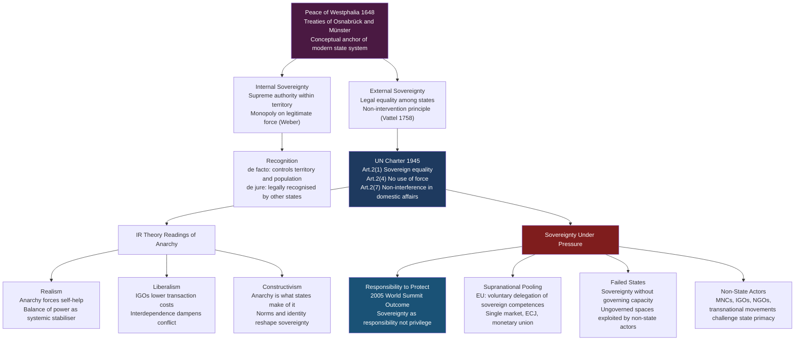

# The State System and Sovereignty

> [!abstract] TL;DR
> The Peace of Westphalia (1648) established the modern international order: a decentralised system of legally equal, territorially sovereign states with no superior authority above them — a condition IR theorists call "anarchy." Sovereignty means supreme authority within a territory (internal) and legal independence from outside interference (external). This Westphalian model, codified in the 1945 UN Charter, is now contested by Responsibility to Protect doctrine, European supranational pooling, globalisation, and the proliferation of non-state actors.

---

## Intuition

**Analogy:** Imagine a planet-wide city of gated compounds, each owned by a different family. There is no mayor, no police force, no court that can enter any compound without the owner's permission. Each family makes its own rules inside its walls and is legally equal to every other family regardless of size or wealth. If a large family builds a weapons cache, neighbouring families must cope by forming their own mutual-defence pact — no external authority will step in. This is the Westphalian state system: the "families" are states, the "compounds" are territories, and the absence of a global mayor is what IR theorists call *international anarchy* — not chaos, but the structural fact of no overarching sovereign above sovereign states.

The tension at the heart of the system is that the same walls that protect a family from outside interference also shield it if it begins abusing its own members. When that happens — genocide, mass atrocity — the question of whether neighbours may breach the gate is the central dilemma of modern international law.

---

## How It Works



---

## Key Concepts

### Secondary Level

**What is a state?** The Montevideo Convention (1933, Art. 1) provides the classic definition: a state must have (1) a permanent population, (2) a defined territory, (3) an effective government, and (4) the capacity to enter into relations with other states. This is the *de facto* test — it focuses on empirical control, not legal recognition.

**What is sovereignty?** Sovereignty means the right to make final decisions within a territory without external override. The French jurist Jean Bodin (1576, *Six livres de la République*) was first to define it systematically: sovereignty is "the absolute and perpetual power of a republic," indivisible and above ordinary law. In practice, sovereignty has two faces:
- **Internal sovereignty**: the government's supreme authority over its own population and institutions — the right to tax, legislate, use force.
- **External sovereignty**: the state's legal independence and equality vis-à-vis all other states — the right not to be commanded by any outside power.

**Territorial integrity**: The norm that borders should not be changed by force. Codified in UN Charter Art. 2(4): "All members shall refrain from the threat or use of force against the territorial integrity or political independence of any State."

**Recognition** distinguishes *de facto* from *de jure* status:
- *De facto*: an entity actually controls a territory and population (e.g. Taiwan since 1949).
- *De jure*: an entity is legally recognised as a state by other members of the international community.
A government can be *de jure* recognised but *de facto* collapsed (Yemen's internationally recognised government vs. Houthi control), or *de facto* effective but not *de jure* recognised (Kosovo is recognised by 100+ states but not by Serbia or Russia).

### Undergraduate Level

**The Peace of Westphalia (1648)** ended the Thirty Years' War. The treaties — the Treaty of Osnabrück (Holy Roman Empire + Protestant powers) and the Treaty of Münster (Holy Roman Empire + France) — modified the *cuius regio, eius religio* principle to permit religious pluralism, reduced papal and Imperial authority over territorial princes, and cemented dynastic territorial sovereignty. Modern scholars (Krasner 1993; Osiander 2001) note that "Westphalian sovereignty" is partly a retrospective construction: the 1648 treaties do not explicitly articulate the non-intervention norm. The conceptual apparatus was built by Grotius, Pufendorf, and especially Vattel across the following century.

**Emer de Vattel (1758)** — *Le Droit des Gens (The Law of Nations)* — is the pivotal text. Vattel synthesised natural law with the practice of European states to argue: (1) states are equal legal persons regardless of size; (2) no state may interfere in another's internal governance; (3) states are bound by treaty obligations freely entered. This remains the deep grammar of modern international law.

**The UN Charter framework (1945)** codified the Westphalian order:
- Art. 2(1): "The Organisation is based on the principle of the sovereign equality of all its Members."
- Art. 2(4): Prohibition on the threat or use of force against territorial integrity.
- Art. 2(7): Prohibition on UN intervention in matters "essentially within the domestic jurisdiction of any state" — except under Chapter VII enforcement action.
- Chapter VII: The Security Council may authorise force against "threats to the peace, breaches of the peace, or acts of aggression."

The tension between Art. 2(7) and Chapter VII defines the central fault line of humanitarian intervention debates.

**IR theory frameworks** interpret anarchy differently:
- **Realism** (Morgenthau 1948; Waltz 1979): States are rational unitary actors. Anarchy is the permissive cause of war — without a Leviathan above states, they must pursue self-help. The *security dilemma* arises because one state's defensive build-up is indistinguishable from offensive preparation. Power balancing is the systemic stabiliser.
- **Neoliberal institutionalism** (Keohane 1984; Nye): Complex interdependence, *absolute gains*, and IGOs matter. Institutions reduce the transaction costs of cooperation by providing information, monitoring, and enforcement mechanisms. States cooperate even under anarchy.
- **Constructivism** (Wendt 1992): "Anarchy is what states make of it." Sovereignty, recognition, and even the state itself are socially constructed norms, not structural givens. Identities and interests are constituted through interaction — the same material structure can produce a Hobbesian, Lockean, or Kantian culture.

### Graduate Level

**Krasner's "Organised Hypocrisy" (1999)**: Sovereignty is a norm that is persistently and pervasively violated. Krasner distinguishes four types of sovereignty: *Westphalian* (external autonomy), *international legal* (mutual recognition), *domestic* (effective internal authority), and *interdependence* (control of cross-border flows). These frequently come apart. Powerful states routinely violate Westphalian and interdependence sovereignty — through conditionality, coercive interference, and neocolonial economic dependence — while maintaining the fiction of *international legal* equality. The system endures not because norms are followed, but because they provide a convenient shared vocabulary for legitimation: hence "organised hypocrisy."

**Norm evolution and the R2P cascade**: The Responsibility to Protect originated in the 2001 ICISS report (*The Responsibility to Protect*, Evans & Sahnoun) and was unanimously adopted at the 2005 UN World Summit Outcome Document (paras. 138–140). R2P rests on three equal pillars:
1. Each state has the primary responsibility to protect its population from genocide, war crimes, ethnic cleansing, and crimes against humanity.
2. The international community should assist states in fulfilling this responsibility.
3. When a state manifestly fails to protect — or is itself the perpetrator — the international community may act through the Security Council.

R2P represents a conceptual shift from *sovereignty as privilege* to *sovereignty as responsibility* — reflecting a Finnemore-Sikkink-style norm cascade from NGO advocacy (post-Rwanda, post-Bosnia) through norm emergence, cascade, and internalisation. Its application to Libya (UNSC Res. 1973, 2011) then triggered a severe backlash when regime change followed, producing a "R2P hangover" that paralysed the UNSC on Syria.

**Post-colonial critique**: The Westphalian state system was imposed on the non-European world through colonialism. African and Asian state borders were drawn at the Congress of Berlin (1884–85) and in post-WWI mandates without reference to ethnic, linguistic, or historical communities. The "standard of civilisation" discourse denied sovereignty to non-European polities. Decolonisation (1945–1975) produced formal legal sovereignty for new states, but *de facto* sovereignty remained constrained by Cold War patron-client structures, conditionality-laden IMF/World Bank programmes, and structural economic dependence.

**Failed states** — Somalia (since 1991), Libya (since 2011), Yemen (ongoing) — expose the gap between *de jure* and *de facto* sovereignty. A state can hold a UN seat while controlling no territory. Failed states create ungoverned spaces exploited by non-state armed groups (al-Shabaab, ISIS, Houthi movement), producing a sovereignty paradox: the shell of legal recognition persists even when the substance of effective governance has collapsed.

---

## Python Demo

```python
import numpy as np

# Model the international system as a directed alliance network
# Nodes = great powers; A[i][j] = 1 if state i has formal alliance with state j
# Compare polarity: UNIPOLAR (post-Cold War hub-and-spoke) vs MULTIPOLAR (2020s blocs)

states = ["US", "China", "Russia", "UK", "France", "Germany", "Japan", "India"]
n = len(states)

# --- UNIPOLAR SYSTEM (1991-2008): US as dominant hub ---
# NATO allies cluster around US; China-Russia dyad; India non-aligned
unipolar = np.array([
    # US  CN  RU  UK  FR  DE  JP  IN
    [  0,  0,  0,  1,  1,  1,  1,  0 ],  # US: NATO + Japan alliance
    [  0,  0,  1,  0,  0,  0,  0,  0 ],  # China: Sino-Russian alignment
    [  0,  1,  0,  0,  0,  0,  0,  0 ],  # Russia: Sino-Russian
    [  1,  0,  0,  0,  1,  1,  0,  0 ],  # UK: NATO + Five Eyes
    [  1,  0,  0,  1,  0,  1,  0,  0 ],  # France: NATO
    [  1,  0,  0,  1,  1,  0,  0,  0 ],  # Germany: NATO
    [  1,  0,  0,  0,  0,  0,  0,  0 ],  # Japan: US-Japan Security Treaty
    [  0,  0,  0,  0,  0,  0,  0,  0 ],  # India: Non-Aligned Movement
], dtype=float)

# --- MULTIPOLAR SYSTEM (2020s): two blocs + swing states ---
# China-Russia "no limits" partnership; India in QUAD but maintains Russia ties
multipolar = np.array([
    # US  CN  RU  UK  FR  DE  JP  IN
    [  0,  0,  0,  1,  1,  1,  1,  0 ],  # US: NATO + QUAD
    [  0,  0,  1,  0,  0,  0,  0,  1 ],  # China: Sino-Russian + India economic ties
    [  0,  1,  0,  0,  0,  0,  0,  0 ],  # Russia: Sino-Russian axis
    [  1,  0,  0,  0,  1,  1,  0,  0 ],  # UK: NATO + AUKUS
    [  1,  0,  0,  1,  0,  1,  0,  0 ],  # France: NATO
    [  1,  0,  0,  1,  1,  0,  0,  0 ],  # Germany: NATO
    [  1,  0,  0,  0,  0,  0,  0,  1 ],  # Japan: US-Japan + QUAD ties with India
    [  0,  1,  0,  0,  0,  0,  1,  0 ],  # India: QUAD (US/Japan) + Russia arms ties
], dtype=float)


def degree_centrality(A, states):
    """Normalised total degree (in + out) for each node."""
    total = A.sum(axis=0) + A.sum(axis=1)   # in-degree + out-degree
    centrality = total / (2 * (len(states) - 1))
    return dict(zip(states, centrality))


def eigenvector_centrality(A, max_iter=200, tol=1e-8):
    """Power iteration: a state is influential if allied to other influential states."""
    x = np.ones(A.shape[0]) / A.shape[0]
    for _ in range(max_iter):
        x_new = A @ x
        norm = np.linalg.norm(x_new)
        if norm < 1e-12:
            break
        x_new /= norm
        if np.linalg.norm(x_new - x) < tol:
            break
        x = x_new
    return dict(zip(states, x))


def analyze_polarity(A, states, label):
    dc = degree_centrality(A, states)
    ec = eigenvector_centrality(A)
    hub = max(dc, key=dc.get)

    print(f"\n{'='*56}")
    print(f"  {label}")
    print(f"{'='*56}")
    print(f"  {'State':<10} {'Degree Cent.':<16} {'Eigenvect. Cent.'}")
    print(f"  {'-'*48}")
    for s in states:
        print(f"  {s:<10} {dc[s]:<16.3f} {ec[s]:.4f}")
    print(f"\n  Dominant hub: {hub}  (degree centrality = {dc[hub]:.3f})")
    return dc


dc_uni   = analyze_polarity(unipolar,   states, "UNIPOLAR  (post-Cold War hub-and-spoke)")
dc_multi = analyze_polarity(multipolar, states, "MULTIPOLAR (2020s bloc crystallisation)")

print(f"\n{'='*56}")
print("  Polarity Shift: Centrality Change (multipolar - unipolar)")
print(f"{'='*56}")
for s in states:
    delta = dc_multi[s] - dc_uni[s]
    arrow = "UP  " if delta > 0 else "DOWN" if delta < 0 else "FLAT"
    print(f"  {s:<10} [{arrow}] {delta:+.3f}")

# Structural insight: polarity index = variance of degree centrality
# Higher variance = more hierarchical (unipolar); lower = more equal (multipolar)
var_uni   = np.var(list(dc_uni.values()))
var_multi = np.var(list(dc_multi.values()))
print(f"\n  Centrality variance — Unipolar: {var_uni:.4f}  |  Multipolar: {var_multi:.4f}")
print("  (Lower variance in multipolar system = more diffuse power distribution)")
```

**What this shows:** In the unipolar matrix, the US scores highest on both degree and eigenvector centrality — it is the hub through which most alliance paths run. In the multipolar matrix, India and Japan gain centrality (both enter QUAD linkages), China's eigenvector centrality rises (allied to Russia and India), and the variance of the degree distribution falls — power is more diffuse. This mirrors the structural argument of Kenneth Waltz: the number of poles (hubs) determines the character of the system.

---

## Real-World Applications

**The Kosovo Precedent (1999 / 2008):** NATO's 1999 air campaign against Yugoslavia over Kosovo occurred without UNSC authorisation (Russia and China would have vetoed). The Independent International Commission on Kosovo (2000) called it "illegal but legitimate" — a formula that exposed the gap between positive international law (sovereignty, non-intervention) and moral claims. Kosovo's 2008 declaration of independence and recognition by 100+ states created a precedent that Russia explicitly cited to justify recognition of South Ossetia (2008) and Crimea's annexation (2014), illustrating how norm violations by major powers are contagious.

**The European Union:** The EU is the most advanced voluntary pooling of sovereignty in history. Member states have delegated competences over trade (exclusive EU competence), monetary policy (Eurozone), border control (Schengen), and law (ECJ supremacy) to supranational institutions. Yet member states remain sovereign: Brexit demonstrated that the pooling is reversible. The EU represents neither a federation (single sovereign) nor a traditional international organisation (sovereignty fully retained) — it is a new institutional form that challenges the binary of "sovereign state vs. international anarchy."

**Failed States and the Security Vacuum:** Somalia has been without an effective central government since 1991. It retains a UN seat, an internationally recognised government, and a flag — all hallmarks of *de jure* sovereignty — while large portions of territory are controlled by al-Shabaab. The *de jure*/*de facto* gap creates a security vacuum: piracy in the Gulf of Aden required multilateral naval coalitions (2008–present); terrorist financing and training moved through ungoverned spaces. The Westphalian norm of non-intervention means external actors must work with (or around) a nominal government that controls little.

**The UN Security Council veto and sovereignty protection:** The P5 veto (US, UK, France, China, Russia) was designed to ensure great-power consensus before collective action. In practice, it has consistently protected sovereignty claims of P5 allies while facilitating intervention against adversaries. Russia's veto blocked UNSC action on Syria 2011–present; the US veto has shielded Israeli actions in Palestinian territories. This structural hypocrisy validates Krasner's point: sovereignty as a norm is selectively enforced, instrumentalised by great powers to protect strategic interests.

---

## Common Pitfalls

- **Treating "Westphalia" as a historical fact rather than a myth** — The 1648 treaties did not articulate the non-intervention norm. The "Westphalian system" is a 19th–20th-century retroactive construct. Useful as a conceptual anchor, but do not cite the 1648 treaties as the legal source of non-intervention.
- **Conflating sovereignty with effective governance** — A state can be fully sovereign (recognised, UN member) while unable to deliver basic services. Sovereignty is a legal status, not a description of capacity. Confusing the two leads to policy errors in failed-state interventions.
- **Treating anarchy as synonymous with disorder** — In IR theory, anarchy is a technical term meaning "absence of a superior authority," not "chaos." Waltz's structural realism argues that anarchic systems can be highly ordered (through balance of power). Conflating anarchy with disorder misreads the realist tradition.
- **Assuming R2P creates a legal right to intervene** — R2P is a political commitment adopted at the World Summit, not a legally binding treaty norm. It does not override the requirement for UNSC authorisation under the UN Charter. The Libyan case (2011) where NATO extended a civilian-protection mandate into regime change seriously damaged R2P's credibility and subsequent UNSC willingness to invoke it.
- **Ignoring the colonial origins of the state system** — The Westphalian system was a European construct exported through colonialism. Applying it universally without acknowledging that many post-colonial states were given sovereignty over territories with arbitrary borders, fragmented societies, and extractive institutional legacies produces a distorted baseline for normative IR theory.
- **Equating non-recognition with non-existence** — Taiwan functions as a fully sovereign state in almost every empirical respect (army, currency, courts, elections, foreign trade) yet is not recognised by most UN members. The legal and empirical dimensions of statehood frequently diverge; policy analysis must track both.

---

## Related Concepts

- [[Nash_Equilibrium]] — International anarchy is structurally analogous to an n-player prisoner's dilemma; the security dilemma produces suboptimal Nash equilibria (arms races) even when cooperation would be Pareto-superior.
- [[Repeated_Games_and_Folk_Theorems]] — The "shadow of the future" in repeated interactions explains why states cooperate under anarchy: sufficiently patient states can sustain cooperative outcomes through reciprocity (tit-for-tat), underpinning treaty regimes and alliances.
- [[Bargaining_Theory]] — Diplomatic negotiations — arms control treaties, peace agreements, trade deals — are formalised bargaining games between sovereign states with outside options (war, autarky) that determine disagreement payoffs.
- [[Price_of_Anarchy]] — The systemic cost when sovereign states pursue national interest without coordination; global commons problems (climate, pandemics, nuclear proliferation) quantify the price of international anarchy.
- [[Public_Goods]] — Global security, open sea lanes, pandemic surveillance, and climate stability are international public goods — non-excludable and non-rival — whose underprovision under sovereignty illustrates collective-action failure at the interstate level.
- [[Balance_of_Payments]] — The economic dimension of state power: persistent current-account surpluses build financial reserves that translate into geopolitical leverage; BOP dynamics connect macroeconomic interdependence to sovereignty constraints.

---

## Review Questions

### Secondary
1. A new territory declares independence, controls its land, has a government and population, but no other country recognises it. Is it a state? Use the Montevideo Convention criteria to make the case both for and against.
2. Why does having no world government not mean the international system is in constant chaos? Describe two mechanisms that produce order among sovereign states without a central authority.
3. What is the difference between internal and external sovereignty? Give one real example where a government has external sovereignty but limited internal sovereignty.

### Undergraduate
1. Realists and liberals look at the same anarchic international system and reach different conclusions about the prospects for cooperation. What is the core empirical disagreement between them, and what evidence from post-1945 history supports each side?
2. The UN Charter Art. 2(7) prohibits interference in domestic affairs, but Art. 51 preserves the right to self-defence and Chapter VII allows collective security action. Given these provisions, construct the strongest legal argument for — and then against — the 2011 NATO intervention in Libya.
3. Krasner argues sovereignty is "organised hypocrisy." Does this mean the norm is meaningless? Explain what normative work the concept of sovereignty still performs even when it is routinely violated.

### Graduate
1. Compare the Finnemore-Sikkink norm-cascade model with Krasner's organised-hypocrisy framework as theories of norm change in international relations. Can both be correct simultaneously? Use R2P as your empirical test case.
2. Wendt claims "anarchy is what states make of it." Waltz claims the structure of anarchy constrains state behaviour regardless of identity. Design a research study — specifying your unit of analysis, independent variable, dependent variable, and a falsifying observation — that could adjudicate between these claims.
3. Post-colonial theorists argue the Westphalian system is not a neutral framework but one that encoded European imperial power. How does this critique affect normative arguments about humanitarian intervention, failed states, and the R2P doctrine? Is there a way to defend R2P while taking the post-colonial critique seriously?

---

## Sources

- [Krasner, Stephen D. *Sovereignty: Organized Hypocrisy*. Princeton University Press, 1999](https://press.princeton.edu/books/paperback/9780691007298/sovereignty)
- [Wendt, Alexander. "Anarchy is What States Make of It." *International Organization* 46(2), 1992](https://www.cambridge.org/core/journals/international-organization/article/anarchy-is-what-states-make-of-it-the-social-construction-of-power-politics/395EB231A2D5C0BE2F8BFC41C2A08C9C)
- [What is R2P? — Global Centre for the Responsibility to Protect](https://www.globalr2p.org/what-is-r2p/)
- [Osiander, Andreas. "Sovereignty, International Relations, and the Westphalian Myth." *International Organization* 55(2), 2001](https://www.cambridge.org/core/journals/international-organization/article/abs/sovereignty-international-relations-and-the-westphalian-myth/33B6B7773432BE494F31518952ABE881)
- [Vattel, Emer de. *The Law of Nations* (1758). Liberty Fund edition, 2008](https://oll.libertyfund.org/title/vattel-the-law-of-nations)
- [UN Charter, Chapters I and VII — United Nations](https://www.un.org/en/about-us/un-charter)
- [Waltz, Kenneth N. *Theory of International Politics*. McGraw-Hill, 1979 (Waveland Press reprint, 2010)](https://www.waveland.com/browse.php?t=394)

---

#PoliticalScience #InternationalRelations #Sovereignty #WestphalianSystem #Geopolitics
