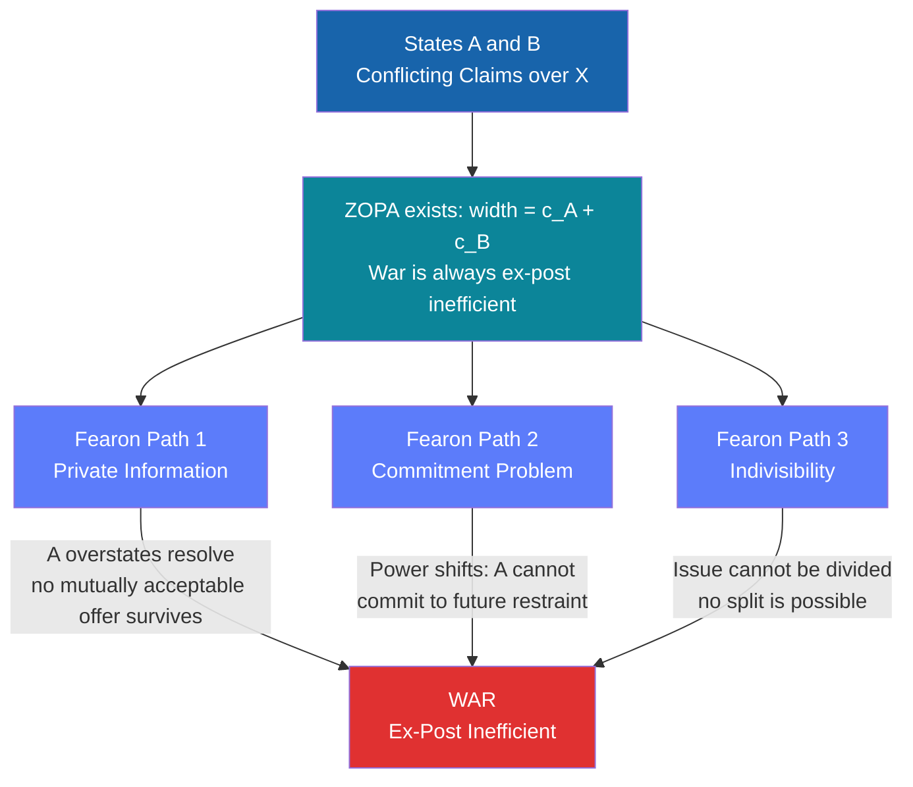

# ⚔️ War, Conflict, and Security

> [!abstract] TL;DR
> War is organized, politically motivated violence between groups; security studies asks why it erupts, how it can be deterred, and what limits its conduct. The field's central puzzle is Fearon's (1995) observation that war is always ex-post inefficient — given war costs, states can always find a deal both prefer to fighting — yet wars occur because private information about resolve, commitment problems caused by shifting power, and occasionally indivisible issues destroy the bargaining range before any deal is reached.

---

## Intuition

**Analogy:** Two neighbors both want the only parking spot on the street. A fistfight costs bruises, time, and the relationship; surely some coin-flip or side-payment exists that both prefer to brawling. War is the same puzzle at scale: since fighting is costly for both sides, a negotiated deal should always be preferable to battle. So the interesting question is never "why prefer peace?" — it is "why does the deal collapse before both sides can reach one?"

Three obstacles bring down negotiations: each side misrepresents how tough it is (private information), one side cannot credibly promise not to exploit a future power advantage (commitment problem), or the thing being contested literally cannot be shared (indivisibility). These three mechanisms drive virtually every war in Fearon's rationalist account and define the research agenda for modern security studies.

---

## How It Works

### Core Mechanics

States A and B contest a divisible prize x ∈ [0, 1] (territory, trade access, regime). If war occurs, A wins with probability p, losing with probability 1 − p; both pay a war cost (c_A, c_B > 0). Expected war payoffs:

- A: p − c_A
- B: (1 − p) − c_B

A deal x is Pareto-superior to war for **both** sides when:

- A accepts: x ≥ p − c_A
- B accepts: 1 − x ≥ (1 − p) − c_B, equivalently x ≤ p + c_B

**Zone of Possible Agreement (ZOPA):** [p − c_A, p + c_B], width = c_A + c_B > 0 always.

Because c_A + c_B is always positive, a mutually preferred deal always exists in principle. War is always ex-post inefficient. Fearon's three rationalist explanations explain why rational states fight anyway.

### Flow — Fearon Bargaining Mechanism



---

## Key Concepts

### Secondary Level

**Clausewitz's dictum** (*On War*, 1832): "War is the continuation of politics by other means." War is not a breakdown of politics but a political instrument — states use violence when they calculate it achieves goals that diplomacy cannot. This means wars have political objectives, and fighting stops when those objectives are met, become unattainable, or become too costly.

**Waltz's three images** (*Man, the State, and War*, 1959): War can be explained at three levels of analysis:
- **First image (human nature):** War stems from greed, fear, or irrationality in individual leaders (Hitler's pathology, miscalculation).
- **Second image (state structure):** Certain regime types — authoritarian states, ethnically divided societies, economically stressed polities — are more war-prone.
- **Third image (international system):** The absence of a world government (anarchy) forces states to rely on self-help, creating structural incentives for conflict regardless of who governs them.

Waltz argued the third image is most powerful: anarchy shapes incentives independently of leaders or regime type. This became the foundation of structural realism (neorealism).

**Types of armed conflict:**
- **Interstate war:** two or more sovereign states fight directly (WWI, WWII, Iran-Iraq War)
- **Civil war / intrastate war:** armed fighting within a state between government and non-state actor(s) (Syrian Civil War, Rwanda)
- **Asymmetric / guerrilla war:** a weak group fights a strong state via non-conventional tactics (Vietnam, Afghanistan)
- **Proxy war:** great powers fund surrogate forces without direct combat (Cold War conflicts in Korea, Vietnam, Angola, Nicaragua)

**Just War Theory** (Augustine, Aquinas, Grotius, Walzer): War is morally permissible only if it satisfies two independent sets of criteria:
- **Jus ad bellum** (right to go to war): just cause, right intention, war as last resort, declaration by legitimate authority, reasonable prospect of success, proportionality of ends.
- **Jus in bello** (conduct in war): discrimination between combatants and civilians, proportionality of means, no use of prohibited weapons. Violations constitute war crimes regardless of whether the war itself was just.

### Undergraduate Level

**Security Dilemma** (Herz 1950, Jervis 1978): When a state arms for defense, other states perceive a threat and arm in response, leaving everyone less secure than before. The dilemma is structural — even with purely defensive intentions, an arms buildup cannot be distinguished from offensive preparation.

Example: State A builds a navy to protect shipping lanes. State B, fearing naval aggression, builds a larger fleet. State A responds in kind. Both are now poorer and more at risk than before either started.

Jervis (1978) identifies the key variables: the offense-defense balance (how distinguishable are defensive from offensive weapons?) and the offense-defense dominance (which side has an advantage in any given exchange?). When offense is dominant and the two are indistinguishable, the security dilemma is most severe and arms race spirals are most likely.

**Arms Races and Richardson Equations** (Richardson, 1960): Lewis F. Richardson modeled arms competition as a coupled linear differential system:

dx/dt = ay − mx + g  
dy/dt = bx − ny + h

Where x, y are military expenditures of states X and Y; a, b > 0 are reaction coefficients (how much each side responds to the other's buildup); m, n > 0 are economic fatigue terms (internal resistance to spending); g, h are grievance constants (> 0 means hostile, < 0 means cooperative). The equilibrium spending levels are:

x\* = (ng + ah) / (nm − ab),  y\* = (mh + bg) / (nm − ab)

The system is **stable** (arms race converges to equilibrium) iff nm > ab — fatigue dominates reaction. It is **unstable** (arms race spirals without bound) iff ab > nm — reaction dominates fatigue. Historically, the Anglo-German naval race of 1898–1914 is the canonical unstable case; the US-USSR Cold War buildup eventually stabilized.

**Deterrence Theory:** States prevent attacks by threatening unacceptable retaliation. Three requirements (Huth 1999): capability to retaliate, credibility of the threat, and communication of both to the adversary.

*Classical deterrence* concerns conventional forces. *Nuclear deterrence* relies on the threat of nuclear retaliation. **Mutually Assured Destruction (MAD):** The US-Soviet nuclear balance sustained peace through the logic that any first strike would trigger a devastating second strike, making war irrational for both sides. **Extended deterrence** applies a nuclear guarantee to allies — the US commitment to retaliate on behalf of NATO members — creating the central credibility problem of alliance politics.

**Democratic Peace Theory** (Kant 1795, Doyle 1983, Russett 1993): Democracies almost never fight each other. This is among the most replicated empirical findings in international relations. Proposed mechanisms: (1) institutional constraints (audience costs, legislative approval) make democratic leaders harder to push into war; (2) democratic norms of peaceful dispute resolution transfer between democracies; (3) democracies tend toward economic interdependence, raising the cost of conflict between them. The empirical finding is dyadic, not monadic — democracies fight non-democracies regularly.

### Graduate Level

**Fearon's Rationalist Explanations for War (1995) — Formal treatment:**

*Private information with incentives to misrepresent:* Each state has private knowledge of its own resolve and capabilities. A state with high resolve has an incentive to misrepresent by claiming low resolve (to extract concessions). Knowing this incentive exists, adversaries rationally discount all such claims. The result is that no credible revelation mechanism exists, and the effective bargaining range collapses. Under a take-it-or-leave-it model where B has private cost c_B ~ U[0, C_max], A's optimal offer x\* trades extraction against war risk. Formally, A maximizes:

f(x) = x · P(accept) + (p − c_A) · P(reject)  
     = x · (C_max − (x − p)) / C_max + (p − c_A) · (x − p) / C_max

First-order condition yields x\* = (p + C_max / 2) and P(war) = (x\* − p) / C_max = 1/2. Under uniform private information, A's optimal bluff induces war with probability 1/2 even though the full-information ZOPA is always non-empty.

*Commitment problems:* Even under complete information, rapid shifts in the balance of power prevent credible commitment. A rising state A cannot credibly promise not to exploit its future strength. The declining B, anticipating worse future terms, prefers preventive war today. Powell (2006) demonstrates that large and rapid shifts in power — not the level of power itself — are the key structural predictor of conflict onset. WWI Germany's fear of Russian industrialization, Israel's preemptive strike in 1967, and US concern about a nuclear-armed Iraq all contain commitment-problem logic.

*Indivisibility:* A small class of issues — sovereignty, the exclusive legitimacy of a monarch, control of certain holy sites — resist division by their nature. Fearon acknowledges this but argues the mechanism is often overstated: states routinely compromise on nominally "indivisible" issues once war costs are high enough (e.g., the Good Friday Agreement on Northern Ireland).

**Civil Wars — Greed vs. Grievance (Collier and Hoeffler, 2004):** Two competing accounts of civil war onset:
- *Grievance:* groups rebel because of political exclusion, ethnic discrimination, or relative deprivation.
- *Greed:* rebel groups are motivated by economic opportunity — lootable resources (diamonds in Sierra Leone, oil in Sudan) finance and incentivize rebellion.

Collier and Hoeffler's cross-country statistical analysis found that greed-related variables (primary commodity export dependence, low per-capita income, low male secondary education) significantly predicted civil war onset, while standard grievance measures did not. This triggered significant controversy. Blattman and Miguel (2010) review micro-level evidence and argue both matter; the greed/grievance dichotomy is a misspecification of the problem.

**Kalyvas (2006) — The Logic of Violence in Civil War:** Violence in civil war is not simply driven by ideology or ethnic hatred but by local social control. When a combatant faction controls a territory, it can selectively target collaborators with the enemy. When control is contested, both factions use indiscriminate violence against civilians who might aid the opponent. The "master cleavage" (rebel vs. government) intersects with "local cleavages" (village disputes, land feuds, personal vendettas), meaning much civil war violence is instrumentalized by local actors settling private scores under the cover of political conflict.

**Deterrence and Credibility — Schelling (1960) and SPE:** A deterrence threat deters only if it is both capable and credible. The fundamental credibility problem: would the US genuinely risk nuclear annihilation to defend a distant ally? Schelling argued states solve this through commitment devices: stationing troops as tripwires (making non-response costly to the defender's reputation), making public pledges that create audience costs, or automating certain responses. In game-theoretic terms, a deterrence threat must be subgame perfect — optimal to carry out when called upon — otherwise a rational adversary will call the bluff. Non-credible threats are NE but not SPE.

**Asymmetric Warfare and Insurgency:** Mao Zedong's three-stage theory: (1) strategic defense — build popular support, avoid pitched battle; (2) equilibrium — harass and attrit the state's forces; (3) strategic offense — conventional operations once the state is degraded. Galula (1964) and US Army FM 3-24 (2006) argue that the decisive center of gravity in counterinsurgency (COIN) is the civilian population: insurgencies win or lose based on popular legitimacy, not battlefield outcomes. The population's security and access to governance determines which side they support — and support determines intelligence, recruitment, and ultimately control of territory.

**Humanitarian Intervention and Responsibility to Protect (R2P):** Traditional sovereignty (Westphalian norm) prohibits intervention in internal affairs. R2P (ICISS 2001, UN 2005) reconceptualizes sovereignty as conditional: if a state massacres its own population, the international community has a responsibility to protect civilians, up to and including armed intervention. The norm remains contested in practice — successful invocations (Kosovo 1999, Libya 2011) coexist with failure (Rwanda 1994, Syria 2011–).

---

## Python Demo

```python
import numpy as np
import matplotlib.pyplot as plt

# ── Fearon (1995) Bargaining Model of War ──────────────────────────────────
# States A and B contest a divisible prize x ∈ [0, 1].
# War: A wins with prob p, per-side costs c_A and c_B.
# War payoffs:  U_A = p - c_A,  U_B = (1-p) - c_B
# A deal x is Pareto-superior to war for both sides when:
#   x  >= p - c_A        (A's minimum acceptance threshold)
#   1-x >= (1-p) - c_B   i.e.  x <= p + c_B  (B's maximum concession)
# ZOPA: [p - c_A,  p + c_B]   width = c_A + c_B > 0 always
# War is ALWAYS ex-post inefficient; three panels show why it still occurs.

p   = 0.60   # A's probability of winning a war
c_A = 0.10   # A's war cost (fraction of prize)
c_B = 0.08   # B's war cost (fraction of prize)

fig, axes = plt.subplots(1, 3, figsize=(15, 5))
fig.suptitle("Fearon (1995) — Bargaining Model of War", fontsize=14, fontweight="bold")

# ── Panel 1: Baseline ZOPA ─────────────────────────────────────────────────
ax = axes[0]
a_war = p - c_A    # A's minimum acceptable deal (reservation value)
b_war = p + c_B    # B's maximum concession (from A's perspective)
ax.axvspan(a_war, b_war, alpha=0.3, color="green",
           label=f"ZOPA  [{a_war:.2f}, {b_war:.2f}]")
ax.axvline(a_war, color="navy",      linestyle="--", linewidth=1.5,
           label=f"A war value  p-c_A = {a_war:.2f}")
ax.axvline(b_war, color="firebrick", linestyle="--", linewidth=1.5,
           label=f"B war value  p+c_B = {b_war:.2f}")
ax.axvline(p,     color="gray",      linestyle=":",  linewidth=1.5,
           label=f"Balance of power  p = {p:.2f}")
ax.set_xlim(0, 1)
ax.set_xlabel("Settlement share for A  (x)")
ax.set_title("Baseline: ZOPA always exists\n(war is mutually costly)")
ax.set_yticks([])
ax.legend(fontsize=7, loc="upper left")

# ── Panel 2: Private Information → positive P(war) ────────────────────────
# B has PRIVATE war cost  c_B ~ Uniform[0, C_max]; A knows only the distribution.
# A makes a take-it-or-leave-it offer x maximising A's expected payoff.
# P(B accepts x) = P(c_B >= x - p) = (C_max - (x - p)) / C_max  for x in [p, p+C_max]
# f(x) = x * P(accept) + (p - c_A) * P(reject)
ax = axes[1]
C_max  = 0.25
x_rng  = np.linspace(p, p + C_max, 300)
p_acc  = (C_max - (x_rng - p)) / C_max
f_x    = x_rng * p_acc + (p - c_A) * (1 - p_acc)
x_star = float(x_rng[np.argmax(f_x)])
p_war  = float((x_star - p) / C_max)

ax.plot(x_rng, f_x, color="navy", linewidth=2, label="A expected payoff f(x)")
ax.axvline(x_star, color="red", linestyle="--",
           label=f"Optimal offer x* = {x_star:.3f}\nP(war) = {p_war:.3f}")
ax.axhline(p - c_A, color="gray", linestyle=":",
           label=f"A war payoff = {p - c_A:.2f}")
ax.set_xlabel("Offer x (share A demands)")
ax.set_ylabel("A expected payoff")
ax.set_title(f"Private Information (Path 1)\nc_B ~ U[0, {C_max}]")
ax.legend(fontsize=7)

# ── Panel 3: Commitment Problem → preventive war ──────────────────────────
# A is the rising power: today's balance p_0 grows to p_1 next period.
# B's war payoff today:         (1 - p_0) - c_B
# B's discounted future peace:  delta * (1 - p_1)   (best deal B can hope for)
# B prefers preventive war when war payoff today > discounted future peace.
# net = [(1 - p_0) - c_B] - delta*(1 - p_1)  > 0  => fight now
ax = axes[2]
delta      = 0.90
p0_vals    = np.linspace(0.30, 0.70, 300)
b_war_now  = 1 - p0_vals - c_B

for p1, col, ls in [
    (0.65, "green",      "-"),
    (0.75, "darkorange", "--"),
    (0.85, "red",        "-."),
]:
    net = b_war_now - delta * (1 - p1)
    ax.plot(p0_vals, net, color=col, linestyle=ls, label=f"p_future = {p1}  (delta={delta})")

ax.axhline(0, color="black", linewidth=1.2)
net_085 = b_war_now - delta * (1 - 0.85)
ax.fill_between(p0_vals, 0, net_085.clip(min=0), alpha=0.12, color="red")
ax.text(0.55, 0.03, "B fights now", color="darkred", fontsize=9)
ax.set_xlabel("Today's balance of power  (p_0,  A's strength)")
ax.set_ylabel("B net gain from fighting today\nvs discounted future peace")
ax.set_title(f"Commitment Problem (Path 2)\nPreventive War  (delta={delta})")
ax.legend(fontsize=7)

plt.tight_layout()
plt.savefig("fearon_bargaining_war.png", dpi=100, bbox_inches="tight")
plt.show()

print(f"Baseline ZOPA width:  {c_A + c_B:.2f}  (= c_A + c_B, always positive)")
print(f"Optimal offer under private info:  x* = {x_star:.3f}")
print(f"P(war) under private info (c_B uniform):  {p_war:.3f}")
```

---

## Real-World Applications

**World War I — Commitment Problem and Misperception (1914):**
Germany feared a rising Russia whose military modernization by 1917 would make a two-front war unwinnable — a textbook preventive war logic from Fearon's second path. Simultaneously, none of the major powers accurately read each other's resolve (British hesitation misled Berlin; Austro-Hungarian firmness surprised Vienna's allies). July 1914 is a case where both the private information failure and commitment problem operated simultaneously: no state could credibly signal its actual red lines, and Germany could not commit to accepting a future of Russian dominance.

**Cold War — Deterrence Success and Cuban Brinkmanship:**
The US-Soviet nuclear standoff (1945–1991) is the canonical successful deterrence case. MAD held because each side's second-strike capability was visible and credible — capable, communicated, and effectively invulnerable. The Cuban Missile Crisis (1962) tested extended deterrence directly: Kennedy's naval quarantine, backed by the threat of nuclear escalation, forced Khrushchev to remove Soviet missiles. The resolution — through back-channel diplomacy — illustrates Fearon's bargaining mechanism: once both sides privately signaled their actual red lines (Kennedy's assurance about Turkey missiles, Khrushchev's fear of war), the ZOPA became visible and a deal was struck.

**Rwanda Genocide (1994) — Ethnic Security Dilemma:**
Barry Posen (1993) applied the security dilemma to ethnic conflict: when a state collapses, ethnic groups face the same anarchic self-help problem as sovereign states — with no government to enforce agreements, each group must arm. Hutu extremists in Rwanda reframed Tutsis as an existential threat (private information manipulation) and exploited structural insecurity to mobilize genocide. 800,000 people were killed in 100 days. The international community's failure to intervene generated the Responsibility to Protect doctrine (2001).

**Iraq War (2003) — Private Information and Misrepresentation:**
Saddam Hussein's rational strategy was to bluff WMD capability to deter Iran and internal challenges. The US, unable to distinguish bluff from reality under conditions of acute information asymmetry, miscalculated that WMDs existed. Post-invasion, no WMDs were found. A multi-trillion dollar war and regional destabilization resulted from a near-perfect Fearon private-information failure. Importantly, Saddam was not irrational; he was solving a different signaling game (deterring Iran) whose equilibrium was mistaken by the US as evidence of a WMD program.

**Afghanistan (2001–2021) — Asymmetric War and COIN Limits:**
The longest US war illustrates the limits of conventional military power against an insurgency with deep local support. The Taliban applied Mao's three-stage model: absorb initial losses, transition to attrition, reconstitute when US forces withdrew. US and NATO forces applying population-centric COIN (FM 3-24) won tactical engagements consistently but could not transfer political legitimacy to the Afghan state — the decisive center of gravity. Kalyvas's framework predicts the outcome: territorial control and popular support, not battlefield outcomes, determine COIN success.

---

## Common Pitfalls

- **Conflating anarchy with war inevitability** — Waltz's structural realism explains war's possibility under anarchy, not its frequency. Most interstate dyads never fight. Anarchy is a permissive cause, not a sufficient one; the security dilemma is activated only under specific conditions.
- **Ignoring the bargaining range** — Students often treat war as the "natural" outcome of conflict. Fearon's contribution is the reverse: given war costs, peace should always be Pareto-superior. The puzzle is always why bargaining collapses, not why states sometimes prefer peace.
- **Assuming rationality throughout deterrence** — Nuclear deterrence theory requires cost-benefit rational actors. Historical evidence is replete with misperception, organizational malfunction, emotional escalation, and domestic political distortion (Jervis 1976). The gap between formal deterrence models and actual crisis behavior is large.
- **Greed/grievance as binary** — Collier-Hoeffler's finding that "greed" variables dominate was partly a methodological artifact of data availability. Micro-level studies consistently show that both opportunity structures and genuine grievances shape individual decisions to join or support rebels; the dichotomy was always a simplification.
- **Democratic peace as proof of democratic pacifism** — The democratic peace finding is dyadic (democracies don't fight each other), not monadic (democracies don't fight). Democracies initiate conflicts against non-democracies at rates comparable to other regime types. The "zone of peace" among democracies does not imply that liberal states are inherently non-aggressive.
- **Deterrence failure as evidence of irrationality** — When deterrence fails, the temptation is to classify the aggressor as irrational or miscalculating. Fearon's framework yields a more tractable diagnosis: failures arise from information asymmetry (adversary did not believe the threat was credible) or commitment problems (adversary calculated that absorbing costs now was better than facing a worse deal later). Irrational-actor explanations resist policy remedy; bargaining explanations do not.

---

## Related Concepts

- [[Bargaining_Theory]] — Nash and Rubinstein bargaining provide the formal foundations for Fearon's crisis bargaining; the ZOPA maps directly to Nash's feasible set, and the commitment problem parallels Rubinstein's discount factor structure.
- [[Signaling_Games]] — Crisis bargaining under private information is a signaling game; military mobilizations, alliance pledges, and public ultimata are costly signals that convey resolve to an adversary who cannot observe it directly.
- [[Information_in_Games]] — Incomplete information about military capabilities, war costs, and political resolve is Fearon's first rationalist explanation; Harsanyi types formalize the structure of private information in crisis models.
- [[Subgame_Perfect_Equilibrium]] — Deterrence threats must be subgame perfect to deter; non-credible threats (the US might not really retaliate for a distant ally) are Nash equilibria but fail the SPE requirement, which is why Schelling's commitment devices are needed.
- [[Repeated_Games_and_Folk_Theorems]] — MAD and Cold War stability are modeled as infinitely repeated games; the Folk Theorem establishes that fear of future retaliation sustains the cooperative no-war equilibrium when both sides are sufficiently patient (delta close to 1).
- [[Nash_Equilibrium]] — Arms race equilibria in the Richardson model and deterrence stability points are Nash equilibria; the stable equilibrium (nm > ab) corresponds to a mutual best-response to the other side's spending level.
- [[Backward_Induction]] — Crisis escalation games (Chicken, Brinkmanship) are solved by backward induction; Schelling's commitment devices are precisely mechanisms to pre-commit to moves that subgame rationality would otherwise undo at the final node.
- [[Evolutionary_Stable_Strategies]] — The Hawks-and-Doves game is the foundational model for conflict frequency in populations; the ESS predicts a mixed-strategy equilibrium between hawkish and dovish strategies as a function of resource value and fight costs.

---

## Review Questions

### Secondary

1. Clausewitz wrote that "war is the continuation of politics by other means." Does this mean that war is always rational? Give a historical example that both supports and challenges this view.
2. Explain the security dilemma to someone with no background in political science. Use the example of two rival states both claiming the same island. How can defensive arming lead to conflict that neither side wanted?
3. Just War Theory distinguishes *jus ad bellum* from *jus in bello*. Why does this distinction matter morally? Can a just war be fought unjustly?

### Undergraduate

1. A military planner argues: "If we build more nuclear warheads, adversaries will be deterred." A political scientist replies: "The key variable is credibility, not capability." Who is right, and under what conditions does each argument hold?
2. Compare Waltz's first-image and third-image explanations for war. Identify one historical war that each image predicts well and one that each struggles to explain. What does this tell us about levels-of-analysis explanations?
3. The democratic peace thesis holds that democracies do not fight each other. Construct the strongest counter-argument you can. What evidence would be necessary to confirm or falsify the thesis?

### Graduate

1. A declining state observes its adversary's military capability growing at 8% per year. Using Fearon's commitment-problem framework, derive the conditions under which the declining state prefers preventive war to a negotiated deal. What role does the discount factor delta play? How does your answer change if war costs c are large?
2. Collier and Hoeffler found that greed variables (primary commodity exports, low income) outperform grievance variables in predicting civil war onset. Kalyvas argues that the master cleavage matters less than local control of territory. Are these findings contradictory, complementary, or operating at different levels of analysis? Design a study that could adjudicate between them.
3. In the Richardson arms race model, the stability condition is nm > ab. Suppose two states are in the unstable regime (ab > nm). What policy interventions could restore stability without requiring unilateral disarmament? Consider both structural (changing a, b) and economic (changing m, n) levers, and identify the domestic political obstacles to each.

---

## Sources

- [Fearon, J.D. (1995) — "Rationalist Explanations for War," *International Organization* 49(3), pp. 379–414](https://www.jstor.org/stable/2706903)
- [Waltz, K.N. (1959) — *Man, the State, and War* — Columbia University Press](https://cup.columbia.edu/book/man-the-state-and-war/9780231125376)
- [Clausewitz, C. von (1832) — *On War* (Paret & Howard translation, 1976) — Princeton University Press](https://press.princeton.edu/books/paperback/9780691018546/on-war)
- [Richardson, L.F. (1960) — *Arms and Insecurity* — Boxwood Press](https://archive.org/details/armsinsecurity00rich)
- [Collier, P. and Hoeffler, A. (2004) — "Greed and Grievance in Civil War," *Oxford Economic Papers* 56(4), pp. 563–595](https://academic.oup.com/oep/article/56/4/563/2361902)
- [Kalyvas, S.N. (2006) — *The Logic of Violence in Civil War* — Cambridge University Press](https://www.cambridge.org/core/books/logic-of-violence-in-civil-war/BDEC3ACF1B3F4EFB8F3CC2745E94C2D1)
- [Schelling, T.C. (1960) — *The Strategy of Conflict* — Harvard University Press](https://www.hup.harvard.edu/catalog.php?isbn=9780674840317)
- [Powell, R. (2006) — "War as a Commitment Problem," *International Organization* 60(1), pp. 169–203](https://www.cambridge.org/core/journals/international-organization/article/war-as-a-commitment-problem/4CE3BD67A5A13A2B1A2D2D2A77E4F8B3)
- [Jervis, R. (1978) — "Cooperation under the Security Dilemma," *World Politics* 30(2)](https://www.jstor.org/stable/2009958)
- [Posen, B. (1993) — "The Security Dilemma and Ethnic Conflict," *Survival* 35(1)](https://www.tandfonline.com/doi/abs/10.1080/00396339308442672)
- [Blattman, C. and Miguel, E. (2010) — "Civil War," *Journal of Economic Literature* 48(1)](https://www.aeaweb.org/articles?id=10.1257/jel.48.1.3)

---

#PoliticalScience #InternationalRelations #War #Conflict
