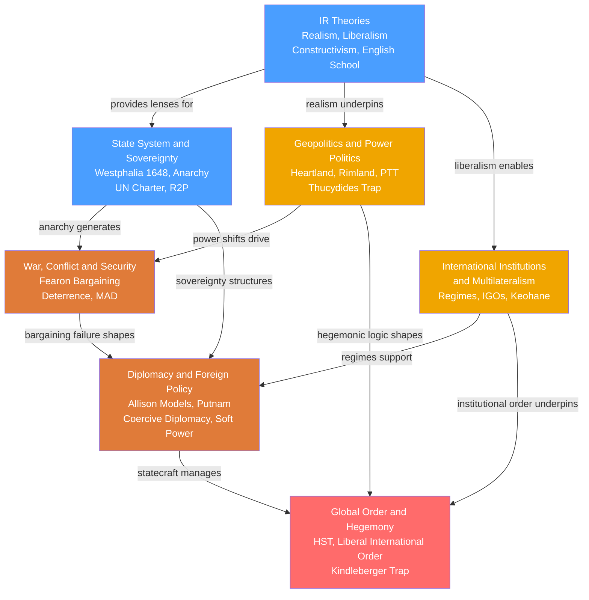

# International Relations — Map of Content

> [!info] How to use this map
> Start with **IR Theories** and **State System and Sovereignty** to establish the foundational vocabulary, then follow the arrows through the concept map below. The Learning Path gives a first-pass reading order from analytic framework to grand synthesis. Return to this map whenever a note feels isolated — every note connects back to the central anarchy problem.

---

International Relations is the systematic study of how sovereign states — and the non-state actors that now share the stage with them — interact under a condition of anarchy: the structural absence of any authority above the state. The field asks why states fight when war is always costly, why they cooperate when free-riding is always tempting, and what kind of order, if any, emerges from the collision of competing national interests. It matters because the answers are not merely academic: they determine alliance strategy, arms control, trade architecture, humanitarian intervention doctrine, and the management of great-power transitions. The seven notes in this section move from the bedrock concepts of sovereignty and the analytical lenses of IR theory, through the mechanics of power, war, diplomacy, and institutions, to the capstone question of how hegemonic orders are built, sustained, and eventually overturned.

---

## Concept Map

*(Blue = foundational, Orange = intermediate, Red-orange = applied, Red = advanced synthesis. Arrows indicate "leads to" or "requires".)*

---

## Learning Path

Recommended order for a first pass through International Relations:

1. [[International_Relations_Theories]] — Start here: establishes the three paradigms (Realism, Liberalism, Constructivism) that frame every other note in the section; without these analytical lenses the other notes lack interpretive scaffolding.
2. [[The_State_System_and_Sovereignty]] — Defines the foundational unit and condition: the sovereign state and international anarchy; introduces the Westphalian system, the UN Charter framework, and the challenges that now press against the sovereignty norm.
3. [[Geopolitics_and_Power_Politics]] — Applies structural realism to geography and power distribution; introduces Power Transition Theory and the Thucydides Trap, connecting physical geography to strategic competition.
4. [[War_Conflict_and_Security]] — Asks the field's central puzzle — why do rational states fight when war is always ex-post inefficient? — using Fearon's bargaining model, the security dilemma, and deterrence theory.
5. [[International_Institutions_and_Multilateralism]] — The liberal answer to the anarchy problem: how regimes, IGOs, and multilateral rules produce durable cooperation even without a world government.
6. [[Diplomacy_and_Foreign_Policy]] — The practical toolkit: Allison's three models of foreign policy, Putnam's two-level game, coercive diplomacy, sanctions, and soft power; bridges abstract theory to real decision-making.
7. [[Global_Order_and_Hegemony]] — Capstone synthesis: hegemonic stability theory, the Liberal International Order, and the two traps (Thucydides and Kindleberger) that define the current US-China transition.

---

## All Notes in This Section

| Note | Core Idea | Difficulty |
|------|-----------|------------|
| [[International_Relations_Theories]] | Realism, Liberalism, and Constructivism are competing lenses explaining why states fight, cooperate, or construct norms under anarchy | Beginner–Graduate |
| [[The_State_System_and_Sovereignty]] | The Westphalian system of territorially sovereign states is both the structural foundation of world politics and the object of mounting normative pressure from R2P and globalisation | Beginner–Graduate |
| [[Geopolitics_and_Power_Politics]] | Geography and differential economic growth drive strategic competition; power parity between a rising challenger and an established hegemon is the single most dangerous inflection point in international politics | Intermediate–Graduate |
| [[War_Conflict_and_Security]] | War is always ex-post inefficient yet recurs because private information, commitment problems, and indivisibility collapse the zone of possible agreement before a deal can be reached | Intermediate–Graduate |
| [[International_Institutions_and_Multilateralism]] | International regimes and IGOs reduce transaction costs and extend the shadow of the future, making post-hegemonic cooperation possible even when no single power enforces the rules | Intermediate–Graduate |
| [[Diplomacy_and_Foreign_Policy]] | Foreign policy emerges from rational calculation, bureaucratic process, and leader psychology simultaneously; coercive diplomacy succeeds only when asymmetry of motivation, not raw capability, favours the coercer | Intermediate–Graduate |
| [[Global_Order_and_Hegemony]] | A hegemon provides the global public goods — open trade, reserve currency, security — that sustain the international order; hegemonic transition risks either war via the Thucydides Trap or instability via the Kindleberger Trap | Advanced |

---

## Key Questions This Section Answers

- Why do sovereign states wage war when conflict is costly for both sides, and what conditions must fail for bargaining to break down?
- What is international anarchy and why does its absence of a world government not produce perpetual chaos?
- How do international institutions sustain cooperation after the hegemon that created them has declined?
- What distinguishes a revisionist challenger from a status-quo rising power, and why does that distinction determine whether hegemonic transition ends in war or accommodation?
- When does coercive diplomacy succeed, and why is compellence systematically harder than deterrence?
- How do geography, sea power, and resource endowments constrain the strategic choices of great powers regardless of domestic ideology?
- What are the Thucydides Trap and the Kindleberger Trap, and how might both operate simultaneously in the current US-China transition?

---

## Connections to Other Political Science Sections

- [[_MOC_Political_Theory_and_Ideologies|S01 Political Theory and Ideologies MOC]] — Provides the normative foundations (liberalism, realism as ideology, cosmopolitanism, communitarianism) on which IR theories draw; Kant's perpetual peace and Hobbes's state of nature are the philosophical roots of liberal and realist IR paradigms respectively.
- [[_MOC_Comparative_Politics|S02 Comparative Politics MOC]] — Democratic peace theory links regime type to war propensity; comparative analysis of state capacity and state failure directly feeds into the sovereignty and failed-states discussions here.
- [[Political_Science/04_Public_Policy/_MOC_Public_Policy|S04 Public Policy MOC]] — Foreign policy is a category of public policy; the bureaucratic politics model and two-level games connect domestic policy process to international outcomes.
- [[Political_Science/05_Political_Behavior/_MOC_Political_Behavior|S05 Political Behavior MOC]] — Public opinion, nationalism, and audience costs shape the domestic constraint on foreign policy; groupthink and cognitive biases in decision-making are studied here and applied there.
- [[Political_Science/06_Contemporary_Global_Issues/_MOC_Contemporary_Global_Issues|S06 Contemporary Global Issues MOC]] — Climate change, migration, and global health are collective-action problems at the international level; the multilateralism and hegemony frameworks built here are the analytical tools applied there.

---

## Cross-Vault Connections

- [[_MOC_Game_Theory_Master|Game Theory Vault]] — The formal backbone of modern IR: Nash equilibria underlie the security dilemma and arms races; the Folk Theorem formalises why institutions sustain cooperation under anarchy; Fearon's crisis bargaining is a signalling game; coercive diplomacy is compellence modelled as a subgame-perfect commitment problem. Start with Nash Equilibrium, Bargaining Theory, and Signaling Games.
- [[_MOC_Macroeconomics_Master|Macroeconomics Vault]] — Hegemonic power rests on economic foundations; the Solow growth model explains differential catch-up growth that drives power transitions; the Triffin Dilemma and balance-of-payments dynamics explain dollar hegemony; currency crises map onto hegemonic monetary stress; Kindleberger's lender-of-last-resort argument is macroeconomic theory applied to world order.

---

[[_MOC_Political_Science_Master|↑ Political Science MOC]]

#MOC #PoliticalScience #InternationalRelations #SectionMOC
