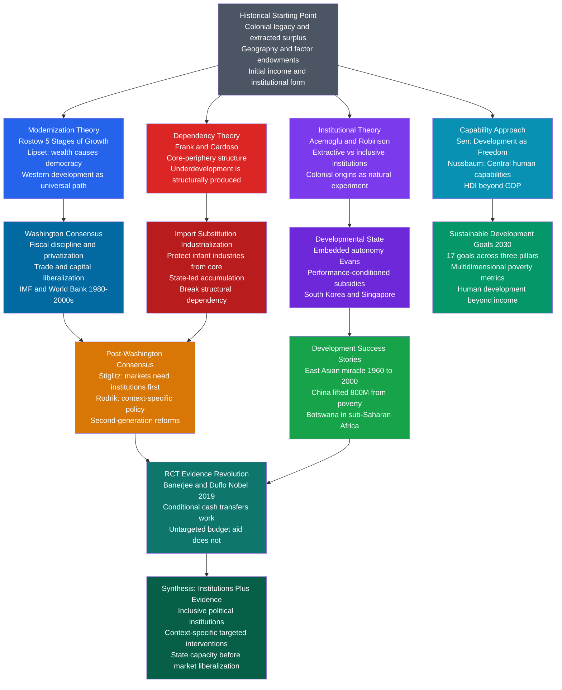

# 🌍 Development Economics and Political Development

> [!abstract] TL;DR
> Development economics asks why nations diverge so dramatically in income, health, and political form — and what governments, international organisations, and citizens can do about it. Four major theoretical frameworks offer competing answers: modernization theory (development is a universal linear sequence leading to democracy), dependency theory (underdevelopment is structurally produced by the core-periphery relationship), institutional theory (Acemoglu and Robinson: extractive vs inclusive institutions determine long-run trajectories), and the capability approach (Sen: development is freedom, not just GDP). The empirical synthesis after four decades of evidence: institutions shape everything — but which institutions, in what sequence, and built by whom, remains one of the most contested questions in social science.

---

## Intuition — analogy FIRST

Think of national development as a race — but where the tracks are entirely different for each runner and some tracks were deliberately designed to be impassable.

Modernization theory assumed all runners were on the same track, merely at different positions: just give slower runners training (aid, education, trade) and they would catch up naturally. Dependency theory countered that the track itself had been designed by the colonial powers: the runners at the back were not just behind — they were being actively held back by the structure of global trade and capital flows, which drained resources upward to the core. Institutional theory said the tracks reflected the rules of the game written during colonialism: where colonizers built extractive institutions (for harvesting resources and labor), the track still runs in circles; where they built inclusive institutions (for settlement and economic growth), the track leads forward.

Amartya Sen offered a fourth angle: even asking who is "winning" the race gets the goal wrong. Development is not about crossing an income threshold — it is about expanding what people can actually do and be. A country where GDP per capita is $10,000 but women cannot own property, minorities cannot access courts, and children die of preventable disease has not developed in any meaningful sense.

The poverty trap makes all of this concrete: when income is so low that every rupee of output must be consumed to survive, there is nothing left to invest. The economy cannot accumulate capital, cannot educate children, cannot build institutions. The trap is self-reinforcing — and escaping it requires either a change in the rules of the game (inclusive institutions) or an external push large enough to overcome the subsistence gravity well (Big Push aid).

---

## How It Works



---

## Key Concepts / Details

### Secondary Level

**What Is Development?**

For most of the 20th century, "development" meant growth in GDP per capita. The implicit model was simple: more income → better health, better education, more freedom. But by the 1980s it was clear this relationship was fragile. Saudi Arabia had very high GDP per capita and extremely restricted political and social freedoms. Sri Lanka had low GDP per capita but one of the lowest infant mortality rates in the developing world. Kerala, the Indian state, had literacy rates rivalling Europe at income levels forty times lower.

This evidence drove the shift toward **multidimensional** measures of development:

| Measure | What It Captures | Key Limit |
|---------|-----------------|-----------|
| GDP per capita | Average economic output | Ignores distribution, health, freedom |
| Human Development Index (HDI) | Income + education + life expectancy | Simple composite; misses political rights |
| Multidimensional Poverty Index | 10 deprivations across 3 dimensions | Technically demanding to compute |
| Sustainable Development Goals | 17 goals, 169 targets | Comprehensive but hard to aggregate |

**Rostow's Five Stages of Economic Growth**

W. W. Rostow's *The Stages of Economic Growth* (1960) — subtitled explicitly "A Non-Communist Manifesto" — proposed that all economies pass through five stages on the way to modernity:

1. **Traditional society** — subsistence agriculture, technology limited, social hierarchy rigid
2. **Pre-conditions for take-off** — external stimulus (trade, colonialism) begins to change agriculture and create transport infrastructure; entrepreneurial class begins to form
3. **Take-off** — investment rises above a critical threshold (roughly 10% of national income); new industries surge; political and social institutions begin to support growth
4. **Drive to maturity** — technology spreads across the economy; economy diversifies; moves from leading sectors to broader industrial base
5. **Age of high mass consumption** — economy reaches sustained high per-capita incomes; demand shifts toward consumer durables and services

Rostow's political purpose was clear: Western aid could help poor countries reach "take-off" and thereafter they would naturally converge toward liberal capitalism, avoiding the Communist alternative. The model treats history as a linear conveyor belt and the West as the destination toward which all nations are moving at different speeds.

**Millennium Development Goals and Sustainable Development Goals**

The MDGs (2000–2015), adopted by 189 UN member states, set eight measurable targets for reducing extreme poverty, improving health and education, and promoting gender equality by 2015. The headline achievement: extreme poverty ($1.25/day) fell from 36% of the developing world (1990) to 15% (2015). But most of the reduction was driven by China and East Asia — Sub-Saharan Africa largely missed its targets.

The SDGs (2015–2030), with 17 goals and 169 specific targets, are far more ambitious and encompass environmental sustainability, inequality within countries, and institutional quality (Goal 16: Peace, Justice, and Strong Institutions). The breadth reflects the lesson of the MDGs: income poverty is embedded in a web of governance failures, environmental pressures, and structural inequalities that income alone cannot address.

---

### Undergraduate Level

**Modernization Theory: The Political Hypothesis**

Beyond Rostow's economic stages, Seymour Martin Lipset's 1959 paper "Some Social Requisites of Democracy" made the most influential political claim in the modernization tradition: **wealth causes democracy**. The mechanism: industrialization creates an educated urban middle class; this class demands political rights and accountability; authoritarianism becomes increasingly costly to maintain against an educated, economically mobile citizenry.

Lipset's empirical finding: across his cross-national sample, wealthier countries were substantially more democratic. The correlation has been replicated in every dataset since. The **fatal logical problem**: correlation does not establish causation. Acemoglu, Johnson, Robinson, and Yared (2008) show that once you control for country fixed effects (removing the role of historical factors that produced both wealth and democracy), the Lipset correlation largely disappears. Wealth and democracy may both be caused by a third variable — inclusive institutions.

The policy implication distinction is critical:
- If Lipset is right: prioritize economic growth; democracy will follow
- If the critique is right: prioritize inclusive political institutions; both growth and democracy will follow

**Dependency Theory: Core, Periphery, and Structural Underdevelopment**

Dependency theory emerged in Latin America in the 1960s as a direct critique of Rostow's optimism. The foundational argument, from Andre Gunder Frank's *Development of Underdevelopment* (1966): poor countries are not undeveloped (a neutral starting condition) — they are **underdeveloped** (an active process done to them by colonial and post-colonial relationships with wealthy core countries).

The core-periphery structure:
- **Core countries** (US, Western Europe, Japan): industrial producers, capital exporters, technology innovators
- **Periphery countries** (Latin America, Africa, much of Asia): raw material exporters, capital importers, technology consumers
- **Semi-periphery** (Wallerstein's addition): countries like Brazil, Mexico, South Africa — partially industrialized, mediating between core and periphery

The mechanism of underdevelopment, per Frank: surplus generated in the periphery is systematically transferred to the core through:
1. **Unequal exchange** in commodity terms of trade (peripheral commodity prices decline relative to core manufactured goods — the Prebisch-Singer thesis)
2. **Profit repatriation** by multinational corporations
3. **Debt service** payments to core financial institutions
4. **Brain drain** — human capital flows to core countries

Fernando Henrique Cardoso (later President of Brazil) offered a more nuanced "associated-dependent development" — arguing that some peripheral countries can develop within the dependency relationship, but only in forms shaped and constrained by their relationship to core capital. Brazil's industrialization under the military regime (1964–1985) was partly financed by FDI and produced growth, but left a highly unequal income distribution and persistent foreign debt dependency.

**Wallerstein's World-Systems Theory** extended dependency to historical capitalism as a whole: the contemporary world order is a single capitalist world-system that has operated since the 16th century, systematically concentrating wealth at the core and extracting it from the periphery.

**The Washington Consensus and Its Critique**

John Williamson coined "Washington Consensus" in 1989 to describe the policy package that the IMF, World Bank, and US Treasury were recommending to developing countries, especially those in Latin America undergoing debt crises:

| Policy | Rationale | Critique |
|--------|-----------|---------|
| Fiscal discipline | Eliminate deficits that fuel inflation | Austerity during recessions is contractionary |
| Trade liberalisation | Comparative advantage; integration | Infant industry argument; premature deindustrialisation |
| Capital account liberalisation | Efficient global capital allocation | Hot money flows create currency crises |
| Privatisation | State enterprises are inefficient | Without regulation, creates private monopolies |
| Deregulation | Markets self-regulate | Financial deregulation produced 1998 crises |

Joseph Stiglitz, former World Bank Chief Economist, argued in *Globalization and Its Discontents* (2002) that the consensus misunderstood sequencing: markets require functioning institutions — property rights, contract enforcement, prudential financial regulation — before liberalisation can work. Liberalising capital flows before regulating the banking system produces fragility, not growth. The 1997 Asian financial crisis (and the IMF's contractionary response to it) became the empirical case study.

Dani Rodrik's synthesis: developing countries need to solve specific binding constraints on growth, which vary by country — there is no universal policy package. South Korea protected industries and controlled capital flows while growing at 8% annually. Chile liberalised early and suffered a banking crisis (1982) before eventually stabilising. What distinguishes successful development is not adherence to the Washington Consensus template but the quality of the underlying institutions and the diagnostic accuracy of the policy.

**The Capability Approach: Sen and Nussbaum**

Amartya Sen's *Development as Freedom* (1999) made the philosophical case for a fundamentally different definition of development. Sen argues that **freedom** — understood as the substantive ability to live a life one has reason to value — is both the primary means and the primary end of development.

Two key distinctions:
- **Functionings**: actual states of being and doing (being well-nourished, being educated, participating in political life)
- **Capabilities**: the real opportunities people have to achieve those functionings

A country that provides free university education but denies women the right to attend has high formal provision but low capability for half the population. Sen showed that famines — the most catastrophic development failures — are almost never caused by food scarcity alone; they are caused by failures of entitlements (access, distribution, political accountability). The Bengal famine of 1943 occurred during a period of adequate aggregate food supply; it killed 3 million people because the distribution system failed and the colonial government did not respond.

Martha Nussbaum extended this to a list of **central human capabilities** that any just society must protect: life, bodily health, bodily integrity, sense and imagination, emotions, practical reason, affiliation, play, control over one's political and material environment. The capability approach underpins the UN's Human Development Report and the HDI methodology.

**The Aid Effectiveness Debate**

| Position | Proponent | Core Argument | Key Evidence |
|----------|-----------|--------------|-------------|
| Aid as Big Push | Jeffrey Sachs (*The End of Poverty*, 2005) | Poverty traps require external capital injection to escape; coordinated aid can finance the jump | Millennium Villages Project; Marshall Plan analogy |
| Aid as harm | William Easterly (*The White Man's Burden*, 2006) | Aid creates dependency, undermines local institutions, funds corrupt governments, lacks feedback mechanisms | 50 years and $2.3T of aid with modest African growth |
| Randomistas | Banerjee and Duflo (*Poor Economics*, 2011) | Use RCTs to identify what specific interventions work; build evidence before scaling | Nobel 2019; conditional cash transfers, deworming (disputed), direct cash |

**The RCT Revolution**: Abhijit Banerjee and Esther Duflo (along with Michael Kremer) pioneered the application of randomised controlled trials to development interventions — treating development policy with the same empirical rigour as clinical medicine. Key findings:

- **Conditional cash transfers (CCTs)**: Bolsa Família in Brazil and PROGRESA/Oportunidades in Mexico — cash to poor families conditioned on children attending school and getting health check-ups — show robust positive effects on school attendance, health outcomes, and long-term earnings. One of the most rigorously tested and replicated interventions in development economics.
- **Direct cash transfers**: GiveDirectly (Kenya) shows that unconditional cash transfers to extremely poor households are largely spent on productive assets, food, and education — not alcohol and tobacco, contra critics. Recipients made better investment decisions than bureaucracies allocating aid on their behalf.
- **Microfinance**: The Grameen Bank model (Muhammad Yunus, Nobel Peace 2006) has more modest evidence than its advocates claim. RCTs show microloans generate small positive consumption effects but do not consistently produce the entrepreneurship-driven poverty escape their proponents projected.
- **Deworming**: Miguel and Kremer's 1999 Kenya study showed deworming treatment dramatically increased school attendance at very low cost. This became one of development economics' most famous studies — and subsequently one of its most replicated and contested, raising broader questions about publication bias and the replication crisis in development RCTs.

**The Middle Income Trap**

Many countries successfully escape low-income poverty but then stall: Malaysia, Thailand, Brazil, Turkey, Mexico have remained in the $6,000–$15,000 GDP per capita range for decades, unable to break into high-income status. The mechanism is structural:

- Low-income growth is driven by **absorbing** cheap labor into manufacturing and adopting existing foreign technology
- Middle-income growth requires **innovation** — creating new products and processes, not just imitating them
- Innovation requires different institutions: strong intellectual property rights, well-functioning universities, deep capital markets, merit-based rather than connection-based firm management
- The political economy is adverse: the elites who captured the state during the absorptive phase resist the institutional reforms that would distribute economic power more broadly

South Korea and Taiwan escaped the trap by investing in R&D, upgrading education to tertiary level, and gradually moving up the technology ladder. China is currently attempting this transition — its aggressive investment in AI, semiconductor manufacturing, and university research capacity is explicitly a middle-income trap escape strategy.

---

### Graduate Level

**Acemoglu and Robinson: Colonial Origins, Extractive Institutions, and Why Nations Fail**

Daron Acemoglu and James Robinson's research program (beginning with the 2001 *American Economic Review* paper and culminating in *Why Nations Fail*, 2012) represents the dominant synthesis in development economics at the graduate level. Their core argument:

1. **Institutions are the fundamental cause** of cross-country income differences — not geography, culture, or religion (which have been proposed as alternatives)
2. **Colonial institutions were endogenous to disease environments**: where European settlers could survive (North America, Australia, New Zealand), they built inclusive institutions for themselves — property rights, rule of law, representative governance. Where settler mortality was high (tropical Africa, the Caribbean), they built extractive institutions — designed to extract resources and labor without settling. Those institutions persisted after independence.
3. The empirical strategy: **colonial settler mortality** as an instrument for current institutional quality. Settler mortality is correlated with modern income only through its historical effect on institutional form — not directly — making it a valid instrument variable. The result: institutions explain roughly 60% of the cross-country income variation.

The extractive/inclusive typology:

| Dimension | Extractive Institutions | Inclusive Institutions |
|-----------|------------------------|----------------------|
| Political power | Concentrated in narrow elite | Broadly distributed; constrained by law |
| Economic institutions | Insecure property rights; forced labour; barriers to entry | Secure property rights; competitive markets; rule of law |
| Growth dynamic | Short-run extraction; long-run stagnation | Creative destruction; innovation; sustained growth |
| Examples | Congo under Mobutu; Haiti; Bolivia under silver-mining colonial elite | 18th-century Britain after Glorious Revolution; South Korea after 1987 democratisation |

**Why Extractive Institutions Persist — The Political Economy of Institutional Lock-In**

The critical analytical contribution is explaining persistence. Why do extractive institutions survive? The mechanism involves what Acemoglu and Robinson call the **fear of creative destruction**:

- Inclusive economic institutions (competitive markets, new firm entry, technological innovation) inherently threaten incumbent elites by redistributing economic power
- The same elites who benefit from extractive economic institutions typically hold extractive political institutions — concentrated power that allows them to block reforms
- Reform requires political mobilization sufficient to overcome elite resistance — typically only possible during **critical junctures** (the Black Death, the Atlantic slave trade, democratic revolutions) where elite power is temporarily disrupted

England's Glorious Revolution (1688) is the canonical critical juncture: the balance of power between the Crown and Parliament shifted sufficiently that Parliament could commit credibly to protecting property rights — specifically merchant and financial capital — from arbitrary Crown expropriation. Secure property rights enabled the capital accumulation that financed the Industrial Revolution. The sequence was not inevitable — it required a contingent political outcome.

**China's Development Model: The Exception That Tests the Theory**

China poses the most serious challenge to both the institutional theory and the modernization theory:

- Institutional theory predicts that extractive political institutions (one-party state, limited property rights for private enterprise, no independent judiciary) should produce extractive economic institutions and stagnation
- Modernization theory predicts that rapid economic growth should produce democratization

China has achieved the largest poverty reduction in human history (roughly 800 million people above $1.90/day between 1980 and 2015) under sustained authoritarian rule — and has not democratized.

Several explanations have been offered:

1. **Yao Yang (2010)**: The Chinese Communist Party is a "disinterested government" — not captured by any particular social group (unlike most developing country states), allowing it to pursue national growth objectives rather than factional redistribution. The party's performance legitimacy depends on delivering growth, creating internal incentives for developmental behaviour.

2. **Daron Acemoglu's concession**: China may be at a "critical juncture" — extractive political institutions generating growth during a catch-up phase, before the innovation-economy transition makes the model's contradictions decisive. The middle-income trap is precisely where the contradiction emerges: innovation requires distributing economic and political power, which threatens the party's monopoly.

3. **Pranab Bardhan's political economy**: Chinese local governments face intense inter-jurisdictional competition for FDI, creating incentives to protect investor property rights de facto even without de jure legal guarantees. "Tournament federalism" — where provincial officials are evaluated on growth performance — substitutes for the formal institutional protections Western development theory emphasises.

The honest assessment: China's model is not easily exported (requires a highly capable, unusually coherent single party), may be time-limited (middle-income transition), and has significant costs (authoritarian surveillance, ethnic repression in Xinjiang, suppressed civil society).

**Rodrik's Trilemma of the World Economy**

Dani Rodrik's political economy framework identifies a fundamental trilemma: you cannot simultaneously have (1) deep economic integration (globalisation), (2) democratic national politics (sovereignty), and (3) the nation-state. Pick any two:

- **Bretton Woods compromise** (1945–1971): nation-states + democracy + limited international integration. Capital controls allowed countries to pursue domestic full employment.
- **Washington Consensus era**: integration + nation-state + technocratic governance. Deep integration required constraining democratic policy space (IMF conditionality, WTO rules). Democratic accountability was sacrificed.
- **Global federalism** (hypothetical): full integration + democracy, but only if global democratic institutions govern the world economy — no existing institutional structure remotely achieves this.

The implication for development: developing countries face genuine constraints on their policy autonomy from international trade and investment rules. The WTO's TRIPs agreement (intellectual property rights) and TRIMs (investment measures) constrain the industrial policy tools that East Asia used to develop. Rodrik argues developing countries need "policy space" — the right to depart from free-market orthodoxy when domestic institutions and market failures require it — precisely the space that international integration is progressively eliminating.

**The Political Economy of Reform: Why Good Policies Don't Get Adopted**

Perhaps the deepest question in development political economy: if institutional reforms (property rights, rule of law, anti-corruption) produce growth, and if poor populations would benefit from them, why don't governments adopt them?

The answers turn on distributional politics:

- **Mancur Olson's logic of collective action**: small, well-organised groups (incumbent industrialists, military, landed elites) can block reforms that would benefit diffuse, poorly-organised majorities (farmers, urban poor, future generations). The costs of reform are concentrated on powerful actors; the benefits are diffuse.

- **Reform as credible commitment problem**: investors need to believe reforms are permanent before committing capital. But a government that can commit credibly is one that already has institutional constraints — the very thing being built. The paradox: the institutional environment needed to make reform credible is what the reform is trying to create.

- **The resource curse as political economy**: natural resource endowments (oil, diamonds, copper) create rents that fund states without taxation, severing the fiscal bargain between rulers and citizens. Without the need to tax, rulers need not build administrative capacity, respond to citizen demands, or tolerate organised opposition. Resource wealth finances the repression of institutional reform.

---

## Python Demo

```python
import numpy as np
from scipy.integrate import odeint
import matplotlib.pyplot as plt

# ---------------------------------------------------------------
# Modified Solow Model with Income-Dependent Saving Rate
# Demonstrates poverty traps driven by institutional quality (TFP)
#
# Standard Solow:  dk/dt = s * A * k^alpha - (delta + n) * k
# Modification:    s is income-dependent (Hill-type sigmoid)
#
#   s(y) = s_max * y^2 / (c_sub^2 + y^2)
#
# Interpretation of the sigmoid:
#   - When y << c_sub (subsistence income): s(y) -> 0
#     Households near starvation cannot save; all output consumed
#   - When y >> c_sub (well above subsistence): s(y) -> s_max
#     Rich households can save productively
#
# TFP parameter A proxies institutional quality:
#   - High A (inclusive institutions): property rights enforced,
#     contracts respected, corruption low -> high effective productivity
#   - Low A (extractive institutions): insecure property rights,
#     state predation, corruption -> low effective productivity
#
# The model produces two regimes:
#   - High-A economies: investment curve crosses break-even line once
#     (from below), at a high stable steady state
#   - Low-A economies: investment curve never crosses break-even line
#     (always below it); the only steady state is k* -> 0 (poverty trap)
# ---------------------------------------------------------------

def solow_rhs(state, t, A, alpha, delta, n, s_max, c_sub):
    """
    RHS of the modified Solow ODE with income-dependent saving.
    Returns [dk/dt].

    state : [k]  capital per worker (length-1 list/array)
    t     : time (years)
    A     : total factor productivity (institutional quality proxy)
    alpha : capital income share (standard value ~0.33)
    delta : annual capital depreciation rate
    n     : annual population growth rate
    s_max : maximum achievable saving rate
    c_sub : subsistence income level (half-saturation constant)
    """
    k = max(float(state[0]), 1e-9)        # guard against numerical zero
    y = A * k**alpha                       # output per worker
    s = s_max * y**2 / (c_sub**2 + y**2)  # income-dependent saving rate
    return [s * y - (delta + n) * k]


# ---------------------------------------------------------------
# Parameters
# ---------------------------------------------------------------
ALPHA = 0.33   # capital income share (Gollin 2002 cross-country average)
DELTA = 0.05   # annual depreciation rate
N     = 0.015  # annual population growth rate
S_MAX = 0.38   # maximum saving rate
C_SUB = 2.5    # subsistence income threshold

A_HIGH = 1.80  # inclusive institutions: South Korea circa 1975
A_LOW  = 0.55  # extractive institutions: stagnant developing economy

t_span = np.linspace(0, 250, 2500)   # 250-year simulation

# Four scenarios: two TFP levels x two starting conditions
SCENARIOS = [
    {"label": "Inclusive institutions (A=1.8), k0=6.0",
     "A": A_HIGH, "k0": 6.0, "color": "#2563eb", "ls": "-"},
    {"label": "Inclusive institutions (A=1.8), k0=0.5",
     "A": A_HIGH, "k0": 0.5, "color": "#16a34a", "ls": "--"},
    {"label": "Extractive institutions (A=0.55), k0=6.0",
     "A": A_LOW,  "k0": 6.0, "color": "#dc2626", "ls": "-"},
    {"label": "Extractive institutions (A=0.55), k0=0.5",
     "A": A_LOW,  "k0": 0.5, "color": "#d97706", "ls": "--"},
]

# ---------------------------------------------------------------
# Solve ODEs and plot
# ---------------------------------------------------------------
fig, axes = plt.subplots(1, 2, figsize=(14, 6))

# Left panel: GDP per capita trajectories over time
for sc in SCENARIOS:
    sol = odeint(solow_rhs, [sc["k0"]], t_span,
                 args=(sc["A"], ALPHA, DELTA, N, S_MAX, C_SUB))
    k_path = sol[:, 0]
    y_path = sc["A"] * k_path**ALPHA
    axes[0].plot(t_span, y_path,
                 color=sc["color"], linestyle=sc["ls"],
                 linewidth=2.2, label=sc["label"])

axes[0].axhline(C_SUB, color="gray", linestyle=":", linewidth=1.2, alpha=0.7)
axes[0].text(240, C_SUB + 0.15, "subsistence threshold c_sub",
             fontsize=7.5, color="gray", ha="right")
axes[0].set_xlabel("Time (years)")
axes[0].set_ylabel("GDP per capita  y(t) = A * k(t)^alpha")
axes[0].set_title("Convergence vs. Poverty Trap\n(different initial capital and TFP)")
axes[0].legend(fontsize=7.5)

# Right panel: Phase diagram — investment s(y)*y vs break-even (delta+n)*k
k_grid = np.linspace(0.01, 30, 600)
break_even = (DELTA + N) * k_grid

for A_val, lbl, clr in [
    (A_HIGH, f"Inclusive institutions  A={A_HIGH}", "#2563eb"),
    (A_LOW,  f"Extractive institutions A={A_LOW}",  "#dc2626"),
]:
    y_g = A_val * k_grid**ALPHA
    s_g = S_MAX * y_g**2 / (C_SUB**2 + y_g**2)
    axes[1].plot(k_grid, s_g * y_g, color=clr, linewidth=2.2, label=lbl)

axes[1].plot(k_grid, break_even, "k--", linewidth=1.8,
             label=f"Break-even  ({DELTA}+{N})k")
axes[1].axvline(x=0, color="gray", linewidth=0.8)
axes[1].set_xlim(0, 30)
axes[1].set_ylim(0, 3.0)
axes[1].set_xlabel("Capital per worker  k")
axes[1].set_ylabel("Investment / break-even")
axes[1].set_title("Phase Diagram: Poverty Trap Geometry\n(investment crosses break-even only for high A)")
axes[1].legend(fontsize=8)

plt.tight_layout()
plt.savefig("solow_poverty_trap.png", dpi=150)
plt.show()

# ---------------------------------------------------------------
# Print final-state summary
# ---------------------------------------------------------------
print("Solow Poverty Trap Model — Outcomes after 250 years")
print("-" * 60)
for sc in SCENARIOS:
    sol = odeint(solow_rhs, [sc["k0"]], t_span,
                 args=(sc["A"], ALPHA, DELTA, N, S_MAX, C_SUB))
    y_final = sc["A"] * float(sol[-1, 0])**ALPHA
    trapped = y_final < C_SUB
    status = "TRAPPED  (poverty equilibrium)" if trapped else "CONVERGED (high steady state)"
    print(f'  {sc["label"][:50]:<50}  y* = {y_final:.3f}  [{status}]')
```

**What the model shows and why it matters:**

The phase diagram (right panel) is the key: the investment curve `s(y)*y` only crosses the break-even line `(delta+n)*k` for the high-TFP (inclusive institutions) country — producing a stable high-income steady state. For the low-TFP country, the investment curve lies entirely below the break-even line, so capital per worker declines toward zero regardless of the starting point.

This formalises the Acemoglu-Robinson thesis: institutions (proxied by A) are not just one factor among many — they determine whether the system has a growth attractor at all. An external aid injection (Sachs's Big Push) shifts a low-A economy's `k0` temporarily, but without raising A (institutional reform), the economy will slide back to the trap. This is why the Sachs-Easterly debate is partly false: aid without institutional reform is pushing the economy up the slope without fixing the slope itself.

---

## Real-World Applications

**Botswana: Africa's Institutional Success Story**

Botswana is the most-cited African exception to dependency theory's predictions. At independence (1966), it was among the world's poorest countries: landlocked, cattle-dependent, with almost no infrastructure. By 2020, it had achieved upper-middle-income status ($7,000 GDP per capita) — the fastest sustained growth in the world for several decades.

The explanation: Botswana's Tswana political culture had pre-colonial institutions (the *kgotla* system of community assembly and elite accountability) that were absorbed into the post-independence state. When diamonds were discovered (1967), the government negotiated an unusually favourable partnership with De Beers, captured a large share of resource rents, and invested them in public goods (education, infrastructure, healthcare) rather than factional redistribution. The Botswana Democratic Party maintained competitive elections and avoided the militarisation that plagued neighbours.

The Acemoglu-Robinson interpretation: Botswana developed inclusive-enough political institutions before the diamond windfall hit, allowing it to avoid the resource curse. The critical juncture was the independence settlement, not the diamonds. Diamonds financed development under good institutions; they would have financed kleptocracy under bad ones (as in the DRC or Angola).

**China: Authoritarian Capitalism at Scale**

China's development record is the most consequential in human history by any metric. Between 1980 and 2015, GDP per capita grew from $200 to $8,000 (40-fold); 800 million people crossed the extreme poverty line; life expectancy rose from 65 to 76. The mechanism:

1. **Deng Xiaoping's agricultural decollectivisation (1978–1982)**: returning land management to household farming more than doubled agricultural productivity, releasing surplus labour for urban manufacturing
2. **Township and Village Enterprises (1980s)**: hybrid public-private enterprises operated by local governments, competing in markets, outside the central planning system — a uniquely Chinese institutional innovation
3. **Special Economic Zones**: geographically contained zones where market rules and FDI applied, insulated from socialist planning elsewhere; technology transfer and export-oriented manufacturing
4. **Tournament federalism**: provincial officials evaluated on GDP growth, creating intense horizontal competition for FDI and infrastructure investment

The limits of the model are now visible: household consumption has been systematically suppressed (high household saving driven partly by underdeveloped social insurance), investment has substituted for consumption in GDP at unsustainable rates, debt levels have exploded (300% of GDP including shadow banking), and the innovation-led growth required to escape the middle-income trap demands political openness that contradicts the party's monopoly.

**Brazil's Bolsa Família: The RCT-Proven Model**

Bolsa Família (2003–present), Brazil's conditional cash transfer programme, covers ~46 million people and provides monthly cash transfers to poor families conditioned on children's school attendance (85% minimum) and health check-ups. The evidence:

- School attendance in the poorest municipalities increased by 4–17 percentage points
- Infant mortality fell substantially in covered areas
- The programme costs approximately 0.5% of GDP — among the most cost-effective poverty interventions ever scaled
- No significant reduction in adult labour supply (the "dependency" critique does not hold empirically)
- Subsequent generations show higher educational attainment and earnings

Bolsa Família became the global template for CCT programmes. Over 60 countries now operate similar schemes. The key political economy innovation: it survived changes of government because the poor majority who benefit politically defend it, creating a durable constituency for the programme even when the ideological tide shifts.

**Latin America and the Washington Consensus Failure**

Latin America's "lost decade" of the 1980s and the disappointments of the 1990s provide the clearest empirical test of Washington Consensus prescriptions. Countries implementing the full package (Chile 1975–82, Argentina 1991–2001, Mexico after NAFTA) showed:

- Inflation control: generally successful
- Growth acceleration: disappointing; Latin American per-capita growth in the 1990s (2.2% per year) was lower than in the 1950s-70s import-substitution era (3.1%)
- Distribution: worsened sharply; the Gini coefficient rose in most countries implementing liberalisation
- Crisis vulnerability: capital account liberalisation without banking regulation produced catastrophic crises — Mexico 1994, Brazil 1998, Argentina 2001

The IMF's own 2003 review acknowledged the disappointing growth record. The post-Washington Consensus — emphasising institutional foundations, sequencing of reforms, and poverty targeting — emerged from the wreckage. Brazil's success under Lula (2003–2010) combined macroeconomic stability from the Cardoso era with Bolsa Família redistribution: the combination, not the contradiction, produced 5% annual growth and falling inequality simultaneously.

---

## Common Pitfalls

- **Confusing the correlation between wealth and democracy with causation** — Lipset's finding is real but the causal direction is contested. Acemoglu et al. show that both democracy and growth may be downstream of inclusive institutions. Concluding that growth automatically produces democracy leads to the policy error of tolerating authoritarian growth models in the hope that democratization will eventually follow.

- **Treating dependency theory as structural determinism** — The core-periphery framework correctly identifies real mechanisms of surplus extraction and unequal exchange. But it implies that peripheral countries cannot develop within the global capitalist system — which is empirically falsified by South Korea, Taiwan, and China. The correct take: dependency creates strong headwinds, not absolute barriers; institutional quality and state capacity determine whether a country can navigate those headwinds.

- **Universalising the Washington Consensus** — The ten-point package was designed for a specific context (Latin American fiscal crises of the 1980s) and its proponents did not necessarily intend it as a universal template. Applying capital account liberalisation before banking regulation, or trade liberalisation before building competitive industries, follows the prescription but violates the sequencing logic that made it work where it did work.

- **Ignoring political feasibility when designing reforms** — Development policy frequently identifies technically optimal reforms (property rights registration, competition law, judicial independence) without analysing the political economy of adoption. Reforms that threaten incumbent elites will be blocked, captured, or reversed unless the reformer has built the political coalition to sustain them. The politics of reform is not secondary to the economics of reform — it is the binding constraint.

- **Conflating aid disbursement with development impact** — Aid projects are evaluated by spending targets, not by randomised comparison of outcomes. Easterly's critique of the aid industry is not that aid is never effective but that the bureaucratic incentive structure optimises for disbursement rather than impact. The RCT methodology shifts the evaluation question from "how much was spent" to "what was the causal effect on outcomes."

- **Assuming the middle-income trap is inevitable or universal** — The middle-income trap is a tendency, not an iron law. South Korea and Taiwan escaped it through deliberate institutional upgrading and education investment. The error is treating it as inevitable (and doing nothing) or denying its existence (and not building the innovation capacity required to escape it).

- **Underestimating the political economy of the resource curse** — Resource-rich developing countries are not simply unlucky to have oil or diamonds. The curse operates through specific political mechanisms (reduced need to tax, financed repression, Dutch disease) that can in principle be countered by institutional design (sovereign wealth funds, resource revenue transparency, fiscal rules). Botswana and Norway demonstrate that resources need not produce the curse; the political preconditions for counter-curse institutions are the hard problem.

---

## Related Concepts

- [[_MOC_Public_Policy_and_Political_Economy|↑ Public Policy and Political Economy MOC]] — the section map linking all six notes in this cluster; return here to navigate between development economics, policy analysis, political economy, fiscal policy, welfare, and regulatory politics.
- [[State_Formation_and_Political_Development]] — the foundational companion note: Weber on state legitimacy, Tilly on war-making and state capacity, Fukuyama's political order trilemma; this note applies those frameworks to economic development outcomes
- [[Development_Economics]] — the Macroeconomics vault treatment of the same material: poverty traps, Solow formal model, Washington Consensus, Sachs/Easterly/Duflo; cross-read for the formal economic mechanics behind the political frameworks here
- [[Solow_Growth_Model]] — the standard growth model extended by the poverty trap modification in the Python demo; TFP in Solow is the formal analogue of "institutional quality" in Acemoglu-Robinson
- [[Human_Capital_and_Education]] — Sen's capability approach places education as a primary capability, not merely an input to GDP; developmental states (South Korea, China) invested in universal education as the primary poverty-exit mechanism
- [[Endogenous_Growth_Theory]] — Romer and Lucas models that endogenise technology accumulation; the middle-income trap is precisely the transition from Solow-style capital deepening (exogenous technology) to endogenous innovation
- [[International_Relations_Theories]] — dependency theory is a structural Marxist IR theory; the core-periphery model intersects with realist analysis of power asymmetries and liberal analysis of institutional design in international trade
- [[International_Institutions_and_Multilateralism]] — the IMF, World Bank, and WTO are the principal institutional vehicles of the Washington Consensus; their conditionality and rule-setting power directly shape developing country policy space
- [[Political_Institutions_and_Constitutions]] — institutional design (electoral systems, federalism, separation of powers) shapes whether political institutions are inclusive or extractive in the Acemoglu-Robinson framework
- [[Public_Goods]] — education, health, security, and infrastructure are the core public goods that states must provide for development; market failures in public goods provision are the principal justification for state intervention in development policy
- [[Market_Failures]] — externalities, public goods, information asymmetries, and market power are the four canonical reasons markets cannot deliver development on their own; each failure type corresponds to a different development policy instrument
- [[Balance_of_Payments]] — export-led growth (South Korea, China) and import substitution (Latin America, India pre-1991) are competing current account strategies with different institutional requirements and long-run outcomes
- [[Liberalism_and_Its_Variants]] — modernization theory is the liberal teleology applied to development; its assumptions about universal sequencing toward liberal capitalism underpin both the Washington Consensus and its critics

---

## Review Questions

### Secondary

1. Rostow identified five stages of economic growth. What is the "take-off" stage, and what conditions does he say are necessary for a country to reach it? Give one real-world example of a country that seems to have achieved take-off and one that has not.

2. The United Nations replaced the Millennium Development Goals with Sustainable Development Goals in 2015. What are two ways the SDGs go beyond what the MDGs tried to measure, and why does that broader scope matter?

3. Amartya Sen argued that famines are caused by failures of entitlements, not failures of food supply. What does he mean? Use the example of the Bengal Famine of 1943 to explain his argument.

### Undergraduate

1. Modernization theory (Lipset) and institutional theory (Acemoglu-Robinson) both predict a correlation between wealth and democracy, but through different causal mechanisms. Explain the difference, and describe one empirical approach that could help distinguish between the two.

2. Dependency theory (Frank) argues that integration into the global economy deepens underdevelopment in peripheral countries. Yet South Korea and Taiwan achieved rapid industrialization by aggressively integrating into global trade and investment. How might a dependency theorist account for these cases, and how does the theory's ability to account for exceptions affect its scientific value?

3. Jeffrey Sachs advocates a coordinated "Big Push" of foreign aid to escape poverty traps; William Easterly argues aid creates dependency and undermines local institutions; Banerjee and Duflo advocate RCT-evaluated targeted interventions. Using the modified Solow model framework (income-dependent saving, TFP as institutional quality), explain which critique maps onto which mechanism in the model.

### Graduate

1. Acemoglu, Johnson, and Robinson use colonial settler mortality as an instrumental variable for current institutional quality. Explain the IV logic — what does "valid instrument" require, and why does settler mortality satisfy both conditions? Then critically evaluate: what assumptions are required for the exclusion restriction to hold, and what evidence might challenge those assumptions?

2. China's development model — rapid growth under authoritarian extractive political institutions — appears to falsify Acemoglu-Robinson's central claim. How might they defend their theory against this evidence? What does the theory predict will happen to China as it attempts the transition to innovation-led growth at the middle-income threshold?

3. Rodrik argues that there is a fundamental trilemma between deep economic integration, democratic national sovereignty, and the nation-state. Apply this to a specific development policy conflict: the WTO's TRIPS agreement (intellectual property rules) and the ability of developing countries to use patent-breaking for public health or technology catch-up. What does each position in the trilemma imply for development policy, and what institutional design would allow developing countries to retain meaningful policy space within the current international order?

---

## Sources

- W. W. Rostow, *The Stages of Economic Growth: A Non-Communist Manifesto*, Cambridge University Press, 1960
- Seymour Martin Lipset, "Some Social Requisites of Democracy: Economic Development and Political Legitimacy," *American Political Science Review* 53(1), 1959
- Andre Gunder Frank, *Development of Underdevelopment*, Monthly Review Press, 1966
- Fernando Henrique Cardoso and Enzo Faletto, *Dependency and Development in Latin America*, University of California Press, 1979
- Immanuel Wallerstein, *The Modern World-System*, Academic Press, 1974
- John Williamson, "What Washington Means by Policy Reform," in *Latin American Adjustment: How Much Has Happened?*, Peterson Institute, 1990
- Joseph Stiglitz, *Globalization and Its Discontents*, W. W. Norton, 2002
- Dani Rodrik, *The Globalization Paradox: Democracy and the Future of the World Economy*, W. W. Norton, 2011
- Amartya Sen, *Development as Freedom*, Anchor Books, 1999
- Martha Nussbaum, *Creating Capabilities: The Human Development Approach*, Belknap Press, 2011
- Daron Acemoglu, Simon Johnson & James A. Robinson, "The Colonial Origins of Comparative Development," *American Economic Review* 91(5), 2001
- Daron Acemoglu & James A. Robinson, *Why Nations Fail: The Origins of Power, Prosperity, and Poverty*, Crown, 2012
- Jeffrey D. Sachs, *The End of Poverty: Economic Possibilities for Our Time*, Penguin, 2005
- William Easterly, *The White Man's Burden: Why the West's Efforts to Aid the Rest Have Done So Much Ill and So Little Good*, Penguin, 2006
- Abhijit Banerjee & Esther Duflo, *Poor Economics: A Radical Rethinking of the Way to Fight Global Poverty*, PublicAffairs, 2011
- Peter Evans, *Embedded Autonomy: States and Industrial Transformation*, Princeton University Press, 1995
- Dani Rodrik, "One Economics, Many Recipes: Globalization, Institutions, and Economic Growth," Princeton University Press, 2007

---

#PoliticalScience #PublicPolicy #DevelopmentEconomics #PoliticalDevelopment #ModernizationTheory #DependencyTheory #WashingtonConsensus #CapabilityApproach #Institutions
