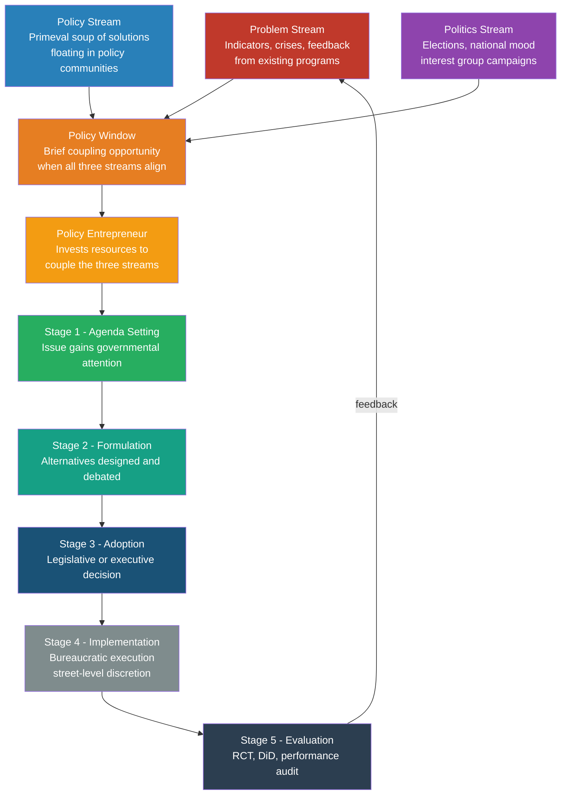

# Policy Analysis and the Policy Process

> [!abstract] TL;DR
> Policy analysis is the systematic examination of what governments do, why they do it, and whether it works. The "policy process" describes the path from a social problem to a government response — and why that path almost never runs straight. Kingdon's multiple streams model explains how policy windows open unexpectedly and close before most actors realise they were open; Baumgartner and Jones's punctuated equilibrium explains why change is rare but explosive when it finally arrives; Pressman and Wildavsky explain why even well-funded laws routinely produce disappointing outcomes. Mastering these frameworks is essential for anyone who designs, evaluates, or studies public interventions.

---

## Intuition

**Analogy:** Imagine a hospital emergency room where the waiting area never empties. Every hour, new patients arrive (social problems), but the ER has only three treatment bays (agenda slots) and a strict triage protocol. A patient with a broken arm may wait for hours — not because the arm is not broken, but because the trauma bays are occupied, the attending physician has no approved protocol for that injury, or hospital administration is currently in a budget meeting. The injury is real. The capacity constraint is also real. And the path from "injury recognised" to "patient treated" depends not just on the severity of the injury but on the availability of resources, the existence of a treatment protocol, and the organisational moment.

In policy terms: the patient is a social problem, the treatment bay is the legislative agenda, triage is agenda-setting, the protocol is a formulated policy alternative, and the physician's decision is adoption. Implementation is the actual administration of the treatment — and where most treatments fail.

---

## How It Works



---

## Key Concepts

### Secondary Level

**What is Public Policy?**

Public policy is any purposive course of action — or deliberate inaction — by government in response to a social problem. Three elements define it:
- An **authoritative decision** made by a recognised governmental actor (legislature, executive, court, regulatory agency)
- **Goal-directedness**: the decision aims to achieve some outcome in the world
- **Effect on the public**: it constrains, enables, or redistributes resources across social groups

Policy is distinct from law (a law is one instrument of policy), from politics (the struggle for power that determines who makes policy), and from administration (the execution of policy decisions). All three are causally entangled in practice.

---

**The Policy Cycle — Five Stages**

The policy cycle is an analytical heuristic, not a description of how policy actually works. It breaks the policy process into tractable components:

| Stage | Core Question | Key Actors |
|---|---|---|
| **Agenda Setting** | Why do some problems get government attention and others do not? | Media, interest groups, crises, policy entrepreneurs |
| **Formulation** | What are the proposed solutions, and who designs them? | Think tanks, bureaucracies, legislative committees, experts |
| **Adoption** | Which alternative is chosen, and through what process? | Legislature, executive, courts, referendum |
| **Implementation** | How is the decision translated into action? | Agencies, street-level bureaucrats, service providers |
| **Evaluation** | Did the policy work? What should change? | Auditors, researchers, opposition, media |

The cycle loops: evaluation findings feed back into the problem stream, redefining the issue for the next policy episode.

---

**Two Agendas**

Roger Cobb and Charles Elder (1972) distinguished:
- **Systemic agenda**: the universe of problems broadly recognised as legitimate matters for governmental attention — essentially everything the public believes government could and should address
- **Governmental (institutional) agenda**: the much shorter list of items actually under active consideration by policymakers at a given moment

Most problems never make it from the systemic to the governmental agenda. The study of agenda-setting is essentially the study of that filter — who controls it, and by what criteria it operates.

---

### Undergraduate Level

**Kingdon's Multiple Streams Framework (1984/2011)**

John Kingdon's *Agendas, Alternatives, and Public Policies* is the most influential model of why some issues reach the governmental agenda. Kingdon rejects the sequential cycle and proposes that three relatively independent streams flow simultaneously through the political system.

**Stream 1 — Problem Stream:** How do problems get recognised?
- **Indicators**: systematic data signalling deterioration (rising mortality rates, widening inequality indices, increasing crime statistics)
- **Focusing events**: dramatic crises, disasters, or symbols that suddenly concentrate attention (Thalidomide tragedy → drug safety regulation; Deepwater Horizon → offshore drilling rules; COVID-19 → pandemic preparedness infrastructure)
- **Feedback from existing programs**: implementation experience reveals failures; audits document unintended consequences that re-enter the problem stream

**Stream 2 — Policy Stream:** Where do solutions come from?
- A **primeval policy soup** — a community of specialists (researchers, analysts, bureaucrats, lobbyists) constantly generating and recombining ideas. Most proposals circulate for years, even decades, without adoption.
- Ideas survive through **softening up**: repeated exposure in conferences, hearings, and white papers gradually builds familiarity and legitimacy before any political window opens
- Selection filters: technical feasibility and value acceptability within the relevant policy community

**Stream 3 — Politics Stream:** What determines political will?
- **National mood**: diffuse public sentiment that can shift dramatically in response to elections, crises, or social movements
- **Organised political forces**: interest groups campaigning for or against change; their balance of power shapes what is politically feasible
- **Governmental turnover**: new administrations bring new priorities; electoral cycles reset political capital and mandate

**Policy Windows** open when all three streams align — usually briefly and unpredictably. A window created by a crisis (problem stream) may close within weeks if political will dissipates or a rival issue captures the agenda. The 2010 passage of the Affordable Care Act is a textbook case: the problem stream (46 million uninsured Americans) had been open for decades; the policy stream (individual mandate, insurance exchanges) had circulated since the 1990s; the politics stream opened with the 2008 Democratic landslide and closed with the 2010 midterm losses.

**Policy Entrepreneurs** are individuals willing to invest their own resources — time, reputation, political capital — to couple the streams and push their preferred solution through an open window. They are not necessarily in government (Ralph Nader, Al Gore, Greta Thunberg). Their defining skills: deep knowledge of the policy community, persistent advocacy over years, and the ability to be "at the right place at the right time."

---

**Punctuated Equilibrium Theory (Baumgartner & Jones, 1993)**

Frank Baumgartner and Bryan Jones synthesised decades of American politics data into a single pattern: long periods of incremental stability punctuated by rare episodes of radical change. The empirical signature is a **leptokurtic distribution** of policy change — most issues show near-zero change most of the time; a few show massive, sudden shifts.

**Negative feedback** dominates most of the time. Policy **subsystems** — stable coalitions of legislators, agencies, and interest groups around a single issue domain — resist change through:
- **Policy monopolies**: a dominant image of the issue (nuclear power = clean progress) combined with institutional venue control (a single congressional committee "owns" the issue)
- **Bounded attention**: human cognitive limits and organisation routines mean most issues receive no political attention most of the time

**Positive feedback** occasionally overwhelms the friction:
- A **new policy image** reframes the issue — nuclear power becomes a safety threat, not a technological triumph — destabilising the existing monopoly
- **Venue shopping**: policy opponents route proposals through courts, international bodies, or media to bypass captured domestic institutions
- **Attention cascades**: once an issue attracts media attention, attention breeds more attention, overwhelming standard friction mechanisms

The framework directly challenges incrementalism (Lindblom's "muddling through"): change is not normally distributed across time but is instead concentrated in brief episodes of collective attention.

---

**The Garbage Can Model (Cohen, March & Olsen, 1972)**

In "A Garbage Can Model of Organizational Choice," Cohen, March, and Olsen argued that many organisations are **organised anarchies** with three properties:
- **Problematic preferences**: goals are inconsistent, unclear, and sometimes discovered only through action
- **Unclear technology**: organisations operate by trial and error; causal chains between interventions and outcomes are poorly understood
- **Fluid participation**: decision-makers flow in and out of decision situations at variable rates

Under these conditions, four independent streams — problems, solutions, participants, and choice opportunities — collide in "garbage cans." Decisions happen when a solution attaches to a problem through a choice opportunity with the right participants present. This matching is partly coincidental, not optimising.

*Relevance to policy*: Solutions often precede problems — a technically attractive policy instrument (cap-and-trade) waits for a problem (climate change) to attach to. Kingdon's policy stream operationalises the garbage-can dynamic at the governmental level. The implication is radical: rational problem-solving is the exception; the "garbage can" dynamic is closer to the norm.

---

**The Implementation Gap (Pressman & Wildavsky, 1973)**

Jeffrey Pressman and Aaron Wildavsky's study of federal employment programs in Oakland, California showed that a generously funded and politically popular program could fail almost completely at implementation. Their conclusion: implementation is a distinct political and organisational problem, not an automatic consequence of successful adoption.

**Key mechanisms of failure:**

| Mechanism | Description |
|---|---|
| **Clearance points** | Each actor who must agree multiplies failure probability. If 30 actors each agree 90% of the time, joint probability = 0.9^30 = 4.2% success |
| **Goal ambiguity** | Legislation deliberately obscures goals to attract coalition votes; implementing agencies inherit contradictory mandates |
| **Street-level discretion** | Michael Lipsky (1980): frontline workers — teachers, police, social workers, benefits clerks — exercise enormous day-to-day discretion; their aggregated choices *are* the policy citizens actually experience |
| **Resource gaps** | Political commitments not backed by budget allocations, trained staffing, or technical infrastructure |
| **Intergovernmental complexity** | Federal systems multiply veto points; national policy must flow through sub-national governments with different priorities and capacities |

**Bottom-up vs top-down implementation research**: Richard Elmore (1980) argued for "backward mapping" — start from the point of final delivery and work back to policy design. Mazmanian and Sabatier (1983) retained top-down variables while acknowledging implementation as a long, politically active phase. Contemporary scholarship treats them as complementary levels of analysis.

---

**Policy Analysis Tools**

**Cost-Benefit Analysis (CBA)**
- Monetise all expected benefits and costs over the project horizon; convert to Net Present Value using a social discount rate (typically 3–7%)
- Decision rule: adopt if NPV > 0; among competing alternatives, choose highest NPV
- Limitations: distributional blindness (a policy can pass CBA while harming the poorest); difficulty monetising non-market goods (biodiversity, a statistical life); extreme sensitivity to discount rate for long-horizon policies

**Cost-Effectiveness Analysis (CEA)**
- Used when benefits should not be reduced to a single monetary figure in isolation
- Metric: cost per unit of outcome (cost per QALY in health policy; cost per tonne of CO2 avoided in climate policy)
- CEA ranks alternatives but cannot determine whether any alternative should be adopted — only which is most efficient
- The UK's NICE uses a £20,000–£30,000 per QALY threshold for health technology adoption

**Regulatory Impact Analysis (RIA)**
- Mandated systematic assessment of costs and benefits before major regulations are finalised
- Required in the US by executive order since Reagan's EO 12291 (1981); reviewed by OIRA
- Subject to abuse: regulated industries can generate "paralysis by analysis" by commissioning studies contesting every benefit estimate

---

### Graduate Level

**Evidence-Based Policy and Causal Evaluation Methods**

The evidence-based policy movement argues that intervention choices should rest on rigorous causal evidence about "what works," not ideology, anecdote, or professional convention. Three methods dominate the evidence hierarchy:

**Randomised Controlled Trials (RCTs)**
- Random assignment to treatment and control eliminates selection bias — the gold standard
- Esther Duflo and Abhijit Banerjee's J-PAL network has run 1,000+ RCTs in development policy, producing evidence on education, health, and poverty interventions that reversed prior conventional wisdom
- Limitations in policy contexts: ethical constraints on randomising access to public goods; external validity — lab and field experiments may not scale to national policy; political feasibility of random assignment across constituencies

**Difference-in-Differences (DiD)**
- Compare outcomes for a treated group before and after treatment, minus the same difference for an untreated comparison group — the "double differencing" cancels time-invariant confounders
- Key identifying assumption: **parallel trends** — treated and control groups would have evolved identically absent the treatment
- Canonical example: Card and Krueger (1994) compared New Jersey restaurants (minimum wage increase) against Pennsylvania restaurants (no change) to identify the employment effect of minimum wage policy

**Regression Discontinuity Design (RDD)**
- Exploits a policy-determined threshold (age 65 for Medicare; test score cutoffs for remedial programs; poverty line for benefits eligibility)
- Units just above and just below the threshold are near-identical except for treatment assignment — a local randomisation
- Very high internal validity at the cutoff; limited generalisability to units far from the threshold

**The Policy-Evidence Gap**: even well-established evidence does not automatically translate into policy. Carol Weiss (1979) distinguished several models of how research enters the policy process: the **knowledge-driven model** (evidence creates pressure for adoption) is rare; the **political model** (research is used selectively to legitimise predetermined positions) is more common; the **enlightenment model** (ideas percolate slowly, changing the terms of debate over years) may be the most accurate for most policy change.

---

**Behavioral and Nudge Policy Design (Thaler & Sunstein, 2008)**

Behavioral policy applies insights from prospect theory and bounded rationality to the design of **choice environments** rather than relying solely on price signals or mandates. The core logic: if human judgment systematically departs from rational choice in predictable ways, you can design defaults and framings that exploit these departures for beneficial ends — without removing freedom of choice ("libertarian paternalism").

| Nudge Mechanism | Psychological Basis | Policy Example |
|---|---|---|
| Default opt-out | Status quo bias | Organ donation; pension auto-enrolment |
| Social norm messaging | Descriptive social proof | "9 out of 10 residents in your area pay taxes on time" |
| Simplification | Cognitive load reduction | FAFSA simplification; single-page benefit forms |
| Loss framing | Loss aversion | "Your home loses £X per year without insulation" |
| Commitment devices | Present bias / hyperbolic discounting | Save More Tomorrow retirement program |
| Implementation intentions | Intention-action gap | Vaccine appointment with specific time and location in the SMS |

The **UK Behavioural Insights Team** ("Nudge Unit," est. 2010) operationalised the EAST framework (Easy, Attractive, Social, Timely) and has run hundreds of randomised trials across tax compliance, NHS appointment attendance, and job-seeking behaviour. Its tax compliance trial — adding the phrase "most people in your area pay their taxes on time" to reminder letters — produced a £30M annual increase in timely payments at near-zero cost.

**Structural critique**: nudges have real but modest effect sizes (typically 2–8%). They are appropriate where the barrier to a beneficial action is inertia or framing, not poverty, structural inequality, or genuine information asymmetry. A better default on pension enrolment cannot substitute for a living wage.

---

**Policy Diffusion and Path Dependency**

Governments do not invent their policies in isolation. Three diffusion mechanisms (Dobbin, Simmons & Garrett, 2007):

1. **Learning**: policymakers observe outcomes in other jurisdictions and update beliefs about effectiveness. Richard Rose's "lesson-drawing" — identifying contextually appropriate lessons from abroad and adapting them domestically.
2. **Competition**: jurisdictions mimic each other to attract investment or avoid regulatory arbitrage (corporate tax competition; environmental standards "race to the bottom").
3. **Coercive transfer**: international organisations, conditional lending (IMF structural adjustment), and trade agreements effectively mandate domestic policy adoption.

**Path dependency** (North 1990; Pierson 2000): early policy choices constrain future options because:
- **Increasing returns to existing arrangements**: healthcare systems built around private insurance face enormous switching costs to move toward public provision; political coalitions form to defend the existing system
- **Cognitive lock-in**: professional training and organisational routines embed existing models as common sense, making alternatives literally unthinkable to practitioners inside the system

---

**Advocacy Coalition Framework (Sabatier & Jenkins-Smith, 1993)**

Policy subsystems contain multiple **advocacy coalitions** — actors from different institutions who share a set of normative and empirical beliefs. Coalitions:
- Pool resources and coordinate strategy within the subsystem over periods of a decade or more
- Compete for dominance, each seeking to shape subsystem institutions in ways consistent with their core beliefs
- Change primarily through **policy-oriented learning** (evidence accumulation that shifts beliefs about causal mechanisms) and **external perturbations** (macro-level shocks that disrupt the balance between competing coalitions)

A coalition's **deep core beliefs** (fundamental normative values: equity vs efficiency, individual vs collective responsibility) are highly resistant to change even in the face of contrary evidence — confirming at the coalition level what cognitive psychology finds in individuals: confirmation bias is structural.

---

## Python Demo

```python
import numpy as np

# Kingdon Multiple Streams: Agenda Competition Simulation
# N policy issues each have three independent "streams" whose readiness
# fluctuates as bounded random walks. A policy window opens for an issue when
# ALL THREE streams simultaneously exceed a threshold. Government agenda
# capacity is limited, so issues with open windows compete; the highest-salience
# issue (highest combined stream score) wins each agenda slot.
# This reproduces punctuated equilibrium: long inertia, sudden bursts of change.

rng = np.random.default_rng(42)

N_ISSUES      = 10    # competing policy problems
AGENDA_SLOTS  = 2     # government can actively address this many issues at once
PERIODS       = 200   # time steps (months of a legislative cycle)
THRESHOLD     = 0.65  # stream readiness cutoff -- all three must exceed this

# Politics is the most volatile stream (elections, scandals, public mood shifts)
VOLATILITY = {"problem": 0.07, "policy": 0.05, "politics": 0.10}

def bounded_walk(val, vol, lo=0.0, hi=1.0):
    """Single-step bounded random walk."""
    return float(np.clip(val + rng.normal(0, vol), lo, hi))

# Each issue starts with random stream values
issues = [
    {
        "id":       i,
        "problem":  rng.uniform(0.3, 0.7),
        "policy":   rng.uniform(0.3, 0.7),
        "politics": rng.uniform(0.3, 0.7),
        "enacted":  False,
        "enact_t":  None,
    }
    for i in range(N_ISSUES)
]

window_counts = np.zeros(N_ISSUES, dtype=int)  # how many periods each had an open window
enact_log = []

for t in range(PERIODS):
    # Step 1: evolve all three streams for unenacted issues
    for iss in issues:
        if iss["enacted"]:
            continue
        for stream, vol in VOLATILITY.items():
            iss[stream] = bounded_walk(iss[stream], vol)

    # Step 2: detect open windows (all three streams above threshold simultaneously)
    open_window = [
        iss for iss in issues
        if not iss["enacted"]
        and iss["problem"]  > THRESHOLD
        and iss["policy"]   > THRESHOLD
        and iss["politics"] > THRESHOLD
    ]
    for iss in open_window:
        window_counts[iss["id"]] += 1

    # Step 3: policy entrepreneur logic -- highest combined stream score wins agenda slot
    open_window.sort(
        key=lambda x: x["problem"] + x["policy"] + x["politics"],
        reverse=True
    )
    for iss in open_window[:AGENDA_SLOTS]:
        iss["enacted"] = True
        iss["enact_t"] = t
        enact_log.append((t, iss["id"]))

# Results
print(f"{'='*60}")
print(f"Policy Window Simulation: {PERIODS} periods | {N_ISSUES} issues")
print(f"Agenda capacity: {AGENDA_SLOTS}  |  Stream threshold: {THRESHOLD}")
print(f"{'='*60}\n")

print(f"Enacted ({len(enact_log)}/{N_ISSUES} issues):")
for t, iid in enact_log:
    iss = issues[iid]
    print(f"  t={t:3d}  Issue-{iid}  "
          f"[prob={iss['problem']:.2f}  pol={iss['policy']:.2f}  "
          f"pols={iss['politics']:.2f}]  "
          f"windows seen before enactment: {window_counts[iid]}")

not_enacted_ids = [i["id"] for i in issues if not i["enacted"]]
if not_enacted_ids:
    print(f"\nNever enacted ({len(not_enacted_ids)} issues):")
    for iid in not_enacted_ids:
        print(f"  Issue-{iid}  windows seen: {window_counts[iid]}")
else:
    print("\nAll issues eventually found a policy window and were enacted.")

# Punctuated equilibrium: are enactments clustered in bursts or evenly spaced?
if len(enact_log) > 1:
    ts = np.array(sorted(t for t, _ in enact_log))
    gaps = np.diff(ts)
    print(f"\nPunctuated Equilibrium Pattern:")
    print(f"  Enactment times : {ts.tolist()}")
    print(f"  Gaps            : {gaps.tolist()}")
    print(f"  Gap std dev     = {gaps.std():.1f}  "
          f"(high -> bursty; near-zero -> incremental)")
    print(f"\n  Interpretation: Most issues wait many periods before a window")
    print(f"  aligns. When windows cluster (e.g., new administration's first")
    print(f"  100 days), multiple changes enact in rapid succession --")
    print(f"  the signature of punctuated equilibrium.")
```

**Reading the output:** Most issues will have large gaps between their window-open periods and enactment, reflecting how long problems wait in the policy queue. Issues with high politics-stream volatility (std 0.10) will experience the most dramatic swings — an election suddenly opens or closes windows regardless of problem severity or solution quality. Raise `THRESHOLD` to 0.75 to see how much harder it becomes to enact *any* issue, simulating a gridlocked legislature.

---

## Real-World Applications

**UK Soft Drinks Industry Levy (Sugar Tax, 2018) — Evidence-Based Policy with Behavioral Design**
The levy was designed around CBA (PHE modelling projected £300M+ annual savings in dental and obesity costs) and behavioral economics. Critically, the levy was tiered by sugar content — incentivising reformulation rather than simply taxing sales — and was announced two years before implementation to allow industry adjustment. Post-implementation evidence (BMJ, 2019) found a 28.8% reduction in sugar content of affected drinks, exceeding projections because the announcement itself triggered pre-emptive reformulation. The policy exploited both standard economic incentives (price signal) and behavioral effects (reputational pressure on brands to reformulate rather than pay the levy).

**Affordable Care Act (2010) — Multiple Streams and Implementation Gap**
A textbook Kingdon case: the problem stream (46 million uninsured Americans, rising healthcare costs) had been visible for decades; the policy stream (individual mandate, insurance exchanges, Medicaid expansion) had circulated in conservative and liberal think tanks since the 1990s; the politics stream opened in November 2008 and closed in November 2010. Kingdon's window lasted approximately 14 months.

Implementation immediately revealed Pressman-Wildavsky dynamics. After *NFIB v. Sebelius* (2012) made Medicaid expansion optional, 12 states initially refused — creating a "coverage gap" for adults too poor for exchange subsidies but ineligible for Medicaid. This was a direct prediction of the implementation gap: a federal-state clearance point that the legislative drafters had not treated as optional became precisely the point of failure.

**Organ Donation Opt-Out (England, Max and Keira's Law, 2020) — Behavioral Nudge at Scale**
England switched from opt-in to opt-out organ donation in May 2020. The policy exploits status quo bias: people who would not actively register but also would not actively refuse are now counted as donors. Spain, with an opt-out system since 1979, has maintained the world's highest donation rate for decades. The England reform required essentially zero additional resources, no price signals, and no mandate — pure choice architecture. The "Max and Keira" naming also exploited a focusing event (two children's transplant stories in national media) to open the politics stream for a change long present in the policy stream.

**Global Climate Policy — Diffusion, Learning, and Punctuated Equilibrium**
The spread of emissions trading schemes (EU ETS 2005 → Regional Greenhouse Gas Initiative 2008 → California cap-and-trade 2013 → China national ETS 2021) illustrates horizontal policy diffusion through learning: each implementation generated cost, design, and enforcement data that subsequent adopters drew on explicitly. Yet punctuated equilibrium is equally visible: the global agenda shifted dramatically after the 2015 Paris Agreement — not through incremental norm-building but through a concentrated cascade of national commitments following a single multilateral focusing event.

---

## Common Pitfalls

- **Treating the policy cycle as sequential and linear** — in practice, formulation continues through implementation, evaluation reshapes agenda-setting mid-cycle, and adoption often precedes a full understanding of the problem. The cycle is an analytic scaffold, not a flowchart governments actually follow.

- **Ignoring street-level discretion** — a carefully designed policy that fails to account for how frontline workers will actually implement it is not a good policy. Police officers, teachers, social workers, and benefits clerks exercise enormous day-to-day discretion. The "policy" that citizens experience is their aggregated choices, not the statutory text.

- **Assuming evidence automatically drives policy decisions** — the relationship between research and policy is mediated by politics, advocacy coalitions, and ideology. Evidence that challenges a coalition's core beliefs is typically dismissed, reframed, or countered with commissioned counter-studies, not absorbed. "Policy-based evidence" — commissioning research to legitimise predetermined decisions — is at least as common as evidence-based policy.

- **Substituting CBA for political judgment** — cost-benefit analysis structures trade-offs but cannot resolve fundamental questions of distributive justice. A policy that passes CBA may still make the poorest citizens worse off. The choice of social discount rate (3% vs 7%) can entirely determine whether a climate programme is judged cost-effective or wasteful — this is a normative political choice dressed as a technical calculation.

- **Underestimating the implementation gap** — the more complex the implementation chain, the more likely failure at a single clearance point will undermine the whole policy. Complexity is not a reason to avoid ambitious policy; it is a reason to invest heavily in implementation design, adaptive management, and frontline operational capacity.

- **Nudge solutionism** — nudges produce real but modest effect sizes. They are appropriate where the barrier to a beneficial action is inertia or default framing. They cannot substitute for structural interventions when the barrier is poverty, systemic inequality, or genuine information asymmetry. Offering a better default pension enrolment does not substitute for a living wage.

---

## Related Concepts

- [[_MOC_Public_Policy_and_Political_Economy|↑ Public Policy and Political Economy MOC]] — the section map linking all six notes in this cluster; return here to navigate between policy analysis, political economy, fiscal policy, welfare, regulation, and development.
- [[Cognitive_Biases]] — Bounded rationality and systematic cognitive errors are the psychological foundations of behavioral policy design; prospect theory, status quo bias, and loss aversion explain why nudges produce reliable effects.
- [[Behavioral_Economics_Psychology]] — The applied framework connecting Kahneman-Tversky findings to choice architecture; the EAST framework and the UK Behavioural Insights Team operationalise this directly for government intervention design.
- [[Market_Failures]] — The welfare-economics justification for government intervention: externalities, public goods, information asymmetries, and market power each generate a distinct class of policy instruments and a distinct analytic challenge for CBA.
- [[Externalities_and_Pigouvian_Tax]] — The primary microeconomic instrument for internalising externalities; Pigouvian taxation is the theoretical basis for carbon taxes, sugar levies, and congestion charges in applied policy.
- [[Public_Goods]] — Non-excludability and non-rivalry define goods that markets systematically undersupply; this market failure provides the welfare-economics rationale for direct government provision or subsidisation, and structures much of fiscal policy.
- [[Tax_Policy]] — Fiscal instruments are the most powerful policy levers available to government; understanding optimal taxation, incidence, and behavioural responses is essential for evaluating redistribution and revenue policy.
- [[Budget_Deficits_and_Debt]] — Fiscal space constrains policy ambition; deficit and debt dynamics determine whether government can fund the implementation infrastructure that major policies require.
- [[Federalism_and_Decentralization]] — Vertical complexity in implementation — federal vs state vs local execution — is the primary source of the Pressman-Wildavsky clearance-point problem; fiscal federalism theory also determines which level of government should hold each policy competence.
- [[Political_Institutions_and_Constitutions]] — The number of veto players, legislative committee structure, and constitutional constraints directly determine how many clearance points a policy must clear and how durable enacted policy will be against future reversal.
- [[Political_Parties_and_Party_Systems]] — Party systems determine how the politics stream behaves; two-party systems create narrow but periodic windows; multi-party coalition systems create more persistent windows but require broader policy compromise.
- [[Difference_in_Differences]] — The most widely used quasi-experimental method for evaluating policy impacts ex post; understanding the parallel trends assumption is essential for interpreting policy evaluation evidence.
- [[Potential_Outcomes_Framework]] — The Rubin causal model that underlies all rigorous policy evaluation; the fundamental problem of causal inference (each unit is observed in only one treatment state) defines the evaluation challenge for every policy intervention.
- [[Regression_Discontinuity]] — The preferred evaluation design when policies assign treatment via a threshold rule; exploits the near-randomness of assignment near the cutoff to identify causal effects without an experimental design.
- [[International_Institutions_and_Multilateralism]] — International organisations are both diffusion vectors (spreading policy models via technical assistance and peer learning) and coercive transfer mechanisms (IMF conditionality, WTO trade rules that mandate domestic policy adoption).

---

## Review Questions

### Secondary

1. A new study shows that childhood obesity rates have risen sharply over the past decade. According to the policy cycle model, what would need to happen before government takes action? Which stage do you think would be most difficult, and why?
2. What is the difference between the "systemic agenda" and the "governmental agenda"? Why do most social problems remain on the systemic agenda indefinitely without ever reaching the governmental agenda?
3. Explain in your own words why implementing a policy is often harder than passing it into law. Use one concrete example from any country you know.

### Undergraduate

1. A major industrial accident occurs in a country with weak environmental regulation. Using Kingdon's multiple streams framework, explain the conditions under which this focusing event *would* — and *would not* — lead to new environmental legislation within 12 months. What specific role would a policy entrepreneur play in each scenario?
2. Baumgartner and Jones argue that the distribution of policy change is leptokurtic rather than normally distributed. What political and institutional mechanisms explain the long periods of stability? What triggers punctuation? Is punctuated equilibrium a theory of democratic pathology or of normal democratic politics?
3. A government wants to increase retirement savings rates and is considering three options: (a) mandating a minimum 10% contribution, (b) launching a public information campaign about the importance of saving, and (c) switching to automatic enrolment with opt-out. Using behavioral policy design principles, compare the likely effectiveness of each and identify the key trade-offs between them.

### Graduate

1. Pressman and Wildavsky argued that implementation failure is structural, not the result of incompetence or bad faith. How does their clearance-point model compare with Lipsky's street-level bureaucracy account? Are these frameworks complementary or in tension? What do they together imply for the design of complex social programs?
2. The evidence-based policy movement prioritises RCTs and quasi-experimental designs. Critics argue this creates a "what works" paradigm that systematically marginalises questions of political feasibility, distributional justice, and institutional context. Evaluate this critique: is the evidence hierarchy an epistemic improvement or a political project that concentrates authority in technical analysts?
3. Compare Kingdon's multiple streams model with punctuated equilibrium theory on three dimensions: unit of analysis, causal mechanism, and empirical predictions. Where do they genuinely overlap, and where are they in tension? Which framework better explains the ACA's passage in 2010 and its survival of the 2017 Senate repeal attempt?

---

## Sources

- Kingdon, J.W. (1984/2011) — *Agendas, Alternatives, and Public Policies*, 2nd ed., Longman
- Baumgartner, F.R. & Jones, B.D. (1993) — *Agendas and Instability in American Politics*, University of Chicago Press
- Pressman, J. & Wildavsky, A. (1973) — *Implementation*, University of California Press
- Cohen, M.D., March, J.G. & Olsen, J.P. (1972) — ["A Garbage Can Model of Organizational Choice"](https://www.jstor.org/stable/2392088), *Administrative Science Quarterly* 17(1)
- Lipsky, M. (1980) — *Street-Level Bureaucracy: Dilemmas of the Individual in Public Services*, Russell Sage Foundation
- Thaler, R.H. & Sunstein, C.R. (2008) — *Nudge: Improving Decisions About Health, Wealth, and Happiness*, Yale University Press
- Sabatier, P.A. & Jenkins-Smith, H.C. (1993) — *Policy Change and Learning: An Advocacy Coalition Approach*, Westview Press
- Cobb, R. & Elder, C. (1972) — *Participation in American Politics: The Dynamics of Agenda-Building*, Allyn and Bacon
- Card, D. & Krueger, A.B. (1994) — ["Minimum Wages and Employment"](https://www.jstor.org/stable/2118030), *American Economic Review* 84(4)
- Weiss, C.H. (1979) — "The Many Meanings of Research Utilization," *Public Administration Review* 39(5)
- Weimer, D.L. & Vining, A.R. (2017) — *Policy Analysis: Concepts and Practice*, 6th ed., Routledge
- [UK Behavioural Insights Team — EAST Framework](https://www.bi.team/publications/east-four-simple-ways-to-apply-behavioural-insights/)
- [J-PAL — Abdul Latif Jameel Poverty Action Lab](https://www.povertyactionlab.org/)

---

#PoliticalScience #PublicPolicy #PolicyAnalysis #PolicyProcess #AgendaSetting
