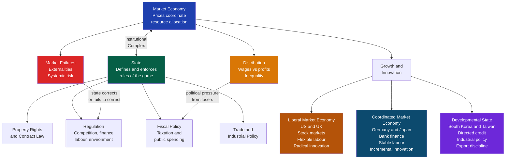

# Political Economy and Market-State Relations

> [!abstract] TL;DR
> Political economy studies the contested boundary between states and markets: who sets the rules, who captures the gains, and which institutional configurations produce growth, stability, or inequality. The central finding is that markets are never self-regulating — they are always politically constructed — yet the form that construction takes varies systematically across nations, producing Liberal Market Economies (LMEs), Coordinated Market Economies (CMEs), and developmental states with dramatically different distributional and growth outcomes.

---

## Intuition

**Analogy:** Imagine a farmer's market. Someone had to decide who gets a stall, who sets the weights and measures, who adjudicates disputes when a seller's claim proves false, who cleans the grounds before the market opens, and who enforces closing time. None of that is the market itself — it is the political and institutional infrastructure without which no market can function. Political economy asks: who built those rules, for whose benefit, and with what effect on the prices, quality, and distribution of what gets sold? The same questions asked of a stock exchange, a labour market, or a global trade regime yield political economy.

The deeper insight is that every market outcome you observe — wages, profits, interest rates, exchange rates — is partly a price and partly a political decision. The institutions that govern property rights, labour contracts, corporate governance, and financial regulation encode specific distributions of power. Changing those institutions changes those outcomes. This is what classical political economists from Smith to Marx understood, and what the later separation of "economics" from "politics" as academic disciplines obscured.

---

## How It Works



---

## Key Concepts

### Secondary Level

**What political economy studies.** Political economy sits at the intersection of economics and politics. It asks not just *what* markets produce but *who decides the rules under which they operate*, and *whose interests those rules serve*. Three foundational questions:

1. **Distribution** — How are the gains from economic activity divided between workers, capitalists, landowners, and the state?
2. **Regulation** — Which economic activities are permitted, taxed, subsidised, or prohibited, and why?
3. **Power** — Which groups have the organisational capacity to shape rules in their favour?

**Classical political economy: Smith, Ricardo, Marx.**

Adam Smith (*The Wealth of Nations*, 1776) showed that specialisation and market exchange generate wealth far beyond what any central planner could organise. The division of labour increases productivity; competitive markets discipline producers to serve consumers. But Smith was not naively pro-market: he was deeply suspicious of merchants who "seldom meet together, even for merriment and diversion, but the conversation ends in a conspiracy against the public." Concentrated economic power corrupts politics and markets simultaneously.

David Ricardo (*Principles*, 1817) identified the distributional conflict at the heart of industrial capitalism: wages, profits, and rents are claims on the same national output. What goes to landlords as rent cannot go to workers as wages or capitalists as profit. Ricardo's theory of comparative advantage argued that free trade maximises national output — but it does not specify how that output is distributed. Trade creates winners and losers; it is politics that decides how to handle the losers.

Karl Marx (*Capital*, 1867) radicalised Ricardo's insight: the apparent fairness of market exchange conceals a structural extraction of surplus value. Workers sell their labour power at its cost of reproduction (subsistence wage) but create more value than they receive. The state, in Marx's account, is not a neutral referee but the instrument through which the ruling class secures the conditions for this extraction — law, police, and ideological legitimation.

**Rent-seeking and public choice.** George Stigler's 1971 article "The Theory of Economic Regulation" argued that regulation is typically *captured* by the industry it is meant to regulate, rather than serving the public interest. Firms lobby regulators because the returns from favourable rules are high and concentrated; the costs are dispersed across millions of consumers who each pay a small amount and have little incentive to organise. This is the *concentrated benefits / diffuse costs* asymmetry that underlies rent-seeking: the expenditure of resources to obtain government-conferred privileges rather than create new wealth.

James Buchanan's public choice theory (Nobel 1986) extended this logic: politicians and bureaucrats are self-interested actors, not benevolent planners. Politicians maximise votes; bureaucrats maximise budget and discretion. Mancur Olson's *The Logic of Collective Action* (1965) showed that small, concentrated groups (industries, trade associations, professions) overcome collective action problems far more easily than large, diffuse groups (consumers, taxpayers). The result: democratic politics systematically over-regulates in the interest of organised minorities.

---

### Undergraduate Level

**Embedded liberalism and the Bretton Woods compromise (Ruggie, 1982).**

John Ruggie coined "embedded liberalism" to describe the post-1945 international order: market capitalism was allowed to operate internationally (liberalised trade, convertible currencies) only because it was embedded domestically within the welfare state, Keynesian demand management, and strong labour protections. The deal was: capital could cross borders for trade purposes, but not for speculative financial flows; workers displaced by trade would be compensated by their national welfare state. This was a deliberate political bargain struck at Bretton Woods (1944): the US and UK accepted that full employment was a domestic political imperative that had to be protected from the gold standard's deflationary discipline.

Embedded liberalism was a *compromise* between international liberalism (free trade, open payments) and domestic solidarity (welfare state, labour rights). The collapse of the Bretton Woods system in 1971–73 and the subsequent deregulation of international capital flows (the "hyperglobalisation" of the 1980s–2000s) destroyed this compromise: capital mobility undermined national governments' capacity to maintain full employment and welfare states without provoking capital flight.

**Varieties of capitalism: Hall and Soskice (2001).**

Peter Hall and David Soskice's *Varieties of Capitalism* (2001) made the most systematic theoretical argument that there is no single "best" capitalist model. Firms face coordination problems — how to train workers, how to finance long-term investment, how to coordinate with suppliers and competitors — and different national institutional frameworks solve these problems differently.

*Two ideal types:*

| Dimension | Liberal Market Economy (LME) | Coordinated Market Economy (CME) |
|---|---|---|
| **Examples** | USA, UK, Australia, Canada | Germany, Japan, Sweden, Netherlands |
| **Finance** | Equity markets, dispersed ownership, quarterly earnings pressure | Patient bank finance, cross-shareholding, long investment horizons |
| **Labour relations** | Flexible labour markets, individual bargaining, easy hire/fire | Coordinated wage bargaining, codetermination, long-term employment |
| **Skills** | General skills (workers move between firms easily) | Firm-specific and industry-specific skills (workers stay) |
| **Corporate governance** | Shareholder primacy, hostile takeovers possible | Stakeholder model, banks and workers have governance rights |
| **Competitive advantage** | Radical innovation (Silicon Valley, biotech, finance) | Incremental innovation (precision manufacturing, machine tools, luxury goods) |

The crucial concept is **institutional complementarity**: institutions reinforce each other. In Germany, patient bank finance allows firms to make credible long-term commitments to workers; those long-term employment relationships give workers incentives to invest in firm-specific skills; those firm-specific skills enable the precision engineering that German firms export. Each institution works *because* the others are in place. Piecemeal importation of one institution (e.g., liberalising German labour markets) without the whole package disrupts complementarities and may worsen outcomes.

The VoC framework also predicts that LMEs and CMEs will generate systematically different distributions: LMEs concentrate gains at the top (high wage dispersion, high CEO-to-worker ratios), CMEs compress wages (coordinated bargaining lifts floors while capping ceilings).

**The developmental state: Johnson, Amsden, Wade.**

Chalmers Johnson's *MITI and the Japanese Miracle* (1982) introduced the concept of the developmental state: a state that explicitly guides industrial development toward strategic ends, using credit allocation, import protection, export promotion, and state-owned enterprises. Japan's Ministry of International Trade and Industry coordinated corporate investment, blocked foreign competition in infant industries, and disciplined domestic firms by forcing them to compete in export markets (the "reciprocal control mechanism").

Alice Amsden's *Asia's Next Giant* (1989) showed that South Korea replicated this model even more aggressively: the state chose "winners" (Samsung, Hyundai), subsidised them heavily, but imposed export performance requirements — receiving subsidies was conditional on meeting export targets. This "discipline" of the private sector by the state is what distinguishes successful industrial policy from rent-seeking: rent-seeking captures the subsidies without the performance; disciplined industrial policy makes subsidies conditional on upgrading.

Robert Wade's *Governing the Market* (1990) generalised the point to Taiwan: the state "governed the market" not by replacing it but by shaping the price signals and investment incentives within it. The developmental state is not socialist; it uses market competition selectively and strategically.

**The resource curse.** Resource-rich developing countries systematically underperform resource-poor ones (Sachs and Warner 1995). Three mechanisms:

1. *Dutch Disease*: oil/mineral export revenues appreciate the exchange rate, making manufacturing uncompetitive. The tradable sector that enables learning-by-doing and productivity growth shrinks.
2. *Rentier state dynamics*: governments that receive resource rents need not tax citizens, and therefore face less accountability pressure. "No taxation without representation" also runs in reverse: no representation without taxation.
3. *Conflict trap*: natural resource rents are a prize worth fighting over. Greed (Collier and Hoeffler) and grievance both intensify when resources create concentrated rents.

Norway is the exception: a democratic pre-oil state with strong institutions and a sovereign wealth fund (the Government Pension Fund Global — the world's largest) that banked oil revenues rather than spending them, avoiding both Dutch Disease and rentier capture.

**The Washington Consensus and structural adjustment.** John Williamson's 1989 ten-point consensus — fiscal discipline, trade liberalisation, privatisation, deregulation — was applied by the IMF and World Bank as conditions for emergency lending. Applied without regard to institutional context in Latin America and sub-Saharan Africa, it produced disappointing growth, rising inequality, and gutted state capacity. East Asian developmental states that grew fastest in the same period (South Korea, Taiwan, China) violated several Washington Consensus prescriptions systematically. Joseph Stiglitz (*Globalization and Its Discontents*, 2002) and Dani Rodrik (*The Globalization Paradox*, 2011) documented the evidence that one-size-fits-all liberalisation is inferior to context-sensitive institutional design.

---

### Graduate Level

**Mancur Olson: collective action, distributional coalitions, and the rise and decline of nations.**

Olson's *The Rise and Decline of Nations* (1982) extended his collective action logic from organisations to whole economies. Over time, stable societies accumulate *distributional coalitions* — narrow interest groups (guilds, trade associations, professions, regional lobbies) that use political organisation to extract rents: above-market wages, import protection, occupational licensing barriers, regulatory carve-outs. Each coalition is small enough to organise but collectively they accumulate until they slow the economy's capacity to reallocate resources toward productive uses.

The startling implication: *economic dynamism is inversely related to institutional stability*. Countries that have experienced catastrophic disruption (Germany and Japan after WWII, which were rebuilt from scratch) grow faster than countries that maintained continuity (the UK and USA) because disruption destroys distributional coalitions. This explains "British disease" post-WWII — entrenched unions and business lobbies blocked reallocation — and why post-war Germany and Japan outpaced them despite starting from rubble.

Olson also identified *encompassing organisations* (a strong labour union that represents all workers, or an employers' federation that represents all firms) as less damaging than narrow coalitions: an encompassing union internalises the macroeconomic effects of wage claims. Swedish peak wage bargaining (where the LO trade union and SAF employers' federation negotiate the national wage) is encompassing; the UKs fragmented craft unions of the 1970s were narrow and distributional. This distinction maps directly onto the CME/LME divergence in VoC.

**Financialisation, Crouch, and Streeck.**

Colin Crouch's *Post-Democracy* (2004) and Wolfgang Streeck's *Buying Time* (2014) offer the most systematic critique of how financial capital has reshaped the relationship between democracy and markets since the 1980s.

Crouch's argument: Western democracies have become "post-democratic." Formal democratic procedures (elections, parliaments) continue, but effective power has shifted to transnational corporations and financial markets that operate beyond democratic accountability. Globalisation gives capital a credible "exit" threat — relocate to lower-regulation jurisdictions — that disciplines governments even without lobbying. The result is an ever-narrowing policy space within which elected governments can act, regardless of voter preferences.

Streeck's argument is periodised. He identifies three successive phases of capitalist crisis management:
1. **1970s**: inflation — states accommodated distributional conflict by printing money
2. **1980s–90s**: public debt — states substituted borrowing for redistribution
3. **2000s**: private debt — financial deregulation let households borrow, privatising the demand management previously done by states

Each phase "bought time" but transferred the contradiction rather than resolving it. The 2008 crisis revealed that private debt could not substitute for real wages indefinitely. Streeck's pessimistic conclusion: democratic capitalism's contradictions are structural and may not be manageable within existing institutions.

Thomas Piketty's *Capital in the Twenty-First Century* (2013) provided the empirical foundation for the financialisation argument: when the rate of return on capital (r) systematically exceeds the rate of economic growth (g), the capital share of income rises indefinitely. Piketty documented that r > g has been the historical norm except during the mid-twentieth century "Great Compression" (1945–1975), which was a temporary product of war destruction, capital controls, progressive taxation, and strong unions — all of which have since been dismantled. The implication: rising inequality is not a technical malfunction but the structural tendency of market capitalism in the absence of countervailing political institutions.

**Regulatory capitalism and the regulatory state.**

Jacint Jordana and David Levi-Faur (2004) identified a global trend they called "regulatory capitalism": the privatisation wave of the 1980s–90s was not a retreat of the state but a *transformation* of its mode of intervention. Ownership was transferred to private hands but regulatory oversight expanded enormously. The number of regulatory agencies worldwide approximately trebled between 1980 and 2002. The state moved from direct provision to arm's-length regulation.

This creates a new set of political economy problems: regulatory agencies are distant from electoral accountability, technically complex, and exposed to capture. The principal-agent chain from voters to parliament to government ministry to regulatory agency to regulated industry involves multiple layers of information asymmetry and misaligned incentives. Regulatory failure (the SEC missing Madoff, the FSA missing Northern Rock, the FDA approving Vioxx) is as much a political economy problem as a technical one — it reflects how agencies are resourced, who sits on their boards, and what the revolving door between regulator and regulated industry does to incentive structures.

---

## Python Demo

```python
# Varieties of Capitalism: 2D scatter plot mapping major economies on
# institutional complementarity axes, plus k-means clustering to identify
# LME vs CME clusters. Axes derived from Hall & Soskice's core dimensions:
# X = Labour Market Flexibility (coordination index, low=flexible LME,
#                                high=coordinated CME)
# Y = Corporate Governance (shareholder primacy vs stakeholder orientation)
# Higher Y = more CME (stakeholder, patient capital)
# Higher X = more CME (coordinated labour)
# Data drawn from OECD EPL, ICTWSS, and Hall & Gingerich (2009) scores.

import numpy as np
import matplotlib.pyplot as plt
from scipy.cluster.vq import kmeans, vq, whiten

# (economy, labour_coordination, corporate_governance_patience, region_label)
# Labour coordination: 0=pure spot market, 10=fully coordinated
# Corporate governance: 0=pure shareholder primacy, 10=full stakeholder model
economies = [
    ("USA",          1.2, 1.5, "LME"),
    ("UK",           2.1, 2.0, "LME"),
    ("Australia",    2.5, 2.3, "LME"),
    ("Canada",       2.3, 2.1, "LME"),
    ("New Zealand",  1.8, 1.9, "LME"),
    ("Ireland",      2.7, 2.4, "LME"),
    ("Germany",      7.8, 7.5, "CME"),
    ("Sweden",       8.5, 7.0, "CME"),
    ("Austria",      8.0, 7.2, "CME"),
    ("Netherlands",  7.2, 6.8, "CME"),
    ("Denmark",      6.5, 6.5, "CME"),
    ("Norway",       8.2, 7.1, "CME"),
    ("Finland",      7.6, 6.9, "CME"),
    ("Japan",        6.2, 7.8, "CME"),
    ("South Korea",  4.5, 5.5, "Mixed/Dev"),
    ("Taiwan",       4.2, 5.0, "Mixed/Dev"),
    ("France",       5.5, 5.2, "Mixed"),
    ("Italy",        5.8, 4.9, "Mixed"),
    ("Spain",        5.0, 4.6, "Mixed"),
    ("Singapore",    3.5, 4.8, "Mixed/Dev"),
    ("China",        3.8, 3.5, "Dev/State"),
]

names      = [e[0] for e in economies]
x_vals     = np.array([e[1] for e in economies])
y_vals     = np.array([e[2] for e in economies])
categories = [e[3] for e in economies]

color_map = {
    "LME":          "#ef4444",
    "CME":          "#2563eb",
    "Mixed/Dev":    "#8b5cf6",
    "Mixed":        "#f59e0b",
    "Dev/State":    "#059669",
}

# k-means clustering (k=2: LME vs CME poles)
data = np.column_stack([x_vals, y_vals])
whitened = whiten(data)
centroids_w, _ = kmeans(whitened, 2)
labels, _ = vq(whitened, centroids_w)

# Make sure cluster 0 = LME (lower x), cluster 1 = CME (higher x)
if centroids_w[0, 0] > centroids_w[1, 0]:
    labels = 1 - labels

cluster_names = {0: "LME cluster", 1: "CME cluster"}
cluster_colors = {0: "#fca5a5", 1: "#93c5fd"}

fig, axes = plt.subplots(1, 2, figsize=(15, 7))
fig.patch.set_facecolor("#f8fafc")

# Left panel: theory-labelled scatter
ax = axes[0]
ax.set_facecolor("#f8fafc")
for name, x, y, cat in zip(names, x_vals, y_vals, categories):
    color = color_map[cat]
    ax.scatter(x, y, s=130, color=color, zorder=4, edgecolors="white",
               linewidths=1.5)
    ha = "left" if x < 6 else "right"
    x_off = 0.15 if x < 6 else -0.15
    ax.annotate(name, (x, y), xytext=(x + x_off, y + 0.12),
                fontsize=8, color=color, ha=ha,
                bbox=dict(boxstyle="round,pad=0.15", fc="white",
                          ec="none", alpha=0.7))

# Legend
for cat, col in color_map.items():
    ax.scatter([], [], color=col, label=cat, s=90)
ax.legend(fontsize=8, title="Economy type", title_fontsize=8,
          loc="lower right")

# Quadrant lines
ax.axvline(x=5, color="#94a3b8", linestyle="--", linewidth=0.9, alpha=0.7)
ax.axhline(y=5, color="#94a3b8", linestyle="--", linewidth=0.9, alpha=0.7)
ax.text(1.5, 8.5, "Low coordination\nPatient capital\n(mixed)", fontsize=7,
        color="#94a3b8", style="italic")
ax.text(6.5, 1.5, "High coordination\nShareholder primacy\n(mixed)", fontsize=7,
        color="#94a3b8", style="italic")
ax.text(1.5, 1.5, "LME\nquadrant", fontsize=8, color="#ef4444",
        fontweight="bold", style="italic")
ax.text(6.5, 8.2, "CME\nquadrant", fontsize=8, color="#2563eb",
        fontweight="bold", style="italic")

ax.set_xlim(0, 10)
ax.set_ylim(0, 10)
ax.set_xlabel(
    "Labour Market Coordination\n(0 = spot market / flexible  |  10 = fully coordinated)",
    fontsize=9)
ax.set_ylabel(
    "Corporate Governance Patience\n(0 = pure shareholder primacy  |  10 = full stakeholder model)",
    fontsize=9)
ax.set_title("Varieties of Capitalism: Institutional Complementarity\n(Hall and Soskice 2001)",
             fontsize=10, fontweight="bold")
ax.grid(True, alpha=0.08)

# Right panel: k-means clusters
ax2 = axes[1]
ax2.set_facecolor("#f8fafc")
for i, (name, x, y) in enumerate(zip(names, x_vals, y_vals)):
    cl = labels[i]
    ax2.scatter(x, y, s=130, color=cluster_colors[cl], zorder=4,
                edgecolors="#374151", linewidths=1.2)
    ha = "left" if x < 6 else "right"
    x_off = 0.15 if x < 6 else -0.15
    ax2.annotate(name, (x, y), xytext=(x + x_off, y + 0.12),
                 fontsize=8, color="#1f2937", ha=ha,
                 bbox=dict(boxstyle="round,pad=0.15", fc="white",
                           ec="none", alpha=0.7))

# Centroid markers (un-whiten)
stds = data.std(axis=0)
means = data.mean(axis=0)
raw_centroids = centroids_w * stds + means
for cl_id, (cx, cy) in enumerate(raw_centroids):
    color = "#dc2626" if cl_id == 0 else "#1d4ed8"
    ax2.scatter(cx, cy, s=280, color=color, marker="X", zorder=6,
                edgecolors="white", linewidths=2,
                label=f"{cluster_names[cl_id]} centroid")

for cl, col in cluster_colors.items():
    ax2.scatter([], [], color=col, s=90, label=cluster_names[cl])
ax2.legend(fontsize=8, loc="lower right", title="k-means (k=2)",
           title_fontsize=8)

ax2.axvline(x=5, color="#94a3b8", linestyle="--", linewidth=0.9, alpha=0.7)
ax2.axhline(y=5, color="#94a3b8", linestyle="--", linewidth=0.9, alpha=0.7)
ax2.set_xlim(0, 10)
ax2.set_ylim(0, 10)
ax2.set_xlabel(
    "Labour Market Coordination\n(0 = spot market / flexible  |  10 = fully coordinated)",
    fontsize=9)
ax2.set_ylabel(
    "Corporate Governance Patience\n(0 = pure shareholder primacy  |  10 = full stakeholder model)",
    fontsize=9)
ax2.set_title("k-means Clustering (k=2): Algorithmic LME/CME Detection\n(scipy k-means on whitened coordinates)",
              fontsize=10, fontweight="bold")
ax2.grid(True, alpha=0.08)

plt.tight_layout()
plt.savefig("varieties_of_capitalism.png", dpi=150, bbox_inches="tight")
plt.show()

print("Cluster assignments:")
for name, lab in zip(names, labels):
    print(f"  {name:15s} -> {cluster_names[lab]}")
```

**Reading the output.** The left panel plots each economy by its institutional configuration; the right panel applies k-means to detect the LME/CME divide algorithmically. The algorithm reliably separates the Anglo-Saxon economies (LME cluster, lower-left) from the continental European and Japanese economies (CME cluster, upper-right). Developmental states (South Korea, Taiwan, Singapore, China) and Mediterranean mixed economies tend to cluster in between — consistent with Hall and Soskice's acknowledgment that LME and CME are ideal types, not an exhaustive taxonomy.

---

## Real-World Applications

**1. Germany's Mittelstand and CME institutional complementarity.**

Germany's export dominance in precision engineering, machine tools, and high-value manufacturing (BASF, Bosch, Siemens, thousands of smaller Mittelstand firms) is not explicable by factor costs — German wages are among Europe's highest. It is explicable by institutional complementarity: patient bank finance (the Hausbank relationship, where a firm's main bank holds equity and provides long-term credit rather than demanding quarterly returns), codetermination law (workers hold half the seats on supervisory boards of large firms), the dual vocational training system (apprenticeships that build deep firm-specific skills funded jointly by firms and the state), and coordinated wage bargaining that keeps unit labour costs stable. Each institution reinforces the others. Silicon Valley cannot be transplanted to Stuttgart, and Stuttgart's manufacturing ecosystem cannot be transplanted to San Jose — because each is a systemic institutional package, not a collection of separable policies.

**2. South Korea's developmental state: from $600 to $30,000 per capita in two generations.**

In 1960, South Korea had GDP per capita comparable to Ghana. By 2020 it had surpassed Spain. The mechanism: the state under Park Chung-hee (1961–79) selected strategic industries (steel, shipbuilding, automobiles, semiconductors), directed subsidised credit through state-owned banks to chosen firms (chaebols — conglomerates like Samsung, Hyundai, LG), protected domestic markets during the learning phase, and imposed export performance requirements as the condition for continued support. Firms that failed to export lost access to credit. The key ingredient missing from most rent-seeking outcomes — state *discipline* of the private sector — is what made Korean industrial policy developmental rather than merely corrupt. Alice Amsden called this "getting prices wrong deliberately": deliberately distorting prices below market to accelerate accumulation in targeted sectors, knowing the distortions would be temporary and conditional.

**3. The 2008 financial crisis as political economy failure.**

The 2008 Global Financial Crisis was not a random shock but the predictable outcome of financialisation politics: the deregulation of financial markets from the 1980s onwards (the Gramm-Leach-Bliley Act 1999 that repealed Glass-Steagall; the Commodity Futures Modernization Act 2000 that exempted derivatives from regulation; the SEC's 2004 net capital rule change that allowed broker-dealers to increase leverage to 30:1 or higher) was lobbied for by the financial industry and facilitated by the revolving door between Wall Street and the Treasury/SEC. Regulatory capture (Stigler's model) operated at the highest levels. The direct cost to the US government was approximately $498 billion in TARP funds; the indirect cost in lost output, unemployment, and wealth destruction was measured in the trillions. Streeck's "buying time" thesis is directly instantiated: when wage suppression since the 1970s reduced workers' purchasing power, the financial deregulation of the 1990s–2000s replaced real wages with household credit — and when the credit pyramid collapsed, the state socialised the losses.

**4. Norway's Government Pension Fund Global and avoiding the resource curse.**

Norway discovered oil in the North Sea in 1969 — late enough that democratic institutions and state capacity were already strong (contrast with Nigeria or Angola, where oil arrived before institutions could contain it). Parliament established the Government Pension Fund Global in 1990 to bank oil revenues outside the domestic economy, preventing Dutch Disease currency appreciation. The fund is now worth approximately $1.7 trillion (roughly $330,000 per Norwegian citizen), invested globally with an explicit ethical mandate (excluding tobacco, weapons, coal companies, and firms with serious human rights violations). The contrast with Venezuela (oil revenues fed populist spending, created fiscal dependence, and collapsed when prices fell) illustrates Olson's point: resource wealth requires encompassing political institutions that can discipline short-term distributional pressures.

---

## Common Pitfalls

- **Treating markets and states as opposites.** The central lesson of political economy is that markets require states — to define and enforce property rights, adjudicate contracts, supply public goods, and correct externalities. The question is never "market or state?" but "what combination, configured how, for whose benefit?" Every ideological position that claims to be "letting markets work" is actually choosing a specific set of state interventions (property law, contract enforcement, police power) while concealing them as "natural."

- **Confusing institutional transplantation with institutional adoption.** The Varieties of Capitalism framework implies that CME institutions cannot be selectively imported into LME contexts without the complementary institutions. Copying German codetermination without German apprenticeship systems, banking regulation, and coordinated wage bargaining will not replicate German manufacturing outcomes. "Best practice" policy transfer ignores system-level complementarities.

- **The Washington Consensus fallacy: confusing correlation with causation in development.** East Asian developmental states grew fast while using export orientation (correlated with Washington Consensus) but also used industrial policy, directed credit, and capital controls (contrary to Washington Consensus). The causal mechanism was not trade openness per se but the *reciprocal control mechanism* — conditional subsidies tied to export performance — which is absent from Washington Consensus prescriptions.

- **Rent-seeking vs. developmental industrial policy.** The public choice critique of industrial policy (all state intervention becomes rent-seeking) ignores the empirical fact that some states have successfully used industrial policy while avoiding capture. The difference lies in state capacity, bureaucratic insulation (a meritocratic Weberian bureaucracy separate from political spoils systems), and the imposition of performance conditions on beneficiaries. South Korea and Japan achieved this; most rentier states did not. The failure of some industrial policy is not evidence that all industrial policy fails.

- **Ignoring the politics of economic ideas.** The shift from Keynesianism to monetarism in the 1970s was not simply a response to stagflation that discredited Keynesian theory. It was also a political project — the Mont Pelerin Society (Hayek's intellectual network), the Chicago School, and the Business Roundtable all invested heavily in producing and distributing neoliberal ideas. Peter Hall (1993) showed that Thatcher's embrace of monetarism required changing the community of economic advisers, the analytical frameworks taught in Treasury, and the ideological frame of legitimate policy debate before it changed the actual policies. Ideas are not just intellectual — they are political resources.

- **Piketty's r > g as a universal law rather than a contingent tendency.** r > g is an empirical tendency under conditions of low growth and deregulated capital markets, not an iron mathematical law. It was interrupted by 30 years of the mid-twentieth century "Great Compression" by deliberate policy: capital controls, progressive taxation (top US marginal rate: 91% in 1960), strong unions. The past is reversible — with the right political coalition.

---

## Related Concepts

- [[_MOC_Public_Policy_and_Political_Economy|↑ Public Policy and Political Economy MOC]] — the section map linking all six notes in this cluster; return here to navigate between political economy, policy analysis, fiscal policy, welfare, regulation, and development.
- [[Liberalism_and_Its_Variants]] — Neoliberalism is the political ideology that supplied the normative framework for the Washington Consensus and financial deregulation; classical and social liberalism represent the earlier and later political economies of the liberal tradition.
- [[Development_Economics]] — The developmental state debate is the applied political economy of growth: Washington Consensus vs. industrial policy, and the empirical record of each across East Asia, Latin America, and Africa.
- [[Market_Failures]] — Political economy's case for state intervention rests on market failures; externalities, public goods, and information asymmetries are the technical foundations of the interventionist argument.
- [[Public_Goods]] — Non-rivalry and non-excludability define the category of outputs markets systematically under-provide; political economy asks who gets to decide which goods receive public provision and why.
- [[Externalities_and_Pigouvian_Tax]] — Pigouvian taxation is the orthodox regulatory-state solution to negative externalities; political economy asks why Pigouvian logic is rarely implemented fully, given the organised resistance of polluting industries.
- [[Asymmetric_Information]] — Stiglerian regulatory capture is an information asymmetry problem: regulators have less information than the regulated; political economy explains why this asymmetry persists despite formal oversight requirements.
- [[Tax_Policy]] — Supply-side tax reform (Laffer curve, Reagan/Thatcher) and progressive redistribution (Piketty's wealth tax proposal) are the two poles of fiscal political economy: who bears the burden and who receives the benefit.
- [[Budget_Deficits_and_Debt]] — Streeck's "buying time" thesis is a macro-political economy account of public debt: borrowing substituted for redistribution when unions were weakened and wage growth stagnated.
- [[Global_Financial_Crises]] — The 2008 crisis is the empirical test case for financialisation political economy: regulatory capture, deregulation lobbying, and the socialisation of private losses.
- [[Capital_Structure]] — Financialisation's shift from bank to equity finance reshaped corporate governance toward shareholder primacy, changing the power balance between capital and labour within firms.
- [[State_Formation_and_Political_Development]] — The developmental state requires a particular type of state capacity — Weberian bureaucracy, political insulation of technocrats, and credible commitment institutions — that is itself a product of historical state-building processes.
- [[International_Institutions_and_Multilateralism]] — The Bretton Woods institutions (IMF, World Bank, GATT/WTO) operationalised the embedded liberalism compromise and later transmitted Washington Consensus prescriptions; their governance structure reflects the political economy of great-power preferences.

---

## Review Questions

### Secondary

1. Stigler's theory of regulatory capture says that regulatory agencies end up serving the industries they are meant to regulate. Give one real-world example of regulatory capture and explain the mechanism: why would an agency designed to protect the public end up protecting industry instead?
2. The Washington Consensus prescribed free markets and privatisation as the path to development. East Asian countries like South Korea grew very fast by doing the opposite — using state-directed industrial policy. Which approach has a better empirical record, and why?
3. What is the "resource curse"? If oil wealth should make a country richer, why do oil-rich countries so often end up poorer than expected?

### Undergraduate

1. Hall and Soskice argue that Liberal Market Economies and Coordinated Market Economies have different but equally viable institutional configurations. What is "institutional complementarity," and why does it mean that piecemeal policy transplantation (e.g., importing German codetermination into the UK without changing finance and training institutions) will not produce German outcomes?
2. Mancur Olson argues that distributional coalitions accumulate over time in stable societies, slowing growth. Apply this argument to the decline of British manufacturing in the 1960s–70s. Does Olson's theory predict that Thatcher's destruction of union power would restore British growth? What does the evidence actually show?
3. Ruggie's "embedded liberalism" describes the post-1945 bargain between international openness and domestic solidarity. How did the breakdown of the Bretton Woods system and the subsequent deregulation of capital flows undermine this bargain? What does Dani Rodrik's "trilemma" say about the choices available to governments in a world of hyperglobalisation?

### Graduate

1. Streeck argues that democratic capitalism has managed its internal contradictions successively through inflation, public debt, and private debt — and that the 2008 crisis revealed the exhaustion of all three mechanisms. If Streeck is right, what does this imply for the sustainability of liberal democratic capitalism? Is there a fourth mechanism, or does the logic point toward either a rollback of capitalism or a rollback of democracy?
2. Piketty's r > g thesis predicts rising wealth concentration under conditions of low growth and deregulated capital markets. The "Great Compression" (1945–75) interrupted this tendency through capital controls, progressive taxation, and strong unions. Given that each of these interventions now faces strong political and technical obstacles (capital mobility, globalised tax competition, deindustrialisation), what political coalition would be necessary to reproduce the Great Compression's distributive outcomes in the 21st century? Is such a coalition available?
3. The developmental state literature (Johnson, Amsden, Wade) suggests that strategic industrial policy requires a state with Weberian bureaucratic capacity, political insulation of technocrats, and reciprocal control mechanisms over the private sector. Apply this framework to evaluate whether industrial policy in contemporary democracies (e.g., the US CHIPS Act 2022, EU Green Deal industrial policy) is likely to be developmental or rent-seeking. What institutional features would shift the balance toward developmental outcomes?

---

## Sources

- Smith, A. (1776) — *The Wealth of Nations*, Books I and IV
- Ricardo, D. (1817) — *Principles of Political Economy and Taxation*
- Marx, K. (1867) — *Capital: A Critique of Political Economy*, Vol. I
- Olson, M. (1965) — *The Logic of Collective Action*
- Stigler, G. (1971) — ["The Theory of Economic Regulation"](https://www.jstor.org/stable/3003160), *Bell Journal of Economics* 2(1)
- Ruggie, J. G. (1982) — ["International Regimes, Transactions, and Change: Embedded Liberalism"](https://www.jstor.org/stable/2706527), *International Organization* 36(2)
- Johnson, C. (1982) — *MITI and the Japanese Miracle*
- Olson, M. (1982) — *The Rise and Decline of Nations*
- Amsden, A. (1989) — *Asia's Next Giant: South Korea and Late Industrialization*
- Wade, R. (1990) — *Governing the Market: Economic Theory and the Role of Government in East Asian Industrialization*
- Hall, P. A. (1993) — ["Policy Paradigms, Social Learning, and the State"](https://www.jstor.org/stable/422246), *Comparative Politics* 25(3)
- Sachs, J. & Warner, A. (1995) — ["Natural Resource Abundance and Economic Growth"](https://www.nber.org/papers/w5398), *NBER Working Paper 5398*
- Hall, P. A. & Soskice, D., eds. (2001) — *Varieties of Capitalism: The Institutional Foundations of Comparative Advantage*
- Stiglitz, J. (2002) — *Globalization and Its Discontents*
- Crouch, C. (2004) — *Post-Democracy*
- Rodrik, D. (2011) — *The Globalization Paradox: Democracy and the Future of the World Economy*
- Piketty, T. (2013) — *Capital in the Twenty-First Century*
- Streeck, W. (2014) — *Buying Time: The Delayed Crisis of Democratic Capitalism*

---

#PoliticalScience #PublicPolicy #PoliticalEconomy #VarietiesOfCapitalism
