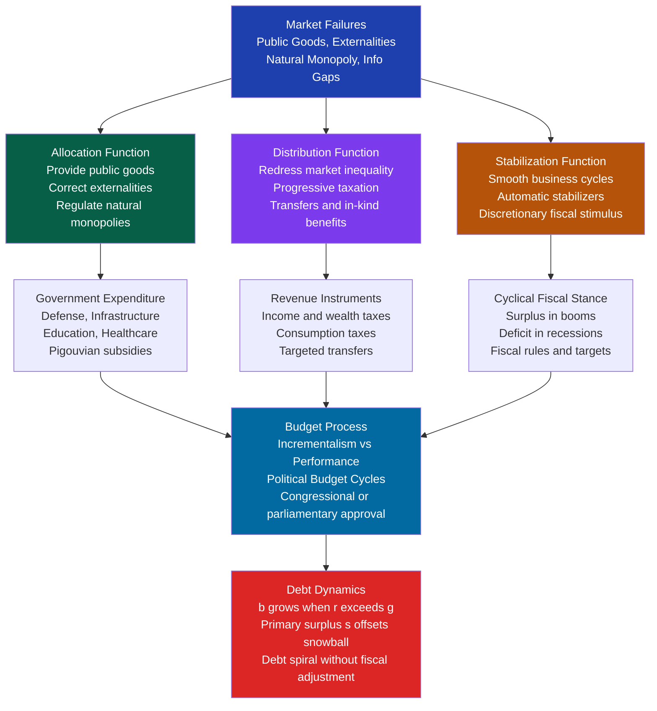

# Public Finance and Fiscal Policy

> [!abstract] TL;DR
> Public finance is the study of how governments raise revenue and allocate expenditure to correct market failures, redistribute income, and stabilise the economy — Musgrave's three functions (1959). Fiscal policy is the active use of those levers to manage aggregate demand, fund public goods, and shape the distribution of welfare. The discipline sits at the intersection of economics and politics: even technically superior policies fail if they cannot survive the budget process, survive electoral cycles, or survive constitutional constraints on public debt.

---

## Intuition

**Analogy:** Think of a government as the management committee of an apartment complex — except this committee is also the landlord, the insurer, the maintenance crew, and the economic referee for every resident. Like any household, the committee has income (resident fees, i.e., taxes), spending (services), and sometimes borrows (deficits). But unlike a private household, it has three obligations no individual resident has: it must provide services the private market cannot, such as the shared courtyard and fire safety systems that no individual would fund on their own (public goods and externalities); it must prevent the building from becoming de facto uninhabitable for the poorest residents (redistribution); and it must act as a shock absorber when the local economy collapses and residents cannot pay rent (stabilisation). These three obligations are the source of nearly every major debate in public finance — how much to spend, who pays, who benefits, and who decides.

When the committee runs a deficit — spending more than it collects — it is not simply mismanaging accounts. It may be investing in structural improvements that raise future property values (growth-enhancing capital spending), or it may be subsidising residents through a recession it did not cause. Whether that borrowing is prudent depends on what it funds, how fast the building's asset base is growing relative to the cost of the debt, and whether future residents can be trusted to honour the obligation.

---

## How It Works



---

## Key Concepts

### Secondary Level

**Musgrave's three functions (1959).** Richard Musgrave's *The Theory of Public Finance* (1959) is the foundational framework of the discipline. He argued that any government's fiscal activities can be sorted into three distinct branches — each with a different economic logic, different instruments, and ideally different decision-making criteria:

1. **Allocation branch** — corrects market failures. Private markets under-provide public goods (national defence, basic research, street lighting) and over-produce negative externalities (pollution, congestion). The government uses spending and Pigouvian taxes or subsidies to move resource allocation closer to the social optimum.
2. **Distribution branch** — redistributes income and wealth. Markets reward factor endowments — skill, capital, inherited wealth — in ways that may produce socially unacceptable inequality. Progressive income taxes, means-tested transfers, and public in-kind services (education, healthcare) reallocate purchasing power toward socially preferred distributions.
3. **Stabilisation branch** — manages the macroeconomy. Markets generate cycles, booms, and recessions. Fiscal policy, alongside monetary policy, can dampen these fluctuations through automatic stabilisers (progressive taxes that collect less in recessions, unemployment insurance that pays out more) and discretionary interventions (stimulus packages, austerity programmes).

Musgrave's framework is normative as well as descriptive: each branch should be guided by a distinct economic criterion even if political constraints prevent clean separation. A single budget line item — say, a housing subsidy — may simultaneously allocate resources toward a good with externalities (density, transport savings), redistribute income toward low earners, and provide an automatic stabiliser during recessions.

**Public goods and externalities as justifications for spending.** Two canonical market failures that underpin Musgrave's allocation function:

- **Public goods** are non-rival (one person's consumption does not diminish another's) and non-excludable (no one can be prevented from using them). National defence, public health surveillance, and basic research are examples. Private markets under-provide them because of the free-rider problem — individuals rationally wait for others to pay. Since no one pays, the good is not provided, even though every individual values it. Compulsory tax finance solves the collective action problem.
- **Externalities** arise when production or consumption imposes costs (pollution, congestion) or confers benefits (vaccination, education) on third parties not represented in market prices. Uncorrected, markets over-produce negative and under-provide positive externalities. Pigouvian taxes equal to the marginal external cost, or subsidies equal to the marginal external benefit, are the canonical corrective instruments.

**Budget basics: revenues, expenditures, deficit, and debt.** The government budget identity states that in any period, spending equals revenue plus new borrowing. The *primary deficit* is government expenditure minus tax revenues, excluding interest payments. The *total deficit* adds interest payments on the existing debt stock. Debt is the accumulated stock of all past deficits. A country can reduce its deficit while still increasing its debt — as long as the primary deficit remains positive, the debt stock rises. This stock-flow distinction is fundamental to debt sustainability analysis.

### Undergraduate Level

**Optimal taxation: the Ramsey rule.** Frank Ramsey (1927) asked: how should a revenue-constrained government raise a fixed amount of revenue while minimising aggregate welfare loss? His answer — the *inverse elasticity rule* — states that the optimal tax rate on any good should be inversely proportional to its price elasticity of demand. Goods with inelastic demand (necessities: food, energy, land) can bear high taxes without large behavioural distortions. Elastic goods (luxury holidays, discretionary consumer goods) should be taxed lightly because high rates cause large deadweight losses as consumers substitute away.

The Ramsey rule is powerful but creates a deep equity problem: goods with inelastic demand are often necessities consumed disproportionately by lower-income households. Taxing them most heavily is efficient but regressive. Any application of optimal tax theory must therefore specify social welfare weights that balance efficiency against distributional goals. The Diamond-Mirrlees (1971) production efficiency theorem offers a partial resolution: taxes should not distort production decisions (no taxes on intermediate goods), leaving only the consumption-distribution trade-off.

**Mirrlees optimal income tax.** James Mirrlees (1971) formalised the optimal income tax problem with an information asymmetry at its core: the government cannot observe individuals' productive ability (their wage rate), only their income (ability × hours worked). A high-income person could be a high-ability individual working hard, or a medium-ability person working extremely long hours. Since ability cannot be taxed directly (it is unobservable), any income tax necessarily creates a labour supply distortion: taxing the return to work discourages work.

Key findings from the Mirrlees framework:
- The optimal marginal tax rate on the highest earner is zero (an extra dollar of redistribution from the very top earner creates no incentive distortion there, but a positive marginal rate at the top creates distortions just below the top — it is always better to set top marginal rates to zero).
- Optimal marginal rates for lower earners depend on the government's distributional preferences and on empirical estimates of labour supply elasticity.
- Diamond and Saez (2011) calibrated the model with empirical elasticity estimates and found optimal top marginal income tax rates of 70-80% — far above most OECD countries' actual rates. The discrepancy reflects political economy constraints that the purely normative Mirrlees framework ignores.

**Political budget cycles: Nordhaus (1975).** Political scientist William Nordhaus documented a systematic tendency of democratically elected governments to manipulate fiscal policy around elections. The pattern: in the period before an election, governments increase spending, cut taxes, and run larger deficits to boost growth and reduce unemployment. After the election, particularly after re-election, they consolidate — cutting spending or raising taxes — to restore fiscal sustainability. This creates a politically-generated fiscal cycle superimposed on the economic cycle.

Empirical evidence for political budget cycles is strongest in developing and new democracies (Brender and Drazen 2005). In mature democracies with independent central banks, independent budget offices, and binding fiscal rules (the EU Stability and Growth Pact, Germany's constitutional debt brake, the UK's fiscal mandate), the cycle is attenuated but not eliminated. Electoral fiscal manipulation is one rationale for fiscal institutions designed to bind governments' discretion.

**Fiscal federalism and the assignment problem.** Wallace Oates' *Fiscal Federalism* (1972) formalised the central question of intergovernmental finance: which level of government — federal, state, or local — should have taxing and spending authority over which services? His *Decentralisation Theorem* states that each public good should be provided by the smallest jurisdiction that internalises all its costs and benefits. Local public goods (parks, sanitation, local roads) should be locally provided because local governments can better match spending to heterogeneous local preferences. National public goods (defence, macroeconomic stabilisation, national infrastructure) belong at the federal level because their benefits extend across all jurisdictions.

Charles Tiebout (1956) formalised the efficiency case for decentralisation through the concept of "voting with your feet": if citizens can migrate freely between jurisdictions, they sort themselves into communities that match their tax-service preferences, disciplining local governments through exit rather than voice. Tiebout sorting can be a market-like mechanism for local public goods. Its limits: migration is costly and not equally available to all income groups; redistributive services (welfare, social housing) are systematically undermined by Tiebout competition because poorer residents gravitate toward jurisdictions with higher benefits and lower earners gravitate away; and externalities routinely cross local boundaries (a polluting factory in one county affects residents of neighbouring counties).

**Incrementalism in budgeting: Lindblom and Wildavsky.** Charles Lindblom's "muddling through" (1959) and Aaron Wildavsky's *The Politics of the Budgetary Process* (1964) argued that public budgets are not made by comprehensive rational optimisers choosing the best allocation from a blank slate each year. They are instead deeply incremental: each year's budget is approximately last year's budget plus marginal adjustments. This incrementalism reflects several reinforcing mechanisms:

- *Bounded rationality*: comprehensive annual review of every programme is informationally impossible.
- *Political bargaining*: existing programmes have entrenched constituencies — agencies, contractors, beneficiaries — who resist cuts more forcefully than potential new programmes can generate support.
- *Base budget norms*: the prior year's allocation functions as a legitimising anchor; a programme that received £100m last year has a presumptive claim to £100m this year.

The implication is that the budget is highly path-dependent: the structure of public spending at time $t$ largely reflects decisions made decades earlier. Revolutionary reallocation requires fiscal crises (forcing across-the-board cuts), electoral landslides (shifting governing coalition preferences), or major shocks (a war, pandemic, or climate emergency) that create "policy windows" (Kingdon 1984) for fundamental revision.

**Performance budgeting.** A reform response to incremental budgeting: rather than simply approving dollar amounts for agencies (input-based budgeting), performance budgeting links appropriations to measurable outputs or outcomes. New Zealand pioneered output-based budgeting in the 1990s with separately incorporated departments given output contracts and budget allocations tied to deliverables. The US Government Performance and Results Act (GPRA, 1993), the UK Comprehensive Spending Review, and the OECD's whole-of-government performance frameworks represent different national variations.

In practice, performance budgeting faces persistent challenges: outputs of many public services (courts, diplomacy, community health) are hard to quantify; agencies game measurable indicators while allowing unmeasured quality to deteriorate; politicians have stronger incentives to monitor inputs (visible to constituents) than outcomes (often abstract and long-term); and performance information, even when produced, rarely changes budget allocations in ways the incremental model would predict.

### Graduate Level

**Austerity versus stimulus: the Alesina-Keynesian debate.** The question of whether fiscal consolidation (cutting spending or raising taxes to reduce deficits) is contractionary or expansionary generated the most consequential fiscal policy debate of the post-2008 decade:

*The expansionary austerity hypothesis (Alesina and Ardagna 2010)*: Fiscal consolidation can be expansionary even in the short run if it credibly signals long-term fiscal sustainability, thereby reducing sovereign risk premia and long-term interest rates. Lower rates boost private investment. If consolidation is spending-based rather than tax-based, it avoids the tax distortions that suppress supply. For open economies with flexible exchange rates, consolidation can be accompanied by currency depreciation that shifts demand toward exports. Alesina identified several episodes — Ireland 1987, Denmark 1983, Canada 1994 — as examples of expansionary consolidations.

*The Keynesian critique (Blanchard and Leigh 2013)*: When the IMF used fiscal multipliers of approximately 0.5 to forecast output during Eurozone austerity (2010-13), it systematically under-predicted the output losses. The actual multiplier was closer to 1.5-2.0 because: (a) all Eurozone economies were consolidating simultaneously, eliminating the trading-partner demand channel; (b) the ECB's zero lower bound prevented monetary offset (interest rate cuts to compensate for fiscal tightening); and (c) the deep recession raised the fraction of credit-constrained households, increasing the consumption response to income changes. The IMF formally revised its multiplier estimates upward in October 2012.

The post-2015 consensus: fiscal multipliers are *state-dependent* — higher in recessions, at the zero lower bound, in closed economies, and under fixed exchange rates; lower in booms, with active monetary policy, and in open economies. The "expansionary austerity" claim is fragile to sample construction and does not extend reliably to recession contexts. The composition of consolidation matters: spending cuts affect tradable-sector wages differently from tax increases on non-tradable services.

**Ricardian equivalence and its limits.** Robert Barro (1974) formalised David Ricardo's conjecture that the method of financing a given level of government spending — taxes today or deficit (taxes tomorrow) — is irrelevant for aggregate demand. If households are rational, have infinite planning horizons or full bequest motives, face perfect capital markets, and correctly anticipate future taxes, they will save any tax cut exactly enough to repay the future liability. Private saving rises by the exact amount government saving falls; national saving is unchanged; interest rates do not move; the IS curve does not shift.

Ricardian Equivalence fails — and fiscal policy has real effects — when: households are credit-constrained (a tax cut provides liquidity they could not otherwise borrow); households have finite horizons (future taxes fall partly on unborn generations, making current debt a genuine wealth transfer); households do not fully anticipate future tax liability (bounded rationality); or taxes are distortionary (the RE derivation requires lump-sum taxes). Empirical evidence from US tax rebate studies (Johnson, Parker and Souleles 2006) consistently finds households spend 25-65% of a tax rebate — far from the zero implied by full RE — with spending rates highest among lower-income, credit-constrained households.

**Debt sustainability and sovereign crises.** The debt dynamics equation, central to any fiscal sustainability analysis, governs how the debt-to-GDP ratio evolves:

$$\Delta b_t = (r - g) \cdot b_{t-1} - s_t$$

where $b$ is public debt as a share of GDP, $r$ is the real interest rate on government debt, $g$ is the real GDP growth rate, and $s$ is the primary surplus as a share of GDP. When $r > g$ (the Domar condition violated), the debt ratio grows even with a zero primary deficit. The primary surplus required merely to stabilise the debt ratio is $(r - g) \cdot b$: at 80% debt and a 2 percentage-point $r-g$ spread, a 1.6% primary surplus is needed before the debt ratio stops rising.

Blanchard (2019) observed that for most of the post-WWII period in the US, $r < g$ — making the "snowball effect" a non-issue and implying that moderate deficit spending does not require offsetting future surpluses. The counter-argument: the low-rate environment post-2008 reflected extraordinary monetary conditions, not a permanent structural shift; and the $r > g$ condition that prevailed in the late 1970s and 1980s could return.

The Greek sovereign debt crisis (2010-12) demonstrated that market confidence effects can create self-fulfilling fiscal crises: once markets fear default, they demand higher spreads; higher spreads raise $r - g$; higher $r - g$ requires a larger primary surplus; the fiscal adjustment required to achieve that surplus in a recession contracts GDP; the contraction raises the debt-to-GDP ratio further — a doom loop. Mario Draghi's July 2012 "whatever it takes" pledge — committing the ECB to unlimited sovereign bond purchases — broke the loop by removing the tail risk of euro exit.

**Strategic deficits: the Alesina-Tabellini model.** From a political economy perspective, why do governments borrow systematically rather than running balanced budgets? Alesina and Tabellini (1990) modelled deficits as a strategic tool: a governing party that anticipates losing the next election has an incentive to run deficits today, accumulating debt that constrains its successor. Inherited debt service costs crowd out spending on the opponent's preferred programmes. The party effectively prefers public debt over private saving: debt is harder for the successor to repudiate than to redirect spending. This creates a deficit bias driven not by macroeconomic stabilisation logic but by inter-party strategic competition — providing a political economy rationale for constitutional fiscal rules (balanced-budget amendments, debt brakes, EU Stability and Growth Pact) as pre-commitment devices against opportunistic borrowing.

---

## Python Demo

```python
import numpy as np
import matplotlib.pyplot as plt

# Debt sustainability simulation
# Core equation: b[t] = b[t-1] + (r - g) * b[t-1] - s
# b = debt/GDP ratio; r = real interest rate; g = real growth rate
# s = primary surplus/GDP (positive = surplus, negative = deficit)

def simulate_debt(b0, r, g, s, years=40):
    b = np.zeros(years)
    b[0] = b0
    for t in range(1, years):
        b[t] = b[t - 1] + (r - g) * b[t - 1] - s
        b[t] = max(b[t], 0.0)  # floor at zero; debt cannot be negative
    return b

years = 40
t_axis = np.arange(years)
b0 = 0.60  # starting debt/GDP = 60%

scenarios = [
    {
        "label": "Convergent: r=2%, g=3%, s=0% (r < g)",
        "r": 0.02, "g": 0.03, "s": 0.00,
        "color": "green", "ls": "-",
    },
    {
        "label": "Stable: r=3%, g=3%, s=0.5% (r = g, small surplus)",
        "r": 0.03, "g": 0.03, "s": 0.005,
        "color": "royalblue", "ls": "-",
    },
    {
        "label": "Slow spiral: r=4%, g=2%, s=1% (r > g, surplus insufficient)",
        "r": 0.04, "g": 0.02, "s": 0.01,
        "color": "orange", "ls": "--",
    },
    {
        "label": "Debt spiral: r=6%, g=1%, s=0% (r >> g, no surplus)",
        "r": 0.06, "g": 0.01, "s": 0.00,
        "color": "red", "ls": "--",
    },
    {
        "label": "Austerity path: r=4%, g=2%, s=3% (large surplus stabilises)",
        "r": 0.04, "g": 0.02, "s": 0.03,
        "color": "purple", "ls": ":",
    },
]

fig, ax = plt.subplots(figsize=(11, 6))
for sc in scenarios:
    b = simulate_debt(b0, sc["r"], sc["g"], sc["s"], years)
    ax.plot(t_axis, b * 100, label=sc["label"],
            color=sc["color"], linestyle=sc["ls"], linewidth=2)

ax.axhline(y=60, color="gray", linestyle="-.", linewidth=1,
           label="Starting level: 60% of GDP")
ax.axhline(y=90, color="saddlebrown", linestyle=":", linewidth=1.5,
           label="Reinhart-Rogoff warning threshold: 90%")

ax.set_xlabel("Years", fontsize=12)
ax.set_ylabel("Debt / GDP (%)", fontsize=12)
ax.set_title(
    "Debt Sustainability: How the r-g Spread and Primary Balance\nDetermine Long-Run Debt Trajectories",
    fontsize=13,
)
ax.legend(fontsize=8, loc="upper left")
ax.grid(True, alpha=0.3)
ax.set_ylim(0, 210)
plt.tight_layout()
plt.savefig("debt_dynamics.png", dpi=120)
plt.show()

# Analytical stabilising primary surplus for each scenario
print("Required primary surplus to stabilise debt at 60% of GDP:")
for sc in scenarios:
    r, g, b = sc["r"], sc["g"], b0
    s_required = (r - g) * b
    s_actual = sc["s"]
    status = "stable" if s_actual >= s_required else "SPIRALING"
    print(
        f"  r={r:.0%}, g={g:.0%}: s* = {s_required:.1%}  |  "
        f"running s = {s_actual:.1%}  ->  {status}"
    )
```

---

## Real-World Applications

**Greece 2010-2012 sovereign debt crisis.** Greece's debt/GDP ratio reached 130% by 2010, real growth was near zero, and market borrowing rates exceeded 10%. With $r - g$ exceeding 8 percentage points, the primary surplus needed to stabilise debt arithmetically exceeded 10% of GDP — politically impossible to achieve in a deep recession. The result was a self-fulfilling crisis: markets demanded high rates fearing default; high rates made default more likely; fiscal austerity imposed by the troika contracted GDP by 25% over four years, paradoxically raising the debt ratio as the denominator fell faster than the numerator. Greece illustrates why fiscal consolidation imposed without monetary offset (the ECB could not cut rates for Greece alone) or currency depreciation (Greece could not leave the euro unilaterally) produced the largest multiplied contraction in modern European history.

**US ARRA (2009, 787 billion dollars).** The American Recovery and Reinvestment Act was the largest discretionary US fiscal stimulus to that point. The CBO estimated multipliers of 1.0-2.5 across spending categories: direct government expenditure on infrastructure scored highest; personal income tax cuts scored lowest (partial Ricardian offset plus saving by higher-income recipients). The stimulus demonstrably softened the recession's depth — the counterfactual unemployment peak would likely have exceeded 12% rather than the actual 10%. However, its scale was criticised as insufficient relative to the estimated output gap of 2-3 trillion dollars, and the political coalition that passed ARRA in February 2009 had collapsed by mid-2010 as deficit concerns became the dominant political narrative, illustrating the Nordhaus cycle in real time.

**Sweden's fiscal consolidation (1993-1998).** Sweden reduced public spending from 71% to 56% of GDP in five years without a prolonged recession — a result cited repeatedly in the "expansionary austerity" literature. The consolidation was accompanied by: (a) Sweden's exit from the ERM in November 1992, allowing a 25% currency depreciation that dramatically boosted export competitiveness; (b) structural reform of public administration (independent agencies, performance contracts, multi-year expenditure ceilings); and (c) a productivity boom in telecommunications and manufacturing that coincided with the consolidation period. Sceptics of the "expansionary" reading note that the currency depreciation — not the fiscal tightening per se — provided the demand stimulus that made austerity consistent with growth.

**Japan's fiscal stance since 1990.** Japan has run primary deficits almost continuously since the early 1990s, accumulating debt to approximately 260% of GDP by 2024 — the highest in the OECD. No sovereign debt crisis has occurred. Japan borrows almost entirely from domestic savers in yen; the Bank of Japan suppresses JGB yields through quantitative easing; deflation and near-zero nominal rates have kept real debt service manageable. Japan illustrates that $r < g$ — or even $r < 0$ — can sustain debt ratios that appear arithmetically explosive, and that the "90% of GDP" Reinhart-Rogoff threshold is not a universal crisis trigger. It also illustrates the limits of fiscal stimulus alone to overcome structural demand weakness driven by demographic headwinds and entrenched deflation expectations.

---

## Common Pitfalls

- **Conflating Musgrave's three functions.** A spending programme can simultaneously serve allocation (providing a public good), distribution (targeted at lower-income groups), and stabilisation (counter-cyclical design). Treating all government spending as if it serves a single function muddles the welfare analysis. A poorly targeted housing subsidy may be redistributive in intention but allocatively inefficient and pro-cyclical in practice.
- **Applying the Ramsey rule without equity constraints.** Taxing inelastic goods most heavily is efficient but typically regressive. The Ramsey rule derived without distributional weights would recommend a poll tax on necessities. Any application of optimal tax theory must specify social welfare weights — otherwise it is an efficiency theorem masquerading as a normative recommendation.
- **Assuming a constant fiscal multiplier.** Using a peacetime multiplier of 0.8 to evaluate a recession-era stimulus, where the true multiplier may be 2.0, systematically underestimates effectiveness. Conversely, applying a large recession multiplier at full employment overstates real output gains and understates inflation risk. Multipliers vary by cycle position, monetary policy stance, exchange rate regime, and trade openness.
- **Treating Ricardian Equivalence as an empirical description.** RE is a theoretical benchmark that fails when credit constraints, finite horizons, or bounded rationality are present — i.e., always in practice. Tax rebate evidence consistently shows 25-65% of a rebate is spent immediately. Using RE to argue that fiscal stimulus is always impotent conflates a useful theoretical limit case with a predictive model.
- **Ignoring political budget cycles in fiscal forecasts.** Official government forecasts in countries with weak fiscal institutions systematically underestimate pre-election spending and post-election consolidation requirements. Independent fiscal councils (UK OBR, Irish IFAC, Swedish Fiscal Policy Council) exist precisely to reduce this optimism bias.
- **Using debt/GDP as the sole sustainability metric.** Japan at 260% of GDP is more sustainable than Argentina at 60% because of currency denomination, domestic vs. external creditor base, $r-g$ dynamics, and central bank capacity. A single threshold (the Reinhart-Rogoff 90% level) cannot substitute for full debt dynamics analysis that accounts for growth prospects, interest rates, primary balance trajectory, and currency sovereignty.

---

## Related Concepts

- [[_MOC_Public_Policy_and_Political_Economy|↑ Public Policy and Political Economy MOC]] — the section map linking all six notes in this cluster; return here to navigate between fiscal policy, welfare, regulation, and development.
- [[Government_Spending_Multiplier]] — the Keynesian mechanism through which government spending (Musgrave's stabilisation function) boosts aggregate output; multiplier size depends critically on fiscal stance, monetary regime, and the cycle position
- [[Tax_Policy]] — the revenue side of public finance: the Laffer curve, Ramsey optimal taxation, supply-side vs. equity trade-offs; the microeconomic complement to this note's macrofiscal framing
- [[Budget_Deficits_and_Debt]] — the debt dynamics equation underpinning fiscal sustainability; the arithmetic derivation of the primary surplus requirement that this note applies to sovereign crises
- [[Ricardian_Equivalence]] — the theoretical benchmark that taxes vs. deficit financing is irrelevant for aggregate demand; its failure conditions are the empirical basis for the effectiveness of fiscal stimulus
- [[Automatic_Stabilizers]] — the built-in fiscal mechanisms (progressive taxes, unemployment insurance) that implement Musgrave's stabilisation function without discretionary legislative action each cycle
- [[Public_Goods]] — the canonical market failure underlying Musgrave's allocation function; the Samuelson condition for optimal public good provision is the microeconomic foundation of government expenditure theory
- [[Externalities_and_Pigouvian_Tax]] — Pigouvian taxes and subsidies are the primary allocation-function instruments for correcting externalities; carbon taxes, fuel subsidies, and education vouchers are fiscal applications
- [[Market_Failures]] — the microeconomic taxonomy (public goods, externalities, natural monopoly, information asymmetry) that provides the normative justification for all three Musgrave functions
- [[Federalism_and_Decentralization]] — Oates' Decentralisation Theorem and Tiebout sorting determine which level of government should exercise fiscal authority; fiscal federalism is the constitutional and intergovernmental dimension of public finance
- [[Liberalism_and_Its_Variants]] — the ideological axis structuring disagreements between neoliberals (minimise the state, trust markets) and social liberals (positive liberty requires active redistribution and stabilisation) maps directly onto disputes about the scope and composition of each Musgrave function

---

## Review Questions

### Secondary

1. What are Musgrave's three functions of government finance? For each function, give one real-world policy example and explain why the private market fails to provide it adequately without government intervention.
2. Why does the free-rider problem mean national defence must be funded by compulsory taxation rather than voluntary contributions? What would a society where defence funding was voluntary look like in equilibrium?
3. A government spends 500 on programmes and 40 on interest payments, and collects 460 in taxes. Calculate the primary deficit and the total deficit. If the previous year's debt stock was 800, what is the new debt stock?

### Undergraduate

1. The Ramsey rule says taxes should be levied in inverse proportion to price elasticity. Bread has a price elasticity of demand of -0.2 and luxury holidays have -1.8. What does the Ramsey rule recommend about the relative tax rates? State the equity objection precisely and explain how incorporating distributional weights into the social welfare function modifies the recommendation.
2. A country has a debt/GDP ratio of 70%, a real interest rate of 4%, and real GDP growth of 2%. (a) What primary surplus/GDP is needed to stabilise the debt ratio? (b) If the government invests in infrastructure that raises potential growth to 4%, what primary balance is required? (c) What does the comparison of (a) and (b) imply about the fiscal dividend of growth-enhancing public investment?
3. Explain Nordhaus's political budget cycle model. What institutional mechanisms — independent central banks, fiscal rules, independent budget offices — are designed to attenuate its impact? Give one empirical example where the cycle appears to have operated and one where institutional design successfully constrained it.

### Graduate

1. Alesina and Tabellini (1990) modelled government deficits as a strategic tool by which a governing party constrains its successor. (a) Sketch a two-period model with two parties with different spending preferences — one for defence, one for social programmes — and show why each party, when in office and facing possible electoral defeat, will run a deficit. (b) What empirical prediction does the model make about cross-country variation in deficit bias as a function of political polarisation? (c) What constitutional rule would eliminate the strategic deficit, and what is the efficiency cost of that rule relative to the flexibility benefits of discretionary fiscal policy?
2. Blanchard and Leigh (2013) estimated that fiscal multipliers during Eurozone austerity were 1.5-2.0, substantially above the 0.5 assumed in IMF forecast models. Critically assess: (a) the identification strategy (using forecast errors to back out implied multipliers); (b) the three structural reasons the multiplier would have been unusually elevated in 2010-13 Greece and Portugal specifically; and (c) whether the finding supports a general rejection of the "expansionary austerity" hypothesis or only its application under specific macroeconomic conditions that happened to characterise the Eurozone at that time.
3. Compare Ricardian Equivalence (Barro 1974) and Mirrlees optimal income tax (1971) as normative benchmarks in public finance. In what sense do they make fundamentally different assumptions about household behaviour — infinite horizon with full bequest motive (RE) versus observable income but unobservable ability (Mirrlees)? Under what policy design question does each framework offer the most useful guidance, and in what sense does the empirical violation of RE assumptions (credit constraints, finite horizons) simultaneously relax the incentive-compatibility constraint at the heart of the Mirrlees problem?

---

## Sources

- Richard Musgrave, *The Theory of Public Finance* (McGraw-Hill, 1959)
- Frank Ramsey, "A Contribution to the Theory of Taxation," *Economic Journal* (1927)
- James Mirrlees, "An Exploration in the Theory of Optimum Income Taxation," *Review of Economic Studies* (1971)
- William Nordhaus, "The Political Business Cycle," *Review of Economic Studies* (1975)
- Wallace Oates, *Fiscal Federalism* (Harcourt Brace Jovanovich, 1972)
- Charles Tiebout, "A Pure Theory of Local Expenditures," *Journal of Political Economy* (1956)
- Aaron Wildavsky, *The Politics of the Budgetary Process* (Little, Brown, 1964)
- Robert Barro, "Are Government Bonds Net Wealth?" *Journal of Political Economy* (1974)
- Alberto Alesina and Guido Tabellini, "A Positive Theory of Fiscal Deficits and Government Debt," *Review of Economic Studies* (1990)
- Alberto Alesina and Silvia Ardagna, "Large Changes in Fiscal Policy: Taxes Versus Spending," *Tax Policy and the Economy* (2010)
- Olivier Blanchard and Daniel Leigh, "Growth Forecast Errors and Fiscal Multipliers," *AER Papers and Proceedings* (2013)
- Olivier Blanchard, "Public Debt and Low Interest Rates," *American Economic Review* (2019)
- Peter Diamond and Emmanuel Saez, "The Case for a Progressive Tax," *Journal of Economic Perspectives* (2011)
- Carmen Reinhart and Kenneth Rogoff, *This Time Is Different: Eight Centuries of Financial Folly* (Princeton University Press, 2009)
- John Kingdon, *Agendas, Alternatives, and Public Policies* (1984)

---

#PoliticalScience #PublicPolicy #PublicFinance #FiscalPolicy
