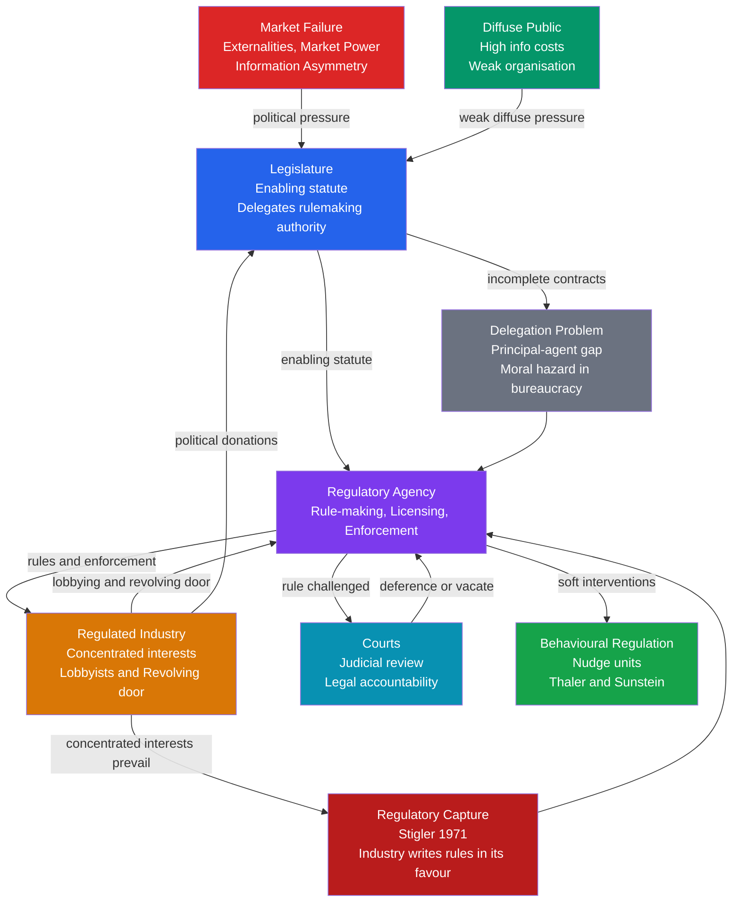

# Regulatory Politics and Administrative Law

> [!abstract] TL;DR
> Regulation is the state's tool for correcting market failures that markets cannot self-correct — externalities, market power, information asymmetries, and systemic risk. Legislatures delegate rule-making authority to specialist agencies because they lack the bandwidth to legislate every technical standard. But delegation creates a principal-agent problem: agencies are supposed to serve the public but are surrounded by the very industries they regulate, producing regulatory capture (Stigler 1971). Administrative law — the legal framework governing how agencies exercise delegated power — is the institutional attempt to keep those agents honest. From Weber's ideal-type bureaucracy to Thaler and Sunstein's nudge units, the history of regulatory politics is the history of trying to build a referee who cannot be bought.

---

## Intuition — analogy FIRST

Imagine a sports league that needs referees to enforce fair play. The league (the legislature) cannot watch every match personally, so it creates a Referees Association (the regulatory agency) and grants it authority to write the rulebook and issue red cards. The Association is supposed to be neutral.

But here is the problem: referees are recruited from former players, the industry funds their training programmes, retired referees return to coaching jobs at the biggest clubs, and the clubs have a sophisticated lobbying association that meets with the Referees Association every week. The fans (the diffuse public) care deeply about fair play but are scattered, poorly organised, and do not attend the technical meetings. Over time, the "independent" Referees Association begins writing rules that systematically favour the clubs that pay its future members' salaries.

This is the core problem of regulatory politics in one paragraph. The policy question (is there a market failure worth correcting?) is analytically separate from the political economy question (will the corrective institution itself be captured?). Administrative law is the rulebook that governs how the Referees Association must conduct its meetings, publish its decisions, accept public comment, and submit to court review — all designed to make capture harder and accountability stronger.

---

## How It Works



---

## Key Concepts / Details

### Secondary Level

**What Is Regulation and Why Does It Exist?**

Regulation is any rule or standard issued by a public authority that constrains the behaviour of private actors — firms, individuals, or markets. It exists because markets sometimes fail to produce socially optimal outcomes. The four canonical market failures that justify regulatory intervention are:

| Market Failure | Mechanism | Regulatory Response |
|----------------|-----------|---------------------|
| **Externalities** | Private costs differ from social costs | Emission standards, pollution taxes |
| **Market power** | Monopoly restricts output and raises prices | Antitrust law, price regulation |
| **Information asymmetry** | One party knows more than the other | Disclosure mandates, licensing |
| **Systemic risk** | Individual rational action creates collective instability | Prudential banking regulation |

**Weber's Rational-Legal Bureaucracy**

Max Weber identified three types of legitimate authority: traditional, charismatic, and rational-legal. Modern regulatory bureaucracy is the purest form of rational-legal authority: officials are appointed on merit, bound by impersonal rules, cannot personally own their office, and apply the same standards to all cases. Weber's ideal-type bureaucracy is efficient precisely because it is *predictable* — firms can comply when they know the rules will be applied consistently and without favour.

The Weberian ideal provides a benchmark. Real regulatory agencies deviate from it in predictable ways: personnel rotate through industry, politicians intervene in enforcement decisions, and rules accumulate through path dependence rather than rational redesign.

**Principal-Agent Problem in Regulation**

When a legislature creates a regulatory agency, it cannot monitor the agency's every decision. The agency (the agent) has more information about the technical field than the legislature (the principal) and pursues its own interests — career advancement, budget maximisation, ideological preferences. The principal cannot write a complete contract specifying the correct decision in every situation. This gap — the **delegation problem** — is the structural origin of most regulatory pathologies.

Three analogies for the delegation problem:

1. You hire a contractor to renovate your house. You specify the outcome but not every method. The contractor cuts corners you cannot easily detect — **moral hazard**.
2. You cannot tell before hiring which contractors are careful and which are careless — **adverse selection**.
3. The contractor knows far more about construction than you do — **information asymmetry**.

Regulatory agencies face all three simultaneously: they take actions the legislature cannot monitor (moral hazard), were staffed from candidates whose true preferences were unknown at appointment (adverse selection), and possess technical expertise their overseers lack (information asymmetry).

---

### Undergraduate Level

**Regulatory Capture (Stigler 1971)**

George Stigler's "The Theory of Economic Regulation" (1971) is the foundational public choice critique. Stigler's argument: regulation is not primarily supplied to correct market failures but is *demanded* by industries and supplied to them by politicians. Industries want regulation because it raises barriers to entry, validates cartel pricing, and suppresses competitive threats. Politicians supply it in exchange for votes, campaign contributions, and post-government employment.

The mechanism operates through **concentrated vs. diffuse interests** (Mancur Olson's logic of collective action):

- Industry has a **concentrated, high-stakes interest** in regulatory outcomes — one rule can determine profitability across an entire sector. It can afford professional lobbyists and is willing to pay the coordination costs of sustained political engagement.
- The **public has a diffuse, low-stakes interest** — a regulation that raises electricity prices by 3% costs each consumer little. It is not worth an individual's time to monitor the rulemaking, attend comment periods, or organise a lobbying campaign.

This asymmetry means that even well-intentioned regulatory processes systematically tilt toward industry preferences over time. The **revolving door** — the movement of personnel between a regulatory agency and the industry it regulates — intensifies capture: regulators who expect to be hired by the industry they currently oversee internalise industry preferences in their current decisions.

**Independent Regulatory Agencies**

Democratic governments have developed institutional forms designed to insulate regulatory decisions from both political and industry pressure:

- **Independence from the executive**: commissioners serve fixed, staggered terms and can only be removed for cause rather than for policy disagreement. The US Federal Reserve, SEC, and FTC are structured this way.
- **Transparency requirements**: decisions must be published with written reasoning; comment periods allow public input before rules take effect (US Administrative Procedure Act, 1946).
- **Meritocratic staffing**: civil service protection insulates career staff from political dismissal.

But independence has its own costs: unelected regulators making consequential policy decisions raise democratic accountability problems. The **legitimacy tension** in administrative law runs between two poles — a more independent agency is better insulated from capture but less democratically accountable; a more politically responsive agency is more accountable but more susceptible to capture.

**Administrative Law: The Core Framework**

Administrative law governs how agencies exercise delegated legislative power. Three core questions define the field:

1. **Delegation doctrine**: How much discretion can a legislature lawfully delegate to an agency? In the United States, the nondelegation doctrine — the principle that Congress cannot transfer its core legislative power — has historically been weak, allowing broad delegations. Courts began to revive it in recent years: *West Virginia v. EPA* (2022) introduced the "major questions doctrine," which requires clear congressional authorisation for regulatory decisions of major economic or political significance.

2. **Notice-and-comment rulemaking**: Before issuing binding rules, a US agency must publish a proposed rule, invite public comment, consider those comments seriously, and publish a final rule with a reasoned response to significant objections. This is informal rulemaking under APA Section 553, designed to substitute transparency for the democratic deliberation that direct legislation would involve.

3. **Judicial review of agencies**: Courts review agency rules for:
   - *Procedural compliance* — did the agency follow proper process?
   - *Statutory authority* — did the agency act within its enabling statute?
   - *Arbitrary-and-capricious review* — was the agency's reasoning rational and supported by evidence?

**Chevron Deference and Its Demise**

*Chevron U.S.A. v. Natural Resources Defense Council* (1984) set the dominant framework for judicial review of agencies' statutory interpretations for forty years. The two-step test:

- **Step 1**: Is the statute unambiguous on the relevant question? If Congress has spoken clearly, courts must follow the statute.
- **Step 2**: If the statute is ambiguous, is the agency's interpretation *reasonable*? If yes, courts defer to the agency — specialists know more than generalists.

The *Loper Bright* revolution: *Loper Bright Enterprises v. Raimondo* (2024) overturned Chevron. The Supreme Court held that courts have an independent constitutional obligation to determine the best reading of a statute, regardless of agency interpretation. Courts may still consider agency views persuasive, but they no longer defer automatically. The practical consequence: regulatory decisions resting on ambiguous statutory authority are now substantially more litigable, shifting power from agencies toward the judiciary.

---

### Graduate Level

**The Principal-Agent Hierarchy in Bureaucracy**

The regulatory system is not a single principal-agent relationship but a **multi-level hierarchy** of delegation:

> Voters → Legislature → Executive → Agency → Regulated firms

Each link introduces an information gap and a potential misalignment of incentives. Political scientists model this using McNollgast's (McCubbins, Noll, Weingast 1987) **administrative procedures theory**: procedural requirements in administrative law — comment periods, reporting mandates, ex ante impact assessments — are not primarily about transparency but about **fire-alarm oversight**. Rather than monitoring agencies directly (police-patrol oversight), legislators structure administrative law to give affected parties the tools to trigger congressional attention when agency behaviour deviates from legislative intent. The public comment period is not merely participatory democracy; it is a mechanism by which the legislative coalition that enacted a statute maintains ongoing surveillance of the agency charged with implementing it.

Adverse selection enters bureaucracy at the appointment stage: a president cannot perfectly observe whether a nominee is a principled public servant or a future regulatory captive. Moral hazard enters at the enforcement stage: once appointed to a non-removable position, a regulator faces weaker career incentives to challenge the industry and stronger social incentives — conference invitations, future employment — to accommodate it.

**Deregulation and Its Political Economy (1980s)**

The deregulation waves of the Reagan administration and Thatcher government in the 1980s were not simply applications of economic theory. They were political projects grounded in:

1. **Ideological shift**: the neoliberal critique of the administrative state as inherently inefficient and prone to capture. If regulators are always captured, regulation can never reliably serve the public interest — therefore the cure for market failures is competitive markets, not agencies.
2. **Economic case**: airline, trucking, and telecommunications deregulation in the US (beginning under Carter, extended under Reagan) produced measurable price reductions and quality improvements. The public choice critique proved accurate in heavily captured sectors.
3. **Political coalition**: deregulation served both business interests (lower compliance costs) and consumer welfare (lower prices in deregulated sectors), creating an unusually broad political coalition.

The intellectual foundation was the Chicago School — Stigler, Posner, Friedman — and Buchanan and Tullock's *The Calculus of Consent* (1962). The normative core: because both market failures and government failures exist, the policy choice is not "markets vs. regulation" but "which failure mode is less costly in this specific case?"

**Risk Regulation: Precautionary Principle vs. Cost-Benefit Analysis**

Modern regulation increasingly confronts **deep uncertainty**: risks that cannot be fully quantified — GMOs, novel chemicals, algorithmic systems. Two competing frameworks govern the response:

| Framework | Core Principle | Operational Implication | Critique |
|-----------|----------------|-------------------------|----------|
| **Cost-benefit analysis** | Regulate only when expected benefits exceed expected costs; monetise health and life using VSL | Quantifies trade-offs; imposes discipline on agencies | VSL is contested; distributional effects ignored; catastrophic risks discounted |
| **Precautionary principle** | Where scientific uncertainty exists about serious harm, take preventive action even without full causal proof | Protects against unknown unknowns; shifts burden of proof to industry | Can paralyse innovation; requires operationalisation to avoid infinite precaution |

The United States tends toward cost-benefit analysis: executive orders since Reagan mandate regulatory impact assessments for significant rules. The EU leans more precautionary: REACH chemicals regulation, GMO approval, and the General Data Protection Regulation all embed precautionary logic. The **Better Regulation agenda** in the UK and EU attempted a middle path — proportionate regulation, sunset clauses, and systematic review of regulatory stock — designed to impose discipline without abandoning protection.

**Behavioural Regulation: Nudge Units**

The behavioural turn in public policy — Thaler and Sunstein's *Nudge* (2008) — produced institutional innovation: **nudge units** applying psychological research to regulation design. The UK's Behavioural Insights Team (BIT, 2010) was the first government-embedded behavioural science unit, since spun out as a social purpose company. The Australian BETA, the Obama White House Social and Behavioral Sciences Team, and numerous OECD government equivalents followed.

Behavioural regulation operates at a different level from traditional regulation:
- Traditional regulation: prohibit, mandate, or tax the behaviour.
- Behavioural regulation: redesign the **choice architecture** — defaults, framing, social norms — to steer behaviour without coercion.

Key applications:

| Domain | Nudge | Impact |
|--------|-------|--------|
| Pensions | Employer auto-enrolment with opt-out | UK participation rose from ~55% to ~90% |
| Tax compliance | "9 in 10 people in your area pay on time" (HMRC) | +15% on-time payment in randomised trials |
| Energy efficiency | Social comparison in home energy reports | 2–3% demand reduction |
| Organ donation | Opt-out default registration | +30 percentage-point participation in opt-out countries |

The **ethical tension**: nudges exploit cognitive biases without the agent's explicit awareness. This is defensible when the design aligns with the individual's own stated long-run interests (retirement saving). It is contested when it substitutes the regulator's preferences for the individual's. The same techniques used by a nudge unit for social benefit are deployed commercially as **dark patterns** — pre-ticked consent boxes, subscription traps. Regulators increasingly find themselves regulating the nudgers.

**Digital Platform Regulation**

Traditional regulatory frameworks — designed for physical products, geographically bounded markets, and firms with identifiable production assets — fit digital platforms poorly:

| Regulatory Challenge | Traditional Tool | Platform-Specific Problem |
|----------------------|-----------------|---------------------------|
| Market power | Antitrust structural remedies | Network effects and data moats make market definition contested; structural breakup may destroy value |
| Information asymmetry | Disclosure mandates | Algorithmic systems too complex for meaningful disclosure; users cannot act on what is disclosed |
| Negative externalities | Pigouvian taxes | Misinformation, addiction, and surveillance are hard to quantify and attribute |
| Privacy | Data protection law | GDPR as leading model; cross-border enforcement gaps remain |

The EU's Digital Markets Act (2022) and Digital Services Act (2022) represent the most ambitious attempt to create an ex ante regulatory framework for platforms — designating "gatekeepers" and imposing structural obligations (interoperability, data sharing, prohibition on self-preferencing) rather than waiting for antitrust litigation post hoc. The innovation: rather than remedying market tipping after it has occurred, the DMA imposes prospective behavioural obligations on firms that meet size thresholds, shifting the regulatory paradigm from punishment to prevention.

---

## Python Demo

```python
import numpy as np
import matplotlib.pyplot as plt


def capture_prob(I, P, alpha, beta=1.0):
    """
    Logistic model of regulatory capture probability.

    P(capture) = sigmoid(alpha * I  -  beta * P)

    I     : industry lobby strength    (0 = powerless, 1 = dominant)
    P     : public interest strength   (0 = inactive,  1 = strong)
    alpha : revolving door amplifier - future employment prospects
            inflate how much weight the regulator gives to industry
    beta  : institutional insulation - civil service tenure,
            cooling-off periods, and mandatory transparency raise this
    """
    return 1.0 / (1.0 + np.exp(-(alpha * I - beta * P)))


I_vals = np.linspace(0, 1, 300)
P_vals = np.linspace(0, 1, 300)
I_grid, P_grid = np.meshgrid(I_vals, P_vals)

envs = [
    {"label": "Low revolving door\n(alpha=0.8, beta=1.0)", "alpha": 0.8, "beta": 1.0},
    {"label": "High revolving door\n(alpha=2.0, beta=1.0)", "alpha": 2.0, "beta": 1.0},
    {"label": "Strong institutions\n(alpha=2.0, beta=2.5)", "alpha": 2.0, "beta": 2.5},
]

# ------------------------------------------------------------------ #
# Figure 1: Capture equilibrium heatmaps across three environments
# ------------------------------------------------------------------ #
fig, axes = plt.subplots(1, 3, figsize=(15, 5))
for ax, env in zip(axes, envs):
    Z = capture_prob(I_grid, P_grid, env["alpha"], env["beta"])
    im = ax.contourf(I_vals, P_vals, Z, levels=20, cmap="RdYlGn_r", vmin=0, vmax=1)
    ax.contour(I_vals, P_vals, Z, levels=[0.5], colors="white", linewidths=2)
    ax.set_xlabel("Industry Lobby Strength (I)")
    ax.set_ylabel("Public Interest Group Strength (P)")
    ax.set_title(env["label"])
    fig.colorbar(im, ax=ax, label="P(capture)")
    ax.text(0.65, 0.04, "captured",  color="white", fontsize=9)
    ax.text(0.04, 0.84, "protected", color="white", fontsize=9)

plt.suptitle(
    "Regulatory Capture Equilibrium: Principal-Agent Heatmap",
    y=1.02, fontsize=13
)
plt.tight_layout()
plt.savefig("regulatory_capture_heatmap.png", dpi=150, bbox_inches="tight")


# ------------------------------------------------------------------ #
# Figure 2: Revolving door effect at moderate public interest (P = 0.4)
# ------------------------------------------------------------------ #
P_fixed = 0.4
alphas  = [0.5, 1.0, 1.5, 2.0, 3.0]
palette = ["#16a34a", "#2563eb", "#7c3aed", "#d97706", "#dc2626"]

fig2, ax2 = plt.subplots(figsize=(9, 5))
for alpha, color in zip(alphas, palette):
    ax2.plot(
        I_vals, capture_prob(I_vals, P_fixed, alpha),
        color=color, linewidth=2, label=f"alpha = {alpha:.1f}"
    )

ax2.axhline(0.5, color="gray", linestyle="--", alpha=0.5)
ax2.text(0.84, 0.52, "capture threshold", fontsize=8, color="gray")
ax2.set_xlabel("Industry Lobby Strength (I)")
ax2.set_ylabel("P(regulatory capture)")
ax2.set_title(f"Revolving Door Effect  (P = {P_fixed}, beta = 1.0)")
ax2.legend(title="Revolving Door Intensity", fontsize=9)
ax2.set_ylim(0, 1.05)
plt.tight_layout()
plt.savefig("revolving_door_effect.png", dpi=150)


# ------------------------------------------------------------------ #
# Equilibrium capture thresholds
# At P(capture)=0.5: alpha*I* - beta*P = 0  =>  I* = beta*P / alpha
# ------------------------------------------------------------------ #
beta_fixed = 1.0
print(f"Minimum industry strength I* for P(capture)=0.5 at P={P_fixed}, beta={beta_fixed}")
print(f"{'alpha':>8}  {'I* threshold':>14}  {'Assessment'}")
print("-" * 50)
for alpha in alphas:
    I_star = beta_fixed * P_fixed / alpha
    verdict = ("easy capture" if I_star < 0.25 else
               "moderate"    if I_star < 0.45 else "hard capture")
    print(f"{alpha:>8.1f}  {I_star:>14.3f}  {verdict}")
```

**What the model shows:**

- When revolving door intensity is low (alpha = 0.8), industry needs to be near-dominant (I > 0.5) before capture becomes probable even against a moderate public interest group.
- When alpha = 2.0, industry needs only I > 0.2 to achieve probable capture — a far lower bar, consistent with Stigler's empirical observation that concentrated industries routinely secure favourable rules.
- Strong institutional insulation (beta = 2.5 — civil service tenure, cooling-off periods, mandatory public comment) restores rough balance even under high revolving door pressure: the white capture-boundary contour returns to the diagonal.
- Policy implication: revolving door restrictions, post-employment cooling-off periods, and mandatory comment periods are not procedural bureaucracy. They are the institutional mechanisms that raise beta in the model, shifting the equilibrium from capture toward protection.

---

## Real-World Applications

**Central Bank Independence: The Commitment Device**

The US Federal Reserve exemplifies the institutional logic of independent regulatory agencies. Monetary policy is inherently political: interest rate decisions redistribute income between debtors and creditors and affect near-term employment. An elected government setting interest rates would face a time-inconsistency problem — the optimal policy tomorrow (tighten to control inflation) is always dominated by the electorally convenient policy today (loosen to boost growth), producing a chronic inflationary bias. The Fed's independence — fixed terms, instrument independence, and a strong technical culture — is the institutional commitment device. Barro and Gordon (1983) and Kydland and Prescott (1977) formalise this: independence is credible only if it cannot be casually revoked. The ongoing tension between presidential pressure and Fed independence is not a malfunction but a stress test of the design.

**Regulatory Capture in US Financial Regulation: The 2008 Crisis**

The 2008 financial crisis is the canonical modern case of regulatory capture. The Office of Thrift Supervision and the Securities and Exchange Commission competed with each other and state regulators for regulated firms' "business" — producing a race to the bottom in regulatory stringency. AIG's financial products division chose OTS oversight precisely because it imposed minimal capital requirements. The revolving door was pervasive: Treasury secretaries and senior regulators cycled through Goldman Sachs, Citigroup, and their counterparts. Basel II permitted banks to use their own internal models to calculate capital requirements — the regulatory equivalent of allowing students to grade their own exams. The result was systematic understatement of systemic risk, validated by the agencies the industry had shaped.

**Thatcher's Privatisation and Regulatory Re-engineering**

UK privatisation in the 1980s illustrates how deregulation of public monopolies creates new regulatory challenges requiring re-regulation. The privatisation of British Telecom (1984), British Gas (1986), and the water utilities created private monopolies that required independent sectoral regulators — Oftel, Ofgas, Ofwat — to prevent exploitation. The UK invented the "regulatory compact" model: private ownership of natural monopoly infrastructure subject to price-cap regulation (RPI − X) and periodic reviews. This was not deregulation but a qualitative shift from public ownership to administered competition — one requiring more sophisticated regulatory capacity, not less.

**EU Digital Regulation: DMA and DSA**

The EU Digital Markets Act (2022) designates "gatekeeper" platforms — those with annual EU turnover above €7.5bn or market cap above €75bn, serving 45 million or more EU users monthly — and imposes ex ante structural obligations: a ban on self-preferencing, mandatory interoperability, and a prohibition on combining personal data across services. Apple, Google, Meta, Amazon, Microsoft, and TikTok have been designated. The innovation: rather than waiting for antitrust litigation that takes a decade and imposes remedies after the market has already tipped irreversibly, the DMA imposes structural obligations prospectively, shifting the regulatory paradigm from punishment to prevention.

---

## Common Pitfalls

- **Treating market failure as sufficient for regulation** — The existence of a market failure justifies regulatory analysis, not automatic intervention. Government failure is also real: if regulatory capture is probable, compliance costs are high, or the regulator lacks information to improve on the market outcome, intervention may worsen rather than correct the failure. Cost-benefit analysis must account for both failure modes.

- **Equating formal independence with insulation from capture** — Formal independence (fixed terms, removal only for cause) reduces some pathways of political interference but does not eliminate capture. The revolving door operates independently of statutory independence: an agency whose senior staff are recruited from and return to industry internalises industry preferences regardless of its formal governance structure.

- **Assuming deregulation is ideologically neutral** — Both regulation and deregulation redistribute. Removing price caps on telecoms lowered prices for consumers but harmed regulated-sector workers. Airline deregulation reduced average fares but concentrated service on profitable routes and reduced it on thin ones. The distributional consequences of deregulation are as contested as those of regulation.

- **Applying the precautionary principle without a decision rule** — The precautionary principle specifies that precaution is warranted under uncertainty about serious harm but does not specify how much precaution, at what cost, or who bears the burden of proof. Without operationalisation, it can justify blocking any innovation (everything carries some uncertain risk) or any intervention. It functions as a political argument, not an analytical framework.

- **Underestimating the politics of administrative procedure** — Notice-and-comment rulemaking is frequently weaponised: trade associations flood comment periods with technically dressed objections; litigation on procedural grounds delays rules for years. What presents as a technocratic process is a sustained political contest whose outcome reflects the asymmetry between concentrated industry resources and diffuse public capacity.

- **Overestimating nudges as substitutes for structural policy** — Behavioural interventions have real but modest average effect sizes (typically 2–8%). Auto-enrolment increases pension participation but does not address the fact that some workers cannot afford to contribute. Nudges are complements, not substitutes, for price signals and binding regulation. Their political attractiveness as low-cost, low-conflict interventions can displace the harder political work of structural reform.

---

## Related Concepts

- [[_MOC_Public_Policy_and_Political_Economy|↑ Public Policy and Political Economy MOC]] — the section map linking all six notes in this cluster; return here to navigate between regulatory politics, policy analysis, fiscal policy, welfare, and development.
- [[State_Formation_and_Political_Development]] — Weber's rational-legal bureaucracy is the ideal-type against which real regulatory agencies are measured; the Weberian civil service is the normative benchmark for the uncaptured agency
- [[Political_Institutions_and_Constitutions]] — Constitutional design determines how much authority legislatures can delegate to agencies, how easily courts can check them, and whether agencies are insulated from electoral politics
- [[Market_Failures]] — The four canonical market failures (externalities, market power, public goods, information asymmetry) are the economic justification for regulation; each maps to a distinct class of regulatory instrument
- [[Asymmetric_Information]] — The information gap between regulator and regulated is the microeconomic foundation of the delegation problem; adverse selection in agency appointments and moral hazard in enforcement are both information problems
- [[Moral_Hazard]] — The regulator who knows their future employer is the industry they currently oversee faces a moral hazard; post-employment cooling-off periods are the institutional deductible
- [[Adverse_Selection]] — Governments cannot perfectly screen whether regulatory nominees are genuinely independent; the pool of available experts is biased toward those with prior industry experience
- [[Externalities_and_Pigouvian_Tax]] — The pollution externality and the Pigouvian corrective tax are the paradigmatic market failure / regulatory instrument pair; quantifying the externality is the core regulatory design problem
- [[Public_Goods]] — Regulatory standards for safety, financial stability, and environmental quality often have public good characteristics; underprovision without mandates mirrors the free-rider problem
- [[Cognitive_Biases]] — Behavioural regulation exploits systematic cognitive biases (status quo bias, loss aversion, present bias) to improve outcomes; regulators themselves are subject to the same biases, creating risks of systematically skewed rule-making
- [[Behavioral_Economics_Psychology]] — Nudge theory and choice architecture (Thaler and Sunstein) are the direct application of behavioural economics to regulatory instrument design; nudge units operationalise these principles in government
- [[Liberalism_and_Its_Variants]] — The neoliberal variant of liberalism underpins the deregulatory programme of the 1980s; classical liberalism's suspicion of state power shapes both the public choice critique and the constitutional doctrine of nondelegation
- [[Signaling_Games]] — Industry compliance with voluntary disclosure requirements and safety standards is a signalling game; firms credibly signal quality to regulators and consumers through costly-to-fake commitments

---

## Review Questions

### Secondary

1. A factory releases pollutants into a river, harming downstream communities who did not agree to the pollution. What type of market failure does this represent, and what does it tell us about why the government might need to regulate the factory rather than leaving it to market forces?
2. Weber described the ideal bureaucracy as operating through "impersonal rules applied equally to all cases." Why would impersonality be an advantage for a regulatory agency — what problem does it prevent compared to a system where regulators use personal judgment in each case?
3. What does "regulatory capture" mean? Give a real-world example of an industry with strong incentives to capture its regulator, and describe one specific mechanism through which capture could occur.

### Undergraduate

1. Stigler's theory of economic regulation claims that "as a rule, regulation is acquired by the industry and is designed and operated primarily for its industry's benefit." Apply this theory to financial regulation failures preceding the 2008 financial crisis. Which elements of Stigler's mechanism were visible, and is there any evidence that financial regulation served public interests in some dimensions despite capture?
2. The US Supreme Court's 2024 decision in *Loper Bright* overturned Chevron deference. What was the logic of Chevron deference, and what are the likely consequences of its elimination for: (a) the power of agencies relative to courts; (b) the stability of existing regulations; and (c) the practical capacity of agencies to regulate complex technical fields where courts lack expertise?
3. A government is designing a new regulatory agency for an emerging industry. Using the principal-agent framework, identify three distinct mechanisms through which the agency could be captured and propose one institutional design feature that would reduce each capture risk.

### Graduate

1. McNollgast argue that administrative procedures — notice-and-comment, standing requirements, impact assessments — function as "fire-alarm" mechanisms allowing legislative coalitions to detect and correct agency drift, not primarily as transparency measures. Does this theory adequately account for the subsequent capture of administrative procedures by the very interests they were meant to discipline? What would an effective second-order institutional solution look like?
2. The EU Digital Markets Act imposes ex ante structural obligations on designated gatekeepers rather than waiting for post hoc antitrust litigation. Construct a political economy argument about why ex ante regulation may be more or less susceptible to capture than ex post antitrust enforcement, and identify the conditions under which each mode is superior from a public welfare perspective.
3. Cass Sunstein argues that cost-benefit analysis is the appropriate general-purpose decision rule for regulatory agencies because it aggregates preferences in a disciplined and transparent way. Richard Posner agrees that CBA is the only rational basis for regulation; Frank Ackerman argues it systematically discounts catastrophic and irreversible risks. Adjudicate this debate with reference to a concrete regulatory domain — climate change, pandemic preparedness, or AI safety — and assess whether the debate is empirical or irreducibly normative.

---

## Sources

- George J. Stigler, "The Theory of Economic Regulation," *Bell Journal of Economics and Management Science* 2(1), 1971
- Mancur Olson, *The Logic of Collective Action*, Harvard University Press, 1965
- James M. Buchanan and Gordon Tullock, *The Calculus of Consent*, University of Michigan Press, 1962
- Mathew D. McCubbins, Roger G. Noll and Barry R. Weingast, "Administrative Procedures as Instruments of Political Control," *Journal of Law, Economics and Organization* 3(2), 1987
- Richard H. Thaler and Cass R. Sunstein, *Nudge: Improving Decisions about Health, Wealth, and Happiness*, Yale University Press, 2008
- Cass R. Sunstein, *The Cost-Benefit State*, AEI Press, 2002
- Robert Baldwin, Martin Cave and Martin Lodge, *Understanding Regulation: Theory, Strategy, and Practice*, Oxford University Press, 2nd edn, 2011
- Max Weber, *Wirtschaft und Gesellschaft* (Economy and Society), 1922
- Robert J. Barro and David B. Gordon, "Rules, Discretion and Reputation in a Model of Monetary Policy," *Journal of Monetary Economics* 12(1), 1983
- *Chevron U.S.A., Inc. v. Natural Resources Defense Council*, 467 U.S. 837, 1984
- *Loper Bright Enterprises v. Raimondo*, 603 U.S. ___, 2024
- *West Virginia v. EPA*, 597 U.S. 697, 2022
- European Commission, *Digital Markets Act*, Regulation (EU) 2022/1925

---

#PoliticalScience #PublicPolicy #RegulatoryPolitics #AdministrativeLaw #Bureaucracy #PrincipalAgent #RegulatoryCapture
