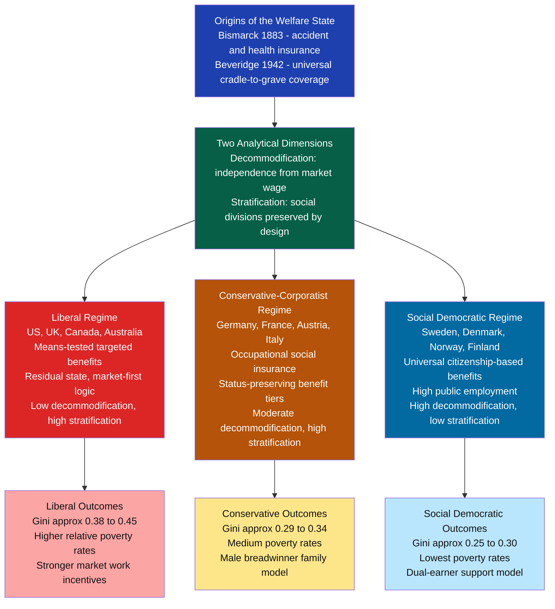

# Welfare States and Social Policy

> [!abstract] TL;DR
> Welfare states are institutional arrangements through which governments protect citizens from market risks — unemployment, sickness, old age, poverty — and provide services like healthcare and education. Esping-Andersen's comparative framework identifies three distinct regime types (liberal, conservative-corporatist, social democratic) that differ in how far they decouple survival from paid employment and how much they preserve social stratification. Understanding which regime produces which outcomes — and why welfare states survive, retrench, or transform — is central to both comparative politics and political economy.

---

## Intuition

**Analogy:** Imagine three different workplaces. In the first, if you fall ill, you lose your job and your income; survival depends entirely on your own savings or charity. In the second, your occupational guild pays sickness benefits tied to your rank and prior wages — coverage is good but only for guild members, and your benefit status still mirrors your workplace hierarchy. In the third, every citizen — employed or not, rich or poor — receives the same guaranteed medical care and income support, financed by everyone and available to everyone. Now multiply that thought experiment across unemployment, retirement, childcare, housing, and education, and you have the three worlds of welfare capitalism.

The central question welfare states answer is: *to what extent can a person maintain a normal standard of living without depending on the market?* That question — called **decommodification** — determines whether work is a genuine choice or a survival compulsion. Different societies have answered it very differently, producing measurably different levels of inequality, poverty, and human flourishing.

---

## How It Works

### Core Mechanics

The welfare state operates through two channels:

1. **Social insurance** — pooling risk across a population so that the burden of misfortune (unemployment, illness, disability) is spread rather than concentrated on the unlucky individual. Financed by contributions and taxes.
2. **Social assistance (redistribution)** — transferring income from higher-income groups to lower-income groups, either universally (child benefit for all parents) or means-tested (benefits only for the poor).

Three design choices determine the character of any welfare state:

- **Coverage**: universal (all citizens) vs. occupational (employed workers) vs. residual (only the poor)
- **Benefit generosity**: replacement rate — what fraction of prior income does a benefit replace?
- **Financing**: general taxation vs. payroll contributions vs. means-tested eligibility

### Flow / Architecture



---

## Key Concepts

### Secondary Level

**What does a welfare state do?** At the most basic level, welfare states protect citizens from four classic social risks: unemployment (loss of earned income), sickness (medical costs and lost wages), old age (inability to work), and family poverty (children, lone parents). The mix and generosity of these protections define a welfare state's character.

**Two philosophical starting points conflict in every welfare debate:**

- *Commodification* is the condition in which a person must sell their labour to survive — their well-being is entirely determined by market outcomes. Karl Polanyi called labour a "fictitious commodity" because, unlike goods, labour cannot be separated from the human being who provides it. A person who cannot find a buyer in the labour market faces not just financial loss but hunger, homelessness, and social exclusion.
- *Decommodification* is the degree to which welfare state institutions allow a person to maintain an acceptable living standard independently of market participation. High decommodification means workers can refuse bad jobs, care for children, recover from illness, or retrain — without being forced back to market immediately by survival pressure.

**Universalism vs targeting.** Should welfare go to everyone or only to the poor? Targeting is efficient in the short run (resources go to those with greatest need) but produces a **Matthew effect**: means-tested programmes create stigma, erode political support among the non-poor majority, and eventually shrink. Universal programmes maintain broad political coalitions and tend to be more generous over time. The paradox: targeting the poor often ends by serving the poor *less well* than universal programmes do.

### Undergraduate Level

**Esping-Andersen's Three Worlds (1990).** Gosta Esping-Andersen's *The Three Worlds of Welfare Capitalism* is the most influential comparative welfare state framework. He argues that welfare states are not points on a single generosity spectrum but distinct *regime types* — coherent institutional packages that interact with labour markets and family structures in characteristic ways.

**Liberal regime (US, UK, Canada, Australia):**
Benefits are largely means-tested (you must prove poverty to receive them), modest in level, and designed to minimise work disincentives. The state's role is *residual*: it intervenes only after markets and families have failed. Political philosophy is market-liberal — income support creates dependency; the preferred remedy for poverty is economic growth and individual effort. The outcome: lower taxes, high market income inequality, and high poverty rates by international standards. The US Earned Income Tax Credit, food stamps, and Medicaid are archetypal liberal welfare instruments.

**Conservative-corporatist regime (Germany, France, Austria, Netherlands):**
Rooted in Bismarckian social insurance and Catholic social teaching (subsidiarity — the family and occupational community should handle welfare before the state). Benefits are tied to employment history and replicate the earnings hierarchy rather than redistributing across it. Occupational pension systems mean a white-collar worker and a manual worker receive different pensions reflecting their different wages. The family is assumed to have a male breadwinner; women's labour market participation is lower. Coverage is good for insiders (stable employees) but poor for outsiders (part-time workers, migrants, informal workers). Result: moderate redistribution but preserved status stratification.

**Social democratic regime (Sweden, Denmark, Norway, Finland):**
Universalist — benefits belong to all citizens as a matter of right, not contributions or means. The strategy was deliberately to build a broad political coalition across the working and middle classes by offering everyone high-quality public services. Benefits are generous enough that the middle class actually uses public healthcare, schools, and childcare rather than exit to private alternatives — which keeps political support high. Very high taxes (50–60% of GDP) finance both cash transfers and extensive public services. Strong active labour market policies (retraining, job placement) complement passive income support. The result: the lowest Gini coefficients and poverty rates in the world, combined with high gender equality and labour market participation.

**Decommodification index.** Esping-Andersen operationalises decommodification by scoring unemployment, sickness, and pension programmes on three criteria: accessibility (how hard is it to qualify?), replacement rate (what fraction of wages does the benefit replace?), and duration (how long can you receive it?). By this index, Scandinavian countries score 35–40, Germany and France 22–28, and the US 13–15.

**Power resources theory (Korpi and Esping-Andersen).** Why do different countries end up with different welfare regime types? Walter Korpi's *power resources theory* argues that the welfare state is a product of class conflict: strong, unified labour movements (especially those with long-term Social Democratic party dominance) built generous welfare states because organised labour had sufficient political power to force redistribution. The Scandinavian welfare state was built by decades of Social Democratic dominance (Sweden's SAP governed continuously 1932–1976). Countries with fragmented labour movements (US, UK) and cross-cutting religious or ethnic cleavages produced weaker, more residual welfare states.

### Graduate Level

**Welfare state retrenchment and blame avoidance (Pierson, 1994).** Paul Pierson's *Dismantling the Welfare State?* asks why Reagan and Thatcher — despite explicit commitments — failed to fundamentally roll back the welfare state. Pierson's answer: mature welfare states create constituencies. Pensioners vote. Healthcare workers are a large organised interest. Families with children depend on tax credits. Any politician who cuts these programmes incurs immediate, concentrated costs on identifiable groups who will punish them electorally. Benefits from cuts accrue diffusely (lower taxes) and with long lags. The political logic forces *blame avoidance*: instead of open cuts, governments pursue obfuscation (small incremental changes), division (setting pensioners against working-age poor), and redirection (cutting new benefits while protecting old ones). The result is *retrenchment without dismantlement* — welfare states shrink at the margins but the core survives.

**Race to the bottom vs. compensation hypothesis in globalisation.** Economic globalisation creates two contradictory pressures:
- *Race to the bottom*: mobile capital can threaten to relocate unless taxes (which finance welfare) are cut. Countries compete by lowering corporate taxes and labour protections, driving welfare states downward.
- *Compensation hypothesis* (Rodrik, 1998): openness exposes citizens to greater economic insecurity. Governments that open their economies must *expand* social protection to compensate workers for insecurity, maintaining the political coalition that supports trade liberalisation. Dani Rodrik shows empirically that the most open small economies (Netherlands, Sweden, Denmark) have the *largest* welfare states — exactly the opposite of the race to the bottom prediction.

The evidence broadly supports the compensation hypothesis for advanced economies, with the caveat that the *composition* of welfare spending shifts: active labour market policies and in-work benefits (compatible with market flexibility) expand, while passive unemployment insurance comes under pressure. For developing countries integrating into global supply chains, the race to the bottom dynamic is more pronounced because they lack the institutional capacity to finance compensation.

**New social risks and the crisis of the industrial welfare state.** Classic welfare states were designed for an industrial economy with stable male breadwinner employment. Three structural changes have undermined this fit:

1. **Care deficit**: women's mass entry into the labour market has created unmet demand for childcare, elder care, and social care services. The conservative welfare state's family-care assumption collapses when both adults work.
2. **Atypical work**: the growth of part-time, temporary, gig, and platform work creates large groups of workers who do not qualify for occupational social insurance (which requires continuous full-time employment). The "outsider-insider" divide fragments the working class politically.
3. **Post-industrial service employment**: service jobs are harder to standardise and organise than industrial jobs, weakening union density and therefore power resources for welfare expansion.

The *social investment* response (Hemerijck, Morel, Palier) reframes welfare not as consumption (compensation for market failures) but as *investment in human capital*: universal early childhood education, active labour market policies, and lifelong learning increase productivity and labour market participation, generating future tax revenues. Countries like Sweden and Denmark have reoriented their welfare states toward this model — investing heavily in early childhood and education while maintaining income transfers.

**The Matthew effect in social policy.** Robert Merton's sociological concept (from Matthew 25:29: "to him who has will more be given") applies to welfare: universal high-quality services disproportionately benefit the already-advantaged because they have greater capacity to access, navigate, and benefit from complex services. Middle-class families use public universities more than working-class families; educated parents extract more value from the same public school. This creates a distributional paradox: universal programmes may be more politically durable but may concentrate benefits among those who need them least unless combined with affirmative access policies.

---

## Python Demo

```python
# Simulate Esping-Andersen welfare regime types using stylized income distributions.
# Shows how different transfer schemes produce different Gini coefficients,
# poverty rates, and decommodification levels.
# Decommodification is proxied by the inverse of labor supply elasticity:
# higher decommodification -> workers can hold out for better wages -> lower elasticity.

import numpy as np
import matplotlib.pyplot as plt

rng = np.random.default_rng(seed=42)

N = 10_000
# Log-normal market income: mean ~$45k, sigma reflects realistic OECD earnings spread
market_income = rng.lognormal(mean=10.7, sigma=0.75, size=N)

# EU/OECD poverty line: 60% of median market income
poverty_line_market = 0.60 * np.median(market_income)

def gini(x: np.ndarray) -> float:
    """Compute Gini coefficient for array of incomes."""
    x = np.sort(x)
    n = len(x)
    cumx = np.cumsum(x)
    return float((2 * np.dot(np.arange(1, n + 1), x) - (n + 1) * cumx[-1]) / (n * cumx[-1]))

def poverty_rate(x: np.ndarray, line: float) -> float:
    return float(np.mean(x < line))

def apply_welfare(incomes: np.ndarray, regime: str) -> np.ndarray:
    """
    Apply regime-specific transfer and tax schedule to market incomes.
    Returns post-transfer disposable incomes.
    """
    transfers = np.zeros_like(incomes)
    taxes     = np.zeros_like(incomes)

    p20 = np.percentile(incomes, 20)
    p50 = np.median(incomes)
    p80 = np.percentile(incomes, 80)

    if regime == "liberal":
        # Means-tested: only bottom 20% receive a benefit
        # Benefit tops income up to the 20th percentile floor
        poor_mask = incomes < p20
        transfers[poor_mask] = (p20 - incomes[poor_mask]) * 0.55  # 55% take-up / coverage rate
        # Flat-rate proportional tax to finance
        taxes = incomes * 0.28

    elif regime == "conservative":
        # Occupational insurance: replaces ~60% of prior wages for formal employees
        # Informal / part-time workers (bottom 15%) receive only a modest floor
        formal_mask = incomes >= np.percentile(incomes, 15)
        informal_mask = ~formal_mask
        # Income-related transfers for formal workers (sickness, pensions)
        transfers[formal_mask] = incomes[formal_mask] * 0.12
        # Minimal floor for informal workers
        transfers[informal_mask] = p20 * 0.45
        # Payroll contribution + moderately progressive income tax
        taxes = np.where(incomes < p50, incomes * 0.35, incomes * 0.42)

    elif regime == "social_democratic":
        # Universal flat benefit (citizenship right) + earnings-related supplement
        flat_benefit = p50 * 0.35            # generous universal floor
        earnings_top_up = incomes * 0.06     # small earnings-related component
        transfers = flat_benefit + earnings_top_up
        # Highly progressive taxes to finance universalism
        taxes = np.where(
            incomes < p50, incomes * 0.40,
            np.where(incomes < p80, incomes * 0.48, incomes * 0.55)
        )

    return np.maximum(incomes + transfers - taxes, 0.0)

# Decommodification proxy: how far can a person deviate from market wage?
# Operationalised as fraction of median income a non-working person can maintain.
decommodification_scores = {
    "liberal":           0.22,   # Esping-Andersen index: US ~13, UK ~23 -> normalised
    "conservative":      0.52,   # Germany ~27, France ~28 -> normalised
    "social_democratic": 0.82,   # Sweden ~39, Denmark ~38 -> normalised
}

regimes = ["liberal", "conservative", "social_democratic"]
labels  = ["Liberal\n(US / UK)", "Conservative\n(Germany / France)", "Social Democratic\n(Nordics)"]
colors  = ["#dc2626", "#b45309", "#0369a1"]

results = {}
for r in regimes:
    post = apply_welfare(market_income, r)
    poverty_line_post = 0.60 * np.median(post)   # poverty line moves with median
    results[r] = {
        "gini_market":   gini(market_income),
        "gini_post":     gini(post),
        "pov_market":    poverty_rate(market_income, poverty_line_market),
        "pov_post":      poverty_rate(post, poverty_line_post),
        "decom":         decommodification_scores[r],
        "redistribution": gini(market_income) - gini(post),
    }

# Summary table
header = f"{'Regime':<26} {'Mkt Gini':>8} {'Post Gini':>9} {'Mkt Pov':>8} {'Post Pov':>9} {'Decom':>7} {'Redist':>8}"
print(header)
print("-" * len(header))
for r, lbl in zip(regimes, labels):
    d = results[r]
    row_label = lbl.replace("\n", " / ")
    print(
        f"{row_label:<26} {d['gini_market']:>8.3f} {d['gini_post']:>9.3f} "
        f"{d['pov_market']:>7.1%} {d['pov_post']:>8.1%} "
        f"{d['decom']:>7.2f} {d['redistribution']:>8.3f}"
    )

# Visualization: three panels
fig, axes = plt.subplots(1, 3, figsize=(16, 5))

# Panel 1: Gini before and after transfers
ax1 = axes[0]
x = np.arange(len(regimes))
w = 0.35
ax1.bar(x - w / 2, [results[r]["gini_market"] for r in regimes], w,
        label="Market Gini", color="#94a3b8", zorder=3)
ax1.bar(x + w / 2, [results[r]["gini_post"]   for r in regimes], w,
        label="Post-transfer Gini", color=colors, zorder=3)
for i, r in enumerate(regimes):
    reduction = results[r]["redistribution"]
    ax1.annotate(f"-{reduction:.3f}", xy=(i + w / 2, results[r]["gini_post"] + 0.005),
                 ha="center", fontsize=8, color=colors[i], fontweight="bold")
ax1.set_xticks(x)
ax1.set_xticklabels(labels, fontsize=9)
ax1.set_ylabel("Gini Coefficient")
ax1.set_title("Inequality: Before and After Transfers")
ax1.set_ylim(0, 0.75)
ax1.legend(fontsize=8)
ax1.grid(axis="y", alpha=0.3)

# Panel 2: Poverty rates
ax2 = axes[1]
ax2.bar(x - w / 2, [results[r]["pov_market"] for r in regimes], w,
        label="Market Poverty Rate", color="#94a3b8", zorder=3)
ax2.bar(x + w / 2, [results[r]["pov_post"]   for r in regimes], w,
        label="Post-transfer Poverty Rate", color=colors, zorder=3)
ax2.set_xticks(x)
ax2.set_xticklabels(labels, fontsize=9)
ax2.set_ylabel("Poverty Rate")
ax2.set_title("Poverty Reduction by Regime Type")
ax2.yaxis.set_major_formatter(plt.FuncFormatter(lambda v, _: f"{v:.0%}"))
ax2.legend(fontsize=8)
ax2.grid(axis="y", alpha=0.3)

# Panel 3: Decommodification vs. Gini post-transfer
ax3 = axes[2]
for i, r in enumerate(regimes):
    d = results[r]
    ax3.scatter(d["decom"], d["gini_post"], s=200, color=colors[i], zorder=5)
    ax3.annotate(labels[i].replace("\n", "\n"), xy=(d["decom"], d["gini_post"]),
                 xytext=(d["decom"] - 0.04, d["gini_post"] + 0.012),
                 fontsize=8, color=colors[i], fontweight="bold", ha="center")
ax3.set_xlabel("Decommodification Index (0 = market-dependent, 1 = fully decommodified)")
ax3.set_ylabel("Post-transfer Gini")
ax3.set_title("Decommodification vs. Inequality\n(higher decom -> lower Gini)")
ax3.set_xlim(0, 1)
ax3.grid(alpha=0.3)

fig.suptitle(
    "Esping-Andersen Three Worlds: Redistribution, Poverty, and Decommodification",
    fontsize=13, fontweight="bold", y=1.03
)
plt.tight_layout()
plt.savefig("welfare_regime_simulation.png", dpi=150, bbox_inches="tight")
plt.show()
print("\nFigure saved to welfare_regime_simulation.png")
```

**Reading the output.** All three regimes start from the same market income distribution. The social democratic regime reduces the Gini by the most and drives post-transfer poverty to the lowest level — but requires the highest taxes. The liberal regime's targeted transfers reduce poverty least, reflecting both lower generosity and lower take-up. The decommodification plot shows an inverse relationship: higher decommodification correlates with lower post-transfer inequality. In real OECD data, Sweden's market Gini (~0.43) is not much lower than the US (~0.51); the difference in disposable income inequality (Sweden ~0.27, US ~0.39) is almost entirely attributable to the welfare state, not pre-tax market outcomes.

---

## Real-World Applications

**1. Bismarck's social insurance (Germany, 1883–1889).** Otto von Bismarck introduced accident, sickness, and old-age insurance not out of socialist sympathy but as a calculated strategy to defuse working-class radicalism. By providing state-organised material security, he intended to bind workers to the state rather than the socialist movement. The Bismarckian design — occupational insurance tied to employment, financed by employer-employee contributions, administered through sector-based funds — established the conservative-corporatist template that Germany, France, Austria, and their neighbours still follow. Its core feature: benefits reproduce the labour market hierarchy rather than equalise it.

**2. Beveridge Report and the British welfare state (1942).** William Beveridge's *Social Insurance and Allied Services* proposed a comprehensive system to slay the "five giants": Want, Disease, Ignorance, Squalor, and Idleness. His design was universal (all citizens covered), flat-rate (same benefit regardless of prior earnings), and comprehensive (a single scheme covering all social risks). Implemented by the Attlee government (1945–1951), it created the NHS, extended National Insurance, and built the social housing stock. The Beveridge model was the template for the UK, Canada, Australia, and New Zealand — but its universalism stopped short of the Nordic level because benefit generosity was kept low to preserve work incentives.

**3. The Swedish welfare state and power resources (1930s–1970s).** Sweden is the social democratic archetype. The Social Democrats (SAP) governed continuously from 1932 to 1976, building a welfare state through a political strategy of class coalition: by providing universal high-quality services, they kept the middle class inside the public system rather than exiting to private alternatives. This *universalism as coalition strategy* is the key political economy insight. The Rehn-Meidner model (1950s) combined generous unemployment insurance with active labour market policy: workers accepted wage restraint and labour mobility because the state guaranteed retraining, relocation support, and income replacement — a bargain that sustained both full employment and wage equality. The result was the lowest Gini coefficients in the OECD (0.25–0.28) sustained over decades.

**4. Reagan-Thatcher retrenchment and Pierson's blame avoidance (1980s).** Reagan's explicit goal was to roll back the New Deal welfare state; Thatcher aimed to dismantle British collectivism. Both significantly cut marginal tax rates, reduced some programmes, and shifted ideology. Yet Social Security was not privatised, the NHS was not abolished, and overall welfare spending as a share of GDP did not fall. Pierson's analysis explains why: constituencies organised around existing entitlements (pensioners, healthcare workers, benefit recipients) mobilised against cuts, and politicians discovered that benefit cuts are politically devastating. The visible strategy of retrenchment was abandoned in favour of incremental erosion — freezing benefit levels, tightening eligibility, shifting costs to users — changes visible only in aggregate, over decades.

**5. Nordic model sustainability in the 21st century.** Critics have long predicted the Nordic model's collapse under globalisation pressure. The evidence so far is mixed. Denmark introduced *flexicurity* in the 1990s — highly flexible hiring and firing rules (liberal) combined with generous unemployment insurance (social democratic) and active retraining (social investment). This adaptation maintained low unemployment while preserving income security. Sweden survived a major banking crisis in the early 1990s by cutting some benefits but maintaining universalism. The main pressure is demographic: ageing populations increase pension and healthcare costs, while the immigration of low-wage workers creates insider-outsider tensions that fragment the homogeneous solidarity on which high-trust universalism depends.

---

## Common Pitfalls

- **Conflating generosity with progressivity.** A highly generous universal benefit may be less redistributive than a modest means-tested one — it depends on how the programme is financed. If universal childcare is funded by a regressive payroll tax, it transfers income horizontally (between families at the same income level, depending on whether they have children) rather than vertically (from rich to poor). The distributional impact of any welfare programme requires analysis of both the benefit side and the tax side simultaneously.

- **Assuming means-testing is more efficient than universalism.** The targeting paradox shows the opposite is often true over time: means-tested programmes lose political support among middle-class voters who receive nothing, leading to underfunding, stigma, and low take-up. Universal programmes maintain broad coalitions and tend to deliver higher total welfare to the poor over the long run — because they are better funded, better administered, and carry no stigma. The UK's universal child benefit vs. the US's means-tested TANF (Temporary Assistance for Needy Families) illustrates this: TANF reaches only about 20% of poor families with children.

- **Treating Esping-Andersen's three worlds as a rigid taxonomy.** The framework is an ideal-typical construct. Most real welfare states are hybrids: the UK has universal healthcare (social democratic) but means-tested income support (liberal). Japan's welfare state has features of all three regimes. Southern European countries (Italy, Spain, Greece) are sometimes called a *fourth regime*: family-centred, fragmented by insider protection, with very limited coverage for outsiders. The value of the framework is analytical leverage, not perfect classification.

- **The poverty trap misdiagnosis.** Critics of welfare often point to poverty traps — situations where a benefit recipient faces near-100% marginal effective tax rates as benefits are withdrawn when they earn more, destroying work incentives. This is a real design flaw in poorly constructed means-tested programmes. But the solution is not to abolish benefits; it is to taper them smoothly (as the Earned Income Tax Credit does) or to make them universal (so they are not withdrawn when work begins). The poverty trap is an argument for *better-designed* welfare, not no welfare.

- **Ignoring care work in welfare state comparisons.** GDP and labour market statistics miss the welfare produced by unpaid family care (childrearing, elder care). Conservative-corporatist regimes that rely on families (predominantly women) to provide care look fiscally lean but are actually externalising the cost onto caregivers — typically women who sacrifice earnings and pension contributions. Feminist welfare state scholars (Lewis, Orloff) argue that Esping-Andersen's decommodification concept needs a parallel *defamilialisation* concept: the extent to which welfare states free individuals from dependence on the family unit.

---

## Related Concepts

- [[_MOC_Public_Policy_and_Political_Economy|↑ Public Policy and Political Economy MOC]] — the section map linking all six notes in this cluster; return here to navigate between welfare, regulation, fiscal policy, and development.
- [[Liberalism_and_Its_Variants]] — the philosophical division between negative liberty (market outcomes as freedom, liberal regime) and positive liberty (enabling conditions, social democratic regime) maps directly onto welfare regime differences; Rawls' difference principle is the normative foundation for the social investment state.
- [[Social_Contract_Theory]] — Rawls' veil of ignorance is the normative argument for generous universal welfare; the social contract frames welfare entitlements as what rational agents would choose before knowing their position in society.
- [[Conservatism_and_Traditionalism]] — the conservative-corporatist welfare regime draws explicitly on subsidiarity doctrine (Catholic social teaching) and the Burkean attachment to organic institutions; corporate and family welfare provision over state universalism.
- [[Automatic_Stabilizers]] — welfare state transfers (unemployment insurance, means-tested benefits) function as automatic fiscal stabilizers, compressing recession-induced drops in consumption; Nordic welfare states have larger automatic stabilizer offsets than liberal ones.
- [[Tax_Policy]] — welfare state financing requires understanding optimal taxation; progressive income taxes and payroll contributions are the main instruments; the trade-off between redistribution and labour supply distortion is the core debate.
- [[Government_Spending_Multiplier]] — welfare spending during recessions activates the Keynesian multiplier; generous unemployment replacement rates sustain consumption and reduce fiscal multipliers needed from discretionary stimulus.
- [[Market_Failures]] — the welfare state's normative justification rests on correcting market failures in insurance (adverse selection prevents private unemployment or long-term care insurance), public goods (basic research, public health), and distributional equity.
- [[Public_Goods]] — healthcare with strong public-good properties (vaccinations, epidemic control) and universal education are canonical cases where market provision under-supplies relative to the social optimum; welfare states address these failures directly.
- [[Maslows_Hierarchy]] — Maslow's physiological and safety needs (food, shelter, health, security) map onto the core welfare state mission; deficiency in these needs impairs the cognitive capacity needed for labour market participation and democratic citizenship — the psychological case for basic income security.
- [[Human_Capital_and_Education]] — the social investment turn reframes welfare as human capital investment; early childhood education, vocational training, and active labour market policies are welfare spending that raises future productivity rather than merely compensating for past misfortune.
- [[Development_Economics]] — the Washington Consensus dismantled welfare states in developing nations as a condition of IMF loans; subsequent research shows that states with stronger social protection weather external shocks better and sustain more equitable growth.
- [[State_Formation_and_Political_Development]] — welfare states are a specific phase of state development; the historical conditions that produced Bismarckian insurance (late industrialisation, threat of socialism) and Beveridgean universalism (wartime solidarity, post-war reconstruction) shape the path-dependent institutional legacies countries inherit.
- [[Political_Institutions_and_Constitutions]] — federalism significantly constrains welfare state development (US Medicaid as a federal-state patchwork vs. Canadian Medicare); proportional electoral systems produce broader coalitions supportive of universalism; veto players slow welfare expansion and retrenchment alike.

---

## Review Questions

### Secondary

1. A friend argues that welfare benefits make people lazy and discourage work. What economic concept — the poverty trap — might give their argument partial validity, and what design change would address the problem without eliminating income support altogether?
2. In your own words, what is decommodification, and why does a worker with high decommodification have more bargaining power over their employer than one with low decommodification?
3. Bismarck introduced social insurance in 1883 to prevent socialism. What does this tell us about the relationship between political self-interest and welfare state origins?

### Undergraduate

1. Esping-Andersen argues that the US and Sweden have similar *market income* Gini coefficients but vastly different *disposable income* Gini coefficients. What does this reveal about the welfare state's redistributive role relative to pre-tax market forces? What does it imply for the debate about whether inequality is primarily a market failure or a policy failure?
2. The targeting paradox suggests that programmes designed exclusively for the poor end up serving the poor poorly. Using the US TANF and UK child benefit as contrasting cases, explain the political economy mechanism that produces this paradox, and evaluate what universalism gains and loses relative to means-testing.
3. Paul Pierson argues that welfare state retrenchment is politically much harder than welfare state expansion. Apply blame avoidance theory to a concrete contemporary case — say, pension reform in France or the attempted repeal of the Affordable Care Act in the US — and assess how well Pierson's theory explains the outcome.

### Graduate

1. Walter Korpi's power resources theory predicts that strong, unified labour movements produce generous welfare states. But the US has historically low union density *and* significant welfare programmes (Social Security, Medicare, Medicaid), while some countries with strong unions (Australia) have liberal-regime welfare states. How would you modify or qualify power resources theory to account for these anomalies? What additional variables — electoral systems, religious cleavages, racial heterogeneity — does the literature propose?
2. Dani Rodrik's compensation hypothesis and the race-to-the-bottom thesis make opposite predictions about globalisation's effect on welfare state size. Design an empirical test that would distinguish between these two hypotheses. What data would you need, what identification strategy would address endogeneity, and what confounders would be hardest to eliminate?
3. The social investment paradigm reframes welfare as productive investment in human capital rather than passive consumption compensation. Evaluate this reframing critically: does it represent a genuine intellectual advance in welfare state theory, a politically convenient way to justify retrenchment of passive transfers, or both? Use the evidence from Denmark's flexicurity, the Head Start programme, and the Nordic early childhood education literature to ground your argument.

---

## Sources

- [Gosta Esping-Andersen, *The Three Worlds of Welfare Capitalism* (1990)](https://press.princeton.edu/books/paperback/9780691028576/the-three-worlds-of-welfare-capitalism)
- [Paul Pierson, *Dismantling the Welfare State? Reagan, Thatcher and the Politics of Retrenchment* (1994)](https://www.cambridge.org/core/books/dismantling-the-welfare-state/4C0B8C6B2F2BCEF9F5D36F0B6C5CFBA3)
- [Walter Korpi, "Power Resources Approach vs. Action and Conflict," *Sociological Theory*, 1985](https://www.jstor.org/stable/202143)
- [Dani Rodrik, "Why Do More Open Economies Have Bigger Governments?" *Journal of Political Economy*, 1998](https://www.journals.uchicago.edu/doi/10.1086/250038)
- [Karl Polanyi, *The Great Transformation: The Political and Economic Origins of Our Time* (1944)](https://www.beacon.org/The-Great-Transformation-P33.aspx)
- [Anton Hemerijck, *Changing Welfare States* (2013), Oxford University Press](https://global.oup.com/academic/product/changing-welfare-states-9780199599059)
- [Lane Kenworthy, "Do Social-Welfare Policies Reduce Poverty?" *Social Forces*, 1999](https://academic.oup.com/sf/article-abstract/77/3/1119/2231490)
- [Nathalie Morel, Bruno Palier, Joakim Palme, eds., *Towards a Social Investment Welfare State?* (2012), Policy Press](https://bristoluniversitypress.co.uk/towards-a-social-investment-welfare-state)
- [Robert Merton, "The Matthew Effect in Science," *Science*, 1968](https://www.science.org/doi/10.1126/science.159.3810.56)

---

#PoliticalScience #PublicPolicy #WelfareState #SocialPolicy #ComparativePolitics
