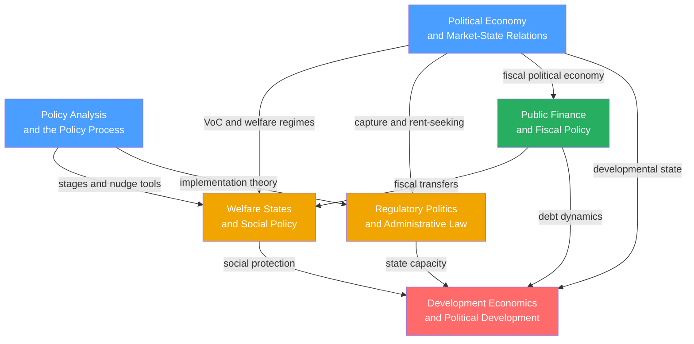

# Public Policy and Political Economy — Map of Content

> [!info] How to use this map
> Start with **Policy Analysis** and **Political Economy** as your twin foundations, then follow the arrows through Public Finance, Regulatory Politics, and Welfare States before reaching Development Economics as the advanced synthesis. Use the Learning Path for a first-pass reading order. Return to this map whenever a note feels isolated — every note in the section connects back to the central question: how do governments decide what to do, how do they fund it, and what difference does it make?

---

Public Policy and Political Economy sit at the practical core of political science: they study what governments actually do with their authority — the fiscal, regulatory, and social choices that redistribute income, correct market failures, build welfare states, and attempt to guide development. Where Political Theory asks what governments *should* do and Comparative Politics describes *how* different governments are structured, this section asks how policy decisions get made (through agenda-setting, windows of opportunity, and implementation gaps), why governments choose the specific instruments they choose (through varieties of capitalism, rent-seeking dynamics, and class conflict), how they finance those choices (through taxation, borrowing, and fiscal rules), how they regulate without being captured by those they regulate, how they balance market efficiency against social protection across liberal, conservative, and social-democratic welfare regimes, and why some nations develop while others remain trapped in extractive institutions. The six notes span from analytic frameworks to applied policy domains to the grand challenge of political development — together forming the intellectual toolkit for anyone who designs, evaluates, or studies public intervention.

---

## Concept Map

*(Blue = foundational, Green = intermediate fiscal toolkit, Orange = applied policy domains, Red = advanced synthesis. Arrows indicate "leads to" or "requires".)*

---

## Learning Path

*Recommended order for a first pass through Public Policy and Political Economy:*

1. [[Policy_Analysis_and_the_Policy_Process]] — Start here: the foundational vocabulary of what public policy is, how it gets made (Kingdon's multiple streams, punctuated equilibrium, the garbage-can model), why it so often fails at implementation (Pressman and Wildavsky), and how to evaluate it rigorously (RCTs, DiD, RDD); without these frameworks the other notes lack analytic scaffolding.

2. [[Political_Economy_and_Market_State_Relations]] — The theoretical backbone: markets are always politically constructed; varieties of capitalism (LME vs. CME vs. developmental state), regulatory capitalism, Olson's distributional coalitions, and the long-run dynamics of inequality (Piketty's r > g, Streeck on buying time) explain why countries with similar incomes end up with radically different policy regimes.

3. [[Public_Finance_and_Fiscal_Policy]] — Musgrave's three functions (allocation, distribution, stabilisation) and the fiscal instruments governments use: optimal taxation (Ramsey, Mirrlees), political budget cycles (Nordhaus), debt dynamics and the debt-sustainability equation, and the austerity-versus-stimulus debate (Alesina vs. Blanchard-Leigh); the fiscal mechanics underlying every other note.

4. [[Regulatory_Politics_and_Administrative_Law]] — The principal-agent problem at the heart of regulation: Stigler's capture theory, Weber's rational-legal bureaucracy, the McNollgast fire-alarm model, Chevron deference and its demise in Loper Bright, and the behavioral turn in regulatory design (nudge units, EU Digital Markets Act); connects implementation theory from Note 1 to political economy from Note 2.

5. [[Welfare_States_and_Social_Policy]] — Esping-Andersen's three worlds (liberal, conservative-corporatist, social democratic), decommodification, power resources theory (Korpi), Pierson's blame avoidance and why mature welfare states survive retrenchment attempts; the social investment response to new social risks; requires Notes 2 and 3 for full political economy context.

6. [[Development_Economics_and_Political_Development]] — The synthesis and most advanced note: modernisation theory, dependency theory, Acemoglu-Robinson's institutions framework (extractive vs. inclusive), Sen's capability approach, the aid effectiveness debate (Sachs vs. Easterly vs. Banerjee and Duflo), the middle-income trap, and Rodrik's trilemma; integrates concepts from every preceding note and applies them to the question of why nations diverge.

---

## All Notes in This Section

| Note | Core Idea | Difficulty |
|------|-----------|------------|
| [[Policy_Analysis_and_the_Policy_Process]] | Policy-making is not a linear cycle but a garbage-can process of independent streams, brief windows, and policy entrepreneurs; implementation gaps and rigorous causal evaluation determine whether good intentions produce real outcomes | Beginner–Graduate |
| [[Political_Economy_and_Market_State_Relations]] | Markets are always politically constructed; the institutional form of that construction — Liberal Market Economy, Coordinated Market Economy, or developmental state — determines distribution, innovation patterns, and long-run inequality trajectories | Beginner–Graduate |
| [[Public_Finance_and_Fiscal_Policy]] | Musgrave's three functions of government finance (allocation, distribution, stabilisation) define the analytical framework for all fiscal debates, from optimal taxation to debt sustainability to the fiscal multiplier and the politics of borrowing | Intermediate–Graduate |
| [[Regulatory_Politics_and_Administrative_Law]] | Regulation corrects market failures but creates a principal-agent problem in which agencies surrounded by the industries they oversee systematically tilt toward those interests; administrative law, institutional insulation, and nudge units are the institutional responses | Intermediate–Graduate |
| [[Welfare_States_and_Social_Policy]] | Welfare states are not points on a generosity spectrum but distinct regime types — liberal, conservative-corporatist, and social democratic — that interact with labour markets and families to produce fundamentally different levels of decommodification, poverty, and inequality | Intermediate–Graduate |
| [[Development_Economics_and_Political_Development]] | Development requires inclusive political institutions that generate inclusive economic institutions; development is freedom in Sen's sense, not just GDP; modernisation, dependency, institutional, and RCT frameworks are complementary partial answers to why nations diverge so dramatically | Advanced |

---

## Key Questions This Section Answers

- How does a social problem actually become a law or regulation — and at which stage is failure most likely?
- Why do countries with similar levels of economic development end up with radically different tax burdens, welfare systems, and degrees of market regulation?
- What is the fiscal arithmetic of debt sustainability, and when does deficit spending become a debt spiral rather than a stabiliser?
- Why do regulatory agencies created to protect the public so reliably end up protecting the industry they regulate, and what institutional designs reduce that risk?
- What determines whether a welfare state is generous or residual, and why do even conservative governments find it politically impossible to dismantle mature welfare entitlements?
- Why have East Asian developmental states outperformed Latin American countries that followed IMF prescriptions — and what does this tell us about the role of institutions versus policy packages in development?
- What makes some nations escape poverty traps while others remain locked in extractive institutions across generations?

---

## Connections to Other Political Science Sections

- [[_MOC_Political_Theory_and_Ideologies|S01 Political Theory and Ideologies MOC]] — Liberalism, conservatism, and socialism are the ideological frameworks that determine how different societies weight efficiency versus equity in welfare debates; Rawls' difference principle is the normative foundation of the social investment state; Locke's property rights underpin Acemoglu-Robinson's institutional theory of development; the neoliberal variant of liberalism underpins the Washington Consensus and deregulatory politics of the 1980s.
- [[_MOC_Comparative_Politics|S02 Comparative Politics MOC]] — Constitutional design, federalism, and veto players determine how many clearance points a policy must survive before enactment; state formation and bureaucratic capacity (Weber's rational-legal type) explain why some states can run developmental industrial policy while others cannot; comparative institutional analysis links political economy theory to observed country outcomes.
- [[_MOC_International_Relations|S03 International Relations MOC]] — The Bretton Woods institutions are both diffusion vectors spreading policy models and coercive transfer mechanisms imposing Washington Consensus conditionality; Ruggie's embedded liberalism describes how the postwar international order was designed to protect domestic welfare states from external volatility; Rodrik's trilemma structures the trade-off between deep globalisation and domestic policy autonomy.
- [[Voting_Behavior_and_Electoral_Psychology|S05 Political Behavior]] — Electoral cycles drive political budget cycles (Nordhaus); the welfare state's political durability depends on how constituencies mobilise around entitlements; blame avoidance theory links electoral incentives directly to welfare retrenchment strategies; public opinion and media framing shape Kingdon's politics stream.
- [[Globalization_and_Its_Discontents|S06 Contemporary Global Issues]] — Hyperglobalisation and the race-to-the-bottom are the contemporary stress tests of welfare state sustainability; the Washington Consensus failure and post-Washington Consensus are case studies in global economic governance politics; climate policy is the application of Pigouvian taxation and multilateral coordination to the largest negative externality in history.

---

## Cross-Vault Connections

- [[_MOC_Macroeconomics_Master|Macroeconomics Vault]] — The fiscal multiplier debate, debt dynamics, automatic stabilisers, Ricardian equivalence, and the Solow growth model underpinning development economics are the macroeconomic counterparts to every major debate in this section; the Macroeconomics vault provides the formal models while this section provides the political economy of why those models are or are not adopted by actual governments.
- [[_MOC_Microeconomics_Master|Microeconomics Vault]] — Public goods, externalities, asymmetric information, and market power are the four canonical market failures that provide the welfare-economics justification for every major policy instrument covered here; optimal taxation (Ramsey, Mirrlees), Pigouvian taxes, and cost-benefit analysis are microeconomic tools applied throughout; the Microeconomics vault provides the formal derivations this section assumes.
- [[_MOC_Econometrics_Master|Econometrics Vault]] — Rigorous policy evaluation rests on causal identification: difference-in-differences (Card and Krueger on minimum wages), regression discontinuity design (Medicare eligibility thresholds), and randomised controlled trials (J-PAL development interventions) are the methods underlying the evidence-based policy movement; the Econometrics vault covers the technical foundations of every evaluation method referenced in Policy Analysis and Development Economics.

---

[[_MOC_Political_Science_Master|↑ Political Science MOC]]

#MOC #PoliticalScience #PublicPolicy #PoliticalEconomy #SectionMOC
