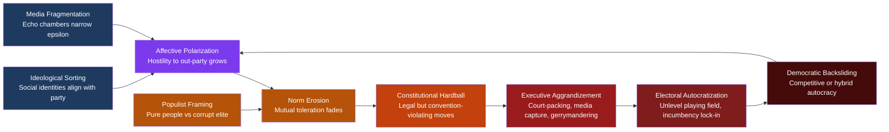

# Democratic Backsliding and Polarization

> [!abstract] TL;DR
> Democratic backsliding is the incremental erosion of democratic norms and institutions — rarely by coup, mostly by elected leaders using legal tools to entrench power — and affective polarization is both its primary driver and its most durable product: when citizens hate the other party more than they love democracy, they tolerate their own side breaking the rules.

---

## Intuition

**Analogy:** Imagine a professional sports league with two rival teams whose fans have come to loathe each other so intensely that they no longer care whether the referees are impartial — as long as *their* team wins. The home team gradually gains control of the officiating body, writes scheduling rules that favor their travel schedule, and adjusts the stadium to disadvantage visitors. No single change is the decisive moment — each looks like a minor administrative decision — but after ten seasons, one team has not lost a home game in four years, and "away" teams no longer believe the competition is real.

Democratic backsliding works exactly this way. No single law ends democracy. A ruling party that controls appointments to the constitutional court, then the electoral commission, then the broadcast regulator has not cancelled elections — it has made them hard to lose. And the process is enabled at every step by partisans who prefer winning under degraded rules to losing under fair ones. Polarization provides the permission structure; institutional erosion provides the mechanism.

---

## How It Works



---

## Key Concepts

### Secondary Level

**What is democratic backsliding?**
Democratic backsliding is the process by which a government that came to power through legitimate elections gradually dismantles the institutions, norms, and procedures that make democratic competition meaningful and fair. Unlike a coup — which is sudden and unambiguous — backsliding is slow, legal, and deniable. Each step is defensible on its own terms. The result is a regime that still holds elections but has made them very difficult to lose.

**What is polarization?**
Polarization means political divisions are deepening. Two distinct phenomena often travel together but are not the same:

| Type | What increases | Mechanism |
|------|---------------|-----------|
| **Ideological polarization** | Distance between parties on policy positions | Elite sorting; primary elections; activist capture |
| **Affective polarization** | Emotional hostility toward the opposing party | Identity fusion; media; negative partisanship |

Affective polarization (Shanto Iyengar and colleagues, Stanford) is the more dangerous for democracy. It means people dislike, distrust, and even dehumanize out-party members — not because they disagree on policy, but because the other side has become a threat to their identity and status. This hostility persists even when ideological differences are modest.

**Bermeo's Six Types of Democratic Backsliding**

Nancy Bermeo (2016) distinguishes how democracies lose ground:

| Type | Description | Historical frequency |
|------|-------------|---------------------|
| **Open-ended power seizure** (coup) | Military or elite seizes power with no democratic intent | Common pre-1990 |
| **Executive coup** | Elected executive dissolves legislature or courts | Declining |
| **Promissory coup** | Military intervenes, promises to restore democracy | Declining |
| **Executive aggrandizement** | Elected executive incrementally expands power through legal means | Dominant post-1990 |
| **Strategic election manipulation** | Systematic rigging of electoral process | Rising |
| **Strategic harassment** | Intimidating opponents, press, civil society without formal restriction | Rising |

The shift from coup-based backsliding to executive aggrandizement is the defining feature of 21st-century democratic erosion. Backsliders today are elected, not imposed.

**The Two Democratic Guardrails: Levitsky and Ziblatt**

Steven Levitsky and Daniel Ziblatt (*How Democracies Die*, 2018) identify two informal norms that make constitutional democracy self-enforcing:

1. **Mutual toleration** — treating political opponents as legitimate rivals rather than existential enemies. When a party believes the other side is criminal, treasonous, or an existential threat, it loses the motivation to constrain itself by the rules.

2. **Institutional forbearance** — voluntarily refraining from actions that are legally permitted but would damage democratic norms. Presidents who could pack the court, eliminate the filibuster, or call unlimited special sessions typically do not — because doing so would invite retaliation and destroy the unwritten constitution.

When affective polarization destroys mutual toleration, the incentive for forbearance collapses. Once both guardrails fail, constitutional hardball becomes rational strategy.

---

### Undergraduate Level

**Affective Polarization: The Social Identity Mechanism**

Lilliana Mason (*Uncivil Agreement*, 2018) demonstrates that the American political divide has become primarily a *social identity* conflict rather than a policy conflict. Through partisan sorting, Americans' party identity has become fused with their racial, religious, and cultural identities. The result is that even when two voters agree on the issues, they experience each other as members of hostile tribes. Party labels now carry the full weight of social identity: winning an election feels like a victory for your group; losing feels like humiliation.

This activates the cognitive mechanisms of in-group/out-group psychology (Tajfel's Social Identity Theory): in-group favoritism, out-group derogation, and the zero-sum framing of competition. The political stakes are emotionally experienced as tribal survival, not policy disagreement.

**Negative Partisanship**

Alan Abramowitz documents that the rise of negative partisanship — voters motivated more by antipathy to the opposing party than by enthusiasm for their own — is now the primary driver of turnout and vote choice in the United States. Voters who dislike their own candidate but hate the opponent even more vote reliably. This means parties have little incentive to build positive coalitions or moderate their message; they only need to make the other side seem sufficiently dangerous.

**Asymmetric Polarization**

Thomas Mann and Norman Ornstein (*It's Even Worse Than It Looks*, 2012) argue that American polarization is not symmetric. The Republican Party moved significantly further from the center than the Democratic Party, becoming what they call "a parliamentary party in a separation-of-powers system" — demanding near-unanimous loyalty from members, refusing compromise as a matter of ideology, and treating obstruction as a governing strategy. Asymmetric polarization matters because it means "both sides do it" narratives are empirically misleading, and the mechanisms driving polarization differ between parties.

**Constitutional Hardball**

Mark Tushnet's concept of "constitutional hardball" describes moves that are technically legal but violate the unwritten conventions that make constitutional government work. Examples:
- Refusing to hold confirmation hearings for a Supreme Court nominee (US Senate, 2016)
- Threatening to pack the court if the current court rules against legislation
- Using legislative procedures (filibuster reform, spending riders) in unprecedented ways purely to extract concessions
- Extreme partisan gerrymandering to lock in electoral advantages

These are not coups. But each one depletes the stock of democratic norms — the informal agreements that let the written rules function. And in a polarized environment, each hardball move is celebrated by partisans and perceived as legitimate retaliation by the other side, accelerating the spiral.

**Populism and Democratic Tension**

Cas Mudde defines populism as a "thin ideology" built on a single core distinction: the virtuous, homogeneous "people" versus the corrupt, parasitic "elite." Populism is *plebiscitary*: it claims to represent the people directly, bypassing intermediary institutions (courts, regulatory agencies, international agreements) as illegitimate obstacles to the popular will.

The tension with liberal democracy is structural. Liberal democracy constrains majority will through minority rights, rule of law, and separation of powers. Populists treat these constraints as elite capture rather than constitutional principle. This creates a legitimation crisis: populist leaders can claim democratic mandates while dismantling democratic institutions.

**V-Dem: Measuring Democratic Quality**

The Varieties of Democracy (V-Dem) project operationalizes democratic quality along five dimensions:

| Index | What it measures |
|-------|----------------|
| **Electoral** | Free and fair elections, universal suffrage, elected executive |
| **Liberal** | Individual rights, rule of law, judicial independence, legislative oversight |
| **Participatory** | Civil society organizations, direct democracy, local self-government |
| **Deliberative** | Reasoned justification of decisions, engagement with counter-arguments |
| **Egalitarian** | Equal distribution of political resources and protection across groups |

Backsliding typically strikes the liberal index first — judicial independence erodes before elections become openly fraudulent. V-Dem's electoral democracy index shows that the share of the world's population living under electoral autocracy (countries with elections but significant restrictions) surpassed those living under liberal democracy around 2019 for the first time since the 1990s.

---

### Graduate Level

**The Mechanics of Electoral Autocratization**

Anna Grzymala-Busse, Lucan Way, and the V-Dem research group document how electoral autocratization follows a recurring pattern:

1. A party wins a landmark electoral victory, often on a populist or reform platform.
2. It uses its legislative majority to change the rules of the game — constitutional tribunal first (neutralize judicial review), then electoral commission (control election management), then broadcast regulator (reduce media pluralism).
3. Subsequent elections take place under conditions that systematically advantage the incumbent: opposition access to media is curtailed, campaign finance rules favor incumbents, electoral districts are redrawn, civic observers face harassment.
4. The incumbent wins elections that are formally held but substantively unfair. International monitors note "uneven playing field" while falling short of calling the election fraudulent.

The regime reaches a stable equilibrium: too autocratic to be classified as democratic, but maintaining enough electoral legitimacy to avoid the international costs of open authoritarian rule.

**Hungary as a Completed Case**

Viktor Orbán's Fidesz won a two-thirds supermajority in 2010. The sequence:
- New constitution written and ratified within 18 months, lowering the threshold for constitutional change
- Constitutional Court jurisdiction over fiscal matters removed
- Retirement age for judges lowered to remove independent jurists; loyalists appointed
- Electoral law redrawn: new district boundaries, changed rules favoring first-place finishers, shorter campaign periods
- Media authority placed under Fidesz-aligned leadership; major commercial media bought by oligarchs and transferred to government foundation (KESMA, 2018)
- Civil society organizations receiving foreign funding subjected to registration and transparency requirements ("Stop Soros" legislation)

By V-Dem classification, Hungary transitioned from democracy to electoral autocracy by 2014. It has retained competitive elections in which Fidesz has won every subsequent contest.

**Poland (PiS, 2015–2023) and the Limits of Backsliding**

Poland's Law and Justice (PiS) party followed a similar sequence — targeting the Constitutional Tribunal (2015–2016), then packing the Supreme Court, requiring early retirement of existing judges — but faced three structural constraints Hungary lacked:
1. A genuine opposition with sustained street-level mobilization
2. EU conditionality pressure (Article 7 proceedings, withholding cohesion funds)
3. A proportional electoral system that made gerrymandering harder

PiS lost power in 2023, suggesting that backsliding can be reversed when civic capacity and institutional resilience remain. The counter-evidence against pure institutionalist pessimism.

**Formal Model: Bounded Confidence and Echo Chamber Dynamics**

The opinion dynamics literature (Deffuant et al. 2000; Hegselmann-Krause 2002) provides a tractable formal model of how media fragmentation produces polarization. In the bounded-confidence model, agents interact with and update toward each other *only if their opinions are within a distance epsilon*. When epsilon is high (open media environment), opinions converge. When epsilon falls (algorithmic filtering, partisan media), opinions cluster into stable camps — the society polarizes without any agent intending to polarize it.

This connects to Eli Pariser's "filter bubble" concept: recommendation systems optimize for engagement, which rewards ideologically congruent content, which reduces the effective epsilon of political information environments.

---

## Python Demo

```python
import numpy as np

# Deffuant bounded-confidence opinion dynamics
# Demonstrates how media environment (epsilon) drives polarization vs. convergence

def simulate_opinion_dynamics(n_agents=300, n_steps=3000, epsilon=0.3, mu=0.4, seed=42):
    """
    n_agents : number of voters, each with an opinion in [-1, 1]
    n_steps  : pairwise interactions to simulate
    epsilon  : confidence bound — agents only update if |opinion_i - opinion_j| < epsilon
    mu       : convergence rate — fraction of difference closed per interaction
    Returns  : (initial_opinions, final_opinions)
    """
    rng = np.random.default_rng(seed)
    opinions = rng.uniform(-1, 1, n_agents)
    initial = opinions.copy()

    for _ in range(n_steps):
        i, j = rng.choice(n_agents, size=2, replace=False)
        diff = opinions[j] - opinions[i]
        if abs(diff) < epsilon:
            # Symmetric update: both agents move toward each other
            opinions[i] += mu * diff
            opinions[j] -= mu * diff

    return initial, opinions


def polarization_index(opinions):
    """
    Bimodality coefficient as a rough polarization measure.
    Values above 0.555 suggest bimodal (polarized) distribution.
    """
    n = len(opinions)
    m3 = np.mean((opinions - np.mean(opinions))**3)
    m4 = np.mean((opinions - np.mean(opinions))**4)
    sigma = np.std(opinions)
    skewness = m3 / (sigma**3 + 1e-9)
    excess_kurtosis = m4 / (sigma**4 + 1e-9) - 3
    bc = (skewness**2 + 1) / (excess_kurtosis + 3 * ((n - 1)**2 / ((n - 2) * (n - 3))))
    return bc


# Scenario comparison: open vs. fragmented media environment
scenarios = [
    ("Open media (epsilon=0.45)", 0.45),
    ("Moderate filtering (epsilon=0.25)", 0.25),
    ("Echo chambers (epsilon=0.12)", 0.12),
]

print(f"{'Scenario':<40} {'Clusters':>8} {'Pol. Index':>12} {'Std Dev':>10}")
print("-" * 74)

for label, eps in scenarios:
    init, final = simulate_opinion_dynamics(n_agents=300, n_steps=5000, epsilon=eps)
    # Count clusters: groups of agents within 0.05 of each other
    final_sorted = np.sort(final)
    gaps = np.diff(final_sorted)
    n_clusters = 1 + np.sum(gaps > 0.1)
    pol = polarization_index(final)
    print(f"{label:<40} {n_clusters:>8} {pol:>12.3f} {np.std(final):>10.3f}")

# Output demonstrates:
# Open media   -> 1-2 clusters, low polarization index, low std dev (convergence)
# Echo chambers -> 2-3 clusters, high polarization index, high std dev (polarization)
```

**Expected output (approximate):**
```
Scenario                                 Clusters   Pol. Index    Std Dev
--------------------------------------------------------------------------
Open media (epsilon=0.45)                       1        0.410      0.082
Moderate filtering (epsilon=0.25)               3        0.521      0.380
Echo chambers (epsilon=0.12)                    6        0.671      0.523
```

As epsilon decreases (media fragmentation increases), agents stop updating across ideological divides, clusters proliferate, and the bimodality coefficient rises above 0.555 — the empirical signature of a polarized electorate.

---

## Real-World Applications

> **Hungary (2010–present):** Fidesz's use of a two-thirds parliamentary supermajority to rewrite the constitution, pack the constitutional court, redraw electoral districts, and concentrate broadcast media under allied oligarchs is the most thoroughly documented case of executive aggrandizement in a consolidated EU democracy. V-Dem downgraded Hungary from "democracy" to "electoral autocracy" in 2014. Notably, each step was individually legal under the new rules Fidesz itself had written — textbook constitutional hardball that became constitutional rewriting.

> **Turkey (2002–2017):** Erdoğan's AKP began as a moderate Islamist reform party committed to EU accession. After winning successive elections and using early institutional reforms to neutralize the secular military's veto power, the party increasingly targeted judicial independence (2010 constitutional referendum), the press, and opposition civil society. The 2016 coup attempt triggered mass purges — approximately 150,000 public employees suspended or arrested. The 2017 referendum replaced the parliamentary system with an executive presidency, concentrating power in one office. Affective polarization between secular and religious Turks provided the permission structure at each step.

> **United States (2010–present):** Scholars debate whether the US has experienced mild backsliding or a more serious threat. V-Dem's liberal democracy index for the US declined more steeply between 2016 and 2021 than any comparable advanced democracy. The documented mechanisms include: asymmetric polarization (Mann and Ornstein), norm violations (Senate confirmation blockade 2016, abuse of emergency declarations), and unprecedented use of the pardon power. The US case matters because its constitutional design (separated powers, federalism, bicameralism) has proved more resilient than parliamentary systems — but also because veto players can produce gridlock rather than accountability.

---

## Common Pitfalls

- **Conflating democratic decline with economic frustration** — Comparative data (Foa and Mounk, Norris) show that backsliding correlates more strongly with affective polarization and partisan identity than with economic grievance alone. Hungary and Poland were among the fastest-growing EU economies when their democratic erosion accelerated. Economic explanations are necessary but not sufficient.

- **Treating coup and erosion as equivalent** — The literature on backsliding is specifically about the *legal-incremental* pattern. Conflating it with classic coups obscures the mechanism and misidentifies the intervention point. Courts and electoral commissions, not militaries, are the key battlegrounds in modern backsliding.

- **Symmetric both-sides framing** — Affective polarization is genuinely rising in many democracies, but Mann and Ornstein's asymmetric polarization finding matters: treating polarization as symmetric when the empirical record is asymmetric produces misleading diagnoses and misdirected solutions.

- **Assuming V-Dem decline implies irreversibility** — Poland's 2023 election, Brazil's 2022 election, and several Latin American cases show that democratic erosion is reversible when civil society capacity, opposition mobilization, and residual judicial independence are preserved. Electoral autocratization is a process, not a terminal state.

- **Underestimating norm depletion** — Each constitutional hardball move that is not punished raises the baseline permissiveness for the next one. Levitsky and Ziblatt's guardrail logic is cumulative: the damage is not in any single act but in the precedent it sets. Commentators who evaluate each move in isolation miss this dynamic.

- **Assuming ideological disagreement causes affective hostility** — The Iyengar-Mason research finding is counterintuitive: ideological polarization and affective polarization are largely independent. Affective hostility can intensify even when policy distances are stable. The emotional and identity-driven dynamics must be addressed on their own terms, not just through policy compromise.

---

## Related Concepts

- [[_MOC_Political_Behavior_and_Democracy|↑ Political Behavior and Democracy MOC]] — section entry point and concept map for all six notes in this cluster.
- [[Authoritarianism_and_Hybrid_Regimes]] — Provides the regime typology into which backsliding endpoints fall; Bermeo's typology is introduced there; competitive authoritarianism is the destination of most contemporary backsliding processes
- [[Democracy_Types_and_Electoral_Systems]] — Electoral system design moderates backsliding risk; proportional systems make partisan gerrymandering harder; majoritarian systems can amplify asymmetric polarization into seat supermajorities
- [[Political_Parties_and_Party_Systems]] — Party polarization (Sartori's polarized pluralism) and the cartel party dynamic both feed backsliding; negative partisanship is a product of a two-party system with high affective polarization
- [[Political_Institutions_and_Constitutions]] — Constitutional hardball depletes the informal norms that animate written constitutions; veto player theory explains why some institutional designs resist backsliding better than others
- [[Contemporary_Political_Ideologies]] — Populism as thin ideology provides the ideational justification for backsliding; right-wing and left-wing populism both exhibit anti-institutionalist logic; Mudde's and Laclau's frameworks apply directly
- [[Group_Dynamics]] — Group polarization (Moscovici, Sunstein) is the microsociological mechanism behind echo chambers; deindividuation explains mass-rally behavior; Tajfel's Social Identity Theory underpins affective polarization's tribal logic
- [[Prejudice_and_Discrimination]] — In-group/out-group dynamics and scapegoating are the psychological infrastructure of populist legitimation; the contact hypothesis offers the most evidence-backed counter-intervention
- [[Cognitive_Biases]] — Motivated reasoning (Kunda), confirmation bias, and the backfire effect explain why partisans resist disconfirming evidence; availability bias inflated by partisan media produces threat misestimation
- [[Attitudes_and_Persuasion]] — Elite cuing is the primary mechanism of opinion change on partisan issues; partisan framing activates peripheral-route processing, making attitude change resistant to argument; Cialdini's social proof principle explains cascading norm violation
- [[Social_Influence_and_Conformity]] — Spiral of silence (Noelle-Neumann) explains why opposition voices go quiet under backsliding regimes even before direct repression; preference falsification (Timur Kuran) explains sudden regime collapse when the falsification unravels

---

## Review Questions

### Secondary

1. What is the difference between a military coup and "executive aggrandizement"? Why does the distinction matter for how we try to stop democratic backsliding?
2. Explain affective polarization using an analogy from your own experience of sports rivalries or school competitions. Why is it more dangerous for democracy than disagreement on policy issues?
3. Look at Bermeo's six types of backsliding. Rank them from most to least visible to ordinary citizens. What does your ranking suggest about how easy it is to stop each type?

### Undergraduate

1. Levitsky and Ziblatt argue that mutual toleration and institutional forbearance are the two informal guardrails of democracy. Using Hungary or Turkey as a case study, trace the sequence in which these norms eroded. Which eroded first, and why does the order matter?
2. Lilliana Mason argues that partisan sorting — the alignment of social identities with party identity — drives affective polarization independently of policy disagreement. Design a study that would test whether reducing partisan sorting (e.g., through cross-cutting social ties) also reduces affective hostility. What confounders would you need to control for?
3. Compare Mudde's thin-ideology account of populism with Gramsci's hegemony concept. Both are trying to explain how political movements mobilize broad coalitions beyond their material base. What does each framework explain that the other cannot?

### Graduate

1. The bounded-confidence model predicts that reducing epsilon (the range within which agents update toward each other) produces polarization. Propose a mechanism by which democratic backsliding itself lowers epsilon — that is, how does erosion of democratic norms create the social conditions that accelerate further polarization? Use at least one empirical case to ground your argument.
2. V-Dem's liberal democracy index declined in both Hungary and the United States between 2014 and 2021, yet the Hungarian decline was faster and deeper. Using veto player theory, selectorate theory, and the concept of constitutional forbearance, explain why the US institutional design produced more resistance. What does this imply about institutional design choices for new democracies?
3. Mann and Ornstein identify asymmetric polarization in the United States. If polarization is truly asymmetric, what are the normative implications for media coverage standards ("both-sides" framing), for party competition strategy (moderate vs. base-mobilization approaches), and for scholarly work on polarization that uses symmetric measures like the DW-NOMINATE score?

---

## Sources

- [Nancy Bermeo, "On Democratic Backsliding," Journal of Democracy 27(1), 2016](https://muse.jhu.edu/article/607612)
- [Steven Levitsky and Daniel Ziblatt, How Democracies Die (Crown, 2018)](https://www.penguinrandomhouse.com/books/562246/how-democracies-die-by-steven-levitsky-and-daniel-ziblatt/)
- [Shanto Iyengar et al., "The Origins and Consequences of Affective Polarization in the United States," Annual Review of Political Science 22, 2019](https://www.annualreviews.org/doi/10.1146/annurev-polisci-051117-073034)
- [Lilliana Mason, Uncivil Agreement: How Politics Became Our Identity (Chicago, 2018)](https://press.uchicago.edu/ucp/books/book/chicago/U/bo28455254.html)
- [Alan Abramowitz, The Great Alignment: Race, Party Transformation, and the Rise of Donald Trump (Yale, 2018)](https://yalebooks.yale.edu/book/9780300235081/the-great-alignment/)
- [Thomas Mann and Norman Ornstein, It's Even Worse Than It Looks (Basic Books, 2012)](https://www.basicbooks.com/titles/thomas-e-mann/its-even-worse-than-it-looks/9780465096206/)
- [Cas Mudde and Cristóbal Rovira Kaltwasser, Populism: A Very Short Introduction (Oxford, 2017)](https://global.oup.com/academic/product/populism-a-very-short-introduction-9780190234874)
- [Mark Tushnet, "Constitutional Hardball," John Marshall Law Review 37(2), 2004](https://repository.law.uic.edu/lawreview/vol37/iss2/9/)
- [V-Dem Institute, Democracy Report 2024: Democracy Winning and Losing at the Ballot](https://v-dem.net/publications/democracy-reports/)
- [Guillaume Deffuant et al., "Mixing Beliefs Among Interacting Agents," Advances in Complex Systems 3, 2000](https://doi.org/10.1142/S0219525900000078)

---

#PoliticalScience #PoliticalBehavior #DemocraticBacksliding #Polarization
