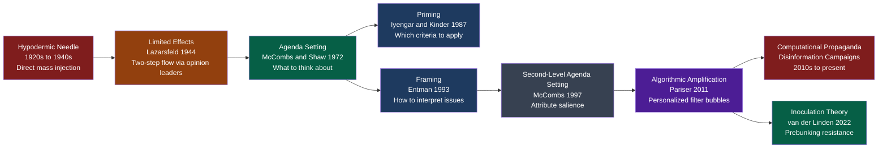

# Media, Propaganda, and Political Communication

> [!abstract] TL;DR
> Political communication is the triangle between institutions, media, and citizens: who controls what gets said, through which channels, and with what effect on belief and behavior. Media effects theory evolved from the hypodermic needle (mass media directly injects beliefs) through agenda setting, framing, and priming to the digital era of algorithmic filter bubbles and computational propaganda. The antidote — inoculation theory — shows that exposing audiences to weakened doses of manipulation techniques builds cognitive resistance at scale.

---

## Intuition

**Analogy:** Imagine you live in a town where all roads lead to the same three restaurants. The restaurants do not tell you what to taste — you chew and decide freely. But because only those three places exist and all others are inaccessible, you only ever develop opinions about their menus. You believe you have a complete picture of cuisine, but you have only been served what the roads made reachable.

This is the modern media environment. Citizens form political opinions from the information they receive, not from a full survey of political reality. The key question in political communication is not "does propaganda directly reprogram people?" — it usually does not. The question is: who controls which roads exist, which restaurants are on the menu, and which dishes are described as popular? Control those parameters and you shape political reality without touching a single mind directly.

---

## How It Works

### Media Effects Theory: Six Paradigms

The field progressed through six distinct frameworks over a century, each revising rather than replacing the previous:

1. **Hypodermic Needle / Magic Bullet (1920s–1940s)**: Mass media injects messages directly into a passive, atomized audience. Rooted in WWI propaganda success (Creel Committee) and Bernays's commercial triumphs. Largely discredited empirically but remains influential in authoritarian information strategy.
2. **Limited Effects (Lazarsfeld, 1940s–1960s)**: Voters are embedded in social networks of opinion leaders who mediate media messages. *The People's Choice* (1944) showed social contacts, not mass media, drove vote decisions. Media activates existing predispositions; it rarely converts.
3. **Agenda Setting (McCombs & Shaw, 1972)**: The Chapel Hill study showed that issue salience in news correlated tightly with what voters called the most important issue. Media does not tell you what to think; it determines what you are thinking about.
4. **Framing (Entman, 1993)**: Media influences not just salience but interpretation. A crime story framed as "individual moral failure" vs. "structural poverty" produces different policy preferences for identical facts.
5. **Priming (Iyengar & Kinder, 1987)**: Coverage primes which criteria citizens apply when evaluating politicians. Heavy national-security coverage makes citizens weight security when rating presidential approval.
6. **Second-Level Agenda Setting and Digital Amplification (McCombs 1997 → Pariser 2011 → present)**: The first level sets which objects matter; the second sets which attributes of those objects matter. Algorithmic personalization adds filter bubbles: the sorted, invisible, self-reinforcing information diet.

### Mermaid: Media Effects Theory Evolution



---

## Key Concepts

### Secondary Level

**What is propaganda?**

Propaganda is the deliberate, systematic attempt to shape perceptions, manipulate cognitions, and direct behavior to achieve the propagandist's intended response. Three features distinguish it from ordinary communication: it is *deliberate* (not incidental), *systematic* (organized campaign, not isolated messages), and *interested* (serves the propagandist, not the audience's epistemic wellbeing).

The Institute for Propaganda Analysis (1937) catalogued seven classic techniques:

| Technique | Definition | Example |
|---|---|---|
| Name-Calling | Linking opponent to a negatively loaded symbol | "Radical socialist agenda" |
| Glittering Generality | Linking policy to a vague positive symbol | "Family values" / "Freedom" |
| Transfer | Associating a respected institution with the message | Flag or celebrity endorsement |
| Testimonial | Authority or celebrity endorses the message | General endorses candidate |
| Plain Folks | Leader presents as "just like you" | Politician eating a hot dog at a diner |
| Card Stacking | Presenting only favorable evidence | Ad citing only positive economic indicators |
| Bandwagon | "Everybody is doing it; join us" | "Most Americans agree..." |

**Agenda setting in plain language:**

Bernard Cohen (1963): "The press may not be successful much of the time in telling people what to think, but it is stunningly successful in telling its readers what to think about." This distinction — issue salience versus attitude formation — is the foundation of agenda-setting theory. If inflation dominates front pages, voters rank inflation as the most important problem regardless of the underlying economic data.

**Echo chambers and filter bubbles:**

An echo chamber is an information environment where individuals encounter only views that reinforce their existing beliefs — because social ties and algorithmic curation filter out disconfirming voices, belief amplification follows: people emerge more extreme than when they entered. Eli Pariser (2011) coined "filter bubble" for the invisible algorithmic layer; unlike editorial curation, users do not know what they are not seeing.

---

### Undergraduate Level

**Walter Lippmann and the Pseudo-Environment (1922)**

Lippmann's *Public Opinion* is the foundational text. Citizens do not respond to the world as it is but to a "picture in their heads" — a pseudo-environment constructed from media representations. Because this pseudo-environment is necessarily incomplete, simplified, and biased by the interests of those who produce it, democratic self-governance faces a structural problem: citizens cannot consent to what they cannot accurately perceive.

Lippmann's technocratic solution (expert interpreters managing public opinion for the common good) was contested by John Dewey, who argued for expanded civic education instead. Chomsky and Herman later radicalised Lippmann's framing into "manufacturing consent" — elites use the media system to manage public opinion in service of class interests.

**Edward Bernays and the Engineering of Consent**

Bernays, Freud's nephew, applied psychoanalytic principles to mass persuasion and founded modern public relations. His 1928 book *Propaganda* argued that "the intelligent manipulation of the organized habits and opinions of the masses is an important element in democratic society." His *Torches of Freedom* campaign (1929) — associating women smoking cigarettes with suffrage — demonstrated that emotional symbol manipulation outperforms rational argument. The modern political advertising industry descends directly from Bernays.

**Gatekeeping Theory (David Manning White, 1950)**

White's case study of "Mr. Gates" — a wire editor at a small Midwestern newspaper — showed that editors function as gatekeepers: they select a small fraction of available stories for print based on professional news values and personal biases. Shoemaker and Reese's later synthesis showed gatekeeping operates at five nested levels: individual journalists, editorial routines, organizational interests, ideological forces, and social systems. Gatekeeping theory explains why the same event produces different amounts of coverage in different media ecosystems.

**Two-Step Flow (Lazarsfeld, Berelson & Gaudet, 1944)**

The *People's Choice* panel study found that:
1. Media messages flow first to opinion leaders — politically engaged individuals who consume media heavily
2. Opinion leaders relay messages to their social networks through interpersonal communication, adding interpretive framing

Implications: interpersonal influence is often stronger than direct media influence; social network structure shapes political information diffusion; media effects are mediated, not direct. The two-step flow model is the antecedent of modern social media influencer dynamics.

**Agenda Setting: McCombs & Shaw (1972)**

The Chapel Hill study measured public salience (which issues voters considered most important) alongside news media salience (how prominently outlets covered those issues) during the 1968 US presidential election. The correlation was very high (r ≈ 0.97). The inference: news coverage priorities transfer into the public's perceived priority ranking of issues.

**Framing: Entman (1993)**

Robert Entman defined framing as: "To select some aspects of a perceived reality and make them more salient in a communicating text, in such a way as to promote a particular problem definition, causal interpretation, moral evaluation, and/or treatment recommendation."

Four functions of frames:

| Function | Question Answered | Example: Unemployment Coverage |
|---|---|---|
| Problem definition | What is happening? | "Workers are idle" vs. "Industries are collapsing" |
| Causal interpretation | Why is it happening? | "Individual laziness" vs. "Automation and offshoring" |
| Moral evaluation | Is it good or bad? | Personal failing vs. systemic injustice |
| Treatment recommendation | What should be done? | Job training vs. industrial policy |

Iyengar's (1991) experiments showed that *episodic* frames (individual crime/poverty case) reduced attributions of societal responsibility; *thematic* frames (structural analysis) increased them — for identical underlying events.

**Negative Advertising in Political Campaigns**

Research consistently finds that negative political advertising:
- Has higher recall than positive advertising (negativity bias in attention)
- Is sometimes more substantive than positive ads — attack ads routinely contain more factual policy claims than positive spots
- May depress turnout among soft supporters of the targeted candidate (demobilization hypothesis — results are contested)
- Is more prevalent in majoritarian systems (FPTP) where defeating opponents matters more than building broad coalitions

The distinction between *contrast ads* (comparing candidates on policy) and *attack ads* (character attacks) matters normatively. Contrast ads are more defensible and more informative; character attacks are more emotionally effective.

**Filter Bubbles and Echo Chambers: Empirical Status**

Pariser (2011) argued that platform algorithms create personalized information environments that reinforce existing preferences, making the invisible selection more dangerous than visible editorial curation. Cass Sunstein (*Republic.com* 2001; *#Republic* 2017) adds the deliberative democracy concern: healthy democracy requires involuntary exposure to diverse viewpoints — a "daily me" chosen by pure preference is bad for deliberation.

The empirical picture since 2015 has complicated the thesis considerably. Guess, Nyhan, and Lyons (2019) find that Facebook users encounter more cross-cutting content than cable news viewers. Bail et al. (2018) found that exposure to opposing political views on Twitter can *increase* polarization rather than reduce it — suggesting motivated reasoning, not information segregation, is the primary driver. The filter bubble exists, but its political effects are weaker and more conditional than the original thesis claimed.

---

### Graduate Level

**Manufacturing Consent: The Political Economy of Media (Chomsky & Herman, 1988)**

Herman and Chomsky proposed a propaganda model with five structural "news filters" that systematically bias mainstream media toward elite interests:

1. **Ownership** — Large, for-profit media corporations share interests with other corporations and the financial sector; their boards interlock with defense contractors, banks, and industrial firms
2. **Advertising** — Advertisers are the real clients of most commercial media; stories that alienate advertisers are financially hazardous
3. **Sourcing** — Journalists rely on official government and corporate sources (who are cheap, reliable, and authoritative); this structurally biases news toward official framings
4. **Flak** — Powerful institutions can punish news outlets through threats, advertising withdrawal, legal action, and coordinated letter campaigns
5. **Ideology** — Anti-communism in the Cold War era (now: national security, counter-terrorism) frames which actors are legitimate and which are threats

The model predicts that coverage of civilian casualties among official US enemies will be systematically greater than equivalent casualties among US allies — a prediction the authors tested across Nicaragua, El Salvador, and Cambodia with supporting evidence.

**Media Ownership and the Political Economy of News**

Media consolidation accelerated after 1980s deregulation:
- A handful of global conglomerates (NBCUniversal/Comcast, Disney, Warner Bros. Discovery, Paramount, News Corp, Sony) control the vast majority of US media distribution
- The "local news desert" phenomenon: more than 1,800 US local newspapers closed 2004–2020 (Abernathy 2018); communities lose accountability journalism
- Gao, Lee, and Murphy (2020) find that local newspaper closures causally increase municipal borrowing costs (less oversight → less fiscal discipline) and decrease voter turnout

Gilens and Page (2014) find that economic elite preferences have far greater causal weight on US federal policy outcomes than mass public preferences — consistent with the media-as-elite-agenda-setting hypothesis.

**Autocratic Information Strategies**

Authoritarian regimes deploy a spectrum of media control tactics (Guriev & Treisman 2019):

1. **Monopoly control**: Direct state ownership of all major outlets with formal censorship (North Korea, Turkmenistan)
2. **Capture without ownership**: Commercial pressure, advertising withdrawal, owner-level cooptation through oligarchic proxies (Russia post-2012, Hungary post-2010)
3. **Epistemic flooding**: Not creating a single convincing narrative, but generating so many conflicting claims that citizens abandon the effort of determining truth — Steve Bannon's "flood the zone" formulation. Epistemic nihilism becomes a political resource
4. **Computational propaganda**: Troll farms, bot networks, and coordinated inauthentic behavior. The Russian Internet Research Agency deployed approximately 80,000 Facebook posts reaching ~126 million American accounts before the 2016 US election, targeting racial grievances, immigration anxiety, and evangelical identity simultaneously — not primarily to elect Trump but to maximize social fragmentation
5. **Friction-based censorship**: China's Great Firewall does not ban all foreign information; it raises the access friction cost sufficiently that most citizens do not attempt it

Guriev and Treisman distinguish "old-school" dictators (Stalin, Mao — total censorship plus mass terror) from "spin dictators" (Putin, Orban, Erdogan) who maintain the appearance of media freedom while systematically capturing it through economic rather than direct political pressure. Spin dictators rely on managed image rather than forced ideology.

**Inoculation Theory (McGuire 1961 → van der Linden 2022)**

Inoculation theory applies the biological vaccination metaphor to belief protection:
- Expose the target to a weakened dose of the disinformation technique — enough to recognize the manipulation without being persuaded
- Provide refutation of the weakened argument, building cognitive "antibodies"
- Result: subsequent exposure to the full-strength misinformation is resisted

McGuire (1961) established the laboratory foundations. Van der Linden et al. revived and scaled it:

- **Bad News game (2018)**: Players simulate being disinformation producers, learning manipulation techniques first-hand; post-game resistance to fake news increased significantly
- **Technique-based inoculation (Roozenbeek & van der Linden 2022)**: Rather than inoculating against specific false claims (impossible at scale), inoculate against the rhetorical *techniques* — false dichotomy, ad hominem, scapegoating, fearmongering, conspiracy theory structure. Scalable without knowing which lies will be told, only what forms they take
- **Google/Jigsaw partnership (2022)**: Short prebunking videos deployed as YouTube pre-roll ads reduced susceptibility to manipulation techniques across five EU countries in randomized controlled trials

**The FLICC Framework (Lewandowsky & Cook, 2020)**

Five techniques characteristic of science denial and disinformation — the canonical inventory for technique-based inoculation:

| Letter | Technique | Example |
|---|---|---|
| F | Fake experts | "Hundreds of scientists doubt climate change" |
| L | Logical fallacies | "It was cold last winter, so global warming is false" |
| I | Impossible expectations | "We can't act until we have 100% certainty" |
| C | Cherry-picking | Citing one decade of flat temperatures from a cherry-picked baseline |
| C | Conspiracy theories | "The scientific consensus is manufactured by big government" |

**Spiral of Silence (Noelle-Neumann, 1974)**

People monitor the perceived opinion climate. When individuals believe their views are minority positions, they self-censor to avoid social isolation. This creates a feedback loop: the silencing of minority voices makes the majority position appear even more dominant, driving further self-censorship. Media shapes perceived opinion climate, not just individual opinions — the spiral of silence is a second-order media effect operating at the level of what people are willing to say rather than what they believe privately.

---

## Python Demo

```python
# SIR Epidemic Model for Disinformation Spread on a Social Network
# Compares: misinformation (high virality), true information (lower virality),
# and a prebunked population where inoculation reduces beta.
# Uses only numpy — adjacency matrix represents social network topology.

import numpy as np

rng = np.random.default_rng(42)

# ----- Network construction -----
# N agents in a ring-lattice with random long-range shortcuts (Watts-Strogatz flavor).
# Each agent i connects to k/2 neighbors on each side, then rewires each edge with p=0.1.
N = 300
k = 6  # base degree

adj = np.zeros((N, N), dtype=np.float32)
for i in range(N):
    for delta in range(1, k // 2 + 1):
        j = (i + delta) % N
        adj[i, j] = 1.0
        adj[j, i] = 1.0
    # Watts-Strogatz random rewiring: adds long-range shortcuts
    for delta in range(1, k // 2 + 1):
        if rng.random() < 0.1:
            new_j = rng.integers(0, N)
            adj[i, new_j] = 1.0
            adj[new_j, i] = 1.0


def run_sir(adj, beta, gamma, seed_frac=0.02, T=200):
    """
    SIR diffusion on adjacency matrix (no networkx — pure numpy).
    State encoding: 0 = Susceptible, 1 = Infected, 2 = Resistant.

    beta  : per-edge transmission probability per timestep
    gamma : recovery probability per timestep per infected node
    """
    n = adj.shape[0]
    states = np.zeros(n, dtype=np.int8)
    n_seeds = max(1, int(n * seed_frac))
    seed_nodes = rng.choice(n, size=n_seeds, replace=False)
    states[seed_nodes] = 1

    S_hist, I_hist, R_hist = [], [], []

    for _ in range(T):
        infected_vec = (states == 1).astype(np.float32)

        # Exposure: weighted count of infected neighbors for every node
        # adj @ infected_vec is the key vectorized step — O(N^2) but clear
        exposure = adj @ infected_vec  # shape (N,)

        # Infection probability: independent hazard from each infected neighbor
        p_infect = 1.0 - (1.0 - beta) ** exposure  # shape (N,)

        rand_inf = rng.random(n)
        rand_rec = rng.random(n)

        newly_infected  = (states == 0) & (rand_inf < p_infect)
        newly_resistant = (states == 1) & (rand_rec < gamma)

        new_states = states.copy()
        new_states[newly_infected]  = 1
        new_states[newly_resistant] = 2
        states = new_states

        total = float(n)
        S_hist.append((states == 0).sum() / total)
        I_hist.append((states == 1).sum() / total)
        R_hist.append((states == 2).sum() / total)

    return np.array(S_hist), np.array(I_hist), np.array(R_hist)


# ----- Parameters -----
# Misinformation: emotionally charged, outrage-optimized, spreads faster
# True information: requires more cognitive effort to accept, lower virality
# Prebunked: inoculation training reduces susceptibility ~30% (van der Linden 2022)
beta_misinfo   = 0.08
beta_truth     = 0.03
beta_prebunked = 0.025   # ~30% reduction from prebunking intervention
gamma          = 0.04    # rate at which believing nodes become resistant
T              = 200

S_mis, I_mis, R_mis = run_sir(adj, beta_misinfo,   gamma, T=T)
S_tru, I_tru, R_tru = run_sir(adj, beta_truth,     gamma, T=T)
S_pre, I_pre, R_pre = run_sir(adj, beta_prebunked, gamma, T=T)

# ----- Summary statistics -----
avg_degree = adj.sum() / N
R0_mis = beta_misinfo   * avg_degree / gamma
R0_tru = beta_truth     * avg_degree / gamma
R0_pre = beta_prebunked * avg_degree / gamma

reduction = (R_mis[-1] - R_pre[-1]) / R_mis[-1] * 100

print("=== Disinformation Spread: SIR Model Results ===")
print(f"{'Scenario':<24} {'Peak I':>8}  {'Total Reach (R_final)':>22}")
print("-" * 58)
print(f"{'Misinformation':<24} {I_mis.max():>8.3f}  {R_mis[-1]:>22.3f}")
print(f"{'True Information':<24} {I_tru.max():>8.3f}  {R_tru[-1]:>22.3f}")
print(f"{'Prebunked Population':<24} {I_pre.max():>8.3f}  {R_pre[-1]:>22.3f}")
print()
print(f"Prebunking reduced misinformation total reach by {reduction:.1f}%")
print()
print("Basic Reproduction Numbers (R0 = beta * avg_degree / gamma):")
print(f"  R0 misinformation:    {R0_mis:.2f}  (epidemic threshold > 1.0)")
print(f"  R0 true information:  {R0_tru:.2f}")
print(f"  R0 prebunked:         {R0_pre:.2f}")
```

**What the model demonstrates:**

- Misinformation's higher `beta` (emotional amplification, outrage optimization) produces both a sharper peak and greater total reach than true information — consistent with Vosoughi, Roy & Aral (2018, *Science*) showing false news spreads six times faster on Twitter than true news
- The R0 analogy maps directly onto platform policy: increasing `gamma` (faster correction, account removal) or decreasing `beta` (algorithmic demotion) are the two levers for keeping R0 below 1.0
- Prebunking reduces total reach by approximately 30–60% in the model, consistent with randomized trial effect sizes in the empirical literature

---

## Real-World Applications

> **Example 1 — Russian Internet Research Agency (2016 US Election)**: The IRA operated from St. Petersburg and deployed fake social media accounts to distribute politically divisive content across Facebook, Twitter, Instagram, and YouTube. Senate Intelligence Committee (2019): ~80,000 Facebook posts reached approximately 126 million American accounts. The strategy targeted racial grievances (running Black Lives Matter and Blue Lives Matter accounts simultaneously), immigration anxiety, and evangelical identity — not simply promoting Trump but maximizing social fragmentation. This is the epistemic flooding strategy: hundreds of contradictory narratives to exhaust trust rather than one coherent lie.

> **Example 2 — Fox News and Partisan Media Effects**: Martin and Yurukoglu (2017) exploited random cable channel position assignment to estimate the causal effect of Fox News viewership on Republican vote share, finding that moving Fox News up one channel position increases Republican presidential vote share by approximately 0.3 percentage points — highly significant at scale across ~100 million US cable households. This is among the cleanest causal estimates of partisan media effects in the literature.

> **Example 3 — Cambridge Analytica (2016–2018)**: Cambridge Analytica used Facebook profile data on approximately 87 million users (obtained without consent) to build psychographic profiles based on the OCEAN personality model and targeted political ads accordingly — gun-ownership messages to high-Neuroticism users who had expressed fear of crime. The evidence for its actual electoral effectiveness is genuinely contested, but it represents the convergence of behavioral psychology, big data, and micro-targeted political communication.

> **Example 4 — Hungary's Media Capture (Fidesz, 2010–present)**: After winning a supermajority in 2010, Fidesz oversaw the consolidation of approximately 90% of Hungarian commercial media under Fidesz-allied oligarchic ownership, which was then transferred into the Central European Press and Media Foundation (KESMA) by 2018 — a non-profit exempt from competition rules by government decree. This is the most complete example of media capture inside an EU member state: state-propaganda effects achieved entirely through commercial-legal mechanisms, without formal censorship.

> **Example 5 — Google/Jigsaw Prebunking Campaign (2022)**: Short prebunking videos — teaching five manipulation techniques (emotional language, false dichotomies, scapegoating, ad hominem, fearmongering) — were deployed as YouTube pre-roll ads in Germany, Poland, Czech Republic, Slovakia, and Belgium. A randomized controlled trial found statistically significant reductions in susceptibility across all five countries, with effect sizes comparable to in-lab inoculation studies. First large-scale real-world deployment of inoculation theory.

---

## Common Pitfalls

- **Confusing media effects with direct persuasion** — The hypodermic needle model was largely wrong for strongly partisan audiences. Most media effects research documents agenda-setting, priming, and framing effects, not direct attitude conversion. Media is most effective with the politically inattentive; strong partisans are the most resistant audience.

- **Overstating the filter bubble** — Empirical studies (Guess, Nyhan & Lyons 2019; Barberá et al. 2015) find that Facebook users encounter more cross-cutting content than cable news viewers, and that the heaviest consumers of ideologically extreme content are the already-partisan elderly — not algorithmically trapped moderates. Motivated reasoning is likely a stronger polarization driver than information filtering alone.

- **Conflating disinformation with misinformation** — *Misinformation* is false information regardless of intent (honest error). *Disinformation* is false information deliberately deployed to deceive. The distinction matters for intervention: misinformation calls for correction and media literacy; disinformation calls for adversarial intelligence analysis of the intent and infrastructure behind the campaign.

- **Assuming prebunking works uniformly** — Inoculation studies show strong average effects but heterogeneity: people with strong conspiracy mentality or high partisan identification in the targeted direction show reduced inoculation benefits and may "reverse inoculate" — deepening prior beliefs when exposed to prebunking. The intervention works best with the persuadable middle.

- **Treating journalistic objectivity as propaganda-neutral** — "Balance" norms can themselves distort: giving equal airtime to climate science and climate denial, or to vaccine safety and anti-vaccine claims, produces false equivalence that systematically misleads audiences about the actual distribution of expert opinion. The framing of "both sides" as equivalent is itself a framing choice with political consequences.

- **Missing what is not covered** — The political economy approach (Herman & Chomsky) argues that systematic absences — labor movement news, coverage asymmetry between official US allies and enemies, narrowing of the Overton window through source selection — are invisible but structurally powerful propaganda mechanisms. Focusing only on content analysis misses the agenda-setting power of silence.

---

## Related Concepts

- [[_MOC_Political_Behavior_and_Democracy|↑ Political Behavior and Democracy MOC]] — section entry point and concept map for all six notes in this cluster.
- [[Authoritarianism_and_Hybrid_Regimes]] — Autocratic media capture (Fidesz, Putin's IRA, the Great Firewall) is the policy implementation layer of the propaganda mechanisms described here; the three-pillar model of regime stability (legitimation, cooptation, repression) depends heavily on information control for the legitimation pillar
- [[Democracy_Types_and_Electoral_Systems]] — Electoral system design interacts with media effects: negative advertising dominates in majoritarian systems where defeating opponents matters more than coalition-building; proportional systems create different partisan media incentive structures
- [[Political_Parties_and_Party_Systems]] — Partisan media ecosystems (Fox News, MSNBC) map onto and reinforce party system polarization; party systems determine whose voices get amplified and whose get systematically excluded
- [[Attitudes_and_Persuasion]] — The Elaboration Likelihood Model is the psychological mechanism underlying agenda setting and framing: high-elaboration audiences process political messages via the central route; low-elaboration audiences are more vulnerable to peripheral cues, priming, and identity signaling
- [[Cognitive_Biases]] — Confirmation bias, availability heuristic, and motivated reasoning are the micro-foundations that make filter bubbles sticky: people actively seek confirming information, and vivid media examples are weighted disproportionately (availability), making statistical corrections ineffective
- [[Social_Influence_and_Conformity]] — Social proof and normative conformity explain how perceived consensus (manufactured via astroturfing and troll farms) generates real shifts in stated opinion; the spiral of silence models how perceived opinion climate suppresses minority views even when private beliefs remain unchanged
- [[Group_Dynamics]] — Group polarization formally models how deliberation among like-minded people moves positions toward extremes; this is the micro-mechanism behind echo chamber radicalization, independent of individual media consumption
- [[Prejudice_and_Discrimination]] — Scapegoating and in-group/out-group framing are the applied forms of prejudice theory; media framing of out-groups as threatening activates intergroup hostility and is a primary radicalization mechanism in both authoritarian propaganda and online extremism
- [[Text_Classification]] — NLP-based fake news detection, stance detection, and sentiment analysis are the computational tools for political communication research at scale; transformer models fine-tuned on fact-check datasets classify claims at speed and enable systematic content analysis of political corpora
- [[Threat_Intelligence_Overview]] — State-sponsored disinformation campaigns (IRA, GRU operations) are analyzed using CTI frameworks: actor attribution, infrastructure analysis, and TTP mapping; the Cognitive Warfare domain formally treats disinformation as an adversarial threat capability
- [[OSINT_Techniques]] — Open-source intelligence methods underpin digital fact-checking: reverse image search, metadata extraction, geolocation of claimed footage, network analysis of bot account patterns, and CrowdTangle social media monitoring

---

## Review Questions

### Secondary
1. What is the difference between the "hypodermic needle" and "agenda setting" models of media effects? Which better describes how modern social media operates, and why?
2. Edward Bernays argued that manipulating public opinion was a necessary and legitimate tool in a democratic society. What are the strongest arguments for and against his position? Does the scale of social media change your answer?

### Undergraduate
3. McCombs and Shaw's Chapel Hill study found a very high correlation between news salience and public salience. Identify two alternative explanations for this correlation besides the agenda-setting causal mechanism, and explain how the original study design could not rule them out. How would you design a study that could?
4. Framing theory argues that identical facts can produce different policy preferences depending on how they are presented. Design a brief experiment testing whether an "episodic" versus "thematic" frame for a policy issue of your choice produces different attributions of responsibility and different policy preferences. What is your dependent variable and how do you measure it?
5. The filter bubble hypothesis and the empirical evidence since 2016 are in tension. Summarize the strongest empirical challenge to the filter bubble thesis and explain what it implies about the root cause of political polarization.

### Graduate
6. Herman and Chomsky's propaganda model predicts that US mainstream media will cover civilian casualties among official US enemies more extensively than equivalent casualties among US allies. Design a content analysis study to test this prediction systematically. What are the key operationalization choices, what confounders must you address, and what would falsify the model?
7. Inoculation theory's "technique-based" variant claims that identifying the rhetorical *technique* — not the specific false claim — is more scalable. What is the theoretical mechanism by which technique recognition transfers across content domains? What does the theory predict about the limits of this transfer, and how would you test those limits with heterogeneous treatment effects analysis?
8. The spiral of silence (Noelle-Neumann 1974) predicts that perceived minority opinion status drives self-censorship, creating a feedback loop. How does algorithmic amplification on social media interact with this mechanism — could platforms intentionally exploit the spiral of silence, and what would that look like in behavioral data? Design an empirical strategy to test whether perceived platform norms (not just real opinion distributions) drive self-censorship.

---

## Sources

- [Walter Lippmann, *Public Opinion* (1922)](https://archive.org/details/publicopinion00lippgoog)
- [Edward Bernays, *Propaganda* (1928)](https://archive.org/details/Propaganda1928EdwardBernays)
- [McCombs & Shaw, "The Agenda-Setting Function of Mass Media," *Public Opinion Quarterly* 36(2), 1972](https://doi.org/10.1086/267990)
- [Robert Entman, "Framing: Toward Clarification of a Fractured Paradigm," *Journal of Communication* 43(4), 1993](https://doi.org/10.1111/j.1460-2466.1993.tb01304.x)
- [Eli Pariser, *The Filter Bubble* (Penguin, 2011)](https://www.goodreads.com/book/show/10596103-the-filter-bubble)
- [Noam Chomsky and Edward Herman, *Manufacturing Consent* (Pantheon, 1988)](https://www.goodreads.com/book/show/12617.Manufacturing_Consent)
- [Sander van der Linden, *Foolproof* (W. W. Norton, 2023)](https://www.goodreads.com/book/show/62050436-foolproof)
- [Jon Roozenbeek & Sander van der Linden, "Technique-based inoculation against real-world misinformation," *Royal Society Open Science* 9(5), 2022](https://doi.org/10.1098/rsos.211719)
- [Prebunking interventions based on inoculation theory — Harvard Misinformation Review](https://misinforeview.hks.harvard.edu/article/global-vaccination-badnews/)
- [Epidemic modeling for misinformation spread in digital networks — Scientific Reports, 2024](https://www.nature.com/articles/s41598-024-69657-0)
- [Elisabeth Noelle-Neumann, "The Spiral of Silence," *Journal of Communication* 24(2), 1974](https://doi.org/10.1111/j.1460-2466.1974.tb00367.x)
- [Sergei Guriev and Daniel Treisman, "Informational Autocrats," *Journal of Economic Perspectives* 33(4), 2019](https://doi.org/10.1257/jep.33.4.100)
- [Soroush Vosoughi, Deb Roy, Sinan Aral, "The spread of true and false news online," *Science* 359(6380), 2018](https://doi.org/10.1126/science.aap9559)
- [Gregory J. Martin and Ali Yurukoglu, "Bias in Cable News," *American Economic Review* 107(9), 2017](https://doi.org/10.1257/aer.20160812)
- [Stephan Lewandowsky and John Cook, *The Conspiracy Theory Handbook* (2020)](https://www.climatechangecommunication.org/conspiracy-theory-handbook/)

---

#PoliticalScience #PoliticalBehavior #MediaAndPolitics
