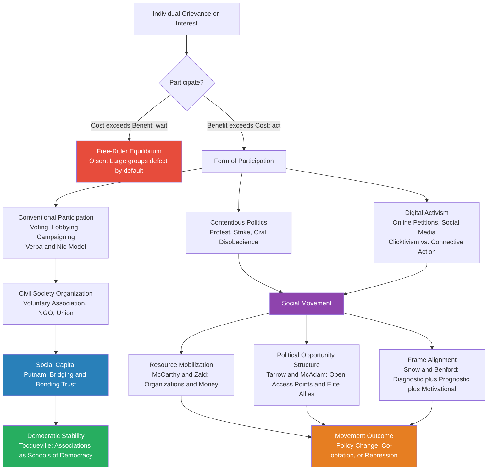

# Political Participation and Civil Society

> [!abstract] TL;DR
> Political participation encompasses the full range of acts by which citizens influence political outcomes — from voting to revolution — while civil society names the web of voluntary associations that sit between state and market. Both face a central paradox: collective action requires individual cost but produces shared benefit, so rational individuals free-ride, yet democracies demonstrably depend on engaged citizens. Olson's logic of collective action explains why large groups systematically under-mobilize; Ostrom shows how institutions — monitoring, graduated sanctions, local rules — can escape that trap; Putnam shows that accumulated civic engagement creates generalized social trust that sustains democracy itself.

---

## Intuition

**Analogy:** Imagine your apartment building has a broken lobby light. Everyone benefits from fixing it. No individual gains more by paying than by waiting for a neighbor to pay. If everyone waits, the light stays broken forever — even though the collective benefit (safety, comfort) far exceeds the cost of one new bulb. This is Mancur Olson's collective action problem in miniature.

Now imagine the building has an active residents' association: people know each other's names, a communal budget is tracked, and anyone who repeatedly free-rides is named at the quarterly meeting. The light gets fixed within days. The association is Robert Putnam's civil society — the dense network of trust and norms that transforms a building of strangers into a community capable of solving shared problems. Scaled up to a nation, this is the difference between a dysfunctional democracy and a resilient one.

---

## How It Works

### Core Mechanics

Political participation converts private preferences into public outcomes through two distinct channels: **conventional participation** (working within established institutions — voting, lobbying, campaigning) and **contentious politics** (challenging institutions — protest, strikes, civil disobedience). Verba, Schlozman, and Brady (1995) showed these are not equivalent: voting is near-universal but low-intensity; lobbying and organizing are high-intensity but restricted to the resource-rich. The result is a **participation bias**: wealthy, educated, and older citizens systematically over-represent themselves in all high-intensity forms.

Civil society — Tocqueville's term for the web of voluntary associations — mediates between individual preferences and political outcomes. Participation in associations generates **social capital**: the networks, norms, and generalized trust that allow collective action without central enforcement. Putnam distinguishes **bonding capital** (tight ties within homogeneous groups — ethnic associations, religious congregations) from **bridging capital** (weaker ties across different groups — parent-teacher associations, cross-partisan clubs). Bridging capital is the crucial ingredient for democratic stability: it is harder to generate but produces the civic trust that makes large-scale cooperation possible.

Social movements arise when grievances cannot be resolved through conventional channels. They require not just grievance but **resources** (McCarthy & Zald), an open **political opportunity structure** (Tarrow, McAdam), and effective **framing** (Snow & Benford, building on Goffman) — a message that resonates broadly enough to recruit participants.

### Flow / Architecture



---

## Key Concepts

### Secondary Level

#### Forms of Political Participation

| Mode | Examples | Intensity | Bias |
|------|----------|-----------|------|
| **Electoral** | Voting, donating, canvassing | Low–Medium | Moderate (age, registration barriers) |
| **Institutional** | Contacting officials, party membership | Medium | High (education, income) |
| **Civic** | Voluntary associations, community boards | Medium | Moderate |
| **Contentious** | Protests, strikes, boycotts | High | Complex (young, educated; but also marginalized) |
| **Digital** | Petitions, hashtags, fundraising | Low | Educated, globally connected |

Verba and Nie (1972) originally identified four modes (voting, campaign activity, communal activity, particularized contacting). Subsequent work by Verba, Schlozman, and Brady (1995) in *Voice and Equality* added the critical insight that participation requires three resources — **time, money, and civic skills** — and that the distributions of all three are deeply unequal. The participatory gap is therefore not a problem of motivation alone; it is structural.

#### Putnam's Social Capital

Robert Putnam (*Making Democracy Work*, 1993; *Bowling Alone*, 2000) built on Tocqueville's 1835 observation that Americans' dense civic life — the habit of forming voluntary associations for every conceivable purpose — made democratic self-government possible. His central argument: **civil society generates social capital**, and social capital generates trust, norms of reciprocity, and cooperative capacity that spill over into political institutions.

**Two types of social capital:**
- **Bonding capital** — strong ties within homogeneous communities (ethnic clubs, religious groups). Creates solidarity but can exclude outsiders and reinforce in-group/out-group divisions.
- **Bridging capital** — weaker ties that cross social cleavages (PTAs, non-sectarian charities, professional associations). Creates generalized trust — trust in strangers as fellow citizens — which is what democracy requires.

**Bowling Alone thesis:** Putnam documented a steep decline in civic participation in the US from the 1960s to 2000 — declining PTA membership, union membership, civic club attendance, church attendance, and even informal socializing. He argued television, suburban sprawl, and generational replacement explained the trend. The decline in bridging capital, he argued, was making Americans less able to act collectively on shared political problems.

**Italian natural experiment:** Putnam's earlier work compared Italian regions that had introduced autonomous regional governments in 1970. Twenty years later, performance varied enormously. The key predictor was not wealth but civic density — the number of choral societies, sports clubs, and local newspapers per capita in 1900. Northern Italy's richer associational tradition produced better governance centuries later; Southern Italy's patron-client culture, weaker associational life, and lower generalized trust produced dysfunction. This is the empirical anchor of Putnam's theory.

#### Civil Society and Democratization (Tocqueville)

Alexis de Tocqueville (*Democracy in America*, 1835/40) argued that democracy requires active citizens, not just passive subjects. Without a dense civil society, political equality produces not liberty but **tyranny of the majority** and, ultimately, **soft despotism**: citizens atomized and dependent on a paternalist state withdraw from public life, leaving the state to expand without check.

His diagnosis: voluntary associations are **schools of democracy**. They teach citizens to cooperate, compromise, aggregate interests, and hold leaders accountable — skills that transfer to formal political life. Without them, democratic forms become hollow.

---

### Undergraduate Level

#### Olson's Logic of Collective Action (1965)

Mancur Olson's *The Logic of Collective Action* made a deceptively simple argument that overturned pluralist assumptions: **large groups with shared interests will generally fail to act collectively**, even when collective action would benefit every member. The mechanism is pure rational self-interest.

**The free-rider problem in a public goods game:**
- A public good (e.g., clean air, trade union wages, civil rights legislation) is non-excludable: once provided, all group members benefit whether or not they contributed.
- For any rational individual: if the good will be provided by others, do not contribute (save the cost and still enjoy the benefit). If the good will not be provided, a single individual's contribution rarely tips the outcome in a large group.
- Nash equilibrium: zero or minimal contributions. The good is underprovided or not provided at all.

**Why small groups escape the trap:**
1. Each member's contribution in a small group is pivotal — defection visibly affects outcomes.
2. Monitoring and social sanctioning are cheap when members know each other.
3. The free-rider's gain is smaller relative to the loss each small-group member suffers.

**Olson's solution: selective incentives.** Large-group collective action is explained not by shared interest in the collective good but by **private benefits** (selective incentives) available only to contributors. American unions organized workers not merely with appeals to solidarity but by offering selective benefits: insurance, legal services, job placement. The American Medical Association lobbied for physician interests, but doctors joined for the professional liability insurance only members could access. The collective action is, in Olson's model, a by-product of selective incentive provision.

#### Ostrom's Institutional Design Principles (1990)

Elinor Ostrom (*Governing the Commons*, Nobel 2009) challenged both the Olson pessimism and the standard remedies (privatize it or nationalize it). Through case studies of long-enduring common-pool resource institutions — Swiss Alpine grazing commons, Japanese fishing villages, Californian water districts — she identified eight design principles that allow communities to self-govern shared resources without either market or state:

1. **Clearly defined boundaries** — who is in the group; what resource is governed
2. **Congruence** — rules fit local conditions; costs match benefits
3. **Collective choice arrangements** — those affected by rules participate in modifying them
4. **Monitoring** — compliance is observable; monitors are accountable to the group
5. **Graduated sanctions** — first violations receive mild penalties; repeated violations escalate
6. **Conflict resolution mechanisms** — cheap, accessible arenas to resolve disputes
7. **Minimal recognition** — external authorities acknowledge the right to organize
8. **Nested enterprises** — for larger systems, governance is layered (polycentric)

**Key insight:** Monitoring and graduated sanctions are the institutional analogs to selective incentives — they change the individual payoff calculation without requiring top-down enforcement. When Ostrom's principles are present, the collective action problem is transformed: free-riding becomes costly and cooperation becomes individually rational.

#### Resource Mobilization Theory (McCarthy & Zald)

McCarthy and Zald (1977) shifted the study of social movements from grievances to **resources**. The key claim: grievances are ubiquitous; what determines whether a movement forms and succeeds is the availability and organization of **resources** — money, labor, expertise, media access, organizational infrastructure.

Central concepts:
- **Social Movement Organization (SMO):** A formal organization that identifies with the goals of a movement and attempts to implement them. The NAACP, Amnesty International, and Greenpeace are SMOs.
- **Social Movement Industry (SMI):** The set of all SMOs competing for the same pool of supporters and resources — analogous to an industrial sector.
- **Professional social movements:** Movements with paid staff and formal fundraising, operating even with minimal grassroots participation. RMT showed these could be more effective than spontaneous uprisings.

**Critique:** RMT was accused of over-rationalizing movements and ignoring genuine grievance and identity. It also struggled to explain why similar resources produce very different outcomes in different political contexts — which led to the political opportunity structure approach.

#### Political Opportunity Structures (Tarrow, McAdam)

Sidney Tarrow (*Power in Movement*, 1994) and Doug McAdam (political process model) argued that movement outcomes depend critically on the political context — specifically whether **political opportunity structures** are open or closed.

Key dimensions of political opportunity:
- **Openness of the institutionalized political system** — how many access points exist (courts, legislatures, agencies)?
- **Stability of elite alignments** — are elites divided or unified? Divided elites create opportunities.
- **Presence of elite allies** — do powerful insiders support movement goals?
- **State capacity and propensity for repression** — states with low repression tolerance encourage more contentious action.

**McAdam's Political Process Model** adds two elements beyond opportunity:
1. **Indigenous organizational strength** — existing networks (Black churches for the US civil rights movement) that can be quickly mobilized
2. **Cognitive liberation** — a shift in collective consciousness: grievances come to be seen as unjust and changeable rather than natural and inevitable

Together, opportunity + organization + cognition explain *when* movements form and *whether* they win.

#### Frame Analysis (Goffman → Snow & Benford)

David Snow and Robert Benford (1986, 1988) applied Erving Goffman's concept of **frames** — interpretive schemata that render events meaningful — to social movement analysis. Movements do not merely react to objective conditions; they actively construct frames that recruit participants and legitimate their cause.

**Three framing tasks:**
1. **Diagnostic framing** — identify the problem and assign blame ("Poverty is caused by policy choices, not individual failure")
2. **Prognostic framing** — propose a solution ("A living wage law would solve it")
3. **Motivational framing** — provide a rationale for action ("You can make a difference; here is how")

**Frame alignment:** The process of linking individual consciousness to movement interpretive frames. Successful frames resonate with existing cultural narratives — this is why the US civil rights movement framed its demands in the language of the American founding and Christian redemption, rather than Marxist class struggle.

#### New vs. Old Social Movements

| Dimension | Old Social Movements | New Social Movements |
|-----------|---------------------|---------------------|
| **Historical period** | 19th–mid-20th century | 1960s onward |
| **Central cleavage** | Class (labor vs. capital) | Post-material: identity, lifestyle, recognition |
| **Key actors** | Industrial workers, trade unions | Women, LGBTQ+ people, environmentalists, anti-nuclear |
| **Core demands** | Redistribution, economic rights | Recognition, autonomy, cultural change |
| **Organization** | Hierarchical, bureaucratic (unions, socialist parties) | Decentralized, networked, loose coalitions |
| **Theorists** | Marx, Gramsci, Lenin | Touraine, Melucci, Habermas |

Habermas's contribution: new social movements defend the **lifeworld** (everyday social relationships, culture, meaning) against the colonizing expansion of **system logic** (market efficiency and bureaucratic rationality) into domains like family, education, and health.

---

### Graduate Level

#### Digital Activism: Gladwell vs. Castells

Malcolm Gladwell ("Small Change," *New Yorker*, 2010) argued that social media enables **weak-tie activism** — clicking, signing, sharing — which requires no personal risk and produces no durable organizational commitment. He contrasted this with the US civil rights movement, whose sit-ins and freedom rides required participants to risk arrest and violence, sustained by dense friendship networks and formal SNCC organization. Weak ties cannot sustain high-risk activism; social media produces **clicktivism** — the illusion of political engagement.

Manuel Castells (*Networks of Outrage and Hope*, 2012) countered that digital networks fundamentally altered the **scale, speed, and structure** of social movements. The Arab Spring, Occupy, and 15-M movements demonstrated that networked communication enables rapid, leaderless mobilization that outpaces state repression. The horizontal, rhizomatic structure is a feature, not a bug: it prevents decapitation by arresting leaders. Castells argued that digital networks create **mass self-communication** — bypassing corporate media gatekeepers to construct alternative frames.

**The empirical middle ground:** Both are partly right. Digital tools dramatically lower the cost of coordination (a genuine advantage) but create a **participation inflation paradox**: because clicking is cheap, it attracts supporters whose commitment is shallow. High-risk, sustained political change — ending an authoritarian regime, passing a constitutional amendment — still requires organizational depth and willingness to bear concentrated costs. Digital activism functions best as an **amplifier** of existing organizational capacity, not a substitute for it.

**Bennett and Segerberg (2012)** — *Connective Action* — offer the most nuanced synthesis: alongside traditional *collective action* (shared identity, organizational coordination, Olson's selective incentives), digital networks enable *connective action* where personalized content sharing creates large-scale coordination without formal organizations. The two logics are not opposed but complementary; effective movements combine both.

#### Ostrom's Challenge to State-Market Dichotomy

Ostrom's Nobel lecture argument has structural importance for democratic theory: both markets and states can fail to provide public goods. Her evidence from field studies showed that **polycentrism** — multiple overlapping governance centers at different scales — is more adaptive and robust than either privatization or nationalization. For democratic theory, this implies that civil society is not a residual category but a **primary governance mode** with its own logic, and that institutional diversity is a resource rather than a source of confusion.

**Critical conditions for polycentric governance:**
- **Communication and deliberation** — participants must be able to talk, not just signal
- **Trust and reciprocity norms** — built through repeated interaction (Putnam's social capital at the micro level)
- **Congruent rules** — institutions that do not fit local conditions fail regardless of design
- **Effective sanctioning** — credible, graduated, collectively enforced

Ostrom's work connects directly to Axelrod's evolution of cooperation (iterated prisoner's dilemma → reciprocity emerges) and to Putnam's social capital (trust enables the repeated interaction that Axelrod requires). The three bodies of work form a coherent theory of how cooperation emerges from self-interest without central enforcement.

#### The Paradox of Voting and Expressive Rationality

The instrumental paradox of mass electoral participation: in a large election, the probability that any single vote is decisive is approximately zero. If participation is costly (transport, opportunity cost), the expected instrumental benefit of voting is essentially zero. Yet 50–80% of eligible voters in established democracies do vote. This is the **paradox of voting** (Downs, 1957; Riker & Ordeshook, 1968).

**Solutions:**
1. **Civic duty / expressive utility** — voting satisfies a preference to be the kind of person who participates; it is expressive rather than instrumental (Riker & Ordeshook's D term in the calculus of voting: B·P + D > C)
2. **Social pressure** — Gerber, Green, and Larimer (2008) field experiment: sending voters a mailer showing their neighbors' voting records increased turnout by 8.1 percentage points — the largest effect ever found. Social norms, not civic duty abstracted from social context, drive turnout.
3. **Group rationality** — If every member of a cohesive group reasons "the group wins if we all vote," the individual's probability of being pivotal within the group is non-negligible even when aggregate election probability is tiny.

**Implication for civil society theory:** Putnam's social capital directly addresses the paradox. Dense associational life creates the social pressure and group identity that make voting instrumentally rational at the group level and normatively expected at the individual level. Bowling leagues produce voters — not because bowling is political but because the trust and reciprocity generated there extend to the civic sphere.

---

## Python Demo

```python
import numpy as np

np.random.seed(42)

# ---------------------------------------------------------------
# Olson's Logic of Collective Action: Simulation
# n individuals decide whether to contribute to a public good.
# Contribution cost: c. Benefit if good is provided: b.
# Good is provided if at least k contributors commit.
# Models Olson's free-rider equilibrium, small-group advantage,
# selective incentives, and Ostrom's monitoring + sanctions.
# ---------------------------------------------------------------

def simulate_collective_action(
    n_individuals: int,
    cost_of_contribution: float,
    benefit_if_provided: float,
    threshold_k: int,
    selective_incentive: float = 0.0,
    monitoring_prob: float = 0.0,
    sanction: float = 0.0,
    n_rounds: int = 50,
    rng_seed: int = 42
) -> list:
    """
    Simulate a repeated public goods game with optional institutional design.

    Parameters
    ----------
    n_individuals        : group size
    cost_of_contribution : personal cost to contribute
    benefit_if_provided  : payoff to each individual if good is provided
    threshold_k          : minimum contributors needed to provide the good
    selective_incentive  : private benefit given only to contributors
    monitoring_prob      : probability a free-rider is detected and sanctioned
    sanction             : penalty imposed on detected free-riders
    n_rounds             : number of repeated interactions
    rng_seed             : reproducibility seed
    """
    rng = np.random.default_rng(rng_seed)

    # Each individual starts with a random initial contribution probability
    contrib_prob = rng.uniform(0.3, 0.7, size=n_individuals)

    history = []

    for _ in range(n_rounds):
        contributions = rng.random(n_individuals) < contrib_prob
        n_contrib     = contributions.sum()
        good_provided = int(n_contrib >= threshold_k)

        payoffs = np.zeros(n_individuals)
        for i in range(n_individuals):
            if contributions[i]:
                payoffs[i] = (benefit_if_provided * good_provided
                              - cost_of_contribution
                              + selective_incentive)
            else:
                payoffs[i] = benefit_if_provided * good_provided
                # Ostrom: free-riders risk detection and graduated sanction
                if monitoring_prob > 0 and rng.random() < monitoring_prob:
                    payoffs[i] -= sanction

        # Reinforcement learning: compare contributor vs. free-rider payoffs
        avg_c = payoffs[contributions].mean() if contributions.any() else -cost_of_contribution
        avg_f = (payoffs[~contributions].mean()
                 if (~contributions).any()
                 else benefit_if_provided * good_provided)

        for i in range(n_individuals):
            delta = 0.05 * np.sign(avg_c - avg_f) if contributions[i] else 0.05 * np.sign(avg_f - avg_c)
            contrib_prob[i] = np.clip(contrib_prob[i] + delta, 0.05, 0.95)

        history.append({
            "n_contrib":     int(n_contrib),
            "good_provided": good_provided,
            "contrib_rate":  float(contributions.mean()),
            "avg_payoff":    float(payoffs.mean()),
        })

    return history


def summarize(history: list) -> tuple:
    late = history[-10:]
    return (
        float(np.mean([h["contrib_rate"]  for h in late])),
        float(np.mean([h["good_provided"] for h in history])),
    )


# ================================================================
# SCENARIO 1: Large group, no institutions (Olson baseline)
# Prediction: free-rider equilibrium — contributions collapse
# ================================================================
print("=" * 62)
print("SCENARIO 1: Large group (n=50), no institutions")
print("Olson's prediction: rational individuals free-ride")
print("=" * 62)

h1 = simulate_collective_action(
    n_individuals=50, cost_of_contribution=3.0,
    benefit_if_provided=10.0, threshold_k=15
)
cr1, pr1 = summarize(h1)
early_cr = np.mean([h["contrib_rate"] for h in h1[:5]])
print(f"  Contribution rate (rounds 1-5):   {early_cr:.1%}")
print(f"  Contribution rate (rounds 41-50): {cr1:.1%}")
print(f"  Good provided in {pr1:.0%} of all rounds")
print("  --> Free-riding dominates: provision collapses as rounds progress")


# ================================================================
# SCENARIO 2: Small group (n=5) — Olson's in-built solution
# In small groups each member's contribution is pivotal
# ================================================================
print("\n" + "=" * 62)
print("SCENARIO 2: Small group (n=5) — Olson's small-group exception")
print("=" * 62)

h2 = simulate_collective_action(
    n_individuals=5, cost_of_contribution=3.0,
    benefit_if_provided=10.0, threshold_k=3
)
cr2, pr2 = summarize(h2)
print(f"  Contribution rate (rounds 41-50): {cr2:.1%}")
print(f"  Good provided in {pr2:.0%} of all rounds")
print("  --> Pivotal action + easy monitoring sustains cooperation")


# ================================================================
# SCENARIO 3: Large group + Selective Incentives (Olson's solution)
# Union health insurance, NGO membership card, newsletter access
# The collective good becomes a by-product of private goods
# ================================================================
print("\n" + "=" * 62)
print("SCENARIO 3: Large group + Selective Incentives")
print("  Contributors receive a private benefit not available to")
print("  free-riders (union insurance, member services, solidarity goods)")
print("=" * 62)

h3 = simulate_collective_action(
    n_individuals=50, cost_of_contribution=3.0,
    benefit_if_provided=10.0, threshold_k=15,
    selective_incentive=4.0
)
cr3, pr3 = summarize(h3)
print(f"  Contribution rate (rounds 41-50): {cr3:.1%}")
print(f"  Good provided in {pr3:.0%} of all rounds")
print("  --> Selective incentives flip individual calculation: contribute")


# ================================================================
# SCENARIO 4: Ostrom's institutional design principles
# Monitoring (detection probability) + graduated sanctions
# Community self-governance without market or state
# ================================================================
print("\n" + "=" * 62)
print("SCENARIO 4: Ostrom's design — monitoring + graduated sanctions")
print("  Free-riders detected with p=0.70; penalty=5.0 utils")
print("  (Ostrom principle: sanctions must exceed short-term gain)")
print("=" * 62)

h4 = simulate_collective_action(
    n_individuals=50, cost_of_contribution=3.0,
    benefit_if_provided=10.0, threshold_k=15,
    monitoring_prob=0.70, sanction=5.0
)
cr4, pr4 = summarize(h4)
print(f"  Contribution rate (rounds 41-50): {cr4:.1%}")
print(f"  Good provided in {pr4:.0%} of all rounds")
print("  --> Institutional sanctions restore cooperation without central state")


# ================================================================
# SUMMARY TABLE
# ================================================================
print("\n" + "=" * 62)
print("SUMMARY — Olson and Ostrom Solutions Compared")
print("=" * 62)
print(f"  {'Scenario':<42} {'Contrib%':>8}  {'Provided%':>9}")
print(f"  {'-'*62}")

rows = [
    ("1. Large group, no institutions (Olson trap)",     cr1, pr1),
    ("2. Small group, n=5 (Olson: pivotal action)",       cr2, pr2),
    ("3. Large + Selective Incentives (Olson fix)",       cr3, pr3),
    ("4. Large + Ostrom Monitoring + Sanctions",          cr4, pr4),
]
for label, cr, pr in rows:
    print(f"  {label:<42} {cr:>7.1%}   {pr:>8.1%}")

print("\n  Key insight: Collective action is NOT solved by goodwill alone.")
print("  It requires either small scale, private incentives, or")
print("  credible monitoring and sanctioning institutions (Ostrom).")
print("  This is the micro-foundation of civil society's political function.")
```

---

## Real-World Applications

> **US Civil Rights Movement — All Three Social Movement Mechanisms.** The US civil rights movement (1955–1968) exemplifies McAdam's political process model. *Organizational strength*: Black churches, HBCUs, the NAACP, and SNCC provided infrastructure, communication networks, and trained leadership. *Political opportunity*: Cold War competition with the Soviet Union made racial apartheid a foreign policy liability; Northern liberal realignment under FDR created elite allies; the 1954 *Brown* ruling cracked legal segregation's legitimacy. *Cognitive liberation*: Rosa Parks's arrest was not spontaneous — it was a carefully chosen test case designed to transform passive grievance into moral clarity and organizational action. All three conditions aligned in 1955–1965; when POS narrowed after 1968 (Nixon, Vietnam, urban riots alienating liberal allies), the movement fragmented and its radical wing stalled.

> **Putnam's Italy — Social Capital as Historic Predictor.** Putnam's 1993 dataset from Italian regions found that civic density in 1900 — choral societies, mutual aid clubs, local newspapers per 100,000 residents — predicted institutional performance of regional governments in 1985 with striking precision. Northern Emilia-Romagna, with dense associational life rooted in medieval communal traditions, produced effective regional governance and a prosperous networked economy of small firms (*Terza Italia*). Southern Calabria, with patron-client networks substituting for civic association, produced rent-seeking and institutional dysfunction. The causal inference is contested, but the magnitude of the correlation across 20 regions over 85 years remains the most compelling evidence that social capital has long-run political consequences.

> **Arab Spring — Digital Connective Action and Its Limits.** The 2010–2011 uprisings in Tunisia, Egypt, Libya, and Syria demonstrated Castells's network theory: cheap smartphones and Facebook enabled rapid horizontal mobilization that outpaced state surveillance. The Ben Ali and Mubarak regimes fell within weeks of mass protests. But the aftermath vindicated Gladwell: digital coordination proved insufficient for the harder task of *constitutional consolidation*. Egypt's revolution produced a coup; Libya produced civil war; Syria produced catastrophe. Tunisia succeeded partly because it had pre-existing organizational infrastructure — the UGTT trade union federation and the bar association — that could broker the National Dialogue Quartet (Nobel Peace Prize, 2015). Connective action toppled regimes; collective action institutions built democracies.

> **Ostrom's Swiss Alpine Commons — 500 Years of Self-Governance.** The Törbel village in the Swiss Alps has governed its alpine meadows through a common-property institution continuously since 1483. The institution specifies who may use the commons (village members), the number of cattle each may graze (calibrated to winter fodder capacity — a direct congruence rule), annual elections for monitors, and fines scaled to the number of violations. The system has managed the alpine commons sustainably through wars, industrialization, and demographic change without either privatization or state management. Ostrom used it as the anchor case for her institutional design principles precisely because it predates any theoretical framework — it is empirical proof that communities can self-organize.

> **Bowling Alone in Decline — and the Digital Non-Substitute.** Putnam's updated analysis (*Upswing*, 2020, with Tommy Shelby) found that US social capital declined through the 1970s–2000s, briefly recovered, then declined again. Notably, the rise of social media from 2004 failed to reverse the trend and may have accelerated bridging capital decline: online networks tend to be homophilous (connecting similar people) and to reinforce bonding at the expense of bridging. The filter bubble and political polarization literature (Sunstein, Pariser) connects directly: digital architecture that maximizes engagement produces bonding capital at scale while fragmenting the shared civic sphere that bridging capital requires.

---

## Common Pitfalls

- **Conflating civil society with NGOs** — Civil society includes informal networks, neighborhood associations, religious congregations, and professional bodies. Formal NGOs are highly visible but represent only a slice, often the externally-funded, professionalized slice. Putnam's social capital theory is about everyday civic density, not organizational headcount.
- **Misreading Olson as proving collective action is impossible** — Olson proved large groups with diffuse interests and no selective incentives face a severe collective action problem. He identified the solution: selective incentives and small groups. Ostrom extended the solution set. The point is that collective action requires institutional design, not that it cannot occur.
- **Treating social capital as uniformly positive** — Bonding social capital creates tight-knit communities that can be exclusionary, parochial, and hostile to outsiders. Putnam acknowledges this: the KKK and La Cosa Nostra are high-bonding-capital organizations. Democracy requires bridging capital specifically. Strong bonding without bridging produces polarization, ethnic violence, and sectarian conflict.
- **Applying Putnam without accounting for causality direction** — Putnam's data are consistent with two stories: civic density produces good governance (his argument), or good governance and prosperity produce civic density. Recent instrumental variable work supports bidirectionality but the Putnam direction is better established for long time horizons. Do not cite Putnam as establishing clean unidirectional causation.
- **Using "clicktivism" as a dismissal** — The Gladwell critique applies specifically to high-risk, sustained campaigns (regime change, constitutional reform). For low-risk coordination problems (scheduling flash mobs, raising awareness, small-dollar fundraising) digital tools are highly effective. The error is applying Gladwell's critique beyond its proper scope.
- **Ignoring the political opportunity structure in movement analysis** — The Resource Mobilization focus on internal organizational capacity can lead analysts to attribute movement success or failure entirely to the movement itself. The same organization, same resources, and same framing can succeed under one political context and fail under another. Never analyze a social movement without mapping its political environment.
- **Confusing Olson's selective incentives with corruption or bribery** — Selective incentives are private goods that incentivize participation without distorting the collective good itself: professional training, information services, insurance, solidarity goods. They are a legitimate institutional solution, not a departure from democratic norms.

---

## Related Concepts

- [[_MOC_Political_Behavior_and_Democracy|↑ Political Behavior and Democracy MOC]] — section entry point and concept map for all six notes in this cluster.
- [[Democracy_Types_and_Electoral_Systems]] — Electoral systems determine how participation translates into representation; turnout and strategic voting directly connect to this note's participation models.
- [[Authoritarianism_and_Hybrid_Regimes]] — Authoritarian regimes suppress civil society precisely because Tocqueville and Putnam are right: associations are schools of opposition. Selectorate theory explains why civil society is the first target of autocratic consolidation.
- [[Social_Contract_Theory]] — The social contract tradition (Locke, Rousseau, Rawls) provides the normative foundation for why participation is not merely instrumentally valuable but a constitutive element of legitimate government.
- [[Liberalism_and_Its_Variants]] — Liberal theory's emphasis on associational freedom underpins the constitutional protection of civil society; neo-republicanism (Pettit) adds the argument that domination, not just liberty, is the threat civil society guards against.
- [[Public_Goods]] — The free-rider problem and Samuelson condition from microeconomics are the formal economic framework for Olson's collective action logic; Ostrom's work is a direct extension of public goods theory to common-pool resources.
- [[Nash_Equilibrium]] — The free-rider equilibrium is a Nash equilibrium of a many-player prisoner's dilemma; the fact that it is Pareto inferior to universal contribution explains why institutional design (Ostrom) is needed to escape it.
- [[Repeated_Games_and_Folk_Theorems]] — Ostrom's monitoring and sanctioning institutions create the repeated-game conditions under which grim trigger or tit-for-tat strategies can sustain cooperation; the Folk Theorem provides the theoretical guarantee that cooperation is achievable if players are sufficiently patient.
- [[Prosocial_Behavior]] — Psychological altruism, warm glow, and bystander dynamics operate alongside economic incentives; the participation decision integrates both; diffusion of responsibility in the bystander effect is Olson's free-rider problem applied to emergency response.
- [[Group_Dynamics]] — Social movement cohesion, groupthink risks in movement leadership, and social loafing in large protests are all group dynamic phenomena; frame alignment creates shared identity that counteracts loafing.
- [[Social_Influence_and_Conformity]] — Social norms enforcement of voting (Gerber, Green, Larimer's field experiment) is conformity mechanism applied to civic participation; Putnam's social capital partly operates through normative conformity pressure.
- [[Theories_of_Motivation]] — The expressive utility of participation (Riker & Ordeshook's D term) connects to intrinsic motivation theory; civic duty functions as an internalized norm, not an external incentive.

---

## Review Questions

### Secondary

1. A large neighborhood association wants to lobby city hall to fix a broken park. Explain why, according to Olson, many residents will not bother attending meetings even if they all benefit from the park being fixed. Name one strategy the association could use to increase attendance.
2. What is the difference between bonding and bridging social capital? Give one real-world example of each, and explain which one Putnam argues is more important for democracy.
3. Tocqueville visited America in 1831 and was struck by the number of voluntary associations. What political function did he argue these associations served? Is this function possible without them?

### Undergraduate

1. Olson argues that large groups face a more severe collective action problem than small groups. Identify the two mechanisms behind this claim and explain how each operates. Then explain how selective incentives resolve the problem — and why this implies that much large-group lobbying is organizationally a by-product of private good provision.
2. Apply McAdam's political process model (organizational strength, political opportunity structure, cognitive liberation) to the contemporary climate movement. Where does it have the required elements? Where are the weaknesses?
3. Putnam's *Bowling Alone* claims a decline in US social capital since the 1960s. What are his three main explanatory mechanisms for the decline? Identify one critique of his causal argument.
4. Compare Gladwell's "weak ties" critique of digital activism to Castells's connective action theory. Under what conditions is each correct? Construct a decision tree for when a movement should prioritize digital tools vs. organizational depth.

### Graduate

1. Ostrom's institutional design principles are explicitly polycentric: they reject both market privatization and state centralization. Construct a formal argument (in the language of game theory) for why monitoring with graduated sanctions transforms the free-rider prisoner's dilemma into a coordination game with a cooperative equilibrium. What parameter values does this require, and what are the empirical conditions that make them achievable?
2. Putnam's Italian evidence has been criticized on endogeneity grounds: civic density and institutional quality may both be caused by a third variable (e.g., the absence of foreign conquest, medieval communal institutions). Propose a research design — instrument, natural experiment, or synthetic control — that would more credibly identify the causal effect of civil society on democratic governance.
3. Frame alignment theory (Snow & Benford) argues that movements must connect their diagnostic and prognostic frames to participants' existing cultural schemas. Using the US civil rights movement and the 2011 Egyptian revolution as comparative cases, show how frame resonance interacted with resource mobilization and political opportunity to produce radically different long-run outcomes. What does this comparison imply for the relative weight of the three components of McAdam's political process model?

---

## Sources

- [Olson, M. (1965). *The Logic of Collective Action*. Harvard University Press](https://www.hup.harvard.edu/books/9780674537514)
- [Putnam, R. (1993). *Making Democracy Work*. Princeton University Press](https://press.princeton.edu/books/paperback/9780691037387/making-democracy-work)
- [Putnam, R. (2000). *Bowling Alone*. Simon & Schuster](https://www.simonandschuster.com/books/Bowling-Alone/Robert-D-Putnam/9780743203043)
- [Ostrom, E. (1990). *Governing the Commons*. Cambridge University Press](https://www.cambridge.org/core/books/governing-the-commons/A8BB63BC4A1433A50A3FB92EDBBB0638)
- [McCarthy, J. & Zald, M. (1977). Resource Mobilization and Social Movements. *American Journal of Sociology*, 82(6)](https://www.journals.uchicago.edu/doi/10.1086/226464)
- [Tarrow, S. (1994). *Power in Movement*. Cambridge University Press](https://www.cambridge.org/core/books/power-in-movement/E8DE47EC8DA8D1B87671A9BEB24BFFBE)
- [Snow, D. & Benford, R. (1988). Ideology, Frame Resonance, and Participant Mobilization. *International Social Movement Research*, 1](https://www.emerald.com/insight/publication/issn/0163-786X)
- [Verba, S., Schlozman, K.L. & Brady, H. (1995). *Voice and Equality*. Harvard University Press](https://www.hup.harvard.edu/books/9780674942936)
- [Bennett, W.L. & Segerberg, A. (2012). The Logic of Connective Action. *Information, Communication & Society*, 15(5)](https://www.tandfonline.com/doi/abs/10.1080/1369118X.2012.670661)
- [Gerber, A., Green, D. & Larimer, C. (2008). Social Pressure and Voter Turnout. *American Political Science Review*, 102(1)](https://www.cambridge.org/core/journals/american-political-science-review/article/social-pressure-and-voter-turnout/B0A1A7571D2D6C98C25E95F9853DA4A6)
- [Tocqueville, A. de (1835/1840). *Democracy in America*. Various editions](https://www.gutenberg.org/ebooks/816)

---

#PoliticalScience #PoliticalBehavior #PoliticalParticipation #CivilSociety
