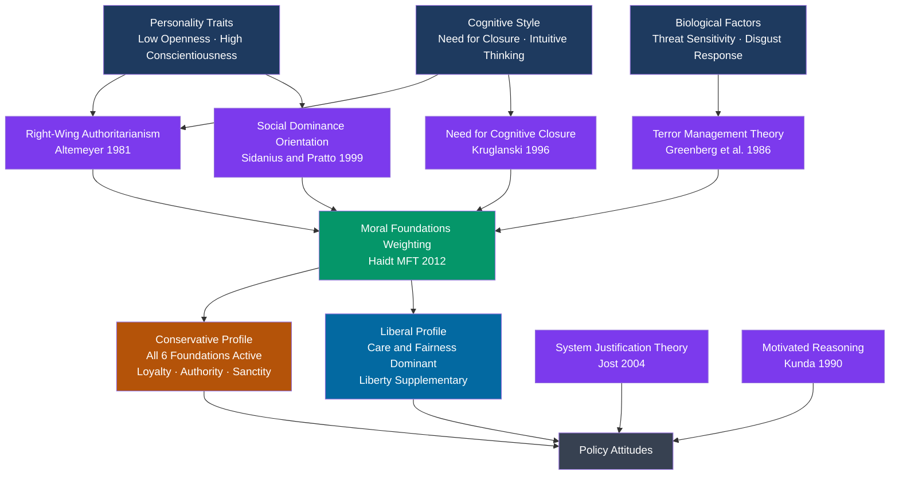

# Political Psychology and Ideology

> [!abstract] TL;DR
> Political psychology reveals that ideology is not assembled through deliberate policy analysis but emerges from deep psychological structures — personality traits, threat sensitivity, moral intuitions, and group identity — that operate largely beneath conscious awareness. Haidt's Moral Foundations Theory shows that liberals and conservatives are not reasoning from the same moral grammar: they are tuned to different foundations, which makes their disagreements feel literally incomprehensible to each other. Motivated reasoning, identity-protective cognition, and Terror Management Theory explain why evidence rarely changes political minds.

---

## Intuition

**Analogy:** Think of political ideology as a musical tuning system. Before any political debate begins, each person's mind is already "tuned" to amplify certain moral notes and attenuate others. A liberal's instrument is calibrated to hear Care and Fairness resonating loudly; the Authority, Loyalty, and Sanctity registers are present but quiet. A conservative's instrument is tuned to hear all six registers at roughly equal volume. When a politician speaks about immigration, the liberal hears mainly a care/harm melody — "Are children being separated? Are people suffering?" — while the conservative hears a full six-part chord: loyalty to compatriots, legitimate authority of borders, purity of national culture, fairness to those who waited in line, and so on.

They are not hearing the same song. Neither is mishearing it. They are processing the same stimulus through genuinely different moral perceptual systems — shaped by personality, biology, life experience, and group identity — and arriving at conclusions that feel to each side like pure common sense. This is why political argument so rarely changes minds: you cannot persuade someone by playing the Care register louder when their Authority-Sanctity strings are the ones vibrating.

---

## How It Works



---

## Key Concepts

### Secondary Level

**What Is Political Psychology?**

Political psychology is the scientific study of how psychological factors — personality, cognition, emotion, motivation, identity — shape political behavior, attitudes, and institutions. It asks: Why do people hold the political views they do? Why do they vote the way they do? Why do some people become authoritarians while others resist? Why does political argument so rarely produce genuine persuasion?

The field sits at the intersection of psychology and political science. Unlike political theory (which asks what political arrangements are *just*) or rational choice theory (which assumes voters optimize expected utility), political psychology takes seriously the empirical finding that human political reasoning is largely non-rational, motivated, and socially embedded.

**The Ideological Dimension(s)**

Most survey research represents political ideology on a single left-right or liberal-conservative dimension. This captures a real empirical regularity: in most Western democracies, knowing someone's position on abortion predicts their position on gun control, immigration, and welfare spending better than chance. This *constraint* — the tendency of positions to co-vary — is what we mean by "having an ideology."

However, the single dimension is an oversimplification. Two relatively independent dimensions appear consistently in cross-national data:

| Dimension | Left Pole | Right Pole |
|---|---|---|
| Economic | Redistribution, state ownership | Free markets, fiscal conservatism |
| Cultural / Social | Progressive norms, cosmopolitanism | Traditional values, nationalism |

The 2010s saw a decoupling in many democracies: economically left-leaning but culturally conservative voters (the "national-populist" constituency) became a distinct bloc not captured by a single dimension.

**Why People Hold Political Views They Do: A Quick Map**

Before diving into theories, here is the empirical picture. Political attitudes are substantially heritable (twin studies: ~50% of variance in ideology is genetic), moderated by personality, shaped by early socialization, and then subject to motivated reasoning around a social identity. The sequence is roughly:

1. Biological predispositions (threat sensitivity, disgust sensitivity, need for structure)
2. Personality traits (especially Openness to Experience, Conscientiousness)
3. Group identity formation (family, religion, class, region)
4. Exposure to political information filtered through motivated reasoning
5. Crystallization of ideological label ("I am a conservative/liberal") which then anchors all subsequent information processing

---

### Undergraduate Level

**The Authoritarian Personality and Right-Wing Authoritarianism**

*The Authoritarian Personality* (Adorno, Frenkel-Brunswik, Levinson, Sanford, 1950) was the first major systematic attempt to explain the psychological roots of fascism. Using psychoanalytic theory and the F-scale (Fascism scale), the authors argued that individuals with a certain personality type — formed through rigid, punitive child-rearing — would be especially susceptible to fascist appeals. The F-scale identified nine clusters: conventionalism, authoritarian submission, authoritarian aggression, anti-intraception (opposition to the subjective and imaginative), superstition and stereotypy, power and toughness, destructiveness and cynicism, projectivity (projecting unconscious impulses onto the external world), and exaggerated concern with sexuality.

The study was historically important but methodologically weak: the F-scale had acquiescence bias (all items were phrased so "strongly agree" always indicated authoritarianism), it could not distinguish right-wing from left-wing authoritarianism, and the psychoanalytic framework was unfalsifiable.

Bob Altemeyer's **Right-Wing Authoritarianism (RWA)** scale (1981, 1996) corrected these problems. RWA measures three attitudinal clusters:

1. **Authoritarian submission** — a high degree of submission to authorities perceived as legitimate
2. **Authoritarian aggression** — aggression directed against various persons, when such aggression is sanctioned by established authorities
3. **Conventionalism** — a high degree of adherence to the social conventions endorsed by society and established authorities

RWA is measured with balanced items (equal numbers phrased in pro- and anti-authoritarian directions) to eliminate acquiescence bias. It reliably predicts ethnocentrism, punitiveness, religious fundamentalism, and political conservatism across cultures. Critically, Altemeyer found that high-RWA individuals are especially dangerous not because they are sadists but because they are *followers* — they commit atrocities out of duty and conformity, not malice.

Methodological note: RWA measures attitudes, not personality. A person can score high on RWA because of learning and social environment, not just because of innate personality.

**Social Dominance Orientation (SDO)**

Jim Sidanius and Felicia Pratto's *Social Dominance Theory* (1999) identifies a second, independent psychological dimension that predicts political attitudes: **Social Dominance Orientation (SDO)** — the degree to which individuals desire group-based hierarchies and the dominance of "superior" groups over "inferior" ones.

SDO predicts support for military programs, opposition to social welfare, racism, sexism, and nationalism — independently of RWA. The two constructs capture different things:

| Dimension | Core Content | Political Correlate |
|---|---|---|
| **RWA** | Submission to authority; fear of disorder | Supports censorship, anti-crime laws, religious norms |
| **SDO** | Desire for group hierarchy | Opposes redistribution, supports military, disfavors minority rights |

The combination of high RWA and high SDO produces maximal prejudice and authoritarianism — Altemeyer called this the "lethal combination." RWA-dominant people submit to whoever is on top; SDO-dominant people want to be on top (or want their group to be). Together they supply both the leaders and the followers for authoritarian movements.

**System Justification Theory**

John Jost's **System Justification Theory** (2004) addresses a puzzle: why do disadvantaged groups often endorse ideologies that legitimate the very hierarchies that disadvantage them? Poor people supporting lower estate taxes; women endorsing gender stereotypes; ethnic minorities endorsing meritocracy narratives that obscure structural barriers.

Jost identifies three motive families that drive system justification:

1. **Ego justification** — maintaining positive self-image; people adapt their self-concept to the constraints of the system they live in
2. **Group justification** — defending the reputation of one's own social group
3. **System justification** — defending and legitimating the overall social system as fair, just, and desirable — even at the cost of ego or group interest

The psychological mechanism involves **cognitive dissonance reduction**: if you live in a system you cannot change, you reduce dissonance by convincing yourself the system is actually just. The weaker one's objective position, the stronger the motivated reasoning to justify the existing order.

Key finding: people who are *most disadvantaged* (low SES, high stigma) show the *strongest* system justification endorsement, especially when their group's position is framed as difficult to change. This is the psychological mechanism underlying what Marxists called "false consciousness."

**Terror Management Theory (TMT)**

Ernest Becker's *The Denial of Death* (1973) argued that awareness of mortality is the central fact of human psychology. Becker claimed that civilization itself is a system of "immortality projects" — ways of transcending biological death by participating in something that endures: cultural worldviews, religions, nations, children.

Jeff Greenberg, Sheldon Solomon, and Tom Pyszczynski translated Becker into an empirically testable framework. **Terror Management Theory** predicts that when mortality is made salient (reminders of death are activated), people respond by:

- Increasing investment in their cultural worldview as a buffer against existential anxiety
- Intensifying identification with their in-group
- Increasing hostility toward out-groups who threaten or challenge their worldview
- Showing increased preference for charismatic, death-transcending leaders
- Shifting political attitudes in a conservative direction

TMT has generated over 500 experiments. Key political findings:
- **Post-9/11 effect**: mortality salience manipulation studies conducted after September 2001 showed increased support for President Bush and for military intervention
- **Charismatic leadership**: mortality salience increases support for charismatic (rather than task-oriented) leaders who offer symbolic immortality through the nation
- **Cultural worldview defense**: mortality salience increases punitiveness toward norm violators and antipathy toward immigrants who challenge cultural coherence

**Ideological Constraint: The Converse Challenge**

Philip Converse's landmark 1964 paper "The Nature of Belief Systems in Mass Publics" made a deeply uncomfortable argument: most citizens do not have coherent ideologies. Elite political actors (politicians, journalists, intellectuals) have "constrained" belief systems — knowing their position on issue A reliably predicts their position on issue B. But for mass publics, survey responses to political questions are often essentially random — what Converse called "non-attitudes." When the same question was re-administered two years later, many respondents gave completely different answers.

Converse's interpretation: political ideology requires a degree of abstraction and sophistication that most citizens do not deploy. When a survey respondent says they are "moderate," they may be reporting a genuine middle position, or they may simply be reporting ignorance.

Later scholars contested this. Ideological constraint has increased since 1964 (reflecting sorting of the parties), and even low-information voters have consistent *group identity* cues that anchor their positions. But the core challenge remains: much of what looks like "ideology" in mass publics is really just partisan team identification.

**Motivated Reasoning**

Ziva Kunda's 1990 paper "The Case for Motivated Reasoning" established the theoretical framework: people do not reason neutrally about political information. They reason *directionally* — toward conclusions they are motivated to reach — while maintaining the subjective experience of reasoning objectively.

Mechanisms include:
- Selectively accessing and weighting evidence that supports the desired conclusion
- Setting lower standards of evidence for desired conclusions than undesired ones
- Constructing theories post-hoc to justify intuitions already reached
- Engaging in more elaborate processing of unwanted evidence — not to accept it, but to counter-argue it

Political application: partisan identity activates directional motivation. When shown identical economic statistics, conservatives and liberals interpret them differently depending on whose administration the data is attributed to. The "interpretation" of objective data becomes itself a form of political expression.

---

### Graduate Level

**Haidt's Social Intuitionist Model and Moral Foundations Theory**

Jonathan Haidt's pivotal paper "The Emotional Dog and Its Rational Tail" (2001) attacked the rationalist model of moral judgment (Kohlberg → Rawls: people reason their way to moral conclusions). Haidt proposed the **Social Intuitionist Model**: moral and political judgments are produced primarily by rapid, automatic, affective intuitions (System 1); the reasoning that follows is mostly post-hoc rationalization to justify the intuition already reached.

Haidt's metaphor: the rational self is like a press secretary — its job is not to determine policy but to defend whatever policy the president (intuition) has already decided. Moral reasoning is typically "motivated reasoning" in service of pre-existing intuitions.

**Moral Foundations Theory** (Haidt & Joseph 2004; Graham, Haidt & Nosek 2009; Haidt 2012) provides a taxonomic theory of moral intuitions. Drawing on evolutionary psychology and cultural anthropology, Haidt identifies six universal moral foundations — adaptive challenges in human evolutionary history that generated distinct moral sensing systems:

| Foundation | Adaptive Challenge | Triggers | Liberal | Conservative |
|---|---|---|---|---|
| **Care / Harm** | Protect vulnerable offspring | Suffering, vulnerability | High | Moderate |
| **Fairness / Reciprocity** | Cheating detection, reciprocal altruism | Proportionality, cheating | High | Moderate |
| **Loyalty / Betrayal** | Coalition formation, tribalism | Group threats, traitors | Low | High |
| **Authority / Subversion** | Navigating dominance hierarchies | Hierarchy cues, rebels | Low | High |
| **Sanctity / Degradation** | Pathogen and parasite avoidance | Purity, contamination | Low | High |
| **Liberty / Oppression** | Resistance to bullies and dominators | Coercion, autonomy | Moderate-High | Moderate |

The critical empirical finding from Haidt's MFQ survey data (yourmorals.org, ~350,000 respondents): **liberals' moral domain is primarily bounded by Care and Fairness; conservatives use all six foundations roughly equally.** This produces the moral communication gap: a liberal politician frames immigration as a Care issue (suffering families, vulnerable children); a conservative processes it through Loyalty, Authority, and Sanctity as well. The conservative response is not heartless indifference to suffering — it is that suffering is being weighed against other moral values the liberal is simply not hearing as moral values at all.

Sanctity deserves special attention. Evolved as a behavioral immune system — detecting and avoiding pathogens through disgust — the Sanctity foundation became moralized into notions of purity, taboo, and defilement that are politically powerful but entirely invisible to those who lack a robust Sanctity foundation. Much of the cultural conservative reaction to LGBTQ+ rights, multiculturalism, and certain public health policies is powered by the Sanctity foundation, which liberals tend to process as mere bigotry rather than as a (from the inside) genuinely moral response.

**Identity-Protective Cognition**

Dan Kahan's research program (2013, 2017) extends motivated reasoning to show that **cognitive sophistication amplifies rather than corrects partisan bias** when cultural identity is at stake. In a series of experiments, Kahan showed that:

1. More numerate conservatives evaluated gun control statistics correctly when the data favored gun control restrictions — *unless* the data was framed in a way that triggered partisan identity, in which case numeracy was used to find flaws in pro-restriction conclusions
2. Both liberal and conservative participants with high numeracy showed *more* motivated reasoning on politically charged topics than those with low numeracy
3. The mechanism is "identity-protective cognition" — sophisticated cognitive skills are selectively deployed to protect group identity, not to reach accurate conclusions

The policy implication is devastating: information campaigns aimed at changing political views through better evidence are likely to *increase* polarization among the most engaged, thoughtful partisans — precisely the audience most targeted by political communication.

**Dual-Process Models in Political Cognition**

Building on Kahneman's System 1/System 2 framework, political psychologists have shown that:

- Most political judgments are System 1 products: rapid, affect-laden, and generated before deliberate analysis begins
- System 2 processing does not neutrally evaluate but typically *elaborates* on System 1 outputs — building sophisticated arguments for conclusions already reached
- Political sophistication (high political knowledge) increases the *fluency* of motivated reasoning, not its accuracy
- The "gut-check" response to a political candidate (warm/cold, threatening/safe) shapes all subsequent information processing through confirmation bias and motivated reasoning chains

**John R. Hibbing's negativity bias research** (2008, 2014) showed that conservatives exhibit stronger *physiological* responses to threatening stimuli (larger skin conductance responses to aversive images, larger blink responses to threatening photographs). This suggests that ideological differences in risk perception are not purely cognitive but have biological substrates — threat-sensitive nervous systems naturally generate preference for strong authority, clear rules, and in-group protection.

**Big Five Personality Correlates of Ideology**

Meta-analyses across 20 countries consistently find:

| Big Five Trait | Correlation with Conservatism | Mechanism |
|---|---|---|
| **Openness to Experience** | Strong negative (r ≈ -0.35) | Preference for novelty vs. familiarity maps onto progressive vs. traditional orientation |
| **Conscientiousness** | Moderate positive (r ≈ +0.25) | Orderliness, rule-following, self-discipline → conservative values |
| **Neuroticism** | Weak positive for threat-based conservatism | Anxiety and threat sensitivity → security-seeking politics |
| **Agreeableness** | Weak negative (more disagreeable → SDO) | Tolerance for hierarchy and competition |
| **Extraversion** | Near zero | Social dominance motivation partially overlaps |

Openness is the strongest and most replicable predictor — it captures aesthetic openness, intellectual curiosity, and tolerance of ambiguity, all of which predict receptiveness to progressive social change.

**Epistemic Needs and Political Attitudes**

Arie Kruglanski's **Need for Cognitive Closure (NFC)** (1996) — the desire for definitive answers and aversion to ambiguity — predicts conservatism, particularly in uncertain or threatening conditions. High-NFC individuals:

- Prefer clear, unambiguous rules and hierarchies
- Show stronger in-group favoritism under uncertainty
- Are more susceptible to authoritarian appeals that offer simple, decisive solutions
- Exhibit faster political attitude crystallization — they "seize and freeze" on political positions

Experimental manipulation of NFC (through time pressure, noise, or cognitive load) produces temporary conservative shifts in political attitudes — providing a causal mechanism, not just a correlation.

Philip Tetlock's **Integrative Complexity** measure — the ability to acknowledge multiple perspectives and integrate them into higher-order constructions — shows that political moderates and liberals score higher than conservatives on average. However, complexity drops sharply *for everyone* under threat conditions, particularly conditions framing national security or moral contamination.

**Political Polarization as Psychological Phenomenon**

Contemporary ideological polarization is not merely a product of rational people with different values. The psychological literature identifies several amplifying mechanisms:

1. **Affective polarization** (Iyengar & Westwood, 2015): since the 1990s, partisan dislike of the out-party has grown dramatically — more than policy disagreement. Americans now view members of the opposing party as less intelligent, more dishonest, and more unpatriotic. This is *tribal* identity conflict more than ideological disagreement.

2. **False polarization**: people systematically overestimate the extremism of the political out-group. The perceived distance between the parties is larger than the actual distance in policy positions — a product of motivated perception.

3. **Epistemic closure and the information environment**: ideologically sorted media ecosystems do not primarily expose people to counter-arguments that activate motivated reasoning; they suppress exposure entirely, allowing moral foundations to diverge without challenge.

4. **The "Big Sort"** (Bishop, 2009): geographic self-sorting by ideology reduces cross-cutting social contact, depriving people of the interpersonal relationships across party lines that buffer affective polarization.

---

## Python Demo

```python
# Moral Foundations Theory — Jonathan Haidt et al. (2009, 2012)
# Simulate how differences in moral foundation weights produce systematic
# divergence in policy attitudes between liberal and conservative populations.
# Uses a linear factor model: policy_support = foundation_weights @ loadings.T

import numpy as np

rng = np.random.default_rng(42)

# 6 foundations: Care, Fairness, Loyalty, Authority, Sanctity, Liberty
FOUNDATIONS = ["Care", "Fairness", "Loyalty", "Authority", "Sanctity", "Liberty"]
N = 500  # individuals per group, 0-5 relevance scale

# Foundation profiles calibrated to Haidt et al. MFQ survey data (yourmorals.org)
# Liberals: high Care/Fairness, moderate Liberty, low Loyalty/Authority/Sanctity
# Conservatives: more even profile across all six foundations
LIB_MEANS = np.array([4.1, 3.9, 2.1, 1.9, 1.7, 3.3])
CON_MEANS = np.array([3.3, 3.1, 3.7, 3.8, 3.6, 2.7])
SIGMA = 0.65  # within-group standard deviation

lib_f = np.clip(rng.normal(LIB_MEANS, SIGMA, (N, 6)), 0, 5)
con_f = np.clip(rng.normal(CON_MEANS, SIGMA, (N, 6)), 0, 5)

# -----------------------------------------------------------------------
# Factor model: policy_support = foundations @ loadings.T
# Positive loading: that foundation drives support for the policy
# Negative loading: that foundation drives opposition to the policy
# Foundation order: Care  Fairness  Loyalty  Authority  Sanctity  Liberty
# -----------------------------------------------------------------------
POLICIES = [
    "Gun control",
    "Universal healthcare",
    "Capital punishment",
    "Immigration restriction",
    "Same-sex marriage",
    "Military spending",
    "Drug decriminalization",
    "Religious school subsidies",
    "Climate change action",
    "Affirmative action",
]

LOADINGS = np.array([
#   Care  Fair  Loy   Auth  Sanct  Lib
    [ 0.5,  0.2, -0.3, -0.4,  0.0,  0.1],   # Gun control (Care+, Authority-)
    [ 0.6,  0.5, -0.1, -0.2, -0.1, -0.2],   # Universal healthcare (Care+, Fair+)
    [-0.3, -0.3,  0.3,  0.6,  0.3,  0.0],   # Capital punishment (Auth+, Care-)
    [-0.2, -0.1,  0.5,  0.4,  0.3,  0.0],   # Immigration restriction (Loy+, Auth+)
    [ 0.4,  0.4, -0.3, -0.5, -0.6,  0.4],   # Same-sex marriage (Care+, Sanct-)
    [-0.1,  0.0,  0.5,  0.5,  0.1, -0.2],   # Military spending (Loy+, Auth+)
    [ 0.1,  0.2, -0.2, -0.4, -0.3,  0.6],   # Drug decriminalization (Lib+, Auth-)
    [-0.1,  0.0,  0.3,  0.4,  0.5, -0.1],   # Religious school subsidies (Sanct+, Auth+)
    [ 0.5,  0.4, -0.1, -0.2, -0.1,  0.0],   # Climate change action (Care+, Fair+)
    [ 0.4,  0.6, -0.2, -0.3, -0.2,  0.1],   # Affirmative action (Fair+, Care+)
])

lib_pol = lib_f @ LOADINGS.T   # shape (N, 10)
con_pol = con_f @ LOADINGS.T   # shape (N, 10)

lib_mean_pol = lib_pol.mean(axis=0)
con_mean_pol = con_pol.mean(axis=0)

print("MORAL FOUNDATION PROFILES (mean relevance score, 0-5 scale)")
print(f"{'Foundation':<12} {'Liberal':>10} {'Conservative':>14} {'L minus C':>10}")
print("-" * 50)
for j, fd in enumerate(FOUNDATIONS):
    l, c = lib_f[:, j].mean(), con_f[:, j].mean()
    print(f"{fd:<12} {l:>10.2f} {c:>14.2f} {l - c:>+10.2f}")

print("\nPREDICTED POLICY SUPPORT SCORE (linear factor model output)")
print(f"{'Policy':<28} {'Liberal':>10} {'Conservative':>14} {'L minus C':>10}")
print("-" * 66)
for i, pol in enumerate(POLICIES):
    l, c = lib_mean_pol[i], con_mean_pol[i]
    marker = " <<" if abs(l - c) > 1.2 else ""
    print(f"{pol:<28} {l:>10.2f} {c:>14.2f} {l - c:>+10.2f}{marker}")

# Illustrate identity-protective cognition:
# Split liberals by numeracy (proxy: above/below median Care score as a stand-in)
# A high-Care liberal should show MORE motivated reasoning on humanitarian policies
care_idx = FOUNDATIONS.index("Care")
climate_idx = POLICIES.index("Climate change action")
lib_high_care = lib_f[:, care_idx] > np.median(lib_f[:, care_idx])
r_full = np.corrcoef(lib_f[:, care_idx], lib_pol[:, climate_idx])[0, 1]
print(f"\nCorrelation(Care score, Climate support) in liberal sample: r = {r_full:.3f}")
print("High-Care liberals show stronger climate support — Care foundation drives the policy.")
```

The output shows the predicted divergence: liberals score higher on gun control, healthcare, same-sex marriage, climate action, and affirmative action; conservatives score higher on capital punishment, immigration restriction, military spending, and religious school subsidies. The differences emerge not from factual disagreement but from different foundation profiles weighting the same policies through different moral registers.

---

## Real-World Applications

**9/11 and Terror Management in the Wild**

Studies conducted before and after the September 11 attacks showed that mortality salience in the ambient political environment produced measurable shifts toward authoritarian, militaristic, and in-group-favoring attitudes. TMT researchers Pyszczynski, Solomon, and Greenberg documented that after the attacks, Americans increased support for charismatic political leadership (Bush's approval rating surged from 51% to 90%), endorsed military intervention with less evidence than they otherwise would, and showed increased hostility toward dissenting voices as "unpatriotic" worldview threats. The mechanism was not strategic calculation but existential anxiety management.

**Brexit and the Sanctity Foundation**

Analyses of Brexit voting (Kaufmann 2018, YouGov data) found that concern about immigration was not primarily economic — Remain-voting regions with higher immigration exposure voted differently from Leave-voting regions with lower exposure. The strongest predictors of Leave were cultural: national identity strength, disgust sensitivity, and attitudes toward social change. The Sanctity foundation — cultural purity, contamination anxiety about demographic change — explained variance that economic models could not. This does not mean Brexit voters were wrong; it means the moral motivation was primarily Sanctity/Loyalty rather than economic calculation.

**The "Death Tax" vs. "Estate Tax" Framing**

Frank Luntz's messaging research (and subsequent political science studies) showed that calling the inheritance tax the "death tax" rather than the "estate tax" shifted public opinion toward opposition among *low-income respondents who would never pay it* — people who, on a purely material basis, had no stake in the question. The "death" framing activated mortality salience and the Sanctity foundation. The policy attitude had nothing to do with self-interest and everything to do with moral foundation triggering.

**Moral Foundations in Political Messaging (2012 Obama Campaign)**

Robb Willer and Matthew Feinberg's research (2015) showed that reframing liberal policy arguments in conservative moral foundations terms dramatically increased persuasiveness with conservative audiences. Arguments for same-sex marriage framed in terms of patriotism and Loyalty ("gay Americans serve and die for this country") were more persuasive with conservatives than Care-based arguments. Arguments for environmental regulation framed in terms of Purity ("keep our land clean and uncontaminated") outperformed Care-framing. The Obama 2012 campaign applied related insights in its messaging strategy.

---

## Common Pitfalls

- **"Conservatives are just authoritarian followers"** — RWA and authoritarianism describe tendencies, not types. Most high-RWA individuals are not proto-fascists; they are prosocial within their in-group, law-abiding, and community-oriented. The danger is not individual character but collective behavior under conditions of perceived threat. Reducing the finding to "conservatives are authoritarians" misrepresents the research and forecloses understanding.

- **"Liberals are purely rational"** — Motivated reasoning and identity-protective cognition apply symmetrically. Liberals show equivalent directional reasoning when their identity is at stake. The asymmetry in some studies (conservatives show stronger threat responses, RWA) reflects genuine empirical differences in *content* — not an absence of irrationality on the left. Kahan explicitly showed high-numerate liberals reason just as strategically on topics threatening liberal identity.

- **"Moral Foundations Theory means relativism"** — Haidt's descriptive finding that different groups use different foundations does not imply that all foundations are equally valid or that no political positions are objectively better than others. MFT describes how moral intuitions vary; it does not settle normative disputes about which foundations should be weighted how.

- **"Changing information will change minds"** — The entire arc of research from Converse through Kahan points to the same conclusion: beliefs embedded in social identity are not primarily information states that respond to evidence. They are identity expressions that recruit evidence in their defense. Campaigns aimed at persuasion through better facts almost always fail or backfire (the "backfire effect") among strongly identified partisans.

- **Conflating ideology with policy preference** — A person can hold conservative *identity* and liberal *policy positions* (or vice versa) because ideological labels are primarily group identity markers among mass publics (Converse's point), not positions on a coherent policy agenda. The label "conservative" is processed tribally by most voters, not as a commitment to a philosophical program. This is why policy cross-pressures (e.g., a union member who is also socially conservative) are so common and so politically volatile.

---

## Related Concepts

- [[_MOC_Political_Behavior_and_Democracy|↑ Political Behavior and Democracy MOC]] — section entry point and concept map for all six notes in this cluster.
- [[Conservatism_and_Traditionalism]] — Haidt's Sanctity, Authority, and Loyalty foundations map directly onto Burke's organic society, Chesterton's Fence, and the conservative epistemic claim that inherited institutions encode knowledge; political psychology provides the psychological mechanism for why conservative intuitions have this structure
- [[Liberalism_and_Its_Variants]] — The Care and Fairness foundations are the psychological substrate of liberal ethics; Rawlsian justice theory formalizes what MFT identifies as intuitive: impartial harm-prevention and fair distribution
- [[Authoritarianism_and_Hybrid_Regimes]] — RWA and SDO are the psychological micro-foundations of authoritarian *support*; Altemeyer's work explains why ordinary citizens follow authoritarian leaders; Terror Management Theory explains the emotional conditions under which authoritarianism becomes attractive
- [[Democracy_Types_and_Electoral_Systems]] — Converse's non-attitudes challenge democratic theory's assumption that citizens hold meaningful preferences that elections aggregate; identity-protective cognition challenges deliberative democracy models
- [[Moral_Development]] — Kohlberg's stages assume moral reasoning drives judgment; Haidt's Social Intuitionist Model directly challenges this, arguing intuition precedes and drives reasoning; MFT's six foundations extend Kohlberg's two-dimensional justice framework
- [[Cognitive_Biases]] — Motivated reasoning, confirmation bias, and in-group favoritism are the cognitive architecture through which political identity shapes information processing; all three appear in both the Cognitive Biases literature and political psychology
- [[Attitudes_and_Persuasion]] — The Elaboration Likelihood Model predicts when political messages are processed centrally (rare) vs. peripherally (common); Cialdini's Authority and Social Proof principles overlap directly with RWA and SDO dynamics
- [[Prejudice_and_Discrimination]] — In-group/out-group dynamics (Tajfel and Turner's Social Identity Theory) provide the group identity substrate that anchors political ideology; authoritarianism correlates strongly with generalized out-group prejudice
- [[Group_Dynamics]] — Political parties function as psychological in-groups; group polarization (groups discussing politics become more extreme than any individual member) explains why partisan environments amplify rather than moderate ideology

---

## Review Questions

### Secondary
1. According to Haidt's Moral Foundations Theory, why might a conservative and a liberal look at the same immigration policy and reach opposite moral conclusions — even if both care about human suffering? Use the specific foundations to explain the disagreement.
2. What does it mean to say that political attitudes are "motivated"? Give a concrete example of a person processing political information in a motivated vs. accuracy-driven way.

### Undergraduate
3. Right-Wing Authoritarianism (RWA) and Social Dominance Orientation (SDO) are described as independent dimensions that together predict political extremism. Design a scenario in which a person high on RWA but low on SDO would behave differently from a person low on RWA but high on SDO. What does this reveal about the two constructs?
4. System Justification Theory predicts that disadvantaged group members will endorse ideologies that legitimate their disadvantage. What are the three motivational mechanisms Jost identifies, and under what conditions does system justification become strongest? What are the policy implications for social movements?
5. Converse argued that mass publics have "non-attitudes." If this is correct, what does it imply about the meaningfulness of public opinion polling, and how should political campaigns be designed differently than the rationalist voter model would suggest?

### Graduate
6. Haidt's Social Intuitionist Model holds that moral reasoning is primarily post-hoc rationalization. Kahan's identity-protective cognition research shows that sophisticated reasoners show *more* motivated reasoning on identity-threat topics. What are the implications of these two findings taken together for deliberative democracy theory (Habermas, Cohen), which assumes that rational discourse can produce legitimate political consensus?
7. Terror Management Theory predicts that mortality salience increases conservatism, in-group favoritism, and preference for charismatic leadership. Critically evaluate this as an account of post-9/11 American politics. What alternative explanations compete with TMT, and how would you design a study to distinguish them?
8. The six moral foundations show cross-cultural universality but cross-individual variation. Given Hibbing's research showing physiological correlates of political threat sensitivity, and behavior genetic studies showing ~50% heritability of ideology, design a research program to disentangle genetic, developmental, and cultural contributions to moral foundation weighting. What methodological and ethical challenges arise?

---

## Sources

- Jonathan Haidt, *The Righteous Mind: Why Good People Are Divided by Politics and Religion* (Pantheon, 2012)
- Jonathan Haidt, "The Emotional Dog and Its Rational Tail," *Psychological Review* 108(4), 2001
- Jesse Graham, Jonathan Haidt, and Brian Nosek, "Liberals and Conservatives Rely on Different Sets of Moral Foundations," *Journal of Personality and Social Psychology* 96(5), 2009
- T.W. Adorno, E. Frenkel-Brunswik, D. Levinson, and R.N. Sanford, *The Authoritarian Personality* (Harper, 1950)
- Bob Altemeyer, *Right-Wing Authoritarianism* (University of Manitoba Press, 1981)
- Bob Altemeyer, *The Authoritarian Specter* (Harvard University Press, 1996)
- Jim Sidanius and Felicia Pratto, *Social Dominance: An Intergroup Theory of Social Hierarchy and Oppression* (Cambridge UP, 1999)
- John T. Jost, Jack Glaser, Arie Kruglanski, and Frank Sulloway, "Political Conservatism as Motivated Social Cognition," *Psychological Bulletin* 129(3), 2003
- Jeff Greenberg, Sheldon Solomon, and Tom Pyszczynski, "Terror Management Theory of Self-Esteem," *Advances in Experimental Social Psychology* 20, 1986
- Philip Converse, "The Nature of Belief Systems in Mass Publics," in David Apter, ed., *Ideology and Discontent* (1964)
- Ziva Kunda, "The Case for Motivated Reasoning," *Psychological Bulletin* 108(3), 1990
- Dan Kahan, Ellen Peters, Erica Cantrell Dawson, and Paul Slovic, "Motivated Numeracy and Enlightened Self-Government," *Behavioural Public Policy* 1(1), 2017
- John Hibbing, Kevin Smith, and John Alford, "Differences in Negativity Bias Underlie Variations in Political Ideology," *Behavioral and Brain Sciences* 37(3), 2014
- Robb Willer and Matthew Feinberg, "From Gulf to Bridge: When Do Moral Arguments Facilitate Political Influence?" *Personality and Social Psychology Bulletin* 41(12), 2015
- Arie Kruglanski and Donna Webster, "Motivated Closing of the Mind: 'Seizing' and 'Freezing'," *Psychological Review* 103(2), 1996

---

#PoliticalScience #PoliticalBehavior #PoliticalPsychology #Ideology
