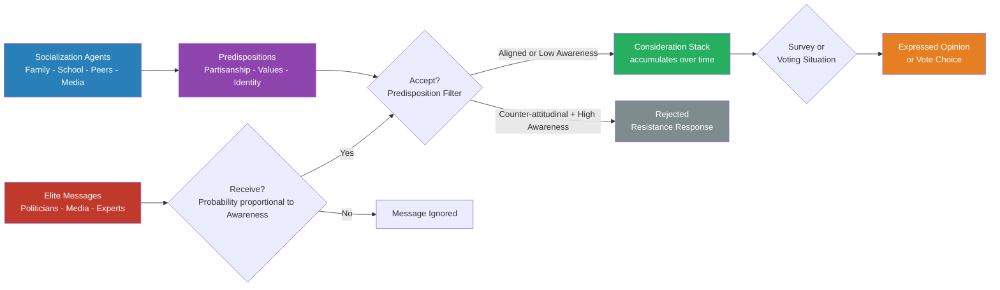

# Public Opinion and Political Socialization

> [!abstract] TL;DR
> Public opinion is not a pre-formed preference citizens carry around — it is a real-time construction built from the elite messages they receive, filtered through predispositions they absorbed over a lifetime. Zaller's Receive-Accept-Sample (RAS) model is the dominant formal account: awareness governs exposure, predisposition governs acceptance, and sampling from the consideration stack governs expression. Political socialization — through family, school, peers, and media — installs those predispositions long before any specific issue arises. Understanding these two interlocked processes explains why elite consensus moves opinion efficiently, why elite conflict polarizes the attentive public, and why survey responses can look like "opinion" without reflecting any considered preference at all.

---

## Intuition

**Analogy:** Imagine a city's newspaper stands as "elite message dispensers." A politically engaged citizen reads five papers a day and has strong views — they pick up almost every message, but discard the ones that clash with their worldview. A disengaged citizen glances at a single headline occasionally — they receive fewer messages but, having no strong filter, tend to accept whatever they see. When all newspaper editors agree (elite consensus), everyone drifts in the same direction, with engaged readers drifting most. When the editors are feuding (elite conflict), engaged readers sort into camps mirroring their prior leanings, while disengaged readers fluctuate with whichever paper happened to catch their eye. Ask either group "what do you think?" and they report the last coherent thought their mind sampled — which may have nothing to do with a considered, stable preference.

The "standing stock" of predispositions — which papers you trust, which worldview feels natural — was not chosen consciously in adulthood. It was installed during childhood and adolescence through family dinner-table politics, school civics, peer identity, and the media environment you grew up inside. That early installation is political socialization. Everything that follows — how you process campaign messages, whether you vote, what you tell a pollster — runs through that pre-installed filter.

---

## How It Works

### Core Mechanics

Opinion formation unfolds in two phases:

**Phase 1 — Socialization (long-run, dispositional):** Agents over the life course — primarily family, then school, peers, and mass media — transmit values, partisan identities, and ideological orientations. By early adulthood most citizens have a stable predispositional framework that shapes how they process specific policy messages.

**Phase 2 — Online processing (short-run, issue-specific):** Following Zaller's RAS model, specific policy opinions emerge through three micro-steps applied repeatedly over a stream of elite messages:
1. **Receive** — A citizen encounters a political message. The probability of reception is an increasing function of political awareness (educational attainment, interest, media consumption). High-awareness citizens receive more messages; low-awareness citizens receive fewer.
2. **Accept** — A received message enters the citizen's "consideration stock" only if it survives a predispositional filter. Counter-attitudinal messages are resisted in proportion to awareness: a politically sophisticated conservative strongly resists a liberal elite cue; an apathetic citizen of the same formal party ID accepts it because they lack the cognitive tools to identify and resist the inconsistency.
3. **Sample** — When asked for an opinion (in a survey, a conversation, or a voting booth), the citizen does not average all stored considerations. They sample the top — the most recently activated or most cognitively accessible — consideration and report it. This is why small changes in question order or framing can shift measured "opinion" by ten percentage points: they change which consideration sits at the top of the stack.

### Flow / Architecture



---

## Key Concepts

### Secondary Level

#### Opinion, Attitude, and Value — Three Distinct Things

Political scientists use these terms precisely and the distinctions matter for measurement:

| Concept | Definition | Stability | Example |
|---------|-----------|-----------|---------|
| **Value** | Abstract, trans-situational principle | Very high | "Individual freedom matters more than collective equality" |
| **Attitude** | Evaluative disposition toward a specific object | High | "I support stricter gun laws" |
| **Opinion** | Verbal expression of a position at a given moment | Low | "I support background checks" (said in a specific survey) |

Lippmann (1922) coined "pictures in our heads" to describe the simplified mental maps citizens use to navigate a world too large and complex for direct experience. These mental maps are not neutral descriptions — they are frames shaped by culture, socialization, and elite messaging, and they determine what political "facts" citizens even notice.

#### Socialization Agents

**Family** is the single most powerful socialization agent. Partisan identification is transmitted from parent to child with remarkable fidelity — roughly 75% of adults share their parents' party ID. The mechanism is not explicit political instruction but ambient exposure: overhearing political discussions, absorbing emotional cues about political figures, learning which newspapers and TV channels "people like us" trust.

**School** transmits civic norms (voting, rule of law, democratic participation) more reliably than partisan content. In politically contested democracies, curriculum battles reflect elite recognition that schools are socialization instruments; in authoritarian states, school curricula are the primary channel for manufactured political loyalty.

**Peers** matter most during adolescence and early adulthood — the period of "impressionable years" identified in cohort studies. Political socialization is not complete at 18; peer networks in college, military service, and early workplaces continue to shape partisan and ideological identity through roughly age 30.

**Media** functions as a socialization agent for political context frames. In the broadcast era (1950–1990), shared exposure to a small number of dominant news sources produced a relatively common informational baseline. The fragmented media environment of the 2000s onward — cable news, social media, algorithmic personalization — enables citizens to inhabit entirely distinct informational worlds, reinforcing rather than challenging predispositions.

#### Framing and Priming

**Framing** (Entman, 1993): how an issue is *defined* shapes how citizens *evaluate* it. The same policy of restricting immigration can be framed as "protecting jobs" (activates economic resentment) or "keeping families apart" (activates humanitarian norms). Both frames are factually accurate; they trigger different value commitments and produce different opinion distributions.

**Priming** (Iyengar and Kinder, 1987): media coverage changes the *standards* citizens use to evaluate political leaders. During an economic recession, heavy media coverage of unemployment primes economic considerations; the president is then evaluated primarily on economic grounds. The effect is not persuasion — citizens are not told to change their minds — it is a change in *which criterion* is salient when the judgment is made.

#### Spiral of Silence (Noelle-Neumann, 1974)

Elisabeth Noelle-Neumann proposed that individuals continuously monitor the perceived climate of opinion around them. When they believe their views are in the minority, fear of social isolation motivates silence. This produces a self-reinforcing spiral: minority opinions are suppressed, suppression makes them appear even smaller, which increases the social cost of expressing them, reinforcing further silence. The dominant opinion gains volume not because more people hold it but because fewer people publicly contest it.

**Key implication:** Measured public opinion systematically underrepresents minority views, particularly when the social cost of expressing them is high. Polling in authoritarian contexts, or on socially stigmatized topics (racism, religious doubt, sexual identity in conservative communities), is especially susceptible.

---

### Undergraduate Level

#### Zaller's Four Axioms (1992)

John Zaller's *The Nature and Origins of Mass Opinion* (1992) is built on four behavioral axioms:

1. **Reception Axiom** — The greater a citizen's level of conceptual complexity and attentiveness to politics, the more likely they are to be exposed to and comprehend political messages.
2. **Resistance Axiom** — People who are aware of cues that are inconsistent with their political predispositions tend to resist those cues.
3. **Accessibility Axiom** — The more recently a consideration has been called to mind or thought about, the more likely it is to be at the top of one's head and sampled.
4. **Response Axiom** — Individuals answer survey questions by averaging across the considerations that are accessible at the moment of the question.

These four axioms, combined with a model of elite communication, generate a series of empirical predictions that have been tested across many countries and political contexts.

**The "two-message" model:** Under elite *conflict*, the effect of messages on public opinion is non-monotonic with awareness. Very low-awareness citizens receive few messages and have random opinions. High-awareness citizens receive many messages from both sides but filter along predispositional lines — the liberal elite messages reach liberals, who accept them, while conservative messages reach conservatives, who accept them. The result is *polarization among the attentive* and *instability among the inattentive*. Under elite *consensus*, even high-awareness citizens can be moved because resistance requires a counter-message to resist — and one doesn't exist.

#### Elite Cueing and Opinion Leadership

The idea that most citizens form opinions by following trusted elites (Converse, 1964; Lupia and McCubbins, 1998) is the most politically consequential finding in mass opinion research. Converse's classic 1964 study found that most Americans held "non-attitudes" on policy questions — responses that were essentially random noise rather than stable preferences. This challenged the normative democratic assumption that citizens have coherent, considered views waiting to be aggregated.

Opinion leadership operates through two channels:
- **Partisan cueing:** Citizens use the party label as a heuristic. When the president endorses a policy, partisan supporters shift toward it and partisans of the opposition shift away — even when the policy itself has not changed. Republicans supported the Affordable Care Act provisions in isolation but opposed "Obamacare" as a package; Democrats showed the reverse pattern.
- **Expert cueing:** Citizens with low issue-specific knowledge defer to perceived experts. The COVID-19 pandemic demonstrated that whom citizens trusted as an "expert" (epidemiologists, the CDC, their governor, Fox News medical correspondents) determined opinion on masking, vaccination, and lockdowns more than information content.

#### Deliberative Democracy vs. Mass Opinion

Jürgen Habermas's deliberative democracy model holds that legitimate political decisions must emerge from rational, inclusive public discourse — citizens exchange reasons, revise views in light of better arguments, and reach considered judgments. This normative ideal confronts the empirical picture presented by Zaller, Converse, and the social-psychology literature on attitude formation:

| Deliberative Model | Empirical Reality |
|-------------------|------------------|
| Citizens hold considered preferences | Most citizens hold "non-attitudes" on most issues |
| Persuasion changes minds through argument quality | Peripheral cues, source trust, and framing dominate |
| Information improves judgment | Politically motivated reasoning uses information to reinforce priors |
| Public deliberation aggregates wisdom | Echo chambers fragment common epistemic ground |

The deliberative model is not falsified by these findings — it is a normative ideal, not a description. But it does demand institutional designs (citizens' assemblies, deliberative polls, structured dialogues) that reproduce deliberation artificially rather than relying on natural mass communication processes.

#### Preference Falsification (Kuran, 1995)

Timur Kuran's *Private Truths, Public Lies* documents a distinct mechanism: citizens publicly express preferences that differ from their private ones because the social or political cost of expressing true preferences is too high. Preference falsification is not mere silence (Noelle-Neumann) — it is active misrepresentation.

Two macro-level implications:

1. **Pluralistic ignorance:** When enough people falsify preferences, the publicly visible distribution becomes a collective illusion. Everyone thinks they are alone in dissenting; in fact, dissent is widespread but invisible. When one person breaks the illusion — often because a triggering event lowers the cost of expression — cascades of preference revelation can occur with astonishing speed.

2. **Revolutionary cascades:** The collapse of communist regimes in Eastern Europe (1989) exemplified preference falsification at scale. Decades of authoritarian socialization had created the appearance of ideological consensus; private dissent was widespread but invisible. Once cascade thresholds were crossed — East Germany's Monday demonstrations, the fall of the Berlin Wall — preference revelation occurred in days. Kuran's model explains why such revolutions appear sudden to outside observers: the preconditions were building for years beneath the surface of falsified public opinion.

---

### Graduate Level

#### Measurement Problems in Survey Research

The survey instrument is the primary tool for measuring public opinion, but it introduces systematic biases that complicate inference:

**Question wording effects:** The same substantive question worded differently produces substantially different response distributions. Schuman and Presser (1981) showed that support for "allowing" vs. "forbidding" communist speech differed by 25 percentage points. "Allowing" frames permission as the default; "forbidding" frames prohibition. Neither is neutral.

**Acquiescence bias (yea-saying):** Respondents disproportionately agree with statements regardless of content. This is more pronounced among low-education respondents and is particularly problematic for Likert scales. Balanced statements ("the government should do X" vs. "the government should not do X") partially mitigate this.

**Social desirability bias:** Respondents over-report socially approved behaviors (voting, charitable giving, reading) and under-report socially condemned behaviors (prejudice, law violation). In politically charged surveys, expressed opinions shade toward what the respondent believes the interviewer or "society" expects. List experiments, randomized response technique (RRT), and implicit attitude measures attempt to recover sincere preferences.

**Non-attitudes and top-of-the-head responses:** Converse (1964) showed that for many issues, survey responses are random noise — citizens provide answers to questions they have never considered because the social norm is to answer rather than admit ignorance. Distinguishing genuine attitudes from survey artifacts requires multiple-wave panel data or split-ballot experiments.

**The Mood of the Country / Policy Mood (Stimson, 1991):** Despite individual-level noise, aggregate public opinion moves systematically. James Stimson's "policy mood" index — constructed from hundreds of survey questions over decades — shows that aggregate public opinion moves in predictable, thermostatic ways: as government policy moves left, public mood shifts right (satisfied with change, now seeking moderation), and vice versa. The thermostatic model implies that governments consistently overshoot their mandates.

#### Online Information Environments and Echo Chambers

The "echo chamber" thesis (Sunstein, 2001; Pariser, 2011) holds that algorithmically curated social media feeds expose users only to opinion-consistent content, reinforcing predispositions, reducing cross-cutting exposure, and driving polarization. Empirical evidence is more nuanced:

- **Selective exposure**: Users actively choose like-minded sources, independent of algorithmic curation. Twitter/X data shows that most users' networks are ideologically homogeneous; but they also observe cross-cutting content and frequently engage with it.
- **Algorithmic amplification**: Facebook's own internal research (leaked 2021, published by Horwitz and others) showed that the engagement algorithm amplified outrage-inducing and divisive content disproportionately, because such content generates high engagement metrics.
- **Cross-cutting effects**: Bail et al. (2018, *Science*) showed that Twitter users who were shown opposing-party messages became *more* partisan, not less — consistent with the Zaller resistance axiom. Exposure to counter-attitudinal messages triggers motivated reasoning and backlash.

The evidence suggests that online environments accelerate and amplify the two mechanisms Zaller identified — reception (now personalized and immersive) and resistance (now reinforced by algorithmic engagement incentives) — without qualitatively changing the underlying process.

#### Political Socialization Across the Life Course

**Impressionable years hypothesis** (Mannheim, 1928; Markus, 1979): Partisan and ideological identities formed between ages 14 and 24 are especially durable because they coincide with identity formation. This predicts cohort effects: a generation that politically comes of age during an economic crisis, a war, or a transformative social movement should carry distinctive political identities for life.

Evidence: Americans who reached political maturity during the New Deal (1930s) maintained stronger Democratic identification than age-equivalent cohorts; those who came of age during Reagan's presidency showed persistent Republican leanings; those politicized by the 2008 financial crisis and later by the Sanders movement showed leftward economic orientation independent of later events.

**Political learning in adulthood:** Life-cycle effects also operate. Homeownership, parenthood, and income increase tend to shift partisan identification modestly rightward. Divorce and economic precarity shift modestly leftward. These are smaller than cohort effects but statistically detectable.

---

## Python Demo

```python
import numpy as np

# Simulate Zaller's Receive-Accept-Sample (RAS) model.
# Citizens differ in political awareness (governs reception)
# and predisposition (governs acceptance of counter-messages).
# We compare elite CONSENSUS vs. elite CONFLICT.

np.random.seed(42)
N = 1_000  # citizens

# awareness ~ Beta(2,2): most citizens near 0.5, few at extremes
awareness   = np.random.beta(2, 2, N)
# predisposition: -1 = strong liberal, +1 = strong conservative
predispose  = np.random.uniform(-1.0, 1.0, N)


def run_ras(awareness, predispose, n_waves=10, elite_bias=1.0, seed=0):
    """
    Receive-Accept-Sample simulation.

    Parameters
    ----------
    awareness   : array[N]  citizen awareness in [0, 1]
    predispose  : array[N]  predisposition in [-1, +1]
    n_waves     : int       number of message exposure rounds
    elite_bias  : float     +1 = all pro-policy; 0 = 50-50 conflict; -1 = all anti
    seed        : int       RNG seed
    """
    rng            = np.random.default_rng(seed)
    considerations = np.zeros(len(awareness))

    for _ in range(n_waves):
        # --- RECEIVE ---
        # High-awareness citizens are more likely to encounter each message
        received = rng.random(len(awareness)) < awareness

        # --- MESSAGE VALENCE from elites ---
        if elite_bias == 1.0:
            valence = np.ones(len(awareness))
        elif elite_bias == -1.0:
            valence = -np.ones(len(awareness))
        else:
            # Elite conflict: random 50-50 each wave
            valence = rng.choice([-1.0, 1.0], size=len(awareness))

        # --- ACCEPT ---
        # alignment > 0 means message matches predisposition
        alignment = valence * np.sign(predispose)
        # Aligned messages: high acceptance regardless of awareness
        # Counter messages: aware citizens resist; unaware citizens accept
        p_accept = np.where(
            alignment > 0,
            0.90,
            np.clip(1.0 - awareness * 0.85, 0.05, 0.95)
        )
        accepted = received & (rng.random(len(awareness)) < p_accept)
        considerations += accepted * valence  # accumulate signed considerations

    return considerations


# --- Run both scenarios ---
c_consensus = run_ras(awareness, predispose, n_waves=10, elite_bias= 1.0, seed=1)
c_conflict  = run_ras(awareness, predispose, n_waves=10, elite_bias= 0.0, seed=2)


def sample_opinion(considerations, rng_seed=99):
    """
    SAMPLE step: citizens report the top consideration with noise.
    Returns array of +1 (support) or -1 (oppose).
    """
    rng   = np.random.default_rng(rng_seed)
    noise = rng.normal(0, 0.3, len(considerations))
    return np.sign(considerations + noise)


op_consensus = sample_opinion(c_consensus, rng_seed=10)
op_conflict  = sample_opinion(c_conflict,  rng_seed=11)

# --- Stratify by awareness tercile ---
lo_aw = awareness < np.percentile(awareness, 33)
hi_aw = awareness > np.percentile(awareness, 67)

# --- Report ---
print("Zaller Receive-Accept-Sample (RAS) Simulation")
print("=" * 56)
print(f"Citizens: {N}  | Awareness: mean={awareness.mean():.2f}  std={awareness.std():.2f}")
print(f"Predisposition: mean={predispose.mean():.2f}  std={predispose.std():.2f}")
print()

print("SCENARIO A: Elite Consensus (all elites send pro-policy messages)")
print("-" * 56)
print(f"  Overall support rate:            {(op_consensus > 0).mean()*100:5.1f}%")
print(f"  Low-awareness  citizens support: {(op_consensus[lo_aw] > 0).mean()*100:5.1f}%")
print(f"  High-awareness citizens support: {(op_consensus[hi_aw] > 0).mean()*100:5.1f}%")
print(f"  Polarization (std of considerations): {c_consensus.std():.3f}")
print()

print("SCENARIO B: Elite Conflict (50/50 pro and anti messages)")
print("-" * 56)
print(f"  Overall support rate:            {(op_conflict > 0).mean()*100:5.1f}%")
print(f"  Low-awareness  citizens support: {(op_conflict[lo_aw] > 0).mean()*100:5.1f}%")
print(f"  High-awareness citizens support: {(op_conflict[hi_aw] > 0).mean()*100:5.1f}%")
print(f"  Polarization (std of considerations): {c_conflict.std():.3f}")
print()

# --- Predispositional sorting under conflict ---
lib_mask = predispose < -0.3
con_mask = predispose >  0.3

print("Predispositional sorting under Elite Conflict:")
print(f"  Liberal predispositions  -> support rate: {(op_conflict[lib_mask] > 0).mean()*100:.1f}%")
print(f"  Conservative predispositions -> support:  {(op_conflict[con_mask] > 0).mean()*100:.1f}%")
print()

print("Key RAS Insights:")
print("  1. Elite CONSENSUS produces directional shift across all groups.")
print("     High-awareness citizens shift MOST because they receive most messages.")
print("  2. Elite CONFLICT sorts citizens along predispositional lines.")
print("     High-awareness citizens polarize; low-awareness citizens stay volatile.")
print("  3. This is why partisan media (conflict) increases polarization among")
print("     heavy news consumers — they receive and sort more messages.")
```

---

## Real-World Applications

> **Gulf War Opinion (Zaller's original test case).** Before the August 1990 Iraqi invasion of Kuwait, few Americans had considered the question of US military action in the Persian Gulf. The Bush administration ran an elite consensus campaign: congressional leaders of both parties supported military action, and media coverage was nearly uniformly pro-intervention. Zaller's model predicts that under consensus, high-awareness citizens should shift most dramatically — and they did. Gallup polls showed the most politically engaged Americans were also the most supportive. When elite consensus later fractured (liberal Democrats broke ranks), opinion polarized exactly as the two-message model predicts.

> **COVID-19 Mask Opinions (Elite Conflict).** In early 2020 expert institutions initially discouraged public masking; by April 2020 they reversed and strongly endorsed it. Elite cues then fractured along partisan lines. By summer 2020, masking opinion in the US was more strongly predicted by partisan identity than by any direct risk assessment. High-awareness partisans — those consuming the most news — were the most polarized. Low-awareness citizens were more responsive to local conditions (hospitalization rates visible in their communities). This is the two-message model operating in real time.

> **East German Collapse and Preference Falsification (1989).** For decades, SED-administered surveys showed overwhelming support for socialist governance in the GDR. Private dissent was widespread but invisible under Kuran's falsification dynamic. The Leipzig Monday demonstrations in October 1989 acted as a threshold-breaking event: once 70,000 people were visible expressing dissent, the social cost of preference revelation collapsed and 500,000 joined within two weeks. The GDR government fell within a month. Kuran's model predicts these discontinuous cascades precisely — they are impossible to predict in timing but inevitable in structure once falsification has built up private dissent to a critical threshold.

> **Spiral of Silence and Social Media.** Pew Research Center (2014) found that Americans were significantly less willing to discuss the Snowden/NSA revelations on social media than in person, particularly if they perceived their networks to hold opposing views. The spiral of silence operates in digital spaces — but the feedback mechanism is now algorithmically mediated. A post that receives hostile replies creates visible evidence of minority status, reinforcing the spiral faster than face-to-face social monitoring.

> **Deliberative Polling (Fishkin).** James Fishkin's "deliberative polling" creates representative samples of citizens who deliberate over several days on specific policy issues with balanced information and structured discussion. Results consistently show that measured opinion shifts substantially — often by 10-30 percentage points — in the direction of greater consistency and nuance. This demonstrates that Converse's "non-attitudes" are not fixed; under conditions that supply information, motivation, and discussion, citizens form genuinely considered views. The implication is that mass opinion non-attitudes reflect information environment deficits, not citizen incapacity.

---

## Common Pitfalls

- **Conflating expressed opinion with stable preference** — Survey responses often reflect top-of-the-head sampling, question wording effects, and social desirability, not underlying attitudes. Multi-wave panel data with split-ballot experiments is required before inferring that aggregate opinion shifts reflect genuine preference change.
- **Treating the spiral of silence as universal across all topics** — The spiral is strongest for socially stigmatized opinions and weakest for identity-affirming opinions in strong communities. A conservative in a rural county does not stay silent about gun rights; a liberal in the same county may. Context-specific fear-of-isolation assessments are required.
- **Interpreting Kuran's cascades as unpredictable** — Revolutionary preference revelation cascades appear sudden but are structurally predictable given underlying dissatisfaction distributions. The timing is unpredictable; the direction once threshold is crossed is not. Analysts who study only publicly expressed opinion systematically miss the private dissent that makes cascades possible.
- **Using Zaller's model as if awareness and predisposition are fixed** — Awareness is partly endogenous to the information environment; predispositions shift over the life course. The RAS model is a within-period model, not a lifetime model. Long-run socialization can alter the predispositional filters through which messages are processed.
- **Attributing echo chambers entirely to algorithms** — Bail et al. demonstrated that exposure to counter-attitudinal messages online *increases* partisan identification rather than reducing it. The problem is not just filtering; it is the motivated reasoning process triggered by exposure to opposition. Debiasing algorithms without addressing motivated reasoning misdiagnoses the causal mechanism.
- **Assuming framing effects are symmetrical** — Frames activate different value commitments that citizens hold with different strengths. The "jobs" frame for immigration may be more powerful than the "cultural identity" frame in economic downturns, and the reverse during cultural backlash periods. Context modulates which value a frame successfully activates.

---

## Related Concepts

- [[_MOC_Political_Behavior_and_Democracy|↑ Political Behavior and Democracy MOC]] — section entry point and concept map for all six notes in this cluster.
- [[Democracy_Types_and_Electoral_Systems]] — Electoral systems translate aggregated public opinion into political outcomes; the same mass opinion distribution produces different legislative compositions under FPTP vs. PR, so opinion and institutional design are interdependent.
- [[Political_Parties_and_Party_Systems]] — Parties are the primary agents of elite cueing; partisan identity is the single most powerful heuristic structuring how citizens receive and accept political messages.
- [[Authoritarianism_and_Hybrid_Regimes]] — Authoritarian governments actively manipulate political socialization through curriculum control, media restriction, and preference falsification pressure; studying public opinion in these contexts requires special methods for uncovering private preferences.
- [[Attitudes_and_Persuasion]] — Zaller's acceptance mechanism is a political application of the Elaboration Likelihood Model; high-awareness resistance corresponds to the central route of attitude change, while low-awareness acceptance corresponds to peripheral cue processing.
- [[Social_Influence_and_Conformity]] — The spiral of silence is a social conformity mechanism; Noelle-Neumann drew directly on Asch's conformity experiments to model why individuals suppress minority opinions to avoid social isolation.
- [[Cognitive_Biases]] — Framing effects exploit availability and representativeness heuristics; priming effects exploit the accessibility principle; motivated reasoning under elite conflict exploits confirmation bias and disconfirmation asymmetry.
- [[Group_Dynamics]] — Online echo chambers replicate group polarization dynamics: when groups of like-minded individuals discuss an issue, extreme positions become more extreme and moderate positions become rarer.
- [[BERT]] — Transformer-based NLP models are the current standard for large-scale political text analysis, including automated coding of elite frames, sentiment analysis of social media opinion expression, and detection of political propaganda.
- [[Language_Model_Basics]] — Sentiment analysis and opinion mining pipelines that extract aggregate public opinion signals from text data are built on language model foundations; automated content analysis operationalizes the "elite message environment" construct at scale.

---

## Review Questions

### Secondary

1. A government survey reports 80% support for a controversial policy in an authoritarian country. Using Kuran's preference falsification concept, explain why this number may not reflect genuine public opinion and describe one historical example where the gap between public and private opinion collapsed suddenly.
2. Your family and your college roommates have very different political views. According to socialization theory, which group is more likely to change your long-run political identity, and why? Under what conditions might the roommates exert greater influence?
3. A news anchor says "polls show Americans have changed their minds on climate change after last week's flood." What measurement concerns should you raise before accepting this interpretation?

### Undergraduate

1. Zaller's Reception Axiom predicts that high-awareness citizens will be exposed to more elite messages. His Resistance Axiom predicts they will also reject more counter-messages. Under elite conflict, what does the interaction of these two axioms predict about the *shape* of opinion change across the awareness distribution? Draw a diagram and explain.
2. Noelle-Neumann's spiral of silence and Kuran's preference falsification both explain why observed public opinion may not reflect genuine private preferences. Compare the two mechanisms: what is the same, what is different, and when would each mechanism be more applicable?
3. A deliberative poll on immigration is run for a representative sample of US citizens. Before deliberation, opinions closely track partisan identity. After three days of structured dialogue with balanced information, partisan differences shrink substantially. Using Zaller's model, explain *why* deliberation changes opinion and what this implies about the "quality" of pre-deliberation survey opinion.
4. Framing and priming are both elite-driven mechanisms for shaping public opinion, but they operate differently. Using a concrete policy example, explain the exact mechanism of each and describe a study design that would allow you to distinguish their effects in survey data.

### Graduate

1. Converse (1964) argued that most citizens hold "non-attitudes" on most policy issues, implying that democratic theory's assumption of an informed citizenry is empirically false. Evaluate this argument in light of (a) Lupia and McCubbins's elite cueing research, (b) Stimson's policy mood thermostatic model, and (c) Fishkin's deliberative polling results. What revised normative conclusion follows for democratic theory?
2. Kuran's preference falsification model implies that aggregate public opinion data collected in authoritarian states is structurally unreliable. Using his cascade mechanism, design a methodology — drawing on list experiments, network analysis, or deliberative polling — that could estimate the distribution of private preferences without triggering falsification. What are the ethical limits of such research?
3. The algorithmic curation of political information on social media platforms has been argued to produce echo chambers that drive polarization. Critically evaluate this claim using Zaller's RAS model, Bail et al.'s experimental findings, and the spiral of silence framework. What institutional or design interventions follow from a precise diagnosis of the causal mechanism?

---

## Sources

- [Zaller, J. (1992) *The Nature and Origins of Mass Opinion* — Cambridge University Press](https://www.cambridge.org/core/books/nature-and-origins-of-mass-opinion/70B1485D3A9CFF55ADCCDD42FC7E7B1B)
- [Kuran, T. (1995) *Private Truths, Public Lies* — Harvard University Press](https://www.hup.harvard.edu/catalog.php?isbn=9780674707580)
- [Noelle-Neumann, E. (1974) "The Spiral of Silence: A Theory of Public Opinion" — *Journal of Communication*](https://www.researchgate.net/publication/228049403_The_Spiral_of_Silence_A_Theory_of_Public_Opinion)
- [Converse, P. (1964) "The nature of belief systems in mass publics" in *Ideology and Discontent* — Free Press](https://adambrown.info/p/notes/zaller_the_nature_and_origins_of_mass_opinion)
- [Lippmann, W. (1922) *Public Opinion* — Harcourt Brace](https://archive.org/details/publicopinion00lipp)
- [Iyengar, S. and Kinder, D. (1987) *News That Matters* — University of Chicago Press](https://press.uchicago.edu/ucp/books/book/chicago/N/bo5965405.html)
- [Bail, C.A. et al. (2018) "Exposure to opposing views on social media can increase political polarization" — *PNAS*](https://www.pnas.org/doi/10.1073/pnas.1804840115)
- [Fishkin, J. (2018) *Democracy When the People Are Thinking* — Oxford University Press](https://global.oup.com/academic/product/democracy-when-the-people-are-thinking-9780198820291)
- [Zaller's RAS Model — Winthrop University Faculty Summary](https://faculty.winthrop.edu/huffmons/ZallerRASModel.htm)
- [Opinion polarization in the Receipt-Accept-Sample model — arXiv](https://arxiv.org/pdf/0806.1204)

---

#PoliticalScience #PoliticalBehavior #PublicOpinion #PoliticalSocialization
