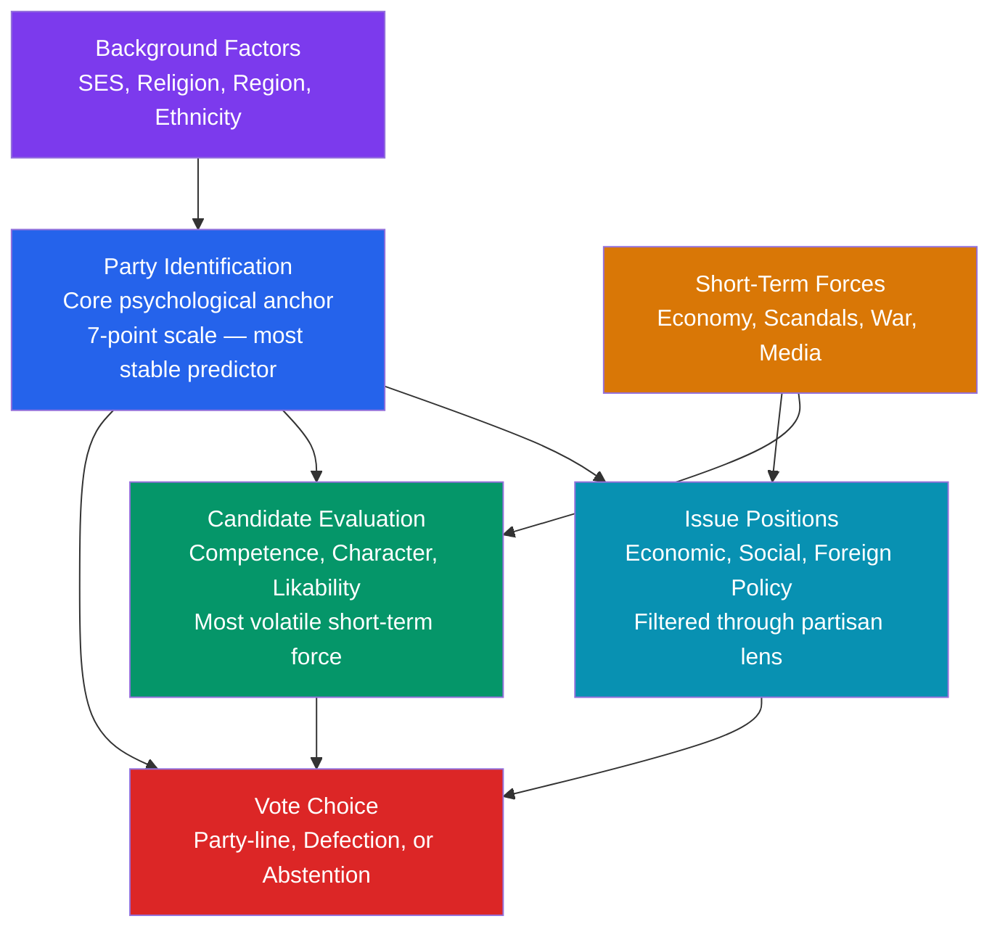

# Voting Behavior and Electoral Psychology

> [!abstract] TL;DR
> Voting is not a single act of rational calculation — it is the downstream output of a layered psychological funnel in which long-term partisan identity dominates, short-term candidate evaluations create swing, and the decision to vote at all depends on social networks, civic duty, and mobilization costs as much as expected policy benefits.

---

## Intuition

**Analogy:** Think of a supermarket shopper with a loyalty card. They almost always buy the same brand of coffee — not because they compare every option each visit, but because brand loyalty is a standing preference that lowers decision costs and feels like part of their identity. Occasionally, their usual brand runs a bad batch (candidate scandal), or a competitor runs a compelling sale (charismatic opponent), and they switch. But the next week, most drift back to their original brand.

In electoral politics, **party identification** is that loyalty card. It is the single strongest and most stable predictor of vote choice. Candidate evaluations and issue positions are this week's promotions — they produce electoral swings, but they operate *within* a framework set by prior partisan attachment. The Michigan School formalized this in the **funnel of causality**: background factors produce party identity, which structures how voters perceive candidates and policies, which then produces a vote.

---

## How It Works



---

## Key Concepts

### Secondary Level

#### The Three Schools of Voting Research

Three paradigms have structured the field since the 1940s:

| School | Theorists | Core Claim | Key Work |
|--------|-----------|------------|----------|
| **Sociological** | Lazarsfeld, Berelson, McPhee | Social group membership determines vote | *The People's Choice* (1944), *Voting* (1954) |
| **Psychological** | Campbell, Converse, Miller, Stokes | Party identification is the primary psychological anchor | *The American Voter* (1960) |
| **Rational Choice** | Downs, Fiorina | Voters maximize expected utility based on policies or past performance | *An Economic Theory of Democracy* (1957), *Retrospective Voting* (1981) |

Each illuminates a different layer of the funnel: sociology explains where party identities come from; psychology explains how they shape perceptions; rational choice explains when and why voters deviate from them.

---

#### Columbia School: Social Cross-Pressures

Paul Lazarsfeld and his colleagues at Columbia conducted the first modern election panel study — Erie County, Ohio, in 1940 (*The People's Choice*, 1944). Their finding was stark: **"a person thinks politically as he is socially."** Three social characteristics — socioeconomic status, religion, and urban/rural residence — could predict vote choice with high accuracy before the campaign even began.

Their **Index of Political Predisposition (IPP)** combined these three factors. Voters whose group memberships all pointed the same way (high SES + Protestant + rural → Republican) voted with near-certainty. Voters caught between conflicting group loyalties — **cross-pressured voters** — were the campaign's real audience: they decided late, showed lower turnout, and split their tickets at higher rates.

**Cross-pressure mechanism:**
- A working-class Catholic in 1940 Ohio: class → Democrat, religion → ambiguous, urban → Democrat. Moderate IPP, high uncertainty.
- A wealthy Protestant farmer: SES → Republican, religion → Republican, rural → Republican. Strong IPP, near-certain Republican vote.

The key insight: campaigns don't convert — they **activate** or **reinforce** social predispositions. Most "persuadable" voters are simply cross-pressured ones who are slower to resolve their competing loyalties.

---

#### Party Identification and the Michigan Model

Campbell, Converse, Miller, and Stokes (*The American Voter*, 1960) shifted the focus inward: away from demographics, toward the voter's **psychological attachment to a party**. Party identification is not a single voting decision — it is a durable identity, acquired in adolescence through family socialization, and updated only slowly over a lifetime.

**The 7-point PID scale:**

| Category | Label |
|----------|-------|
| −3 | Strong Democrat |
| −2 | Weak Democrat |
| −1 | Lean Democrat |
|  0 | Independent |
| +1 | Lean Republican |
| +2 | Weak Republican |
| +3 | Strong Republican |

**The funnel of causality** orders these forces temporally and causally:
1. **Distal factors** (background, social class, religion, region) — fixed early in life
2. **Party identification** — the central psychological anchor
3. **Issue positions** — perceived through the partisan lens
4. **Candidate evaluations** — the most volatile, most responsive to campaign events
5. **Vote** — the terminus of the funnel

The funnel's key implication: party ID makes most voters' choices predictable before any campaign begins. Short-term forces (charismatic candidates, economic shocks, major scandals) cause deviations from the party baseline, but these are bounded and often temporary.

---

#### Voter Turnout: The Calculus of Voting

Why do people vote at all? Riker and Ordeshook (1968) formalized the rational calculus:

> **U = P × B − C + D**

| Term | Meaning |
|------|---------|
| **P** | Probability your single vote is decisive |
| **B** | Benefit if your preferred candidate wins over the alternative |
| **C** | Cost of voting: time, information, travel, registration |
| **D** | Expressive/civic duty benefit from the act of voting itself |

The **paradox of voting**: in a national election with millions of voters, P is approximately 1 in 10 million. The expected benefit P×B is therefore nearly zero for any finite B — too small to justify the cost C. Yet 50–70% of eligible voters in most democracies do vote.

The resolution: **D is the real motivator.** The duty term captures civic obligation, partisan expressiveness, and social norms around participation. Riker and Ordeshook deliberately included D not to save the model from paradox but because citizen duty is empirically real and theoretically meaningful.

**Mobilization theory** (Rosenstone and Hansen, 1993) complements the calculus: parties, unions, religious organizations, and social networks **lower C** by providing information, transportation, and social pressure. Turnout is not simply a function of individual rationality — it is a function of organizational capacity. Who gets mobilized shapes who wins.

---

### Undergraduate Level

#### Retrospective Voting: Fiorina's Revision

Morris Fiorina (*Retrospective Voting in American National Elections*, 1981) challenged the Michigan model's portrait of voters as passive recipients of party socialization. He argued that party identification itself is partly **retrospective** — a running tally of past performance that is updated by experience.

**Two types of retrospective evaluation:**
1. **Simple retrospective**: Did things get better or worse? Vote accordingly. "Throw the rascals out."
2. **Mediated retrospective**: Evaluate past performance in light of expectations about future performance. More sophisticated but same fundamental logic.

**Economic voting — pocketbook vs. sociotropic:**
Kinder and Kiewiet (1981) tested two hypotheses:
- **Pocketbook voting**: voters evaluate their own personal economic situation.
- **Sociotropic voting**: voters evaluate the national economy as a whole.

Their finding — corroborated across dozens of subsequent studies — is that **sociotropic judgments dominate**. Voters ask not "am I personally better off?" but "is the country better off?" This has crucial implications: it means voters are not purely self-interested, but are also susceptible to economic *framing* — a president can be rewarded or punished for conditions largely beyond their control.

**The clarity of responsibility problem (Powell and Whitten, 1993):** retrospective voting works best when voters can clearly attribute outcomes to the incumbent government. Divided government, coalition governments, and federalism all obscure responsibility, weakening economic voting effects.

---

#### Spatial Models and Rational Voting

Anthony Downs (*An Economic Theory of Democracy*, 1957) modeled voters as selecting the candidate closest to their preferred policy position on an ideological dimension:

> **Vote for candidate i if |Voter position − Candidate i position| < |Voter position − Candidate j position|**

This **proximity model** generates the median voter theorem: in a single-dimensional policy space with single-peaked preferences and two candidates competing for votes, both candidates converge to the position of the median voter.

**Directional model** (Rabinowitz and Macdonald, 1989) offers a competing account: voters don't care about precise proximity — they care about **direction and intensity**. A voter who strongly favors liberal immigration policy prefers whichever candidate most vigorously defends that direction, even if they are more extreme than the voter's own position. This explains why candidates sometimes benefit from taking clear, energetic positions rather than mushing toward the center.

**Empirical contest:** The evidence is mixed. Proximity fits better for voters with well-formed preferences on specific issues; directional voting fits better for symbolic issues where party cues dominate over precise policy evaluation.

---

#### Partisan Sorting and Affective Polarization

Two distinct but related phenomena are reshaping Western democracies:

**Partisan sorting** (not polarization per se): ideological consistency *within* parties increases over time. In 1970s America, there were conservative Democrats and liberal Republicans; both have essentially disappeared. The parties have *sorted* — liberals became Democrats, conservatives became Republicans — without necessarily moving their absolute policy positions further apart.

**Elite polarization**: party elites *have* moved apart on many issues, especially since the 1990s. The median House Republican and median House Democrat occupy the most ideologically distant positions in 100 years (DW-NOMINATE scores, Poole and Rosenthal).

**Affective polarization** (Mason, 2018): the most politically consequential form. Americans increasingly *dislike and distrust* the opposing party — not necessarily because they disagree with them on policy, but because partisan identity has fused with racial, religious, and cultural identities into a "mega-identity." Lilliana Mason's key finding: partisan identity can precede and shape policy positions rather than follow from them. Many voters adopt their party's positions *because* it is their party, not the reverse.

---

#### Demographic Cleavages in Vote Choice

**The gender gap:** Since roughly 1980, women have been more likely than men to vote for the Democratic Party in the United States. The gap is typically 4–8 percentage points. Competing explanations include: the "feminization of poverty" (women more dependent on government social programs), issue priorities (women weight healthcare, education, gun control more heavily), and the "security mom" thesis (women more risk-averse in security contexts). The gap is not universal — in some Eastern European countries it is reversed or absent.

**Generational gaps:** Karl Mannheim (1928) proposed that the political events of a person's "impressionable years" (roughly 14–24) leave a durable imprint. Philip Converse demonstrated that party identification crystallizes in early adulthood and changes little thereafter — so cohorts that came of age during a political realignment (e.g., the New Deal generation, or Millennials during the Iraq War/financial crisis) carry their generational political lean for life.

**Racial and ethnic voting:** In the United States, Black voters have voted ~90% Democratic since the 1964 Civil Rights Act — the most consistent demographic loyalty in American electoral history. Latino and Asian American voting is more contested, with substantial variation by national origin, generation, and region. Group-based voting reflects both material interests and linked fate — the perception that one's individual fortunes are tied to the fortunes of the group.

**Class dealignment:** Traditional working-class voting for left-of-center parties has weakened substantially since the 1970s across most advanced democracies. Education has replaced class as the primary social cleavage in many countries: college-educated voters are increasingly Democratic/left; non-college voters are increasingly Republican/right.

---

### Graduate Level

#### Non-Voters and the Civic Voluntarism Model

Brady, Verba, and Schlozman (*Voice and Equality*, 1995) identified three reasons why people do not participate:

1. **Can't** — lack resources: time, money, civic skills (education, organizational experience)
2. **Don't want to** — lack engagement: don't care about politics, feel it doesn't affect them
3. **Nobody asked** — lack mobilization: not recruited by parties, organizations, or social networks

This **civic voluntarism model** systematically predicts participation gaps by class, education, and social integration. The inequality implication is stark: the resource-rich are over-represented not just in who votes but in whose preferences governments respond to.

Two psychological modes of non-voting must be distinguished:
- **Alienated abstention**: voters who follow politics, have preferences, but believe the system is rigged or that both parties are equally bad. These voters can be mobilized by sufficiently different candidates or sufficiently credible threats.
- **Apathetic abstention**: voters who simply don't engage. These are harder to mobilize and often respond poorly to negative campaigning.

---

#### Attitude Formation and Motivated Reasoning in Political Judgment

Cognitive political psychology (Zaller, 1992) shows that most citizens receive political information through elite cueing: they receive messages from elite sources (media, politicians) and evaluate them based on predispositions. The **Receive-Accept-Sample model**:

1. **Receive**: political messages reach voters proportionally to their political awareness/engagement
2. **Accept**: voters accept messages consistent with their predispositions, reject inconsistent ones
3. **Sample**: survey responses are drawn from recently activated considerations

This explains **partisan perceptual screen**: the same economic facts or policy outcomes look different to Democratic and Republican voters — not because they possess different information, but because partisan identity governs which information is weighted. Kahan's *identity-protective cognition* shows that politically sophisticated individuals are *more* prone to motivated reasoning, not less — they have more cognitive tools to rationalize pre-formed conclusions.

**Framing effects** in electoral context (Entman, 1993): how an issue is framed — immigration as a cultural threat vs. an economic contribution — activates different considerations and produces different votes. Candidates and media don't just transmit information; they define the lens through which information is evaluated.

---

#### Low Information Rationality and Heuristics

Popkin (1991, *The Reasoning Voter*) challenged the assumption that rational voting requires substantial policy knowledge. He argued that voters use **informational shortcuts** — **low-information rationality** — to make defensible decisions without bearing the full cost of political information acquisition:

- **Party cue**: if you know a party's general orientation, you can extrapolate to new issues
- **Endorsement heuristic**: if a trusted group endorses a candidate, that candidate likely represents group interests
- **Economic heuristic**: did prices go up? Did I lose my job? Simple economic facts serve as a sufficient statistic for incumbent competence
- **Likability/character heuristic**: candidate appears honest and competent → infer that policy positions are probably acceptable

The normative implication is contested. Lupia and McCubbins (1998) argue that cue-taking is perfectly rational: you buy expert advice rather than acquire expertise yourself. Bartels (1996) showed empirically that more informed voters make somewhat different choices than less informed voters — suggesting heuristics are useful but not perfect substitutes for full information.

---

## Python Demo

```python
import numpy as np

np.random.seed(42)
N = 2_000  # simulated voters

# ================================================================
# MICHIGAN MODEL — Funnel of Causality simulation
# Party ID scale: -3 = Strong Democrat, 0 = Independent, +3 = Strong Republican
# Outcome: P(vote Republican)
# ================================================================
pid_labels = ["Strong D", "Weak D", "Lean D", "Independent", "Lean R", "Weak R", "Strong R"]
pid_probs  = [0.18, 0.14, 0.10, 0.12, 0.10, 0.14, 0.22]   # approx. US ANES proportions
pid_values = np.array([-3, -2, -1, 0, 1, 2, 3])

pid_cat = np.random.choice(len(pid_labels), size=N, p=pid_probs)
pid     = pid_values[pid_cat]

# Distal party ID structures the proximal factors
# Positive direction = conservative / pro-Republican
issue_pos = pid * 0.4 + np.random.normal(0, 1.0, N)   # policy ideology score
cand_eval = pid * 0.3 + np.random.normal(0, 1.2, N)   # net candidate thermometer R minus D

# Funnel weights — party ID most influential per Campbell et al.
w_pid   = 0.55   # long-term partisan anchor (most distal, most stable)
w_cand  = 0.30   # short-term candidate evaluation force
w_issue = 0.15   # issue positions

log_odds = w_pid * pid + w_cand * cand_eval + w_issue * issue_pos
p_rep    = 1.0 / (1.0 + np.exp(-log_odds))   # P(vote Republican)

vote_rep = (np.random.uniform(size=N) < p_rep).astype(int)

# ================================================================
# RESULTS: vote probability by partisan identity
# ================================================================
print("Michigan Model — Funnel of Causality Simulation")
print("=" * 62)
print(f"{'PID Category':<14} {'N':>5} {'Mean P(Rep)':>12} {'Actual R':>10} {'Actual D':>10}")
print("-" * 62)

for i, label in enumerate(pid_labels):
    mask   = pid_cat == i
    n      = mask.sum()
    mean_p = p_rep[mask].mean()
    pct_r  = vote_rep[mask].mean() * 100
    pct_d  = (1 - vote_rep[mask]).mean() * 100
    print(f"{label:<14} {n:>5} {mean_p:>12.3f} {pct_r:>9.1f}% {pct_d:>9.1f}%")

print(f"\nNational share: R = {vote_rep.mean()*100:.1f}%  "
      f"D = {(1 - vote_rep).mean()*100:.1f}%")

# ================================================================
# COUNTERFACTUAL: party ID alone vs. full three-factor model
# ================================================================
p_pid_only = 1.0 / (1.0 + np.exp(-w_pid * pid))
corr       = np.corrcoef(p_rep, p_pid_only)[0, 1]
print(f"\nCorrelation(full model, PID-only): {corr:.3f}")
print("High r confirms party ID dominates the funnel — issues and")
print("candidate evaluation add variance but do not override the anchor.")

# ================================================================
# RETROSPECTIVE VOTING SHOCK (Fiorina 1981)
# Severe economic downturn shifts candidate evaluation against
# the incumbent Republican — sociotropic judgment
# ================================================================
print("\n--- Fiorina Retrospective Voting: Economic Crisis Shock ---")
cand_eval_crisis = cand_eval - 1.8   # economic shock hits incumbent approval
log_odds_crisis  = w_pid * pid + w_cand * cand_eval_crisis + w_issue * issue_pos
p_rep_crisis     = 1.0 / (1.0 + np.exp(-log_odds_crisis))
vote_rep_crisis  = (np.random.uniform(size=N) < p_rep_crisis).astype(int)

normal_share = vote_rep.mean() * 100
crisis_share = vote_rep_crisis.mean() * 100
swing        = crisis_share - normal_share

print(f"Republican share — normal economy:    {normal_share:.1f}%")
print(f"Republican share — economic crisis:   {crisis_share:.1f}%")
print(f"Electoral swing from retrospective shock: {swing:+.1f} percentage points")
print("=> Even strong partisans defect when performance fails badly enough.")

# ================================================================
# PARTISAN SORTING: show how issue positions correlate with PID
# ================================================================
print("\n--- Partisan Sorting: Issue Position by PID Category ---")
for i, label in enumerate(pid_labels):
    mask = pid_cat == i
    print(f"  {label:<14}  mean issue score: {issue_pos[mask].mean():+.2f}")
print("Sorting: issue positions cluster by party, not vice versa.")
```

---

## Real-World Applications

> **United States 1980 — Reagan and Retrospective Voting.** Unemployment stood at 7.1% and inflation at 12.5% in 1980. Incumbent Jimmy Carter's approval had collapsed. Ronald Reagan's campaign encapsulated sociotropic retrospective voting in a single question: "Are you better off than you were four years ago?" Carter won only 41% of the popular vote — a 10-point swing from 1976. The swing was not driven by ideology: Reagan pulled substantial numbers of self-identified Democrats and Independents. Fiorina's model predicted this precisely: when incumbent performance clearly fails, voters override their baseline party identity.

> **United Kingdom 1992 and "Black Wednesday."** Despite lagging in polls, the Conservatives won in April 1992. Six months later, the pound was ejected from the European Exchange Rate Mechanism in the Black Wednesday crisis. The event inflicted permanent reputational damage: polls tracking economic competence showed the Conservatives never recovered their lead on that metric before losing in 1997 by a landslide. This illustrates the *clarity of responsibility* condition — once the government was unambiguously blamed for a visible economic failure, retrospective punishment was decisive and lasting.

> **United States 2016 — Affective Polarization and the Mega-Identity.** Lilliana Mason's research documents that by 2016, partisan identity had fused with racial, religious, and cultural identities into what she calls a "mega-identity." Trump voters and Clinton voters were not primarily separated by policy distance — they were separated by social identity threat. This drove turnout and intensity of support far above what issue positions alone would predict. The result: partisan identity hardened even among voters who disagreed with their candidate on specific policies.

> **India — Caste, Religion, and Ethnic Voting.** India offers the most complex ethnic-voting landscape in the world. Caste identity remains the single strongest predictor of vote choice at the local level, mediated by caste-based political parties and vote banks. Yet the pattern is not purely sociological — caste voting is also strategic: large jati (sub-caste) groups bargain collectively with parties for representation and patronage. This exemplifies the Columbia model's social determinism operating within a rational-choice framework of group bargaining.

> **Germany 2021 — Candidate Evaluation Overriding Party ID.** Armin Laschet, the CDU/CSU candidate, was caught on camera laughing during a flood disaster visit in August 2021, weeks before the election. Candidate evaluation polls dropped sharply; the CDU/CSU fell from polling at 27% to finishing at 24.1%. Olaf Scholz of the SPD ran a disciplined, competent-looking campaign and rose from 15% to 25.7%. This is a textbook Michigan model outcome: short-term candidate forces caused a significant departure from the baseline party support, with candidate evaluation acting as the dominant short-term variable.

---

## Common Pitfalls

- **Treating party identification as merely a voting intention** — PID is a psychological identity, not just a preference. It structures *how voters perceive reality*: the same unemployment figure looks like a success to a partisan and a failure to the opposition, via motivated reasoning. Conflating identification with a simple voting intention misses its role as a perceptual screen.
- **Applying the median voter theorem without checking dimensionality** — The theorem requires a single-dimensional policy space with two candidates. Real electorates have multidimensional preferences: economic left-right, cultural authoritarian-libertarian, and post-material values are distinct dimensions. In multidimensional space, there is no median voter — McKelvey's chaos theorem applies and party positioning is far less predictable.
- **Inferring sociotropic from pocketbook effects** — Survey responses about personal economic conditions are endogenous to partisan identity (Republicans report their finances are better when a Republican is president, even controlling for actual income). Studies that use only survey-reported personal conditions may conflate partisan cheerleading with genuine pocketbook evaluation. Objective economic data must be matched to individual-level outcomes for credible pocketbook identification.
- **Assuming more information produces better voters** — Kahan's identity-protective cognition shows the opposite: politically sophisticated, highly informed voters are *more* adept at rationalizing partisan conclusions, not less. Information campaigns targeted at partisan identifiers can backfire by activating defensive processing.
- **Overlooking the supply side of elections** — Most models focus on voters. But vote choice is always a choice among available options. A left-leaning voter in a FPTP system without a viable left party may vote for the least-bad available option or abstain — producing observed behavior that looks conservative or apathetic, but actually reflects the structure of competition, not individual preferences.
- **Mistaking partisan sorting for mass polarization** — Party elites have genuinely polarized; mass voters show more modest issue polarization. Much of the apparent mass polarization is affective (dislike of the other party) and sorting (alignment of multiple identities with party), not ideological extremism. Conflating the two leads to misdiagnoses about democratic health and the wrong remedies.

---

## Related Concepts

- [[_MOC_Political_Behavior_and_Democracy|↑ Political Behavior and Democracy MOC]] — section entry point and concept map for all six notes in this cluster.
- [[Democracy_Types_and_Electoral_Systems]] — electoral rules shape which voters and parties are viable; the same voter population produces different outcomes under FPTP vs. PR, so vote choice models must account for the strategic constraint imposed by the electoral formula.
- [[Political_Parties_and_Party_Systems]] — parties are the primary objects of partisan identification; cleavage theory explains why certain social groups durably align with certain parties, supplying the upstream cause of the funnel of causality.
- [[Cognitive_Biases]] — motivated reasoning, confirmation bias, and the availability heuristic are the micro-level cognitive mechanisms through which partisan identity distorts information processing; what political scientists call "partisan perceptual screen" is confirmation bias operating in a politically charged domain.
- [[Attitudes_and_Persuasion]] — the Elaboration Likelihood Model maps directly onto political persuasion: low-information voters process campaign messages via the peripheral route (endorsements, likability cues), while engaged voters use the central route; Zaller's RAS model extends this specifically to political attitude formation.
- [[Prejudice_and_Discrimination]] — social identity theory and in-group/out-group psychology underlie affective polarization; Tajfel's minimal group paradigm shows that mere categorization as "Democrat" or "Republican" generates in-group favoritism and out-group hostility independent of any policy difference.
- [[Group_Dynamics]] — social network effects on turnout and vote choice; conformity pressures within communities and workplaces shape political behavior, explaining why geographic clustering of partisans reinforces and intensifies voting patterns over time.
- [[Nash_Equilibrium]] — rational choice models of voter coordination under strategic voting are coordination games; the Nash equilibrium in a FPTP race with three candidates involves voters who prefer the weakest candidate abandoning them to avoid wasting their vote, a direct analog to the Prisoner's Dilemma in collective action.
- [[Utility_Theory]] — the Riker-Ordeshook calculus of voting is an expected utility model; the paradox of voting arises because the probability weight on benefits is near zero, which breaks standard expected utility maximization and requires the civic duty term D to explain observed turnout rates.
- [[Behavioral_Economics_Psychology]] — loss aversion, framing effects, and the endowment effect all apply to political decision-making: voters weight potential losses from a policy change more heavily than equivalent gains, and candidates who frame their position as preventing loss outperform those who frame it as producing gain.

---

## Review Questions

### Secondary

1. In Lazarsfeld's Columbia model, what are the three social characteristics that best predicted vote choice in 1940, and what does "cross-pressure" mean? Predict the voting behavior of a high-income Catholic urban worker using the Index of Political Predisposition.
2. According to the Riker-Ordeshook formula U = PB - C + D, why does the probability term P create a paradox for rational voting? What does the D term represent, and why is it the empirically important variable?
3. What is the difference between partisan sorting and polarization? Give a concrete example of a voter who is sorted but not polarized.

### Undergraduate

1. Describe the funnel of causality from the Michigan model, placing party identification, issue positions, candidate evaluations, and background factors in their correct causal order. Why does party identification sit above issue positions in the funnel rather than below them?
2. Fiorina argued that party identification is itself partly retrospective. How does this modify the Michigan model's claim that PID is a stable psychological anchor? Use the concept of "running tally" in your answer.
3. Compare proximity voting and directional voting as models of spatial vote choice. Under what conditions does each model fit better empirically? What does each imply about optimal candidate positioning strategy?
4. Using Kinder and Kiewiet's finding that sociotropic evaluations dominate pocketbook evaluations, explain why an incumbent president can be punished for an economic recession they did not cause. What does this imply for democratic accountability?

### Graduate

1. Kahan's identity-protective cognition finds that politically sophisticated, highly informed citizens are *more* likely to engage in motivated reasoning, not less. How does this challenge the standard information-deficit model of electoral irrationality? What does it imply for the normative evaluation of political information campaigns?
2. Affective polarization (Mason 2018) can intensify electoral competition without any increase in policy distance between voters. Using social identity theory and the concept of mega-identity, explain the mechanism. What feedback loops between partisan media, geographic sorting, and candidate selection could sustain affective polarization in equilibrium?
3. The civic voluntarism model identifies three independent constraints on participation: resources, motivation, and recruitment. Design an empirical test that distinguishes which constraint is most binding for low-income, low-education non-voters versus highly educated political cynics. What different interventions would address each bottleneck?

---

## Sources

- [Campbell, A., Converse, P., Miller, W., Stokes, D. (1960) *The American Voter* — Wiley](https://adambrown.info/p/notes/campbell_converse_miller_and_stokes_the_american_voter)
- [Lazarsfeld, P., Berelson, B., Gaudet, H. (1944) *The People's Choice* — Columbia University Press](https://www.cambridge.org/core/journals/american-political-science-review/article/abs/peoples-choice-how-the-voter-makes-up-his-mind-in-a-presidential-campaign-2nd-edition/D96C0FDB6CF71A08D3FD2CF18AE60022)
- [Downs, A. (1957) *An Economic Theory of Democracy* — Harper and Row](https://archive.org/details/economictheoryof00down)
- [Fiorina, M. (1981) *Retrospective Voting in American National Elections* — Yale University Press](https://adambrown.info/p/notes/fiorina_retrospective_voting_in_american_elections)
- [Riker, W. H. and Ordeshook, P. C. (1968) A Theory of the Calculus of Voting, *American Political Science Review* 62: 25–42](https://ideas.repec.org/a/cup/apsrev/v62y1968i01p25-42_11.html)
- [Zaller, J. (1992) *The Nature and Origins of Mass Opinion* — Cambridge University Press](https://www.cambridge.org/gb/academic/subjects/politics-international-relations/american-government-politics-and-policy/nature-and-origins-mass-opinion)
- [Mason, L. (2018) *Uncivil Agreement: How Politics Became Our Identity* — University of Chicago Press](https://press.uchicago.edu/ucp/books/book/chicago/U/bo28287593.html)
- [Brady, H., Verba, S., Schlozman, K. (1995) Beyond SES: A Resource Model of Political Participation, *American Political Science Review* 89(2): 271–294](https://www.cambridge.org/core/journals/american-political-science-review/article/abs/beyond-ses-a-resource-model-of-political-participation/8D99B0B9B31B7EA50D6E0DAC5CAE0B89)
- [Popkin, S. (1991) *The Reasoning Voter* — University of Chicago Press](https://press.uchicago.edu/ucp/books/book/chicago/R/bo3614703.html)
- [Kinder, D. and Kiewiet, D. R. (1981) Sociotropic Politics, *British Journal of Political Science* 11(2): 129–161](https://www.cambridge.org/core/journals/british-journal-of-political-science/article/abs/sociotropic-politics-the-american-case/4EE6B8B6B5B2D9CB15C3E64C6CF48B12)

---

#PoliticalScience #PoliticalBehavior #VotingBehavior #ElectoralPsychology
