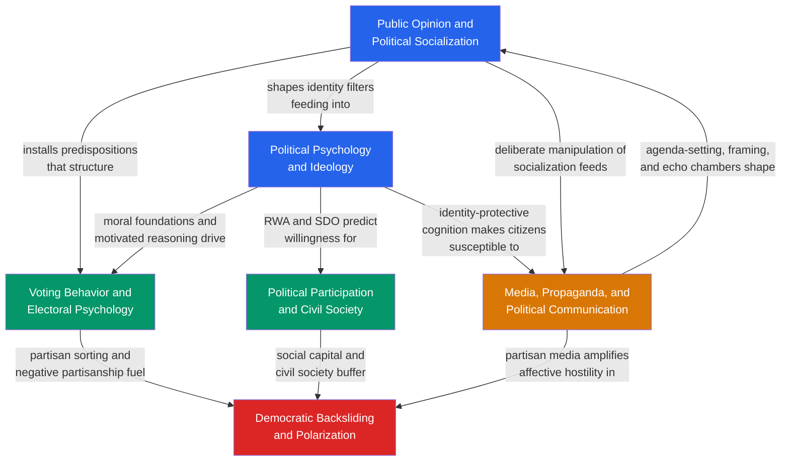

# Political Behavior and Democracy — Map of Content

> [!info] How to use this map
> Start with **Fundamentals** (socialization and political psychology), follow the arrows through voting and participation, then see how media shapes the information environment, and finally examine what happens to democracy itself when all these forces interact under stress.
> Each node links to a full note. Return to this map when you need to orient yourself.

---

## Overview

Political Behavior and Democracy is the empirical core of political science: it asks not what government *should* do but what citizens *actually* do — how they form political identities, decide whether and how to participate, process political information, and collectively sustain or erode democratic institutions. The section spans five levels of analysis simultaneously. At the individual level, political socialization installs partisan predispositions during childhood and adolescence; political psychology reveals that ideology is rooted in personality, threat sensitivity, and moral intuitions rather than deliberate policy reasoning. At the behavioral level, voting research maps how those predispositions are translated into electoral choices, and participation theory explains why some citizens engage far beyond the ballot while others do not vote at all. Bridging the individual and the structural, media and propaganda theory shows how elite communication environments shape what information citizens receive, which considerations become salient, and how disinformation campaigns exploit cognitive vulnerabilities at scale. Finally, at the systemic level, democratic backsliding and polarization theory explains how the incremental erosion of norms — enabled by citizens who prioritize tribal victory over democratic procedure — converts competitive democracies into electoral autocracies. Together, these six notes form a complete causal chain from the psychological roots of political identity all the way to the survival conditions of democratic government.

---

## Concept Map

*(Blue = foundational, Green = core behavioral output, Amber = communication environment, Red = systemic democratic outcome; arrows = "leads to" or "shapes")*

---

## Learning Path

*Recommended order for a first pass through this section:*

1. [[Public_Opinion_and_Political_Socialization]] — Start here to understand how political predispositions are installed through family, school, peers, and media before any specific issue arises; Zaller's Receive-Accept-Sample model establishes the framework all subsequent notes rely on.

2. [[Political_Psychology_and_Ideology]] — Adds the deeper psychological layer beneath opinion formation: personality traits, threat sensitivity, moral foundations, and motivated reasoning explain *why* predispositions have the shape they do and why evidence rarely changes political minds.

3. [[Voting_Behavior_and_Electoral_Psychology]] — With predispositions and psychology established, examine the most-studied output: vote choice. The Michigan model's funnel of causality, retrospective voting, and spatial models show how individual psychology translates into electoral outcomes.

4. [[Political_Participation_and_Civil_Society]] — Broaden from voting to the full spectrum of political engagement. Olson's collective action logic, Putnam's social capital, and social movement theory explain why participation is unequally distributed and what institutions can overcome that inequality.

5. [[Media_Propaganda_and_Political_Communication]] — Examine the information environment that mediates all of the above: how agenda-setting, framing, priming, and computational propaganda shape what citizens perceive as political reality, and how inoculation theory offers a scalable antidote.

6. [[Democratic_Backsliding_and_Polarization]] — Culminating note: what happens when affective polarization destroys mutual toleration, partisans tolerate norm violations by their own side, and elected leaders use legal tools to dismantle competitive democracy — with Hungary, Turkey, and the US as case studies.

---

## All Notes in This Section

| Note | Core Idea | Difficulty |
|------|-----------|------------|
| [[Public_Opinion_and_Political_Socialization]] | Public opinion is a real-time construction filtered through predispositions installed by socialization; Zaller's RAS model explains elite consensus vs. elite conflict effects on mass opinion | Intermediate |
| [[Political_Psychology_and_Ideology]] | Ideology emerges from personality, threat sensitivity, and moral foundations rather than deliberate policy reasoning; motivated reasoning and identity-protective cognition make political minds resistant to evidence | Intermediate |
| [[Voting_Behavior_and_Electoral_Psychology]] | Party identification is the dominant, stable anchor of vote choice; short-term forces (economy, candidates, scandals) cause bounded deviations; the calculus of voting resolves the turnout paradox via civic duty | Intermediate |
| [[Political_Participation_and_Civil_Society]] | Political engagement spans voting to revolution; Olson's collective action logic explains why large groups under-mobilize; Putnam's social capital and Ostrom's institutional design explain how communities escape the free-rider trap | Intermediate |
| [[Media_Propaganda_and_Political_Communication]] | Media shapes political reality through agenda-setting, framing, and priming rather than direct persuasion; algorithmic amplification and computational propaganda exploit cognitive biases; inoculation theory builds scalable resistance | Intermediate–Advanced |
| [[Democratic_Backsliding_and_Polarization]] | Modern democracies erode incrementally through executive aggrandizement enabled by affective polarization; Levitsky-Ziblatt guardrails (mutual toleration, forbearance) and V-Dem indices operationalize the process | Advanced |

---

## Key Questions This Section Answers

- Why do most people vote for the same party election after election, even when they disagree with specific positions?
- How are political predispositions formed, and at what stage of life do they crystallize?
- Why does presenting better evidence to partisans often *increase* rather than decrease polarization?
- What is the difference between ideological and affective polarization, and which is more dangerous for democracy?
- How do social movements overcome the collective action problem to achieve political change?
- Why does misinformation spread faster than corrections, and what actually works to counteract it?
- How do democracies die in the 21st century — and what institutional features slow or stop the process?
- What is the relationship between a citizen's personality, their moral foundations, and their policy positions?

---

## Connections to Other Political Science Sections

- [[_MOC_Political_Theory_and_Ideologies|S01 Political Theory and Ideologies MOC]] — The normative frameworks of liberalism, conservatism, and socialism are what this section's citizens are psychologically predisposed toward; Haidt's moral foundations provide the empirical micro-foundation for ideological theory, and Rawlsian/Burkean traditions map directly onto liberal Care-Fairness vs. conservative Authority-Sanctity-Loyalty profiles.

- [[_MOC_Comparative_Politics|S02 Comparative Politics MOC]] — Electoral systems (FPTP vs. PR) directly shape which behavioral patterns become electorally decisive; authoritarian regime theory explains what happens when backsliding completes; party system theory is the institutional structure within which all voting and participation behavior occurs.

- [[_MOC_International_Relations|S03 International Relations MOC]] — Public opinion on foreign policy, rally-around-the-flag effects, and the domestic political sources of international behavior connect this section to IR; Terror Management Theory explains post-9/11 foreign policy support dynamics; disinformation campaigns (IRA 2016) are instruments of interstate conflict.

- **S04 Public Policy and Political Economy** (`04_Public_Policy_and_Political_Economy`) — Public opinion is the environment within which the policy process operates; agenda-setting theory explains which problems get onto the policy agenda; polarization directly constrains legislative capacity and produces policy gridlock.

- **S06 Contemporary Global Issues** (`06_Contemporary_Global_Issues`) — Democratic backsliding is a global trend tracked by V-Dem and Freedom House; computational propaganda and disinformation are tools used across borders; the rise of populism connects this section to globalization, inequality, and identity politics worldwide.

---

## Cross-Vault Connections

- [[_MOC_Psychology_Master|Psychology Vault]] — This section is deeply continuous with the Psychology vault. Zaller's RAS model is a political application of the Elaboration Likelihood Model ([[Attitudes_and_Persuasion]]); the spiral of silence draws on Asch's conformity experiments ([[Social_Influence_and_Conformity]]); Haidt's moral foundations extend Kohlberg's moral development framework ([[Moral_Development]]); affective polarization is Tajfel's Social Identity Theory applied to parties ([[Prejudice_and_Discrimination]]); Olson's free-rider problem maps onto bystander effects ([[Prosocial_Behavior]]). The Psychology Social Psychology section ([[_MOC_Social_Psychology|Social Psychology MOC]]) is the closest structural neighbor.

- [[_MOC_NLP|AI-ML NLP MOC]] — Computational political science increasingly relies on NLP methods for large-scale media analysis. Transformer-based models (BERT, GPT-class) are used for automated coding of media frames, fake news detection, stance detection, and political sentiment analysis at scale. The Media and Propaganda note's discussion of disinformation campaigns connects directly to text classification, opinion mining, and the detection of coordinated inauthentic behavior in social media corpora.

---

[[_MOC_Political_Science_Master|↑ Political Science MOC]]

#PoliticalScience #PoliticalBehavior #Democracy #MOC
