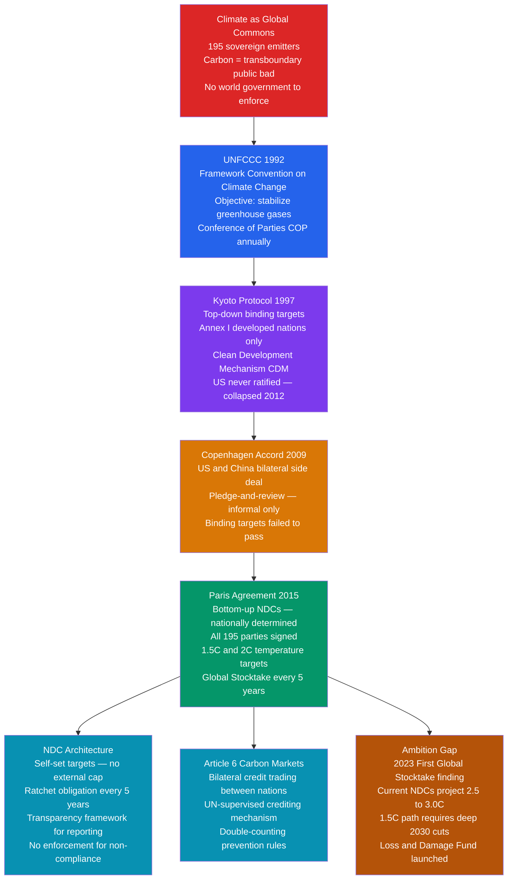

# Climate Politics and Environmental Governance

> [!abstract] TL;DR
> Climate change is the most consequential collective action problem in history: each nation that emits greenhouse gases imposes costs on all others, yet no sovereign authority can compel any state to reduce emissions. The UNFCCC architecture evolved from the top-down binding targets of the Kyoto Protocol (1997) — which the US never ratified and China was exempt from — to the bottom-up nationally determined contributions (NDCs) of the Paris Agreement (2015), trading legal enforceability for universal participation. Current NDC pledges put the world on a 2.5–3.0°C warming path; the 1.5°C target requires roughly halving emissions by 2030. The central political challenge is that the countries historically most responsible for cumulative emissions are not the same countries bearing the most severe impacts — making climate governance simultaneously a collective action problem, a distributive conflict, and an intergenerational equity question.

---

## Intuition

**Analogy:** Imagine a shared underground aquifer serving a hundred farming villages. Each village draws water for its crops; the aquifer replenishes slowly. If every village draws only a little, it refills; if most draw freely, it depletes for everyone. No single village "owns" the aquifer. Each village faces a private calculation: drawing more water benefits me fully, the cost of my extra draw is spread across all 100 villages, so my share of the harm is tiny. Every village doing this math depletes the aquifer. This is Garrett Hardin's "tragedy of the commons" — rational individual choices producing a collectively irrational outcome.

The global atmosphere is the aquifer. Carbon dioxide is the over-drawn resource. 195 sovereign nations each face the same logic: my country's extra emissions yield full domestic benefit (economic growth, cheap energy), while the resulting warming is shared globally. Since 1992, international climate negotiations have been the search for an institutional design that escapes this tragedy — either by internalizing the externality through pricing, enforcing binding caps, or building norms strong enough that countries restrain themselves even without a coercive authority compelling them.

---

## How It Works



---

## Key Concepts

### Secondary Level

**Climate as a commons.** The atmosphere is a *global commons*: no country owns it, every country can use it (emit carbon), and the harm from overuse (warming) falls on everyone. This makes climate change a *public bad* — the mirror image of a public good. Unlike a local commons, there is no community that can seal off the atmosphere or exclude users. Every ton of CO₂ emitted anywhere raises global temperatures everywhere, with impacts disproportionately felt by the most vulnerable populations who contributed least.

**The UNFCCC architecture.** The United Nations Framework Convention on Climate Change (1992) established the basic institutional shell:

- **Objective:** Stabilize greenhouse gas concentrations at a level preventing dangerous anthropogenic interference with the climate system.
- **Parties:** 197 (near-universal). The Conference of the Parties (COP) meets annually as the supreme decision-making body.
- **Common But Differentiated Responsibilities (CBDR):** Developed countries (Annex I) must take the lead because they produced most historical cumulative emissions. Developing countries have a "right to develop."

**Kyoto vs. Paris — the core design shift.**

| Feature | Kyoto Protocol (1997) | Paris Agreement (2015) |
|---|---|---|
| Target-setting | Top-down: UNFCCC assigned targets | Bottom-up: countries write own NDCs |
| Coverage | Annex I only (developed world) | All 195 parties |
| Legal form | Binding emissions targets | Binding obligation to *submit* NDCs; the targets themselves are not legally binding |
| Enforcement | Compliance committee with penalties | Transparency framework; reputational pressure only |
| US position | Signed; never ratified | Signed (2016); withdrew (2017); rejoined (2021) |
| Outcome | Annex I largely met targets; global emissions rose as China, India, US continued growth | NDCs submitted by all; 2023 Stocktake shows 2.5–3.0°C trajectory |

**Key policy instruments comparison.**

| Instrument | Mechanism | Examples |
|---|---|---|
| Carbon tax | Price per ton of CO₂ | British Columbia, Sweden, Canada federal |
| Cap-and-trade | Quantity cap plus tradeable permits | EU ETS, California, RGGI northeast US |
| Regulation | Technology mandates and efficiency standards | CAFE standards, EU vehicle CO₂ rules |
| Subsidies | Incentivize clean energy and efficiency | US Inflation Reduction Act, EU Green Deal |
| Voluntary pledges | NDCs and corporate net-zero commitments | Paris Agreement NDC architecture |

---

### Undergraduate Level

**CBDR and climate justice.** The US alone accounts for approximately 25% of cumulative historical atmospheric CO₂; Europe another 22%; China's cumulative share is roughly 13% despite being the largest current annual emitter. CBDR is politically contentious: the US Senate refused to ratify Kyoto (Byrd-Hagel resolution, 97–0) partly because China and India faced no binding obligations. The Paris Agreement resolved this by making *all* parties responsible for NDCs — but this effectively diluted the CBDR principle in its strong form, requiring developing countries to make contributions despite minimal historical culpability.

**NDC mechanics and the ratchet.** Under Paris, each country writes its own Nationally Determined Contribution covering emissions targets, adaptation measures, and finance needs. NDCs are legally required (Art. 4.2) to represent "highest possible ambition." The ratchet mechanism requires countries to submit new, more ambitious NDCs every five years. The theory of change is iterative: pledge, review, increase pledge, review again. The weakness: there is no external verification that "highest possible ambition" was actually achieved, and there is no penalty for missing a stated target.

**Domestic climate politics: veto players and the carbon lobby.** Climate policy must pass through domestic political systems before international commitments become operational. George Tsebelis's veto player theory predicts: more veto players (Senate chambers, coalition partners, courts, referenda requirements) means harder enactment of ambitious climate policy. In the US, the Senate's two-thirds ratification requirement for treaties effectively killed Kyoto. The European Parliament has become a *pro-climate* veto player, blocking measures deemed insufficient. Key domestic coalitions:

- **Carbon lobby:** Oil and gas companies, coal interests, energy-intensive manufacturers. Lobbying expenditures in the US exceeded $120M/year in the 2020s.
- **Green coalition:** Renewable energy industry (now often equally powerful), environmental NGOs, climate-vulnerable communities, and youth movements.
- **Insurance and finance:** Increasingly aligned with climate action due to physical and transition risk exposure.

**Carbon markets: EU ETS and Article 6.**

*EU Emissions Trading System.* Launched 2005, the world's largest carbon market. Covers roughly 40% of EU greenhouse gas emissions; the cap declines annually. Carbon price reached €100/ton in 2023, having spent much of the 2010s below €10 due to over-allocation of free permits. Phase III (2013) switched to auctioning; Phase IV (2021) tightened the cap and added sectors. The EU Carbon Border Adjustment Mechanism (CBAM, 2023) extends the carbon price to imports of steel, cement, aluminum, and other goods — preventing carbon leakage and creating incentives for trading partners to implement their own carbon pricing.

*Article 6 of the Paris Agreement.* Allows countries to trade "internationally transferred mitigation outcomes" (ITMOs) toward meeting their NDCs. Two mechanisms: Article 6.2 (bilateral government-to-government trades) and Article 6.4 (a new UN-supervised crediting mechanism, successor to the Clean Development Mechanism). Rules were finalized only at COP28 (2023), delayed by disputes over environmental integrity versus developing-country access.

**Climate finance and the $100B/yr pledge.** At Copenhagen (2009), developed countries pledged to jointly mobilize $100 billion per year by 2020 for developing country climate action. The pledge was not met until 2022 (officially), and even that figure counts loans and private finance that critics argue should not qualify. A new post-2025 climate finance goal (NCQG) was under negotiation through 2024, with developing countries requesting $1 trillion/year.

**IPCC as a scientific-political interface.** The Intergovernmental Panel on Climate Change synthesizes peer-reviewed literature into Assessment Reports (AR6: 2021–22). Reports are written by scientists but the Summary for Policymakers (SPM) is negotiated line-by-line between governments — a unique science-policy interface where every factual sentence must survive consensus approval. AR6 key findings: "unequivocal" human warming of +1.1°C; remaining carbon budget for 1.5°C is roughly 500 GtCO₂ from 2020; every fraction of a degree matters for impacts.

---

### Graduate Level

**Ostrom's polycentric governance.** Elinor Ostrom's Nobel Prize work (*Governing the Commons*, 1990) challenged both privatization and Leviathan solutions to commons problems, documenting communities successfully managing local commons through polycentric, overlapping governance with locally-designed rules. Applied to climate: polycentric governance means city networks (C40, ICLEI), subnational governments (California, German Länder), corporate commitments, and sectoral agreements operating in parallel with the UNFCCC. US cities and states maintaining Paris commitments during Trump's withdrawal (2017–21) is consistent with polycentric theory. The empirical question: is polycentric action *additive* to national-level ambition, or a *substitute* that reduces pressure on governments by providing a political safety valve?

**Securitization of climate change.** The Copenhagen School defines securitization as moving an issue from normal politics to emergency politics — above routine policy-making, justifying exceptional measures. Climate has been partially securitized: the US Department of Defense identified climate as a security multiplier in 2014; the UN Security Council debated climate and peace in 2021; Pacific Island leaders frame climate change as a literal existential security threat. Full securitization is resisted by some climate advocates who fear it could justify militarized responses (climate refugee exclusion, resource-conflict prevention) rather than emissions reductions, and could concentrate power in defense establishments rather than multilateral institutions.

**Loss and Damage: the political breakthrough.** "Loss and Damage" refers to climate harms that cannot be adapted to — irreversible losses including submerged Pacific Island territory, destroyed coral reef ecosystems, and forced displacement. After 30 years of developing country demands (Vanuatu first raised it in 1991), the Glasgow Climate Pact (COP26, 2021) formally acknowledged L&D, COP27 (2022) agreed to establish a dedicated fund, and COP28 (2023) operationalized the fund with initial pledges of $700M — far below the hundreds of billions per year estimated to be needed. Developed countries accepted contributions as "grants," not "compensation," carefully avoiding legal liability language. Developing countries have begun framing L&D as climate reparations — a framing that resonates with the justice wing of the movement but alienates moderate developed-country governments.

**Green New Deal and the US policy instrument choice.** The US Green New Deal resolution (2019) proposed linking climate action to economic transformation: rapid decarbonization alongside job guarantees, healthcare, and racial equity. The Inflation Reduction Act (IRA, 2022) was the realizable legislative version: $369 billion in climate and energy subsidies over ten years, projected to reduce US emissions roughly 40% below 2005 levels by 2030. The IRA used tax credits (subsidies) rather than a carbon price specifically to avoid Senate filibuster and Republican opposition. The political lesson: policy instrument choice is driven as much by legislative feasibility as economic efficiency. The IRA's subsidy approach also creates durable political constituencies (clean energy manufacturers, workers) that resist future rollback — a design advantage that a carbon tax would not produce.

**Climate populism and greenwashing.** Climate populism mobilizes politically against climate policy by invoking ordinary people's economic interests against "globalist elites." The French *gilets jaunes* (2018–19) erupted partly in response to fuel tax increases. In the US, climate denial became a tribal Republican marker from the late 2000s, linked to cultural backlash against educated coastal elites and perceived attacks on fossil-fuel-dependent communities. Greenwashing is the corporate and state practice of claiming ambitious climate action while taking inadequate real-world steps. The EU's Corporate Sustainability Reporting Directive (CSRD) and the SEC climate disclosure rules (partially stayed by courts in 2024) are institutional responses, requiring audited scope 1–3 emissions reporting.

**Regime complexity and forum shopping.** Climate governance is not a single UNFCCC regime — it is a *regime complex* (Raustiala and Victor 2004): overlapping institutions including the IPCC, IEA, G7/G20 climate processes, Montreal Protocol (ozone and F-gases), ICAO (aviation), IMO (shipping), Green Climate Fund, bilateral development finance, and voluntary carbon markets. States practice forum shopping: China and India often prefer G77 solidarity at UNFCCC; the US has preferred G7 or bilateral arrangements when multilateral progress stalls. The EU's Climate Club proposal (Nordhaus 2015) — a coalition imposing carbon border adjustments on non-members — represents an attempt to create a coercive sub-coalition within the broader regime complex.

---

## Python Demo

```python
import numpy as np

# ============================================================
# Climate negotiations as a public bad game
#
# n symmetric countries each choose emissions e_i >= 0.
# Payoff for country i:
#   Pi = a*e_i - 0.5*b*e_i^2 - d*E
#
#   a*e_i - 0.5*b*e_i^2  = private benefit (concave, diminishing)
#   d*E                   = climate damage each country bears from
#                           total global emissions E = sum(e_j)
#
# Nash equilibrium: each country ignores its contribution to others'
#   damage -> over-emits relative to the social optimum.
# Social optimum: a global planner internalizes damage to all n countries.
# ============================================================

np.random.seed(42)

n = 10      # number of countries (symmetric)
a = 15.0    # marginal benefit of first unit of emissions
b = 0.5     # curvature of private benefit (diminishing returns)
d = 0.5     # per-unit climate damage borne by EACH country from total E


def total_welfare(e_vec):
    """Sum of all countries' payoffs given emission vector e_vec."""
    E = np.sum(e_vec)
    benefits = a * e_vec - 0.5 * b * e_vec**2
    damages  = d * E          # scalar: each country bears d*E
    return float(np.sum(benefits - damages))


# ---------------------------------------------------------------
# 1. Nash Equilibrium
#    FOC for country i: a - b*e_i - d = 0
#    (private: ignores that own emissions raise damage for all others)
# ---------------------------------------------------------------
e_NE = (a - d) / b           # = (15 - 0.5) / 0.5 = 29.0
E_NE = n * e_NE
W_NE = total_welfare(np.full(n, e_NE))

# ---------------------------------------------------------------
# 2. Social Optimum
#    Planner maximises sum of payoffs; FOC: a - b*e_i - d*n = 0
#    (coefficient d*n instead of d: extra unit harms ALL n countries)
# ---------------------------------------------------------------
e_SO = max(0.0, (a - d * n) / b)   # = (15 - 5) / 0.5 = 20.0
E_SO = n * e_SO
W_SO = total_welfare(np.full(n, e_SO))

print("=" * 60)
print("PUBLIC BAD GAME: Climate Emissions and Welfare")
print("=" * 60)
print(f"Parameters: n={n}, a={a}, b={b}, d={d}\n")
print(f"Nash Equilibrium")
print(f"  Emissions per country  : {e_NE:.1f}")
print(f"  Total global emissions : {E_NE:.1f}")
print(f"  Total welfare          : {W_NE:.1f}\n")
print(f"Social Optimum")
print(f"  Emissions per country  : {e_SO:.1f}")
print(f"  Total global emissions : {E_SO:.1f}")
print(f"  Total welfare          : {W_SO:.1f}")
print(f"  Welfare gain vs Nash   : +{W_SO - W_NE:.1f}  ({(W_SO-W_NE)/abs(W_NE)*100:.1f}%)")
print(f"  Required emission cut  : {(1 - e_SO/e_NE)*100:.0f}% per country\n")

# ---------------------------------------------------------------
# 3. Carbon Tax (Pigouvian correction)
#    Optimal tax t* = d*(n-1): charges each emitter for harm to
#    the n-1 *other* countries it ignores under Nash.
#    After tax, FOC: a - b*e_i - d - t* = a - b*e_i - d*n = 0
#    -> e_i converges to e_SO.
# ---------------------------------------------------------------
t_star       = d * (n - 1)                  # = 0.5 * 9 = 4.5 per unit
e_carbon_tax = (a - d - t_star) / b         # = (15 - 5) / 0.5 = 20.0 = e_SO
E_carbon_tax = n * e_carbon_tax
W_carbon_tax = total_welfare(np.full(n, e_carbon_tax))

print(f"Carbon Tax  (t* = {t_star:.1f} per unit)")
print(f"  Emissions per country  : {e_carbon_tax:.1f}  (equals Social Optimum)")
print(f"  Total global emissions : {E_carbon_tax:.1f}")
print(f"  Total welfare          : {W_carbon_tax:.1f}\n")

# ---------------------------------------------------------------
# 4. Cap-and-Trade
#    Global cap set at E_SO; permits distributed equally.
#    Under symmetric costs the market-clearing permit price equals t*.
#    Achieves the same outcome as the optimal carbon tax.
# ---------------------------------------------------------------
e_cap_trade  = e_SO
E_cap_trade  = n * e_cap_trade
permit_price = t_star
W_cap_trade  = total_welfare(np.full(n, e_cap_trade))

print(f"Cap-and-Trade  (global cap = {E_cap_trade:.1f})")
print(f"  Emissions per country  : {e_cap_trade:.1f}  (equals Social Optimum)")
print(f"  Market permit price    : {permit_price:.1f}  (equals optimal carbon tax)")
print(f"  Total welfare          : {W_cap_trade:.1f}\n")

# ---------------------------------------------------------------
# 5. Voluntary Pledges — NDC-style
#    Countries pledge a percentage cut from Nash baseline.
#    Imperfect compliance: only p_comply fraction of countries follows
#    through; the rest revert to Nash emissions (free-rider problem).
# ---------------------------------------------------------------
pledge_pct = 0.20        # each pledger commits to 20% cut from Nash
p_comply   = 0.70        # 70% of countries actually comply
rng        = np.random.default_rng(0)
complies   = rng.random(n) < p_comply
e_ndc      = np.where(complies, e_NE * (1 - pledge_pct), e_NE)
E_ndc      = np.sum(e_ndc)
W_ndc      = total_welfare(e_ndc)
n_comply   = int(complies.sum())

print(f"Voluntary Pledges — NDC-style")
print(f"  Pledge: {pledge_pct*100:.0f}% reduction from Nash baseline")
print(f"  Compliance rate: {p_comply*100:.0f}%  ({n_comply}/{n} countries comply)")
print(f"  Total global emissions : {E_ndc:.1f}")
print(f"  Total welfare          : {W_ndc:.1f}")
print(f"  Gap to social optimum  : {E_ndc - E_SO:.1f} excess emission units")
print(f"  Defectors free-ride: emit {e_NE:.0f}, "
      f"compliers absorb cost at {e_NE*(1-pledge_pct):.0f}\n")

# ---------------------------------------------------------------
# Summary
# ---------------------------------------------------------------
print("=" * 60)
print(f"{'Regime':<30} {'Total E':>8} {'Total W':>10}")
print("=" * 60)
for label, E, W in [
    ("Nash — no agreement",          E_NE,          W_NE),
    ("Social Optimum",               E_SO,          W_SO),
    ("Carbon Tax (optimal t*)",      E_carbon_tax,  W_carbon_tax),
    ("Cap-and-Trade (binding cap)",  E_cap_trade,   W_cap_trade),
    ("Voluntary Pledges (NDC)",      E_ndc,         W_ndc),
]:
    print(f"{label:<30} {E:>8.1f} {W:>10.1f}")
print("=" * 60)
print("\nCarbon tax and cap-and-trade both achieve the social optimum")
print("when designed correctly.  Voluntary pledges reduce emissions but")
print(f"leave a {E_ndc - E_SO:.1f}-unit gap from the optimum because defectors")
print("free-ride on others' abatement — the core Paris Agreement problem.")
```

---

## Real-World Applications

**EU Emissions Trading System as the global carbon market reference.** After a decade of dysfunction (free allocation created oversupply; prices fell below €5/ton through much of the 2010s), reforms including the Market Stability Reserve and Phase IV cap tightening raised the EU ETS carbon price to a sustained €80–100/ton by 2023. The EU Carbon Border Adjustment Mechanism (CBAM) now extends the carbon price to imports of steel, cement, aluminum, fertilizers, and electricity — preventing carbon leakage and creating competitive pressure on trading partners to implement their own carbon pricing rather than lose market access.

**Paris ambition gap and the 2023 Global Stocktake.** The first Global Stocktake found that current NDCs and policies project a 2.4–2.6°C warming path. IPCC-compatible 1.5°C pathways require approximately 43% global emissions reduction by 2030 from 2019 levels. The significance: the Paris design explicitly anticipated this gap and relied on transparency and reputational pressure to ratchet ambition upward across successive 5-year cycles. Whether that mechanism can close a 43% emissions gap in 4–5 years is the defining empirical test of the Paris architecture.

**US Inflation Reduction Act as industrial climate policy.** The IRA (2022) restructured US climate action as tax credits rather than a carbon price, allowing passage via budget reconciliation (simple majority) while bypassing the Senate filibuster. The investment triggered a global green industrial policy race: the EU launched its Net-Zero Industry Act, Canada expanded investment tax credits, and Japan deployed large clean-tech subsidies — each motivated partly by fear that IRA incentives would redirect clean energy manufacturing investment to the US. The IRA demonstrated that "green industrial policy" may be more politically viable in democratic systems with strong fossil fuel interests than carbon pricing.

**China's dual role.** China is simultaneously the world's largest annual emitter (~30% of global CO₂) and the world's largest deployer of renewable energy (60%+ of global solar and wind capacity additions). China's NDC pledges peak emissions before 2030 and carbon neutrality by 2060. China maintains developing-country identity in UNFCCC negotiations to resist binding near-term targets while shaping global clean energy supply chains — a strategic ambiguity that defines every round of climate geopolitics.

**Loss and Damage Fund at COP28.** The fund operationalized in 2023 received $700M in pledges at Dubai against estimated L&D costs of $400B/year in developing countries. Developed countries carefully avoided "compensation" language; contributions are framed as voluntary grants. The US contributed $17.5M. Developing countries have increasingly framed the fund as climate reparations, creating a durable distributive conflict that will shape every subsequent COP negotiation.

---

## Common Pitfalls

- **Conflating Paris temperature targets with binding emissions limits.** The 1.5°C and 2°C goals are aspirational. Countries are legally required to *submit* NDCs, but the emissions targets within NDCs are self-determined and unenforceable at the international level. Describing Paris as "binding" without this distinction misrepresents the entire architecture.

- **Assuming Kyoto failed and Paris succeeded.** Kyoto Annex I parties largely met their targets, but the regime excluded the two largest emitters (China and the US), so global emissions rose regardless. Paris achieved universal participation but traded binding targets for voluntary pledges. Evaluation depends on what metric you use: treaty compliance (Kyoto performed better) or global emissions trajectory (both regimes have so far fallen well short).

- **Treating carbon tax and cap-and-trade as equivalent in all respects.** Both achieve the same equilibrium emissions under certainty. Under uncertainty they diverge: a carbon price fixes the cost and lets quantity fluctuate; a cap fixes the quantity and lets the permit price fluctuate. For a carbon budget with a hard physical threshold (staying below 1.5°C), quantity certainty has a theoretical advantage — though EU ETS experience shows that setting the cap correctly is politically extremely difficult and prone to over-allocation.

- **Ignoring distributional effects within carbon markets.** Free allocation of permits (early EU ETS phases) creates windfall profits for covered industries — they receive permits free and pass carbon costs to consumers. Auctioning (Phase III/IV) generates public revenue and eliminates windfalls. The choice between free allocation and auctioning is a distributional decision with large fiscal and political implications, not merely a technical design choice.

- **Overlooking domestic ratification constraints.** International negotiations produce agreements; domestic politics determine ratification and implementation. The Kyoto Protocol was designed assuming that major democracies would ratify treaties signed by their executives. The US Senate's Byrd-Hagel resolution (97–0, 1997) proved this wrong. The subsequent shift to executive-action climate policy (Obama's Clean Power Plan) and its reversal under Trump demonstrates how domestic veto players structurally constrain international commitments.

- **Confusing mitigation, adaptation, and loss and damage.** *Mitigation* reduces emissions (the cause). *Adaptation* adjusts to impacts that cannot be prevented (sea walls, drought-resistant crops, early warning systems). *Loss and Damage* addresses irreversible harms exceeding adaptive capacity (permanent submersion, cultural loss, forced displacement). International finance negotiations often blur these categories; developing countries fought for 30 years to have L&D recognized as distinct precisely because conflating it with adaptation allowed developed countries to avoid any liability framing.

---

## Related Concepts

- [[Externalities_and_Pigouvian_Tax]] — the direct microeconomic foundation: carbon emissions are a global negative externality; the optimal carbon tax is the Pigouvian correction; the note develops MSC vs. MPC analysis and compares carbon tax to cap-and-trade under uncertainty
- [[Public_Goods]] — the atmosphere as a global public bad (non-excludable, rival harm from cumulative emissions); the free-rider logic that makes unilateral emission reduction individually irrational even when collectively essential
- [[Market_Failures]] — climate change is the canonical global market failure: negative externality, public-goods under-provision, information asymmetry about future damages, and coordination failure across sovereign actors
- [[Coase_Theorem]] — property-rights solutions to externalities: Article 6 carbon trading embodies a Coasian approach (assign atmospheric property rights via permits, allow trading to efficiency); Coase's transaction-cost assumption breaks down at the scale of 195 sovereign parties
- [[Nash_Equilibrium]] — the Nash equilibrium of the emissions game produces the over-pollution outcome modeled in the Python demo; each country's privately rational choice generates the collectively irrational outcome
- [[Repeated_Games_and_Folk_Theorems]] — the 5-year NDC ratchet is explicitly a repeated game designed to use the shadow of the future; reputational mechanisms explain why soft-law pledges carry more behavioral weight than a pure one-shot analysis would predict
- [[International_Institutions_and_Multilateralism]] — the UNFCCC is analyzed directly in the legalization framework (Abbott and Snidal); Paris's low-obligation, low-delegation design is the soft-law choice that traded credibility for universal participation; Keohane's institutionalism explains why the UNFCCC survived US withdrawal
- [[International_Relations_Theories]] — realism predicts climate cooperation will fail without a hegemon willing to supply the global climate public good; liberal institutionalism explains UNFCCC resilience; constructivism explains how climate norms have shifted domestic preferences in Europe and among youth movements
- [[Geopolitics_and_Power_Politics]] — US-China great power competition shapes every climate negotiation; the EU Climate Club proposal and CBAM are power-political instruments embedded in the climate regime; energy security and geopolitics have become inseparable from decarbonization strategy
- [[Anthropogenic_Climate_Change]] — the scientific basis for the political urgency; IPCC AR6 carbon budget constraints define what "highest possible ambition" in NDCs must achieve; understanding physical tipping points explains the categorical significance of the 1.5°C target
- [[Geoengineering_and_Climate_Intervention]] — when mitigation falls short, solar radiation management (SAI) and carbon dioxide removal (CDR) become politically relevant; no international governance regime exists for geoengineering, making it a new frontier in environmental governance
- [[Climate_Models_and_Projections]] — IPCC SSP scenario pathways (SSP1-1.9 through SSP5-8.5) are the quantitative basis for NDC ambition; the gap between current policies and 1.5°C-compatible pathways quantifies the political challenge
- [[Tax_Policy]] — carbon taxes are a form of Pigouvian fiscal policy with distributional consequences; the IRA used tax credits rather than taxes; political economy of carbon taxation connects to broader debates about tax incidence and regressivity
- [[_MOC_Contemporary_Global_Issues|↑ Contemporary Global Issues MOC]] — section map and learning path for this cluster of notes

---

## Review Questions

### Secondary

1. Explain why climate change is described as a "tragedy of the commons." What makes it harder to solve than a local commons problem such as a shared fishing ground?
2. What is the difference between the Kyoto Protocol and the Paris Agreement in terms of who sets the emissions targets and whether those targets are legally binding?
3. A country argues: "We should not cut our own emissions because other countries will not cut theirs, and our contribution to global warming is tiny." Evaluate this reasoning. Is it individually rational? Is it collectively rational? What does this tension imply for international climate governance?

### Undergraduate

1. The Paris Agreement uses voluntary NDCs (bottom-up) rather than internationally assigned binding targets (top-down, like Kyoto). Using the concept of soft law (Abbott and Snidal), explain what Paris gains and what it sacrifices by this design choice. Is the trade-off justified given the evidence on NDC ambition from the 2023 Global Stocktake?
2. Apply the Pigouvian tax framework to global carbon pricing. What is the "social cost of carbon"? Why is setting the correct global carbon price politically more difficult than setting a domestic Pigouvian tax? What specific features of the international context — sovereignty, heterogeneous costs and damages, distributional conflicts — break the standard externality analysis?
3. Compare the EU Emissions Trading System (cap-and-trade) with a carbon tax as instruments for achieving the same emissions reduction target. Under what conditions does the EU ETS outperform a carbon tax, and when does it underperform? Use the EU ETS's historical price trajectory (2005–2023) as evidence for your argument.

### Graduate

1. Elinor Ostrom argued that polycentric governance can solve commons problems that centralized solutions cannot. Assess the evidence for polycentric climate governance — city networks, subnational governments, sectoral agreements — through the lens of her design principles for successful commons management. Under what conditions is polycentric action a *substitute* for national-level ambition, and when is it *complementary*? What research design would allow you to distinguish these cases empirically?
2. The IRA (2022) achieved major US climate policy through tax subsidies rather than a carbon price or cap-and-trade, despite the economic consensus favoring price-based instruments. Using the veto-player framework and the political economy of concentrated versus diffuse interests, explain this policy instrument choice. Does the IRA's revealed political viability challenge the primacy of carbon pricing in climate economics, or does it suggest instrument choice is irrelevant as long as the abatement occurs? What does the green industrial policy competition the IRA triggered imply for optimal international climate cooperation design?
3. "Loss and Damage" represents the defining distributive conflict in climate governance — a claim by historically low-emitting, high-vulnerability nations against historically high-emitting nations. Analyze the L&D negotiation through three lenses: (a) Rawlsian justice — what principles of fair distribution would a veil-of-ignorance analysis generate?; (b) efficiency — does L&D financing change incentives for mitigation and adaptation investment?; (c) international law — what is the legal basis, if any, for any developed-country obligation? Is there an institutional design for an L&D mechanism that is politically sustainable across the G77–G20 divide?

---

## Sources

- [UNFCCC, *Paris Agreement* (2015)](https://unfccc.int/sites/default/files/english_paris_agreement.pdf)
- [IPCC, *Sixth Assessment Report AR6 — Summary for Policymakers* (2021–2022)](https://www.ipcc.ch/assessment-report/ar6/)
- [Ostrom, Elinor, *Governing the Commons: The Evolution of Institutions for Collective Action*, Cambridge University Press, 1990](https://www.cambridge.org/core/books/governing-the-commons/A8BB63BC4A1433A50A3FB92EDBBB97D5)
- [Nordhaus, William, "Climate Clubs: Overcoming Free-Riding in International Climate Policy," *American Economic Review*, 105(4), 2015](https://www.aeaweb.org/articles?id=10.1257/aer.15000001)
- [Abbott, K. W. and Snidal, D., "Hard and Soft Law in International Governance," *International Organization*, 54(3), 2000](https://www.cambridge.org/core/journals/international-organization/article/abs/hard-and-soft-law-in-international-governance/EC8091A89687FDF7FC9027D1717538BF)
- [Raustiala, K. and Victor, D. G., "The Regime Complex for Plant Genetic Resources," *International Organization*, 58(2), 2004](https://www.cambridge.org/core/journals/international-organization/article/abs/regime-complex-for-plant-genetic-resources/B80BE6EE0B35A1F0C3A59DEF07CAE6DC)
- [Keohane, R. O. and Victor, D. G., "The Regime Complex for Climate Change," *Perspectives on Politics*, 9(1), 2011](https://www.cambridge.org/core/journals/perspectives-on-politics/article/abs/regime-complex-for-climate-change/8BFAB9A9B8E6A7A32E7B8E2B8A3E9B9)
- [Weitzman, M. L., "Prices vs. Quantities," *Review of Economic Studies*, 41(4), 1974](https://academic.oup.com/restud/article-abstract/41/4/477/1526974)
- [Hardin, Garrett, "The Tragedy of the Commons," *Science*, 162(3859), 1968](https://www.science.org/doi/10.1126/science.162.3859.1243)
- [Victor, David G., *The Collapse of the Kyoto Protocol and the Struggle to Slow Global Warming*, Princeton University Press, 2001](https://press.princeton.edu/books/paperback/9780691114545/the-collapse-of-the-kyoto-protocol-and-the-struggle-to-slow-global)

---

#PoliticalScience #GlobalIssues #ClimatePolitics #EnvironmentalGovernance
