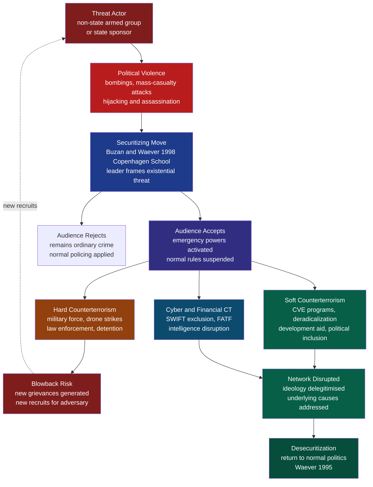

# Global Security and Terrorism

> [!abstract] TL;DR
> Terrorism is the deliberate use of violence against civilians to generate fear and coerce political change — a tactic deployed by non-state actors, state proxies, and occasionally states themselves. Understanding it requires three interlocking frameworks: the **strategic logic** of political violence (Kydd and Walter 2006), the **Copenhagen School's securitization theory** (Buzan and Wæver 1998) explaining how threats are socially constructed into emergencies, and the **counterinsurgency and CVE** literature mapping when hard vs. soft responses work and when they backfire.

---

## Intuition

**Analogy:** Imagine a neighbourhood where a small, weak gang cannot defeat the local police force in a direct fight. So instead of attacking the police station, the gang burns down a community centre, knowing the police will respond with a heavy-handed sweep of the neighbourhood — arresting innocents, kicking down doors, alienating the very residents who had been cooperating with law enforcement. The gang did not need to win the fight; it needed the police to *overreact*. The violence was not an end in itself — it was a signal designed to change the behaviour of a third audience.

This is the essence of terrorism as a strategic instrument: the direct victims are not the true targets. The bomb in the marketplace is addressed to the government watching on television, to the electorate that will demand a response, and to the diaspora abroad whose financial support the group needs to survive. Violence is communication — a costly signal about resolve, capability, and the price of non-compliance. The great insight of scholars like Martha Crenshaw and Thomas Schelling is that terrorism is *rational* in a bounded sense: it is an asymmetric actor's tool for manipulating a stronger adversary's decision calculus when conventional military challenge is impossible.

---

## How It Works



---

## Key Concepts

### Secondary Level

**What is terrorism?** No universally accepted legal definition exists, which is itself a political problem. The UN General Assembly has wrestled with a definition since 1972; states consistently disagree because "one man's terrorist is another man's freedom fighter." Most working definitions share three elements:

| Element | Content |
|---|---|
| Deliberate targeting of civilians | Distinguishes terrorism from conventional warfare, which in principle targets combatants |
| Political or ideological motive | Distinguishes terrorism from ordinary crime |
| Intent to generate fear beyond direct victims | The "theatre" dimension — violence as communication to a broader audience |

**Types of terrorism:**

| Type | Definition | Examples |
|---|---|---|
| Domestic terrorism | Perpetrators and targets within the same country; domestically motivated grievances | Oklahoma City bombing 1995; PIRA; Aum Shinrikyo Sarin attack Tokyo 1995 |
| International terrorism | Attacks crossing national borders, or targeting foreigners; internationally motivated ideology | al-Qaeda 9/11; ISIS Paris attacks 2015; Lockerbie bombing 1988 |
| State-sponsored terrorism | Government providing support — money, training, sanctuary, operational direction — to non-state terrorist groups | Iran and Hezbollah; Pakistan's ISI and LeT; North Korea's Bureau 121 |
| State terrorism | Government using terror against its own population; secret police, death squads, disappearances | Stalin's NKVD; Argentina's Dirty War 1976-1983; Assad's barrel bombs |
| Narcoterrorism | Drug trafficking organisations using terrorist tactics to intimidate states and societies | FARC in Colombia; Mexican cartels targeting journalists and judges |

**Causes of terrorism — grievance model:** Ted Gurr's *Why Men Rebel* (1970) introduced **relative deprivation** — the gap between what people expect and what they receive. When political exclusion, economic marginalisation, or cultural humiliation is acute, collective violence becomes more likely. This explains why poverty alone does not predict terrorism (most poor people do not become terrorists) but ethnic or religious *group* grievance, particularly when combined with a sense of historical injustice, is a powerful recruitment driver. Olivier Roy's concept of "failed integration" applies to Western European second-generation Muslim youth who feel neither fully European nor fully Muslim — a double marginalisation that radical organisations exploit.

**Radicalization pathways:** Fathali Moghaddam's "Staircase to Terrorism" (2005) depicts a psychological ascent:

1. **Ground floor** — Widespread grievance, sense of injustice, perceived humiliation
2. **First floor** — Individual perceives no legitimate path to address grievance; displacement of aggression onto an outgroup
3. **Second floor** — In-group/out-group thinking hardened; moral disengagement from the victim outgroup (dehumanisation)
4. **Third floor** — Categorical imperative to act; joining an organisation that validates violence
5. **Fourth floor** — Specific weapons training, operational desensitisation
6. **Top floor** — Sidestepping personal moral inhibition against killing; "cognitive opening" completed

McCauley and Moskalenko's "Two Pyramids" model (2011) distinguishes the **opinion pyramid** (many hold radical views) from the **action pyramid** (few act on them). Understanding which individuals traverse from opinion to action is the central practical challenge for intelligence services.

---

### Undergraduate Level

**The strategic logic of terrorism — Kydd and Walter (2006):**

Andrew Kydd and Barbara Walter's influential article "The Strategies of Terrorism" (*International Security* 31/1) identifies five distinct strategic logics, each predicting a different target selection and operational tempo:

| Strategy | Goal | Mechanism | Example |
|---|---|---|---|
| **Attrition** | Force target government to concede through raising costs | Demonstrate capacity to impose ongoing pain until concession is cheaper than continuation | Hezbollah vs Israel in Lebanon 1982-2000; IRA mainland campaign |
| **Intimidation** | Change civilian behaviour directly | Threaten population to stop supporting government or to comply | ISIS executions to deter resistance in Mosul 2014-2017 |
| **Provocation** | Goad government into overreaction that radicalises moderates | Strategic calculation that harsh reprisal alienates the moderates whose support the government needs | al-Qaeda's calculation that 9/11 would draw the US into unwinnable wars that would bankrupt it and inflame the Muslim world |
| **Spoiling** | Destroy a peace process between government and the moderate wing of a movement | Third-party attack timed to when a peace deal is imminent, framing moderates as unable to deliver security | Hamas bombings in 1996 timed to derail Oslo; PIRA splinter groups targeting the Good Friday Agreement |
| **Outbidding** | Win support of a constituency over a rival organisation | Signal that your group is the most committed fighter for the shared cause | Hamas vs Fatah; al-Qaeda vs secular Arab nationalist groups |

This typology is important because it shows that terrorism is not monolithic. A counterterrorism strategy that works against an attrition campaign (raise costs of operations) actively backfires against a provocation campaign (that is exactly what the group wants).

**Securitization theory — Copenhagen School:**

Barry Buzan, Ole Wæver, and Jaap de Wilde's *Security: A New Framework for Analysis* (1998) argues that security is not an objective condition but a **speech act**. An issue becomes a security issue when a "securitizing actor" — typically a political leader — successfully frames it as an existential threat to a referent object (the state, the nation, a way of life) requiring emergency measures beyond normal political procedure, and when an *audience* accepts that framing.

Three outcomes:
- **Successful securitization**: The audience accepts the frame. Normal political constraints are lifted. Civil liberties can be curtailed, surveillance expanded, wars launched with minimal legislative scrutiny. The AUMF (Authorization for Use of Military Force, 2001) — passed 98-0 in the US Senate three days after 9/11 — is the textbook example.
- **Rejection**: The audience resists the framing. The issue stays in ordinary politics. Governments that tried to securitize the 2015 migration crisis in liberal democracies had mixed success depending on whether they could make the "existential threat" argument credible.
- **Desecuritization** (Wæver's preferred outcome): Moving an issue *back* into normal political debate — lowering the temperature, allowing deliberation, civil liberties protections. The decommissioning process in Northern Ireland was partly a desecuritization of republican violence.

The *sectors* of security expanded by the Copenhagen School beyond military security:
- **Societal security**: collective identity threatened (language, culture, religion)
- **Economic security**: access to resources and markets
- **Environmental security**: ecosystem destruction as existential risk
- **Political security**: state sovereignty and institutional stability

**Human security vs state security:**

The UNDP Human Development Report 1994 shifted the referent of security from the *state* to the *individual*, introducing seven pillars:

1. Economic security (freedom from poverty)
2. Food security (access to nutrition)
3. Health security (freedom from disease)
4. Environmental security (clean environment)
5. Personal security (freedom from violence)
6. Community security (cultural identity protection)
7. Political security (freedom from state repression)

The tension: traditional counterterrorism is state-centric — protect borders, eliminate threats to the regime. Human security asks whether counterterrorism operations themselves produce insecurity for individuals: drone strikes that kill civilians, mass detention without trial, surveillance that chills dissent. From a human security lens, the "war on terror" may have reduced state security while devastating human security in Afghanistan, Iraq, Somalia, and Yemen.

**Insurgency and guerrilla warfare:**

Mao Zedong's theory of "protracted war" (*On Protracted War*, 1938) describes three phases:

| Phase | Description | Military logic |
|---|---|---|
| Strategic defensive | Guerrilla is weak; harass, avoid pitched battle, build political base | "The enemy advances, we retreat; the enemy camps, we harass; the enemy tires, we attack; the enemy retreats, we pursue" |
| Strategic stalemate | Rough parity; expand liberated zones, conventional units beginning to form | Mix guerrilla and mobile warfare; erode enemy morale and resources |
| Strategic offensive | Guerrilla has sufficient force for conventional military victory | Final conventional campaigns to destroy remaining enemy formations |

David Galula's *Counterinsurgency Warfare: Theory and Practice* (1964), written from his experience in Algeria, is the canonical counterinsurgency (COIN) text. Galula's core insight: insurgency is 20% military and 80% political. The government's objective is not to kill insurgents but to win the support of the population away from the insurgent. "Hearts and minds" is not sentiment — it is the operational objective. The population is the sea in which the guerrilla fish swim (Mao); drain the sea by improving governance, and the fish die.

General David Petraeus embedded Galula's logic in US Army Field Manual FM 3-24 (2006), deployed in the Iraq "Surge" (2007-2008): protect the population, build local political capacity, reduce civilian casualties. The Surge temporarily reduced violence in Iraq, but Galula's own lesson — that military success is meaningless without sustainable political institutions — was not learnt. ISIS emerged from the ashes of a dysfunctional post-Surge Iraqi political settlement.

---

### Graduate Level

**Transnational terrorism — network structure:**

Marc Sageman's *Understanding Terror Networks* (2004) and *Leaderless Jihad* (2008) mapped al-Qaeda's social network using open-source data on 400 jihadi militants. Findings:

- Al-Qaeda was not a hierarchical organisation with central command issuing orders, but a **social movement** networked through personal ties, mosque communities, and kinship.
- Most recruits were socially isolated prior to joining; the primary driver was friendship and belonging, not ideological conviction.
- "Bunch of guys" dynamic: small peer groups mutually radicalise each other, each individual pushing the group toward more extreme positions.
- Post-9/11 disruption: al-Qaeda lost its Afghan sanctuary and most of its operational leadership. What emerged was a **franchise model** — al-Qaeda in Iraq, al-Qaeda in the Arabian Peninsula, al-Shabaab — linked by shared ideology and occasional personnel, not by command structure.

ISIS represented a structurally different model: a **proto-state** that controlled territory, collected taxes, ran courts, managed oil sales, and published a glossy English-language magazine (Dabiq/Rumiyah). Its appeal was not just belonging but **governance** — the claim to have established a functioning Islamic state. This is why ISIS's military defeat (loss of Mosul 2017, Raqqa 2017) struck at the core of the brand in a way that mere disruption of al-Qaeda's network could not: it disproved the caliphate's claim to divine mandate.

**The "war on terror" and its critiques:**

Robert Pape's *Dying to Win* (2005) analysed all suicide terrorist attacks from 1980 to 2003 and found a counterintuitive pattern: suicide terrorism is primarily a response to **foreign military occupation**, not Islamic fundamentalism. The primary determinant is the perceived occupation of territory the group views as a homeland by a democratic power (because democracies are sensitive to casualties). Implication: US military presence in Muslim-majority countries was causally producing the suicide attacks it was meant to prevent.

The "blowback" thesis (Chalmers Johnson 2000) — derived from CIA terminology — argues that covert interventions create delayed, unintended consequences. The US arming of the Afghan mujahideen against the Soviet Union created the networks, weapons, and precedents that al-Qaeda later exploited. The invasion of Iraq destroyed the Baathist state structures whose former officers became the military backbone of ISIS.

**Drone warfare and signature strikes:**

The Obama administration dramatically expanded the drone programme, conducting approximately 500 strikes in Pakistan, Yemen, and Somalia from 2009-2017. Two targeting frameworks:

- **Personality strikes (TADS)**: targeting known, named individuals — requires positive identification
- **Signature strikes**: targeting *patterns of behaviour* consistent with militant activity, without necessarily knowing the identity of the target — men of military age in a known militant area carrying weapons

Signature strikes are legally and morally contested:
- **Legal**: under IHL, killing requires combatant status or direct participation in hostilities — pattern-of-life observation does not establish either
- **Strategic**: civilian casualty rates from signature strikes are substantially higher; each civilian death in tribal societies generates kinship obligations for revenge — the "tactical win, strategic loss" problem
- **Accountability**: the US government's definition of "combatants" as all military-age males in a strike zone post-facto reclassifies civilians as combatants in official counts, distorting oversight

**Hybrid warfare and grey-zone competition:**

Frank Hoffman's *Conflict in the 21st Century* (2007) coined "hybrid warfare" to describe how modern state and non-state actors blend conventional military forces, irregular tactics, terrorist acts, criminal behaviour, and information operations in the same operational space. Russia's seizure of Crimea (2014) is the paradigm case: "little green men" (unmarked special forces), information operations, separatist proxies, and cyber attacks on Ukrainian infrastructure all operating simultaneously — designed to stay below the threshold that would trigger NATO Article 5.

Private Military Companies (PMCs) are central to grey-zone warfare:
- **Blackwater/XE/Academi** in Iraq and Afghanistan: demonstrated that private contractors can perform roles from convoy protection to tactical operations without the same congressional oversight or political accountability
- **Wagner Group**: Russia's premier PMC; deployed in Syria, Libya, Mali, CAR, Sudan; provides plausible deniability for Russian operations while projecting hard power globally; Russian government denied any connection until Wagner mutinied in June 2023

**Cyber warfare and the Tallinn Manual:**

The 2010 Stuxnet attack — attributed to a US-Israeli operation targeting Iran's Natanz uranium enrichment facility — was the first publicly confirmed use of a cyberweapon to cause physical destruction. It destroyed approximately 1,000 centrifuges by causing them to spin erratically while reporting normal to operators. Key conceptual issues:

| Issue | Content |
|---|---|
| Attribution | The "who did it" problem: attacks are technically obfuscated; states deny; false-flag operations are feasible |
| Proportionality and distinction | IHL requires attacks be proportionate and distinguish combatants from civilians; most critical infrastructure is dual-use (civilian and military) |
| Threshold for armed conflict | When does a cyberattack constitute a use of force? Tallinn Manual 2.0 (2017) argues: if effects are equivalent to a conventional attack, IHL applies; but states dispute this |
| Escalation management | Cyber conflict lacks the signalling conventions of nuclear deterrence; misattribution or automated response creates escalation risk |

**Biosecurity:**

The Biological Weapons Convention (1972) bans development, production, and stockpiling of biological weapons but has no verification mechanism. Soviet Biopreparat programme (revealed by defector Ken Alibek 1998) developed weaponised smallpox, plague, and anthrax long after USSR signed the BWC. Contemporary biosecurity concerns:

- **Dual-Use Research of Concern (DURC)**: gain-of-function research that enhances pathogen transmissibility or lethality for ostensibly legitimate scientific purposes
- **Synthetic biology**: declining cost of DNA synthesis means non-state actors could theoretically engineer pathogens; the "democratisation of destruction"
- **COVID-19 as stress test**: the 2019-2023 pandemic exposed catastrophic failures in pandemic preparedness — inadequate stockpiles, supply chain dependencies, failure to operationalise existing plans (US Crimson Contagion exercise, 2019 predicted almost exactly what happened)

---

## Python Demo

```python
import numpy as np
import matplotlib.pyplot as plt

# ─────────────────────────────────────────────────────────────────────────────
# Attacker-Defender Game: The "Balloon Problem" in Counterterrorism
#
# N potential targets, each with a symbolic value V_i to the attacker.
# Government allocates a total defence budget B=1 across all N targets.
# Attack damage on target i = V_i * (1 - d_i)
#   where d_i is the fraction of budget allocated to target i.
# The rational attacker picks the target maximising expected damage.
# The government minimises that maximum (minimax / Stackelberg).
#
# Minimax-optimal solution:
#   Equalise residual damage across all defended targets:
#     V_i * (1 - d_i*) = c   =>   d_i* = 1 - c / V_i   (if positive)
#   Subject to: sum(d_i*) = B
#   Solve for c via binary search on the budget constraint.
#
# "Balloon problem": hardening one target beyond its optimal share
#   displaces the attacker toward other, now relatively soft, targets.
# ─────────────────────────────────────────────────────────────────────────────

N = 8
B = 1.0   # normalised total defence budget

# Target values (attacker's valuation, e.g., symbolic + casualty potential)
V      = np.array([2.0, 8.0, 5.0, 3.0, 9.0, 4.0, 7.0, 6.0])
labels = [f"T{i+1}" for i in range(N)]

# ── Scheme 1: Naive equal allocation ─────────────────────────────────────────
d_equal    = np.full(N, B / N)
dmg_equal  = V * (1.0 - d_equal)

# ── Scheme 2: Minimax-optimal (Stackelberg leader = government) ───────────────
# Binary search for Lagrange multiplier c
lo, hi = 0.0, float(V.max())
for _ in range(300):
    c     = (lo + hi) / 2.0
    d_cand = np.maximum(0.0, 1.0 - c / V)
    if d_cand.sum() < B:
        hi = c
    else:
        lo = c

d_opt  = np.maximum(0.0, 1.0 - c / V)
dmg_opt = V * (1.0 - d_opt)

# ── Scheme 3: Balloon — over-invest in highest-value target (T5) ─────────────
idx_max   = int(np.argmax(V))           # index 4 (T5, value 9)
leftover  = B - 0.55                    # 55 % poured into T5
d_balloon = np.full(N, leftover / (N - 1))
d_balloon[idx_max] = 0.55
dmg_balloon = V * (1.0 - d_balloon)

# ── Summary statistics ────────────────────────────────────────────────────────
schemes = [
    ("Equal allocation",    d_equal,    dmg_equal),
    ("Minimax-optimal",     d_opt,      dmg_opt),
    ("Balloon over-invest", d_balloon,  dmg_balloon),
]

print("Scheme                Max Damage  Best Attack Target")
print("-" * 52)
for name, d, dmg in schemes:
    print(f"{name:<23}  {dmg.max():.3f}       {labels[int(np.argmax(dmg))]}")

print(f"\nMinimax budget allocated: {d_opt.sum():.4f}  (should equal {B})")

# ── Plot ──────────────────────────────────────────────────────────────────────
x       = np.arange(N)
width   = 0.25
colours = ["#2563eb", "#059669", "#dc2626"]
names   = ["Equal allocation", "Minimax-optimal", "Balloon over-invest"]

fig, (ax_d, ax_dmg) = plt.subplots(2, 1, figsize=(12, 8), sharex=True)

for k, (name, d, dmg) in enumerate(schemes):
    ax_d.bar(x + (k - 1) * width, d,   width, label=name, color=colours[k], alpha=0.85)
    ax_dmg.bar(x + (k - 1) * width, dmg, width, color=colours[k], alpha=0.85)

# Annotate the attacker's preferred target under each scheme
for k, (name, d, dmg) in enumerate(schemes):
    best = int(np.argmax(dmg))
    ax_dmg.annotate(
        f"  attack\n  here",
        xy=(best + (k - 1) * width, dmg[best]),
        xytext=(best + (k - 1) * width + 0.05, dmg[best] + 0.3),
        fontsize=7, color=colours[k], arrowprops=dict(arrowstyle="->", color=colours[k]),
    )

ax_d.set_ylabel("Defence Allocated  d_i")
ax_d.set_title("Defence Resource Allocation Across Targets")
ax_d.legend(loc="upper left")
ax_d.grid(axis="y", alpha=0.3)

ax_dmg.set_ylabel("Expected Damage  V_i * (1 - d_i)")
ax_dmg.set_title("Residual Damage per Target — Attacker Picks the Maximum")
ax_dmg.set_xticks(x)
ax_dmg.set_xticklabels([f"{l}\n(V={v:.0f})" for l, v in zip(labels, V)], fontsize=9)
ax_dmg.grid(axis="y", alpha=0.3)

fig.suptitle(
    "The Balloon Problem in Counterterrorism\n"
    "Minimax allocation equalises residual damage; over-hardening one target"
    " displaces the threat elsewhere",
    fontsize=11,
)
plt.tight_layout()
plt.savefig("balloon_problem_counterterrorism.png", dpi=150)
plt.show()
```

**What the model shows:**

- **Equal allocation** ignores the fact that targets differ in attractiveness. The attacker exploits high-value, lightly defended targets.
- **Minimax-optimal** solves for the defensive allocation that makes the attacker *indifferent* between targets — the residual damage is the same everywhere, so the attacker gains nothing by switching. This is the game-theoretic "mixed strategy equilibrium" interpretation applied to resource allocation.
- **Balloon over-invest** shows that pouring 55% of the budget into T5 (the highest-value target) leaves T2 and T7 relatively exposed — the attacker simply redirects there. This is the "balloon problem": squeeze one part and the threat bulges out elsewhere. The insight applies directly to real counterterrorism: hardening airports intensifies focus on soft targets; destroying one cell causes the network to decentralise further.

---

## Real-World Applications

**1. IRA's Attrition Strategy vs British Counterterrorism**

The Provisional IRA (1969-2005) pursued a classic attrition campaign: make British rule of Northern Ireland too costly to sustain. The 1996 Manchester bombing caused over £700m in insurance damage from one device. By the mid-1990s, British security services assessed that the PIRA could not be defeated militarily; simultaneously, Sinn Féin leadership recognised the "Armalite and ballot box" strategy was reaching its limits. Kydd-Walter attrition logic maps precisely: terrorism imposed costs until the stronger party (the British government) calculated negotiation was cheaper than continuation. The result was the Good Friday Agreement (1998) — a negotiated settlement that addressed the underlying political grievances without full concession to IRA demands.

**2. al-Qaeda's Provocation Strategy**

Bin Laden's explicit strategic goal, articulated in his 1996 and 1998 fatwas, was to provoke a US military overreaction that would:
- Radicalise the broader Muslim world against US foreign policy
- Draw the US into unwinnable counter-insurgencies that would drain US resources (the "bleed until bankruptcy" strategy articulated in his 2004 video)
- Demonstrate the weakness of secular Arab regimes that cooperated with the US

The 9/11 attacks triggered exactly this response: the invasions of Afghanistan and Iraq, mass surveillance programmes (PRISM), torture at Abu Ghraib, and the Guantanamo detention system — all became global recruiting tools for jihadist movements. Al-Qaeda's operational capacity was severely degraded after 2001, but the provocation strategy succeeded strategically: the War on Terror cost the United States an estimated $8 trillion and ended in withdrawal from both Afghanistan and Iraq.

**3. ISIS's Proto-State Model and Territorial Collapse**

ISIS's 2014-2017 governance of territory roughly the size of the United Kingdom was unprecedented for a non-state terrorist organisation. By running courts, schools, electricity supply, and an oil export economy, ISIS validated its caliphate claim in a way that pure terrorist organisations cannot. This also created a strategic vulnerability: destroying the territory destroyed the brand. The loss of Mosul (July 2017) and Raqqa (October 2017) removed ISIS's most powerful recruitment argument. What remained — decentralised "inspired" attacks in Europe and Africa — is strategically weaker even if tactically difficult to prevent. This illustrates the tradeoff between state-building and resilience in terrorist organisations.

**4. Securitization of Migration — Copenhagen School in Practice**

Viktor Orbán's Hungary systematically securitized migration after 2015, framing Syrian and Afghan refugees as an existential threat to Hungarian culture and Christian identity. By Wæver's logic: Orbán was the securitizing actor; the Hungarian public and parliament were the audience; the referent object was "Hungarian civilisation." The securitization succeeded domestically — emergency border fencing, detention, and criminalisation of asylum assistance were all justified under the security frame. This illustrates both the power and the danger of securitization: it creates space for measures that would otherwise be politically impossible, but it does so by removing deliberation and rights protections.

**5. Stuxnet and the New Rules of Cyber Conflict**

The Stuxnet worm (discovered 2010, attributed to Operation Olympic Games run jointly by NSA and Unit 8200) was targeted with unusual precision — it activated only on specific Siemens S7-315 PLCs in a very specific network topology that matched the Natanz centrifuge configuration. It achieved a kinetic effect (destroyed ~1,000 centrifuges) through cyber means. Its strategic impact was limited: Iran redoubled its enrichment programme. Its long-term consequence was to legitimise state use of cyber offensive tools, triggering an international cyber arms race. The US released a weapon it could not re-bottle: once Stuxnet escaped into the wild (which it did), other actors could study and adapt it. The lesson: cyber weapons are non-excludable once deployed.

---

## Common Pitfalls

- **Treating terrorism as irrational** — The most common error in popular and policy discourse. Most terrorist organisations make strategic calculations. When counterterrorism analysts dismiss terrorists as "madmen," they miss the strategic logic that should guide the response. Kydd and Walter's framework shows that each terrorist strategy has a specific vulnerability that a targeted response can exploit; treating all terrorism as irrational forecloses targeted responses.

- **Conflating the tactic with the ideology** — "Terrorism" is a tactic, not an ideology. It can be deployed by jihadists, ethno-nationalists, eco-terrorists, anti-abortion activists, or right-wing white supremacists. Counterterrorism frameworks built around one ideological type (post-9/11 focus on Islamist groups) systematically undercount and underweight domestic and far-right threats, as the 2019 Christchurch and 2011 Oslo attacks demonstrated.

- **The provocation trap** — Hard counterterrorism responses can serve the terrorist's strategic goal if the group is pursuing a provocation strategy. Mass surveillance, civilian casualties from drone strikes, and detention without trial all generate grievances that feed recruitment. The measure of success cannot be number of terrorists killed; it must include new terrorists created.

- **Securitization creep** — Once an issue is securitized, it is very difficult to desecuritize. The post-9/11 surveillance architecture built under the PATRIOT Act, PRISM, and related programmes persisted for decades; many provisions have been renewed or made permanent. Securitization creates institutional interests (intelligence agencies, defence contractors, the national security bureaucracy) that resist desecuritization even when the original threat diminishes.

- **Ignoring governance deficits as root causes** — Pure security responses address symptoms rather than causes. The strongest predictor of sustained insurgency is not the military capacity of the insurgent but the governance quality and legitimacy of the government being challenged. COIN theory (Galula, FM 3-24) explicitly recognises this, but military operations tend to crowd out the slower, harder political work of institutional reform.

- **Over-generalising from individual psychological profiles** — There is no single psychological "terrorist profile." Systematic reviews (Horgan 2014) find terrorists come from diverse backgrounds, and the same individual characteristics appear in non-terrorists. Radicalization is a social and organisational process, not a consequence of psychopathology. The search for a "terrorist personality" consistently fails and leads to profiling errors.

- **The attribution problem in cyber warfare** — Attributing a cyberattack with legal certainty is extremely difficult. The political pressure on governments to attribute rapidly (for deterrence purposes) conflicts with technical and legal standards of evidence. False attribution risks crisis escalation; slow attribution enables deterrence failure. States have not yet developed adequate institutional frameworks for managing this tension.

---

## Related Concepts

- [[International_Relations_Theories]] — Securitization theory is a post-structuralist IR framework; terrorism challenges neorealist state-centric security models by placing non-state actors at the centre of security analysis
- [[Geopolitics_and_Power_Politics]] — Transnational terrorism is partly a product of geopolitical interventions; the "war on terror" reshapes the geopolitical landscape of Central Asia and the Middle East; great power competition shapes state sponsorship of terrorism
- [[The_State_System_and_Sovereignty]] — Non-state armed actors challenge the Westphalian monopoly on legitimate violence; "failed states" as terrorism sanctuaries raise sovereignty vs intervention dilemmas
- [[Diplomacy_and_Foreign_Policy]] — Counterterrorism is a major domain of foreign policy coordination; extradition treaties, financial intelligence sharing (FATF), and intelligence liaison are diplomatic instruments of CT
- [[Authoritarianism_and_Hybrid_Regimes]] — Authoritarian states sponsor terrorism as instruments of foreign policy; they also use the terrorism threat to justify repression of political opposition (securitization as authoritarian tool)
- [[Contemporary_Political_Ideologies]] — Religious extremism, ethno-nationalism, and eco-terrorism all represent radicalised expressions of broader ideological currents; understanding the ideology is prerequisite to countering it
- [[Nash_Equilibrium]] — The attacker-defender game in counterterrorism is a zero-sum game; the mixed-strategy Nash equilibrium of this game generates the minimax-optimal defence allocation demonstrated in the Python demo above
- [[Mixed_Strategies]] — In the terrorist-government game, both sides mix their strategies in equilibrium: the government randomises across defensive allocations; the terrorist randomises across target choices to prevent exploitation
- [[Group_Dynamics]] — Moghaddam's Staircase and Sageman's "bunch of guys" mechanism are fundamentally about in-group dynamics, social identity, and mutual radicalisation within small cells; Tajfel's Social Identity Theory provides the micro-foundation
- [[Prejudice_and_Discrimination]] — Dehumanisation of outgroups is a necessary psychological step in the radicalization staircase; prejudice research illuminates why moral disengagement from victims is achievable under certain social conditions
- [[Decision_Making_and_Reward_Circuits]] — Suicide terrorism involves extreme risk-acceptance; decision neuroscience of threat, fear, and identity-based motivation illuminates why conventional cost-benefit models of deterrence underperform against ideologically committed actors
- [[Limbic_System_and_Diencephalon]] — The amygdala-mediated fear response is the psychological mechanism that securitization theorists exploit; post-9/11 populations accepted surveillance and civil liberties curtailments that would have been politically impossible in lower-fear environments
- [[Threat_Modeling]] — Cyber terrorism and hybrid warfare threats are formally modelled using attacker-defender frameworks analogous to cybersecurity threat modelling; the STRIDE and ATT&CK frameworks have direct applications to counterterrorism planning
- [[Threat_Intelligence_Overview]] — Intelligence collection, fusion, and dissemination are the operational backbone of counterterrorism; HUMINT, SIGINT, OSINT, and financial intelligence are integrated in joint terrorism task force models
- [[_MOC_Contemporary_Global_Issues|↑ Contemporary Global Issues MOC]] — section map and learning path for this cluster of notes

---

## Review Questions

### Secondary

1. The IRA used bombing campaigns in Britain rather than exclusively in Northern Ireland, targeting commercial districts rather than military targets. Using Kydd and Walter's five strategies of terrorism, identify which strategic logic this represents and explain the intended causal mechanism — who was the true audience, and what behaviour was the violence intended to change?

2. The US government passed the PATRIOT Act and vastly expanded surveillance powers within weeks of the 9/11 attacks. Using Buzan and Wæver's securitization theory, explain how this was possible. Who was the securitizing actor, who was the audience, and what was the referent object being protected? What would "desecuritization" of terrorism look like in practice?

3. David Galula argued that counterinsurgency is 80% political and 20% military. Using the US experience in Afghanistan (2001-2021), evaluate this claim. What political failures accompanied military successes, and what does this imply for how we should measure "victory" in counterinsurgency?

### Undergraduate

1. Robert Pape's research on suicide terrorism found that the primary driver was foreign military occupation, not Islamic fundamentalism. If Pape is correct, what are the implications for a US counterterrorism strategy that relies heavily on military force in Muslim-majority countries? How does this interact with Kydd and Walter's "provocation" strategy category?

2. ISIS's territorial caliphate was destroyed militarily by 2018, yet ISIS-inspired attacks continued in Europe and Africa. Using Sageman's network model and the distinction between centralised (proto-state) and decentralised (franchise/leaderless jihad) organisational structures, explain why the destruction of ISIS territory did not end the threat. What does this imply for the "drain the swamp" metaphor often used to justify military interventions?

3. The Copenhagen School argues that securitization is a performative speech act that can be used by authoritarian leaders to justify repressive measures. Compare the securitization of terrorism in post-9/11 US with the securitization of ethnic minorities in Orbán's Hungary and Xi's Xinjiang. In what ways does securitization theory equally explain liberal democratic and authoritarian responses to claimed threats? What normative implications follow from the theory's analytical symmetry?

### Graduate

1. Kydd and Walter's strategic logic framework assumes that terrorist organisations are unitary rational actors pursuing coherent goals. But organisational theory suggests that terrorist groups are riven by internal competition, ideological factionalism, and the "outbidding" dynamic. Assess the limits of the rationalist model by applying it to the Hamas-Fatah rivalry and the al-Qaeda–ISIS schism. Does the strategic logic framework require modification to account for intra-movement competition, and if so, how?

2. The Tallinn Manual 2.0 attempts to apply existing International Humanitarian Law to cyber conflict by analogy: cyberattacks are governed by IHL when their effects are equivalent to a conventional use of force. Critically evaluate this approach. Given the attribution problem, the dual-use nature of cyber infrastructure, and the non-kinetic character of most cyberattacks, is the "effects equivalence" standard adequate? What alternative legal frameworks have been proposed, and what are their practical limitations?

3. The human security paradigm (UNDP 1994) and the traditional state security paradigm generate radically different policy prescriptions for addressing terrorism. A state-security framework prioritises intelligence collection, military force, and border control; a human security framework prioritises addressing economic marginalisation, political inclusion, and civilian protection. Using evidence from at least two case studies, evaluate whether these are genuinely competing frameworks or whether effective counterterrorism requires both — and if so, how the inevitable tensions between them (surveillance vs. privacy, military force vs. civilian protection) should be managed institutionally.

---

## Sources

- [Kydd, A. & Walter, B. (2006). "The Strategies of Terrorism." *International Security* 31(1), 49-80](https://www.jstor.org/stable/4137539)
- [Buzan, B., Wæver, O., & de Wilde, J. (1998). *Security: A New Framework for Analysis*. Lynne Rienner Publishers](https://www.rienner.com/title/Security_A_New_Framework_for_Analysis)
- [Moghaddam, F.M. (2005). "The Staircase to Terrorism." *American Psychologist* 60(2), 161-169](https://psycnet.apa.org/doi/10.1037/0003-066X.60.2.161)
- [Galula, D. (1964). *Counterinsurgency Warfare: Theory and Practice*. Praeger Security International](https://www.amazon.com/Counterinsurgency-Warfare-Theory-Practice-Praeger/dp/0275993035)
- [Pape, R. (2005). *Dying to Win: The Strategic Logic of Suicide Terrorism*. Random House](https://www.penguinrandomhouse.com/books/116041/dying-to-win-by-robert-a-pape/)
- [Sageman, M. (2004). *Understanding Terror Networks*. University of Pennsylvania Press](https://www.upenn.edu/pennpress/book/14048.html)
- [Horgan, J. (2014). *The Psychology of Terrorism*. Routledge](https://www.routledge.com/The-Psychology-of-Terrorism/Horgan/p/book/9780415710756)
- [UNDP (1994). *Human Development Report 1994: New Dimensions of Human Security*. Oxford University Press](http://hdr.undp.org/en/content/human-development-report-1994)
- [Tallinn Manual 2.0 on the International Law Applicable to Cyber Operations (2017). NATO CCDCOE](https://ccdcoe.org/research/tallinn-manual/)
- [Mao Zedong (1938). *On Protracted War*](https://www.marxists.org/reference/archive/mao/selected-works/volume-2/mswv2_09.htm)
- [US Army / Marine Corps (2006). *FM 3-24 Counterinsurgency*. Department of the Army](https://armypubs.army.mil/epubs/DR_pubs/DR_a/ARN30972-FM_3-24-000-WEB-1.pdf)
- [Hoffman, F.G. (2007). *Conflict in the 21st Century: The Rise of Hybrid Wars*. Potomac Institute for Policy Studies](https://www.potomacinstitute.org/images/stories/publications/potomac_hybridwar_0108.pdf)
- [McCauley, C. & Moskalenko, S. (2011). *Friction: How Radicalization Happens to Them and Us*. Oxford University Press](https://global.oup.com/academic/product/friction-9780199737796)
- [Alibek, K. (1999). *Biohazard: The Chilling True Story of the Largest Covert Biological Weapons Program in the World*. Random House](https://www.randomhouse.com/book/9624/biohazard-by-ken-alibek/)
- [Allison, G. et al. (2023). "The War on Terror Twenty Years On." *National Security Journal*](https://natsecjournal.org)

---

#PoliticalScience #GlobalIssues #GlobalSecurity #Terrorism #Counterterrorism #Securitization #Insurgency #HybridWarfare #CyberWarfare #HumanSecurity
