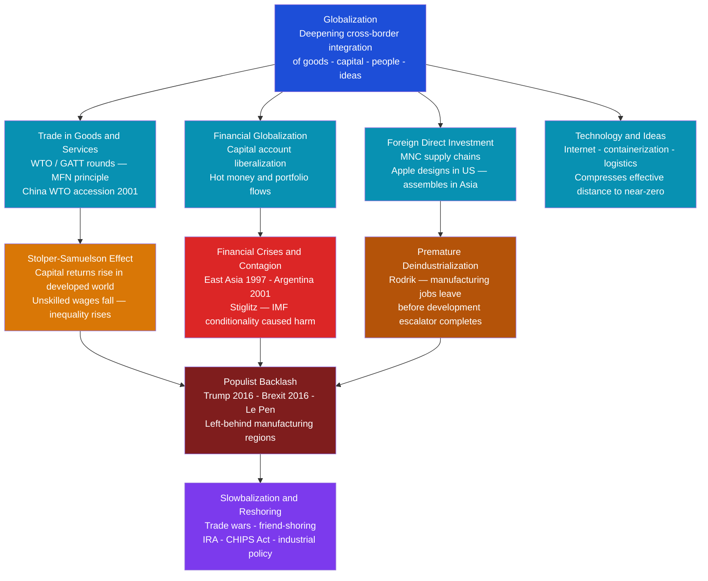

# Globalization and Its Discontents

> [!abstract] TL;DR
> Globalization is the deepening integration of the world economy, polity, and culture — producing the largest reduction in poverty in human history while simultaneously generating fierce distributional conflicts that have fueled the most powerful political backlash since the 1930s. Understanding it requires holding two things simultaneously: the aggregate gains are real and large, and the distribution of those gains is skewed in ways that have hollowed out developed-country working classes and produced a wave of nationalist populism.

---

## Intuition

**Analogy:** Imagine a large city deciding to tear down its neighborhood walls and let anyone move to any district freely.

Property values in the wealthiest neighborhoods skyrocket — the elite can now draw from a global talent pool of architects, chefs, and investment managers. Rents in working-class districts initially fall as cheap goods flood local markets, but wages fall too as the local workforce now competes with millions of lower-cost workers elsewhere. The city as a whole becomes richer — total GDP measured at the city level rises substantially. But the distribution matters enormously: the architect in the penthouse and the factory worker in the old industrial ward both "live in the same city," yet globalization has widened the distance between them. And if that factory worker cannot move to the penthouse district, cannot retrain overnight, and loses the familiar neighborhood identity along with the job — the political resentment that follows is entirely rational.

That is globalization at the national scale. The walls are tariffs and capital controls. The penthouse is the knowledge-economy coastal elite. The factory worker is the Rust Belt or post-industrial Midlands. The political resentment is Brexit and Trump 2016.

---

## How It Works



---

## Key Concepts

### Secondary Level

**What is globalization?**

Globalization describes the widening, deepening, and speeding up of interconnections that link distant communities across the world. It has at least four distinct dimensions:

| Dimension | Mechanism | Example |
|---|---|---|
| **Economic** | Trade, FDI, finance, supply chains | iPhone manufactured in 43 countries |
| **Political** | Pooled sovereignty, international institutions | WTO dispute panels binding states |
| **Cultural** | Media, migration, tourism | Hollywood films — K-pop — fast food chains |
| **Technological** | Internet, containerization, logistics | $2,000 container vs. $420 per ton in 1950 |

The dimensions interact: cheaper logistics enabled trade; trade created economic interests in preventing conflict; economic interdependence altered political sovereignty debates; cultural exchange generated both cosmopolitan openness and reactive nationalism.

---

**Three Waves of Globalization**

| Wave | Period | Characteristics | Disruption |
|---|---|---|---|
| **First wave** | 1870–1914 | Gold standard, steam shipping, telegraph — first era of truly global factor markets | WWI, Great Depression, beggar-thy-neighbor tariffs — collapse by 1932 |
| **Second wave** | 1944–1970s | Bretton Woods: IMF, World Bank, GATT — trade liberalization with capital controls | Nixon shock 1971 (end of gold-dollar), oil shocks, stagflation |
| **Third wave** | 1980–2008 | Capital account liberalization, China WTO (2001), global supply chains, internet — "hyperglobalization" | GFC 2008, then COVID-19 2020 — supply chain resilience crisis |
| **Slowbalization** | 2008–present | Trade/GDP ratio plateaus, US-China tech war, reshoring, industrial policy | Ongoing geopolitical fragmentation |

The first wave ended catastrophically: the interwar period demonstrated that unconstrained economic interdependence without political coordination creates both economic instability (financial contagion) and political backlash (fascism, Smoot-Hawley tariffs). This lesson shaped the post-WWII order.

---

**Ruggie's Embedded Liberalism**

John Gerard Ruggie's 1982 essay coined the term "embedded liberalism" to describe the post-WWII compromise. The deal: international openness in trade, but with **domestic buffers** — Keynesian demand management, welfare states, capital controls — that protected citizens from the full volatility of market fluctuations.

The key insight is that free markets generate losers as well as winners. Embedded liberalism accepted this but promised the state would compensate losers, provide adjustment assistance, and maintain aggregate demand. The political precondition for open trade was domestic social insurance.

From the 1980s onward, this bargain broke down:
- Capital account liberalization eliminated states' ability to manage exchange rates
- Financial markets gained veto power over fiscal policy (bond vigilantes)
- Structural adjustment conditionality (IMF) dismantled welfare buffers in developing countries
- Technological change (automation) compounded trade displacement in manufacturing

---

### Undergraduate Level

**Rodrik's Trilemma (The Political Trilemma of the World Economy)**

Dani Rodrik's most influential framework, articulated in *The Globalization Paradox* (2011), identifies a structural impossibility:

> You cannot simultaneously have (1) deep economic integration, (2) national sovereignty, and (3) mass democratic politics. You can pick any two.

| Configuration | Integration | Sovereignty | Democracy | Example |
|---|---|---|---|---|
| **Bretton Woods** | Moderate | Yes | Yes | 1945–1971: capital controls preserved policy space and democratic accountability |
| **Gold Standard / Hyperglobalization** | Full | Yes | No | Pre-1914 gold standard, or EMU austerity: markets override democratic choices |
| **Global Federalism** | Full | No | Yes | The EU aspiration: integrate fully and govern democratically, but pool sovereignty |

The trilemma is structural, not ideological. When the EU (attempting Global Federalism) imposed austerity on Greece in 2015, Greek voters voted 61% OXI (no) in a referendum — and the ECB and EU overrode it. The choice between integration and democracy was made explicitly: integration won. Podemos, SYRIZA, Brexit, Trump — all represent electorates reaching for Column 3 (Democracy) and reasserting Column 2 (Sovereignty) against Column 1 (Integration).

---

**The Stolper-Samuelson Theorem and Inequality**

The Heckscher-Ohlin (H-O) model of international trade makes a sharp distributional prediction: countries export goods that use their abundant factor intensively and import goods that use their scarce factor intensively. The **Stolper-Samuelson theorem** (1941) derives the factor-price consequence:

> Trade liberalization raises the real return to the abundant factor and lowers the real return to the scarce factor.

In a developed, capital-abundant country (US, Germany):
- Abundant factor = skilled workers and capital
- Scarce factor = unskilled labor
- Trade with labor-abundant countries (China, Vietnam) **raises** returns to capital and **lowers** real wages of unskilled workers

The "magnification effect" makes the swing more extreme than the goods price change: if the price of capital-intensive goods rises by 10%, capital's return rises by more than 10% and unskilled wages fall in real terms.

**Empirical refinement**: The full H-O story is cleaner in theory than in data. Autor, Dorn, and Hanson's "China shock" papers (2013, 2016) use county-level data to show that US regions directly exposed to Chinese import competition suffered persistent wage and employment declines that standard trade adjustment assistance programs did not repair. The geographical concentration of harm is crucial: Detroit or Sunderland cannot easily pivot to Silicon Valley.

---

**Stiglitz's Critique: The IMF and the Washington Consensus**

Joseph Stiglitz, former World Bank Chief Economist and 2001 Nobel Laureate, argues in *Globalization and Its Discontents* (2002) that the international financial institutions (IMF, World Bank, WTO) systematically mismanaged globalization:

The **Washington Consensus** (Williamson, 1989) prescribed three policies for developing countries:
1. Fiscal discipline (austerity)
2. Privatization of state enterprises
3. Capital account liberalization

Stiglitz's empirical objection: these were applied as rigid ideological prescriptions rather than context-sensitive recommendations. The sequencing was wrong — capital account liberalization before developing sound financial regulation invited "hot money" flows and currency crises. When East Asian economies opened capital accounts in the mid-1990s without deposit insurance or adequate bank regulation, the 1997 crisis followed. IMF-prescribed austerity during the crisis deepened recessions and created avoidable poverty.

**Counter-critique**: Economists like Anne Krueger and Sebastian Edwards argue that the alternative — continued financial repression and state enterprise inefficiency — had equally bad consequences (see Latin America's "lost decade" under ISI policies). The debate is empirical and unresolved, but Stiglitz shifted the mainstream consensus toward more cautious capital account liberalization sequencing.

---

**Milanovic's Elephant Chart and Global Inequality**

Branko Milanovic's analysis of global income distribution changes from 1988 to 2008 produced the "elephant chart" — one of the most discussed economic visualizations of the 21st century.

Plotting income growth (y-axis) against global income percentile (x-axis):
- **Hump of the elephant (30th–60th percentile globally):** Large gains — these are the Chinese, Indian, Indonesian, and Brazilian urban middle classes whose real incomes roughly doubled as their countries industrialized
- **Trough (75th–90th percentile globally):** Near-zero or negative gains — these are the lower-middle and working classes of developed countries (US, UK, France, Germany), who are "rich" by global standards but saw stagnant real wages
- **Trunk tip (top 1%):** Very large gains — the global rich, overwhelmingly concentrated in developed countries

The chart makes Rodrik's trilemma politically vivid: the people who gained most (emerging market middle classes) don't vote in US or UK elections; the people who stagnated (developed-country working class) do.

**Important nuance**: Xavier Sala-i-Martin and others have shown that *global* inequality (measured across all individuals worldwide) actually fell over 1990–2015, driven by Chinese and Indian growth. But *within-country* inequality in most developed nations rose. Both claims are true simultaneously: the world became more equal globally while most developed countries became internally more unequal.

---

**Premature Deindustrialization (Rodrik)**

Classical development theory held that countries followed a sequenced path: agriculture → manufacturing → services. Manufacturing was the "escalator" — it absorbed low-skilled rural migrants, generated productivity gains, and produced middle-class wages without requiring high education levels. The East Asian miracle (South Korea, Taiwan, China) followed this template.

Rodrik's observation (2016): **developing countries are deindustrializing much earlier, at much lower income levels**, than historical precedent suggests.

Why? Three forces:
1. **Global competition**: Chinese manufacturing dominance absorbed market share, leaving little room for new entrants
2. **Automation**: Manufacturing is increasingly capital-intensive and automated, reducing the labour-absorption function
3. **Tradability**: Services are becoming more internationally tradable (software, call centers), but not enough to substitute for manufacturing's role

The consequence: countries like South Africa, Brazil, and many sub-Saharan African nations may never follow the East Asian path. They must leap directly to a services economy without the income-building phase manufacturing provided — a structural challenge development economics does not yet have a clear answer to.

---

### Graduate Level

**The Hyper-Globalization Trilemma and Its Political Economy**

The Washington Consensus era (1990–2008) represented a bet on the "Bretton Woods 2" thesis: that global financial integration could be maintained without the capital controls that the original Bretton Woods required. This bet assumed:
- Financial markets efficiently price sovereign risk
- "Hot money" flows toward productive investment rather than speculation
- Domestic policy credibility (often meaning central bank independence and fiscal restraint) could substitute for capital controls

The 2008 Global Financial Crisis falsified key premises:
- Financial markets mispriced risk catastrophically (AAA-rated CDOs containing subprime mortgages)
- Capital flows into housing bubbles (Spain, Ireland) rather than productive investment
- Credibility signals (Ireland had budget surpluses until 2007) provided no protection

Post-GFC policy consensus shifted: the IMF itself (2012 "Institutional View") acknowledged that capital flow management tools (a polite term for capital controls) can be legitimate under certain circumstances — a complete reversal of its 1990s position.

---

**From Globalization to Deglobalization: The 2020s Turn**

Several forces are producing what Richard Baldwin calls "slowbalization":

| Force | Mechanism | Policy Response |
|---|---|---|
| **US-China strategic rivalry** | Technology decoupling — Huawei, TSMC, semiconductors | Export controls on advanced chips (CHIPS Act 2022) |
| **COVID-19 supply chain crisis** | Just-in-time manufacturing collapsed in shortages | "Just-in-case" inventory, reshoring, supplier diversification |
| **Climate policy** | Carbon border adjustment mechanisms (EU CBAM) | Trade policy as climate instrument |
| **Energy security** | Russian gas dependence as geopolitical vulnerability (Europe 2022) | Friend-shoring: diversifying suppliers to geopolitical allies |
| **Industrial policy revival** | Inflation Reduction Act (2022): $369bn in clean energy subsidies | GATT-incompatible subsidies accepted as strategic necessity |

The result is not reversal but reorganization: global trade continues, but supply chains are shortening, diversifying away from China, and increasingly following geopolitical alignment rather than pure comparative advantage. "Friend-shoring" — the US Treasury's term (Yellen, 2022) — explicitly prioritizes allied supply over cost minimization.

This represents a partial return to embedded liberalism logic: trade openness, but with strategic buffers for security, resilience, and political sustainability.

---

## Python Demo

```python
import numpy as np
import matplotlib.pyplot as plt

# ─── Stolper-Samuelson via Heckscher-Ohlin: Distributional Effects of Trade ──
# Developed country (capital-abundant): K/L = 4.0
# Two sectors:
#   X = capital-intensive (technology hardware)  — uses 0.8K + 0.2L per unit
#   Y = labor-intensive  (apparel / assembly)    — uses 0.2K + 0.8L per unit
#
# Stolper-Samuelson theorem: when trade openness raises the price of the
# capital-intensive good (X), the return to capital rises MORE than
# proportionately and the real wage of unskilled labor FALLS in absolute terms.
# This is the magnification effect.

# --- Factor input coefficients ---
a_KX, a_LX = 0.8, 0.2   # capital and labor per unit of good X
a_KY, a_LY = 0.2, 0.8   # capital and labor per unit of good Y

# --- Trade openness: raises relative price of capital-intensive good ---
# P_X(theta) = 1.0 + theta * 0.5  (50% max rise at full trade openness)
# P_Y = 1.0 (normalized, unchanged)
theta_values = np.linspace(0, 1, 101)
delta_P = 0.5

wages    = np.zeros(len(theta_values))
capitals = np.zeros(len(theta_values))

for i, theta in enumerate(theta_values):
    P_X = 1.0 + theta * delta_P
    P_Y = 1.0
    # Zero-profit conditions: [a_KX  a_LX] [r]   [P_X]
    #                         [a_KY  a_LY] [w] = [P_Y]
    A = np.array([[a_KX, a_LX],
                  [a_KY, a_LY]])
    r, w = np.linalg.solve(A, np.array([P_X, P_Y]))
    capitals[i] = r
    wages[i]    = w

rw_ratio = capitals / wages

# ─── Milanovic Elephant Chart (stylized 1988–2008 data) ──────────────────────
# Global income percentile on x-axis; cumulative real income growth on y-axis.
# Key features:
#   Hump  (~40-60th pct): emerging market middle class gains — China/India
#   Trough (~75-90th pct): developed-country working class stagnation
#   Trunk  (~top 1%): global rich gains — mostly developed-country finance/tech

percentiles = np.linspace(1, 99, 99)

gains = (
    42  * np.exp(-((percentiles - 50)**2) / (2 * 14**2))   # global middle class hump
    + 0.4 * percentiles                                       # overall upward trend
    - 22  * np.exp(-((percentiles - 80)**2) / (2 * 5**2))   # developed-world trough
    + 35  * np.exp(-((percentiles - 98)**2) / (2 * 1.8**2)) # top 1% trunk
)

# ─── Plot ─────────────────────────────────────────────────────────────────────
fig, axes = plt.subplots(1, 3, figsize=(16, 5))

# Panel 1: Factor price changes
axes[0].plot(theta_values, wages,    label="Wage — unskilled labor", color="steelblue", linewidth=2)
axes[0].plot(theta_values, capitals, label="Return to capital",      color="tomato",    linewidth=2)
axes[0].axhline(1.0, color="gray", linestyle="--", linewidth=0.8, label="Autarky baseline")
axes[0].set_xlabel("Trade Openness  (0 = autarky, 1 = full trade)", fontsize=9)
axes[0].set_ylabel("Real Factor Price", fontsize=9)
axes[0].set_title("Stolper-Samuelson Theorem\nFactor Prices vs Trade Openness", fontsize=10)
axes[0].legend(fontsize=8)

# Panel 2: Capital/Labor inequality ratio
axes[1].plot(theta_values, rw_ratio, color="darkorchid", linewidth=2)
axes[1].axhline(1.0, color="gray", linestyle="--", linewidth=0.8, label="Autarky r/w = 1")
axes[1].set_xlabel("Trade Openness", fontsize=9)
axes[1].set_ylabel("r / w  (inequality proxy)", fontsize=9)
axes[1].set_title("Capital vs Labor Return Ratio\nDeveloped-Country Inequality", fontsize=10)
axes[1].legend(fontsize=8)

# Panel 3: Elephant chart
axes[2].plot(percentiles, gains, color="darkorange", linewidth=2)
axes[2].axhline(0, color="gray", linestyle="--", linewidth=0.8)
axes[2].fill_between(percentiles, gains, 0,
                     where=(gains > 0), alpha=0.25, color="green",
                     label="Net gainers from globalization")
axes[2].fill_between(percentiles, gains, 0,
                     where=(gains < 0), alpha=0.25, color="red",
                     label="Net losers from globalization")
axes[2].annotate("Global middle class\n(China, India)",
                 xy=(50, 35), fontsize=7, ha="center", color="darkgreen")
axes[2].annotate("Developed-world\nworking class",
                 xy=(80, -12), fontsize=7, ha="center", color="darkred")
axes[2].annotate("Global\ntop 1%",
                 xy=(98, 28), fontsize=7, ha="center", color="darkorange")
axes[2].set_xlabel("Global Income Percentile", fontsize=9)
axes[2].set_ylabel("Cumulative Income Growth  (%)", fontsize=9)
axes[2].set_title("Milanovic Elephant Chart (stylized)\n1988–2008 Global Income Gains", fontsize=10)
axes[2].legend(fontsize=8)

plt.suptitle(
    "Distributional Consequences of Globalization\n"
    "Stolper-Samuelson factor prices (left/center) and Milanovic elephant chart (right)",
    fontsize=11, y=1.01
)
plt.tight_layout()
plt.savefig("globalization_distributional_effects.png", dpi=150)
plt.show()

# ─── Print summary ────────────────────────────────────────────────────────────
print("=== Stolper-Samuelson: Autarky vs Full Trade (capital-abundant developed country) ===")
print(f"  Unskilled wage:       {wages[0]:.3f}  →  {wages[-1]:.3f}   "
      f"({(wages[-1]/wages[0] - 1)*100:+.1f}%)")
print(f"  Return to capital:    {capitals[0]:.3f}  →  {capitals[-1]:.3f}   "
      f"({(capitals[-1]/capitals[0] - 1)*100:+.1f}%)")
print(f"  r/w inequality ratio: {rw_ratio[0]:.3f}  →  {rw_ratio[-1]:.3f}")
print()
print("Magnification effect confirmed: price of X rose +50%, but capital return")
print(f"rose +{(capitals[-1]/capitals[0]-1)*100:.1f}% and unskilled wage fell "
      f"{(wages[-1]/wages[0]-1)*100:.1f}%. Factor price swings exceed goods price swings.")
print()
print("=== Elephant Chart: Key Percentiles ===")
for pct in [20, 50, 80, 99]:
    idx = int(pct) - 1
    print(f"  {pct:2d}th percentile: {gains[idx]:+.1f}%  "
          f"({'global poor/lower-middle' if pct <= 30 else 'global middle class' if pct <= 65 else 'developed-world middle class' if pct <= 92 else 'global top 1%'})")
```

**Reading the output:**
- Panel 1 confirms the Stolper-Samuelson magnification: a 50% rise in the capital-intensive good's price causes capital returns to overshoot (>50% gain) and unskilled wages to fall sharply — not just relatively but in real terms.
- Panel 2 shows the r/w ratio rising monotonically with trade openness — within-country inequality in the capital-abundant country grows with every increment of trade liberalization.
- Panel 3 makes visceral why developed-world working classes voted for Brexit and Trump: they sit in the trough of the elephant, the only income group in the world with near-zero or negative gains from three decades of globalization.

---

## Real-World Applications

> **China's WTO Accession (2001) — The "China Shock"**
> When China joined the WTO, it integrated 900 million workers into the global labor pool at wages roughly 1/20th of US manufacturing wages. David Autor, David Dorn, and Gordon Hanson's 2013 American Economic Review paper quantified the "China shock": US manufacturing employment fell by 2-2.4 million jobs directly attributable to Chinese import competition. Crucially, the adjustment did not happen smoothly — workers in affected counties (Youngstown, OH; Gary, IN; Flint, MI) did not reallocate to growing sectors as the textbook predicts. Persistently higher unemployment, increased disability claims, and reduced marriage rates followed. The political consequence: Trump's 2016 margin in former manufacturing counties tracked the China-shock exposure variable almost perfectly.

> **East Asian Financial Crisis (1997–1998) — Hot Money and IMF Conditionality**
> Thailand, South Korea, Indonesia, and Malaysia had liberalized capital accounts in the early 1990s under IMF encouragement, allowing large short-term dollar-denominated capital inflows. When investor sentiment turned in July 1997, capital fled at the same speed it had arrived — the baht collapsed 50%, spreading contagion across the region. The IMF's prescribed response — fiscal austerity and high interest rates — was the opposite of what macroeconomic stabilization theory suggests during a demand crisis, and Stiglitz documented how it deepened the recessions. South Korea ultimately recovered quickly; Indonesia's rupiah fell 80% and the political fallout ended Suharto's 32-year rule.

> **Brexit (2016) — The Geographical Dimension of Globalization's Losers**
> The Leave vote in the UK 2016 referendum correlated strongly with geography: post-industrial towns in Northern England, Wales, and the Midlands — places that had lost manufacturing jobs to global competition and EU labor mobility and that received minimal compensating investment — voted heavily to leave. London, university cities, and rural affluent areas voted Remain. The referendum revealed that "the UK" had two distinct economic geographies: globalization's winners living in connected, diverse, service-economy cities, and globalization's losers living in disconnected, deindustrializing towns with high age and low educational attainment. "Take back control" was not primarily about immigration or EU regulations — it was a vote for Column 2 (sovereignty) over Column 1 (integration) in Rodrik's trilemma, by the people who received none of the gains from Column 1.

> **COVID-19 and Supply Chain Resilience (2020–2022)**
> The pandemic stress-tested decades of just-in-time (JIT) supply chain optimization. When Wuhan factories closed in January 2020, the auto industry ran out of semiconductors 18 months later — a graphic demonstration that geographically concentrated, single-source supply chains are systemically fragile. The resulting shortage caused auto production to fall by 11 million units in 2021, costing the industry $210 billion. The policy response was bipartisan: the US CHIPS Act (2022, $52bn for domestic semiconductor manufacturing), the EU Chips Act (2023, €43bn), and systematic diversification of rare-earth and battery supply chains away from Chinese monopolies. This is Ruggie's embedded liberalism at the sectoral level: trade openness retained, but strategic buffers rebuilt for security-critical industries.

---

## Common Pitfalls

- **Equating aggregate gains with universal gains** — Trade theory proves that countries as a whole gain from trade (Pareto improvement relative to autarky at the national level). It does not prove that every citizen gains. The Kaldor-Hicks criterion used to justify trade deals — "winners could compensate losers" — is systematically violated: the compensation is rarely actually paid. This is the gap between textbook trade theory and lived political economy.

- **Treating globalization as a natural force rather than a policy choice** — "Globalization" is often described as if it were like gravity — inevitable, natural, beyond politics. In fact, the current configuration of global trade and finance rules was built through specific choices (WTO architecture, TRIPS intellectual property rules, ISDS investor-state dispute clauses) that systematically favor capital over labor and multinational corporations over small firms. Rodrik calls this "hyperglobalization": not the natural state of open markets, but a specific set of rules that could be written differently.

- **The composition fallacy in development statistics** — Much of the reduction in global poverty (moving 800 million Chinese out of $1.90/day poverty) is driven by one country's choices, not globalization per se. China maintained capital controls, a managed exchange rate, industrial policy, and state-directed investment throughout its growth period — precisely the policies the Washington Consensus prescribed against. Attributing China's success to free-market globalization is a significant analytical error.

- **Conflating Rodrik's trilemma constraint with a policy recommendation** — The trilemma identifies a structural constraint: you cannot have all three simultaneously. It does not say which two you should choose. Rodrik himself argues for a "Bretton Woods compromise 2.0" — moderate integration that preserves democratic policy space — but this is a normative choice, not a logical implication of the trilemma.

- **Ignoring the Milanovic chart's baseline sensitivity** — The elephant chart's shape is sensitive to which years and which poverty line are used. Measuring 1990–2015 with PPP adjustments (Pinkovskiy and Sala-i-Martin) produces a different shape — more uniformly positive. The "trough" for developed-world workers becomes less visible when you use a longer time horizon. This doesn't invalidate the political point (those workers felt stagnant), but it cautions against treating one particular chart as definitive.

- **Confusing slowbalization with deglobalization** — Global trade volumes have not reversed; they have slowed and reorganized. Supply chains are shortening somewhat and diversifying geographically, but total global trade as a share of GDP remains near historic highs. The appropriate frame is "reorganization under geopolitical constraint" not "reversal to autarky."

---

## Related Concepts

- [[International_Institutions_and_Multilateralism]] — WTO, IMF, and World Bank are the institutional architecture of the third wave; Ruggie's embedded liberalism was the design philosophy of Bretton Woods
- [[International_Relations_Theories]] — Neoliberal institutionalism underwrites the case for trade regimes; constructivism explains national identity backlash; critical theory (Cox) situates globalization as hegemonic project
- [[The_State_System_and_Sovereignty]] — Rodrik's trilemma is fundamentally about sovereignty: deep integration requires delegating policy authority away from democratic states
- [[Balance_of_Payments]] — The balance of payments is the accounting substrate of financial globalization; current account deficits and surpluses are the mechanism through which trade imbalances accumulate
- [[Development_Economics]] — Premature deindustrialization is a development trap created by globalization; the Washington Consensus connection links this note directly to the Stiglitz critique
- [[Global_Financial_Crises]] — The 2008 GFC was the pivotal shock that discredited hyperglobalization and triggered slowbalization; also the testing ground for post-Washington Consensus financial regulation
- [[Currency_Crises]] — The East Asian 1997 and Argentine 2001 crises are the canonical cases of capital account liberalization failing without financial regulation buffers
- [[Mundell_Fleming_Model]] — The impossible trinity (fixed exchange rate, free capital mobility, independent monetary policy) is the macroeconomic expression of Rodrik's political trilemma at the monetary level
- [[Contemporary_Political_Ideologies]] — Populist nationalism (Trump, Brexit, Orban, Le Pen) is the political symptom; the elephant chart's trough is the economic cause
- [[Authoritarianism_and_Hybrid_Regimes]] — Several scholars link globalization's distributional failures to the erosion of democratic norms and the rise of competitive authoritarianism
- [[Prejudice_and_Discrimination]] — Tajfel's Social Identity Theory and in-group/out-group dynamics explain why immigration — a visible cultural dimension of globalization — generates stronger political reactions than abstract trade statistics
- [[Cognitive_Biases]] — Loss aversion (Kahneman-Tversky) explains why voters whose real wages stagnated react more strongly than the aggregate-gain narrative predicts: losses loom larger than equivalent gains
- [[_MOC_Contemporary_Global_Issues|↑ Contemporary Global Issues MOC]] — section map and learning path for this cluster of notes

---

## Review Questions

### Secondary

1. What does Rodrik's trilemma mean for a democratic government trying to both join the WTO and maintain welfare state programs? Which corner of the trilemma does this represent, and what must be given up?
2. Why do economists say trade creates "winners and losers"? If total gains exceed total losses, why don't we just redistribute to make everyone better off?
3. The elephant chart shows the global poor gaining significantly from globalization. Why then did political backlash against globalization emerge primarily in rich countries, not poor ones?

### Undergraduate

1. Distinguish Ruggie's "embedded liberalism" from the Washington Consensus. What specific institutional changes from the 1980s onward broke the embedded liberalism compromise, and how does Rodrik's trilemma explain why the breakdown was politically inevitable?
2. Stiglitz argues the IMF's response to the 1997 East Asian crisis deepened recessions. Evaluate this claim using the Mundell-Fleming model: what is the standard Keynesian prediction about fiscal austerity during a demand contraction, and what additional mechanism did capital account openness introduce?
3. Autor, Dorn, and Hanson find that "China shock" exposure reduced employment and wages persistently in affected US counties, contrary to textbook trade adjustment theory. What theoretical assumptions does the standard model make that do not hold in this case, and what political economy implications follow?

### Graduate

1. The Stolper-Samuelson theorem predicts unambiguous redistributional effects from trade. Yet real-world wage inequality has many potential causes (skill-biased technological change, union decline, monopsony power). How would you empirically decompose the trade versus technology contributions to increased wage inequality in developed countries since 1980? What does the evidence say, and what are the identification challenges?
2. Rodrik's trilemma implies that deep economic integration, national sovereignty, and mass democracy cannot coexist. The EU is Rodrik's "global governance" scenario — integration with democratic legitimacy but pooled sovereignty. Why has the EU failed to resolve the trilemma in practice, and what does the Eurozone's handling of the Greek debt crisis reveal about the limits of supranational democratic legitimacy?
3. The post-COVID industrial policy turn (IRA, CHIPS Act, EU Chips Act) represents states reasserting capacity in strategic sectors, in apparent violation of WTO non-discrimination rules. Is this a temporary crisis response or a structural shift toward a new political economy of trade? Drawing on historical analogies (post-1930s Bretton Woods design, post-1970s capital account liberalization), assess whether "strategic decoupling" represents a sustainable equilibrium or an unstable transition.

---

## Sources

- [Rodrik, D. (2011) — *The Globalization Paradox: Democracy and the Future of the World Economy*](https://drodrik.scholar.harvard.edu/publications/globalization-paradox-democracy-and-future-world-economy)
- [Stiglitz, J. (2002) — *Globalization and Its Discontents*](https://wwnorton.com/books/Globalization-and-Its-Discontents/)
- [Ruggie, J.G. (1982) — "International Regimes, Transactions, and Change: Embedded Liberalism in the Postwar Economic Order," *International Organization* 36(2)](https://www.jstor.org/stable/2706527)
- [Milanovic, B. (2016) — *Global Inequality: A New Approach for the Age of Globalization*](https://www.hup.harvard.edu/catalog.php?isbn=9780674984035)
- [Autor, D., Dorn, D. & Hanson, G. (2013) — "The China Syndrome," *American Economic Review* 103(6)](https://www.aeaweb.org/articles?id=10.1257/aer.103.6.2121)
- [Rodrik, D. (2016) — "Premature Deindustrialization," *Journal of Economic Growth* 21(1)](https://link.springer.com/article/10.1007/s10887-015-9122-3)
- [Baldwin, R. (2016) — *The Great Convergence: Information Technology and the New Globalization*](https://www.hup.harvard.edu/catalog.php?isbn=9780674660489)
- [IMF (2012) — "The Liberalization and Management of Capital Flows: An Institutional View"](https://www.imf.org/external/np/pp/eng/2012/111412.pdf)
- [Yellen, J. (2022) — "Remarks on Way Forward for the Global Economy" (friend-shoring speech)](https://home.treasury.gov/news/press-releases/jy0715)
- [Stolper, W. & Samuelson, P. (1941) — "Protection and Real Wages," *Review of Economic Studies* 9(1)](https://www.jstor.org/stable/2967638)

---

#PoliticalScience #GlobalIssues #Globalization #PoliticalEconomy
