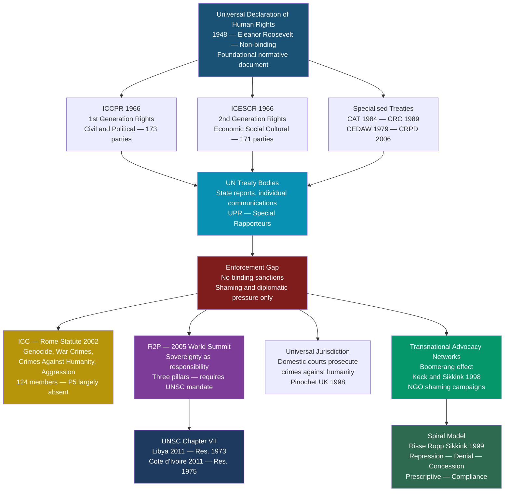

# Human Rights and International Law

> [!abstract] TL;DR
> The international human rights system translates universal moral claims about human dignity into binding treaties, enforcement institutions, and advocacy networks — making state treatment of its own citizens a legitimate international concern, in permanent tension with the Westphalian principle of non-interference in domestic affairs.

---

## Intuition

**Analogy:** Think of the international human rights system as a global franchise with a very weak head office. Each franchisee (state) signs a detailed contract (treaty) setting minimum operating standards for how they treat people inside their establishment. A network of inspectors (treaty bodies, special rapporteurs) periodically checks compliance and publishes public scorecards. But the inspectorate cannot shut a franchisee down; it can shame it, deny it a seal of approval, and mobilize customers to boycott. Only in the most extreme cases — when a franchisee commits systematic atrocities — does the network consider calling in emergency responders (the ICC, a UNSC-authorized intervention). The system operates not through top-down coercion but through naming-and-shaming, audience costs, and the reputational weight of membership.

The crucial twist: some franchisees sign the contract purely to display the logo in the window — what scholars call *strategic ratification* — while genuinely changing nothing inside. Whether the contract changes behavior depends entirely on whether the head office can enforce it and whether local residents (domestic civil society) can hold the franchisee accountable from within.

---

## How It Works



---

## Key Concepts

### Secondary Level

**The Universal Declaration of Human Rights (UDHR, 1948).** Adopted on 10 December 1948 by the UN General Assembly (Resolution 217A), the UDHR was drafted by a committee chaired by Eleanor Roosevelt; the first comprehensive draft was written by Canadian legal scholar John Peters Humphrey; French jurist René Cassin drafted the preamble and won the 1968 Nobel Peace Prize for his contribution. Chinese philosopher Peng Chung Chang ensured non-Western philosophical input. The UDHR is *not a treaty* — it is a General Assembly resolution and therefore not directly binding on states. Its authority rests on moral consensus, customary international law (many provisions have hardened into CIL), and its role as the foundation for all subsequent binding treaties.

**Three generations of human rights.** The Czech jurist Karel Vasak (1977) proposed a generational framework:

| Generation | Content | Binding Treaty | Obligation Type |
|---|---|---|---|
| **First** | Civil and political rights — life, liberty, fair trial, free speech, association, elections | ICCPR (1966) | Negative: state must *refrain* from interference |
| **Second** | Economic, social, and cultural rights — work, education, health, social security, cultural participation | ICESCR (1966) | Positive: state must *progressively realize* through available resources |
| **Third** | Solidarity / collective rights — development, clean environment, peace, self-determination | UN Declaration on the Right to Development (1986); soft law instruments | Diffuse: duties on states and international community |

The generational framework is analytically useful but contested — the Vienna Declaration (1993) affirmed that all rights are "universal, indivisible, interdependent, and interrelated." Cold War politics drove the split between the ICCPR (favoured by the West) and the ICESCR (favoured by the Soviet bloc and Global South).

**The core international human rights treaty system.** Seven principal treaties, each with a monitoring committee:

| Treaty | Year | Scope | Committee |
|---|---|---|---|
| ICERD | 1965 | Racial discrimination | CERD |
| ICCPR | 1966 | Civil and political rights | Human Rights Committee |
| ICESCR | 1966 | Economic, social, cultural | CESCR |
| CEDAW | 1979 | Women's rights | CEDAW Committee |
| CAT | 1984 | Torture and cruel treatment | Committee Against Torture |
| CRC | 1989 | Children's rights (196 parties — all but US) | Committee on the Rights of the Child |
| CRPD | 2006 | Disability rights | CRPD Committee |

**What is International Humanitarian Law (IHL)?** Also called the *laws of armed conflict*, IHL governs how wars are fought rather than whether they may be started (*jus in bello* vs. *jus ad bellum*). Its core instruments are the four Geneva Conventions (1949) — (I) wounded and sick on land, (II) wounded and sick at sea, (III) prisoners of war, (IV) civilians under occupation — and their Additional Protocols (1977, 2005). The three foundational IHL principles are:
- **Distinction** — parties must always distinguish combatants from civilians; only legitimate military objectives may be attacked.
- **Proportionality** — civilian harm must not be excessive relative to the anticipated direct military advantage.
- **Military necessity** — force may only be used to the extent necessary to achieve a legitimate military objective.

IHL is *lex specialis* in armed conflict; international human rights law (IHRL) applies continuously but permits limited derogations under genuine public emergencies (ICCPR Art. 4).

---

### Undergraduate Level

**The Responsibility to Protect (R2P).** R2P reconceptualises sovereignty: instead of an unconditional right to non-interference, sovereignty entails a *responsibility* to protect one's own population. Key milestones:
- **ICISS Report (2001)** — *The Responsibility to Protect* (Gareth Evans and Mohamed Sahnoun) reframed "humanitarian intervention" as R2P.
- **2005 UN World Summit Outcome Document** (paragraphs 138–139) — unanimous endorsement by all member states; arguably the fastest norm adoption in UN history.
- **Three Pillars**: (1) Each state has the primary responsibility to protect its population from genocide, war crimes, ethnic cleansing, and crimes against humanity; (2) the international community should assist states in fulfilling this responsibility; (3) when a state manifestly fails, the international community may act through the UN Security Council.
- **R2P is not a legal right to intervene** — it is a political commitment that requires UNSC authorization. The Libyan case (UNSC Res. 1973, 2011) authorized a no-fly zone to protect civilians; NATO's implementation extended to regime change, producing the "R2P hangover" — BRICS opposition to any UNSC human rights authorization thereafter, paralyzing the Council on Syria.

**Risse-Ropp-Sikkink Spiral Model (1999 / 2013).** A constructivist model of how international human rights pressure transforms repressive states. Five phases of socialization:

1. **Repression** — the state systematically violates rights and denies external accountability
2. **Denial** — transnational advocacy networks (TANs) expose violations internationally; the government denies and dismisses; the "boomerang effect" begins (domestic advocates work through international networks to pressure their own government from outside)
3. **Tactical concessions** — mounting international and domestic pressure forces limited, token gestures (symbolic prisoner releases, inviting a UN rapporteur) without genuine behavioral change
4. **Prescriptive status** — the government begins using rights language, creates new institutions (national human rights commissions, constitutional amendments), but a gap between rhetoric and practice persists
5. **Rule-consistent behavior** — rights norms are fully internalized; compliance becomes habitual and self-sustaining

The 2013 revision (*The Persistent Power of Human Rights*) acknowledged the model is better at explaining movement from phase 1 to phase 4 than at explaining how states achieve full compliance (phase 5).

**Transnational Advocacy Networks (Keck and Sikkink, 1998).** Margaret Keck and Kathryn Sikkink argued that international change in human rights and other norm areas is driven by transnational coalitions of NGOs, international organizations, sympathetic states, and domestic activists. These networks use four political strategies:
- **Information politics** — rapidly assembling and disseminating credible facts that would otherwise be suppressed
- **Symbolic politics** — connecting specific cases to principled narratives that resonate globally
- **Leverage politics** — mobilizing powerful actors (states, IFIs) to apply pressure on target governments
- **Accountability politics** — holding states to prior rhetorical commitments

Classic cases: the anti-apartheid movement, the Chilean human rights campaign post-1973, the International Campaign to Ban Landmines (Ottawa Treaty 1997).

**The Hathaway paradox.** Oona Hathaway's 2002 analysis of treaty ratification found a counterintuitive result: states with *worse* human rights records were sometimes more likely to ratify human rights treaties. Explanation: ratification generates diplomatic benefits (legitimacy, access to aid) without compliance costs when enforcement is weak. This is what game theorists call *strategic ratification* — signing to get the signal without bearing the substance cost. Hathaway called it the "expressive law" problem: treaties that allow states to signal commitment cheaply may actually reduce pressure on them to change.

---

### Graduate Level

**The sovereignty–human rights tension and the Vienna consensus.** The foundational tension in international human rights law is between two Charter principles: Art. 2(7) (non-interference in domestic jurisdiction) and the UDHR/human rights framework's premise that state treatment of citizens is a legitimate international concern. The 1993 Vienna World Conference on Human Rights produced the Vienna Declaration and Programme of Action, which declared rights "universal, indivisible, and interdependent" — explicitly rejecting the claim that cultural, religious, or developmental differences could override universality. But the Vienna Declaration also "reaffirm[s] the right to self-determination" and notes "the significance of national and regional particularities" — language inserted at ASEAN and Chinese insistence.

**The "Asian values" debate.** In the 1990s, leaders including Singapore's Lee Kuan Yew, Malaysia's Mahathir Mohamad, and Chinese premier Li Peng argued that Western-style individual rights were culturally specific; Asian cultures prioritized community over individual, social order over liberty, and economic development over political freedoms. This was operationalized in the Bangkok Declaration (1993). Critiques are threefold:
1. **Empirical**: There is no monolithic "Asian culture." Aung San Suu Kyi, Václav Havel-like dissidents across Asia, and democratic South Korea and Japan all reject the "Asian values" premise.
2. **Selective**: The argument was selectively deployed by authoritarian regimes to shield themselves from international scrutiny while simultaneously adopting Western economic frameworks. Amartya Sen's *Development as Freedom* (1999) argued that democracy and civil liberties are instrumentally important *for* development.
3. **Internal inconsistency**: Singapore enforced strict individual property rights and contract law (Western liberal values) while rejecting freedom of assembly. The "Asian values" claim was asymmetrically applied.

**Corporations and human rights: the UN Guiding Principles (2011).** Traditional international law created obligations only for states, leaving corporations outside the human rights framework. John Ruggie, appointed UN Special Representative (2005–2011), developed the "Protect, Respect, Remedy" framework (2008) and its operationalization as the UN Guiding Principles on Business and Human Rights (UNGPs, endorsed by the UN Human Rights Council in June 2011):
- **Pillar 1** — States' *duty to protect* against human rights abuses by third parties, including businesses, through effective policy, regulation, and adjudication
- **Pillar 2** — Corporations' *responsibility to respect* human rights through human rights due diligence: identify, prevent, mitigate, and account for adverse impacts
- **Pillar 3** — Access to *remedy* for victims through judicial and non-judicial mechanisms

The UNGPs are not legally binding, but they are the de facto global standard. The EU's Corporate Sustainability Due Diligence Directive (CSDDD, 2024) translates Pillar 2 into mandatory EU law for large companies, marking the shift from voluntary to regulatory.

**ICC politics and the enforcement ceiling.** The International Criminal Court (Rome Statute, 1998; entered into force 2002) is the world's first permanent international criminal court. It has jurisdiction over genocide, crimes against humanity, war crimes, and (since 2018) aggression. Structural limitations:
- The US, China, and Russia are not state parties; they cannot be prosecuted unless referred to the Court by the UNSC (which they could veto).
- The ICC's first conviction was Thomas Lubanga (Congo, 2012) for child soldier recruitment. Arrest warrants have been issued for Omar al-Bashir (Sudan, 2009), Vladimir Putin (Russia, 2023, re: deportation of Ukrainian children), and senior Hamas and Israeli officials (2024).
- **Complementarity principle**: The ICC only acts when national courts are unwilling or unable to prosecute — a principle that simultaneously justifies its existence and defines its limits.

**Human rights backsliding.** The third wave of democratization (Huntington 1991) produced many states that ratified human rights instruments; the subsequent wave of autocratization (democratic backsliding, 2000s–2020s) has frayed compliance. Key mechanisms:
- *Derogation under emergency* (ICCPR Art. 4): states declare a public emergency and suspend certain rights; COVID-19 produced unprecedented numbers of Art. 4 notifications.
- *Shrinking civil society space*: authoritarian governments pass NGO foreign-funding laws (Russia 2012, Hungary 2017, India FCRA) that restrict the domestic anchor of the spiral model.
- *Counter-terrorism framing*: post-9/11, torture, mass surveillance, and indefinite detention were reframed as security necessities, exploiting the permissive margin in ICCPR Art. 4 and the CAT's ambiguous "effective means" clause.

---

## Python Demo

```python
import numpy as np

# Human Rights Treaty Ratification: Signaling Game
# After Hathaway (2002) "Do Human Rights Treaties Make a Difference?" and
# Simmons (2009) "Mobilizing for Human Rights: International Law in Domestic Politics"
#
# State types   : Democratic (high audience costs) | Authoritarian (low audience costs)
# Signal        : Ratify treaty  {True, False}
# Compliance    : Comply         {True, False}  (costly; unobservable ex ante)
# Enforcement θ : International monitoring strength  ∈ [0, 1]
#
# Payoffs per decision:
#   Ratify + Comply    →  B - C_comply              (sincere ratification)
#   Ratify + Defect    →  B - θ * (aud_cost + ext)  (strategic / hollow)
#   No Ratify          →  0
#
# B      = diplomatic/reputational benefit of joining treaty
# C      = cost of genuine policy compliance
# AC     = audience cost by regime type (domestic punishment for ratify-without-comply)
# EXT    = external NGO/IO monitoring pressure baseline (applies to all)
#
# Key insight: Democratic states have high AC (civil society, free press, opposition
# parties hold governments accountable for compliance). Authoritarian states have low
# AC (media controlled, civil society suppressed). This differential drives the
# separating equilibrium at sufficiently high enforcement.

B   = 5.0                            # benefit of ratification (legitimacy, aid access)
C   = 3.0                            # cost of genuine compliance
AC  = {"Democratic": 3.5, "Authoritarian": 0.6}  # audience costs
EXT = 0.8                            # external monitoring baseline


def penalty(rtype, theta):
    """Expected punishment for ratifying without complying."""
    return theta * (AC[rtype] + EXT)


def strategy(rtype, theta):
    """Return (ratify, comply) for the optimal play given type and enforcement."""
    p_sincere   = B - C                       # ratify and comply
    p_strategic = B - penalty(rtype, theta)   # ratify, do not comply
    p_abstain   = 0.0

    if max(p_sincere, p_strategic) <= p_abstain:
        return (False, False)    # don't ratify at all
    if p_sincere >= p_strategic:
        return (True, True)      # sincere ratification
    return (True, False)         # strategic (hollow) ratification


thetas = np.round(np.linspace(0.0, 1.0, 11), 1)

print("Treaty Ratification Signaling Game")
print("=" * 62)
print(f"  B={B}, C_comply={C}")
print(f"  Audience costs: Democratic={AC['Democratic']}, "
      f"Authoritarian={AC['Authoritarian']}")
print(f"  External monitoring baseline: {EXT}\n")
print(f"  {'Enf theta':>10}  {'Democratic':^22}  {'Authoritarian':^22}")
print("  " + "-" * 59)

sep_theta = None
for theta in thetas:
    d = strategy("Democratic", theta)
    a = strategy("Authoritarian", theta)

    def lbl(s):
        if s == (True, True):  return "Yes/Yes (Sincere)    "
        if s == (True, False): return "Yes/No  (Strategic)  "
        return                        "No /No  (Abstain)    "

    print(f"  {theta:>10.1f}  {lbl(d):^22}  {lbl(a):^22}")
    if sep_theta is None and d == (True, True) and a != (True, True):
        sep_theta = theta

print()
print(f"  Separating equilibrium threshold  theta* = {sep_theta}")
print("  theta < theta*  : POOLING  -- both types ratify strategically;")
print("                    treaty membership is an uninformative signal")
print("  theta >= theta* : SEPARATING -- democracies ratify sincerely,")
print("                    authoritarians remain strategic;")
print("                    ratify+comply credibly signals democratic type")

# Population simulation: 120 democratic + 80 authoritarian = 200 states
pop = ["Democratic"] * 120 + ["Authoritarian"] * 80
print("\n  Population simulation (120 democratic + 80 authoritarian = 200 states)")
for lbl_theta, theta in [("theta=0.2 (weak enforcement)", 0.2),
                         ("theta=0.8 (strong enforcement)", 0.8)]:
    ratifiers = sum(1 for r in pop if strategy(r, theta)[0])
    sincere   = sum(1 for r in pop if strategy(r, theta) == (True, True))
    strategic = sum(1 for r in pop if strategy(r, theta) == (True, False))
    print(f"\n  {lbl_theta}")
    print(f"    Ratifiers: {ratifiers}/200  |  Sincere: {sincere}  "
          f"Strategic: {strategic}")
    print(f"    Treaty -> rights improvement: {sincere / 200:.0%} of all states")

print()
print("  Hathaway (2002) paradox: Under weak enforcement, treaty ratification")
print("  rates are HIGH but actual rights improvement is LOW or ZERO.")
print("  Under strong enforcement, ratification becomes a credible signal")
print("  and actual improvement rises -- the separating equilibrium.")
```

**What this shows:** At low enforcement (theta = 0.2), all 200 states ratify, but sincere compliance is zero — treaty membership is a cheap signal available to any state regardless of type (pooling equilibrium). At high enforcement (theta = 0.8), democracies switch to sincere ratification while authoritarian states remain strategic; a treaty now conveys real information about compliance commitment (separating equilibrium). The gap between ratification rates and actual rights improvement is the empirical puzzle Hathaway documented across 166 countries and eight treaty categories.

---

## Real-World Applications

**Pinochet and universal jurisdiction (1998).** Chilean dictator Augusto Pinochet was arrested in London on a Spanish warrant for torture and crimes against humanity committed in Chile in the 1970s. The UK Law Lords ruled (in a 3-2 majority, later reinforced by a 6-1 decision) that a former head of state has no sovereign immunity for acts of torture after 1988 (when the UK incorporated the CAT). Though Pinochet was ultimately released on medical grounds and returned to Chile, the case established the legal principle of universal jurisdiction for torture and set off a cascade of prosecutions of former dictators in European courts (Hissene Habre of Chad, convicted in Senegal, 2016).

**Libya (2011) and R2P's rise and fall.** The UNSC unanimously adopted Resolution 1973 in March 2011, authorizing all necessary measures to protect Libyan civilians from Muammar Gaddafi's forces — the first time R2P was explicitly invoked to authorize force. NATO interpreted the mandate broadly, providing air cover that enabled rebel forces to overthrow the government. Russia, China, India, and Brazil condemned this as overreach — a "protection" mandate turned into regime change. The political fallout was severe: when Syria descended into a far worse civil war months later, Russia and China vetoed every UNSC action, explicitly citing Libya. The R2P norm did not die, but its Pillar 3 (coercive intervention) became operationally inert for the next decade.

**ICC arrest warrant for Vladimir Putin (2023).** The ICC issued an arrest warrant for Vladimir Putin and Russia's Children's Rights Commissioner Maria Lvova-Belova in March 2023 for the deportation of Ukrainian children to Russia — a war crime under the Rome Statute. This was the first arrest warrant issued against a sitting head of state of a permanent Security Council member. Russia is not an ICC member state and dismissed the warrant. South Africa, an ICC member state, faced an acute crisis when Putin was invited to the 2023 BRICS summit in Johannesburg — the government would have been legally obligated to arrest him. He attended via video. The episode illustrated the structural ceiling on ICC enforcement: legality without power.

**UN Guiding Principles in practice.** Following the 2011 UNGPs, over 5,000 companies have published human rights policies. Germany's Supply Chain Due Diligence Act (2023) and the EU CSDDD (2024) made human rights due diligence legally mandatory for large corporations operating in those jurisdictions — marking the transition from soft to hard law for Ruggie's Pillar 2. However, enforcement remains uneven: the garment industry post-Rana Plaza (Bangladesh, 2013, 1,134 dead) illustrates persistent compliance gaps despite reputational costs.

---

## Common Pitfalls

- **Conflating IHRL and IHL** — International Human Rights Law (ICCPR, ICESCR, etc.) applies at all times to state–citizen relations; International Humanitarian Law (Geneva Conventions) applies specifically in armed conflict as *lex specialis*. In conflict situations, both apply concurrently, but IHL governs the conduct of hostilities while IHRL governs detention, due process, and non-derogable rights.
- **Treating R2P as a legal right to intervene** — R2P is a political commitment adopted at the 2005 World Summit, not a binding treaty norm. It does not create a legal basis for intervention without UNSC authorization. The Libyan and Kosovo cases are not legal precedents for "humanitarian intervention" outside Chapter VII.
- **Assuming treaty ratification implies compliance** — The Hathaway paradox is empirically robust: treaty ratification correlates poorly with behavioral improvement without domestic mobilization (Simmons) or credible enforcement. Checking ratification lists is not a measure of rights performance.
- **Taking "Asian values" at face value** — The argument is a political construction, not an anthropological finding. Sen, Amartya: "The notion that Asian values are fundamentally different from Western values... is hard to sustain on the basis of historical evidence or contemporary data." It selectively elevates communitarian norms while ignoring parallel liberal traditions within Asian philosophy.
- **Assuming the ICC is the primary enforcement mechanism** — The ICC handles only a tiny number of cases and depends entirely on state cooperation for arrests. Most international human rights enforcement happens through treaty body recommendations, UPR processes, sanctions, conditionality on aid and trade, and domestic courts applying universal jurisdiction.
- **Ignoring the spiral model's limits** — The Risse-Ropp-Sikkink model works best for transitional states that are responsive to international pressure (Phase 2–4); it has much weaker explanatory power for consolidated authoritarian regimes with high oil revenues or great-power backing (China, Russia, Saudi Arabia) that can absorb shaming without concessions.

---

## Related Concepts

- [[The_State_System_and_Sovereignty]] — The foundational tension: Westphalian sovereignty (Art. 2(7) non-interference) directly conflicts with the human rights project; R2P is the most explicit attempted resolution of this tension.
- [[International_Institutions_and_Multilateralism]] — The treaty body system, ICC, and UN Human Rights Council are all multilateral institutions whose effectiveness is bounded by the same enforcement-gap problems as other international regimes.
- [[International_Relations_Theories]] — Constructivism (Finnemore, Sikkink) underpins the spiral model and norm-cascade account of rights change; realists are skeptical that rights norms constrain powerful states; liberals point to domestic democratic institutions as the mechanism linking international law to behavioral change.
- [[Authoritarianism_and_Hybrid_Regimes]] — Strategic ratification, backsliding on rights, and the use of "emergency" derogations are characteristic tools of competitive authoritarian and hybrid regimes managing international reputation while suppressing domestic opposition.
- [[Social_Contract_Theory]] — Locke's natural rights (life, liberty, property) and Rousseau's popular sovereignty provide the philosophical foundation for first-generation civil and political rights; Rawls's difference principle undergirds second-generation economic rights arguments.
- [[Liberalism_and_Its_Variants]] — Classical liberalism's priority of individual rights against state interference generates first-generation ICCPR rights; social liberalism's endorsement of positive state obligations generates second-generation ICESCR rights; cosmopolitan liberalism (Rawls's *Law of Peoples*) justifies the universality of rights across cultural boundaries.
- [[Signaling_Games]] — Treaty ratification is modeled as a signaling game: regime type (democratic/authoritarian) is private information; ratification is the signal; the question is whether enforcement strength generates a separating or pooling equilibrium, determining whether the signal is informative.
- [[Moral_Development]] — Kohlberg's post-conventional morality (universal ethical principles) maps onto the internalization stage of the spiral model; understanding the developmental psychology of moral universalism illuminates why rights norms diffuse unevenly across individuals and cultures.
- [[Prosocial_Behavior]] — Empathy and altruism research explains why transnational advocacy networks can mobilize global publics around remote human rights violations; psychological distance and in-group bias explain the limits of this mobilization.
- [[Prejudice_and_Discrimination]] — In-group moral exclusion — the psychological mechanism by which perpetrators of mass atrocity categorize victims as outside the circle of moral concern — is the psychological substrate of genocide and ethnic cleansing.
- [[Diplomacy_and_Foreign_Policy]] — Human rights conditionality in foreign aid, sanctions regimes (Magnitsky-style targeted sanctions), and the "democracy vs. stability" trade-off are central tensions in states' bilateral foreign policy practice.
- [[_MOC_Contemporary_Global_Issues|↑ Contemporary Global Issues MOC]] — section map and learning path for this cluster of notes

---

## Review Questions

### Secondary

1. The UDHR was adopted in 1948 but is not a legally binding treaty. If it is not binding, why do states care about it? Identify at least two mechanisms through which a non-binding declaration can still shape state behavior.
2. Explain the difference between first-generation and second-generation human rights. Give one concrete right from each category and explain why the distinction matters for what governments are legally obligated to do.
3. What is the "boomerang effect" in transnational advocacy networks? Describe how a human rights activist in an authoritarian state could use it, and what conditions would make it effective or ineffective.

### Undergraduate

1. R2P was unanimously adopted in 2005 and then largely disabled by the Libya case. Does this sequence confirm the realist view that powerful states will always instrumentalize humanitarian norms, or does it leave open the possibility that R2P can be reformed and revived? Use specific evidence.
2. Hathaway found that states with worse human rights records ratify human rights treaties at rates as high as or higher than states with good records. How does the signaling-game model of treaty ratification explain this paradox, and what institutional design changes could shift the equilibrium toward sincere ratification?
3. Compare the enforcement logic of the ICC (individual criminal accountability) with the enforcement logic of the UN treaty body system (state-level reporting and shaming). What types of violations is each mechanism better suited to address, and what are the structural limits of each?

### Graduate

1. The spiral model (Risse-Ropp-Sikkink) predicts that sustained transnational pressure combined with domestic civil society mobilization eventually produces norm internalization even in repressive states. The model performs well on Latin American and South African cases but poorly on China, Russia, and Gulf monarchies. Identify the theoretical scope conditions the authors themselves acknowledge, and assess whether the model requires revision or supplementation to explain the contemporary authoritarian backlash against human rights norms.
2. Oona Hathaway argues that treaty ratification without enforcement can be *worse* than no treaty, because it relieves political pressure on non-compliant states by allowing them to claim membership. Barbara Simmons argues the opposite — ratification activates domestic legal and political mobilization even without external enforcement. Design an empirical study to adjudicate between these claims: specify your unit of analysis, treatment variable, outcome variable, identification strategy, and the observable implication that would falsify each theory.
3. The UN Guiding Principles on Business and Human Rights (2011) deliberately chose a non-binding framework rather than a binding treaty, on the grounds that states would not ratify a binding instrument and that soft law could achieve broader corporate uptake. Evaluate this design choice using Abbott and Snidal's legalization framework (obligation, precision, delegation). What are the conditions under which soft law can substitute for hard law in changing corporate behavior, and what empirical evidence from the post-2011 period supports or undermines Ruggie's bet?

---

## Sources

- [Risse, T., Ropp, S. C., and Sikkink, K. (eds.), *The Power of Human Rights: International Norms and Domestic Change*, Cambridge University Press, 1999](https://www.cambridge.org/core/books/power-of-human-rights/3DE98AF2C4D5D4ADDC25F7E99BFE0C0F)
- [Risse, T., Ropp, S. C., and Sikkink, K. (eds.), *The Persistent Power of Human Rights*, Cambridge University Press, 2013](https://www.cambridge.org/core/books/persistent-power-of-human-rights/D26A23B19102926B4E77B1EDEA3773F1)
- [Keck, M. E. and Sikkink, K., *Activists Beyond Borders: Advocacy Networks in International Politics*, Cornell University Press, 1998](https://www.cornellpress.cornell.edu/book/9780801484568/activists-beyond-borders/)
- [Hathaway, O. A., "Do Human Rights Treaties Make a Difference?", *Yale Law Journal* 111(8), 2002](https://www.jstor.org/stable/797642)
- [Simmons, B. A., *Mobilizing for Human Rights: International Law in Domestic Politics*, Cambridge University Press, 2009](https://www.cambridge.org/core/books/mobilizing-for-human-rights/E86B80C26F2EC97E1B7A3A7A2C4F62C2)
- [UN Office of the High Commissioner for Human Rights — Core International Human Rights Instruments](https://www.ohchr.org/en/core-international-human-rights-instruments-and-their-monitoring-bodies)
- [Global Centre for the Responsibility to Protect — What is R2P?](https://www.globalr2p.org/what-is-r2p/)
- [Rome Statute of the International Criminal Court — International Criminal Court](https://www.icc-cpi.int/resource-library/documents/rs-eng.pdf)
- [Ruggie, J. G., *Just Business: Multinational Corporations and Human Rights*, W. W. Norton, 2013](https://wwnorton.com/books/Just-Business/)
- [UN Guiding Principles on Business and Human Rights — UN Human Rights Council, 2011](https://www.ohchr.org/sites/default/files/documents/publications/guidingprinciplesbusinesshr_en.pdf)
- [ICRC — What is International Humanitarian Law?](https://www.icrc.org/en/doc/assets/files/other/what_is_ihl.pdf)
- [Sen, A., *Development as Freedom*, Anchor Books, 1999 (Ch. 10: "Culture and Human Rights")](https://en.wikipedia.org/wiki/Development_as_Freedom)

---

#PoliticalScience #GlobalIssues #HumanRights #InternationalLaw
