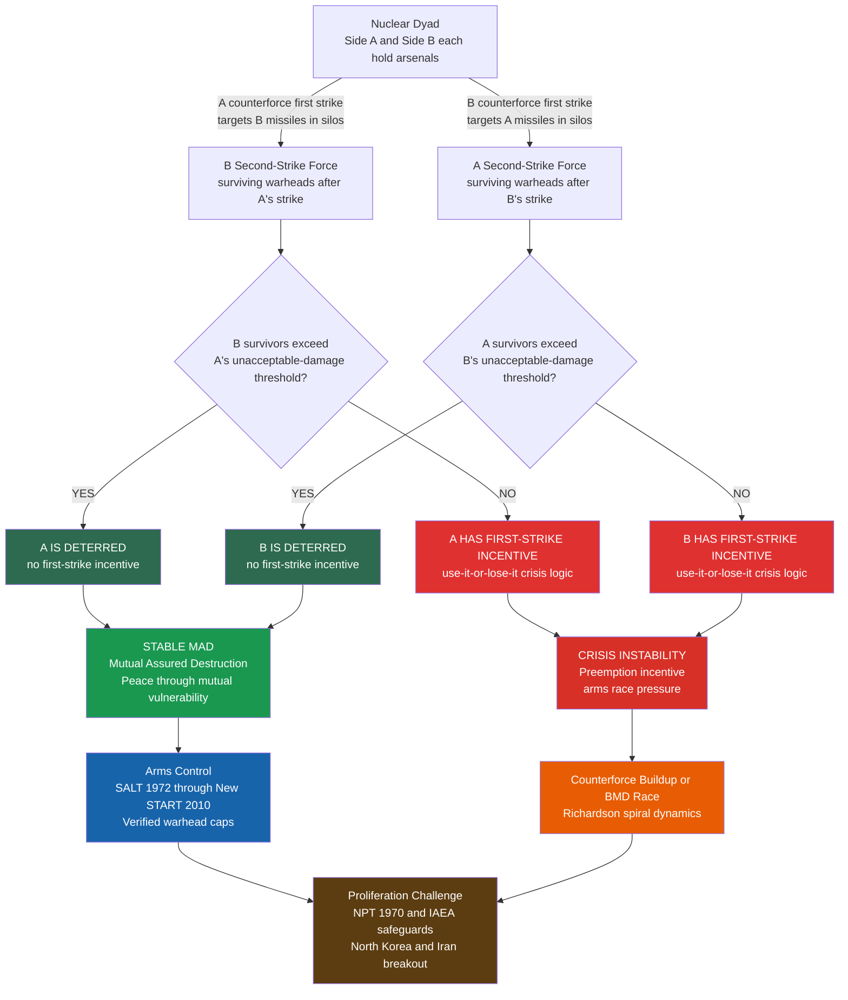

# Nuclear Strategy and Arms Control

> [!abstract] TL;DR
> Nuclear weapons transformed war from a coercive instrument into an existential risk management problem. Since Bernard Brodie (1946), deterrence theory's central task has been to keep weapons that must never be used credible enough to prevent the wars they would destroy. Stability — not dominance, not disarmament — is the operational goal. Arms control treaties codify and verify the balance that keeps Mutually Assured Destruction (MAD) stable; proliferation challenges arise when new actors enter a system without internalizing or being subjected to its equilibria.

---

## Intuition

**Analogy:** Two scorpions trapped in a bottle. Each can sting the other to death, but doing so guarantees a fatal counter-sting. Neither stings first — not from goodwill, but because the expected payoff from striking is catastrophically negative. Stability requires only that both scorpions remain capable of delivering the counter-sting after absorbing the first. The moment one scorpion goes partially blind — losing its counter-sting capability — the other faces a transformed calculation: strike while the advantage holds, or accept permanent inferiority.

That logic scales exactly to nuclear strategy. The "bottle" is the international system with no referee. The "sting" is a nuclear first strike. The "counter-sting" is the second-strike — the assured retaliatory force that survives the first blow. Arms control treaties are not about liking the other scorpion; they are about making the bottle slightly less fraught by guaranteeing that neither side ever gains enough advantage to strike without certainty of devastating retaliation. Proliferation introduces additional scorpions whose counter-sting capabilities are unknown, breaking the bilateral equilibrium that Cold War deterrence theory was built to sustain.

---

## How It Works

### Core Mechanics

Nuclear deterrence is founded on three requirements that must hold simultaneously (Huth 1999):

1. **Capability** — A state must possess nuclear weapons sufficient to inflict unacceptable damage in a retaliatory strike, even after absorbing an enemy's first strike.
2. **Credibility** — The adversary must believe the retaliation will actually occur. Threats that are not subgame perfect — not rational to carry out when called upon — are empty and will be tested.
3. **Communication** — Both capability and intent must be clearly conveyed. Opacity about capabilities (as with early Soviet weapons) or intent (ambiguous extended deterrence) introduces the uncertainty that precipitates crises.

**The stability-lethality trade-off:** More accurate and powerful counterforce weapons increase the probability of success in a disarming first strike. This raises both sides' first-strike incentives simultaneously — what Wohlstetter (1959) identified as the "delicate balance of terror." The paradox is that weapons designed to deter by demonstrating counterforce capability can undermine deterrence by triggering pre-emptive calculations in the adversary.

**Intriligator-Brito Stability Conditions (1984):** Let W_A and W_B be normalized warhead arsenals, alpha the counterforce lethality coefficient (fraction of opponent's warheads destroyed per warhead expended), and delta the minimum surviving warhead fraction required to inflict unacceptable damage (the resolve threshold):

- **A is deterred from striking first:** B's second-strike survives A's first strike → W_B − alpha × W_A ≥ delta_A → **W_B ≥ delta_A + alpha × W_A** (Line 1)
- **B is deterred from striking first:** A's second-strike survives B's first strike → W_A − alpha × W_B ≥ delta_B → **W_B ≤ (W_A − delta_B) / alpha** (Line 2)

The **stability triangle** (deterrence zone) is the region in (W_A, W_B) space between these two lines. Both sides must maintain arsenals large enough to fall inside it. Increasing alpha (counterforce accuracy) or delta (BMD deployment raises the effective damage threshold) shrinks or eliminates this region.

### Flow / Architecture



---

## Key Concepts

### Secondary Level

**Bernard Brodie and the founding insight (1946).** Writing within months of Hiroshima, Brodie observed that nuclear weapons made the destruction of the opponent's military capacity in war irrational — the opponent could still destroy your cities before dying. The mission of military establishments shifted from "winning wars" to "averting wars." This was not a moral claim but a strategic one: because nuclear exchange destroys value for both sides regardless of who "wins" militarily, deterrence is the only rational objective. Everything else in nuclear strategy — targeting doctrine, arms control, proliferation management — follows from this original insight.

**What is deterrence?** Deterrence seeks to prevent an adversary from taking an action by threatening costs that outweigh the benefits. It has two forms:
- *Deterrence by denial:* convincing the adversary the action will fail (missile defense, civil defense)
- *Deterrence by punishment:* convincing the adversary that even a successful action will trigger retaliation they cannot accept (nuclear second-strike)

Nuclear deterrence is almost entirely punishment-based. No missile defense system can intercept enough warheads to prevent civilizational damage.

**Mutually Assured Destruction (MAD).** The Cold War nuclear balance reached a stable MAD equilibrium by the mid-1960s: each superpower possessed enough survivable nuclear forces (submarine-launched ballistic missiles were essentially invulnerable to a first strike) to destroy the other's major cities many times over, even after absorbing a first strike. The logic: no rational leader would launch a first strike knowing that it guarantees national destruction in retaliation. MAD worked not because states trusted each other but because the expected cost of striking first exceeded any conceivable gain.

**The nuclear triad.** Second-strike survivability requires diversification across delivery systems. The US and Soviet/Russian "triads" combine:
1. *Land-based ICBMs* (fast, accurate, but targetable in fixed silos)
2. *Submarine-launched ballistic missiles — SSBNs* (almost invulnerable to first strike, provide assured second-strike)
3. *Strategic bombers* (slow, recallable, can demonstrate resolve in a crisis)

The SSBN leg of the triad is the foundation of MAD: even if a perfect first strike eliminated all ICBMs and airbases, the submarines at sea would still deliver devastating retaliation.

**Nuclear proliferation and the NPT.** The Nuclear Non-Proliferation Treaty (1970) divides the world into five recognized nuclear-weapon states (US, Russia, UK, France, China — the P5) and non-nuclear-weapon states (NNWS). NNWS pledge not to acquire weapons; NWS pledge to negotiate toward disarmament (Article VI); all receive access to peaceful nuclear technology under International Atomic Energy Agency (IAEA) safeguards. Outside the NPT: Israel (undeclared), India, Pakistan (declared but non-signatory), and North Korea (withdrew 2003). The treaty reflects a bargain that has partially held: only nine states possess nuclear weapons, against predictions of dozens by the 1970s.

---

### Undergraduate Level

**First-strike instability: Wohlstetter's "delicate balance" (1959).** Albert Wohlstetter's classified RAND study demonstrated that the US strategic advantage of the 1950s was far more fragile than assumed. Land-based bombers and missiles concentrated at a few bases were highly vulnerable to a Soviet first strike. If the Soviets could destroy the bulk of US forces before they launched, the balance of terror was not stable — it was a race to strike first in a crisis. Wohlstetter's insight drove the investment in hardened silos, dispersal, and eventually the SSBN program: the goal was to make forces so survivable that a first strike could never achieve meaningful disarmament. **Second-strike survivability — not sheer numbers — is the foundation of stable deterrence.**

**Counterforce vs. countervalue targeting doctrine.** Two competing nuclear strategies:
- *Countervalue (assured destruction):* Target the adversary's cities, industry, and population. Requires few and unsophisticated warheads. Requires no precision. Guarantees mass civilian death. Maximizes deterrence credibility because the adversary is certain that retaliation will be catastrophic.
- *Counterforce:* Target the adversary's nuclear weapons, command-and-control, and military facilities. Requires high accuracy (small circular error probable — CEP). Creates the option of a "limited" nuclear war by disarming the opponent. But it incentivizes the adversary to launch on warning (before their missiles are destroyed), increasing crisis instability.

The US shifted between doctrines: Eisenhower's "Massive Retaliation" (countervalue); McNamara's "Assured Destruction" (pure countervalue with defined megatonnage thresholds); Nixon-era NSDM-242 and Carter-era PD-59 (selective nuclear options, counterforce elements); Reagan's buildup (counterforce emphasis with MX Peacekeeper). The tension is unresolved: pure countervalue is stable but morally troubling; counterforce is more "discriminate" but strategically destabilizing.

**Herman Kahn's escalation ladder.** In *On Thermonuclear War* (1960) and *On Escalation* (1965), Kahn argued that nuclear war was not a single all-or-nothing event but a spectrum of 44 "rungs" from conventional skirmishes to all-out city exchanges. Each rung represented a distinct level of violence with different political signals and military objectives. The escalation ladder implied that war-fighting options below the all-out level were conceivable and could be "controlled." Critics (notably Schelling) argued that nuclear war cannot be controlled once begun — the "rung" metaphor gives false precision to a process likely to be chaotic and driven by miscommunication.

**The security dilemma in nuclear context.** The security dilemma operates at two levels in nuclear strategy:
- *Arms race stability:* Does a buildup in offensive forces by one side compel the other to build more, leading to Richardson spiral dynamics? MAD implies both sides should tolerate mutual vulnerability — but domestic politics, bureaucratic interests, and technological momentum drive arms races even when MAD would counsel restraint.
- *Crisis stability:* In a confrontation, do force postures create pressure to "use or lose" — to launch nuclear weapons before they are destroyed? Forces concentrated at targetable sites and vulnerable to counterforce attack create exactly this pressure.

**Extended deterrence and the credibility problem.** The US nuclear umbrella covers NATO allies, Japan, South Korea, and Australia. The credibility problem: would a US president genuinely risk New York to retaliate for an attack on Warsaw? Adversaries know this calculation. NATO addresses the credibility gap through:
- *Tripwires:* Forward-deployed US troops whose deaths automatically implicate the US (Germany in the Cold War)
- *Tactical nuclear weapons:* Short-range weapons (now B61 gravity bombs at European bases) that signal willingness to escalate; but also risk the nuclear threshold by blurring the firebreak between conventional and nuclear war
- *Nuclear sharing arrangements:* Non-nuclear allies participate in nuclear planning and delivery training (dual-key arrangements) to create shared commitment

**Arms control treaties: the SALT-START-INF sequence.**

| Treaty | Year | Key Provision |
|--------|------|---------------|
| SALT I | 1972 | Froze ICBM and SLBM launchers at existing levels; first formal offensive arms agreement |
| ABM Treaty | 1972 | Limited each side to two ABM sites; preserved mutual vulnerability as foundation of MAD |
| SALT II | 1979 | Capped strategic launchers at 2,400; never ratified by US Senate after Soviet invasion of Afghanistan |
| INF Treaty | 1987 | Eliminated all ground-launched missiles 500–5,500 km range; landmark verification regime |
| START I | 1991 | Cut strategic warheads to 6,000 each; intrusive on-site inspection regime |
| New START | 2010 | 1,550 deployed strategic warheads each; 700 deployed delivery vehicles; Russia suspended participation February 2023 |

The ABM Treaty (1972) was the intellectual foundation: by banning missile defense, it preserved mutual vulnerability — the precondition for MAD stability. The US withdrawal from ABM in 2002 to pursue national missile defense (NMD) renewed Russian and Chinese concerns about strategic stability.

**Tactical nuclear weapons and the nuclear threshold.** Tactical or non-strategic nuclear weapons (TNW) — battlefield artillery shells, short-range missiles, naval depth charges — were deployed in the thousands during the Cold War. They create a "nuclear threshold" problem: their use would likely trigger strategic exchanges, but their battlefield role makes their non-use ambiguous. Russia currently holds an estimated 1,900 TNW, and its doctrine explicitly permits "escalate-to-deescalate" — threatening limited nuclear use to terminate a conventional conflict on favorable terms. This is the most significant near-term nuclear use risk.

---

### Graduate Level

**Schelling's coercive theory: brinkmanship and the threat that leaves something to chance.** Thomas Schelling (*The Strategy of Conflict*, 1960; *Arms and Influence*, 1966) made the foundational game-theoretic contribution to nuclear strategy. His key insights:

1. *The threat that leaves something to chance:* A perfect deterrent threat must be credible — rationally optimal to carry out when called upon, i.e., subgame perfect. But nuclear retaliation is catastrophic even for the retaliating state. Pure rationality predicts it would never be carried out. Schelling's solution: deterrence works not through the certain promise of retaliation but through the *risk* of escalation — the possibility that events could spiral out of control even if neither side intends all-out war. By making the risk of inadvertent escalation credible, a state deters without requiring its threat to be subgame perfect.

2. *Brinkmanship:* Deliberately manipulating the shared risk of nuclear war to compel the adversary to back down. Kennedy's naval quarantine in the Cuban Missile Crisis was brinkmanship: it did not directly threaten nuclear war but created a situation in which a collision at sea could trigger escalation, presenting Khrushchev with the choice between backing down and risking an uncontrolled spiral.

3. *Commitment devices:* Because a pure nuclear retaliation threat is not SPE, states use commitment mechanisms — tripwires, automatic launch procedures, public pledges — to make threats more credible by reducing the retaliating state's discretion. A launch-on-warning posture commits the state to retaliate before having full information, raising the risk of accidental war but increasing the adversary's belief that retaliation will occur.

**Crisis stability vs. arms race stability: the ABM paradox.** These two forms of stability can conflict:
- *Arms race stability:* Can both sides reduce offensive arsenals without triggering competitive buildup? MAD suggests yes — assured destruction requires only a few hundred survivable warheads. But bureaucratic momentum and worst-case planning prevent reduction.
- *Crisis stability:* In a confrontation, does neither side have a first-strike incentive? This requires survivable second-strike forces. High-accuracy counterforce weapons create "use it or lose it" pressure — a force that might be destroyed by a first strike must be launched before that strike arrives.

**The ABM paradox:** Deploying missile defense seems stabilizing (protecting one's cities). But it undermines MAD by threatening the adversary's second-strike penetration capability. An adversary facing an ABM system must either build more warheads to overwhelm it (arms race instability) or launch its second-strike as quickly as possible before the ABM system is fully operational (crisis instability). This is why the 1972 ABM Treaty — which banned the very thing that seemed defensive — was the intellectual cornerstone of Cold War arms control.

**Inadvertent escalation (Posen 1991).** Conventional military operations can create escalatory pressure on nuclear forces without any party intending nuclear war. Specific mechanisms:
- *Anti-submarine warfare (ASW):* Hunting SSBNs degrades the adversary's second-strike capability. Even conventional ASW creates "use it or lose it" incentives for the country whose submarines are being tracked.
- *Suppression of enemy air defenses (SEAD):* Destroying radar and command nodes that serve both conventional and nuclear early-warning missions removes the adversary's ability to detect a nuclear attack.
- *Conventional precision strikes on nuclear command-and-control:* Accidental or intended, these create ambiguity about whether a nuclear attack is underway.

Posen's insight is that crisis escalation from conventional to nuclear war may result not from deliberate choice but from the collateral effects of conventional operations on nuclear force postures.

**The multipolar nuclear order: the US-Russia-China triangle.** Cold War deterrence theory was bilateral and largely symmetric. The emerging order is multipolar and asymmetric:
- *US-Russia dyad:* Remains the largest (deployed strategic warheads ~1,550 each under New START); Russia suspended New START participation (February 2023); no arms control framework operative as of 2026.
- *China's buildup:* From ~300 warheads (2020) to an estimated 500-600+ (2025-2026) with continued growth; China has not participated in arms control negotiations and refuses to negotiate from a position of inferiority.
- *The trilemma:* US must maintain deterrence against Russia AND China simultaneously. As China's arsenal grows toward parity, US force requirements may increase — which Russia interprets as aimed at itself. Three-player deterrence lacks the clean bilateral equilibria of MAD: any arms control agreement between two parties disadvantages the third.

A formal nuclear stability model for three players A, B, C requires that each dyad's second-strike capability survive not only the third party's first strike but the first strike of a potential two-against-one coalition. This makes the stability region dramatically smaller than in the bilateral case.

**Nuclear terrorism as a distinct deterrence problem.** State-based deterrence rests on the adversary having a "return address" — a homeland and population that can be threatened. Non-state actors (terrorist organizations) lack this. The deterrence calculus for nuclear terrorism has three components:
1. *Preventing acquisition:* Physical security of fissile material (highly enriched uranium, plutonium); the Nunn-Lugar Cooperative Threat Reduction program secured Soviet-era weapons after 1991.
2. *Deterring state sponsorship:* A state that provides nuclear material to terrorists can be held responsible for the resulting attack — the "attributable contamination" doctrine.
3. *Denial through detection:* Portal monitors, radiation detection at ports of entry; the Proliferation Security Initiative (PSI) interdicting shipments.

An improvised nuclear device (IND) using HEU requires less fissile material than a plutonium bomb and is technically accessible to a sophisticated non-state actor. The 2001 anthrax attacks and multiple al-Qaeda statements of intent to acquire WMDs make nuclear terrorism the catastrophic risk without a classical deterrence solution.

---

## Python Demo

```python
import numpy as np
import matplotlib.pyplot as plt

# Nuclear Deterrence Stability — Intriligator-Brito (1984)
#
# Two nuclear states A and B with normalized warhead arsenals W_A, W_B in [0, 1].
# alpha:   counterforce lethality — each warhead expended destroys alpha of the
#          opponent's warheads (alpha in (0,1); higher = more accurate missiles)
# delta:   resolve threshold — minimum fraction of starting arsenal that must survive
#          a first strike to still deter (BMD raises effective delta)
#
# After A's first strike:  B survivors = max(0, W_B - alpha * W_A)
# After B's first strike:  A survivors = max(0, W_A - alpha * W_B)
#
# Stability conditions (MAD equilibrium):
#   A is deterred: W_B - alpha*W_A >= delta_A  =>  W_B >= delta_A + alpha*W_A  [Line 1]
#   B is deterred: W_A - alpha*W_B >= delta_B  =>  W_B <= (W_A - delta_B)/alpha [Line 2]
#
# The stable "deterrence triangle" lies between Lines 1 and 2 (upper-right region).
# Zone 3 (green)  = MAD stable — both deterred
# Zone 2 (yellow) = B has first-strike incentive
# Zone 1 (orange) = A has first-strike incentive
# Zone 0 (red)    = both have first-strike incentive

W = np.linspace(0.0, 1.0, 400)
WA, WB = np.meshgrid(W, W)

ZONE_COLORS = ["#d73027", "#fc8d59", "#fee08b", "#1a9850"]

scenarios = [
    {"alpha": 0.50, "delta_A": 0.10, "delta_B": 0.10,
     "title": "Baseline MAD\nalpha=0.50   delta=0.10"},
    {"alpha": 0.80, "delta_A": 0.10, "delta_B": 0.10,
     "title": "High Counterforce Accuracy\nalpha=0.80 — stability triangle shrinks"},
    {"alpha": 0.50, "delta_A": 0.30, "delta_B": 0.30,
     "title": "Ballistic Missile Defense Deployed\ndelta=0.30 — MAD needs larger arsenals"},
]

fig, axes = plt.subplots(1, 3, figsize=(16, 5))
fig.suptitle(
    "Nuclear Deterrence Stability Regions  (Intriligator-Brito 1984)\n"
    "Green = Mutual Deterrence (MAD)   Red = Both Have First-Strike Incentive",
    fontsize=11
)

for ax, sc in zip(axes, scenarios):
    alpha, dA, dB = sc["alpha"], sc["delta_A"], sc["delta_B"]

    B_surv = np.maximum(0.0, WB - alpha * WA)
    A_surv = np.maximum(0.0, WA - alpha * WB)

    A_deterred = B_surv >= dA  # A deterred: B retains enough second-strike warheads
    B_deterred = A_surv >= dB  # B deterred: A retains enough second-strike warheads

    zone = np.where(
        A_deterred & B_deterred, 3,
        np.where(A_deterred & ~B_deterred, 2,
        np.where(~A_deterred & B_deterred, 1, 0))
    )

    ax.contourf(WA, WB, zone,
                levels=[-0.5, 0.5, 1.5, 2.5, 3.5],
                colors=ZONE_COLORS, alpha=0.85)

    # Line 1: B deters A  (W_B = dA + alpha*W_A)
    line1 = dA + alpha * W
    valid1 = (line1 >= 0) & (line1 <= 1.0)
    ax.plot(W[valid1], line1[valid1],
            color="navy", lw=2.0, ls="--", label="B deters A  (Line 1)")

    # Line 2: A deters B  (W_B = (W_A - dB)/alpha)
    line2 = (W - dB) / alpha
    valid2 = (line2 >= 0) & (line2 <= 1.0)
    ax.plot(W[valid2], line2[valid2],
            color="darkred", lw=2.0, ls="--", label="A deters B  (Line 2)")

    ax.text(0.80, 0.80, "MAD\nStable",
            ha="center", va="center", fontsize=9, color="white", fontweight="bold")
    ax.text(0.15, 0.80, "B first-strike\nincentive",
            ha="center", va="center", fontsize=7.5, color="#8B0000")
    ax.text(0.80, 0.15, "A first-strike\nincentive",
            ha="center", va="center", fontsize=7.5, color="#8B0000")
    ax.text(0.15, 0.15, "Both\nunstable",
            ha="center", va="center", fontsize=7.5, color="#8B0000")

    ax.set_xlim(0, 1)
    ax.set_ylim(0, 1)
    ax.set_xlabel("Side A  Warhead Level  (W_A)", fontsize=9)
    ax.set_ylabel("Side B  Warhead Level  (W_B)", fontsize=9)
    ax.set_title(sc["title"], fontsize=10)
    ax.legend(fontsize=8, loc="lower right")

plt.tight_layout()
plt.savefig("nuclear_deterrence_stability.png", dpi=100, bbox_inches="tight")
plt.show()

print("Stability zone fractions (fraction of warhead-space where MAD holds):")
print(f"{'Scenario':<50}  Stable%")
for sc in scenarios:
    alpha, dA, dB = sc["alpha"], sc["delta_A"], sc["delta_B"]
    B_s = np.maximum(0.0, WB - alpha * WA)
    A_s = np.maximum(0.0, WA - alpha * WB)
    pct = 100.0 * np.mean((B_s >= dA) & (A_s >= dB))
    label = sc["title"].replace("\n", "  ")
    print(f"  {label:<50}  {pct:5.1f}%")
```

---

## Real-World Applications

**Brodie and the founding of nuclear strategy (1946).** The day after Hiroshima, Brodie wrote: "Everything that I have written is obsolete." His 1946 essay collection *The Absolute Weapon* set the agenda for the next seven decades: nuclear weapons are not battlefield tools but political instruments whose purpose is to prevent their own use. This makes nuclear strategy radically different from all prior military planning — the goal is never to employ the weapon but to make its employment impossible by ensuring no rational adversary can contemplate striking first.

**The Cuban Missile Crisis (October 1962) — brinkmanship at the edge.** The crisis was triggered when the US discovered Soviet medium-range missiles under construction in Cuba — weapons capable of targeting most US cities with 4–5 minutes warning. Kennedy's "ExComm" rejected an air strike (which would have killed Soviet technicians) in favor of a naval "quarantine" (blockade). The quarantine placed Soviet ships in a position where a collision or boarding would implicate the Soviets directly, generating the shared risk of escalation that Schelling theorized. Resolution came through back-channel diplomacy: the Soviets withdrew the Cuban missiles; the US pledged not to invade Cuba and quietly removed its Jupiter missiles from Turkey. The crisis demonstrated both the power and the near-failure of brinkmanship — McGeorge Bundy estimated the probability of nuclear war as between one-in-three and even during the thirteen days.

**SALT I (1972) and the ABM Treaty — codifying MAD.** The SALT negotiations were the first serious attempt to formalize deterrence stability through arms control. Their theoretical foundation was explicit: mutual vulnerability was desirable. The ABM Treaty banned nationwide missile defense; SALT I froze offensive launchers. Together they institutionalized the MAD logic by treaty. Henry Kissinger's rationale: if the Soviets could not defend against US second-strike, they would never rationally launch a first strike. The ABM Treaty stood for thirty years as the cornerstone of strategic stability until US withdrawal in 2002.

**INF Treaty (1987) — the most successful arms control agreement.** The Intermediate-Range Nuclear Forces Treaty eliminated an entire category of weapons — all ground-launched missiles between 500 and 5,500 km range. It required intrusive on-site verification, including short-notice inspections. By eliminating Pershing II and SS-20 missiles in Europe, it reduced the "escalation ladder" in the most dangerous theater. The US withdrew in 2019, citing Russian violations with the SSC-8 (Novator 9M729) cruise missile, ending the most technically successful arms control achievement of the Cold War.

**North Korea — deterrence by a weak state.** North Korea's nuclear program illustrates deterrence logic from the challenger's perspective. With a conventional military that cannot match the US-South Korea alliance, Pyongyang's nuclear weapons are the ultimate guarantee of regime survival: the US will not attempt regime change if doing so risks nuclear retaliation against Seoul, Tokyo, or US bases in the Pacific. North Korea has tested six nuclear devices (2006–2017), developed ICBMs (Hwasong-14, Hwasong-15, Hwasong-17) capable of reaching the continental US, and deployed submarine-launched ballistic missiles. The deterrence logic works: the US has not launched a preventive strike despite knowing North Korea's program since the 1990s. The proliferation challenge is that North Korea's existence as a nuclear state undermines the NPT norm and creates pressure on South Korea and Japan to develop independent capabilities.

**The India-Pakistan nuclear balance — crisis stability under pressure.** India and Pakistan both tested nuclear weapons in 1998. Their nuclear postures reflect the bilateral deterrence logic but in compressed geography: Pakistani missiles can reach all major Indian cities; Indian missiles can reach all Pakistani cities; flight times are 4–8 minutes. Three major crises since 1999 (Kargil 1999, military standoff 2001-2002, Pulwama 2019) have each involved nuclear signaling. Pakistan's "Full Spectrum Deterrence" includes short-range tactical nuclear missiles (Nasr/Hatf-9) that lower the nuclear threshold to the battlefield level — designed to deter India's "Cold Start" conventional doctrine of rapid armored incursions. The Intriligator-Brito stability analysis suggests this posture is deeply crisis-unstable: tactical weapons create use-it-or-lose-it pressure on Pakistan's military in a conventional engagement.

**The multipolar challenge and New START's collapse.** New START (2010) capped US and Russian deployed strategic warheads at 1,550 each. Russia suspended participation in February 2023, citing NATO weapons supplies to Ukraine and alleged US rejection of Russian inspection requests. The treaty formally expires in 2026. In its absence: no verified warhead limits, no on-site inspections, no data exchanges. Simultaneously, China's arsenal has grown to an estimated 500-600+ warheads with continued expansion, while Beijing refuses to engage in arms control negotiations from what it considers an inferior position. The result is a three-player nuclear environment with no arms control framework — the most dangerous nuclear situation since the early Cold War.

---

## Common Pitfalls

- **Conflating capability with credibility** — More warheads do not automatically improve deterrence. The Soviet/Russian arsenal peaked at ~45,000 warheads; the UK deters with ~225. Credibility depends on second-strike survivability and the adversary's belief in retaliation, not on sheer numbers. A state with 100 invulnerable SSBNs is more credibly deterrent than one with 10,000 ICBMs in vulnerable fixed silos.

- **Treating MAD as self-enforcing without survivable second-strike** — MAD is an equilibrium, not a permanent condition. It holds only so long as both sides' second-strike forces are genuinely survivable. Improvements in counterforce accuracy (lower CEP), anti-submarine warfare, or satellite tracking of mobile missiles continuously erode second-strike survivability. Arms control must actively maintain the conditions for MAD — it does not persist automatically.

- **Assuming BMD is purely defensive and stabilizing** — Missile defense appears defensive but is strategically destabilizing. An adversary facing a missile defense system must either build additional warheads to overwhelm it (arms race instability) or pre-launch before the defense system can be brought to full readiness (crisis instability). The ABM Treaty was built on exactly this insight. NMD deployments in the US (and planned BMD expansions in Europe) have contributed to both Russian and Chinese warhead modernization programs.

- **Ignoring the nuclear threshold problem** — The line between "tactical" and "strategic" nuclear use is not fixed. A tactical nuclear strike on a military formation may trigger strategic retaliation against cities. Russian doctrine's "escalate to deescalate" — using a limited nuclear strike to coerce an adversary into terminating a conventional conflict — assumes the adversary accepts the escalatory framing. There is no historical evidence that nuclear escalation can be "controlled" once begun; the firebreak between conventional and nuclear is the most important threshold in modern security.

- **Applying bilateral arms control logic to the multipolar world** — SALT and START worked because the US-Soviet dyad was symmetric and isolated: neither side faced a significant third nuclear threat. Any US-Russia deal today must account for Chinese forces; any ceiling acceptable to Russia is too low for China's growth trajectory; any ceiling acceptable to China requires the US and Russia to build up. The trilateral problem does not reduce to three bilateral problems — it requires genuine three-player cooperative game theory, and the Nash bargaining solution to such games is far more complex than the bilateral case.

- **Treating nuclear terrorism as a deterrence problem** — Classical deterrence theory requires a return address: a state with a homeland and population that can be threatened. Non-state actors do not have return addresses. Preventing nuclear terrorism requires physical security of fissile materials, intelligence penetration of acquisition networks, and interdiction of supply chains — law enforcement and intelligence tools, not deterrence. Applying deterrence logic to nuclear terrorism ("we'll destroy any state that sponsors them") creates significant problems: attribution is difficult, innocent states may be blamed, and the policy encourages non-state actors to acquire weapons independently rather than from state sponsors.

---

## Related Concepts

- [[War_Conflict_and_Security]] — Fearon's bargaining model of war is the theoretical foundation for nuclear crisis bargaining; nuclear deterrence is the case where war costs are so catastrophic that the ZOPA is always wide, yet commitment problems and private information still generate crises.
- [[Geopolitics_and_Power_Politics]] — Power Transition Theory predicts that the highest war risk arises at conventional parity; nuclear weapons complicate PTT by adding a deterrence floor — two nuclear states at conventional parity still face MAD, which is why the Cold War never became a hot war.
- [[International_Relations_Theories]] — Structural realism (Waltz) predicts that nuclear proliferation may actually stabilize the international system by extending MAD logic to more dyads; liberal institutionalism underpins the NPT regime; constructivism explains the nuclear taboo as a norm that constrains use even when capability exists.
- [[International_Institutions_and_Multilateralism]] — The NPT is the foundational arms control regime; the IAEA is its verification organ; the breakdown of P5 unity in the 2020s represents the most serious institutional challenge to the non-proliferation regime since its creation.
- [[Diplomacy_and_Foreign_Policy]] — Schelling's compellence-vs-deterrence distinction applies directly to nuclear crises; nuclear coercive diplomacy (using the threat of nuclear escalation to extract concessions) requires the same credibility mechanisms as conventional coercive diplomacy, but with existential stakes.
- [[Global_Order_and_Hegemony]] — US nuclear extended deterrence is part of the broader "liberal international order" the US enforces; its credibility depends on perceived US willingness to pay costs for allies, which fluctuates with domestic politics and hegemonic decline debates.
- [[The_State_System_and_Sovereignty]] — Nuclear weapons are the ultimate sovereignty guarantee; the spread of nuclear weapons among states that feel existentially threatened by regime change (North Korea, Iran's calculation) reflects the Westphalian logic that sovereignty requires self-help security measures.
- [[Subgame_Perfect_Equilibrium]] — Schelling's insight that nuclear deterrence threats are not SPE (rational to carry out) is the game-theoretic core of coercive strategy; the commitment devices NATO uses (tripwires, tactical weapons, Article 5) are all attempts to make threats more nearly subgame perfect.
- [[Repeated_Games_and_Folk_Theorems]] — The Cold War nuclear peace can be modeled as an infinitely repeated game; the Folk Theorem explains why mutual restraint (no first strike) is sustainable when both sides are sufficiently patient and believe the game will continue — crisis instability arises precisely when one side fears the game is ending.
- [[Backward_Induction]] — Escalation ladder analysis and brinkmanship are solved by backward induction from the terminal node (nuclear exchange); Schelling's insight is that commitment devices that remove some decision nodes (automatic launch procedures) strategically change the subgame perfect equilibrium.
- [[Signaling_Games]] — Nuclear crises are signaling games under private information: each side tries to communicate resolve while concealing vulnerabilities; military mobilizations, alerts (DEFCON), public ultimata, and test launches are costly signals; inadvertent escalation occurs when signals are misread.
- [[Nash_Equilibrium]] — The stable MAD deterrence equilibrium is a Nash equilibrium: neither side can improve by unilaterally striking first given the other's second-strike; arms race equilibria in the Richardson model are also Nash equilibria, but often Pareto-inferior to cooperative restraint.
- [[Bargaining_Theory]] — Arms control negotiations are Rubinstein bargaining games; the disagreement point is an arms race; treaties emerge when the mutual gains from verified restraint exceed the domestic political and military costs of compliance.
- [[Nuclear_Reactions_Fission_Fusion]] — The physical basis for nuclear weapons: U-235 and Pu-239 fission releases ~200 MeV per event; thermonuclear weapons use a fission primary to trigger D-T fusion, yielding orders of magnitude more energy; weapon yields measured in kilotons or megatons of TNT equivalent.
- [[_MOC_Contemporary_Global_Issues|↑ Contemporary Global Issues MOC]] — section map and learning path for this cluster of notes

---

## Review Questions

### Secondary

1. Bernard Brodie argued that nuclear weapons changed the purpose of military establishments from winning wars to preventing them. Explain this in your own words. Why does the ability to destroy both sides make war prevention — not war-winning — the dominant strategic goal?
2. Explain the logic of MAD to someone without a political science background. Why does threatening to do something catastrophically destructive (which both sides would survive long enough to regret) actually prevent wars from starting?
3. The Nuclear Non-Proliferation Treaty (1970) divides the world into nuclear-weapon states and non-nuclear-weapon states. Why do states like India, Israel, and North Korea refuse to accept this bargain? Is their refusal rational from a national security perspective?

### Undergraduate

1. A defense ministry proposes replacing aging submarine-launched ballistic missiles with highly accurate land-based missiles because they are cheaper and more precise. A strategic analyst argues this would be destabilizing even though the country has no offensive intent. Using the concepts of counterforce lethality, second-strike survivability, and the Intriligator-Brito stability conditions, explain the analyst's concern. Under what force posture conditions is the analyst wrong?
2. Extended deterrence requires the US to threaten nuclear retaliation on behalf of allies. Construct the credibility problem formally: what is the payoff structure that makes this threat non-subgame-perfect, and what mechanisms does NATO use to try to solve it? Is the problem solvable, or is extended deterrence inherently fragile?
3. Compare the strategic logic of SALT I and the ABM Treaty (both 1972). Why did arms controllers believe that limiting offensive warheads and banning missile defenses were both necessary to sustain MAD stability? Explain using the Intriligator-Brito framework: what happens to the stability triangle if delta increases due to BMD deployment?

### Graduate

1. Schelling argues that deterrence works through "the threat that leaves something to chance." How does this concept of brinkmanship resolve the SPE problem with nuclear retaliation threats? Identify three specific mechanisms from the Cold War where states deliberately introduced randomness or automation to make threats more credible, and evaluate whether each mechanism increased or decreased crisis stability.
2. The US deployed highly accurate MX Peacekeeper ICBMs (CEP ~90 meters) in the 1980s with a stated mission of targeting Soviet command bunkers. Using the Intriligator-Brito model with alpha=0.8 and delta=0.1, compute the boundary of the stability triangle (W_A*, W_B*). Show analytically that both the deploying state (US) and the adversary (USSR) are less secure inside the stability triangle than they were under the prior low-accuracy posture (alpha=0.5). What does "stability through vulnerability" imply for weapon design doctrine?
3. The classical Cold War arms control framework was bilateral and symmetric. Russia has suspended New START; China is growing toward 600+ warheads and refuses to negotiate. Construct a three-player nuclear stability problem for the US-Russia-China triangle. What new equilibrium problems arise compared to the bilateral case? Specifically: why is any bilateral agreement between two parties potentially destabilizing to the third, and what game-theoretic structure (cooperative game, three-player Nash bargaining, security trilemma) best captures the constraint set? What verification and force-posture architectures could sustain three-player stability?

---

## Sources

- [Brodie, B. (1946) — "The Absolute Weapon: Atomic Power and World Order" — Harcourt Brace](https://archive.org/details/absoluteweaponat00brod)
- [Schelling, T.C. (1960) — "The Strategy of Conflict" — Harvard University Press](https://www.hup.harvard.edu/catalog.php?isbn=9780674840317)
- [Schelling, T.C. (1966) — "Arms and Influence" — Yale University Press](https://yalebooks.yale.edu/book/9780300002218/arms-and-influence/)
- [Kahn, H. (1960) — "On Thermonuclear War" — Princeton University Press](https://press.princeton.edu/books/paperback/9780691652498/on-thermonuclear-war)
- [Wohlstetter, A. (1959) — "The Delicate Balance of Terror" — Foreign Affairs 37(2)](https://www.foreignaffairs.com/articles/1959-01-01/delicate-balance-terror)
- [Intriligator, M. and Brito, D. (1984) — "Can Arms Races Lead to the Outbreak of War?" — Journal of Conflict Resolution 28(1)](https://journals.sagepub.com/doi/10.1177/0022002784028001005)
- [Posen, B. (1991) — "Inadvertent Escalation: Conventional War and Nuclear Risks" — Cornell University Press](https://www.cornellpress.cornell.edu/book/9780801499036/inadvertent-escalation/)
- [MAD and Strategic Stability — NIAW Deterrence Theory](https://niaw.org/deterrence/mad-stability.html)
- [Nuclear Stability in the 21st Century — The Diplomat](https://thediplomat.com/2024/10/nuclear-stability-in-the-21st-century/)
- [In 2026: A Growing Risk of Nuclear Proliferation — Just Security](https://www.justsecurity.org/129480/risk-nuclear-proliferation-2026/)
- [Understanding the Third Nuclear Age: Why 2026 Matters — Global Security Review](https://globalsecurityreview.com/understanding-the-third-nuclear-age-why-2026-matters/)
- [Can the NPT Survive Amid Global Disorder? — The Diplomat](https://thediplomat.com/2026/05/can-the-npt-survive-amid-global-disorder/)

---

#PoliticalScience #GlobalIssues #NuclearStrategy #ArmsControl
