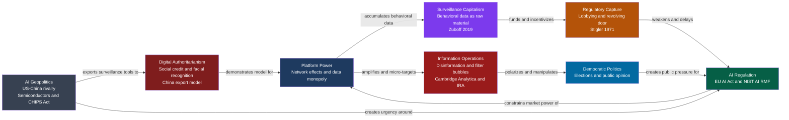

# Technology, AI, and Politics

> [!abstract] TL;DR
> Technology and artificial intelligence do not merely assist politics — they restructure the distribution of power, the capacity for state surveillance, the mechanics of warfare, and the terms of global competition. Surveillance capitalism commodifies behavioral data for political targeting; AI-enabled authoritarianism automates population control at unprecedented scale; the US-China semiconductor war makes chip fabrication a strategic weapon; and autonomous weapons systems threaten to remove human judgment from lethal force. Governing AI has become the defining political problem of the 21st century.

---

## Intuition

**Analogy:** In 15th-century Europe, whoever controlled the printing presses did not merely communicate faster — they determined which ideas could circulate, at what cost, and to which audiences. The Catholic Church spent a century trying to contain what Gutenberg had released; eventually, the political map of Europe was redrawn by a technology its inventors never intended to be political. The internet gave every citizen a printing press. Then a handful of platforms quietly bought the paper mills, the distribution routes, and the recommendation algorithms that decide which pamphlets get read.

Digital technology does to political power what the printing press did to religious authority: it collapses the cost of information transmission to near-zero, making old gatekeeping structures obsolete — while simultaneously creating new gatekeepers of unprecedented scale, with unprecedented knowledge of what every citizen reads, buys, believes, and fears. The political question is not whether this reshaping happens, but who controls it, under what rules, and in whose interest.

---

## How It Works



---

## Key Concepts

### Secondary Level

**Surveillance Capitalism (Shoshana Zuboff, 2019)**

Zuboff's thesis, developed in *The Age of Surveillance Capitalism*, is that the dominant technology companies have created a new economic logic: human behavioral data — clicks, searches, locations, social relationships — is extracted without meaningful consent, processed to generate "behavioral surplus," and sold as predictions about future behavior to a market of "behavioral futures traders" (primarily advertisers). The product is not services to users; users are the raw material from which behavioral data is extracted.

The political implications are direct: once a platform can predict behavior at scale, it can also *modify* behavior — nudging users toward particular purchases, emotional states, or political beliefs — for whoever pays for that capability. Political campaigns, foreign intelligence services, and domestic governments are all potential customers for behavioral influence at scale.

**Platform Power and Network Effects**

Platform businesses (search, social media, ride-sharing, e-commerce) exhibit strong positive network effects: each additional user makes the platform more valuable to all existing users. These dynamics create winner-take-all or winner-take-most markets. The political significance: a platform with 3 billion daily users controls the information environment for a substantial fraction of humanity. Decisions about content moderation, algorithmic amplification, and feed design are effectively decisions about which speech is heard, amplified, or suppressed — decisions made by private actors with no democratic accountability.

**Digital Authoritarianism**

Digital authoritarianism describes the use of technology — mass surveillance systems, facial recognition, predictive policing, social scoring, AI-powered censorship — to automate population control at scales previously impossible. China's Social Credit System is a network of corporate and government databases assigning reputational scores to individuals and firms based on financial behavior, legal compliance, and social conduct. Xinjiang's surveillance apparatus goes further: facial recognition cameras every 100-500 metres, mandatory smartphone apps uploading contacts and messages, DNA collection, and predictive policing systems that flag behavioral patterns for "re-education."

The export dimension: China sells AI surveillance infrastructure (Huawei, ZTE, Hikvision, Dahua) to approximately 80 countries under "Safe City" packages — bundling hardware and software with minimal privacy or oversight requirements. Digital authoritarianism is not a domestic Chinese phenomenon; it is an exportable governance model.

**Filter Bubbles and Algorithmic Amplification**

Recommendation algorithms optimize for engagement. Outrage, fear, and tribal content generate longer sessions and more clicks than measured, nuanced information. The result is that platforms systematically amplify emotionally provocative content regardless of accuracy. Eli Pariser's "filter bubble" concept describes the downstream effect: each user's feed increasingly reflects their existing beliefs, because that is the content the algorithm has learned they engage with. The effective range of political exposure narrows — not through censorship, but through personalization. Citizens in the same democracy come to inhabit non-overlapping information universes.

**Content Moderation: The Impossible Problem**

Every major platform must decide what content to allow, amplify, restrict, or remove — what Tarleton Gillespie calls the "politics of platforms." The moderation paradox: a platform that moderates too little enables harassment, disinformation, and coordinated inauthentic behavior; a platform that moderates too much suppresses legitimate political speech and faces accusations of partisan bias. No neutral solution exists because every moderation choice is a political choice about whose speech is protected and which risks are weighted more heavily. The US Section 230 debate centers on whether platforms retain legal immunity for user-generated content in exchange for good-faith moderation — immunity that critics argue has allowed disinformation to flourish without accountability.

---

### Undergraduate Level

**EU Artificial Intelligence Act (2024) — Risk-Based Framework**

The EU AI Act, which entered into force in August 2024, is the world's first comprehensive binding AI regulation. Its core architecture is risk-tiered:

| Risk Level | Examples | Requirements |
|---|---|---|
| **Unacceptable Risk** (banned) | Government social scoring; real-time biometric surveillance in public spaces; manipulation of vulnerable persons | Prohibited outright |
| **High Risk** | Hiring and credit scoring; criminal justice risk assessment; critical infrastructure control; educational assessment; immigration | Mandatory conformity assessments, transparency, human oversight, registration in EU database |
| **Limited Risk** | Chatbots, deepfakes | Disclosure requirements — users must know they are interacting with AI |
| **Minimal Risk** | Spam filters, AI-assisted video games | No requirements beyond existing law |

GPAI (General Purpose AI) models — large foundation models capable of many distinct tasks — are governed under separate provisions. Models trained with more than 10^25 FLOPs (the threshold for "systemic risk") must conduct mandatory model evaluations, adversarial testing, report serious incidents, and ensure cybersecurity protections. This directly targets frontier labs. GPAI obligations became active August 2, 2025; full high-risk system compliance is required by August 2026.

**NIST AI Risk Management Framework (AI RMF, 2023)**

The US National Institute of Standards and Technology's AI RMF offers a voluntary but widely adopted framework with four core functions:

- **GOVERN**: Establish organizational processes, policies, and accountability structures for AI risk management
- **MAP**: Identify and categorize AI risks across the specific deployment context
- **MEASURE**: Analyze and quantify AI system impact and trustworthiness characteristics
- **MANAGE**: Prioritize, respond to, and communicate AI risks based on organizational risk tolerance

The NIST framework is explicitly non-regulatory (unlike the EU Act) and principle-based rather than rule-based, reflecting the US preference for industry self-governance over mandatory standards. The tension between US voluntarism and EU mandate defines the global AI governance landscape: two different theories of regulatory intervention — rules versus principles, mandatory versus voluntary, ex-ante conformity assessment versus ex-post enforcement.

**Information Operations: Cambridge Analytica and the 2016 Election Cycle**

Cambridge Analytica harvested Facebook data of approximately 87 million US users without meaningful consent by exploiting the platform's third-party API. This data was used to build psychographic profiles based on the OCEAN personality model (Openness, Conscientiousness, Extraversion, Agreeableness, Neuroticism) and target political advertisements designed to suppress Democratic turnout and energize specific voter segments in key swing states for the 2016 Trump campaign.

Russia's Internet Research Agency (IRA) ran a parallel operation: buying Facebook and Instagram advertisements, creating fake American activist accounts, and organizing real-world political events — all from a St. Petersburg troll factory — to amplify social divisions around race, immigration, and political identity. The Senate Intelligence Committee's 2019 report documented approximately 80,000 Facebook posts reaching roughly 126 million Americans.

Key analytical point: neither operation created polarization from nothing. Both exploited pre-existing social fractures and amplified them cheaply and covertly. The counterfactual (would these campaigns have materially changed electoral outcomes absent social media?) remains contested, but the demonstrated capacity for foreign actors to cheaply shape democratic information environments represents a durable structural vulnerability.

**Algorithmic Governance: Automated Decision-Making in Public Administration**

Governments deploy algorithmic systems to make or support decisions about welfare entitlement, parole and bail, child welfare intervention, immigration status, and tax enforcement. These systems raise four distinct political problems:

1. **Opacity**: Proprietary systems prevent affected citizens or their legal representatives from understanding or challenging decisions
2. **Bias at scale**: Training data reflecting historical discrimination produces systems that systematically disadvantage protected groups — the COMPAS recidivism algorithm showed racial disparities while performing no better than untrained online participants (Dressel and Farid, 2018)
3. **Accountability gap**: When an algorithm causes harm, responsibility is diffuse — developer, procuring government, deploying official all disclaim it
4. **Scale amplification**: Errors in manual systems affect individual cases; errors in algorithmic systems affect millions simultaneously, compressing the feedback loop between deployment and harm

The Dutch SyRI (System Risk Indication) scandal (2020) is the canonical political-legal case: a court ruled the government's cross-database welfare fraud detection system violated the European Convention on Human Rights' right to private life — establishing that automated risk-scoring of citizens requires the same human rights protections as any other state action.

**The Geopolitics of AI: US-China Semiconductor War**

Advanced AI training capability requires advanced semiconductors. The supply chain has three critical chokepoints:

1. **Design tooling (EDA software)**: Dominated by Synopsys and Cadence — both US companies
2. **Extreme Ultraviolet (EUV) lithography machines**: Monopolized by ASML, the sole manufacturer of machines that print chips at 5nm and below — a Dutch company subject to US export pressure
3. **Leading-edge fabrication**: TSMC (Taiwan) manufactures approximately 90% of the world's most advanced chips

US export controls implemented in October 2022 blocked NVIDIA from selling A100 and H100 GPUs to China and prevented ASML from shipping EUV machines to Chinese chipmakers. NVIDIA designed downgraded variants (A800, H800, H20) calibrated to fall below control thresholds; each iteration prompted new controls. The policy became volatile in early 2026 when the Trump administration reversed some restrictions, creating uncertainty about the long-term durability of the containment strategy.

China's Huawei Ascend 910B demonstrated a viable domestic alternative, and DeepSeek's January 2025 release of a competitive frontier model trained on stockpiled pre-control chips showed that Chinese AI development remains competitive despite hardware constraints. The geopolitical lesson: export controls slow but likely cannot stop a sufficiently motivated state with adequate scientific capacity and existing hardware stockpiles.

**Autonomous Weapons Systems (LAWS) and the Responsibility Gap**

Lethal Autonomous Weapons Systems are weapons that can identify, select, and engage targets without a human decision in the targeting loop. Current systems with varying degrees of autonomy include Israel's Harpy loitering munition, South Korea's Samsung SGR-A1 sentry, and US Navy Phalanx close-in weapon systems.

Philosopher Robert Sparrow's **Responsibility Gap** argument: for a lethal engagement to be morally acceptable under international humanitarian law (IHL), a human being must bear moral responsibility for the decision to kill. An autonomous system cannot be held responsible — it is not a moral agent. The commanders who deployed it cannot foresee its specific decisions. Manufacturers disclaim battlefield responsibility. No responsible human exists — and the gap makes LAWS structurally incompatible with just war principles, regardless of their accuracy.

The counter-argument (Ronald Arkin): autonomous systems, properly programmed, might apply IHL rules of proportionality and discrimination more consistently than soldiers under combat stress. No binding international treaty on LAWS exists despite UN discussions since 2014; the US Department of Defense Directive 3000.09 requires "human in the loop" for lethal force but carves exceptions for time-critical and cyberdefense scenarios.

---

### Graduate Level

**Techno-Feudalism (Varoufakis, 2024)**

Yanis Varoufakis's *Technofeudalism: What Killed Capitalism* argues that the major digital platforms are not capitalist enterprises in the classical sense. They do not compete in markets — they *own* the cloud infrastructure on which markets now depend. Just as feudal lords extracted rent from serfs working their land, cloud lords (Amazon, Google, Apple, Meta, Microsoft) extract "cloud rent" from businesses and individuals who must use their infrastructure to participate economically at all.

The political implication: traditional antitrust tools designed for capitalist market competition (price-fixing, predatory pricing, merger review under the consumer welfare standard) fail to capture the feudal extraction dynamic. Regulation that seeks to make Amazon "compete fairly" misunderstands the structure — the platform is not a market participant, it is the market infrastructure itself. Addressing this requires new legal categories: mandatory interoperability, structural separation of platform infrastructure from platform services, or public utility regulation on the model of natural monopoly.

**Regulatory Capture Theory Applied to Big Tech**

George Stigler's theory of regulatory capture (1971) predicts that regulatory agencies will, over time, be captured by the industries they regulate: the industry has concentrated, long-term stakes in regulatory outcomes; the diffuse public has low per-capita incentives to counter-organize. The result is that regulations come to serve producer rather than public interests.

Applied to Big Tech: the revolving door between technology companies and regulatory agencies (FTC, FCC, SEC, DG COMP) means regulatory personnel carry interests and relationships across the public-private boundary. The 2012 FTC investigation of Google's search practices was settled without action — reportedly over staff objections. Meta's 2019 FTC consent decree ($5 billion fine, no structural remedy) is frequently cited as regulation that closed a political threat without disrupting the underlying power structure.

The EU's structurally different incentive profile (no domestic tech champion to protect) explains its more aggressive posture: Google fined over €8 billion across three Competition Directorate cases; the Digital Markets Act (DMA, 2022) designates "gatekeepers" and imposes interoperability and data access requirements that directly constrain platform power — regardless of whether prices are high.

**AI and Selectorate Theory: Autocracy Augmented**

Selectorate theory (Bueno de Mesquita et al. 2003) explains how autocrats maintain power through small winning coalitions of loyalists who receive private goods. AI surveillance dramatically changes the economic logic of authoritarian control along three dimensions:

1. **Reducing coercion costs**: Mass surveillance allows targeted identification and preemptive neutralization of potential dissidents before collective action can form. The marginal cost of identifying and suppressing a challenger falls; smaller physical security forces suffice.

2. **Reducing loyalty costs**: If the dictator can verify loyalty continuously through monitoring of communications, financial transactions, and movement, the uncertainty that normally requires paying large loyalty premiums to coalition members falls. Coalitions can be smaller and cheaper to maintain.

3. **Closing the information gap**: AI-powered surveillance dissolves the information asymmetry between ruler and ruled. Preference falsification (Timur Kuran) — citizens publicly complying while privately dissenting — becomes harder when behavioral data reveals private beliefs even without explicit confession.

The formal implication: AI surveillance shifts the selectorate equilibrium toward smaller W (smaller winning coalition, more personalist autocracy) and higher stability, without requiring the mass violence that historically characterized the most repressive regimes. Digitally-enabled authoritarianism is structurally cheaper, more informational, and potentially more durable than its pre-digital predecessors.

**Digital Sovereignty: Post-Westphalian Challenge**

Digital sovereignty encompasses three distinct but related state claims:

1. **Infrastructure sovereignty**: States demand that critical digital infrastructure — cloud data centers, undersea cables, DNS servers — be physically located within their territory or subject to their legal jurisdiction
2. **Data sovereignty**: Data generated by a state's citizens should be stored, processed, and accessible under that state's law (Russia's data localization law Ru-149, India's Personal Data Protection framework, China's Cybersecurity Law)
3. **Algorithmic sovereignty**: States assert the right to determine which algorithms can operate within their borders and under what conditions (China's algorithm regulation, France's AI national security doctrine)

The theoretical tension: the Westphalian system grants states sovereignty over their physical territory. Digital infrastructure and data flows do not respect borders — a US company's algorithm operates in France without a French office; a Russian disinformation campaign targets US voters without crossing a physical border. Standard sovereignty theory generates no answer to these challenges, producing an ongoing contest between the "splinternet" model (national digital spaces with different rules) and global interoperability norms — a contest currently trending toward fragmentation.

**Political Theory of Autonomous Weapons: Three Positions**

| Position | Core Argument | Proponents |
|---|---|---|
| **Prohibitionist** | LAWS violate IHL's requirement for human moral judgment in targeting; no state may lawfully kill without human responsibility | Asaro; HRW Campaign to Stop Killer Robots |
| **Regulationist** | LAWS can satisfy IHL through "meaningful human control" standards; prohibition is neither achievable nor desirable | US, UK, Russia, Israel; majority of state parties |
| **Accelerationist** | Autonomous systems programmed with IHL rules may reduce civilian casualties by eliminating soldier psychology — revenge, heat of battle, dehumanization | Arkin |

The operative hinge is what "meaningful human control" requires: must a human approve each specific target engagement, or is it sufficient to authorize a mission envelope within which the system operates autonomously? The US, Russia, and Israel have all deployed systems that approach or cross the meaningful control threshold in specific deployment contexts, while officially endorsing the meaningful control standard in UN discussions — a form of strategic ambiguity that has prevented treaty formation.

**The Automation-Labor-Politics Nexus and UBI**

AI automation threatens mass displacement in cognitive as well as manual labor — potentially including knowledge work previously considered safe. Acemoglu and Restrepo's "task model" distinguishes between automation that displaces workers from existing tasks and automation that creates new tasks; empirically, recent AI investment has been concentrated in displacement rather than task creation, which is why productivity gains have not translated proportionally into wage growth.

The political backlash has three observed forms: populist anti-tech nationalism (Brexit, Trump), demands for "robot taxes" (Bill Gates, IMF), and renewed interest in Universal Basic Income as a decoupling of income from employment. The UBI debate is explicitly political-economic: UBI funded by capital taxes effectively transfers income from capital (the beneficiary of automation) to displaced labor. Whether democratic systems can achieve this redistribution before political backlash generates more disruptive responses is an open empirical question.

---

## Python Demo

```python
import numpy as np
import matplotlib.pyplot as plt

# Platform Power and Regulatory Capture: Feedback Loop Simulation
# A discrete-time dynamical system with three coupled variables:
#   m(t) : platform market share in [0, 1]
#   L(t) : lobbying intensity in [0, 1], derived from m
#   R(t) : regulatory strictness in [0, 1], eroded by lobbying but partially restored
#
# The model captures the core political economy argument:
#   - Market share generates lobbying resources (superlinear: scale economies in lobbying)
#   - Lobbying erodes regulatory capacity faster than democratic processes can restore it
#   - Weak regulation allows faster market concentration, completing the feedback loop

def simulate_platform_politics(
    m0,
    R0,
    T=120,
    alpha=0.90,    # lobbying capacity coefficient (larger = more $ per market share unit)
    gamma=0.035,   # rate at which lobbying erodes regulation per time step
    delta=0.008,   # rate of regulatory recovery (elections, scandals, public pressure)
    growth=0.10,   # platform growth rate from network effects
):
    """
    Market share (logistic growth braked by regulation):
        m[t+1] = clip(m[t] + growth * (1 - R[t]) * m[t] * (1 - m[t]), 0, 1)

    Lobbying capacity (superlinear: large platforms lobby disproportionately):
        L[t] = alpha * m[t]^1.5

    Regulatory strictness (eroded by lobbying, partially restored by public processes):
        R[t+1] = clip(R[t] - gamma * L[t] + delta, 0, 1)
    """
    m = np.zeros(T)
    L = np.zeros(T)
    R = np.zeros(T)
    m[0], R[0] = m0, R0
    for t in range(T - 1):
        L[t] = alpha * m[t] ** 1.5
        R[t + 1] = np.clip(R[t] - gamma * L[t] + delta, 0.0, 1.0)
        m[t + 1] = np.clip(
            m[t] + growth * (1.0 - R[t]) * m[t] * (1.0 - m[t]),
            0.0, 1.0,
        )
    L[T - 1] = alpha * m[T - 1] ** 1.5
    return m, L, R


# Three initial conditions representing different market structures
scenarios = [
    ("Small entrant, strong regulation",   0.05, 0.82, "#2196F3"),
    ("Mid-size platform, moderate rules",  0.30, 0.55, "#FF9800"),
    ("Dominant incumbent, weak rules",     0.65, 0.20, "#F44336"),
]

T = 120
t_axis = np.arange(T)
fig, axes = plt.subplots(1, 3, figsize=(15, 5))

for label, m0, R0, color in scenarios:
    m, L, R = simulate_platform_politics(m0=m0, R0=R0, T=T)
    axes[0].plot(t_axis, m, label=label, color=color, lw=2)
    axes[1].plot(t_axis, R, label=label, color=color, lw=2)
    axes[2].plot(t_axis, L, label=label, color=color, lw=2)

for ax, title, ylabel in zip(
    axes,
    ["Market Concentration", "Regulatory Strictness", "Lobbying Intensity"],
    ["Platform Market Share  m(t)",
     "Regulatory Score  [0=none, 1=strict]",
     "Lobbying Capacity  L(t)"],
):
    ax.set_title(title, fontsize=11, fontweight="bold")
    ax.set_xlabel("Time (quarters)")
    ax.set_ylabel(ylabel)
    ax.legend(fontsize=8)
    ax.set_ylim(-0.05, 1.10)
    ax.grid(alpha=0.3)

plt.suptitle(
    "Political Economy of Platform Power: Regulatory Capture Feedback Loop",
    fontsize=13, fontweight="bold", y=1.02,
)
plt.tight_layout()
plt.savefig("platform_power_regulatory_capture.png", dpi=150, bbox_inches="tight")
print("Chart saved to platform_power_regulatory_capture.png\n")

print(f"{'Scenario':<45} {'m_final':>8} {'R_final':>8} {'L_final':>8}")
print("-" * 73)
for label, m0, R0, color in scenarios:
    m, L, R = simulate_platform_politics(m0=m0, R0=R0, T=T)
    print(f"{label:<45} {m[-1]:>8.3f} {R[-1]:>8.3f} {L[-1]:>8.3f}")
```

The model demonstrates three qualitatively different political equilibria. A platform entering a heavily regulated market remains constrained — regulatory recovery (delta) stays ahead of the modest lobbying capacity generated at small m. A mid-size platform with moderate regulation reaches an unstable intermediate state that slowly tips toward concentration. A dominant incumbent in a weakly regulated environment rapidly erodes remaining oversight, reaching near-monopoly — the "too big to regulate" outcome observed across Big Tech post-2015. The core political economy insight: the regulatory window is narrow and front-loaded; once network effects have driven concentration above approximately 0.4, the lobbying-regulation feedback becomes strongly self-reinforcing.

---

## Real-World Applications

> **Cambridge Analytica and the 2016 US Election:** The firm harvested psychographic data on 87 million Facebook users and micro-targeted political advertising to suppress Democratic turnout and energize low-propensity Republican voters in key swing states. In parallel, Russia's Internet Research Agency ran an information operation via fake social media accounts reaching an estimated 126 million Americans. Neither campaign created polarization — both amplified pre-existing social fractures cheaply and covertly. The episode demonstrated that behavioral data collected for commercial advertising converts directly into political manipulation capacity, at near-zero marginal cost to the operator.

> **China's Xinjiang Surveillance Apparatus:** Xinjiang hosts the most comprehensive territorial AI surveillance system ever deployed: facial recognition cameras every 100-500 metres, mandatory smartphone apps uploading contacts and messages, DNA collection from residents aged 12-65, and predictive policing systems flagging behavioral patterns for "re-education." The system is built by Hikvision, Dahua, SenseTime, and Megvii — four of which were placed on the US Entity List in 2019. This apparatus subsequently became a marketing showcase for Chinese surveillance exports to authoritarian buyers: approximately 80 countries have purchased Huawei or ZTE "Safe City" infrastructure packages.

> **EU AI Act (2024) — First Binding AI Law:** The Act bans social scoring by public authorities (directly targeting the Chinese model), prohibits real-time biometric surveillance in public spaces, and requires high-risk AI systems used in hiring, credit, criminal justice, and critical infrastructure to pass conformity assessments before deployment. Foundation models trained with more than 10^25 FLOPs must report systemic risks to the EU AI Office. GPAI governance obligations activated in August 2025, forcing OpenAI, Google DeepMind, Anthropic, and Meta to adapt products for the European market or face market exclusion.

> **US-China Semiconductor War and the DeepSeek Moment:** The October 2022 Biden administration export controls blocked NVIDIA's A100 and H100 sales to China and ASML's EUV machine exports to Chinese chipmakers. NVIDIA designed downgraded variants (A800, H800, H20); each iteration prompted new controls. DeepSeek's January 2025 release of a competitive frontier model — trained on stockpiled pre-control chips — demonstrated that Chinese AI development remained competitive despite hardware constraints, triggering a global reassessment of the controls' effectiveness. In early 2026, the Trump administration reversed some restrictions, revealing the policy's political volatility. The episode illustrates that export controls are at best a delay mechanism, not a permanent barrier, against a state with sufficient scientific capacity and existing hardware.

---

## Common Pitfalls

- **Technological determinism** — Treating technology as an autonomous force that produces predictable political outcomes (the internet *will* democratize; AI *will* automate jobs). Technology creates possibilities and constraints; political choices determine which possibilities are realized. The same facial recognition technology enforces immigration law in liberal democracies and persecutes minorities in authoritarian states. The tool does not determine the outcome — the institutional context does.

- **Conflating AI with authoritarianism** — AI surveillance is a tool deployed by authoritarian actors, not an inherently authoritarian technology. The political variable is the institutional context: rule of law, independent judiciary, civil society, and press freedom. States with these institutions can deploy surveillance AI with oversight; states without them cannot. Banning AI surveillance in democracies does not protect populations in autocracies.

- **Regulatory optimism about self-governance** — The historical pattern in platform regulation is that voluntary commitments are honored when cost is low and violated when compliance conflicts with shareholder value. The 2023 Biden White House voluntary AI commitments from frontier labs lacked enforcement mechanisms. Every successful consumer protection regime — seatbelts, pharmaceutical safety, financial disclosures — required mandatory standards with penalties.

- **Ignoring path dependence in regulation** — Regulatory windows are narrow and front-loaded. Once a platform achieves dominant market share, its lobbying capacity exceeds the capacity of most regulatory agencies to constrain it. The moment for effective structural intervention (forced interoperability, data portability, merger review) occurs early — before the network effect flywheel has fully engaged. Political attention typically arrives late, after harm is visible and structural remedies are costlier.

- **Missing dual-use** — Almost every AI capability relevant to political surveillance was developed initially for commercial or civilian purposes: facial recognition for phone unlocking, NLP for customer service, predictive analytics for credit scoring. Regulating only "military AI" or "weapons AI" misses the dual-use pipeline through which civilian AI capabilities become instruments of state repression. The problem is the capability, not the stated purpose.

- **Treating the US-China AI competition as binary** — The semiconductor and AI competition is real and consequential, but treating it as zero-sum misses the deep economic interdependence (US AI companies rely on TSMC for chips, sell products in China), the role of non-state actors (open-source communities, international research collaborations), and the possibility of selective cooperation on catastrophic risk governance and AI safety standards — an area where even strategic rivals have converging interests.

---

## Related Concepts

- [[Authoritarianism_and_Hybrid_Regimes]] — Digital authoritarianism extends the three-pillar model: AI surveillance radically reduces the cost of the repression pillar and provides continuous behavioral data for legitimation and cooptation; selectorate theory predicts AI makes small-W autocracy structurally cheaper and more stable
- [[Democratic_Backsliding_and_Polarization]] — Algorithmic amplification of outrage content reduces the effective bounded-confidence radius in Deffuant opinion dynamics, accelerating filter bubble formation; platform micro-targeting operationalizes the "strategic manipulation" form of backsliding Bermeo identifies as the fastest-growing category
- [[War_Conflict_and_Security]] — Cyber operations (Stuxnet, Russian election interference, Chinese IP theft) constitute a new conflict domain that does not fit the classic war-peace binary; LAWS threaten to lower the threshold for use of lethal force by removing human hesitation, cost, and political accountability
- [[Geopolitics_and_Power_Politics]] — The US-China AI competition follows power transition logic: a rapidly rising competitor challenging the dominant hegemon in a domain that may determine future military and economic supremacy; semiconductor chokepoints (TSMC, ASML, NVIDIA) function as strategic resources analogous to oil in 20th-century geopolitics
- [[Global_Order_and_Hegemony]] — Digital infrastructure (DNS, undersea cables, cloud platforms, SWIFT payment systems) constitutes a contested layer of the liberal international order; US tech hegemony is both a source of structural power and a target for Chinese and EU digital sovereignty claims
- [[Political_Economy_and_Market_State_Relations]] — Platform regulatory capture is a textbook application of Stigler's capture theory; surveillance capitalism represents a new variety of capitalism not captured by the LME-CME typology because its commodity is behavioral prediction rather than products or services
- [[The_State_System_and_Sovereignty]] — Digital sovereignty claims (data localization, algorithmic sovereignty, infrastructure control) are attempts to extend Westphalian territorial sovereignty to a domain that is physically borderless; the "splinternet" is the endpoint of unresolved sovereignty competition
- [[Welfare_States_and_Social_Policy]] — AI automation generates the displacement dynamics that drive UBI demands; the redistributive response to automation is a welfare state design question about whether capital-generated productivity gains can be taxed and transferred to displaced workers through democratic political processes
- [[International_Institutions_and_Multilateralism]] — Global AI governance faces classic collective action problems: states have unilateral incentives to defect from safety standards to gain competitive advantage; the EU AI Act, NIST AI RMF, and bilateral US-China safety talks represent competing models of multilateral versus bilateral versus unilateral governance
- [[Responsible_AI]] — The EU AI Act's risk-tiered framework and NIST AI RMF's Govern-Map-Measure-Manage cycle are the operational governance instruments through which political goals of AI accountability and safety are translated into organizational requirements; their different mandatory versus voluntary logics represent competing regulatory theories
- [[AI_Bias_and_Fairness]] — Algorithmic governance in public administration concentrates all the bias-amplification risks of ML at population scale and with coercive state power behind enforcement; the Dressel-Farid COMPAS study and Dutch SyRI ruling are the canonical political-legal cases establishing that algorithmic decisions require the same rights protections as human decisions
- [[Constitutional_AI]] — Anthropic's Constitutional AI is a technical-political attempt to embed political values directly into model training rather than relying on post-hoc regulation; it represents the "values alignment" approach to AI governance against the EU Act's "conformity assessment" approach — two different theories of where values should be encoded
- [[AI_Agents_Overview]] — Autonomous weapons systems are a specific application of AI agency in which the agent makes lethal targeting decisions; the governance question is whether agentic AI can satisfy the "meaningful human control" standard required by international humanitarian law given that the defining feature of agency is operating without moment-to-moment human supervision
- [[GPU_Architecture_and_CUDA]] — The H100 GPU and its successors are the physical substrate of frontier AI training; NVIDIA's architecture dominance and US export controls over advanced GPU sales to China make GPU microarchitecture a direct site of geopolitical contest — the political stakes of a hardware engineering decision
- [[MITRE_ATT_CK]] — The ATT&CK framework taxonomizes adversary tactics used in state-sponsored cyberattacks; Russian GRU (APT28) and Chinese MSS (APT41) operations documented in ATT&CK are the technical infrastructure of political information operations — the connection between cybersecurity methodology and political intelligence operations
- [[_MOC_Contemporary_Global_Issues|↑ Contemporary Global Issues MOC]] — section map and learning path for this cluster of notes

---

## Review Questions

### Secondary

1. Shoshana Zuboff says that in surveillance capitalism "if the product is free, you are the product." Explain what she means using the example of a search engine. Who are the real customers, and what exactly are they buying?

2. What is a filter bubble, and how does a social media recommendation algorithm create one? Use a concrete example to explain how filter bubbles might affect what voters believe during an election campaign — without anyone ever lying to them directly.

3. Why is content moderation politically controversial? Give one example of a decision a platform might make that conservatives would call censorship and one that progressives would call dangerous permissiveness. Is there a neutral position available?

### Undergraduate

1. The EU AI Act bans social scoring by public authorities but allows many private commercial scoring systems to continue operating. Is this a coherent distinction? What theory of state power versus market power underlies it, and what does it fail to capture about how scoring systems affect people's lives?

2. Compare Sparrow's "Responsibility Gap" argument against autonomous weapons with Arkin's counter-argument that autonomous systems might apply IHL rules more consistently than human soldiers. Which argument do you find more compelling and why? What empirical evidence would resolve the debate?

3. The US export controls on advanced semiconductors aimed to slow China's AI development. DeepSeek's January 2025 model challenged the controls' effectiveness while China used pre-control stockpiles. Using concepts from power transition theory and economic interdependence, analyze whether the export control strategy is likely to achieve its goals over a ten-year time horizon, and what strategic costs it imposes on the United States.

4. Cambridge Analytica harvested data that Facebook users had technically consented to share via terms of service. If consent was given, why is the episode widely treated as a scandal rather than simply a contractual matter? What theory of meaningful consent and cognitive autonomy underlies the political objection?

### Graduate

1. Varoufakis argues that digital platforms are "techno-feudal" because they extract rent from cloud infrastructure rather than profit from market competition. If this is correct, what are the implications for antitrust policy? Does the standard "consumer welfare" framework as interpreted since *Brooke Group* capture the political harm, and if not, what legal framework would — and what political obstacles exist to its adoption?

2. Using selectorate theory (Bueno de Mesquita et al. 2003), develop a formal argument for why AI surveillance technology should shift the equilibrium winning coalition size W downward for an authoritarian leader. State your key assumptions clearly. What empirical predictions does this generate about regime behavior in countries that have adopted comprehensive surveillance infrastructure? How would you operationalize and test these predictions, given that both W and surveillance intensity are unobservable directly?

3. Digital sovereignty claims generate incompatible national regulatory regimes — a "splinternet." Using theories of international institutions (regime complexity, overlapping regimes, hegemonic stability), analyze: (a) what collective-action problem structures make comprehensive global AI governance difficult to achieve; (b) whether selective cooperation on AI safety and catastrophic-risk standards is achievable even without comprehensive governance, and under what conditions; and (c) what the distributional stakes are for developing countries excluded from the US-China-EU trilateral standard-setting process — and whether their exclusion is structurally stable.

---

## Sources

- [Shoshana Zuboff, *The Age of Surveillance Capitalism* (PublicAffairs, 2019)](https://www.publicaffairsbooks.com/titles/shoshana-zuboff/the-age-of-surveillance-capitalism/9781610395694/)
- [EU Artificial Intelligence Act — EUR-Lex, Regulation 2024/1689](https://eur-lex.europa.eu/legal-content/EN/TXT/?uri=CELEX:32024R1689)
- [High-level summary of the EU AI Act, artificialintelligenceact.eu](https://artificialintelligenceact.eu/high-level-summary/)
- [NIST AI Risk Management Framework (AI RMF 1.0), January 2023](https://airc.nist.gov/RMF)
- [US Senate Intelligence Committee, *Report on Russian Active Measures Campaigns and Interference in the 2016 U.S. Election*, Vol. 2 (Social Media), October 2019](https://www.intelligence.senate.gov/sites/default/files/documents/Report_Volume2.pdf)
- [Robert Sparrow, "Killer Robots," *Journal of Applied Philosophy* 24(1), 2007](https://doi.org/10.1111/j.1468-5930.2007.00346.x)
- [Yanis Varoufakis, *Technofeudalism: What Killed Capitalism* (Melville House, 2024)](https://www.mhpbooks.com/books/technofeudalism/)
- [Paul Scharre, *Army of None: Autonomous Weapons and the Future of War* (Norton, 2018)](https://wwnorton.com/books/army-of-none/)
- [Samantha Bradshaw and Philip Howard, "The IRA, Social Media and Political Polarization in the United States 2012-2018," Oxford Internet Institute, 2018](https://comprop.oii.ox.ac.uk/research/ira-political-polarization/)
- [Understanding U.S. Allies' Legal Authority to Implement AI and Semiconductor Export Controls, CSIS, 2023](https://www.csis.org/analysis/understanding-us-allies-current-legal-authority-implement-ai-and-semiconductor-export)
- [George Stigler, "The Theory of Economic Regulation," *Bell Journal of Economics and Management Science* 2(1), 1971](https://doi.org/10.2307/3003160)
- [Darius Rejali, *Torture and Democracy* (Princeton UP, 2007) — surveillance and state power](https://press.princeton.edu/books/paperback/9780691143910/torture-and-democracy)
- [Dressel and Farid, "The Accuracy, Fairness, and Limits of Predicting Recidivism," *Science Advances* 4(1), 2018](https://doi.org/10.1126/sciadv.aao5580)

---

#PoliticalScience #GlobalIssues #Technology #AIGovernance
