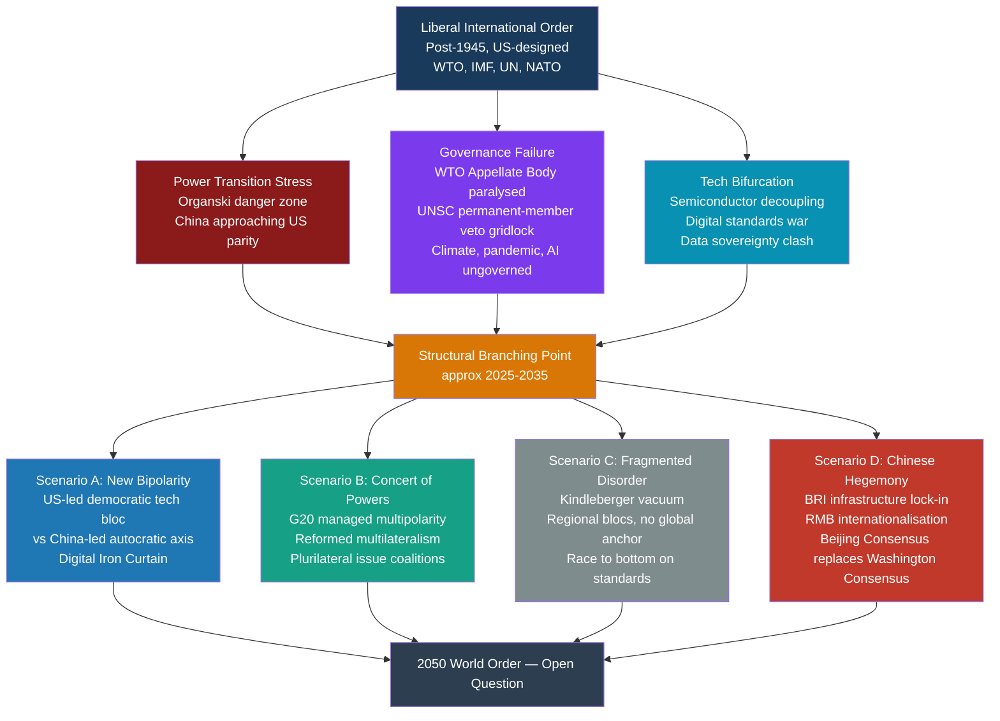

# The Future of Global Order

> [!abstract] TL;DR
> The post-1945 American-led liberal international order is under structural stress from three simultaneous forces — a US-China power transition approaching Organski's danger zone, a cascade of governance failures in multilateral institutions, and a technology-driven bifurcation into competing digital ecosystems — and the 2050 outcome will be one of four scenarios: managed multipolarity, new bipolarity, Chinese hegemony, or fragmented disorder.

---

## Intuition

**Analogy:** Imagine a city whose entire road network, currency, and legal code were designed by one founding family when they were the only wealthy residents. For seventy years, everyone used the family's roads, paid in the family's coins, and accepted the family's courts — because the roads were good and the alternative was chaos. Now the city has grown: a second large family has emerged, a third is rising fast, and dozens of smaller households are asserting themselves. The founding family is still powerful but clearly not the only power. The roads are cracking because everyone uses them but nobody agrees who should pay for repairs. The courts are deadlocked because two families have veto rights. And the second family has quietly begun building its own parallel road network through the neighbourhoods the founding family neglected. The question now is not whether the old city plan will survive intact — it will not — but what replaces it: a new city council, competing city-states, or a new dominant family writing the next set of rules.

The city is the world. The founding family is the United States. The emerging second family is China. The cracking roads are the WTO, UNSC, and climate agreements. The parallel road network is the Belt and Road Initiative. This is the central geopolitical question of the twenty-first century.

---

## How It Works



---

## Key Concepts

### Secondary Level

**What Is the "Global Order" and Why Does It Matter?**

The global order is the set of rules, institutions, norms, and power relationships that structure how states interact. It is not neutral: the post-1945 order was designed at Bretton Woods, San Francisco, and in the Marshall Plan — by the United States and its allies, overwhelmingly reflecting their values and interests. It rested on three pillars: (1) an open trading system (GATT/WTO), (2) a dollar-denominated monetary system (IMF, World Bank), and (3) a security architecture (UN Charter, US alliance networks). For seventy years this system provided the infrastructure of relative prosperity and the avoidance of great-power war.

**The Post-American World: Zakaria and Nye**

Fareed Zakaria's *The Post-American World* (2008) argued that US decline was relative, not absolute: the real story was "the rise of the rest" — China, India, Brazil, Turkey. The US would remain the world's most powerful state for decades, but its dominance would be eroded by the sheer accumulation of capability in other states that the US-designed open order had inadvertently enabled. Joseph Nye supplemented this with his concept of **smart power** — combining hard power (military, economic coercion) with soft power (attraction, legitimacy, norm-setting) — and warned that raw material superiority could not substitute for the erosion of legitimacy that unilateralism and financial crises produce.

**The Kindleberger Trap and the Public-Goods Gap**

When a hegemon retreats from global leadership before a capable successor is ready to fill the gap, the international system loses its provider of public goods: open trade, financial stability, security enforcement. Charles Kindleberger identified this as the cause of the 1930s depression; Joseph Nye labelled the contemporary version the "Kindleberger Trap." The trap has two conditions: the established hegemon is unwilling or unable to supply public goods (America First, domestic polarisation), and the rising challenger lacks the network of allies, normative legitimacy, or institutional reach to replace it. The result is not war but vacuum — protectionism, financial instability, pandemic unpreparedness, climate inaction.

**The Crisis of Multilateralism**

The WTO Appellate Body — the global trade court — has been paralysed since 2019 when the United States blocked new judge appointments. The UN Security Council's five permanent members (P5) effectively have veto power over any enforcement action, routinely deadlocking responses to aggression (Russia-Ukraine), mass atrocities (Syria), and nuclear proliferation. The result is a phenomenon scholars call **institutional arthritis**: the organisations still exist, states still nominally participate, but the machinery for binding collective decisions is jammed. This is not the absence of institutions but the hollowing-out of their authority.

---

### Undergraduate Level

**Multipolarity vs. Bipolarity: The Structural Debate**

The Cold War offered a clean structure: two superpowers, clear alliance blocs, mutually assured destruction providing stability through terror. Many realists (Waltz) regarded bipolarity as unusually stable — fewer miscalculation points, unambiguous deterrence. Today's emerging structure is contested:

| Model | Proponents | Key Feature | Stability Assessment |
|---|---|---|---|
| **New Bipolarity** | Graham Allison, Hal Brands | US-China as organising axis; secondary powers align with one | Stable if deterrence holds; catastrophic if Taiwan triggers conflict |
| **Multipolar** | John Mearsheimer, Randall Schweller | Several great powers (US, China, EU, India, Russia) with shifting coalitions | Classical multipolar instability — more miscalculation nodes |
| **Non-polar** | Richard Haass | Power too diffuse; states, corporations, NGOs, terrorist networks all matter | Coordination hardest; global governance nearly impossible |
| **Concert of Powers** | Charles Kupchan | Managed great-power coordination on agreed rules, as in 1815 Concert of Europe | Stable if sustained; requires China to accept partial constraints |

**The Belt and Road Initiative: China's Order-Building**

China's Belt and Road Initiative (BRI), launched in 2013, is the most ambitious infrastructure investment programme since the Marshall Plan — over $1 trillion in loans and investments spanning 140+ countries. Its geopolitical logic: create physical infrastructure dependencies (ports, railways, pipelines, fibre-optic cables), establish the Chinese renminbi as a regional transaction currency, and export Chinese governance norms and technical standards. Critics label it "debt-trap diplomacy" (Sri Lanka's Hambantota Port, Pakistan's CPEC obligations), though researchers at AidData find the picture more complex: many projects are driven by recipient-country demand, and default-and-seizure cases are rarer than the narrative suggests. What is unambiguous is that BRI builds alternative networks outside US-dominated structures — the geopolitical intent, whatever the commercial logic.

**BRICS Expansion and Institutional Counter-Positioning**

The original BRICS (Brazil, Russia, India, China, South Africa) was a Goldman Sachs analytical construct that became a real diplomatic forum. At the 2023 Johannesburg summit, BRICS expanded to include Egypt, Ethiopia, Iran, Saudi Arabia, and the UAE — representing roughly 45% of world population and 36% of world GDP (PPP). The BRICS New Development Bank (NDB) offers infrastructure finance without IMF conditionality. The BRICS expansion represents what scholars call **counter-institutional positioning**: creating parallel multilateral structures that legitimise non-Western development models and erode the normative monopoly of Bretton Woods institutions, without directly confronting or replacing them.

**Deglobalisation and Fragmentation Trends**

The post-2008 trajectory of global trade has diverged sharply from the 1990-2008 hyperglobalisation era. Several drivers compound:

- **Friend-shoring**: US and European supply chain diversification away from China, prioritising "trusted" partners over cost minimisation (CHIPS Act 2022, EU Critical Raw Materials Act 2023).
- **Industrial policy revival**: State subsidies return as a tool — US IRA ($369B clean-energy subsidies), EU Green Deal, China's "Made in China 2025" — representing a direct challenge to WTO non-discrimination principles.
- **Trade weaponisation**: Sanctions and export controls as strategic instruments (SWIFT exclusion of Russian banks, US chip export controls targeting Huawei and SMIC).

The IMF estimates that full geoeconomic fragmentation could reduce global output by 2-7% in the long run — equivalent to removing France or Germany from the world economy permanently.

**Democratic vs. Autocratic Models: The Governance Competition**

Larry Diamond and others have identified a global trend of **democratic backsliding** (see [[Democratic_Backsliding_and_Polarization]]): Freedom House recorded 17 consecutive years of net global democratic decline through 2023. The geopolitical dimension is whether this reflects a structural contest between governance models:

- **The democratic narrative** (Biden Doctrine, "Summit for Democracy"): Autocracies are systematically more likely to violate international norms, destabilise neighbours, and provide cover for corruption. Democratic alliances should integrate shared values into economic and security architecture (QUAD, AUKUS, D10 digital standards).
- **The pluralist counter-narrative** (China, Russia, Global South): "Democracy" is a Western export used to justify interference in sovereign affairs; diverse governance models should co-exist under a non-hierarchical international order respecting non-interference.

The practical battlefield is not ideological rhetoric but **technical standards**: whoever sets the standards for 5G (Huawei vs. Ericsson/Nokia), AI ethics frameworks, digital currency architecture, and internet governance (multi-stakeholder vs. state-controlled) shapes the normative infrastructure of the future order.

---

### Graduate Level

**The Kindleberger-Thucydides Compound Risk**

The conceptual architecture for analysing the current transition requires holding two failure modes simultaneously. The **Thucydides Trap** (see [[Global_Order_and_Hegemony]]) is a war-risk model: as China approaches US capability parity, mutual fear of displacement makes miscalculation more likely. The **Kindleberger Trap** is a public-goods vacuum model: the hegemon retreats before a successor is ready. These traps interact in dangerous ways. Policies designed to prevent the Thucydides outcome — aggressive containment, alliance consolidation, semiconductor export controls — may accelerate the Kindleberger outcome by preventing China from taking on global governance responsibilities (climate finance, pandemic preparedness funding, WTO dispute resolution reform). Conversely, accommodating China's rise to ease Kindleberger risks (allowing BRI and NDB to fill governance gaps) may validate revisionist behaviour and accelerate the Thucydides dynamic. A rational declining hegemon must thread between deterrence and accommodation on every specific issue, simultaneously.

**The Tech-Geopolitical Nexus: Digital Iron Curtain**

The semiconductor supply chain is the strategic chokepoint of the digital economy. Taiwan Semiconductor Manufacturing Company (TSMC) produces approximately 92% of the world's most advanced chips (sub-7nm). The US 2022 CHIPS and Science Act and the subsequent October 2022 export controls (the most sweeping since Cocom) impose strict restrictions on exporting advanced chip-making equipment and chips to China. The strategic logic: semiconductors are the oil of the twenty-first-century economy; denying China access to the most advanced fabrication technology permanently widens the capability gap in AI, military systems, and telecommunications. The geopolitical risk: China is spending $150B+ on domestic semiconductor development; success would eliminate the chokepoint and shatter the US-led technology order. Failure (for China) would entrench a permanent structural disadvantage. The stakes make this the single most likely flashpoint for direct conflict — not over ideology but over Taiwan's geography.

The "Digital Iron Curtain" — bifurcated 5G infrastructure, incompatible AI standards, fragmented internet governance — creates a world where the technological commons fragment into US-allied and China-allied ecosystems. The internet, once designed to be borderless, becomes a set of national intranets connected by limited chokepoints. Data localisation mandates, digital currency standards (e-CNY vs. Western CBDC frameworks), and platform exclusions (TikTok bans, Google exclusion from China) are the visible symptoms.

**Scenarios for 2050: A Structured Framework**

Political scientists use scenario analysis to structure futures thinking without forecasting. Four scenarios represent the logical space of possible 2050 outcomes:

| Scenario | Driver Combination | Institutional Outcome | Economic Outcome | Security Outcome |
|---|---|---|---|---|
| **New Bipolarity** | Tech decoupling consolidates; Taiwan survives crisis | Two parallel governance architectures (democratic bloc vs. autocratic axis) | Significant trade fragmentation; slower global growth | Cold War 2.0 with nuclear deterrence; proxy wars in the periphery |
| **Concert of Powers** | US-China manage Taiwan; G20 gains binding authority | Reformed multilateralism; plurilateral issue coalitions | Moderate fragmentation; cooperative on climate and pandemics | Managed competition; arms control agreements; limited proxy conflicts |
| **Fragmented Disorder** | Simultaneous governance failures; BRI defaults; US domestic dysfunction | Institutional paralysis; regional blocs with incompatible rules | Severe: Kindleberger vacuum produces financial crises, pandemic failures | Anarchic; regional hegemons dominate peripheries; nuclear proliferation risk rises |
| **Chinese Hegemony** | BRI infrastructure lock-in; US retrenchment; RMB displaces dollar | Beijing Consensus replaces Washington Consensus; alternative UN-equivalent body | Reopened trade within Chinese-led system; different terms of access | Pax Sinica in Indo-Pacific; US retreat to Western hemisphere |

**Norm Diffusion and the Soft-Power Contest**

Joseph Nye's concept of soft power — the ability to attract rather than coerce, to set agendas rather than enforce compliance — is the long-term determinant of which order gains legitimacy. The US soft-power advantage historically rested on: democratic governance as an appealing model, Hollywood and Silicon Valley cultural export, the English language, and the network of alliances that gave the US a 70+ member coalition against a friendless China. China's soft-power deficit is real: Confucius Institutes have been expelled from dozens of universities, BRI debt disputes have soured bilateral relationships, and the Xinjiang and Hong Kong crackdowns have provided sustained normative ammunition to Western critics. Yet the US soft-power advantage is eroding: the January 6th insurrection, racial violence, healthcare inequality, and gun deaths provide counter-narratives that undermine the democratic model's universal appeal — particularly in the Global South, where "non-interference" resonates more than "democratic conditionality."

**Global Governance Gaps: The Case for Reformed Multilateralism**

Three governance gaps represent existential-level risks that no single state, and no existing institution, is equipped to address:

1. **Climate**: The UNFCCC Paris Agreement operates on voluntary nationally determined contributions — there is no enforcement mechanism. At current trajectories, the world is on track for 2.5-3°C of warming, well above the 1.5°C threshold. A fully effective climate regime would require something approaching global cap-and-trade with real enforcement — a level of institutionalisation that the current multilateral system cannot achieve.

2. **Pandemic**: COVID-19 demonstrated that the International Health Regulations (IHR) lack the enforcement authority to compel timely data sharing or equitable vaccine distribution. The WHO Director-General can declare a Public Health Emergency of International Concern but cannot compel member-state compliance. The proposed Pandemic Treaty negotiations are stalled.

3. **AI and Emerging Technology**: No international regime governs autonomous weapons, AI-enabled disinformation, algorithmic manipulation of elections, or the concentration of AI capability in three or four corporations in two countries. The gap between the speed of technological development and the speed of institutional adaptation is wider for AI than for any previous dual-use technology.

The case for "reformed multilateralism" — proposed by scholars including Anne-Marie Slaughter and Ngaire Woods — is not that the current institutions can be repaired incrementally but that new-form governance architectures are needed: issue-specific coalitions of willing states (plurilateral), networked governance involving non-state actors, and strengthened regional bodies as building blocks for global coordination.

---

## Python Demo

```python
import numpy as np
import matplotlib.pyplot as plt

# Power Transition Simulation with War Risk Function
# Uses Euler's method for logistic growth — numpy and matplotlib only
# Organski (1958): war risk peaks when challenger reaches ~80-100% of hegemon capability

def logistic_euler(P0, r, K, n_years, dt=0.1):
    """Simulate logistic growth using Euler integration."""
    n_steps = int(n_years / dt)
    P = np.empty(n_steps)
    P[0] = P0
    for i in range(1, n_steps):
        dP = r * P[i - 1] * (1.0 - P[i - 1] / K)
        P[i] = P[i - 1] + dP * dt
    return np.arange(n_steps) * dt, P


# 2024 GDP PPP baselines (USD trillion) and illustrative growth parameters
N_YEARS = 36  # 2024-2060
POWERS = {
    "US":    {"P0": 27.0, "r": 0.019, "K": 48.0, "color": "#1f77b4"},
    "China": {"P0": 19.5, "r": 0.038, "K": 55.0, "color": "#d62728"},
    "India": {"P0": 4.6,  "r": 0.058, "K": 40.0, "color": "#ff7f0e"},
}

t_arrays, gdp = {}, {}
for name, p in POWERS.items():
    t, G = logistic_euler(p["P0"], p["r"], p["K"], N_YEARS)
    t_arrays[name] = t
    gdp[name] = G

years = 2024 + t_arrays["US"]

# --------------------------------------------------------------------------
# Organski war risk function
# Risk = Gaussian(peak at ratio=1.0, width=sigma) * dissatisfaction_proxy
# Dissatisfaction proxy: China's rising share of 3-power total GDP
# --------------------------------------------------------------------------
ratio = gdp["China"] / gdp["US"]                         # China/US capability ratio
total = gdp["US"] + gdp["China"] + gdp["India"]
china_share = gdp["China"] / total                        # China's share of multipower total

sigma = 0.15                                              # width of danger zone (tunable)
war_risk = np.exp(-((ratio - 1.0) ** 2) / (2 * sigma ** 2)) * china_share * 100

danger_mask = ratio >= 0.80

# --------------------------------------------------------------------------
# Four 2050 scenario GDP multipliers (relative to base trajectory)
# Illustrative: each scenario implies different growth outcomes
# --------------------------------------------------------------------------
scenario_colors = {
    "New Bipolarity\n(trade fragmentation -2.5%)":  "#1f77b4",
    "Concert of Powers\n(baseline trajectory)":     "#16a085",
    "Fragmented Disorder\n(trade collapse -5%)":    "#7f8c8d",
    "Chinese Hegemony\n(China accelerates +1%)":    "#c0392b",
}

t_final = len(years)
scenario_gdp_china = {
    "New Bipolarity\n(trade fragmentation -2.5%)":  gdp["China"] * 0.975,
    "Concert of Powers\n(baseline trajectory)":     gdp["China"],
    "Fragmented Disorder\n(trade collapse -5%)":    gdp["China"] * 0.950,
    "Chinese Hegemony\n(China accelerates +1%)":    gdp["China"] * 1.010 ** (years - 2024),
}

# --------------------------------------------------------------------------
# Plots
# --------------------------------------------------------------------------
fig, axes = plt.subplots(3, 1, figsize=(12, 14))

# Panel 1: Base GDP trajectories
ax1 = axes[0]
for name, p in POWERS.items():
    ax1.plot(years, gdp[name], label=name, color=p["color"], linewidth=2.2)
ax1.set_ylabel("GDP PPP (USD Trillion)", fontsize=11)
ax1.set_title(
    "Power Transition Simulation: GDP Trajectories 2024-2060\n"
    "(Logistic Growth — Illustrative Parameters)",
    fontsize=12,
)
ax1.legend(fontsize=10)
ax1.grid(True, alpha=0.3)

# Panel 2: China/US ratio — the Thucydides Meter
ax2 = axes[1]
ax2.plot(years, ratio * 100, color="#8b1a1a", linewidth=2.3, label="China/US GDP Ratio (%)")
ax2.axhline(80, color="orange", linestyle="--", linewidth=1.6, label="Organski Danger Threshold (80%)")
ax2.axhline(100, color="red", linestyle="--", linewidth=1.6, label="Full Parity (100%)")
if danger_mask.any():
    ax2.fill_between(
        years, 80, np.where(danger_mask, ratio * 100, 80),
        alpha=0.20, color="red", label="Organski Danger Zone",
    )
ax2.set_ylabel("China GDP as % of US GDP", fontsize=11)
ax2.set_title("Thucydides Meter: China/US Capability Convergence", fontsize=12)
ax2.legend(fontsize=9)
ax2.set_ylim(60, 130)
ax2.grid(True, alpha=0.3)

# Panel 3: War risk + scenario overlay
ax3 = axes[2]
ax3.plot(years, war_risk, color="#6b1a6b", linewidth=2.3, label="War Risk Index")
ax3.fill_between(years, 0, war_risk, alpha=0.15, color="#6b1a6b")
ax3.set_ylabel("War Risk Index (0-100)", fontsize=11, color="#6b1a6b")
ax3.set_xlabel("Year", fontsize=11)
ax3.set_title(
    "Power Transition War Risk Function\n"
    "(Peaks at Parity — Organski Danger Zone)",
    fontsize=12,
)
ax3.legend(fontsize=10)
ax3.grid(True, alpha=0.3)

plt.tight_layout()
plt.savefig("future_global_order_simulation.png", dpi=150)
plt.show()

# --------------------------------------------------------------------------
# Key transition years
# --------------------------------------------------------------------------
if danger_mask.any():
    entry_year = years[np.where(danger_mask)[0][0]]
    print(f"Danger zone entry (China >= 80% of US GDP):  ~{entry_year:.0f}")

peak_idx = np.argmax(war_risk)
print(f"Peak war risk year:                           ~{years[peak_idx]:.0f}  "
      f"(ratio = {ratio[peak_idx]:.2f})")

parity_idx = np.argmin(np.abs(ratio - 1.0))
if ratio[parity_idx] >= 0.95:
    print(f"US-China GDP parity crossing:                ~{years[parity_idx]:.0f}")
else:
    print("China does not reach GDP parity with the US in this simulation window.")
```

**Reading the output:**
- **Panel 1** shows absolute GDP trajectories under logistic growth toward carrying capacities that reflect structural limits (ageing population, middle-income transitions).
- **Panel 2** is the Thucydides meter: the orange line is Organski's 80% danger threshold. When China's GDP crosses that line, Organski's model marks peak hegemonic war probability.
- **Panel 3** is the war risk function — a Gaussian centred on parity (ratio = 1.0), weighted by China's rising share of multipower output. The peak represents the moment of maximum structural incentive for miscalculation. Adjust `sigma` to model wider or narrower danger zones.
- Modify `r` (growth rate) and `K` (carrying capacity) to stress-test: a lower Chinese `r` (post-2024 slowdown) delays the danger zone entry; a lower US `K` (fiscal constraint, industrial decline) brings it forward.

---

## Real-World Applications

**The WTO Appellate Body Crisis (2019-present)**

The United States began blocking new appointments to the WTO's seven-member Appellate Body in 2017, arguing the body had overstepped its mandate and effectively legislated new trade rules. By December 2019, the Body fell below its three-member quorum and became unable to hear new appeals. The result: any WTO member can now appeal any adverse panel ruling into a void — making the ruling unenforceable. The EU and 52 other states created the Multi-Party Interim Appeal Arbitration Arrangement (MPIA) as a workaround. The US objection is not frivolous (legitimate concerns about judicial activism), but the refusal to reform through negotiation rather than destruction illustrates the institutional arthritis dynamic: the hegemon that built the institution is now the primary obstacle to its functioning.

**The CHIPS Act and Semiconductor Decoupling (2022-present)**

The US CHIPS and Science Act (August 2022) committed $52B to domestic semiconductor manufacturing and $200B to science R&D. Its companion export controls (October 2022) prohibited exports to China of advanced chips (below 14nm logic, DRAM above certain density), chip-making equipment (EUV lithography, advanced deposition tools), and blocked US persons from supporting Chinese advanced chip development. The Netherlands and Japan later joined these controls, covering the full supply chain. This represents a qualitative shift from free-trade to industrial-strategic logic: the US is deliberately sacrificing short-term economic efficiency for long-run strategic advantage. Taiwan's TSMC is building US fabs (Arizona) and Japanese fabs (Kumamoto) — explicitly to reduce geographic concentration risk from a potential Chinese Taiwan invasion. The semiconductor contest is the most concrete materialisation of the bifurcating tech order.

**The African Swing States and the Battle for the Global South**

Between 2020 and 2024, four African coups removed pro-Western governments (Mali, Burkina Faso, Niger, Gabon) and pivoted toward Russia (Wagner Group security contracts) and China (infrastructure finance). African states abstained en masse from UN General Assembly resolutions condemning Russia's Ukraine invasion. This is not ideological alignment with authoritarianism — it reflects frustration with Western conditionality, perceived double standards (Western militarism vs. African governance lectures), and the practical appeal of BRI-and-Wagner packages that offer infrastructure without democracy demands. The 54-vote African bloc at the UN, the 48-member African Union in multilateral negotiations, and Africa's enormous mineral resources (cobalt, lithium, rare earths essential to the green energy transition) make the "swing states" of the Global South decisive in determining whether the post-American order bifurcates cleanly or fragments into complex multi-alignment.

**The Ukraine War as Order-Stress Test (2022-present)**

Russia's full-scale invasion of Ukraine in February 2022 was the first direct military challenge to the European territorial order established after 1991 — and a stress test of the liberal international order's enforcement capacity. The results were mixed: unprecedented Western sanctions (SWIFT exclusion, asset freezes, oil price cap), NATO unity, and substantial military aid showed the liberal order retains significant coercive capacity among its core members. But the UNSC was paralysed by Russian veto, non-Western states (China, India, Brazil, Saudi Arabia) refused to join sanctions, and the Global South's continued trade with Russia demonstrated the limits of Western economic leverage over a fragmented multipolar system. The war accelerated every structural trend simultaneously: European defence spending, US-China semiconductor decoupling (both sides cited Ukraine as a lesson), and Global South non-alignment.

---

## Common Pitfalls

- **Treating decline as linear and deterministic** — US "declinism" was also fashionable in the late 1980s, when Japan appeared to be displacing American economic dominance. The 1990s IT revolution reversed relative American decline within a decade. Technological innovation — particularly in AI, biotechnology, and energy — can rapidly shift the capability calculus. Scenario analysis must account for non-linear shocks, not just smooth trend extrapolation.

- **Conflating GDP parity with hegemonic replacement** — Economic output is one dimension of power. US hegemony rests on military-technological superiority (still substantial), alliances (70+ states with no Chinese equivalent), financial infrastructure (dollar clearing, SWIFT, Wall Street), and normative soft power. China's GDP may approach US levels before its alliance network, reserve currency share, or cultural attraction does. Single-variable power measurement produces systematically misleading conclusions.

- **The China-as-USSR misanalogy** — The Soviet Union was a military-ideological rival almost entirely decoupled from the US economy. China and the US are deeply economically interdependent: $700B+ in annual bilateral trade, mutual financial exposure, intertwined supply chains. This mutual economic dependence creates both a brake on conflict (too costly to decouple fully) and a vulnerability (the US-China financial relationship gives both sides leverage and creates instability risk if it unravels rapidly). The Cold War framework does not map cleanly.

- **Ignoring the Global South's agency** — The dominant framing of "US vs. China" treats other states as passive objects of great-power competition. In reality, states like India, Brazil, Indonesia, Saudi Arabia, and Nigeria have significant agency — they are actively playing the great powers against each other, extracting resources from both, and building their own regional orders. India's "strategic autonomy," Saudi Arabia's simultaneous petrodollar partnership with the US and BRI investment from China, and Brazil's leadership of the BRICS expansion are examples of third-actor agency the binary framing obscures.

- **Underestimating domestic constraints** — Both the US and China face severe domestic political constraints on their international role. US foreign policy is hostage to partisan polarisation, congressional dysfunction, and a domestic infrastructure deficit that competes with overseas commitments for resources. China faces a debt crisis in its property sector, an ageing population, and a political system in which Xi Jinping's personal centralisation of power reduces the flexibility needed for complex international negotiation. The external competition is real, but both competitors are simultaneously fighting internal battles.

- **Confusing BRI debt-trap claims with BRI reality** — The "debt-trap diplomacy" narrative — that China deliberately designs BRI loans to force asset seizures when recipients default — has been empirically challenged by AidData research (Parks et al., 2021). Most BRI projects involve renegotiation, restructuring, or write-downs; outright asset seizure is rare. This does not exonerate BRI's governance deficits (opacity, environmental standards, labour practices), but the simplistic "debt trap" framing overstates Chinese strategic coherence and understates recipient-country corruption and miscalculation as drivers of unsustainable debt.

---

## Related Concepts

- [[Global_Order_and_Hegemony]] — foundational theory for this note: HST, Thucydides Trap, Kindleberger Trap, and the Organski power transition model are all developed in depth there; this note applies them to forward-looking scenarios.
- [[International_Relations_Theories]] — realism, liberalism, and constructivism provide the three competing interpretive frameworks for which 2050 scenario is most likely; constructivism is the frame for understanding whether China can build a legitimating narrative.
- [[International_Institutions_and_Multilateralism]] — the WTO Appellate Body crisis, UNSC gridlock, and the case for reformed multilateralism are directly about Keohane's institutional durability thesis under maximum stress.
- [[Geopolitics_and_Power_Politics]] — Mackinder's Heartland thesis, Mahan's sea-power doctrine, and the geographic logic of the South China Sea and Indo-Pacific contest are the geopolitical substrate of the future order debate.
- [[War_Conflict_and_Security]] — the Taiwan Strait scenario and the Ukraine war as order stress-tests are cases of how hegemonic transition intersects with conventional and nuclear deterrence.
- [[Diplomacy_and_Foreign_Policy]] — the specific instruments through which states navigate the transition (AUKUS, QUAD, SCO, G20, BRI negotiations) are foreign policy implementation questions.
- [[Democratic_Backsliding_and_Polarization]] — domestic democratic erosion in the US and across the West undermines the normative foundation of the liberal order's legitimacy claim and weakens the soft-power argument.
- [[Authoritarianism_and_Hybrid_Regimes]] — China's authoritarian state-capitalist model and Russia's hybrid regime are the governance challengers to democratic models in the 2050 contest.
- [[Nash_Equilibrium]] — the stable but potentially suboptimal equilibria of the current fragmented multilateral system (no one defects from WTO membership even as no one reforms it) are Nash equilibria with multiple alternatives; moving to a new equilibrium requires coordination.
- [[Bargaining_Theory]] — the commitment problem in hegemonic transitions (declining hegemon cannot credibly commit to accepting reduced status; rising challenger cannot credibly commit to restraint) is the core game-theoretic explanation for why transitions often produce war.
- [[Repeated_Games_and_Folk_Theorems]] — Keohane's argument that international institutions sustain cooperation after hegemony declines relies on the folk theorem logic: indefinitely repeated interaction makes cooperation a subgame-perfect equilibrium.
- [[Solow_Growth_Model]] — differential growth rates driving the power transition are explained by the catch-up convergence dynamics; China's growth slowdown as it approaches its technology frontier is consistent with Solow's diminishing-returns prediction.
- [[Development_Economics]] — the middle-income trap debate (can China escape the trap that has stalled growth in Brazil, Mexico, and Turkey?) is directly relevant to whether China's GDP trajectory reaches US levels.
- [[Global_Financial_Crises]] — a Chinese property-sector financial crisis (Evergrande as harbinger) could abruptly reverse the power transition trajectory; financial fragility is a non-linear disruptor in all scenario models.
- [[Balance_of_Payments]] — the Triffin Dilemma and US current-account deficits structurally underpin dollar hegemony; RMB internationalisation faces the inverse problem (China must run current-account deficits to supply global liquidity, which conflicts with mercantilist growth strategy).
- [[Exchange_Rates]] — the internationalisation of the Chinese renminbi, the petrodollar system, and the role of currency in order-building are the monetary dimension of the hegemonic transition.
- [[_MOC_Contemporary_Global_Issues|↑ Contemporary Global Issues MOC]] — section map and learning path for this cluster of notes

---

## Review Questions

### Secondary

1. What is the "post-American world" and why do scholars like Zakaria say it does not necessarily mean American decline but rather "the rise of the rest"? Give two examples of rising powers and explain how they challenge US dominance.
2. China has built roads, railways, and ports in over 100 countries through the Belt and Road Initiative. Why might this be about more than business? How does infrastructure investment relate to political power and the future global order?
3. The WTO was supposed to be the global referee for trade disputes. Why is it no longer working effectively, and what does this tell us about the limits of international institutions?

### Undergraduate

1. Realists argue that a multipolar world is inherently unstable because more major powers mean more potential alliances, miscalculations, and conflict flashpoints. Liberals argue that multilateral institutions can manage multipolarity by providing information and reducing transaction costs. Evaluate both positions using evidence from the current US-China-Russia triangle. Which framework better predicts the next decade?
2. The "democratic vs. autocratic" framing of the US-China competition treats the conflict as primarily ideological. The "power transition" framing treats it as primarily structural. To what extent are these explanations complementary or competing? Which framing better informs policy toward the Global South states that are refusing to align with either camp?
3. The Kindleberger Trap predicts that leadership vacuums produce international public-goods failures. Identify two current global governance gaps (from climate, pandemic, AI, nuclear proliferation, or trade) where the Kindleberger dynamic is most visible, and assess whether the existing multilateral architecture can close these gaps without hegemonic leadership.

### Graduate

1. Ikenberry argues the liberal international order is unusually "sticky" because the US voluntarily embedded its power in rules-based institutions, making the order attractive even to potential challengers. Yet the US is now the primary source of institutional corrosion (WTO Appellate Body, Paris Agreement withdrawal, CHIPS Act industrial policy). Develop an account of how a declining hegemon can simultaneously undermine the order it built while remaining interested in its partial preservation. What does this reveal about the limits of Ikenberry's "constitutional order" thesis?
2. The four 2050 scenarios (new bipolarity, concert of powers, fragmented disorder, Chinese hegemony) have different implications for global welfare, war risk, and governance capacity. Using the power transition literature, game theory (specifically bargaining under incomplete information and commitment problems), and the structural features of the current transition, assess which scenario is most likely and under what conditions the path could shift toward the concert-of-powers outcome. What specific institutional innovations would that shift require, and what are the domestic political obstacles within the US, China, EU, and India?
3. Gramsci's hegemony concept holds that durable world orders rest on consent, not just coercion — on making the hegemon's particular interests appear as universal interests. The United States built post-war hegemony on genuinely universalisable norms (free trade, human rights, multilateralism). China's challenge to this order rests on alternative norms (non-interference, development-without-conditionality, pluralistic sovereignty). Assess the normative resources available to a Chinese counter-hegemonic project: which elements of China's narrative have genuine global appeal, and what structural features of the Chinese party-state make sustained normative leadership difficult?

---

## Sources

- Zakaria, F. (2008) — *The Post-American World*. W.W. Norton.
- Nye, J. S. Jr. (2011) — *The Future of Power*. PublicAffairs.
- Nye, J. S. Jr. (2017) — ["The Kindleberger Trap"](https://www.project-syndicate.org/commentary/trump-china-kindleberger-trap-by-joseph-s--nye-2017-01), *Project Syndicate*.
- Allison, G. (2017) — *Destined for War: Can America and China Escape Thucydides's Trap?* Houghton Mifflin Harcourt.
- Ikenberry, G. J. (2011) — *Liberal Leviathan: The Origins, Crisis, and Transformation of the American World Order*. Princeton University Press.
- Ikenberry, G. J. (2023) — *A World Safe for Democracy: Liberal Internationalism and the Crises of Global Order*. Yale University Press.
- Brands, H. & Beckley, M. (2022) — *Danger Zone: The Coming Conflict with China*. W.W. Norton.
- Haass, R. (2008) — ["The Age of Nonpolarity"](https://www.foreignaffairs.com/articles/united-states/2008-05-03/age-nonpolarity), *Foreign Affairs* 87(3): 44–56.
- Kupchan, C. (2012) — *No One's World: The West, the Rising Rest, and the Coming Global Turn*. Oxford University Press.
- Parks, B. et al. (2021) — [*Belt and Road Reboot: Beijing's Bid to De-Risk Its Global Infrastructure Initiative*](https://www.aiddata.org/publications/belt-and-road-reboot). AidData Research.
- Diamond, L. (2019) — *Ill Winds: Saving Democracy from Russian Rage, Chinese Ambition, and American Complacency*. Penguin Press.
- Slaughter, A-M. (2017) — *The Chessboard and the Web: Strategies of Connection in a Networked World*. Yale University Press.
- IMF (2023) — ["Geoeconomic Fragmentation and the Future of Multilateralism"](https://www.imf.org/en/Publications/SDN/Issues/2023/01/11/Geo-Economic-Fragmentation-and-the-Future-of-Multilateralism-527266), *IMF Staff Discussion Note*.
- Freedom House (2024) — [*Freedom in the World 2024*](https://freedomhouse.org/report/freedom-world/2024/). Freedom House.
- Organski, A. F. K. & Kugler, J. (1980) — *The War Ledger*. University of Chicago Press.

---

#PoliticalScience #GlobalIssues #GlobalOrder #FutureStudies
