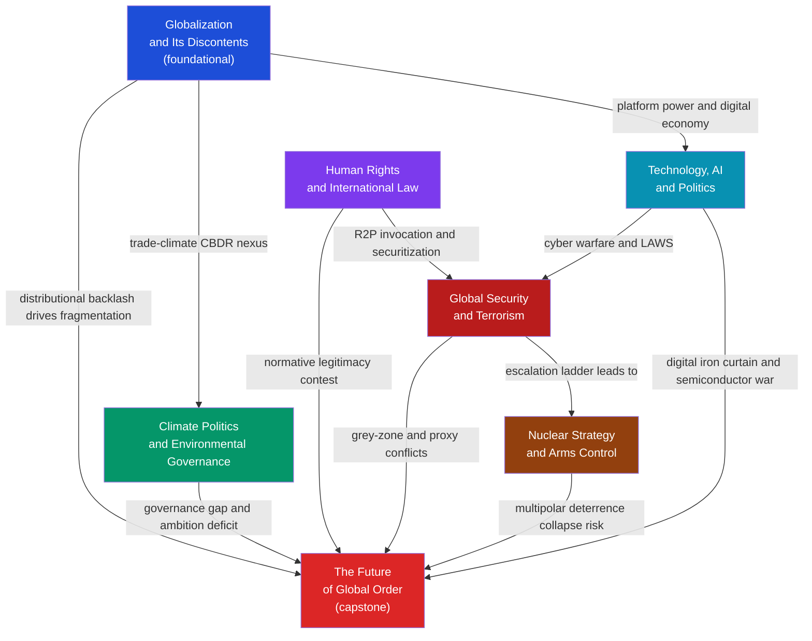

# Contemporary Global Issues — Map of Content

> [!info] How to use this map
> This is the capstone section of the Political Science vault. Start with **Globalization**, follow the arrows through collective action, norms, security, deterrence, and technology, then finish with **The Future of Global Order** as the synthesizing note. Each node links to a full note. Return to this map when navigating between themes.

---

## Overview

Contemporary Global Issues applies the theoretical architecture of earlier sections — IR theory, comparative politics, political economy, and democratic behavior — to the five most consequential problem clusters facing the international system today: distributional conflict from economic integration, climate change as a collective action failure, the sovereignty-rights tension in international law, the strategic logic of terrorism and nuclear deterrence, and the political reshaping of power by artificial intelligence. Together these notes trace the structural stresses bearing down on the post-1945 liberal international order and examine the four scenarios — new bipolarity, concert of powers, fragmented disorder, or Chinese hegemony — that could define the 2050 world. The section is deliberately integrative: every note cross-links to game theory, macroeconomics, the natural sciences, and AI/ML to show that these political problems cannot be understood inside a single disciplinary silo.

---

## Concept Map

*(Blue = foundational entry point, Red = advanced synthesizing capstone; arrows show conceptual dependencies and thematic linkages)*

---

## Learning Path

*Recommended order for a first pass through this section:*

1. [[Globalization_and_Its_Discontents]] — begin here; establishes the economic substrate of all contemporary global tensions — Rodrik's trilemma, Stolper-Samuelson distributional effects, Milanovic's elephant chart, and the slowbalization shift that reframes every subsequent note
2. [[Climate_Politics_and_Environmental_Governance]] — deepens the collective action logic; Hardin's tragedy of the commons scales from the local to the planetary; the Kyoto-to-Paris shift illustrates how institutional design trade-offs between universality and binding force play out in practice
3. [[Human_Rights_and_International_Law]] — adds the normative architecture; introduces R2P, the ICC, treaty-body shaming, and the spiral model, all operating against the Westphalian non-interference norm — the tension that runs through every subsequent security debate
4. [[Global_Security_and_Terrorism]] — transitions to threat actors; Kydd-Walter's five strategic logics, Copenhagen School securitization theory, COIN doctrine, and hybrid warfare give the toolkit for understanding asymmetric violence
5. [[Nuclear_Strategy_and_Arms_Control]] — sharpens strategic logic to its existential edge; deterrence theory from Brodie to Schelling, Intriligator-Brito stability conditions, and the collapse of the SALT-START regime frame the most dangerous dimension of great-power competition
6. [[Technology_AI_and_Politics]] — the cutting-edge cross-cutting layer; surveillance capitalism, digital authoritarianism, the EU AI Act, the US-China semiconductor war, and the autonomous-weapons responsibility gap show how AI is restructuring every prior domain
7. [[The_Future_of_Global_Order]] — synthesizing capstone; power transition theory, the Kindleberger-Thucydides compound risk, BRI counter-positioning, and four 2050 scenarios draw every thread into a forward-looking framework for understanding where the international system is heading

---

## All Notes in This Section

| Note | Core Idea | Difficulty |
|------|-----------|------------|
| [[Globalization_and_Its_Discontents]] | Deepening economic integration produces aggregate gains and skewed distributional losers; Rodrik's trilemma shows that deep integration, sovereignty, and mass democracy cannot coexist simultaneously | Intermediate |
| [[Climate_Politics_and_Environmental_Governance]] | Climate change is the canonical global collective action problem — 195 sovereign emitters, no world government, and a Paris Agreement that achieved universal participation by trading binding targets for voluntary nationally determined contributions | Intermediate |
| [[Human_Rights_and_International_Law]] | The international human rights system translates moral claims about dignity into treaties and advocacy networks — creating a permanent tension with Westphalian sovereignty that the R2P doctrine attempts, imperfectly, to resolve | Intermediate |
| [[Global_Security_and_Terrorism]] | Terrorism is a rational asymmetric tactic with five distinct strategic logics; the Copenhagen School shows security is a social construction — and hard counterterrorism responses can serve a provocation strategy's goals | Advanced |
| [[Nuclear_Strategy_and_Arms_Control]] | MAD stability requires both sides' second-strike forces to survive a first strike; the entire SALT-START arms-control sequence was designed to maintain this equilibrium, which the multipolar 2020s are now eroding | Advanced |
| [[Technology_AI_and_Politics]] | AI and surveillance capitalism restructure political power at scale — enabling digital authoritarianism, polarizing democracies through algorithmic amplification, and transforming semiconductor supply chains into geopolitical chokepoints | Advanced |
| [[The_Future_of_Global_Order]] | The post-1945 liberal international order faces simultaneous stress from US-China power transition, multilateral institutional arthritis, and digital bifurcation; the 2050 outcome is one of four scenarios from concert of powers to fragmented disorder | Advanced |

---

## Key Questions This Section Answers

- Why have decades of unprecedented economic interdependence produced nationalist backlash rather than cosmopolitan solidarity, and what does Rodrik's trilemma predict about its structural limits?
- Why does the Paris Agreement lack binding enforcement mechanisms, and can iterative voluntary pledges ever close a 43-percent emissions gap on a ten-year timeline?
- What structural features of the international system prevent enforcement of human rights law, and under what conditions do naming-and-shaming campaigns actually change repressive state behavior?
- What is the strategic logic of terrorism, and why do military-heavy counterterrorism responses so often feed the provocation cycle they aim to defeat?
- Why does stable nuclear deterrence require mutual vulnerability rather than dominant capability, and how does ballistic missile defense paradoxically destabilize rather than protect?
- How does AI surveillance reduce the cost of authoritarian rule, and what regulatory architectures — EU mandatory versus US voluntary — are best equipped to govern dual-use AI capabilities?
- Is the post-1945 liberal international order experiencing manageable evolution or structural collapse, and which domestic and institutional variables determine whether the transition produces a concert of powers or fragmented disorder?

---

## Connections to Other Political Science Sections

- [[_MOC_Political_Theory_and_Ideologies|Section 01 — Political Theory and Ideologies MOC]] — the ideological foundations that map onto positions within each global issue: liberal cosmopolitanism underwrites the human rights project; communitarian and nationalist thought explains the globalization backlash; realism anchors nuclear deterrence logic
- [[_MOC_Comparative_Politics|Section 02 — Comparative Politics MOC]] — regime type is the most consistent predictor of climate ambition, treaty compliance, counterterrorism approach, and vulnerability to digital authoritarianism; the authoritarian-hybrid-democratic spectrum runs through every note in this section
- [[_MOC_International_Relations|Section 03 — International Relations MOC]] — the theoretical bedrock: hegemonic stability theory, neoliberal institutionalism, constructivist norm diffusion, and power transition theory are all applied directly in this section; S03 is the prerequisite theory layer
- [[_MOC_Public_Policy_and_Political_Economy|Section 04 — Public Policy and Political Economy MOC]] — policy instrument design (carbon taxes vs. cap-and-trade, tariffs vs. subsidies, mandatory vs. voluntary AI regulation) and the political economy of regulatory capture connect S04 directly to the governance debates in every S06 note
- [[_MOC_Political_Behavior_and_Democracy|Section 05 — Political Behavior and Democracy MOC]] — democratic backsliding, polarization, and algorithmic manipulation of information environments are the domestic political conditions that constrain every international commitment examined in S06

---

## Cross-Vault Connections

- [[_MOC_Game_Theory_Master|Game Theory vault]] — Nash equilibrium in the public-bad emissions game underpins the Python demo in Climate Politics; minimax counterterrorism resource allocation formalizes the balloon problem in Global Security; Schelling's brinkmanship and subgame-perfect equilibrium problems are the game-theoretic core of Nuclear Strategy
- [[_MOC_Macroeconomics_Master|Macroeconomics vault]] — Stolper-Samuelson factor-price effects and the Mundell-Fleming impossible trinity are the macroeconomic expressions of Globalization's distributional politics; balance of payments dynamics and exchange rate regimes are the monetary substrate of the global order transition in Future of Global Order
- [[_MOC_Meteorology_Master|Meteorology and Climatology vault]] — the physical climate science — IPCC AR6 carbon budgets, SSP warming trajectories, tipping points, and extreme weather attribution — provides the factual urgency that makes Climate Politics a governance emergency rather than a routine coordination problem
- [[_MOC_AI_ML_Master|AI-ML vault]] — the technical foundations of the systems at the center of Technology, AI, and Politics: transformer architectures, computer vision for surveillance, reinforcement learning for autonomous systems, and the frontier-model ecosystem whose governance the EU AI Act attempts to regulate

---

[[_MOC_Political_Science_Master|↑ Political Science MOC]]

#PoliticalScience #GlobalIssues #MOC #Contemporary
