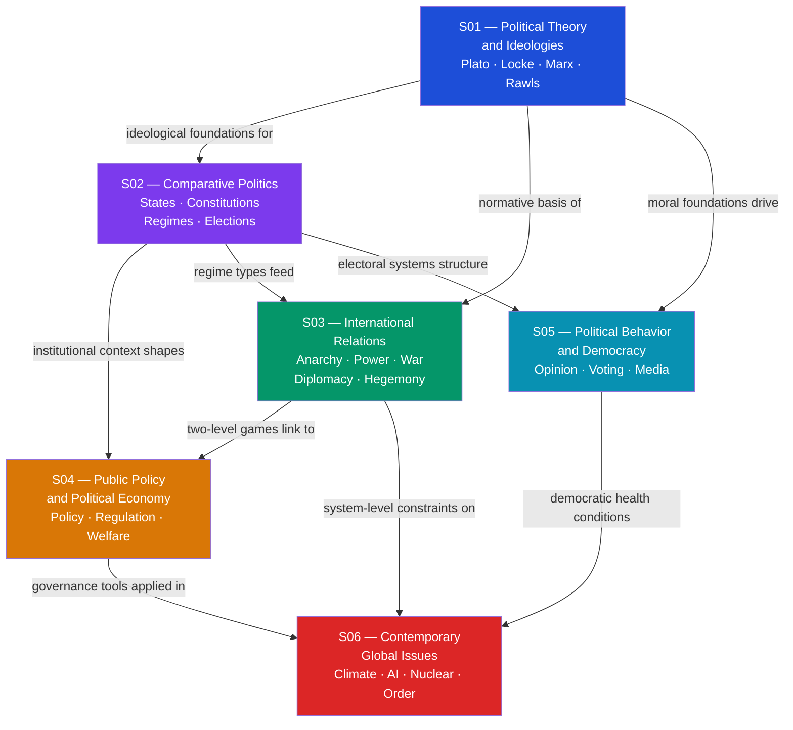

# Political Science & Geopolitics — Master MOC

> [!tip] Start Here — New to This Vault?
> If you are coming to political science for the first time, begin with **[[Classical_Political_Philosophy]]** to ground yourself in the foundational vocabulary of justice, constitutional forms, and power. Then read **[[Social_Contract_Theory]]** to understand how modern authority is justified through consent and natural rights. From there choose a learning track below — Theory, Comparative, or Policy. If you already have a strong economics background, jump to **[[_MOC_Public_Policy_and_Political_Economy|S04 Public Policy]]** and follow its cross-vault links backward into theory. Each section MOC is a detailed map within its own area; this file is the map of maps.

---

## What Is Political Science and Why Does It Matter for a Polymath?

Political science is the systematic study of power — how it is acquired, organized, legitimated, contested, and exercised across human collectives from city-states to global institutions. It sits at the intersection of every other domain in a polymath's toolkit: it draws on game theory to model strategic interaction under anarchy, psychology to understand how citizens form beliefs and act under information asymmetry, economics to analyze policy trade-offs and distributional conflict, history to test grand theories against the empirical record, and the natural sciences to understand how climate, geography, and technology reshape the material constraints within which politics operates. For a polymath, political science is the connective tissue that explains *why* societies make the collective choices they do — why some states build inclusive institutions while others extract wealth for narrow elites, why democracies sometimes degenerate into authoritarian regimes, why nuclear-armed states have not gone to war since 1945, and whether the post-1945 liberal international order will survive the rise of China and the digital revolution. No domain of human endeavor — from individual business decisions to civilizational direction — can be fully understood without a working theory of how political power is constituted and exercised.

---

## Section Map

*(Blue = Political Theory — foundational concepts and vocabulary; Purple = Comparative Politics — institutional architecture; Green = International Relations — inter-state dynamics; Amber = Public Policy — governance and political economy; Cyan = Political Behavior — citizens and democracy; Red = Contemporary Global Issues — applied synthesis and forward-looking scenarios. Arrows show "provides concepts for" or "constrains".)*

---

## Master Learning Tracks

### Track 1 — Political Theory Track
*For readers who want to understand the ideological and normative foundations of politics before examining empirical or applied dimensions.*

1. [[Classical_Political_Philosophy]] — the foundational vocabulary: justice, constitutional forms, natural law, anacyclosis, and the ancient roots that every modern tradition claims
2. [[Social_Contract_Theory]] — the modern basis for legitimate authority; Hobbes, Locke, Rousseau, and Rawls answer the question of when and why we owe obedience to the state
3. [[Liberalism_and_Its_Variants]] — the dominant post-Enlightenment ideological tradition, from negative liberty through social liberalism to neoliberalism
4. [[Conservatism_and_Traditionalism]] — Burke, Oakeshott, and Scruton: the epistemological case for institutional caution and Chesterton's Fence
5. [[Socialism_Marxism_and_Communism]] — the radical critique of liberal political economy: historical materialism, class struggle, surplus value, Gramsci's hegemony
6. [[Contemporary_Political_Ideologies]] — the full 2D ideological landscape: populism, nationalism, fascism, Green politics, and techno-futurism placed on the compass
7. [[Political_Psychology_and_Ideology]] — the empirical micro-foundations of ideology: personality, moral foundations, motivated reasoning, and why evidence rarely changes political minds
8. [[Democratic_Backsliding_and_Polarization]] — what happens to liberal democracy when affective polarization destroys mutual toleration and forbearance
9. [[The_Future_of_Global_Order]] — ideology and power intersecting in the post-liberal international order: four scenarios for the 2050 world

---

### Track 2 — Comparative Track
*For readers who want to understand how different political systems are built, differ from one another, and interact at the global level.*

1. [[Social_Contract_Theory]] — the normative baseline: all comparative judgments about regime quality trace back to some theory of legitimate authority
2. [[State_Formation_and_Political_Development]] — how states emerge, acquire coercive and extractive capacity, and why institutional legacies diverge so sharply
3. [[Political_Institutions_and_Constitutions]] — constitutional architecture: separation of powers, veto player theory, and the credible commitment problem every constitutional designer must solve
4. [[Authoritarianism_and_Hybrid_Regimes]] — the non-democratic majority of world states: competitive authoritarianism, selectorate theory, and the mechanics of autocratic survival
5. [[Democracy_Types_and_Electoral_Systems]] — the institutional mechanics that distinguish democratic quality: Duverger's Law, Lijphart's consensus vs. majoritarian model, Arrow's impossibility
6. [[International_Relations_Theories]] — how regime type interacts with the international system: democratic peace theory and the comparative determinants of foreign policy
7. [[Global_Order_and_Hegemony]] — how the international order sustains or disrupts domestic regime trajectories: hegemonic stability, the Liberal International Order, and revisionist challengers
8. [[Globalization_and_Its_Discontents]] — how economic integration reshapes comparative political outcomes: distributional losers, Rodrik's trilemma, and the populist backlash
9. [[The_Future_of_Global_Order]] — four scenarios for the 2050 comparative political landscape under US-China power transition

---

### Track 3 — Policy Track
*For readers who want to understand what governments do, why they make the choices they do, and how international pressure shapes domestic governance.*

1. [[State_Formation_and_Political_Development]] — state capacity as the foundational precondition for effective policy: why some states can run developmental industrial policy and others cannot
2. [[Federalism_and_Decentralization]] — which tier of government does what and why: fiscal federalism, Tiebout competition, and the constitutional distribution of policy authority
3. [[Policy_Analysis_and_the_Policy_Process]] — how problems become laws and why implementation fails: Kingdon's multiple streams, the garbage-can model, and rigorous causal evaluation
4. [[Political_Economy_and_Market_State_Relations]] — varieties of capitalism and distributional politics: why the same economic conditions produce radically different policy regimes across countries
5. [[Public_Finance_and_Fiscal_Policy]] — the fiscal instruments of governance: Musgrave's three functions, optimal taxation, debt sustainability, and political budget cycles
6. [[Regulatory_Politics_and_Administrative_Law]] — how governments regulate markets — and why regulatory capture is the normal outcome without carefully designed institutional insulation
7. [[Welfare_States_and_Social_Policy]] — Esping-Andersen's three regime types and why mature welfare states are politically nearly impossible to dismantle
8. [[Development_Economics_and_Political_Development]] — why nations diverge: inclusive institutions, the capability approach, the aid effectiveness debate, and Rodrik's trilemma
9. [[Globalization_and_Its_Discontents]] — globalization as the binding external constraint on domestic policy autonomy: the race to the bottom and the post-Washington Consensus
10. [[Climate_Politics_and_Environmental_Governance]] — the hardest collective action problem in policy history: carbon pricing, treaty design, and the 43-percent ambition gap

---

## Section Index

### S01 — Political Theory and Ideologies
**[[_MOC_Political_Theory_and_Ideologies|Section 01 MOC — Political Theory and Ideologies]]**

The intellectual lineage from ancient Greece to the 21st century: the foundational vocabulary of justice, authority, and the state, and the great ideological families — liberalism, conservatism, socialism — that have organized modern political competition.

- [[Classical_Political_Philosophy]] — Plato, Aristotle, Cicero, and Thucydides: justice, constitutional forms, natural law, and the anacyclosis cycle of regime change
- [[Social_Contract_Theory]] — Hobbes, Locke, Rousseau, and Rawls: legitimate authority grounded in consent, the state of nature, and the veil of ignorance
- [[Liberalism_and_Its_Variants]] — negative vs. positive liberty, classical liberalism through neoliberalism, and Rawlsian social liberalism
- [[Conservatism_and_Traditionalism]] — Burke, Oakeshott, and Scruton: Chesterton's Fence and the epistemological case for institutional caution over rationalist reform
- [[Socialism_Marxism_and_Communism]] — historical materialism, class struggle, surplus value extraction, Leninist vanguard theory, and Gramsci's hegemony
- [[Contemporary_Political_Ideologies]] — the 2D political compass, populism, nationalism, fascism, Green politics, and techno-futurism as 21st-century ideological formations

---

### S02 — Comparative Politics
**[[_MOC_Comparative_Politics|Section 02 MOC — Comparative Politics]]**

How political systems are built, organized, and sustained — or how they break down: state formation, constitutional design, federal architecture, regime variation from democracy to authoritarianism, party competition, and electoral mechanics.

- [[State_Formation_and_Political_Development]] — Weber's monopoly on violence, Tilly's war-makes-states thesis, inclusive vs. extractive institutions, Fukuyama's political order trilemma
- [[Political_Institutions_and_Constitutions]] — constitutions as credible commitment devices, separation of powers, veto player theory, and gradual institutional change
- [[Federalism_and_Decentralization]] — constitutional division of authority across tiers, fiscal federalism, Tiebout sorting, and market-preserving federalism
- [[Authoritarianism_and_Hybrid_Regimes]] — regime spectrum from democracy to totalitarianism, competitive authoritarianism, selectorate theory, and democratic backsliding typology
- [[Political_Parties_and_Party_Systems]] — cleavage theory, party organizational evolution from cadre to cartel parties, Sartori's system typology, and spatial voting models
- [[Democracy_Types_and_Electoral_Systems]] — electoral system families, Duverger's Law, Lijphart's consensus vs. majoritarian democracy, and Arrow's impossibility theorem

---

### S03 — International Relations
**[[_MOC_International_Relations|Section 03 MOC — International Relations]]**

The systematic study of how sovereign states interact under anarchy: the theoretical lenses of realism, liberalism, and constructivism; the mechanics of power, war, diplomacy, and international institutions; and how hegemonic orders are built, maintained, and eventually overturned.

- [[International_Relations_Theories]] — realism, liberalism, constructivism, and the English School: competing paradigms explaining cooperation and conflict under structural anarchy
- [[The_State_System_and_Sovereignty]] — Westphalia 1648, the UN Charter framework, R2P, and the mounting normative pressure on the sovereignty norm
- [[Geopolitics_and_Power_Politics]] — heartland, rimland, power transition theory, and the Thucydides Trap as the most dangerous inflection point in international politics
- [[War_Conflict_and_Security]] — Fearon's bargaining model, the security dilemma, deterrence theory, and why rational states still fight costly wars
- [[International_Institutions_and_Multilateralism]] — international regimes, IGOs, Keohane's neoliberal institutionalism, and cooperation after hegemonic decline
- [[Diplomacy_and_Foreign_Policy]] — Allison's three models of foreign policy, Putnam's two-level game, coercive diplomacy, sanctions, and soft power
- [[Global_Order_and_Hegemony]] — hegemonic stability theory, the Liberal International Order, the Kindleberger Trap, and the logic of the US-China power transition

---

### S04 — Public Policy and Political Economy
**[[_MOC_Public_Policy_and_Political_Economy|Section 04 MOC — Public Policy and Political Economy]]**

What governments actually do with their authority — the fiscal, regulatory, and social choices that redistribute income, correct market failures, build welfare states, and attempt to guide development — spanning from agenda-setting through implementation to the grand challenge of political development.

- [[Policy_Analysis_and_the_Policy_Process]] — Kingdon's multiple streams, punctuated equilibrium, the garbage-can model, implementation gaps, and rigorous causal policy evaluation
- [[Political_Economy_and_Market_State_Relations]] — varieties of capitalism (LME vs. CME vs. developmental state), Olson's distributional coalitions, and Piketty's r > g inequality dynamics
- [[Public_Finance_and_Fiscal_Policy]] — Musgrave's three functions, optimal taxation (Ramsey and Mirrlees), debt dynamics, and political budget cycles
- [[Regulatory_Politics_and_Administrative_Law]] — Stigler's capture theory, the principal-agent problem in regulation, nudge units, and the Chevron doctrine
- [[Welfare_States_and_Social_Policy]] — Esping-Andersen's three worlds, decommodification, power resources theory, and the politics of welfare retrenchment
- [[Development_Economics_and_Political_Development]] — Acemoglu-Robinson's institutions framework, Sen's capability approach, the aid effectiveness debate, and Rodrik's policy trilemma

---

### S05 — Political Behavior and Democracy
**[[_MOC_Political_Behavior_and_Democracy|Section 05 MOC — Political Behavior and Democracy]]**

The empirical core of political science — how citizens form political identities, decide whether and how to participate, process political information through a shaped media environment, and collectively sustain or erode democratic institutions.

- [[Public_Opinion_and_Political_Socialization]] — Zaller's RAS model, partisan predispositions installed by family and school, and elite consensus vs. elite conflict effects on mass opinion
- [[Political_Psychology_and_Ideology]] — personality traits, threat sensitivity, Haidt's moral foundations, motivated reasoning, and identity-protective cognition
- [[Voting_Behavior_and_Electoral_Psychology]] — the Michigan model's funnel of causality, retrospective voting, spatial models, and the calculus of voting resolving the turnout paradox
- [[Political_Participation_and_Civil_Society]] — Olson's collective action logic, Putnam's social capital, Ostrom's institutional design, and social movement theory
- [[Media_Propaganda_and_Political_Communication]] — agenda-setting, framing, priming, computational propaganda, algorithmic amplification, and inoculation theory
- [[Democratic_Backsliding_and_Polarization]] — executive aggrandizement, affective polarization, Levitsky-Ziblatt guardrails (mutual toleration and forbearance), and V-Dem indices

---

### S06 — Contemporary Global Issues
**[[_MOC_Contemporary_Global_Issues|Section 06 MOC — Contemporary Global Issues]]**

The capstone section: the five most consequential problem clusters facing the international system today — economic integration, climate change, human rights, security and deterrence, and the politics of AI — synthesized through a forward-looking analysis of where global order is heading by 2050.

- [[Globalization_and_Its_Discontents]] — Rodrik's trilemma, Stolper-Samuelson distributional effects, Milanovic's elephant chart, and the slowbalization shift
- [[Climate_Politics_and_Environmental_Governance]] — tragedy of the commons at planetary scale, the Kyoto-to-Paris institutional evolution, CBAM, and the 43-percent ambition gap
- [[Human_Rights_and_International_Law]] — R2P, the ICC, treaty-body shaming, the spiral model, and the permanent tension between sovereignty and human rights
- [[Global_Security_and_Terrorism]] — Kydd-Walter's five strategic logics, Copenhagen School securitization theory, COIN doctrine, and hybrid warfare
- [[Nuclear_Strategy_and_Arms_Control]] — MAD stability conditions, Schelling's brinkmanship, Intriligator-Brito stability, and the collapse of the SALT-START arms control regime
- [[Technology_AI_and_Politics]] — surveillance capitalism, digital authoritarianism, the EU AI Act, the US-China semiconductor war, and autonomous weapons responsibility gaps
- [[The_Future_of_Global_Order]] — power transition theory, the Kindleberger-Thucydides compound risk, and four 2050 scenarios from concert of powers to fragmented disorder

---

## Four Analytical Lenses

### Lens 1 — Understanding Democracy
*How is democratic government created, sustained, and threatened?*

| Step | Note | What You Learn |
|------|------|----------------|
| 1 | [[Social_Contract_Theory]] | The philosophical basis for democratic legitimacy: consent, rights, Rousseau's general will, Rawls' veil of ignorance |
| 2 | [[Democracy_Types_and_Electoral_Systems]] | The institutional mechanics: how electoral rules shape representation, coalitions, and government quality |
| 3 | [[Political_Psychology_and_Ideology]] | Why citizens hold the ideological positions they do: personality, moral foundations, and motivated reasoning |
| 4 | [[Voting_Behavior_and_Electoral_Psychology]] | How psychological predispositions translate into stable electoral alignments and bounded deviations |
| 5 | [[Media_Propaganda_and_Political_Communication]] | The information environment that mediates all democratic participation, including computational propaganda |
| 6 | [[Authoritarianism_and_Hybrid_Regimes]] | What democracy is contrasted against: the autocratic alternatives and the grey zone of competitive authoritarianism |
| 7 | [[Democratic_Backsliding_and_Polarization]] | How 21st-century democracies die — incrementally, legally, from within — when guardrails erode |

---

### Lens 2 — International Order
*How do states build, sustain, and transform global order?*

| Step | Note | What You Learn |
|------|------|----------------|
| 1 | [[International_Relations_Theories]] | The three paradigms — realism, liberalism, constructivism — that frame every IR debate |
| 2 | [[The_State_System_and_Sovereignty]] | The Westphalian foundation and the normative challenges now pressing against it |
| 3 | [[Geopolitics_and_Power_Politics]] | How geography and differential growth rates drive strategic competition between great powers |
| 4 | [[War_Conflict_and_Security]] | Why rational states still go to war: private information, commitment problems, and indivisibility |
| 5 | [[International_Institutions_and_Multilateralism]] | The liberal answer to anarchy: how regimes sustain cooperation without a world government |
| 6 | [[Global_Order_and_Hegemony]] | How hegemonic orders are built and maintained, and the dual risks of the Thucydides and Kindleberger traps |
| 7 | [[The_Future_of_Global_Order]] | Four scenarios for the 2050 international system under the current US-China power transition |

---

### Lens 3 — Policy and Governance
*How do governments decide, finance, and deliver public outcomes?*

| Step | Note | What You Learn |
|------|------|----------------|
| 1 | [[State_Formation_and_Political_Development]] | Why some states have the bureaucratic capacity to govern effectively and others do not |
| 2 | [[Policy_Analysis_and_the_Policy_Process]] | How problems become policies and why implementation fails far more often than design would predict |
| 3 | [[Political_Economy_and_Market_State_Relations]] | Why the same economic conditions produce radically different policy regimes across countries |
| 4 | [[Public_Finance_and_Fiscal_Policy]] | The fiscal instruments of governance: taxation, spending, debt sustainability, and political business cycles |
| 5 | [[Regulatory_Politics_and_Administrative_Law]] | How governments regulate markets and why capture by regulated industries is the systematic default |
| 6 | [[Welfare_States_and_Social_Policy]] | The three welfare regime types and why even conservative governments cannot dismantle mature welfare states |
| 7 | [[Climate_Politics_and_Environmental_Governance]] | Carbon pricing, treaty design, and why the largest collective-action problem in history resists standard policy tools |

---

### Lens 4 — Political Behavior
*How do citizens form views, engage politically, and reshape the systems they inhabit?*

| Step | Note | What You Learn |
|------|------|----------------|
| 1 | [[Public_Opinion_and_Political_Socialization]] | How political predispositions are installed in childhood and reinforced or destabilized across the life course |
| 2 | [[Political_Psychology_and_Ideology]] | The personality, moral, and cognitive roots of political beliefs and resistance to disconfirming evidence |
| 3 | [[Voting_Behavior_and_Electoral_Psychology]] | The translation of psychology into electoral behavior: party identification, retrospective voting, and strategic calculation |
| 4 | [[Political_Participation_and_Civil_Society]] | Why some citizens engage far beyond the ballot: social capital, social movements, and civic organization |
| 5 | [[Media_Propaganda_and_Political_Communication]] | How the information environment amplifies partisan identity and enables manipulation at computational scale |
| 6 | [[Globalization_and_Its_Discontents]] | Why economic losers from globalization turned to populism and nationalism as their political response |
| 7 | [[Technology_AI_and_Politics]] | How algorithmic amplification and digital surveillance are restructuring political behavior and authoritarian control |

---

## Cross-Vault Connections

| Vault | Key Connection to This Topic |
|-------|------------------------------|
| [[_MOC_Game_Theory_Master\|Game Theory]] | Formal micro-foundations throughout: Nash equilibria model the security dilemma and arms races; the Folk Theorem formalises how institutions sustain cooperation under anarchy; Fearon's crisis bargaining is a signalling game; Schelling's brinkmanship is a subgame-perfect commitment problem; electoral strategic voting is a coordination game |
| [[_MOC_Psychology_Master\|Psychology]] | Political behavior is applied social and cognitive psychology: Haidt's moral foundations explain ideological sorting; Zaller's RAS model applies the Elaboration Likelihood Model to opinion dynamics; Tajfel's Social Identity Theory explains partisan polarization; Milgram's obedience experiments illuminate authoritarian compliance; Kahneman's biases explain propaganda susceptibility and policy framing |
| [[_MOC_Macroeconomics_Master\|Macroeconomics]] | The economic substrate of political power: Solow catch-up growth drives power transitions; the Triffin Dilemma and Mundell-Fleming impossible trinity explain dollar hegemony; Keynesian multipliers are the fiscal basis of social liberalism; Stolper-Samuelson factor-price effects explain globalization's distributional losers and their political mobilization |
| [[_MOC_Microeconomics_Master\|Microeconomics]] | Market failures — public goods, externalities, asymmetric information, and market power — provide the welfare-economics justification for every major policy instrument in S04; optimal taxation (Ramsey and Mirrlees), Pigouvian taxes, and cost-benefit analysis are microeconomic tools applied throughout; the Tiebout model of local public goods allocation is central to federalism |
| [[_MOC_Econometrics_Master\|Econometrics]] | Causal policy evaluation is built on econometric identification: DiD (Card-Krueger on minimum wages), RDD (Medicare eligibility thresholds), and RCTs (J-PAL development interventions) are the methodological foundations of the evidence-based policy movement; electoral studies and the comparative politics of institutions increasingly rely on these causal inference methods |
| [[_MOC_AI_ML_Master\|AI-ML]] | NLP methods enable large-scale political media analysis — automated frame detection, fake news classification, stance detection, and coordinated inauthentic behavior identification in social media corpora; transformer architectures, computer vision, and reinforcement learning power the surveillance systems, autonomous weapons, and frontier AI governance challenges analyzed in S06 |
| [[_MOC_Cybersecurity_Master\|Cybersecurity]] | Cyber warfare, election interference, critical infrastructure attacks, and the governance of dual-use technologies connect directly to S03 (war and security) and S06 (technology and politics); understanding the offensive-defensive balance in cyberspace and attribution problems is prerequisite to evaluating the legal and strategic frameworks discussed in both sections |
| [[_MOC_Meteorology_Master\|Meteorology and Climatology]] | The physical climate science — IPCC AR6 carbon budgets, SSP warming trajectories, tipping points, extreme weather event attribution, and the carbon cycle dynamics — provides the factual urgency that makes S06 Climate Politics a governance emergency rather than a routine coordination problem; the science vault is the necessary prerequisite for evaluating whether NDC pledges are physically meaningful |

---

## Key Questions This Vault Answers

- What makes political authority legitimate, and when — if ever — is resistance to it justified?
- Why do some states build inclusive, capable institutions while others remain locked in extractive arrangements across generations?
- Under what conditions do rational states go to war, and what must fail for bargaining to break down before a deal can be reached?
- How does the liberal international order sustain cooperation among sovereign states with competing interests — and how fragile is that order under power transition?
- Why do democratic citizens routinely vote against their material interests, and what cognitive and social mechanisms explain stable partisan loyalty?
- Can climate change — the quintessential planetary collective-action problem with 195 sovereign emitters and no world government — be solved within the current international system?
- How is artificial intelligence restructuring the domestic and international distribution of political power, and what regulatory architectures can govern dual-use AI capabilities?
- Is the post-1945 liberal international order experiencing manageable adaptation or structural collapse — and which domestic and institutional variables determine the outcome?

---

#PoliticalScience #MOC #MasterIndex #Geopolitics
