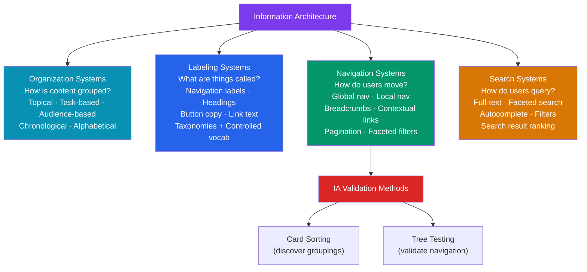

# Information Architecture

> [!abstract] TL;DR
> **Information Architecture (IA)** is the discipline of organizing, structuring, and labeling content so users can find what they need. It is built from four components: organization systems (how content is grouped), labeling systems (what things are called), navigation systems (how users move through content), and search systems (how users query content). Core IA methods: **card sorting** (discover user mental models for grouping) and **tree testing** (validate navigation structure by asking users to find items). Navigation patterns (tabs, hamburger menus, tab bars) each have measurable usability trade-offs.

## Intuition — analogy FIRST

Information Architecture is like designing a library. A library with no system (books randomly shelved) is useless even if it contains every book ever written. A well-organized library (Dewey Decimal system, genre sections, good signage) lets visitors find books quickly even if they've never visited before.

The Dewey Decimal system is the organization scheme. "Fiction," "Non-Fiction," "Biography" are the labels. The catalog and floor signs are the navigation. The library's search terminal is the search system. IA is all four working together.

For digital products: users come with mental models of where things "should" be. Your IA succeeds when it matches those mental models.

---

## How It Works



---

## Key Concepts / Details

### IA Components

```
1. ORGANIZATION SYSTEMS — how content is classified and grouped

  By topic: Software → Web Development → React → Hooks
  By task: "Get Started" / "Manage Account" / "Troubleshoot"
  By audience: "For Developers" / "For Designers" / "For Admins"
  By time: chronological (news feed, changelog)
  Alphabetical: reference content (glossary, API docs)
  Polyhierarchical: content belongs to multiple categories simultaneously
    (a recipe can be in "Quick Meals" AND "Italian" AND "Vegetarian")

2. LABELING SYSTEMS — the language used throughout

  Navigation labels: "Pricing" vs "Plans" vs "Packages"
  Action labels: "Delete" vs "Remove" vs "Archive"
  Content labels: "Help Center" vs "Support" vs "Knowledge Base"
  
  Rules:
    - Match users' vocabulary (discovered via interviews + card sorting)
    - Be specific over clever ("Upgrade Plan" > "Level Up")
    - Consistent: if it's "Settings" in the nav, it's "Settings" in breadcrumbs
    - Avoid jargon: internal product names users don't know

3. NAVIGATION SYSTEMS — how users traverse the structure

  Global navigation: persistent, site-wide (top nav / left sidebar)
  Local navigation: section-specific (docs sidebar, settings sub-menu)
  Contextual navigation: in-line links to related content (Related Articles)
  Supplemental navigation: additional pathways (sitemap, footer links, breadcrumbs)

4. SEARCH SYSTEMS
  Full-text search: find any document containing the query words
  Faceted search: filter by multiple attributes simultaneously
    (e-commerce: filter by color + size + price + brand)
  Autocomplete: suggest completions as user types
  Search within: scope search to a section (search only within "Docs")
```

### Mental Models and Findability

```
Mental model: the internal representation a user has of how a system works.
Users navigate based on THEIR mental model, not your IA.

When IA doesn't match mental models:
  - Users look in the "wrong" section first (which feels wrong to them, not you)
  - Users use search to compensate for confusing navigation
  - Users give up before finding content they need

Example: Users look for "Billing" under "Account Settings" not "Admin."
  The IA put billing under "Admin." Both are logical; only one matches mental models.
  Card sorting would have revealed this.

Principle of least astonishment:
  Things should be where users expect them. Surprises are errors in IA.
```

### Card Sorting

```
PURPOSE: discover how users mentally group content items

OPEN CARD SORT:
  Participants are given cards (each with a topic/item) and asked to:
    1. Group cards in any way that makes sense to them
    2. Name each group they create
  Output: reveals natural groupings and user vocabulary for those groups

CLOSED CARD SORT:
  Categories are predefined; participants sort cards into those categories
  Purpose: validate whether content fits your proposed IA
  Output: confusion matrix showing which items users misplace

HOW TO RUN:
  1. Write one card per piece of content (15-50 cards is typical)
  2. Recruit 15-30 participants (diminishing returns after ~20 for open sort)
  3. Run online via OptimalSort, UXMetrics, or Maze
  4. Analyze: similarity matrix (% of participants who grouped A+B together)
     Dendogram: hierarchical clustering of groupings

ANALYSIS:
  Items grouped together by 70%+ of users → strong signal, put them together
  Items with no consistent home → label/grouping problem, or item is ambiguous
  User-created category names → adopt this vocabulary in your actual labels

Tool: OptimalSort (Optimal Workshop) — free for <10 participants
```

### Tree Testing

```
PURPOSE: validate that users can find content within a proposed navigation structure

METHOD:
  1. Build a text-only tree of your navigation (no visual design — just hierarchy)
  2. Write tasks: "Where would you go to update your payment method?"
  3. Participants click through the text tree to find where they'd look
  4. Measure: directness (did they go straight to the right place?), success rate

Metrics:
  Task success rate: % who found the correct destination
  Directness: % who took a direct path (vs. backtracking)
  First-click accuracy: where did users click first?

What tree testing reveals:
  - Navigation labels that are misunderstood
  - Categories with too much or too little content
  - Items that users expect in a different location
  - Whether a section label matches its contents

Tool: Treejack (Optimal Workshop), UXMetrics, Maze

Tree testing vs card sorting:
  Card sort → what IA to build (generative)
  Tree test → whether the IA you built works (evaluative)
  Run in sequence: card sort → design IA → tree test → iterate
```

### Navigation Patterns

```
WEB NAVIGATION PATTERNS:

Top navigation bar (horizontal)
  Best for: 5-8 top-level sections, desktop
  Pros: visible at all times, familiar
  Cons: limited items before overflow, poor for deep hierarchies

Left sidebar navigation
  Best for: complex apps with many sections (dashboards, docs, admin tools)
  Pros: shows full hierarchy, good for 20+ items, current position visible
  Cons: takes horizontal space, collapses to icon-only at smaller viewports

Tab navigation (sub-navigation)
  Best for: switching between 3-7 sibling views within a section
  Pros: shows all options, current tab clearly indicated
  Cons: doesn't scale past 7 items (overflow or truncation)

Breadcrumbs
  Shows current location in hierarchy: Home > Products > Electronics > Phones
  Required for: sites with 3+ levels of hierarchy, e-commerce
  Implementation: use structured data (schema.org BreadcrumbList) for SEO
  Not for: single-page apps without deep hierarchies

Faceted search / filters
  Allow filtering by multiple attributes simultaneously (Amazon sidebar)
  Best for: large catalogs with many dimensions (product type + price + brand + rating)
  Patterns: checkboxes for multi-select, range slider for price, clear-all button

MOBILE NAVIGATION PATTERNS:

Tab bar (bottom tabs — iOS pattern)
  Best for: 3-5 primary sections (Instagram, Twitter, TikTok)
  Pros: thumb-friendly, always visible, instant switching
  Cons: can't exceed 5 items; doesn't work for deep hierarchies

Hamburger menu
  Hides navigation behind a menu icon (☰)
  Trade-off research (NNG): hidden navigation reduces discoverability and engagement
  Rule: use hamburger only if the nav is secondary (not the primary way users navigate)
  Never hide primary actions behind a hamburger

Bottom sheet
  Slides up from bottom on mobile (replaces modal dialogs)
  Best for: contextual actions, filters, share sheets
  Gesture: swipe down to dismiss
```

### Sitemaps and Content Audits

```
SITEMAP:
  Visual representation of every page/screen and their hierarchy
  Used for: planning IA, communicating structure to stakeholders
  Format: tree diagram (Figma, FigJam, Whimsical)
  Include: page name, page type (hub/detail/utility), status (existing/new/deprecated)
  
  Example flat sitemap:
  Home
  ├── Products
  │   ├── Category page
  │   └── Product detail
  ├── Pricing
  ├── About
  │   ├── Team
  │   └── Careers
  ├── Help Center
  │   ├── Getting started
  │   └── FAQ
  └── Account
      ├── Profile
      ├── Billing
      └── Notifications

CONTENT AUDIT:
  Inventory of all existing content (page, URL, content type, owner, last updated)
  Used before: site redesigns, migrations, IA redesigns
  Dimensions: findability (can users find it?), freshness (is it up to date?),
              accuracy (is it correct?), alignment (does it serve user needs?)
  Output: keep / update / merge / delete / move recommendations per page
```

---

## Real-World Notes

- **Navigation is discovery infrastructure** — most users never use your search. The 80% who don't search will navigate your IA directly. Optimize IA before adding better search.
- **Labels matter more than structure** — research consistently shows wrong labels cause more failures than wrong groupings. If users don't understand what "Workspace" means, they won't click it even if the right content is inside.
- **Mobile IA ≠ desktop IA scaled down** — mobile navigation requires rethinking because: thumb zones differ, screen real estate is limited, and task priorities differ (mobile = task-focused; desktop = exploration).
- **OptimalSort free tier** allows up to 10 participants — sufficient for a quick sanity check of a new IA. Run 20 participants for production decisions.

---

## Common Pitfalls

- **Org-chart IA** — structuring navigation by internal team (Marketing / Engineering / Support) instead of user tasks. Users don't know or care how your company is organized.
- **Too deep hierarchy** — more than 3 levels of navigation creates "lost in the forest" syndrome. Flatten the hierarchy; use cross-links instead of deeper nesting.
- **Skipping validation** — designing IA in a team meeting without tree testing leads to shipping navigation that fails users. Test with 10 participants before committing to code.
- **Label inconsistency** — "Settings" in the top nav, "Preferences" in the help text, "Configuration" in the onboarding. Pick one word and use it everywhere.

---

## Related Concepts

- [[_MOC_Product_Design_Master|↑ Product Design Master MOC]]
- [[Product_Design_Overview]] — IA fits in the design thinking "Ideate" phase
- [[User_Research_Methods]] — Card sorting is a research method
- [[UX_Patterns]] — Navigation UI patterns that implement IA decisions

---

## Review Questions

1. What are the four components of Information Architecture? Give an example of each.
2. What is the difference between open and closed card sorting? When would you use each?
3. What is tree testing and how does it differ from card sorting?
4. What is the usability trade-off of hamburger menus on mobile? What is the alternative?
5. What is "org-chart IA" and why is it an anti-pattern?

---

## Sources

- Peter Morville & Louis Rosenfeld: Information Architecture (4th ed.)
- Optimal Workshop: Card sorting guide — https://www.optimalworkshop.com/learn/101s/card-sorting/
- Nielsen Norman Group: Navigation patterns — https://www.nngroup.com/articles/navigation-ia/

#product-design #information-architecture #card-sorting #tree-testing #navigation #ux
