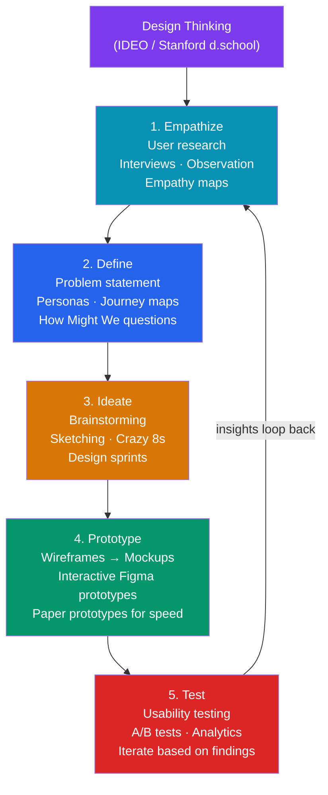

# Product Design Overview

> [!abstract] TL;DR
> **Product design** is the end-to-end discipline of defining and shaping digital products — combining user research, information architecture, interaction design, visual design, prototyping, and usability testing into a cohesive practice. It sits at the intersection of UX (how it works), UI (how it looks), and product strategy (what to build and why). The industry-standard toolkit is **Figma** for design and prototyping, plus Maze/UserTesting for research and Zeroheight/Dev Mode for handoff. Success is measured by adoption, task completion rate, and business outcomes — not pixel polish.

## Intuition — analogy FIRST

A product designer is like an **architect for digital spaces**. The UX designer is the structural engineer — ensuring the building is safe to navigate, logical, and meets user needs. The UI designer is the interior designer — making it visually appealing and on-brand. The product designer is the architect who does both, plus understands why the building exists, what problems it solves, and whether it's worth building at all.

A beautiful UI with terrible UX is like a gorgeous building with confusing hallways. Good UX with no UI polish feels like a functional warehouse. Product design integrates both with business reality.

---

## How It Works



---

## Key Concepts / Details

### UX vs UI vs Product Design

```
UX Design (User Experience Design)
  Focus: HOW the product works
  Activities: User research, information architecture, interaction design,
              usability testing, wireframing, user flows
  Output: Wireframes, journey maps, IA diagrams, usability reports
  Analogy: Civil engineer — ensures roads connect properly and are safe to drive

UI Design (User Interface Design)
  Focus: HOW the product looks
  Activities: Visual design, typography, color, iconography, component design,
              motion/animation, brand application
  Output: High-fidelity mockups, component specs, design system assets
  Analogy: Interior designer — makes the space visually appealing and on-brand

Product Design (the full stack)
  Focus: WHY to build + HOW it works + HOW it looks
  Activities: All of UX + UI + product strategy, stakeholder alignment,
              metrics definition, cross-functional collaboration
  Output: Everything above + product decisions, success metrics, roadmap influence
  Analogy: Architect — responsible for the whole building, not just rooms

In practice: "Product Designer" is the dominant job title at tech companies (2015+).
Pure UX or UI roles exist but are becoming less common at product companies.
```

### Product Designer Responsibilities

```
Discovery Phase
  - Conduct user interviews and synthesize findings
  - Define problem space (not just solution space)
  - Create personas, empathy maps, journey maps
  - Write How Might We (HMW) questions

Design Phase
  - Information architecture (site maps, user flows)
  - Wireframing (low-fi layout, no visual design)
  - Interaction design (micro-interactions, state changes)
  - High-fidelity mockups (Figma)
  - Prototyping (clickable flows for testing)

Validation Phase
  - Usability testing (moderated + unmoderated)
  - A/B testing (with data team)
  - Accessibility review

Handoff Phase
  - Annotate designs with specs and behavior notes
  - Use Figma Dev Mode or Zeroheight for handoff
  - QA the implementation against designs

Collaboration
  - Work with PMs on prioritization and product vision
  - Work with engineers on technical constraints
  - Present designs in design critiques and stakeholder reviews
  - Contribute to / consume the design system
```

### Design Tools Ecosystem

| Tool | Category | Best For |
|------|----------|----------|
| **Figma** | Design + Prototype | Industry standard; collaborative, web-based |
| **Sketch** | Design | macOS-only; plugin ecosystem; common in older orgs |
| **Adobe XD** | Design + Prototype | Adobe ecosystem integration; declining market share |
| **Framer** | High-fidelity Prototype | Code-powered prototypes; closest to real implementation |
| **InVision** | Prototype | Legacy; largely replaced by Figma |
| **Principle** | Motion | Micro-interaction and animation prototyping |
| **ProtoPie** | Prototype | Complex interactions without code |
| **FigJam** | Whiteboard/Ideation | Workshops, journey maps, affinity diagrams |
| **Miro** | Whiteboard/Ideation | Team workshops, large-scale diagrams |
| **Maze** | Usability Testing | Unmoderated remote testing on Figma prototypes |
| **UserTesting** | Usability Testing | Moderated + unmoderated with recruiter panel |
| **Hotjar** | Analytics | Heatmaps, session recordings, surveys |
| **Dovetail** | Research Synthesis | Tag, cluster, and share research insights |

### Designer-Developer Handoff

```
Pre-handoff preparation:
  1. Organize files: clear page structure, proper naming, no draft mess
  2. Use components from the design system library
  3. Apply text styles and color styles (not inline)
  4. Document edge cases: empty states, error states, loading states
  5. Include multiple breakpoints (mobile, tablet, desktop)
  6. Annotate interactions: hover states, transitions, animations

Figma Dev Mode (recommended):
  - Engineers switch to Dev Mode (D key in Figma)
  - Inspect CSS properties, spacing, colors (with token names)
  - View component props
  - Compare design vs implementation ("Compare" feature)
  - Get code snippets (CSS, iOS, Android)

Zeroheight (for larger teams):
  - Embed Figma frames + Storybook stories in one doc site
  - Live Figma embeds stay in sync automatically
  - Add usage guidelines, dos and don'ts, accessibility notes
  - Single URL for the component's full specification

Avoid anti-patterns:
  - "Red-lining" (manual pixel annotations in a separate file) — outdated
  - Figma exports as PNG/PDF — poor for responsive values
  - Designs without real content — use real text, not Lorem Ipsum
```

### Design Impact Metrics

```
North Star metrics for product design:
  - Task success rate (% of users who complete the target task)
  - Time on task (how long to complete the task — lower is better)
  - User satisfaction (SUS score, NPS, CSAT after task)
  - Error rate (how often users make mistakes)
  - Adoption rate (% of target users using the feature)

Business impact metrics:
  - Conversion rate (sign-up, purchase, upgrade)
  - Retention / churn rate
  - Feature adoption (DAU/MAU of new features)
  - Support ticket deflection (better UX = fewer support requests)

HEART Framework (Google):
  Happiness:  User satisfaction (surveys, ratings)
  Engagement: Frequency of use, depth of interaction
  Adoption:   New users / feature uptake
  Retention:  Users returning over time
  Task success: Completion rate, error rate, time on task
```

---

## Real-World Notes

- **Figma has won** — 95%+ of product designers use Figma as of 2025. Sketch is still used at Apple and some macOS-focused shops. AdobeXD is deprecated (2023).
- **"Design thinking" is a framework, not a religion** — real design work is not a linear 5-step process. Empathize and Test phases happen continuously throughout a sprint, not once.
- **The biggest design skill gap is research** — most junior designers can create beautiful UIs; the differentiator is ability to run user research, synthesize insights, and make design decisions from evidence.
- **Design sprints** (Google Ventures) compress the full design thinking cycle into 5 days: Monday (map), Tuesday (sketch), Wednesday (decide), Thursday (prototype), Friday (test). Useful for high-stakes, uncertain product decisions.

---

## Common Pitfalls

- **Jumping to solutions** — starting in Figma before understanding the problem. Wireframing before research produces solutions to the wrong problem.
- **Designing for happy paths only** — not designing empty states, error states, loading states, and edge cases leads to engineering "surprises" and poor user experience.
- **Pixel-pushing instead of problem-solving** — spending 80% of time on visual polish vs. 20% on validating assumptions. Validate early with low-fidelity.
- **Waterfall handoff** — tossing completed designs over the wall to engineering. Product design is a collaborative, iterative process with engineers throughout.

---

## Related Concepts

- [[_MOC_Product_Design_Master|↑ Product Design Master MOC]]
- [[User_Research_Methods]] — How to conduct research: interviews, surveys, usability tests
- [[Information_Architecture]] — Structuring content for findability
- [[Visual_Design_Principles]] — Gestalt, hierarchy, typography, color theory
- [[Figma_Fundamentals]] — The primary tool of the trade

---

## Review Questions

1. What is the difference between UX design, UI design, and product design? What does a product designer do that UX/UI specialists don't?
2. Describe the five steps of the design thinking process. Which phase is most commonly skipped and why?
3. What is the HEART framework and what are its five dimensions?
4. What is Figma Dev Mode and how does it improve designer-developer handoff?
5. What metric would you use to evaluate whether a redesigned onboarding flow is successful?

---

## Sources

- IDEO Design Thinking — https://designthinking.ideo.com/
- Google Ventures Design Sprint — https://www.gv.com/sprint/
- Nielsen Norman Group: UX vs Product Design — https://www.nngroup.com/articles/product-design/
- Figma — https://figma.com

#product-design #ux #ui #design-thinking #figma #handoff
