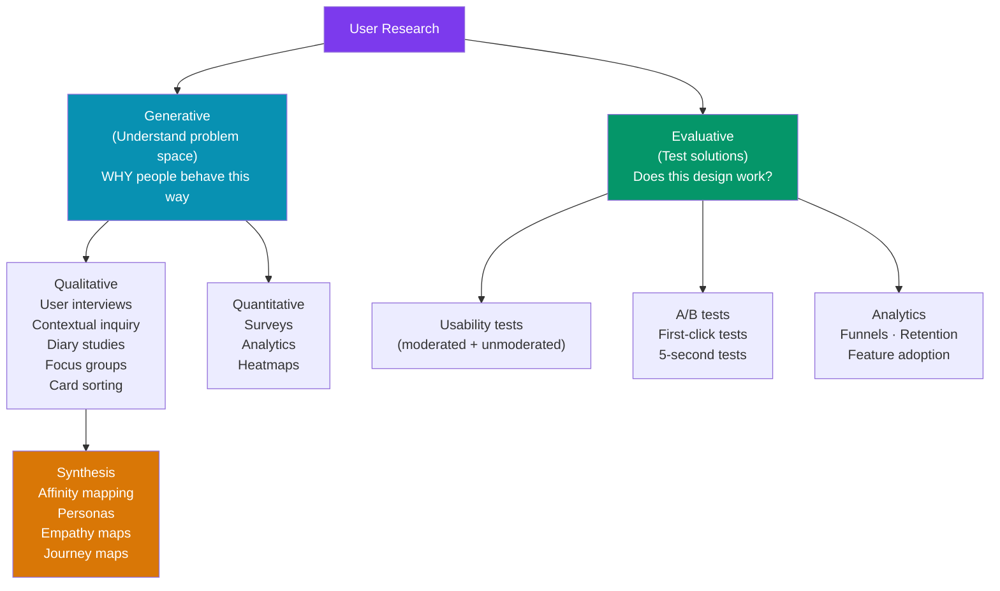

# User Research Methods

> [!abstract] TL;DR
> User research divides into **generative** (understand the problem space — interviews, diary studies, contextual inquiry) and **evaluative** (test solutions — usability tests, A/B tests, heatmaps). Qualitative methods give you the "why"; quantitative gives you the "what" at scale. A well-structured **user interview** (semi-structured, open-ended questions, think-aloud) is the highest-value generative method. Synthesis transforms raw data into actionable insights: **affinity mapping** clusters patterns, **personas** represent user archetypes, **empathy maps** capture feelings/thoughts, and **journey maps** show the end-to-end user experience.

## Intuition — analogy FIRST

Research is like being a detective, not a judge. A detective doesn't decide who did it before collecting evidence — they observe, ask open questions, look for patterns, and let evidence lead to conclusions. A judge, by contrast, starts with a verdict and selects supporting evidence.

Most design teams "do research" like judges: they have a design idea and run a 30-minute test to confirm it works. Real research is uncomfortable — it reveals assumptions that are wrong and features users don't want. That's the point.

---

## How It Works



---

## Key Concepts / Details

### Research Types

```
GENERATIVE RESEARCH — "What problems exist? Why do they exist?"
  Goal: Understand the problem space BEFORE designing solutions
  Output: Insights, patterns, opportunity areas
  Examples:
    - User interviews: "Tell me about the last time you filed an expense report"
    - Contextual inquiry: observe user in their natural environment (their desk, their workflow)
    - Diary study: participants log daily experiences over 1-4 weeks
    - Focus group: group discussion to explore attitudes and mental models

EVALUATIVE RESEARCH — "Does this design work? Can users accomplish X?"
  Goal: Test specific designs or hypotheses
  Output: Task success rates, usability issues, improvement areas
  Examples:
    - Usability testing: "Using this prototype, please book a flight to New York"
    - A/B testing: split traffic between two variants, measure conversion
    - First-click testing: where do users click first for a given task?
    - 5-second test: show design for 5 seconds, ask "what is this page about?"

ATTITUDINAL vs BEHAVIORAL:
  Attitudinal: what users SAY (surveys, interviews) — can diverge from reality
  Behavioral: what users DO (analytics, usability tests, eye tracking) — ground truth
  Best: combine both. Users say they want feature X; analytics show they never use it.
```

### Qualitative Methods

```
USER INTERVIEWS (highest value generative method):
  Structure: semi-structured (guide + flexibility to follow threads)
  Length: 45-60 minutes
  Questions: open-ended ("Tell me about...", "Walk me through...", "What happened next?")
  NOT: "Would you use this feature?" (leading, hypothetical)
  NOT: "Do you find this confusing?" (leading)
  YES: "How do you currently handle [task]?" (behavioral, past-focused)
  YES: "What's the most frustrating part of [process]?" (open, unbiased)
  
  Recruiting:
    Screener criteria: define exact target user (e.g., "manages 5+ person team, uses Slack daily")
    Incentives: $50-100 Amazon gift card / Tremendous for 60 mins (B2C)
                $150-300 for enterprise/specialist roles
    Channels: UserTesting panel, Respondent.io, Twitter/LinkedIn, existing customers

CONTEXTUAL INQUIRY:
  Watch users in their actual environment (office, commute, home)
  Two roles: observer (takes notes) + interviewer (asks clarifying questions)
  "Master-apprentice" model: user is the expert, researcher is the apprentice
  Reveals workarounds, context, and environmental factors surveys miss

DIARY STUDY:
  Participants self-report over 1-4 weeks via daily prompts or incident logging
  Best for: longitudinal behavior, infrequent events (job searching, moving house)
  Tool: Dovetail, daily SMS/email prompts, dedicated diary apps
  Challenge: participant compliance drops over time; keep prompts brief

CARD SORTING (for IA):
  Users group topic cards into categories they find intuitive
  Open sort: users create their own category names
  Closed sort: categories are predefined, users place cards into them
  Tool: OptimalSort, UXMetrics
  Output: similarity matrix — shows which items users group together
```

### Quantitative Methods

```
SURVEYS:
  Best for: validating patterns found in qualitative, measuring attitude at scale
  Size: 100+ responses for reliable patterns; 1000+ for segment analysis
  Question types:
    Likert scale: "Rate 1-5: The checkout process was easy"
    NPS: "How likely are you to recommend? 0-10"
    Multiple choice: "How often do you use X? Daily/Weekly/Monthly/Rarely"
    Open-ended: "What would you improve?" (adds qualitative texture)
  Tools: SurveyMonkey, Typeform, Google Forms, Qualtrics (enterprise)
  Pitfall: survey wording bias — "How easy was it?" biases toward positive

A/B TESTS:
  Split traffic between two variants (A=control, B=treatment)
  Measure: conversion rate, click-through rate, session length
  Requirements: statistical significance (p<0.05), sufficient sample size
  Minimum detectable effect (MDE): if you expect 5% lift, need N=X users
  Tools: Optimizely, LaunchDarkly, Google Optimize, Statsig
  Pitfall: testing too many things at once, stopping early when results look good

HEATMAPS + SESSION RECORDINGS (Hotjar, FullStory, Microsoft Clarity):
  Click maps: where do users click on a page?
  Scroll maps: how far do users scroll before leaving?
  Move maps: where does the mouse hover? (proxy for visual attention)
  Session recordings: watch individual user sessions
  Insight: if 80% of users scroll past a CTA without clicking, move it up
```

### How to Conduct a User Interview

```
BEFORE:
  1. Define research questions (3-5 focused questions you want to answer)
  2. Write a discussion guide (warm-up → context → core topics → wrap-up)
  3. Pilot the interview with a teammate
  4. Prepare a warm, comfortable environment (video call or quiet room)

DURING:
  Opening: "I'm not testing you — I'm testing the design. There are no wrong answers."
  Warm-up: "Tell me a bit about your role and what your typical day looks like."
  Core questions:
    - Ask about behavior, not opinions: "What did you actually do last time you...?"
    - Ask 5 Whys to go deeper: "Why was that frustrating?" → "Why did that happen?"
    - Avoid leading: not "Did you find it confusing?" but "How was that experience for you?"
    - Use silence — let them fill the pause with more context
    - Note-taker records verbatim quotes + observations

  Think-aloud protocol (for usability tests):
    "As you work through this, please say out loud whatever you're thinking —
     what you're looking at, what you expect to happen, any questions you have."

AFTER:
  Debrief with note-taker within 30 minutes while memory is fresh
  Log key quotes and observations in Dovetail / Notion / spreadsheet
  Note: observations > interpretations. "She hovered over the button for 3 seconds"
  not "She was confused by the button."
```

### Synthesizing Research

```
AFFINITY MAPPING:
  1. Each observation / quote gets a sticky note (one idea per note)
  2. Independently sort stickies into clusters by similarity
  3. Name each cluster (the theme, not the evidence)
  4. Look for patterns that span multiple users
  5. Dot vote on the most impactful insight clusters

  Rule: if only ONE user said it, it's interesting but not a pattern.
        if FIVE users hit the same friction, it's a finding.

PERSONAS:
  Archetypes representing user segments based on research (NOT made up)
  Components: name, photo, demographics, goals, frustrations, behaviors, quote
  One persona per distinct user segment (2-4 is typical)
  Anti-pattern: "marketing personas" based on demographics not behavior

EMPATHY MAPS:
  Four quadrants: Says · Thinks · Does · Feels
  "Says" — direct quotes from interviews
  "Thinks" — inferred mental model (may not be said aloud)
  "Does" — observed behaviors
  "Feels" — emotional state
  Used to build shared understanding of user before design begins

JOURNEY MAPS:
  End-to-end visualization of a user completing a goal (not just using your product)
  Stages: Awareness → Consideration → Purchase → Onboarding → Usage → Renewal
  Rows: Actions · Touchpoints · Thoughts · Emotions (highs and lows)
  Outputs: identify pain points, opportunity areas, moments of delight
  Pitfall: map the current experience (AS-IS), not the ideal (TO-BE) — else it's a wishlist
```

---

## Real-World Notes

- **5 users for qualitative**: Jakob Nielsen's research shows 5 users in a usability test reveal ~85% of usability problems. Adding more participants yields diminishing returns. But this is for task-specific usability tests — generative research often needs 15-30 for saturation.
- **Research repositories**: Dovetail, Notion, or even a shared spreadsheet. The key is tagging insights so future teams can search ("checkout," "mobile," "error messages"). Research without a repository is lost research.
- **"Would you use this?" is a trap**: research consistently shows users say yes to features they never use. Measure actual behavior, not stated intention.
- **Remote research (UserTesting, Maze)** is scalable and fast, but misses environmental context. Use moderated remote for nuanced topics, unmoderated for quick validation.

---

## Common Pitfalls

- **Leading questions** — "How easy was that?" biases toward positive. Use neutral framing: "How would you describe that experience?"
- **Recruiting convenience samples** — interviewing your colleagues or power users produces biased findings. Recruit actual target users who match your criteria.
- **Synthesizing too fast** — moving from raw data to recommendations without clustering and pattern-finding leads to cherry-picking. Do affinity mapping before drawing conclusions.
- **Skipping synthesis** — running interviews but never analyzing them. Raw quotes are not insights. "Users are frustrated" is not actionable. "Users can't find the save button because it's below the fold on mobile" is.

---

## Related Concepts

- [[_MOC_Product_Design_Master|↑ Product Design Master MOC]]
- [[Product_Design_Overview]] — Design thinking process and the research phase
- [[Information_Architecture]] — Card sorting feeds directly into IA decisions
- [[Usability_Testing]] — The evaluative counterpart to generative research

---

## Review Questions

1. What is the difference between generative and evaluative research? Give an example of each.
2. Why is "Would you use this feature?" a bad interview question? What would you ask instead?
3. What is an affinity map and what process do you use to create one from interview notes?
4. What is the difference between attitudinal and behavioral research? Why use both?
5. What is the "5-user rule" in usability testing and what are its limitations?

---

## Sources

- Nielsen Norman Group: User Research Methods — https://www.nngroup.com/articles/which-ux-research-methods/
- Erika Hall: Just Enough Research — https://abookapart.com/products/just-enough-research
- Steve Portigal: Interviewing Users — https://rosenfeldmedia.com/books/interviewing-users/
- Dovetail — https://dovetail.com/

#product-design #user-research #ux #interviews #affinity-mapping #personas #journey-maps
