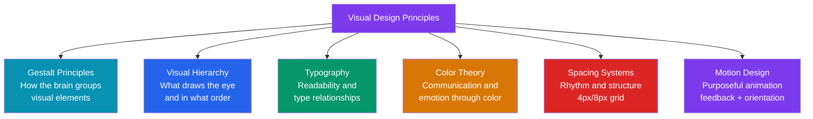

# Visual Design Principles

> [!abstract] TL;DR
> Visual design principles are the underlying laws that make interfaces feel clear, organized, and intentional. **Gestalt principles** explain how the human eye groups visual elements (proximity, similarity, continuity, closure, figure/ground). **Visual hierarchy** directs attention via size, weight, color, and whitespace. **Typography** builds readability through scale, pairing, line length (50-75 chars), and leading (1.4-1.6). **Color** communicates meaning through the 60-30-10 rule and accessible palettes. **Spacing systems** (4px/8px grid) bring rhythm. **Motion** must be purposeful: feedback, orientation, or delight.

## Intuition — analogy FIRST

Visual design is like **musical composition**. You have notes (elements), volume (size), rhythm (spacing), harmony (color relationships), and tempo (motion). A random collection of notes is noise. Structured notes following rules of harmony and rhythm become music that feels inevitable.

Similarly, a UI with random sizes, inconsistent spacing, and arbitrary colors feels stressful and confusing. A UI following gestalt laws, a type scale, a spacing system, and a color palette feels calm, organized, and trustworthy — even if users can't explain why.

---

## How It Works



---

## Key Concepts / Details

### Gestalt Principles

```
Gestalt: "The whole is greater than the sum of its parts"
The brain actively constructs patterns from visual input.

1. PROXIMITY
   Elements close to each other appear to belong together.
   Application: group related form fields (name + last name closer than name + phone number)
   Example: in a card, the title and subtitle are close; the action button has space above it

2. SIMILARITY
   Elements that look alike (color, shape, size) appear to belong together.
   Application: all primary buttons have the same blue; all destructive actions are red
   Example: in a nav bar, the same size/weight for all nav items creates a unified group

3. CONTINUITY
   The eye follows the smoothest path between elements.
   Application: alignment along a grid line; flow through a multi-step wizard
   Example: a horizontal list of icons is read left to right as a series, not individual items

4. CLOSURE
   The mind fills in missing parts of incomplete shapes.
   Application: card borders with gaps still read as a card; partial charts are understood
   Example: a loading skeleton with rounded corners reads as a card even without content

5. FIGURE/GROUND
   Elements are perceived as either foreground (figure) or background (ground).
   Application: modal overlays (dialog = figure, dimmed background = ground)
   Example: a button against a white background — button is figure, white is ground

6. COMMON FATE
   Elements moving in the same direction appear to belong together.
   Application: sorting a list column animates all rows together, implying they're related

7. SYMMETRY
   Symmetrical compositions feel more stable and organized.
   Application: centered modals, symmetrical card grids, balanced page layouts
```

### Visual Hierarchy

```
Visual hierarchy controls what the user looks at first, second, third.
Primary elements demand attention; secondary support; tertiary is available if needed.

LEVERS:

SIZE: Larger elements attract attention first
  H1 > H2 > H3 > body text > caption
  Rule: vary sizes systematically (type scale), not randomly

WEIGHT: Bold type attracts more attention than regular
  font-weight 700 (bold) > 500 (medium) > 400 (regular)
  Use bold sparingly — if everything is bold, nothing is

COLOR: Saturated, high-contrast colors attract attention
  Primary action = brand color (high saturation)
  Secondary action = neutral/muted
  Destructive = red
  Disabled = gray (low contrast, recedes)

WHITESPACE: Space around an element gives it visual breathing room, making it stand out
  A headline with 32px top margin stands out from body text with 8px
  Generous padding inside a card makes the card feel premium

CONTRAST: High contrast (dark on light) stands out; low contrast recedes
  Use contrast to draw attention (CTAs) and de-emphasize (helper text)

POSITION: Users read F-pattern (web) and Z-pattern (landing pages) top-left first
  Primary action goes top-right (nav level) or bottom-right (form level)
  Critical information goes above the fold

PRACTICAL HIERARCHY RULE:
  3 levels maximum per screen: Primary (1 item) → Secondary (2-4 items) → Tertiary
  One element can be dominant; many dominant elements = visual chaos
```

### Typography

```
TYPE SCALE (modular scale recommended)
  Based on a ratio (1.25 = Major Third, 1.333 = Perfect Fourth, 1.5 = Perfect Fifth)
  
  Perfect Fourth scale (1.333) starting at 16px base:
    xs:   12px  (0.75rem)
    sm:   14px  (0.875rem)
    base: 16px  (1rem)     ← body text
    lg:   18px  (1.125rem)
    xl:   21px  (1.333rem)
    2xl:  28px  (1.75rem)
    3xl:  37px  (2.333rem) ← h2
    4xl:  50px  (3.125rem) ← h1 (display)

TYPE PAIRING:
  Principle: contrast without conflict
  Classic pairings:
    Serif heading + sans-serif body (Inter + Georgia, Playfair + Inter)
    Geometric sans + humanist sans (Futura + Gill Sans)
    One typeface, two weights (Inter Regular + Inter Bold)
  Rule: limit to 2 typefaces maximum in a product UI

READABILITY:
  Line length: 50-75 characters optimal for body text (shorter for narrow columns)
  Leading (line-height): 1.4-1.6× for body (tighter for headings: 1.1-1.25)
  Tracking (letter-spacing): slight positive for ALL CAPS; neutral for body
  Font size: 16px minimum for body text (don't go below 14px for any readable text)
  Contrast: 4.5:1 minimum for body text (WCAG AA)

HIERARCHY IN PRACTICE:
  Page title:   H1, 36-48px, bold
  Section title: H2, 24-30px, semibold
  Card title:   H3, 18-20px, medium
  Body:         16px, regular, line-height 1.5
  Label:        14px, medium (or semibold for form labels)
  Caption:      12px, regular, muted color
```

### Color Theory

```
60-30-10 RULE:
  60%: dominant color (background, largest surfaces) — typically neutral (white, gray)
  30%: secondary color (cards, sidebars, secondary sections) — brand mid-tone or accent
  10%: accent color (CTAs, highlights, interactive elements) — brand primary

COLOR PSYCHOLOGY (general associations — varies by culture):
  Blue:   Trust, stability, technology (banks, tech companies)
  Green:  Success, growth, health (finance, eco, success states)
  Red:    Urgency, danger, error (warnings, destructive actions, sale badges)
  Orange: Energy, enthusiasm, CTA (checkout buttons, conversion-focused)
  Purple: Premium, creative, luxury (Figma, Twitch, Cadbury)
  Yellow: Caution, warmth, attention (warning states, highlights)
  Gray:   Neutral, professional, supporting (text, borders, backgrounds)

ACCESSIBLE COLOR PALETTES:
  Generate palette then audit contrast:
    Primary action on white: ≥ 4.5:1 (body) / ≥ 3:1 (large text)
    Error red (#DC2626) on white = 4.5:1 ✓
    Success green: watch out — many "nice" greens fail contrast on white
    Use: oklch or hsl to generate tonal scales maintaining consistent lightness

COLOR FOR STATES (semantic color):
  Default: brand primary
  Hover: 10-15% darker (darken L in oklch)
  Active/Pressed: 20% darker
  Disabled: 40% opacity or gray-300
  Error: semantic red (not just "red")
  Success: semantic green
  Warning: semantic amber/yellow
  Info: semantic blue (lighter than interactive blue)

DARK MODE DESIGN:
  DON'T: invert light mode colors (white → black, dark gray → near-white)
  DO: use a separate dark token set
  Background levels: dark-950 (deepest) < dark-900 < dark-800 < dark-700 (elevated surfaces)
  Elevation in dark mode: lighter surfaces are "higher" (opposite of shadows in light mode)
  Text: not pure white (#fff) — use gray-100 (#f3f4f6) to reduce eye strain
  Shadows in dark: subtle colored glows instead of dark shadows (shadow is invisible on dark backgrounds)
```

### Spacing Systems

```
4px BASE GRID (Tailwind / Material):
  All spacing values are multiples of 4px
  4, 8, 12, 16, 24, 32, 40, 48, 64, 96, 128

8px BASE GRID (common in larger design systems):
  8, 16, 24, 32, 48, 64, 96, 128

Why a grid system?
  Consistent rhythm — all elements align to the same underlying grid
  Predictable relationships — a 16px gap means the same everywhere
  Easy designer-developer handoff — "padding: space-4" is unambiguous

Application:
  Component internal padding: typically 8px (sm), 12-16px (md), 20-24px (lg)
  Between related elements: 4-8px (label to input, icon to text)
  Between unrelated elements: 16-32px (between form sections)
  Page-level margins: 16px (mobile), 32-64px (desktop)
  Section spacing: 48-96px (between major page sections)

RESPONSIVE DESIGN PRINCIPLES:
  Fluid: percentage-based widths that scale smoothly
  Adaptive: fixed layouts that change at specific breakpoints
  Best practice: fluid within breakpoint ranges, adaptive across breakpoints

  Container max-widths:
    sm:  640px
    md:  768px
    lg:  1024px
    xl:  1280px
    2xl: 1536px (rare — very wide screens)

  Common breakpoints: 640, 768, 1024, 1280 (Tailwind defaults)
```

### Motion Design

```
PURPOSE-DRIVEN MOTION (not decorative):

1. FEEDBACK: confirm an action occurred
   Button press animation (scale: 0.97 on active)
   Form submission: spinner → checkmark
   Delete: element fades + slides up before disappearing

2. ORIENTATION: show where content came from/went to
   Modal: fades in from center (scale 0.95 → 1.0)
   Sheet: slides up from bottom
   Drawer: slides in from left
   Page transition: new page slides in from right (back = from left)
   These spatial cues help users maintain their mental model

3. DELIGHT: unexpected moments of joy (use sparingly)
   Confetti on first purchase
   Animated illustration on empty state
   Micro-interaction on like/favorite button

DURATION AND EASING:
  Fast (50-100ms): micro-feedback (button press, hover)
  Normal (150-250ms): state changes (dropdown open, tab switch)
  Slow (300-500ms): large transitions (modal, page transitions)
  Very slow (>500ms): celebratory moments only

  Easing:
    ease-out (decelerate): elements entering screen (from off-screen to rest)
    ease-in (accelerate): elements leaving screen (from rest to off-screen)
    ease-in-out: elements moving within screen
    spring: playful, organic movement (⚠️ avoid for functional UI)

REDUCE MOTION:
  @media (prefers-reduced-motion: reduce) {
    * { animation-duration: 0.001ms !important; transition-duration: 0.001ms !important; }
  }
  Users with vestibular disorders (motion sickness, ADHD) can opt out of animations.
  Always honor this preference. It's a WCAG requirement (SC 2.3.3 AAA, 2.3.3 guidance).
```

---

## Real-World Notes

- **Tailwind CSS** is essentially a spacing + typography + color system encoded as utility classes. Understanding the underlying design principles makes Tailwind configs intuitive.
- **Oklch color space** (2023+) is the modern way to generate accessible color palettes because it maintains perceptually uniform lightness. `oklch(50% 0.2 250)` = lightness 50%, chroma 0.2, hue 250 (blue).
- **Design tokens and visual principles are inseparable** — your spacing system IS your `--space-*` token scale. Your type scale IS your `--font-size-*` tokens. Designing visual systems and token systems is the same activity.
- **Motion accessibility first**: Implement `prefers-reduced-motion` from day one. Retrofitting it onto a motion-heavy design is painful.

---

## Common Pitfalls

- **Random spacing** — using 7px, 11px, 23px margins because it "looks right." Without a grid, designs look inconsistent and developers have to guess intent.
- **Too many font sizes** — 12 different sizes on a page signals no hierarchy system. 5-7 sizes for the entire product is usually sufficient.
- **All-gray UI** — making everything gray to look "clean" kills hierarchy. Color is a hierarchy lever. Flat design ≠ gray design.
- **Decorative animation** — motion that serves no orientation/feedback purpose (spinning logos, parallax backgrounds) slows users and triggers motion sensitivity. Delete it.

---

## Related Concepts

- [[_MOC_Product_Design_Master|↑ Product Design Master MOC]]
- [[Product_Design_Overview]] — Visual design fits in the UI layer of product design
- [[Figma_Fundamentals]] — Tool for implementing visual design systems
- [[Design_Tokens]] — The coded representation of visual design decisions

---

## Review Questions

1. Name and describe five Gestalt principles. Give a UI example for each.
2. What are the four main levers of visual hierarchy? How would you use them to make a CTA button stand out?
3. What is the 60-30-10 color rule? How does it apply to a typical SaaS dashboard?
4. What optimal line length and leading should body text have for readability?
5. What are the three purposes of motion in UI design? Give an example of each.

---

## Sources

- Josef Müller-Brockmann: Grid Systems in Graphic Design
- Robert Bringhurst: The Elements of Typographic Style
- Nielsen Norman Group: Visual Hierarchy — https://www.nngroup.com/articles/visual-hierarchy-ux-definition/
- Material Design: Motion — https://m3.material.io/styles/motion/overview

#product-design #visual-design #gestalt #typography #color-theory #spacing #motion
