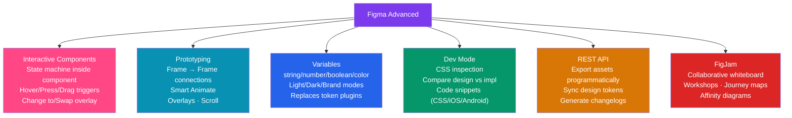

# Figma Advanced

> [!abstract] TL;DR
> Advanced Figma covers: **Interactive Components** (state changes — hover/press/drag — wired inside a component without external prototype connections), **Prototyping** (frame-to-frame connections, overlays, scroll, smart animate for fluid transitions), **Variables** (replacing token plugins — define light/dark/brand modes natively), **Dev Mode** (inspect CSS properties, compare design vs. implementation, export code snippets), and the **Figma REST API** (automate design exports, generate changelogs, sync tokens). **FigJam** enables collaborative workshops (affinity mapping, journey maps, design sprints) directly in the Figma ecosystem.

## Intuition — analogy FIRST

If Figma Fundamentals is learning to write, Figma Advanced is learning to write persuasively with purpose. Interactive components let your prototype behave like real software — hover states respond, toggles toggle, dropdowns open — without brittle frame-to-frame connections for every state. Variables give your design file a "data layer" — switch modes and watch 1000 elements update their colors simultaneously. Dev Mode turns your design file into a living specification that developers read instead of a static image they interpret.

---

## How It Works



---

## Key Concepts / Details

### Interactive Components

```
PROBLEM WITHOUT INTERACTIVE COMPONENTS:
  To show a button hover state, you need:
    Frame A (button default) → hover trigger → Frame B (button hover)
  If you have 10 buttons on a page, you need 10 separate frame transitions.
  Complex components (dropdown, accordion) require dozens of frames.

WITH INTERACTIVE COMPONENTS:
  State machine lives INSIDE the component.
  The component handles hover/press/drag → component state changes.
  No external prototype connections needed for individual instances.

SETUP:
  1. Create a component with variants: Default / Hover / Pressed / Disabled
  2. In the component set, switch to Prototype mode
  3. Wire variants: Default → [While hovering] → Change to Hover
  4. Wire: Hover → [Mouse leave] → Change to Default
  5. Wire: Default → [On press] → Change to Pressed
  6. Wire: Pressed → [On release] → Change to Default

TRIGGER TYPES:
  On click:          single click / tap
  While hovering:    mouse enter (triggers on hover start)
  Mouse leave:       hover end
  On press:          mouse down / touch start
  On release:        mouse up / touch end
  On drag:           drag gesture (sliders, carousels)
  Key / gamepad:     keyboard key press (for custom inputs)
  After delay:       X ms after component appears (for auto-advancing)

ACTIONS:
  Change to:         transition to another variant in the set
  Back:              return to previous state
  Scroll to:         scroll to a specific element
  Open link:         external URL
```

### Prototyping

```
FRAME-TO-FRAME CONNECTIONS:
  In Prototype mode (P key), draw connections from element → target frame
  Trigger: On click / After delay / While hovering / On drag
  Animation: Instant / Dissolve / Smart Animate / Move in (direction) / Push (direction) / Slide in

SMART ANIMATE:
  Figma automatically animates matching layer names between frames
  Example: Frame A has a card at y:100; Frame B has the same card at y:400
  Smart Animate → card smoothly moves from y:100 to y:400
  
  Requirements: layer names must EXACTLY match (case-sensitive) between frames
  Works for: position, size, color, opacity, rotation, corner radius
  Timing: set duration (ms) and easing in the prototype connection panel

OVERLAYS:
  A frame that appears ON TOP of the current frame (like a modal or dropdown)
  Open overlay action: position (Centered / Manual / Top-left/right / Bottom-left/right)
  Close on click outside: ✓
  Background overlay: ✓ (dim the background with overlay)
  Scroll with parent: for sheets that scroll with the page

SCROLL BEHAVIOR:
  Prototype panel → Scroll direction: None / Vertical / Horizontal / Both
  Fixed elements (sticky nav): Select layer → Design panel → Position: Fixed
  Sticky positioning not yet supported in prototypes — use Fixed as approximation

SCROLLING OVERFLOW:
  Set frame height to viewport height (e.g., 812px for iPhone 14)
  Set inner content frame taller (e.g., 2000px)
  Parent frame: Clip content ON, Overflow: Vertical scrolling
  Preview in presentation mode → scrollable prototype

PROTOTYPE FLOWS:
  Define starting frames for different user flows
  Prototype panel → "+" icon next to "Flows" → name the flow
  Share specific flow URL with stakeholders
```

### Variables (Figma 2023+)

```
VARIABLE TYPES:
  Color:   hex/rgba value (#2563EB, rgba(37,99,235,1))
  String:  text value ("Save Changes", "en-US")
  Number:  numeric value (16, 1.5, 0.25)
  Boolean: true/false (show badge, dark mode on)

COLLECTIONS AND MODES:
  A collection groups related variables with MODES.
  Mode = a named configuration (Light, Dark, Brand A, Brand B, Desktop, Mobile)

  Example collection: "Colors"
  Variables:
    interactive/primary      Light: #2563EB    Dark: #60A5FA
    surface/background       Light: #FFFFFF    Dark: #030712
    text/default             Light: #111827    Dark: #F9FAFB
    feedback/error           Light: #DC2626    Dark: #F87171

  Switch mode globally: right-click on canvas → Select all with mode → switch
  Switch mode locally: select a frame → right panel → Variables → Mode selector

HOW VARIABLES REPLACE TOKENS STUDIO:
  Before: JSON tokens → Tokens Studio plugin → Figma styles
  Now: Figma Variables → define modes → export via REST API / Tokens Studio
  Variables sync to CSS custom properties via Style Dictionary integration

VARIABLE SCOPING:
  Scope which property types can use a variable:
    Color variable: restrict to "Fill color" only (not "Stroke" or "Text")
  Prevents designers from accidentally using a surface color as a text color.

CONDITIONALS (Figma Advanced Prototyping — 2024):
  Variables can be used to show/hide elements conditionally in prototypes:
    If counter > 3 → show "Max items reached" label
    If darkMode = true → apply dark mode to this frame
  Set variable: in prototype actions, set a variable value on interaction
  Conditional visibility: layer visibility tied to variable boolean
```

### Dev Mode

```
Dev Mode (D key or Figma icon → Dev Mode):
  Switches Figma into a read-only inspection view for developers.
  Shows component properties, spacing, color values with token names.

INSPECT:
  Click any element → see all CSS properties:
    width, height, padding, margin (from Auto Layout gap/padding)
    font-family, font-size, font-weight, line-height, letter-spacing
    background-color, border-radius, box-shadow
    Colors shown as: token name (if using variables) or hex value
    Spacing shown as: token name or px value

MEASURE SPACING:
  Hover over an element → Cmd/Ctrl+click → shows distances to nearby elements
  Hold Alt → shows spacing from selected element to others

CODE SNIPPETS:
  Figma generates CSS, iOS (Swift), Android (XML) code for selected elements
  Plugin API: custom code snippet plugins can generate framework-specific code
    (e.g., generate React component props from a selected component instance)

COMPARE DESIGN VS IMPLEMENTATION:
  Dev Mode → Compare tab → Paste a URL of the deployed page
  Shows your Figma frame overlaid with the live page
  Adjust opacity slider to compare: 50% design + 50% live implementation
  Reveals spacing discrepancies, font rounding differences, missing states

FIGMA SECTIONS IN DEV MODE:
  Named sections appear in Dev Mode navigation sidebar
  Developers can jump directly to "Cart Flow" or "Mobile Nav" section
  Best practice: organize handoff files into named sections per feature/flow
```

### FigJam

```
FigJam is Figma's collaborative whiteboard tool.
Accessed from the same workspace; files live in same projects.

USE CASES:
  Affinity mapping: sticky notes + voting during design research synthesis
  Journey maps: swim-lane diagrams for current/future state mapping
  Design sprints: lightning demos, crazy 8s, solution sketching
  Retrospectives: Start/Stop/Continue sticky note exercises
  Technical diagrams: quick architecture sketches (not production diagrams)
  Workshop facilitation: timer widget, cursor spotlight, voting stickers

UNIQUE FEATURES:
  Sticky notes: color-coded, can vote with dots, group into clusters
  Widgets: Timer, Voting, Ice Breaker, Retrospective templates
  Connector lines: smart connectors that route around objects
  Drawing tools: marker, highlighter, pencil (for freehand sketching)
  Stamps: emoji reactions, checkmarks, dots for dot voting
  Real-time cursor names visible (great for workshops)
  Templates: 100+ pre-built templates for UX activities

FIGMA → FIGJAM INTEGRATION:
  Import Figma frames directly into FigJam for design crits
  "Link" a FigJam board from a Figma file for context

WHEN TO USE FIGJAM VS FIGMA:
  FigJam: early-stage ideation, workshops, loose diagrams, research synthesis
  Figma: actual UI design, component libraries, prototyping, handoff
```

### Figma REST API

```javascript
// Figma REST API — automate design workflows
// Base URL: https://api.figma.com/v1/
// Auth: Bearer token (from Account settings → Personal Access Token)

// Get file metadata
GET /files/:file_key
Headers: { X-Figma-Token: 'your-token' }

// Get specific node (e.g., a component)
GET /files/:file_key/nodes?ids=node-id-1,node-id-2

// Export assets (icons, illustrations)
GET /images/:file_key?ids=node-id&format=svg&scale=1
// Returns: { images: { 'node-id': 'https://s3.amazonaws.com/...' } }

// COMMON AUTOMATION USE CASES:

// 1. Export all icons from a Figma "Icons" frame
const icons = await fetch(`/files/${fileKey}/nodes?ids=${iconFrameId}`)
const exportUrls = await fetch(`/images/${fileKey}?ids=${iconIds.join(',')}&format=svg`)
// Download + save to src/assets/icons/*.svg

// 2. Extract design tokens from variables
const variables = await fetch(`/files/${fileKey}/variables/local`)
// Transform variable values → tokens JSON → Style Dictionary

// 3. Generate changelog: compare two versions of a file
const version1 = await fetch(`/files/${fileKey}?version=v1Id`)
const version2 = await fetch(`/files/${fileKey}?version=v2Id`)
// Diff components/styles between versions

// PLUGIN DEVELOPMENT (runs inside Figma):
// figma.currentPage: access the current page
// figma.createText(): create text nodes programmatically
// figma.ui.postMessage(): send data from plugin code to the UI panel
// Use cases: design token sync, bulk rename, accessibility linter, content generator
```

---

## Real-World Notes

- **Smart Animate is the key to polished prototypes** — native app-quality feel. Matching layer names between variants is the critical requirement; most "why isn't it animating?" issues are naming mismatches.
- **Variables completely replace Tokens Studio** for most teams — but Tokens Studio still has better CI/CD sync story (JSON → GitHub → Style Dictionary pipeline). Use native Variables for in-Figma design; Tokens Studio if you need automated export to code.
- **Dev Mode Compare** is underused — it surfaces the "1px off" and "wrong shadow" issues that QA traditionally catches manually. Make it part of every frontend review process.
- **FigJam templates**: design sprint templates save 1-2 hours of whiteboard setup. Never start a sprint from scratch.

---

## Common Pitfalls

- **Smart Animate naming mismatches** — layers named "Icon" in Frame A and "Icon Copy" in Frame B won't animate. Name hygiene is critical.
- **Too many overlay frames** — modals, tooltips, and dropdowns as separate frames create a cluttered canvas and brittle prototype. Use Interactive Components for self-contained state.
- **Variables without scope restrictions** — a "surface" color variable used as text color is a design error. Set variable scope to prevent misuse.
- **Sharing prototype links without flows** — a prototype URL dumps the user on whatever frame was last viewed. Always define and share a named Flow URL.

---

## Related Concepts

- [[_MOC_Product_Design_Master|↑ Product Design Master MOC]]
- [[Figma_Fundamentals]] — Auto Layout, Components, Variants, Styles
- [[Usability_Testing]] — Prototype links are shared with test participants in Maze/UserTesting
- [[Design_Tokens]] — Variables and the Style Dictionary pipeline

---

## Review Questions

1. What problem do Interactive Components solve in Figma prototyping? How do you wire a hover state inside a component?
2. What is Smart Animate and what is the critical requirement for it to work between two frames?
3. What is a Figma Variable Collection with Modes? Give an example of a light/dark mode collection.
4. What does Figma Dev Mode's "Compare" feature do and how would you use it in a development workflow?
5. Name two practical use cases for the Figma REST API in a design system workflow.

---

## Sources

- Figma: Interactive components — https://help.figma.com/hc/en-us/articles/360061175334
- Figma: Variables — https://help.figma.com/hc/en-us/articles/15339657135383
- Figma REST API — https://www.figma.com/developers/api
- FigJam — https://www.figma.com/figjam/

#product-design #figma #interactive-components #variables #prototyping #dev-mode #api
