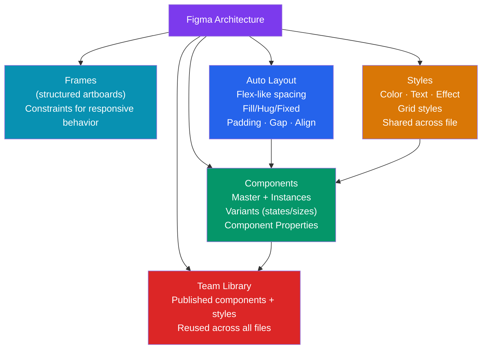

# Figma Fundamentals

> [!abstract] TL;DR
> Figma is a browser-based, multiplayer design tool built on a **vector network** (not a bezier-only model). Core building blocks: **Frames** (artboards with constraint-based layout), **Auto Layout** (CSS flexbox-like spacing with fill/hug/fixed sizing), **Components** (reusable elements with variants for states and sizes), **Component Properties** (content, visibility, instance swapping inline), and **Styles** (shared color, text, effect, grid values). Figma's team library publishes components and styles for reuse across all project files. Understanding Auto Layout is the single biggest skill multiplier in Figma.

## Intuition — analogy FIRST

Figma is like **a living design specification, not a static drawing tool**. Older tools (Photoshop) created flat images of designs. Figma creates structured, parameterized designs where a button "knows" it has a primary/secondary/ghost variant, where a card "knows" it has a title slot and a body slot, and where a spacing change propagates to 200 components instantly.

Auto Layout in Figma is CSS Flexbox expressed visually. Variants are TypeScript union types expressed as design states. Styles are design tokens expressed in Figma's UI.

---

## How It Works



---

## Key Concepts / Details

### Figma Architecture

```
VECTOR NETWORK:
  Figma uses a vector network rather than bezier path segments.
  Paths can branch (T-junctions), enabling more complex shapes without workarounds.
  Result: pen tool is more flexible than Illustrator/Sketch for interface shapes.

BROWSER-BASED + MULTIPLAYER:
  Files live in the cloud (no "Save As"). Auto-saved continuously.
  Multiple editors can work simultaneously (like Google Docs for design).
  Cursor presence shows where teammates are working.
  Observers can comment in real-time (no edit access needed).
  Comment threads: pin to elements, resolve, assign to teammates.

FILE STRUCTURE:
  Organization: Team → Project → File → Pages → Frames (Artboards)
  Pages: use for different states (Working / Handoff / Archive) or flows
  Frames: the artboard equivalent — each screen or component set lives in a frame
  Sections: group frames with labels on the canvas (Figma 2023+ feature)
```

### Frames vs Groups vs Sections

```
FRAMES (use for screens and components):
  - Have x/y position and dimensions
  - Support Auto Layout, constraints, clip content, corner radius
  - Can be nested (parent frame clips children)
  - Can have a fill, stroke, effects
  - Shortcut: F key, then draw

GROUPS (use for loose collections):
  - Transparent container — inherits size from contents
  - No clip content (children can overflow visually)
  - No constraints or Auto Layout
  - Shortcut: Cmd+G / Ctrl+G

SECTIONS (use for organization):
  - Canvas-level containers for organizing frames
  - Not part of the design (won't export)
  - Named sections appear in Dev Mode for navigation
  - Shortcut: Shift+S

Rule of thumb:
  Use FRAMES for anything that represents UI (screens, components, cards)
  Use GROUPS temporarily when you need a quick selection handle
  Use SECTIONS to organize the canvas into logical areas
```

### Auto Layout

```
AUTO LAYOUT — Figma's version of CSS Flexbox

DIRECTION:
  Horizontal: children laid out left to right (flex-direction: row)
  Vertical: children laid out top to bottom (flex-direction: column)
  Wrap: children wrap to next line (flex-wrap: wrap) — Figma 2023+

SIZING OPTIONS (per child, not parent):
  Fill (fill container): flex-grow: 1 — takes remaining space
  Hug (hug contents): width: fit-content — wraps tightly around content
  Fixed: explicit px or % width — stays at that size

SPACING:
  Padding: internal spacing (top/right/bottom/left or uniform)
  Gap: space BETWEEN children (equivalent to gap in CSS)
  Align: horizontal-align + vertical-align of children in container

COMMON PATTERNS:
  Button (horizontal, hug width, hug height, padding 12/24):
    ← [Icon] [Label] →  gap: 8px, padding: 12px 24px
    Width: Hug (shrinks/grows with label)
    Height: Hug (36px from padding)

  Card (vertical, fill width, hug height, padding 16):
    ↑ Image (fill width, fixed 200px height)
    ↑ Title (fill width, hug)
    ↑ Body text (fill width, hug)
    ↑ Footer (fill width, hug)

  Nav bar (horizontal, fill width, fixed 64px height):
    Logo (hug) ← fill spacer → Nav links (hug) → CTA button (hug)
    Use "Space between" alignment for spacer effect

PRACTICAL SHORTCUTS:
  Add Auto Layout: Shift+A (on selected frame or group)
  Add padding: select frame → right panel → padding fields
  Toggle fill/hug: click the size icon (←→ for fill, ↔ for hug)
```

### Components, Variants, and Properties

```
COMPONENTS:
  Main component: the "source of truth" (marked with ◆ icon)
  Instance: a copy of the main component (◈ icon) — linked to main
  When main changes → all instances update automatically
  Create component: Cmd+Alt+K / Ctrl+Alt+K (or right-click → Create component)
  Edit main: double-click instance → "Go to main component"

VARIANTS (component sets):
  Group related components (Default/Hover/Active/Disabled + sm/md/lg) into ONE component
  Each variant = one property combination
  Create: select all related components → right-click → Combine as variants

  Example Button component set:
    Property: variant = primary | secondary | ghost | danger
    Property: size = sm | md | lg
    Property: state = default | hover | pressed | disabled | loading
    Total variants: 4 × 3 × 5 = 60 variants (Figma generates all automatically)

COMPONENT PROPERTIES (Figma 2022+):
  Add controls to instances without opening the component:
  
  Boolean property: show/hide an element (e.g., "Show icon" toggle)
    Usage: instance panel shows a checkbox "Show icon"
  
  Text property: swap text content inline
    Usage: instance panel shows text field "Label text"
  
  Instance swap property: swap nested components inline
    Usage: instance panel shows a dropdown to pick which icon variant

  These replace the need for nested variant overrides for common customizations.

NAMING CONVENTIONS:
  Component names map to Storybook story hierarchy:
    "Components/Atoms/Button" → sidebar: Components > Atoms > Button
  Variant properties: PascalCase ("Variant", "Size", "State")
  Variant values: lowercase ("primary", "sm", "disabled")
```

### Styles

```
STYLES — shared values referenced by components

Color styles:
  Create: paint fill → Styles panel → + → name it "Interactive/Primary"
  Usage: fills, strokes, text color
  Convention: group with "/" separator ("Neutral/Gray-500", "Semantic/Error")
  
Text styles:
  Defines font-family, size, weight, line-height, letter-spacing
  Create: typography → Styles → + → name "Body/Regular"
  All text using this style updates when the style changes

Effect styles:
  Box shadows, inner shadows, blurs
  Create: shadow → Styles → + → "Elevation/Card"

Grid styles:
  Column grids (12-column, 8px grid)
  Apply to frames for consistent layout

STYLES vs VARIABLES (Figma 2023+):
  Styles: scoped to values used in one dimension (a color style)
  Variables: support modes (light/dark/brand-A/brand-B) and can drive spacing
  Migration path: Variables are the future — styles for typography still common

TEAM LIBRARY:
  Publish components + styles from a "Design System" file
  Other project files subscribe to the library
  Updates: library owner publishes → consumers see "Library updates available"
  Accept updates → instances update to new main component
```

### Figma Tokens Plugin

```
The Figma Tokens plugin (now "Tokens Studio") bridges Figma Variables/Styles with
your token JSON files.

Workflow:
  1. Token JSON (tokens/global.json, tokens/semantic.json)
  2. Tokens Studio plugin reads JSON → applies as Figma styles/variables
  3. Designers work with tokens in Figma
  4. Export → regenerate JSON → Style Dictionary transforms to CSS/JS/iOS
  5. Developers get updated CSS custom properties

MODES (with Figma Variables native):
  Define: light/dark/brand modes directly in Variables panel
  Switch modes: component set → Mode selector in right panel
  Share token values: export via Figma API or Tokens Studio to JSON

Constraint-based responsive layout:
  Constraints: what happens when a frame resizes?
    Left: element stays at fixed distance from left
    Right: element stays at fixed distance from right
    Left + Right: element stretches (fill width)
    Center: element stays horizontally centered
    Scale: element scales proportionally
  Auto Layout overrides constraints for children within AL frames.
```

---

## Real-World Notes

- **Auto Layout is the most important Figma skill** — designers who don't use AL create brittle designs where every spacing change requires manual updates. AL-native designs are resilient, handoff-ready, and developer-friendly.
- **Detach with caution** — right-clicking an instance and selecting "Detach instance" breaks the link to the main component. Detached instances don't receive updates. Usually a sign you need a new variant, not a detached instance.
- **Figma performance**: large files with many vector nodes slow down. Flatten complex illustration vectors (`Ctrl+E`) and use images for photography rather than traced vectors.
- **The component hierarchy matters for the library** — if your button is named "Button/Primary/Default", the team library groups it logically. Poor naming creates chaos in the assets panel.

---

## Common Pitfalls

- **Using absolute positioning instead of Auto Layout** — manually positioning every element means every copy-paste needs manual repositioning. If you find yourself dragging elements, add Auto Layout.
- **Over-nesting components** — deeply nested Auto Layout frames become slow to interact with. Prefer flat structures for performance.
- **Not using styles** — using inline colors and text settings means no single place to update. All colors should reference a color style or variable.
- **Creating variants for everything** — sometimes a component property (boolean/text) is better than a full variant. A "show badge" boolean property doesn't need a separate "With Badge" variant.

---

## Related Concepts

- [[_MOC_Product_Design_Master|↑ Product Design Master MOC]]
- [[Figma_Advanced]] — Interactive components, variables, prototyping, Dev Mode
- [[Product_Design_Overview]] — Figma in context of the design workflow
- [[Visual_Design_Principles]] — Principles that inform how you use styles and layouts

---

## Review Questions

1. What is the difference between a Frame and a Group in Figma? When should you use each?
2. What are the three sizing modes in Auto Layout (Fill, Hug, Fixed)? What CSS properties do they map to?
3. What is a component variant set? How do you create one?
4. What is the difference between a Component Property and a Variant? Give an example of when each is appropriate.
5. What is the difference between Figma Styles and Figma Variables? Which is preferred for dark mode support?

---

## Sources

- Figma: Learn Auto Layout — https://help.figma.com/hc/en-us/articles/360040451373
- Figma: Components overview — https://help.figma.com/hc/en-us/articles/360038662654
- Tokens Studio for Figma — https://docs.tokens.studio/

#product-design #figma #auto-layout #components #variants #design-system
