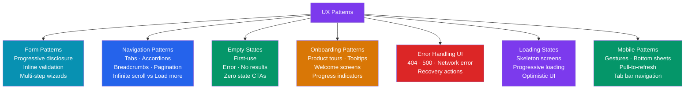

# UX Patterns

> [!abstract] TL;DR
> UX patterns are **proven, reusable solutions to recurring design problems** — the design equivalent of software design patterns. This note covers forms (progressive disclosure, inline validation, multi-step wizards), navigation (tabs, accordions, breadcrumbs, infinite scroll vs load more), empty states (first-use, error, no results), onboarding (product tours, tooltips, welcome screens), error handling UI (recovery-focused 404/500/network errors), loading states (skeleton screens, optimistic UI), and mobile patterns (bottom sheets, pull-to-refresh, gestures).

## Intuition — analogy FIRST

UX patterns are like **traffic sign conventions**. A red octagon means STOP not because someone invented a brilliant design, but because that convention has been tested by millions of drivers and proven to work. Reinventing the stop sign shape is a user experience regression, not innovation.

Similarly, users have built mental models around patterns like: form validation shows errors below the field, the search icon is a magnifying glass, a hamburger icon opens the menu, swiping left deletes an item. Deviating from established patterns raises the learning cost without delivering proportional value. Break patterns only when the evidence for a better approach is overwhelming.

---

## How It Works



---

## Key Concepts / Details

### Form Patterns

```
PROGRESSIVE DISCLOSURE:
  Show only the information/fields necessary for the current step.
  Reveal additional options/fields when needed.
  
  Examples:
    "Advanced options" collapsed by default — expand only if needed
    Address form: City + State appear after user enters Zip code
    Credit card CVV field: only shows after card number is entered
    
  Why it works: reduces cognitive load (Miller's Law: 7±2 items in working memory)
  Anti-pattern: showing all 20 fields at once when most users need only 5

INLINE VALIDATION:
  Validate input as the user types OR on field blur (not just on submit).
  Show errors below the field, not in a summary at the top.
  
  Best practices:
    Validate on blur (when user leaves the field), not on keystroke
    Exception: password strength indicator can show on keystroke
    Error state: red border + red error message below + error icon
    Success state: green checkmark (for fields where success is meaningful — passwords)
    Message: specific ("Password must be at least 8 characters") not generic ("Invalid input")
    Don't clear the user's input when showing an error — they need to see what they typed

MULTI-STEP WIZARDS:
  Break complex tasks into digestible steps.
  
  Progress indicator: show step count ("Step 2 of 5") or visual progress bar
  Back navigation: always provide a back button (users need to review/correct)
  Save state: preserve entered data between steps (don't lose data on back)
  CTA labeling: "Continue" → "Continue" → "Review" → "Submit" (not always "Next")
  Exit warning: if user navigates away, warn them if they have unsaved data
  
  When to use: tasks with 3+ distinct stages, data dependencies between steps
  When NOT to use: simple forms (2-3 fields) — wizard adds friction without benefit

FORM LAYOUT:
  Single column: always preferred for mobile and usually for desktop
  Logical grouping: group related fields (Personal Info / Address / Payment)
  Labels: above the field (not placeholder-only, not side-by-side on mobile)
  Required vs optional: mark optional fields (most fields should be required, so marking optional is clearer)
  Auto-focus: focus the first field automatically on page load
```

### Navigation Patterns

```
TABS:
  Show/switch between sibling views at the same hierarchy level
  Best for: 3-7 sibling sections within a page
  Design rules:
    - Indicate active tab with a clear visual indicator (underline, background)
    - Tabs should be equal width OR equal to their label width (not mixed)
    - Scrollable tabs (horizontal scroll) for 7+ options on mobile
  Don't use for: navigating to a new URL (use links); more than 7 items

ACCORDIONS:
  Expandable/collapsible sections to manage content density
  Best for: FAQ pages, settings sections, navigation menus with sub-items
  Design rules:
    - Show open/close indicator (chevron or +/−)
    - Only ONE section open at a time (exclusive expand) OR multiple (non-exclusive)
    - Animate the height change (200ms ease-out)
  Anti-pattern: using accordion to hide content that most users need (progressive disclosure should handle that)

BREADCRUMBS:
  Show current location in site hierarchy: Home > Products > Electronics > Phones
  Required when: site has 3+ levels of hierarchy, e-commerce product pages
  Format: use → or / as separator; current page is last + non-linked
  Add schema.org BreadcrumbList markup for SEO
  Mobile: show only parent level (truncate to save space)

PAGINATION vs INFINITE SCROLL vs LOAD MORE:
  
  Pagination (numbered pages):
    Best for: search results, data tables, reference content
    Users can share links to specific pages
    Users can bookmark and return to a specific result position
    Cognitive benefit: finite, bounded experience
    
  Infinite Scroll:
    Best for: social feeds, discovery content (Twitter, Instagram)
    Worst for: anything users need to find again (no position anchor)
    Anti-patterns: no way to reach the footer; scroll position lost on back nav
    If using: implement scroll position restoration on back navigation
    
  Load More button:
    Best of both worlds: user controls when more content appears
    Position is preserved (back button works)
    Gives users a sense of control vs infinite scroll
    Recommended default for product lists in e-commerce

FACETED SEARCH / FILTER PATTERNS:
  Left sidebar filters: standard for e-commerce (desktop)
  Filter sheet (bottom drawer): standard for mobile
  Active filter chips: show applied filters as dismissible chips above results
  Clear all: always provide a "Clear all filters" option
  Loading: show skeleton immediately when filter changes (don't wait for full reload)
```

### Empty States

```
WHY EMPTY STATES MATTER:
  Every new user hits your first-use empty state. If it's confusing or blank,
  they don't know what the product does or what to do next.
  
  Types:
    First-use empty state: user hasn't created anything yet
    Filtered/search empty state: no results match current filter/query
    Error empty state: content failed to load
    User-cleared empty state: user deleted all items intentionally

FIRST-USE EMPTY STATE (highest impact):
  Components:
    1. Illustration or icon (set the tone, not just a sad face)
    2. Headline: what this section does ("Your projects will appear here")
    3. Body copy: brief explanation or value prop (1-2 sentences max)
    4. CTA button: the exact action to take ("Create your first project")
    
  Design principle: the empty state IS the onboarding. It should answer:
    "What is this?" + "Why should I care?" + "What do I do now?"
  
  Examples:
    GitHub repos empty: illustration + "You don't have any repositories yet. Create one →"
    Slack empty channel: "This is the beginning of the #general channel. Add teammates →"
    Dropbox empty folder: illustration + "Drop files here or click to upload"

NO RESULTS EMPTY STATE:
  Show what was searched for: "No results for 'blue running shoes'"
  Suggest: check spelling, try different terms, browse categories
  Provide path forward: "Try removing a filter" or "Explore all products"

ERROR EMPTY STATE:
  Distinguish between: network error, server error, permission error
  Give recovery action: "Retry" button, "Contact support" link
  Don't show raw error codes: "Error 503" → "We're having trouble loading this"
```

### Onboarding Patterns

```
PRODUCT TOURS (linear tooltips):
  Highlight UI elements sequentially with tooltip popovers
  Best for: complex tools where key features aren't discoverable (Figma, Slack setup)
  Rules:
    Max 5-7 steps (longer = users dismiss)
    Skip button always visible
    Show progress: "3 of 5"
    Point to real UI elements (don't just overlay screenshots)
  
  Libraries: Shepherd.js, Intro.js, React Joyride

CONTEXTUAL TOOLTIPS (just-in-time):
  Small tooltip appears when user hovers/enters a new feature area
  Better than product tours because they're contextual, not forced
  Dismiss with X; don't show again once dismissed
  Store "seen" state: localStorage or user preferences API

WELCOME SCREENS / EMPTY STATE CTAs:
  First login: brief welcome dialog OR redirect to a meaningful empty state
  Collect initial setup info: "What's your team size?" "What's your primary use case?"
  Personalize the product from the first session (show relevant templates)
  Progress bar: "Your workspace is 40% set up — complete it to get the most from the product"

CHECKLIST ONBOARDING:
  A persistent checklist of setup tasks (HubSpot, Notion, Linear)
  Shows progress: 3 of 6 tasks complete
  Each task completion triggers a micro-interaction (confetti, checkmark)
  Dismissible but accessible from a help menu
  Research: completion rates are high when checklist is visible (Appcues data)
```

### Error Handling UI

```
ERROR HIERARCHY:
  Field-level: inline below the specific input (not a banner)
  Form-level: top of form + scroll to first error (for multi-error submissions)
  Page-level: full page error state
  System-level: toast/snackbar notification (background operations)

PAGE-LEVEL ERRORS:
  
  404 — Not Found:
    Friendly headline: "Oops, we can't find that page"
    Explanation: "The page may have moved, been deleted, or never existed."
    Recovery: Home button, Search, Recently visited pages
    Tone: light, not apologetic (404s are common and expected)
    
  500 — Server Error:
    Headline: "Something went wrong on our end"
    Explanation: "We're working on fixing it. Please try again in a few minutes."
    Recovery: Retry button (with exponential backoff), Status page link
    DON'T show: stack traces, error codes, technical details
    
  Network Error (offline):
    Detect: window.navigator.onLine, fetch error catching
    Design: show offline indicator in nav bar
    Queuing: for write operations (save to local, sync when online)
    Message: "You're offline. Changes will sync when you're back online."

  Permission Error (403):
    "You don't have access to this" — not a generic error
    Show who to contact for access
    Don't leak existence of resource (if sensitive, show 404 instead)

RECOVERY PRINCIPLES:
  Every error must have a recovery action.
  Errors should explain WHAT happened + WHAT to do next.
  Never blame the user ("You entered an invalid email" → "Enter a valid email address").
  Preserve user's input — don't clear the form on error.
```

### Loading States

```
SKELETON SCREENS:
  Show the shape of content before it loads (gray placeholder matching layout)
  Better than spinners: establishes spatial layout, reduces perceived wait time
  Design rules:
    Match the exact layout structure of the loaded content
    Animate with a shimmer effect (left-to-right gradient sweep, 1.5s linear)
    Show for content that takes 300ms+ to load
    Fade out skeleton → fade in content (200ms crossfade)

PROGRESSIVE LOADING:
  Load above-the-fold content first, then below-the-fold
  Text before images (lazy-load below-fold images)
  Smaller images first (blur-up: show blurred LQIP placeholder, load full res)
  Critical CSS inline: ensure styles load with HTML, not via separate request

OPTIMISTIC UI:
  Immediately show the result of an action without waiting for the server
  Mark as "pending" optionally (greyed out, loading indicator on the item)
  If server fails: roll back + show error
  
  Examples:
    Like/heart: immediately fill the heart icon; if API fails, unfill + show error toast
    Create task: immediately add to list; if API fails, remove + show error
    Message send: show message immediately in chat; mark as "Sending..."
    Delete: immediately remove from list; if API fails, restore + error
    
  Benefits: feels instant, reduces anxiety
  Risk: can create inconsistency if rollback logic is incomplete

LOADING STATES BY OPERATION TYPE:
  Page navigation: skeleton screen
  Data refresh: inline loading indicator (small spinner in section header)
  Button action: spinner replaces button text / button shrinks to circle
  File upload: progress bar (determinate when size is known)
  Background task: persistent notification bar at top
```

### Mobile Patterns

```
BOTTOM SHEETS:
  A panel that slides up from the bottom (native iOS/Android pattern)
  Replaces desktop modal dialogs for mobile
  Types:
    Standard: fixed height, full-width, header + content + actions
    Scrollable: content taller than the sheet — internal scrolling
    Expandable: drag handle at top to expand to full screen
  Dismiss: tap outside, swipe down, or "Cancel" button
  Use for: filter panels, share sheets, action menus, forms in context

PULL-TO-REFRESH:
  User pulls down from the top of a scrollable list to trigger a refresh
  Show: animated indicator appears as user pulls (rubber-band effect)
  Threshold: trigger refresh at ~60-80px pull distance
  Complete: spinner plays → checkmark → list reloads
  Native pattern on iOS (UIRefreshControl) and Android (SwipeRefreshLayout)
  Web: implement with touch events; library: react-pull-to-refresh

GESTURE PATTERNS:
  Swipe right: navigate back (iOS native pattern)
  Swipe left on list item: reveal delete/actions (mail app pattern)
  Swipe up: bottom sheet expand, scroll
  Pinch/spread: zoom
  Long press: context menu / selection mode
  Double tap: like (Instagram), zoom in (maps)
  
  Rules:
    Gestures must be discoverable (hint/affordance on first use)
    Every gesture must have a non-gesture equivalent (accessibility)
    Don't override platform default gestures (swipe back = navigate back on iOS — always)

TAB BAR NAVIGATION:
  3-5 primary navigation items, always visible at bottom
  Current tab: highlighted (filled icon + label, or color change)
  Badge: notification count overlay on tab icon
  Middle tab: can be a prominent FAB-style "Create" action
  
  Thumb zone: bottom of screen is most reachable (natural thumb position)
  Top nav: less ergonomic on tall phones — prefer bottom nav for primary actions
```

---

## Real-World Notes

- **Optimistic UI failures are hard**: Instagram's like button is optimistic. The failure rollback (unlike on network error) is rare enough that most users never see it. But for critical operations (payment, data deletion), confirm before optimistic update.
- **Skeleton screens vs spinners**: Facebook, LinkedIn, YouTube all use skeleton screens. Research (Bill Chung, 2017) shows skeleton screens feel faster even when total load time is identical.
- **Error message language is a micro-copy problem**: "An error occurred" is useless. "We couldn't save your changes. Check your internet connection and try again." is actionable.
- **The "graceful degradation" principle**: design for the worst case first (offline, error, empty, loading) before designing the ideal happy path.

---

## Common Pitfalls

- **Inline validation on every keystroke** — validating while the user is still typing shows errors before they've finished. Validate on blur (field exit) instead.
- **Wizard without back button** — users need to review and correct. No back = frustration and abandonment. Always provide a back button.
- **Infinite scroll for task-oriented content** — finding a specific product, revisiting a piece of content. Infinite scroll destroys position. Use pagination or load more.
- **Generic empty states** — "No data available" tells users nothing. Every empty state needs a clear CTA to resolve it.
- **Spinners everywhere** — a spinner in the center of a card creates layout shift when content loads. Skeleton screens are almost always better.

---

## Related Concepts

- [[_MOC_Product_Design_Master|↑ Product Design Master MOC]]
- [[Information_Architecture]] — Navigation patterns implement IA decisions
- [[Product_Design_Overview]] — Patterns are solutions, research identifies the problems
- [[Usability_Testing]] — Test whether your pattern choices work for your users

---

## Review Questions

1. What is the difference between validating on keystroke vs on blur? Which is generally better and why?
2. When should you use a Load More button vs infinite scroll vs pagination? Give a use case for each.
3. What are the three types of empty states? What should a first-use empty state always contain?
4. What is optimistic UI? Give an example and explain what happens on rollback.
5. What is a skeleton screen and why does research show it feels faster than a spinner?

---

## Sources

- Nielsen Norman Group: UX Patterns — https://www.nngroup.com/articles/
- Toptal: UX Patterns — https://www.toptal.com/designers/ux/ui-design-patterns
- Google Material Design: Patterns — https://m3.material.io/patterns
- Smashing Magazine: Form Design Patterns — https://www.smashingmagazine.com/

#product-design #ux-patterns #forms #navigation #empty-states #onboarding #mobile #loading-states
