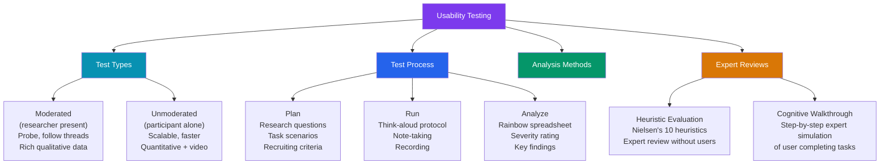

# Usability Testing

> [!abstract] TL;DR
> **Usability testing** evaluates whether users can accomplish tasks with a design. It is **evaluative** research — you test a specific solution rather than exploring a problem space. Key decisions: moderated vs unmoderated, in-person vs remote, prototype vs live product. **Think-aloud protocol** surfaces the user's mental model in real time. Analysis uses the **rainbow spreadsheet** to map findings across participants and **severity ratings** to prioritize fixes. Expert methods — **heuristic evaluation** (Nielsen's 10) and **cognitive walkthrough** — identify issues without recruiting participants. Five users reveal ~85% of qualitative usability issues.

## Intuition — analogy FIRST

Usability testing is like a **flight simulator for your UI**. You don't put passengers on a plane to discover the landing controls are confusing — you test in a simulator first. Usability tests let users "crash" your prototype before it goes to production, revealing navigation failures, confusing labels, and interaction gaps while the cost of change is still low.

The critical mindset: **you are testing the design, not the user**. There are no wrong answers from participants. If a user fails a task, the design failed — not the user.

---

## How It Works



---

## Key Concepts / Details

### Usability Testing Types

```
MODERATED vs UNMODERATED:

Moderated:
  Researcher is present (video call or same room)
  Can ask follow-up questions, probe on hesitations, clarify misunderstandings
  Richer qualitative data: understand WHY users struggled
  Slower: 1 participant at a time, scheduling required
  Best for: complex tasks, early-stage concepts, sensitive topics
  Tools: Lookback, Zoom + Lookback plugin, UserZoom

Unmoderated:
  Participant completes tasks alone, recorded by software
  Scalable: run 20+ participants simultaneously
  Faster: results in 24-48 hours (UserTesting panel)
  Less rich: can't probe — just observe behavior + hear think-aloud
  Best for: specific task validation, larger sample sizes, quick turnaround
  Tools: UserTesting, Maze, Lookback (async), Useberry

IN-PERSON vs REMOTE:
  In-person: best for observing body language, environmental context, hardware testing
  Remote: most common (easier to recruit, no travel, participants in their natural env)
  
PROTOTYPE vs LIVE PRODUCT:
  Low-fi prototype (wireframes): test information architecture, labeling, navigation
  High-fi prototype (Figma interactive): test visual design, micro-interactions
  Live product (staging): test actual functionality, real data edge cases
  
  Rule: test as early as possible — paper prototypes work for IA testing
```

### Task Design

```
REALISTIC TASK SCENARIOS:
  A task gives the participant a goal without revealing the navigation path.
  
  BAD (leading): "Click the 'Settings' link in the top navigation to update your profile"
  GOOD: "You've joined a new company and need to update your job title. Show me how you would do that."
  
  BAD (ambiguous): "Explore the site and tell me what you think"
  GOOD: "Imagine you want to invite a teammate to collaborate on your project. Go ahead."

TASK CHARACTERISTICS:
  - Realistic: based on actual user goals from research
  - Specific: has a clear start and end point
  - Measurable: success is unambiguous (task complete vs. gave up)
  - Not leading: doesn't reveal where to click
  - Not hypothetical: "Would you..." → "Please do..."

SUCCESS CRITERIA:
  Define before running what counts as success:
    Direct success: user completes task without assistance or backtracking
    Indirect success: user completes with some backtracking but no assistance
    Failure: user cannot complete task, gives up, or needs researcher hint
  
  Example: "Task: Find the price for the Pro plan"
    Success: user navigates to Pricing page and identifies $49/mo
    Failure: user cannot locate the price after 3 minutes

THINK-ALOUD PROTOCOL:
  Instruct participants to verbalize their thoughts continuously:
  "As you work through each task, please say out loud what you're thinking —
   what you're looking at, what you expect will happen when you click something,
   any questions or confusion you have. There are no wrong answers."
  
  Prompt if they go quiet: "What are you thinking right now?"
  DO NOT help: "Oh, it's in the top right" is contaminating the test
  DO probe: "You hesitated there — what were you thinking?" (after task)
  
  Retrospective think-aloud: participant watches their own recording and narrates
  (better for tasks requiring concentration — not interrupted by speaking)
```

### Recording and Note-Taking

```
WHAT TO RECORD:
  Video: participant's face (reactions) + screen recording
  Audio: think-aloud narration
  Tools: Lookback (captures both automatically), Zoom + OBS, UserTesting (built-in)

NOTE-TAKING:
  Note-taker role is separate from facilitator role
  What to log:
    Verbatim quotes (exact words the participant used)
    Behavioral observations ("hovered over Settings for 4 seconds")
    Task completion outcome (success/failure/time)
    Emotional reactions (confusion, frustration, delight)
  What NOT to log:
    Interpretations during the session ("they seemed confused about navigation")
    → wait until debrief to interpret; note raw observation only

DEBRIEFING:
  Within 30 minutes after each session, while memory is fresh:
    Facilitator + note-taker discuss what happened
    Tag each note: which task + which screen + issue type (navigation/labeling/comprehension/interaction)
    Flag the most critical moments for clip-cutting (Lookback/Dovetail)
```

### Analyzing Results

```
RAINBOW SPREADSHEET (Steve Krug method):
  A spreadsheet with participants as columns and issues as rows.
  
  Structure:
    Row per issue found
    Column per participant (P1, P2, P3, P4, P5)
    Cell: colored dot if that participant encountered the issue (rainbow = different colors per participant)
  
  Issues encountered by 3+ participants → high-priority finding
  Issues found by only 1 participant → low priority / edge case
  
  Example:
    Issue                        | P1 | P2 | P3 | P4 | P5 |
    Can't find Settings          | ● |    | ● | ● | ● | → 4 users = high priority
    Confused by "Workspace" label | ● | ● |    | ● |    | → 3 users = medium priority
    Missed tooltip on hover      |    |    |    |    | ● | → 1 user = low priority

SEVERITY RATING (Nielsen's scale):
  0: Not a usability problem
  1: Cosmetic — fix only if time allows
  2: Minor — low priority fix
  3: Major — important to fix, high priority
  4: Catastrophic — must be fixed before launch (task failure, data loss risk)
  
  Calculate: Severity = f(Frequency) + f(Impact) + f(Persistence)
  Frequency: how many users hit it?
  Impact: how bad is it when they hit it? (confusion vs task failure)
  Persistence: does it happen once or every time they use this feature?

AFFINITY CLUSTER FOR SYNTHESIS:
  After 5 sessions: dump all tagged observations onto sticky notes
  Cluster by similarity: all "navigation confusion" issues together
  Name the theme: "Users can't distinguish Settings from Preferences"
  Prioritize by frequency × severity
  Write 3-5 key findings + recommended design changes
```

### Tools

```
RECRUITMENT TOOLS:
  UserTesting panel:   self-serve panel, 100k+ screened participants
  Respondent.io:       for niche B2B segments (engineers, finance, healthcare)
  Prolific:            academic-grade recruitment, faster + higher quality
  Maze panel:          integrated with Maze prototype testing
  Your own customers:  email invite, Intercom, in-app banner; higher quality, slower

UNMODERATED TEST TOOLS:
  UserTesting:   video recordings, preset tasks, transcription, AI insights
  Maze:          integrates Figma prototypes, quantitative task data + video
  Useberry:      Figma integration, click maps per task, drop-off analytics
  Lookback:      both moderated and async, excellent clip-sharing

MODERATED TEST TOOLS:
  Lookback:    live observer room, annotation during session, cloud recordings
  UserZoom:    enterprise tool, moderated + unmoderated + analytics
  Zoom + OBS:  free option — Zoom call for participant, OBS records screen
  Dovetail:    analysis + synthesis (tag insights, create clips, share highlights)

ANALYSIS TOOLS:
  Dovetail: tag observations, auto-transcription, clip sharing, insight repositories
  Notion / Confluence: lightweight research log
  FigJam: affinity mapping post-session
  Airtable: custom research database for large-scale programs
```

### Heuristic Evaluation

```
A structured expert review using Nielsen's 10 heuristics.
3-5 expert reviewers evaluate the interface independently, then compare.
Produces issues WITHOUT recruiting participants — cheaper, faster.

NIELSEN'S 10 USABILITY HEURISTICS:

1. Visibility of system status
   System should always keep users informed (progress bars, loading states, confirmations)
   Violation: no feedback after clicking Submit — did it work?

2. Match between system and real world
   Speak the user's language, not internal jargon
   Violation: "Populate the repository configuration" → "Set up your repository"

3. User control and freedom
   Support undo and redo; let users leave unwanted states
   Violation: no "Cancel" button during a multi-step wizard

4. Consistency and standards
   Follow platform conventions; don't make users learn new patterns
   Violation: Back button navigates forward; Save is under "File > Commit"

5. Error prevention
   Design to prevent errors before they occur
   Example: disable Submit button until required fields are filled
   Example: confirm dialog before permanent deletion

6. Recognition over recall
   Minimize the user's memory load; make options visible
   Violation: command-line tool with no autocomplete
   Good: dropdown showing all available options

7. Flexibility and efficiency of use
   Accelerators for expert users (keyboard shortcuts, type-ahead)
   Example: Vim keybindings in a code editor

8. Aesthetic and minimalist design
   Every extra element competes for attention; remove the unnecessary
   Violation: modal with 5 buttons, 3 icons, and 200-word body text

9. Help users recognize, diagnose, recover from errors
   Error messages: plain language, describe the problem, suggest a solution
   Violation: "Error 400 — Bad Request" vs "Email address is already in use. Sign in instead →"

10. Help and documentation
    If documentation is needed, make it easy to find and task-focused
    Example: contextual help tooltip next to complex settings

HOW TO RUN:
  1. Brief reviewers on the context (who the user is, what the task is)
  2. Each reviewer independently walks through the interface for 1-2 hours
  3. Log each issue: heuristic violated, screen, severity rating, suggested fix
  4. Aggregate into a prioritized findings list
  5. Present to product team with screenshots and severity ratings

WHEN TO USE HEURISTIC EVALUATION:
  - Early design review (before investing in full usability test)
  - Post-usability test expert layer
  - When participant recruiting is difficult (enterprise, specialized users)
  - Quick pass on a competitor's product for benchmarking
```

### Cognitive Walkthrough

```
PURPOSE: evaluate learnability — can a new user figure out the interface without training?

METHOD:
  1. Define a persona (new user, no prior experience)
  2. Define a task (goal-based scenario)
  3. Walk through every action step by step, asking four questions:
     a. Will the user know what to do at this step?
     b. Will the user notice the correct action/control?
     c. Will the user associate the correct action with the right effect?
     d. After completing the action, will the user understand the progress made?
  4. Flag failures at any step

WHEN A STEP FAILS:
  a. Fails: label is ambiguous, control is hidden or unexpected
  b. Fails: low visual affordance, not in expected location
  c. Fails: action name doesn't match expected outcome
  d. Fails: no success feedback, unclear what happened

HOW MANY PARTICIPANTS:
  Qualitative (interviews, moderated usability): 5-8 participants reveal 80-85% of issues
  Unmoderated (Maze, UserTesting): 20-30 for quantitative reliability
  A/B test: calculated by statistical power (minimum detectable effect size)
  Heuristic evaluation: 3-5 experts (diminishing returns after 5)
  Tree testing: 15-20 participants per test for statistically reliable task success rates
```

---

## Real-World Notes

- **The 5-user rule** (Jakob Nielsen, 1993) is specifically for finding qualitative usability issues within a single user segment. It does NOT apply to: quantitative testing, multiple user segments (each needs 5), or statistical significance.
- **Unmoderated testing has changed the field** — Maze and UserTesting allow designers to run a 5-participant test within 24 hours for $100-300. This removes the "no time/budget for testing" excuse.
- **Consent and privacy**: always get informed consent before recording. In moderated tests: verbal + written consent form. In unmoderated: consent via platform (UserTesting handles this).
- **Test early, test often**: a 30-minute test on paper wireframes is 100x cheaper than fixing issues post-launch. Sprint review = "did we build the thing right?"; usability test = "did we build the right thing?"

---

## Common Pitfalls

- **Leading questions during tests** — "Did you find that confusing?" biases toward yes. Ask neutral: "What were you thinking when you saw that?"
- **Testing too late** — running usability tests 2 weeks before launch when findings can't influence the design. Test wireframes, not final designs.
- **"Would you use this?" at the end** — users say yes to be polite. Behavioral data (did they complete the task?) is more reliable than stated preference.
- **Hiring participants who know your product** — power users can navigate around IA problems that stump new users. Test with your actual target user segment.

---

## Related Concepts

- [[_MOC_Product_Design_Master|↑ Product Design Master MOC]]
- [[User_Research_Methods]] — Usability testing is evaluative; user interviews are generative
- [[UX_Patterns]] — Test whether your pattern choices work for your users
- [[Figma_Advanced]] — Figma prototypes are the artifact used in usability tests

---

## Review Questions

1. What is the difference between moderated and unmoderated usability testing? Give a use case for each.
2. Why is "Click the Settings link to update your profile" a bad task instruction?
3. What is a rainbow spreadsheet and how is it used to prioritize usability findings?
4. Name 5 of Nielsen's 10 usability heuristics and give a real UI example of each violation.
5. What is the "5-user rule"? What are its limitations?

---

## Sources

- Jakob Nielsen: How Many Test Users? — https://www.nngroup.com/articles/how-many-test-users/
- Nielsen Norman Group: Heuristic Evaluation — https://www.nngroup.com/articles/ten-usability-heuristics/
- Steve Krug: Rocket Surgery Made Easy — https://sensible.com/rocket-surgery-made-easy/
- Maze: The State of User Research — https://maze.co/user-research/

#product-design #usability-testing #heuristic-evaluation #think-aloud #rainbow-spreadsheet #ux-research
