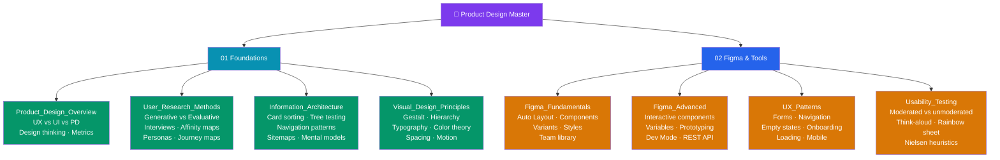

# Product Design — Master Map of Content

> [!abstract] About This Vault
> A practitioner-focused reference for designers and engineers working on digital products. **17 notes across 2 sections**, covering the full product design spectrum: the design thinking process, user research methods, information architecture, visual design principles, Figma (fundamentals and advanced), UX patterns, and usability testing. Every note pairs conceptual frameworks with practical tools, code examples (where applicable), trade-off tables, common pitfalls, and review questions. Follow one of the learning paths below, or jump directly to the topic you need.

## Vault Architecture

## Sections at a Glance

| # | Section | Notes | Entry Point | Difficulty |
|---|---------|-------|-------------|------------|
| 01 | Foundations | 4 | [[Product_Design_Overview]] | Beginner → Intermediate |
| 02 | Figma and Tools | 4 | [[Figma_Fundamentals]] | Intermediate → Advanced |

---

## Learning Paths

### Path A — UX Designer

> Best for: designers focused on research, strategy, and the end-to-end user experience before the visual layer.

**Research → IA → Patterns → Testing**

[[Product_Design_Overview]] → [[User_Research_Methods]] → [[Information_Architecture]] → [[UX_Patterns]] → [[Usability_Testing]]

1. Start with [[Product_Design_Overview]] to understand the full scope of product design, the design thinking framework, and how UX/UI/product design differ.
2. [[User_Research_Methods]] — master the methods: generative vs evaluative, user interviews, affinity mapping, personas, journey maps.
3. [[Information_Architecture]] — learn to structure content: card sorting, tree testing, navigation patterns, sitemaps.
4. [[UX_Patterns]] — apply proven solutions: forms, empty states, onboarding, mobile patterns, loading states.
5. [[Usability_Testing]] — validate your designs: moderated/unmoderated, think-aloud, rainbow spreadsheet, heuristic evaluation.

---

### Path B — UI Designer

> Best for: designers focused on visual design, component creation, and Figma mastery.

**Visual Principles → Figma Fundamentals → Figma Advanced → Patterns**

[[Visual_Design_Principles]] → [[Figma_Fundamentals]] → [[Figma_Advanced]] → [[UX_Patterns]]

1. [[Visual_Design_Principles]] — internalize Gestalt, visual hierarchy, typography, color theory, spacing systems, and motion.
2. [[Figma_Fundamentals]] — master Auto Layout, components, variants, component properties, styles, and team libraries.
3. [[Figma_Advanced]] — build interactive prototypes, use Variables for design tokens and dark mode, leverage Dev Mode for handoff, use the REST API.
4. [[UX_Patterns]] — apply visual design to proven UI patterns: navigation, forms, loading states, mobile.

---

### Path C — Product Designer Going Full-Stack

> Best for: product designers who want to collaborate deeply with engineering and understand the code layer.

**Full Design → Cross-vault: Design System + Web Dev**

[[Product_Design_Overview]] → [[Visual_Design_Principles]] → [[Figma_Fundamentals]] → [[Figma_Advanced]] → [[_MOC_Design_System]] → [[Design_Tokens]] → [[Component_Library]] → [[Accessibility_Standards]] → [[Storybook_and_Testing]]

1. Complete the Product Design vault for the design fundamentals.
2. Cross to [[_MOC_Design_System]] in Web Development — learn how design tokens, component libraries, and Storybook documentation operationalize design decisions in code.
3. [[Design_Tokens]] — understand how your Figma Variables become CSS custom properties via Style Dictionary.
4. [[Component_Library]] — understand how components are built in React/Vue with CVA, forwardRef, and the asChild pattern.
5. [[Accessibility_Standards]] — WCAG requirements and automated testing with axe-core.

---

## Cross-Vault Links

- **Web Development vault** → [[_MOC_Design_System]] — Design systems bridge product design and engineering; tokens, components, and Storybook documentation.
- **Web Development vault** → [[_MOC_HTML_CSS]] — CSS custom properties power the token system that implements visual design decisions.
- **AI/ML vault** → [[_MOC_AI_ML_Master]] — AI-assisted design tools (Figma AI, generative UI, LLM-powered research synthesis).
- **System Design vault** → [[_MOC_SystemDesign_Master]] — Frontend architecture decisions affect product design constraints.

---

## Section MOC Index

- [[Product_Design_Overview]] — The discipline: UX vs UI vs Product Design, design thinking (Empathize/Define/Ideate/Prototype/Test), designer responsibilities, tool ecosystem (Figma, Framer, Maze, Hotjar), developer handoff, design impact metrics and HEART framework.
- [[User_Research_Methods]] — Research types (generative vs evaluative), qualitative methods (interviews, contextual inquiry, diary studies, card sorting), quantitative (surveys, A/B tests, heatmaps), recruiting, think-aloud, synthesis (affinity mapping, personas, empathy maps, journey maps).
- [[Information_Architecture]] — IA components (organization/labeling/navigation/search), mental models, card sorting (open/closed, OptimalSort), tree testing (Treejack), navigation patterns (tabs, hamburger, breadcrumbs, faceted search), mobile IA (tab bar), sitemaps, content audits.
- [[Visual_Design_Principles]] — Gestalt (proximity, similarity, continuity, closure, figure/ground, common fate), visual hierarchy (size/weight/color/whitespace), typography (scale, pairing, line length, leading), color theory (60-30-10, accessible palettes, dark mode), spacing systems (4px/8px grid), motion design (purposes, duration/easing, prefers-reduced-motion).
- [[Figma_Fundamentals]] — Architecture (vector network, multiplayer), frames vs groups vs sections, Auto Layout (Fill/Hug/Fixed, padding, gap, align), constraints, components and instances, variants, component properties (boolean/text/instance swap), styles (color/text/effect/grid), team library.
- [[Figma_Advanced]] — Interactive components (state machine inside component, trigger types), prototyping (frame connections, smart animate, overlays, scroll), variables (color/string/number/boolean, collections/modes for light/dark), conditionals in prototyping, Dev Mode (inspect/compare/code snippets), FigJam, REST API.
- [[UX_Patterns]] — Forms (progressive disclosure, inline validation, multi-step wizards), navigation (tabs, accordions, breadcrumbs, pagination vs infinite scroll vs load more), empty states (first-use/error/no-results), onboarding (product tours, contextual tooltips, checklists), error handling UI (404/500/network), loading states (skeleton screens, optimistic UI), mobile (bottom sheets, pull-to-refresh, gestures, tab bar).
- [[Usability_Testing]] — Testing types (moderated/unmoderated, in-person/remote, prototype/live), task design, think-aloud protocol, recording/note-taking, rainbow spreadsheet analysis, severity rating, tools (UserTesting/Maze/Lookback/Dovetail), heuristic evaluation (Nielsen's 10), cognitive walkthrough, how many participants.

#MOC #ProductDesign #MasterMOC
