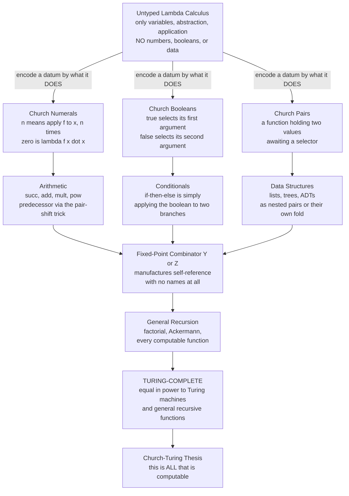

# λ Church Encodings and Computability

> [!abstract] TL;DR
> The untyped **lambda calculus** has *only functions* — no numbers, no booleans, no lists, no records. Alonzo Church's escape hatch is dazzling: represent every piece of data by *what it does*. The number `n` becomes "a function that applies another function `n` times"; `TRUE` becomes "a chooser that returns its first option"; a pair becomes "a function holding two values until a selector arrives." Layered up — numerals, booleans, pairs, arithmetic (including the famously tricky **predecessor**), and recursion via a **fixed-point combinator** — these encodings let the lambda calculus compute *any computable function*. That is the constructive proof that it is **Turing-complete**, equal in power to Turing machines and the general recursive functions, and one of the three pillars of the **Church-Turing thesis**. The lesson that echoes through all of functional programming: **data is behaviour in disguise.**

---

## Intuition

**Analogy — a language with only verbs, no nouns.** Imagine a tribe whose entire vocabulary is *verbs* — actions — with no words for objects at all. You want to say "three apples," but there is no word for "three" and no word for "apple." How could you ever communicate a *quantity*? The clever trick: instead of naming the number three, you describe **what three does** — "clap, then clap, then clap." Three is no longer a thing; it is "do-this-three-times." Want to add three and two? "Do-it-three-times, then do-it-two-more-times." The noun *three* has dissolved into a pattern of *doing*.

That is exactly Church's move. The lambda calculus is a language of pure verbs — functions taking functions returning functions — with no nouns. So Church encodes each datum by the *action it embodies*. The number `n` is the verb "apply some function `f` to a seed `x`, exactly `n` times." A boolean is the verb "given two options, choose one." A pair is the verb "hold two things and hand them to whoever asks." Once you accept that **data IS behaviour**, the seemingly impossible — arithmetic, logic, data structures, and full recursion out of *nothing but functions* — becomes not only possible but elegant, and it proves the tiny calculus can compute anything a computer can.

---

## How It Works

### Core Mechanics

**1. The problem — a universe with only functions.** The untyped lambda calculus (see the companion note *The_Lambda_Calculus* in this section) has just three constructs: variables `x`, abstraction `λx. E` (make a function), and application `E₁ E₂` (call a function). Its single computation rule is **beta-reduction** — substitute the argument into the body. There are *no* primitive numbers, booleans, or data structures. Anything you want to compute *with* must first be **encoded as a function**. Church's insight: encode a datum by the behaviour it triggers, not by any intrinsic "value."

**2. Church numerals — a number is an iterator.** Encode the natural number `n` as a higher-order function that takes a function `f` and a base `x` and applies `f` to `x` exactly `n` times:

- `0 = λf.λx. x` (apply `f` zero times — just return the seed)
- `1 = λf.λx. f x` (apply once)
- `2 = λf.λx. f (f x)` (apply twice)
- `3 = λf.λx. f (f (f x))` (three times)

**Iteration is the core idea** — a numeral *is* a controlled loop. From this, arithmetic falls out as pure function plumbing:

- **Successor** `SUCC = λn.λf.λx. f (n f x)` — run `n`'s `f`-applications, then do one more.
- **Addition** `ADD = λm.λn.λf.λx. m f (n f x)` — apply `f` `n` times, then `m` more times.
- **Multiplication** `MUL = λm.λn.λf. m (n f)` — compose "`n` applications of `f`" a total of `m` times.
- **Exponentiation** `POW = λb.λe. e b` — startlingly, `bᵉ` is just "apply `b` to itself `e` times" at the numeral level.

**3. The famously tricky predecessor.** Successor is trivial, but **going backwards is hard**: a numeral only knows how to move *forward* (apply `f` again), and it never stored `n-1`. Kleene's celebrated solution (reportedly discovered at the dentist) uses a **pair** as a sliding window. Start from the pair `(0, 0)` and repeatedly apply `φ(a, b) = (b, b+1)`. After `n` steps the pair holds `(n-1, n)`; take the *first* component. Subtraction then follows as "apply `PRED` `n` times" — and it saturates at zero (**monus**), because there are no negative Church numerals. The awkwardness of `PRED` is a first hint that *the choice of encoding matters* for efficiency.

**4. Church booleans — a boolean is a selector.** A truth value is encoded as a two-argument chooser:

- `TRUE = λa.λb. a` (return the **first** option)
- `FALSE = λa.λb. b` (return the **second** option)

Because the boolean *is already* the mechanism of choice, a conditional needs no special syntax: `IF p a b = p a b`. The boolean literally selects the branch. The logical connectives are then one-liners: `AND = λp.λq. p q FALSE`, `OR = λp.λq. p TRUE q`, `NOT = λp. p FALSE TRUE`, and a zero-test `ISZERO = λn. n (λ_. FALSE) TRUE`. (In a strict language the two branches must be wrapped in thunks so only the chosen one runs — see Pitfalls.)

**5. Pairs, lists, and the deep data/recursion link.** A **pair** holds two values and waits for a selector to pick one: `PAIR = λa.λb.λs. s a b`, with `FST = λp. p TRUE` and `SND = λp. p FALSE`. Nest pairs and you get **lists** (cons-cells), and nest further for **trees**. More profoundly, *any* algebraic data type can be Church-encoded as **its own fold (eliminator / catamorphism)** — a value is represented by the function that says how to consume it. A list `[a, b, c]` becomes `λc.λn. c a (c b (c n))` — literally its own `foldr`. This is the Böhm-Berarducci result: **data and its recursion scheme are the same thing**, the computational shadow of the *initial-algebra* view of data types ([[Category_Theory]]).

**6. Recursion with no names — fixed-point combinators.** A lambda term has no name, so it cannot call itself directly. Recursion is recovered by a **fixed-point combinator** satisfying `Y F = F (Y F)`: feed a function a copy of itself and self-reference *emerges* from substitution. Combining a fixed point with the encodings above lets us write genuinely recursive functions — `factorial`, `fibonacci`, even the Ackermann function — proving the calculus reaches **general recursion**, not just bounded loops (see the companion note *Combinatory_Logic_and_Fixed_Points* in this section, and [[Recursive_Functions_and_Lambda_Calculus]]).

**7. Turing-completeness and the Church-Turing thesis.** With numerals, booleans, pairs, and fixed-point recursion, the lambda calculus can express **every computable function**. Turing himself (1936) proved the lambda calculus and Turing machines compute exactly the same class, and both coincide with Kleene's general recursive functions. That three utterly different formalisms — a tape-and-head machine, pure symbol substitution, and arithmetic recursion — carve out the *identical* set is the strongest evidence for the **Church-Turing thesis**: "effectively computable" is a robust, model-independent notion ([[Turing_Machines_and_the_Church_Turing_Thesis]], [[The_Limits_of_Computation]]).

**8. Scott encoding and the trade-offs.** Church encoding makes iteration natural but pattern-matching (and `PRED`) awkward and `O(n)`. The **Scott encoding** flips the priority: it encodes a datum by *how to pattern-match on its constructor*, giving `O(1)` predecessor and clean case-analysis, at the cost of needing a fixed point to fold. Both are correct; they optimise different operations. This is precisely why **real languages ship built-in primitive data and native ADTs** — the encodings prove the *theoretical minimum* (functions alone suffice), but primitives exist for **efficiency** (constant-time arithmetic, unboxed integers, `O(1)` field access). Typed languages further prefer native ADTs because uniformly typing Church encodings needs impredicative polymorphism (System F), which the companion note *Type_Systems_Fundamentals* explores.

### Flow / Architecture



*Every rung is built from the one primitive the calculus offers — the function. Encode data as behaviour, add fixed-point recursion, and you reach the outer boundary of computation.*

---

## Key Concepts

### Secondary (intuitive, no CS background needed)

- **Numbers as verbs.** The number three is not a thing but an instruction: "do this three times." Addition is "do the first batch, then the second."
- **Booleans as choosers.** `TRUE` and `FALSE` are little decision-makers: hand each two options and `TRUE` keeps the first, `FALSE` keeps the second. An `if` is just handing your two branches to the boolean.
- **A pair is a butler.** It quietly holds two things and gives you whichever you ask for.
- **The big claim.** With only functions — no built-in data at all — you can still compute *everything a computer can*. Data is behaviour in disguise.

### Undergraduate (a first PL / theory course)

- **Church numerals** `n = λf.λx. fⁿ x`; `SUCC`, `ADD`, `MUL`, `POW` as function composition; iteration as the primitive operation.
- **The predecessor problem** and Kleene's pair-based `(n-1, n)` sliding-window trick; subtraction as iterated `PRED`; saturating **monus** at zero.
- **Church booleans** as selectors; `IF`, `AND`, `OR`, `NOT`, `ISZERO`; the need for **thunked branches** under strict (call-by-value) evaluation.
- **Church pairs / lists / trees**; the encoding of an ADT as **its own fold / eliminator** (`foldr` for lists).
- **Fixed-point combinators** `Y` (call-by-name) and `Z` (call-by-value); recursion without self-reference; writing `factorial` and `fib`.
- **Turing-completeness**: numerals + booleans + pairs + recursion ⇒ every computable function; equivalence with Turing machines and recursive functions.

### Graduate (type theory / advanced PLT)

- **Böhm-Berarducci encoding**: every (positive) inductive type is *exactly* its Church encoding — the polymorphic type of its fold in **System F**; the isomorphism between initial algebras and their catamorphisms ([[Category_Theory]]).
- **Church vs Scott vs Parigot encodings**: iteration-friendly vs pattern-match-friendly vs `O(1)`-predecessor-with-recursor; the space/time trade-offs and self-interpretation consequences.
- **Impredicativity**: typing Church numerals uniformly requires `∀X. (X → X) → X → X`, an *impredicative* System F type; the simply typed lambda calculus can type each numeral but not the generic fold, and (being strongly normalizing) is deliberately *not* Turing-complete.
- **Final tagless / finally tagless** style (Carette-Kiselyov-Shan): the modern typed descendant of Church encoding — represent data by a polymorphic interpreter interface, dissolving the "expression problem."
- **Curry-Howard view**: Church-encoded data corresponds to the elimination principle of the matching logical connective; the fold *is* the induction principle.

---

## Python Demo

```python
# Church encodings in pure Python: DATA BUILT ENTIRELY FROM FUNCTIONS.
#
# The lambda calculus offers only functions -- so we build numbers, booleans,
# pairs, arithmetic (incl. the tricky PREDECESSOR), and full recursion
# (factorial via a fixed-point combinator) out of nothing but Python lambdas,
# then DECODE each result and check it against native Python ints/bools.
#
# Pure stdlib + matplotlib only (no numpy). The whole point is that Python
# arithmetic never touches the Church values until the final decode step.

import sys
import matplotlib.pyplot as plt

sys.setrecursionlimit(100000)   # decoding large numerals recurses deeply

# ======================================================================
# CHURCH NUMERALS: n = "apply f to x, exactly n times"
# ======================================================================
ZERO = lambda f: lambda x: x                       # apply f zero times
SUCC = lambda n: lambda f: lambda x: f(n(f)(x))    # one more application of f

# Arithmetic as pure function plumbing -- still only lambdas:
ADD = lambda m: lambda n: lambda f: lambda x: m(f)(n(f)(x))   # n f's then m f's
MUL = lambda m: lambda n: lambda f: m(n(f))                   # compose n, m times
POW = lambda b: lambda e: e(b)                               # b^e = apply b, e times

ONE = SUCC(ZERO)

# Build any native int into a Church numeral (uses only ZERO and SUCC):
def to_church(k):
    return ZERO if k == 0 else SUCC(to_church(k - 1))

# Decode a Church numeral to a Python int by feeding it "add 1" and seed 0:
church_to_int = lambda n: n(lambda k: k + 1)(0)

# ======================================================================
# CHURCH BOOLEANS: a boolean IS a selector (an if-statement)
# ======================================================================
TRUE  = lambda a: lambda b: a          # pick the first option
FALSE = lambda a: lambda b: b          # pick the second option
IF    = lambda p: lambda a: lambda b: p(a)(b)      # the boolean selects a branch
AND   = lambda p: lambda q: p(q)(FALSE)
OR    = lambda p: lambda q: p(TRUE)(q)
NOT   = lambda p: p(FALSE)(TRUE)
ISZERO = lambda n: n(lambda _: FALSE)(TRUE)        # any application -> FALSE

church_bool = lambda p: p(True)(False)             # decode to a Python bool

# ======================================================================
# CHURCH PAIRS: a function that holds two values until a selector arrives
# ======================================================================
PAIR = lambda a: lambda b: lambda s: s(a)(b)       # cons
FST  = lambda p: p(TRUE)                            # hand the pair the "first" selector
SND  = lambda p: p(FALSE)

# ======================================================================
# THE TRICKY PREDECESSOR (Kleene's pair-shift trick) + SUBTRACTION
# Repeatedly apply phi(a, b) = (b, b + 1) starting from (0, 0);
# after n steps the pair is (n-1, n), so FST gives the predecessor.
# ======================================================================
PHI  = lambda p: PAIR(SND(p))(SUCC(SND(p)))
PRED = lambda n: FST(n(PHI)(PAIR(ZERO)(ZERO)))
SUB  = lambda m: lambda n: n(PRED)(m)              # apply PRED to m, n times (monus)

# ======================================================================
# RECURSION WITH NO NAME: the Z (applicative-order Y) fixed-point combinator.
# FACT's body only ever mentions a parameter 'rec' -- never its own name.
# Branches are wrapped in thunks (lambda _: ...) so only the chosen one runs.
# ======================================================================
Z = lambda f: (lambda x: f(lambda v: x(x)(v)))(lambda x: f(lambda v: x(x)(v)))

FACT = Z(lambda rec: lambda n:
         IF(ISZERO(n))
           (lambda _: ONE)
           (lambda _: MUL(n)(rec(PRED(n))))
         (ZERO))                                   # (ZERO) forces the chosen thunk

# ======================================================================
# VERIFY every encoding against native Python
# ======================================================================
def check(label, got, expected):
    ok = "OK" if got == expected else "FAIL"
    print(f"  {label:22} = {str(got):6} expected {str(expected):6} [{ok}]")

print("=== Numerals & arithmetic (computed with pure function application) ===")
check("church_to_int(3)", church_to_int(to_church(3)), 3)
check("add(2, 3)",  church_to_int(ADD(to_church(2))(to_church(3))), 5)
check("mult(3, 4)", church_to_int(MUL(to_church(3))(to_church(4))), 12)
check("pow(2, 5)",  church_to_int(POW(to_church(2))(to_church(5))), 32)
check("pred(5)",    church_to_int(PRED(to_church(5))), 4)
check("pred(0)",    church_to_int(PRED(to_church(0))), 0)
check("sub(9, 4)",  church_to_int(SUB(to_church(9))(to_church(4))), 5)
check("sub(4, 9)",  church_to_int(SUB(to_church(4))(to_church(9))), 0)   # monus

print("\n=== Booleans (booleans ARE selectors) ===")
check("AND true false", church_bool(AND(TRUE)(FALSE)), False)
check("OR  false true", church_bool(OR(FALSE)(TRUE)),  True)
check("NOT true",       church_bool(NOT(TRUE)),        False)
check("iszero(0)",      church_bool(ISZERO(ZERO)),     True)
check("iszero(3)",      church_bool(ISZERO(to_church(3))), False)
print(f"  IF true 'yes' 'no'      = {IF(TRUE)('yes')('no')!r:6} expected 'yes'")

print("\n=== Pairs ===")
p = PAIR(to_church(7))(to_church(9))
check("fst (7, 9)", church_to_int(FST(p)), 7)
check("snd (7, 9)", church_to_int(SND(p)), 9)

print("\n=== Recursion via the Z fixed-point combinator (Turing-completeness) ===")
for k in range(6):
    check(f"factorial({k})", church_to_int(FACT(to_church(k))),
          [1, 1, 2, 6, 24, 120][k])

# ======================================================================
# VISUALIZE: (left) a Church numeral applying f repeatedly, and
#            (right) the encoding <-> native-int correspondence for arithmetic.
# ======================================================================
# Instrument a concrete f so we can watch numeral 5 apply it five times:
trace = []
def doubler(x):
    y = x * 2
    trace.append(y)
    return y

seed = 1
FIVE = to_church(5)
FIVE(doubler)(seed)                 # triggers exactly 5 recorded applications
steps = list(range(len(trace) + 1))
values = [seed] + trace             # value after 0, 1, ..., 5 applications

# Arithmetic correspondence: Church-decoded result vs native result (must match)
ops = [
    ("add\n2,3",  church_to_int(ADD(to_church(2))(to_church(3))), 2 + 3),
    ("mult\n3,4", church_to_int(MUL(to_church(3))(to_church(4))), 3 * 4),
    ("pow\n2,5",  church_to_int(POW(to_church(2))(to_church(5))), 2 ** 5),
    ("pred\n6",   church_to_int(PRED(to_church(6))), 6 - 1),
    ("sub\n9,4",  church_to_int(SUB(to_church(9))(to_church(4))), 9 - 4),
    ("fact\n5",   church_to_int(FACT(to_church(5))), 120),
]
labels   = [o[0] for o in ops]
church_v = [o[1] for o in ops]
native_v = [o[2] for o in ops]

fig, (ax1, ax2) = plt.subplots(1, 2, figsize=(13, 5.5))

# --- Left: numeral 5 = "apply f five times" ---
ax1.step(steps, values, where="post", color="#1f77b4", lw=2)
ax1.plot(steps, values, "o", color="#1f77b4", ms=9)
for s, v in zip(steps, values):
    ax1.annotate(str(v), (s, v), textcoords="offset points",
                 xytext=(0, 10), ha="center", fontsize=10)
ax1.set_title("Church numeral 5 applies f (double) exactly 5 times\n"
              "5 = lambda f x . f(f(f(f(f x))))", fontsize=11)
ax1.set_xlabel("number of applications of f")
ax1.set_ylabel("value  (seed = 1, f = x -> 2x)")
ax1.set_xticks(steps)
ax1.grid(True, ls=":", alpha=0.5)

# --- Right: Church-encoded arithmetic matches native arithmetic ---
xpos = list(range(len(ops)))
w = 0.38
ax2.bar([x - w / 2 for x in xpos], church_v, width=w,
        label="Church-decoded", color="#ff7f0e")
ax2.bar([x + w / 2 for x in xpos], native_v, width=w,
        label="native Python", color="#2ca02c", alpha=0.7)
for x, cv in zip(xpos, church_v):
    ax2.annotate(str(cv), (x - w / 2, cv), textcoords="offset points",
                 xytext=(0, 3), ha="center", fontsize=8)
ax2.set_title("Encodings agree with native arithmetic\n"
              "(pure lambdas computed every orange bar)", fontsize=11)
ax2.set_xticks(xpos)
ax2.set_xticklabels(labels, fontsize=9)
ax2.set_ylabel("result")
ax2.legend()
ax2.grid(True, axis="y", ls=":", alpha=0.5)

plt.tight_layout()
plt.savefig("church_encodings.png", dpi=130)
print("\nSaved visualization to church_encodings.png")
```

Running it prints `OK` for every arithmetic, boolean, pair, and factorial check — `mult(3, 4) = 12`, `pow(2, 5) = 32`, `pred(5) = 4`, `sub(4, 9) = 0` (monus saturates), and `factorial(5) = 120` produced by a function that **never names itself** (the `Z` combinator manufactures the recursion). The saved figure shows, on the left, the numeral `5` mechanically applying `double` five times (`1 → 2 → 4 → 8 → 16 → 32`), and on the right, matching bars confirming that every value was computed by pure lambdas and agrees with native Python — a hands-on proof that *data is behaviour*.

---

## Real-World Applications

> **The Visitor pattern is a Church-encoded ADT.** In object-oriented languages without native pattern matching, the classic Visitor pattern encodes a data structure by the *operations* that consume it — each node accepts a visitor and dispatches to the matching method. That is precisely Church encoding: a datum represented by its own eliminator/fold. When you write an `accept(visitor)` method, you are handing your data to a selector, exactly as `PAIR` hands its contents to `FST`/`SND` ([[Category_Theory]] frames this as the catamorphism).

> **Impredicative encodings in proof assistants and System F.** Before Coq, Agda, and Lean shipped native inductive types, dependently typed and polymorphic systems (System F, the Calculus of Constructions) *defined* natural numbers, booleans, and lists as their Böhm-Berarducci (Church) encodings — a datum is the polymorphic type of its fold. Some minimal cores and teaching languages still do, because it needs no primitive data at all — the whole logic bootstraps from functions.

> **Finally tagless / final encoding in Haskell and Scala.** The modern typed descendant of Church encoding (Carette-Kiselyov-Shan) represents an embedded DSL's terms not as a data type but as calls to a polymorphic interpreter interface. Each interpretation (evaluate, pretty-print, optimize) is a different instance — dissolving the "expression problem." Libraries like `tagless-final` interpreters, and effect systems built on them, are Church encoding wearing a type-class hat.

> **Lambda calculus as compiler IR.** GHC's *Core*, CPS-based compilers, and functional intermediate representations are lambda calculus with minimal extensions; understanding how data can be encoded as functions underlies closure conversion, defunctionalization, and the way compilers lower `case` expressions into selectors.

> **The theoretical minimum, in practice.** No production runtime uses Church numerals for actual arithmetic — a `pred` in `O(n)` and unary numerals are hopeless for real workloads. Their value is a *proof*: they establish that a language needs only functions to be universal, which is why "is this DSL/config format accidentally Turing-complete?" is a real and consequential question ([[Turing_Machines_and_the_Church_Turing_Thesis]]).

---

## Common Pitfalls

- **Forgetting to thunk the branches of `IF` in a strict language.** `IF cond then_expr else_expr` in Python/JavaScript evaluates *both* `then_expr` and `else_expr` before selecting — so a recursive `else` branch runs unconditionally and never terminates. Wrap each branch in `lambda _: ...` and force only the chosen one (as the demo does), or the "conditional" defeats its own purpose.
- **Using the naive `Y` combinator under call-by-value.** `Y = λf.(λx. f (x x))(λx. f (x x))` diverges immediately in a strict language. You must use the eta-expanded **`Z` combinator** `λf.(λx. f (λv. x x v))(...)`. This is the single most common "why does my fixed point loop forever?" bug.
- **Expecting predecessor to be cheap.** Church `PRED` is `O(n)` and subtraction `O(n·m)` because a numeral can only iterate *forward*. If you need constant-time predecessor or clean pattern matching, reach for the **Scott encoding** instead — the awkwardness is a property of the *encoding*, not of the data.
- **Believing "no primitive data" means "data is impossible."** Beginners see a calculus with only functions and conclude it cannot represent numbers. The whole point is inversion: data does not need to exist as a separate kind of thing — it can be *behaviour*. Missing this misses the entire idea.
- **Confusing encodings with efficiency.** Church encodings prove the *theoretical minimum* (functions suffice); real languages add primitive ints, unboxed values, and native ADTs for *performance*, not power. Adding primitives never increases what is computable, only how fast.
- **Assuming Church numerals type-check in any typed calculus.** Uniformly typing them needs **impredicative** polymorphism (System F's `∀X. (X→X)→X→X`). The simply typed lambda calculus is strongly normalizing and deliberately *not* Turing-complete, so it cannot host the general fixed-point recursion that makes the encodings universal (see the companion *Type_Systems_Fundamentals*).
- **Reading `SUB(4, 9)` as `-5`.** There are no negative Church numerals; subtraction is **monus**, saturating at zero. Treating it as ordinary integer subtraction gives wrong results and confusion.

---

## Related Concepts

- [[Recursive_Functions_and_Lambda_Calculus]] — the sibling model of computation; Church encodings are how the pure lambda calculus realizes the same functions as Kleene's recursive functions, and where the `Y`/`Z` combinators live.
- [[Turing_Machines_and_the_Church_Turing_Thesis]] — the machine model these encodings are proved equivalent to; Church numerals + recursion are the constructive half of "the lambda calculus is Turing-complete."
- [[The_Limits_of_Computation]] — because the encodings make the lambda calculus universal, it inherits the halting problem and every undecidability result; encodings mark the *boundary*, not just the *contents*, of computation.
- [[Theory_of_Computation_Overview]] — the map of computability and complexity in which the Church-Turing thesis and these three equivalent models sit.
- [[Category_Theory]] — the initial-algebra / catamorphism view: a Church-encoded ADT *is* its fold, the categorical dual that explains why data and its recursion scheme coincide.
- [[Lambda_Expressions]] — Java's `λ` as the everyday, applied face of Church's abstraction; the same higher-order functions, minus the encoding gymnastics.

*(Companion notes planned for this PLT section — `The_Lambda_Calculus`, `Combinatory_Logic_and_Fixed_Points`, `Type_Systems_Fundamentals`, `Functional_Programming_Foundations`, `Object_Oriented_Language_Theory`, `Names_Binding_and_Scope` — should link here once created; they are referenced in prose above.)*

---

## Review Questions

### Conceptual

1. Church encodes the number `n` as `λf.λx. fⁿ x` — "apply `f` to `x` exactly `n` times." Explain, without leaving the lambda calculus, (a) why `SUCC` is trivial but `PRED` is hard, (b) what Kleene's pair-based sliding-window `(n-1, n)` trick actually does, and (c) why subtraction saturates at zero. Then state the one-sentence reason this "numbers as iterators" idea makes arithmetic computable from functions alone.

### Scenario

2. You are implementing a Church-style `if` in a *strict* (call-by-value) language and write `IF(cond)(then_branch)(else_branch)` where each branch may recurse. It loops forever even when `cond` is `FALSE`. Diagnose exactly what goes wrong, fix it, and explain how the same evaluation-strategy issue forces you to use the `Z` combinator rather than the textbook `Y` combinator. Would either problem arise in a *lazy* language like Haskell? Why?

### Trade-off

3. The **Scott encoding** gives `O(1)` predecessor and clean pattern matching, while the **Church encoding** gives natural iteration but `O(n)` predecessor. (a) Explain what each encoding optimises and why one operation's ease is the other's cost. (b) Given that both are Turing-complete, why do production languages ship *neither* and instead provide primitive integers and native ADTs? (c) What, then, is the enduring *conceptual* payoff of knowing these encodings exist at all?

---

## Sources

- Church, A. "An Unsolvable Problem of Elementary Number Theory." *American Journal of Mathematics* 58 (1936): 345-363 — the origin of the lambda calculus and λ-definability of the natural numbers.
- Barendregt, H. P. *The Lambda Calculus: Its Syntax and Semantics*, rev. ed. North-Holland, 1984 — the standard reference; Church numerals, booleans, pairs, and fixed-point combinators.
- Pierce, B. C. *Types and Programming Languages*. MIT Press, 2002, ch. 5 — a clear modern treatment of the untyped lambda calculus and Church encodings, with the predecessor derivation.
- Böhm, C. and Berarducci, A. "Automatic Synthesis of Typed Λ-Programs on Term Algebras." *Theoretical Computer Science* 39 (1985): 135-154 — the foundational result that inductive data types are their Church (fold) encodings in System F.
- Jansen, J. M. "Programming in the λ-Calculus: From Church to Scott and Back." In *The Beauty of Functional Code*, LNCS 8106, Springer, 2013 — Church vs Scott encodings and their trade-offs.

---

#programming-language-theory #church-encoding #church-numerals #computability #turing-complete
