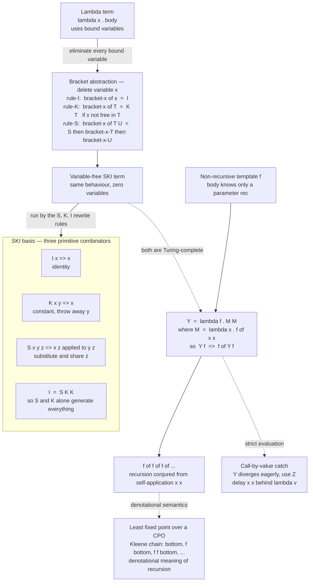

# 🔗 Combinatory Logic and Fixed Points

> [!abstract] TL;DR
> Two astonishing facts about the **lambda calculus**. **First**, you can throw away variables entirely: every lambda function can be rebuilt from just **two** primitive functions, **S** and **K** (with **I** as a bonus, itself equal to `S K K`), through a mechanical procedure called **bracket abstraction**. Bound variables are a *convenience*, not a necessity — this variable-free system, **combinatory logic** (Schönfinkel 1924, Curry 1930s), is still fully **Turing-complete**. **Second**, a language with **no loops and no named recursion** can *still* recurse. A **fixed-point combinator** — the famous **Y combinator** `Y = λf.(λx. f (x x))(λx. f (x x))` — takes a non-recursive "template" and conjures recursion out of thin air by feeding a function a copy of *itself*. The self-application `x x` at its heart is the same trick behind Gödel's incompleteness, the halting problem, and Kleene's recursion theorem. Together these two results are why lazy-functional compilers can target combinator graphs, why "point-free" programming exists, and why `letrec` in every real language has a clean denotational meaning as a **least fixed point**.

---

## Intuition

**Analogy — building all of chemistry from two atoms, then teaching a function to clone itself.**

Imagine someone tells you that the entire periodic table — every molecule, every reaction — can be reconstructed from exactly **two kinds of atom** and a single rule for snapping them together. No hydrogen, no carbon as primitives; just atom-**S** and atom-**K**, plus "stick them side by side." That sounds impossible, yet it is *precisely* the situation in computation. Every function you can write with lambdas and named parameters — arithmetic, booleans, lists, whole interpreters — can be assembled from just **S** and **K**. The variable `x` you thought was fundamental turns out to be scaffolding you can dissolve away. That dissolving procedure is **bracket abstraction**, and what it leaves behind is a **combinator** — a closed function with no free variables, a self-contained Lego brick.

Now the second surprise. In this world there are **no names**, so a function literally cannot say "call *me* again" — there is no "me" to refer to. How, then, can anything recurse? The trick is unnervingly simple: hand a function **a copy of itself as an argument**, and let it apply that copy whenever it wants to "recurse." A **fixed-point combinator** automates this self-cloning. Feed it a template that describes *one layer* of factorial — "if n is 0 return 1, else multiply n by whatever the recursive call gives" — and the combinator wires the template's output back into its own input, unrolling `f (f (f (…)))` exactly as deep as the computation needs. Recursion is not a built-in feature here; it is an **emergent phenomenon** of a function eating itself.

The deep punchline: that self-eating `x x` is the *same* diagonal move that lets a sentence say "this sentence is unprovable" (Gödel) and lets a program ask "do I halt?" (Turing). Self-reference, recursion, and undecidability all grow from one seed.

---

## How It Works

### Core Mechanics

**1. The SKI basis — three primitive combinators.** A combinator is a lambda term with *no free variables*. Combinatory logic fixes a tiny alphabet of them and gives each a rewrite rule:

- **I** (identity): `I x → x` — hand it something, get it straight back.
- **K** (constant, from German *Konstante*): `K x y → x` — a two-argument function that keeps the **first** and *discards* the second. `K a` is "the function that ignores its input and always returns `a`."
- **S** (substitution / distribution): `S x y z → x z (y z)` — the workhorse. It takes three arguments, feeds `z` to **both** `x` and `y`, then applies the results. `S` is what *shares* an argument between two subcomputations; it is the reason variables can vanish.

Crucially, **I is redundant**: `S K K x → (K x)(K x) → x`, so `I = S K K`. The real basis is just **{S, K}** — two combinators generate *everything* the lambda calculus can express.

**2. Bracket abstraction — deleting every bound variable.** Given a lambda term, we translate it to a variable-free combinator expression by the operator `[x] T` ("abstract `x` out of `T`"), defined by three cases:

- `[x] x        = I`                        &nbsp;&nbsp;— to make a function of `x` whose body *is* `x`, use identity.
- `[x] T        = K T`   if `x` is not free in `T`   — a body that ignores `x` is a constant function.
- `[x] (T U)    = S ([x] T) ([x] U)`        — distribute the abstraction across an application; `S` re-shares `x` into both halves.

Apply this repeatedly, innermost variable first, and *all* `λ`s and *all* bound variables disappear. Example: `λx.λy. x` becomes `[x]([y] x) = [x](K x) = S (K K) I`, and indeed `S (K K) I p q → p`, exactly what the lambda meant. This is a **compiler pass**: lambda calculus in, pure S/K/I graph out. Because the source language (untyped lambda calculus) is Turing-complete and the translation is faithful, combinatory logic is Turing-complete too — with **zero** variable machinery.

**3. Fixed points — recursion with no name.** A **fixed point** of a function `f` is a value `x` with `f(x) = x`. A **fixed-point combinator** `FIX` is a *higher-order* combinator satisfying, for every `f`:

`FIX f = f (FIX f)`

Read it operationally: `FIX f` equals `f` applied to `FIX f`, which equals `f (f (FIX f))`, which equals `f (f (f (FIX f)))`… — `f` composed with itself as many times as you unroll. If `f` is a *template* whose recursive slot is a parameter (say `rec`), then `FIX f` plugs the whole recursive function back into that slot. Recursion falls out of a purely non-recursive definition.

**4. The Y combinator.** Curry's fixed-point combinator is `Y = λf.(λx. f (x x))(λx. f (x x))`. Trace it: `Y f → (λx. f (x x))(λx. f (x x)) → f ((λx. f (x x))(λx. f (x x))) = f (Y f)`. The magic is the **self-application** `x x`: `x` is applied to a copy of itself, which is what regenerates the recursive structure at each step. Define factorial with **no self-reference** by writing a template `F = λrec.λn. IF (n = 0) 1 (n * rec (n-1))` and taking `Y F`; the `rec` never names anything — `Y` supplies it.

**5. The call-by-value catch — use Z, not Y.** Curry's `Y` works under **normal-order / lazy** reduction, but under **call-by-value (eager/applicative order)** it **diverges**: evaluating `x x` fully before the surrounding `f` can act loops forever. Strict languages therefore use the **Z combinator**, the *eta-expanded* variant `Z = λf.(λx. f (λv. x x v))(λx. f (λv. x x v))`. Wrapping the self-application in `λv. … v` **delays** it until an argument arrives, so it fires exactly once per recursion level. Which combinator you need is dictated by the **evaluation strategy** — a recurring theme in PL theory.

**6. The domain-theoretic meaning.** *Why* does a recursive definition denote a well-defined function at all? Denotational semantics answers: a recursive definition `f = Φ(f)` is interpreted as the **least fixed point** of the monotone, continuous functional `Φ` over a **CPO** (complete partial order of "information", bottomed by `⊥` = "no answer yet"). **Kleene's fixed-point theorem** says that least fixed point is the limit of the ascending chain `⊥ ⊑ Φ(⊥) ⊑ Φ(Φ(⊥)) ⊑ …` — which is *exactly* the `f (f (f (…⊥…)))` unfolding that `Y` performs operationally. The Y combinator is the *syntax*; the least fixed point is its *meaning*.

### Flow / Architecture



---

## Key Concepts

**Secondary (intuitive, no CS background needed)**
- **Combinator = self-contained brick** — a function with no loose ends (no free variables); you can move it anywhere and it still means the same thing.
- **Two atoms suffice** — every function whatsoever is buildable from just **S** ("share the input") and **K** ("ignore the input"); **I** ("give it back") is a shortcut for `S K K`.
- **A function eating itself** — recursion appears when a function is handed a *copy of itself* to call; no name required.
- **The big surprise** — remove all variables *and* remove all named recursion, and you still lose **none** of computation's power.

**Undergraduate (a first PL / theory course)**
- **SKI reduction rules**: `I x → x`, `K x y → x`, `S x y z → x z (y z)`; normal-order (leftmost-outermost) reduction to normal form; combinatory logic ≡ untyped lambda calculus (both Turing-complete).
- **Bracket abstraction**: the `[x]·` operator and its I/K/S cases; translating `λx.λy.x` to `S (K K) I`; the exponential code blowup of the naive algorithm and why extra combinators **B**, **C** (and Turner's `S'`, `B'`, `C'`) tame it.
- **Fixed-point combinators**: the equation `FIX f = f (FIX f)`; Curry's `Y`; deriving factorial and Fibonacci with no named recursion; why `x x` is the engine.
- **Evaluation-strategy dependence**: `Y` for call-by-name vs the eta-expanded **Z** for call-by-value; strictness and divergence.
- **Point-free / tacit style**: writing programs as pure compositions of combinators, no argument names.

**Graduate (semantics / type theory)**
- **Least fixed points and domain theory**: recursion as the least fixed point of a continuous functional over a **CPO**; **Kleene's fixed-point theorem** and the `⊥`-based ascending chain; the denotational meaning of `letrec`.
- **Typed obstruction**: there is **no** fixed-point combinator in the simply-typed lambda calculus (strong normalization forbids it) — general recursion must be added as a primitive `fix : (a → a) → a`, which is why total languages (Coq, Agda) restrict recursion to structural/well-founded forms.
- **Combinator completeness and bases**: `{S, K}` is complete; single-combinator bases exist (Iota `ι`, the X combinator); abstraction elimination as a compilation strategy.
- **Graph reduction**: SK-combinator **graph reduction** (Turner) and **supercombinators / lambda-lifting** (Hughes), the **G-machine** and **STG machine** lineage behind lazy compilers.
- **The self-reference core**: the structural kinship between `Y`, the **diagonal lemma**, **Kleene's recursion theorem**, Gödel's incompleteness, and the halting problem — all instances of controlled self-application.

---

## Python Demo

```python
# Combinatory logic + fixed points, built from scratch.
# Part A: implement the SKI combinators and their reduction rules, then
#         eliminate ALL bound variables from a lambda term via BRACKET
#         ABSTRACTION and reduce the variable-free result to the same answer
#         -- concrete evidence that S and K alone are Turing-complete.
# Part B: build a FIXED-POINT combinator (the call-by-value Z) and define
#         FACTORIAL with NO named recursion, computing fact(5) = 120.
# Then VISUALIZE (1) an SKI reduction shrinking a term to normal form and
#      (2) the self-application depth that manufactures recursion.
# Pure standard library + matplotlib (no numpy needed).

import matplotlib.pyplot as plt

# ----------------------------------------------------------------------
# TERM REPRESENTATION
#   atom -> a Python str: a combinator 'S'/'K'/'I' or a variable like 'x'
#   app  -> a 2-tuple (f, a) meaning "f applied to a"; left-associative
# ----------------------------------------------------------------------
def app(*terms):
    """Left-fold a spine of applications: app('S','K','K','x')."""
    t = terms[0]
    for x in terms[1:]:
        t = (t, x)
    return t

def show(t):
    """Pretty-print with minimal parentheses (application is left-assoc)."""
    if isinstance(t, str):
        return t
    f, a = t
    a_s = show(a) if isinstance(a, str) else "(" + show(a) + ")"
    return show(f) + " " + a_s

def size(t):
    """Number of atoms in the term -- a proxy for reduction progress."""
    return 1 if isinstance(t, str) else size(t[0]) + size(t[1])

def unwind(t):
    """Split t into its head atom and the list of arguments applied to it."""
    args = []
    while isinstance(t, tuple):
        t, x = t[0], t[1]
        args.append(x)
    args.reverse()
    return t, args                      # head is always an atom (str)

def rebuild(head, args):
    t = head
    for a in args:
        t = (t, a)
    return t

# ----------------------------------------------------------------------
# THE THREE REDUCTION RULES  (normal order: leftmost-outermost)
#   I x     -> x
#   K x y   -> x
#   S x y z -> x z (y z)
# ----------------------------------------------------------------------
def step(t):
    """One reduction step, or None if t is already in normal form."""
    if isinstance(t, str):
        return None
    head, args = unwind(t)
    if head == 'I' and len(args) >= 1:
        return rebuild(args[0], args[1:])
    if head == 'K' and len(args) >= 2:
        return rebuild(args[0], args[2:])
    if head == 'S' and len(args) >= 3:
        x, y, z = args[0], args[1], args[2]
        return rebuild(app(app(x, z), app(y, z)), args[3:])
    # no redex at the head: reduce the leftmost reducible argument
    for i, a in enumerate(args):
        r = step(a)
        if r is not None:
            new = list(args); new[i] = r
            return rebuild(head, new)
    return None

def normalize(t, cap=200):
    """Reduce to normal form, returning the whole trace of terms."""
    trace = [t]
    while len(trace) < cap:
        r = step(t)
        if r is None:
            break
        t = r
        trace.append(t)
    return trace

# ----------------------------------------------------------------------
# BRACKET ABSTRACTION -- delete a bound variable (Curry's basic algorithm)
#   [x] x     = I
#   [x] T     = K T            (x not free in T)
#   [x] (T U) = S ([x]T) ([x]U)
# ----------------------------------------------------------------------
def occurs(x, t):
    return t == x if isinstance(t, str) else occurs(x, t[0]) or occurs(x, t[1])

def bracket(x, t):
    if not occurs(x, t):
        return app('K', t)                        # rule K
    if isinstance(t, str):
        return 'I'                                # rule I  (t must be x)
    f, a = t
    return app('S', bracket(x, f), bracket(x, a)) # rule S

def lam(variables, body):
    """Abstract a list of variables (outermost last) over a body term."""
    for v in reversed(variables):
        body = bracket(v, body)
    return body

print("=" * 68)
print("PART A -- SKI combinators are Turing-complete: kill the variables")
print("=" * 68)

# 'I' is not even primitive: it is S K K.
i_trace = normalize(app('S', 'K', 'K', 'a'))
print("I is derivable:  S K K a  reduces to", show(i_trace[-1]),
      " in", len(i_trace) - 1, "steps")

# Translate lambda terms to variable-free SKI expressions.
const  = lam(['x', 'y'], 'x')          # lambda x. lambda y. x    (K-like)
second = lam(['x', 'y'], 'y')          # lambda x. lambda y. y
print("\nlambda x y. x  translates to :", show(const))
print("lambda x y. y  translates to :", show(second))

# Now RUN them with real arguments and confirm they match the lambda meaning.
trace_const = normalize(app(const, 'p', 'q'))
print("\n(lambda x y. x) p q -- SKI reduction trace:")
for s in trace_const:
    print("    ", show(s))
print("=> variable-free term computed :", show(trace_const[-1]),
      "  |  Python lambda gives :", (lambda x: lambda y: x)('p')('q'))
print("(lambda x y. y) p q  reduces to :",
      show(normalize(app(second, 'p', 'q'))[-1]))

# ----------------------------------------------------------------------
# PART B -- recursion with NO name: the call-by-value Z fixed-point combinator.
#   Y diverges under eager evaluation; Z is the eta-expanded, strict-safe form.
# ----------------------------------------------------------------------
print("\n" + "=" * 68)
print("PART B -- factorial with no named recursion (Z fixed-point combinator)")
print("=" * 68)

Z = lambda f: (lambda x: f(lambda v: x(x)(v)))(lambda x: f(lambda v: x(x)(v)))

# The template never names itself; it only knows a parameter 'rec'.
calls = {"n": 0}
def fact_template(rec):
    def inner(n):
        calls["n"] += 1                       # count self-application unfoldings
        return 1 if n == 0 else n * rec(n - 1)
    return inner

FACT = Z(fact_template)
for n in (0, 1, 5, 7):
    calls["n"] = 0
    print(f"    factorial({n}) = {FACT(n):<5d} (template f unrolled {calls['n']} times)")

# Symbolic view of what Z does: FIX f = f (FIX f) = f (f (FIX f)) = ...
print("\n    FIX f  =  f (FIX f)  =  f (f (FIX f))  =  f (f (f (FIX f)))  = ...")

# Measure the self-application depth (number of rec calls) per n.
ns, depths = list(range(0, 9)), []
for n in ns:
    calls["n"] = 0
    FACT(n)
    depths.append(calls["n"])

# ----------------------------------------------------------------------
# VISUALIZE
#   left : an SKI reduction shrinking a term toward normal form
#   right: the Z self-application depth needed to compute factorial n
# ----------------------------------------------------------------------
# The B combinator  S (K S) K  computes composition:  B f g x -> f (g x)
comp_trace = normalize(app('S', app('K', 'S'), 'K', 'f', 'g', 'x'))
sizes  = [size(t) for t in comp_trace]
labels = [show(t) for t in comp_trace]

fig, (ax1, ax2) = plt.subplots(1, 2, figsize=(14, 6))

ax1.plot(range(len(sizes)), sizes, "o-", lw=2, color="#1f77b4")
for i, (s, lab) in enumerate(zip(sizes, labels)):
    ax1.annotate(lab, (i, s), textcoords="offset points", xytext=(0, 10),
                 ha="center", fontsize=8)
ax1.set_title("SKI reduction of the B combinator\nS (K S) K f g x  =>  f (g x)")
ax1.set_xlabel("reduction step")
ax1.set_ylabel("term size (number of atoms)")
ax1.set_ylim(0, max(sizes) + 3)
ax1.grid(True, ls=":", alpha=0.5)

ax2.bar(ns, depths, color="#ff7f0e")
for n, d in zip(ns, depths):
    ax2.text(n, d + 0.15, str(d), ha="center", fontsize=9)
ax2.set_title("Fixed-point recursion via self-application\n"
              "depth the Z combinator unrolls f to compute factorial n")
ax2.set_xlabel("n")
ax2.set_ylabel("times template f is applied to itself")
ax2.grid(True, axis="y", ls=":", alpha=0.5)

plt.tight_layout()
plt.savefig("combinatory_logic_fixed_points.png", dpi=130)
print("\nSaved visualization to combinatory_logic_fixed_points.png")
```

Running it prints that `I` is really `S K K` (it reduces `S K K a → a`), then translates `λx.λy.x` to the **variable-free** term `S (K K) I` and reduces `S (K K) I p q → p` — matching the Python lambda exactly, with **no variable machinery** left in the combinator term. Part B then computes `factorial(5) = 120` from a template that **never names itself** (the `Z` combinator supplies the recursion) and reports that computing `factorial(n)` unrolls the template `n + 1` times. The saved figure shows, on the left, the `B`-combinator reduction shrinking `S (K S) K f g x` down to its normal form `f (g x)`, and on the right, the linearly growing self-application depth — a direct picture of recursion *emerging* from a function fed to itself.

---

## Real-World Applications

> **Example — lazy-functional compilers that literally target combinators.** David Turner's implementations of **SASL** and **Miranda** (late 1970s–80s) compiled programs to **SKI combinator graphs** and ran them by **graph reduction**: bracket-abstract the lambdas away, build a graph of `S`/`K`/`I` (plus efficiency combinators `B`, `C`, `S'`, `B'`, `C'`), and rewrite the graph in place with the three reduction rules until it reaches normal form. Sharing is free because the graph is a DAG. This line of work evolved into **supercombinators** and **lambda-lifting** (Hughes), the **G-machine**, and the **Spineless Tagless G-machine (STG)** that powers **GHC** (Haskell) today. Combinatory logic is not a curiosity here — it is the *intermediate representation* a real compiler reduces.

Beyond compilers:
- **Point-free / tacit programming.** Writing functions as pure compositions with **no argument names** is the practical face of combinator style: Haskell's `(.)`, `flip`, `const` (that is `K`), and `id` (that is `I`); the `pointfree` tool that mechanically eta-reduces named code to combinators; and the tacit dialects **APL**, **J**, and **BQN**, where entire programs are trains of combinators. Unix pipelines (`a | b | c`) are function composition in the same spirit.
- **Fixed points as a library primitive.** Haskell's `Data.Function.fix :: (a -> a) -> a` is a fixed-point combinator you can import; lazy evaluation makes it "tie the knot" so `fix (\xs -> 1 : xs)` builds an infinite list of ones. `let rec` in ML/OCaml, `letrec` in Scheme, and mutually-recursive `def`s in every language are all sugar whose **denotational meaning is a least fixed point**.
- **Memoized and open recursion.** Passing the recursive call as an explicit parameter (an "open recursive" template, exactly the `Z`-combinator shape) is how you inject **memoization**, tracing, or fuel limits *around* a recursion without touching its body — a mainstream engineering pattern for dynamic programming and instrumentation.
- **Semantics and verified compilers.** Denotational semantics (Scott–Strachey) defines the meaning of `while` and recursion via least fixed points; this is the theory a verified compiler such as **CompCert** or a proof assistant's evaluator relies on to justify that recursive definitions denote well-defined functions.

---

## Common Pitfalls

- **Expecting the naive `Y` to work in a strict language.** `Y = λf.(λx. f (x x))(λx. f (x x))` **diverges** under call-by-value because `x x` is evaluated eagerly and loops before `f` can act. You must use the **Z combinator** (eta-expand the self-application: `λv. x x v`) so the recursive call is delayed until an argument arrives. "Why does my fixed point hang forever?" is almost always this.
- **Combinatorial code explosion.** The *basic* bracket-abstraction algorithm can blow a term up **exponentially** in the number of variables. Real systems add the **B** and **C** combinators (and Turner's `S'`, `B'`, `C'`, or Kiselyov's linear "bracket abstraction that preserves size") to keep the output tractable. Never ship the three-rule version as a production compiler pass.
- **Thinking `I` is primitive.** `I = S K K` — the genuine basis is `{S, K}`. Some presentations even use a *single* combinator (Iota `ι = λf. f S K`). Treating `I` as irreducible obscures how minimal the system really is.
- **Confusing "a fixed point" with "the *least* fixed point."** `f(x) = x` can have *many* solutions; recursion demands the **least** one in the information ordering (built up from `⊥`). Picking any fixed point can give an operationally wrong answer — the Kleene chain `⊥, f(⊥), f(f(⊥)), …` is what recursion actually computes.
- **Assuming `FIX f = f (FIX f)` guarantees termination.** It does not. `FIX f` only terminates if the template `f` **eventually ignores its recursive argument** (i.e., hits a base case). A template with no base case yields the true fixed point `⊥` — an infinite loop. The base case, not the combinator, is what stops the unrolling.
- **Believing "point-free" always means "clearer."** Eliminating all variables can produce write-only "**pointless**" code. Combinators are a beautiful *foundation* and a great *compiler target*, but human-facing source often reads better *with* names. Minimality is a theoretical virtue, not always an ergonomic one.
- **Trying to write `fix` in a total/typed calculus.** The simply-typed lambda calculus is **strongly normalizing**, so it has **no** fixed-point combinator at all — you literally cannot type `λx. x x`. General recursion must be added as a primitive, which is exactly why proof assistants restrict you to structural recursion.

---

## Related Concepts

- [[Recursive_Functions_and_Lambda_Calculus]] — the parent note: the lambda calculus, Church encodings, and the Church–Turing thesis. This note is the "combinatory logic" and "Y combinator" bullets from there, expanded in full.
- [[Turing_Machines_and_the_Church_Turing_Thesis]] — combinatory logic (`{S, K}`) computes *exactly* the Turing-computable functions; it is yet another model that converges on the same class.
- [[The_Halting_Problem_and_Undecidability]] — the self-application `x x` powering `Y` is the same diagonal move behind the undecidability of halting; recursion and non-computability share one root.
- [[Complexity_Hierarchies_and_Diagonalization]] — diagonalization as the general technique; the Y combinator, Kleene's recursion theorem, and Gödel's diagonal lemma are all controlled self-reference.
- [[Interpreters_and_Tree_Walking]] — combinator **graph reduction** is an alternative to AST tree-walking for running functional languages; bracket abstraction is the compiler pass that produces the graph.

> Companion notes planned for this section — **The Lambda Calculus**, **Church Encodings and Computability**, **Reduction Strategies and Evaluation Order**, **Domain Theory and Fixed Points**, **Denotational Semantics**, and **Functional Programming Foundations** — will deepen the strategy-dependence of `Y` vs `Z`, the least-fixed-point semantics of recursion, and the compilation story; link them once they exist.

---

## Review Questions

1. **(Conceptual)** The combinator `I` (identity) is not actually part of the minimal basis. Show, using the reduction rules `K x y → x` and `S x y z → x z (y z)`, that `S K K x → x`, and explain in one sentence why this means `{S, K}` alone is enough to express every lambda term. Then state what bracket abstraction *is* and why its existence proves bound variables are a convenience rather than a necessity.
2. **(Scenario)** You implement the classic `Y = λf.(λx. f (x x))(λx. f (x x))` in a call-by-value language (Python, OCaml, JavaScript) and it hangs immediately instead of computing `factorial`. Diagnose exactly which subterm evaluates too early, explain how the **Z combinator's** eta-expansion `λv. x x v` fixes it, and describe what would happen instead under lazy (call-by-name) evaluation. What general PL principle does this illustrate?
3. **(Trade-off / significance)** A recursive definition `f = Φ(f)` denotes the **least fixed point** of `Φ` over a CPO, computed as the limit of the Kleene chain `⊥, Φ(⊥), Φ(Φ(⊥)), …`. (a) Explain how this denotational picture corresponds, step for step, to the operational unrolling `Y Φ → Φ (Y Φ) → Φ (Φ (Y Φ)) → …`. (b) Why must it be the *least* fixed point rather than any fixed point? (c) Given that the simply-typed lambda calculus has **no** fixed-point combinator, what does a total language like Coq or Agda have to do differently to support recursion, and what does it gain in return?

---

## Sources

- Schönfinkel, M. "Über die Bausteine der mathematischen Logik." *Mathematische Annalen* 92 (1924): 305–316 — the origin of combinators and the elimination of bound variables.
- Curry, H. B., and Feys, R. *Combinatory Logic, Vol. I.* North-Holland, 1958 — the foundational systematic treatment of combinatory logic, the S/K/I basis, and bracket abstraction.
- Hindley, J. R., and Seldin, J. P. *Lambda-Calculus and Combinators: An Introduction.* 2nd ed. Cambridge University Press, 2008 — modern, rigorous coverage of both calculi, their equivalence, and fixed-point combinators.
- Barendregt, H. P. *The Lambda Calculus: Its Syntax and Semantics.* Rev. ed. North-Holland, 1984 — the standard reference; fixed-point combinators and the Church–Rosser theory.
- Turner, D. A. "A New Implementation Technique for Applicative Languages." *Software: Practice and Experience* 9 (1979): 31–49 — SKI-combinator graph reduction as a practical compilation strategy for lazy languages.
- Peyton Jones, S. L. *The Implementation of Functional Programming Languages.* Prentice Hall, 1987 — supercombinators, lambda-lifting, and the G-machine; the compiler-facing view of this theory.

---

#programming-language-theory #combinatory-logic #ski-combinators #y-combinator #fixed-point
