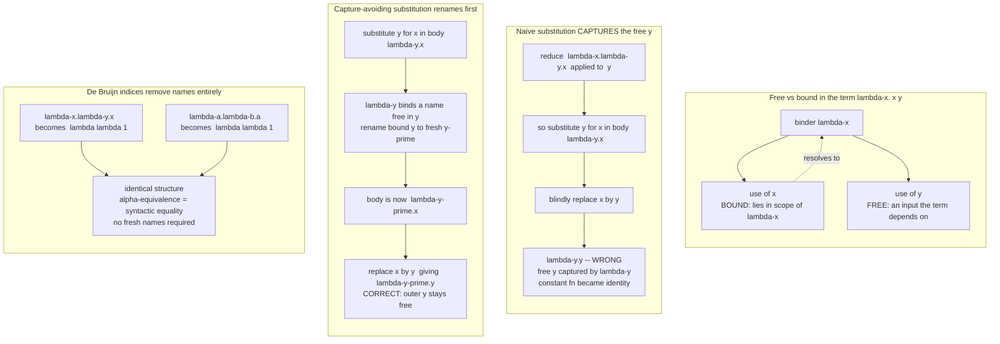

# 🪢 Names, Binding and Scope

> [!abstract] TL;DR
> A variable name is not a *thing*; it is a *reference* whose meaning is fixed by whatever **binder** (a `λ`, a function parameter, a `let`) introduced it, over the region of program text called its **scope**. Get this bookkeeping right and `λx.x` equals `λy.y` (they are the *same function*, up to **alpha-equivalence**) and refactoring tools rename safely; get it wrong and naive textual substitution silently **captures** a free variable and changes a program's meaning. **Capture-avoiding substitution** (rename to fresh names before you substitute) and **de Bruijn indices** (throw names away, use "how many binders out" numbers) are the two disciplined fixes that every serious compiler, interpreter, and proof assistant relies on.

---

## Intuition

**Analogy:** In English the pronoun **"it"** means different things in different sentences, and you resolve it from context — *the nearest thing it could sensibly point back to*. "I dropped the phone but **it** didn't break" — *it* is the phone. Change the surrounding sentence and *it* points somewhere else. Variable names work exactly like pronouns: the **same** name `x` can refer to completely different things depending on which function **bound** it, and you resolve each use by looking outward to the nearest enclosing binder for that name.

Now imagine editing a paragraph by find-and-replace: you swap in a noun phrase that itself contains the word "it," and suddenly an *unrelated* "it" nearby gets read as pointing at your new phrase. You have **captured** a pronoun that was supposed to stay independent — the meaning changed silently. That accident is the **variable-capture problem**, and it is the single subtlety that makes substitution in every programming language harder than it looks. Everything below is the theory of resolving names like pronouns, and of substituting without capturing them.

---

## How It Works

### Binding vs use

Every occurrence of a variable in a term is one of two things:

- A **binder** — it *introduces* a name. In the lambda calculus that is the `x` in `λx. ...`; in real languages it is a function parameter, a `let x = ...`, a `for`-loop variable, a pattern variable. A binder does not *refer* to anything; it *declares*.
- A **use** (a *bound occurrence* or *free occurrence*) — it *refers back* to some binder. `x` on the right-hand side of `λx. x + 1` is a use that resolves to the parameter binder.

The **scope** of a binder is the region of program text in which its uses resolve to it. In `λx. (x (λx. x))` the two `λx` binders have *nested* scopes, and each `x` use resolves to the **innermost** enclosing binder of that name — the inner one **shadows** the outer. This inner-first resolution is precisely what a compiler's scoped symbol table implements; see [[Semantic_Analysis_and_Symbol_Tables]] for the industrial version (a stack of hash-table scopes, resolve innermost-outward).

### Free vs bound variables

A variable occurrence is **bound** if it falls inside the scope of a binder for its name, and **free** otherwise. Formally, the set of free variables `FV` of a term is:

- `FV(x) = {x}` — a lone variable is free in itself.
- `FV(λx. t) = FV(t) \ {x}` — the binder `λx` *removes* `x` from the free set of its body.
- `FV(t u) = FV(t) ∪ FV(u)` — application unions the two sides.

The free variables are exactly the **inputs** a term depends on from its surrounding environment — the names it cannot evaluate without. A term with **no** free variables is **closed**; a closed lambda term is a **combinator** (`I = λx.x`, `K = λx.λy.x`, `S = λx.λy.λz. x z (z y)` in the `S`/`K`/`I` basis). Combinatory logic gets rid of variables entirely by building everything from such closed terms — that is the subject of the sibling note `Combinatory_Logic_and_Fixed_Points`.

### Alpha-equivalence

Because a bound name is just a *local label*, its spelling carries no meaning: `λx.x` and `λy.y` denote the identical function. Renaming a binder and all of its bound uses consistently is **alpha-conversion**, and two terms equal up to such renaming are **alpha-equivalent** (`≡α`). The lambda calculus (see the vault's `The_Lambda_Calculus` sibling and [[Recursive_Functions_and_Lambda_Calculus]]) works *up to alpha-equivalence*: we never distinguish `λx.λy.x` from `λa.λb.a`. The catch is that alpha-equivalence is **not** textual string equality — `"λx.x" != "λy.y"` as strings — which is exactly why an algorithm that decides sameness by comparing text is wrong.

### The variable-capture problem and capture-avoiding substitution

Substitution `t[x := s]` means "replace every **free** occurrence of `x` in `t` by `s`." This is the engine of beta-reduction — `(λx. t) s` reduces to `t[x := s]` — and thus the heart of every evaluator (see `Reduction_Strategies_and_Evaluation_Order` for *which* redex to fire and when).

Naive textual substitution is subtly broken. Consider reducing `(λx.λy.x) y`. Beta says: substitute the argument `y` for the parameter `x` in the body `λy.x`, i.e. compute `(λy.x)[x := y]`. The body `λy.x` is a **constant function** — it ignores its argument and returns the outer `x`. Substituting naively:

```
(λy.x)[x := y]  =naive=  λy.y      -- WRONG: this is the identity function!
```

The free `y` we substituted got **captured** by the binder `λy`, silently turning a constant function into the identity. The fix — **capture-avoiding substitution** — adds a side condition: before substituting under a binder `λz. t` whose name `z` is free in the replacement `s`, first **alpha-rename** `z` to a **fresh** name not clashing with anything:

```
(λy.x)[x := y]  =safe=   λy'.y     -- CORRECT: rename bound y to fresh y', then substitute
```

The correct definition:

- `x[x := s] = s`;  `y[x := s] = y` when `y != x`.
- `(t u)[x := s] = (t[x := s]) (u[x := s])`.
- `(λx. t)[x := s] = λx. t` — the binder `x` shadows, so free `x`s inside are gone; do nothing.
- `(λy. t)[x := s]` with `y != x`:
  - if `y ∉ FV(s)`: `λy. (t[x := s])` — safe, no capture possible.
  - if `y ∈ FV(s)`: pick fresh `y' ∉ FV(s) ∪ FV(t)`, then `λy'. (t[y := y'][x := s])` — rename first, *then* substitute.

Compilers and interpreters **must** implement this discipline (or an equivalent) whenever they inline, specialize, or beta-reduce; the tree-walking evaluator in [[Interpreters_and_Tree_Walking]] uses exactly this capture-avoidance (or, more commonly, an *environment* that sidesteps textual substitution altogether — see closures below).

### De Bruijn indices: names removed entirely

The elegant alternative is to **abolish names**. A **de Bruijn index** replaces each variable use with a *number* saying how many binders you cross to reach the one that binds it. Using the standard 0-indexed convention, the **innermost** enclosing binder is `0`, the next one out is `1`, and so on:

- `λx.x`  becomes  `λ 0`.
- `λx.λy.x`  becomes  `λ λ 1`  (the `x` is bound by the *outer* `λ`, one binder past `λy`).
- `λx.λy.y`  becomes  `λ λ 0`.

Two consequences make this beloved by implementers:

1. **Alpha-equivalence becomes literal syntactic identity.** `λx.λy.x` and `λa.λb.a` both become `λ λ 1` — the *same* data structure. Deciding sameness is now `==`, not a renaming search.
2. **Substitution becomes mechanical** — index *shifting* and replacement, with **no fresh-name generation** and no capture side conditions. This robustness is why de Bruijn (and the hybrid **locally nameless** representation, which keeps names for *free* variables but indices for *bound* ones) dominates proof assistants and verified compilers, the subject of the vault's `Proof_Assistants_and_Dependent_Type_Theory` sibling.

The price is readability: `λ λ λ 2 0 (1 0)` is unreadable to humans and a nightmare to debug, so tools convert to indices internally and pretty-print names at the boundaries.

### Lexical (static) vs dynamic scope, and closures

**Lexical / static scope** — the modern default — resolves a use to the *lexically enclosing* binder, decided entirely by program **text** at compile time. **Dynamic scope** resolves a use along the *runtime call stack* — whoever *called* you, not where you were *written*. Dynamic scope was largely abandoned (early Lisp, some shells) because it destroys local reasoning: a function's meaning depends on its callers. Lexical scope lets you understand a function from its own text, and it is what makes **closures** possible.

A **closure** is a function *plus* the bindings of its free variables, captured from the scope where it was **defined**. It is how lexical scope is realized at run time: the free variables that a function body depends on are packaged with a pointer to the code, so the function keeps working after its defining scope has returned. Closures connect directly to the **environment** model of evaluation and to runtime layout (`Functional_Programming_Foundations` sibling; [[Runtime_Systems_and_the_ABI]] for how the captured environment is represented in memory; [[Rust_Functions_and_Closures]] for how one production language types and stores captures).

### Hygiene: the same problem, one level up

Macros substitute *code into code*, so they face variable capture at the **metaprogramming** level: a macro that introduces a temporary `tmp` can accidentally capture (or be captured by) a user's `tmp`. **Hygienic macros** (Scheme, Rust) automatically alpha-rename introduced identifiers to fresh names so macro-internal bindings never collide with user bindings — capture-avoiding substitution, promoted to the syntax layer. This is developed in the vault's `Metaprogramming_and_Macros` sibling.

### Flow / Architecture



---

## Key Concepts

**Secondary (plain-language):**
- *Names are like pronouns.* The same word can point at different things; you resolve it from the nearest place it was introduced.
- *Binder vs use.* Some occurrences *introduce* a name (`λx`, a parameter); others *refer back* to one.
- *Scope.* The region of code where a name "lives"; an inner name of the same spelling **shadows** an outer one.
- *Renaming is free.* `λx.x` and `λy.y` are the same function — the bound name is just a private label.

**Undergraduate:**
- *Free vs bound variables* and the recursive `FV` computation; free variables are a term's external **inputs**; a **closed** term (combinator) has none.
- *Alpha-equivalence* is equality *up to consistent renaming of bound variables* — not string equality.
- *Substitution* `t[x := s]` replaces free `x`; **beta-reduction** is `(λx.t) s → t[x := s]`.
- *The variable-capture bug* and its fix, **capture-avoiding substitution** with fresh renaming.
- *Lexical vs dynamic scope*; **closures** as function-plus-captured-environment.

**Graduate:**
- *De Bruijn indices* and the shift operator; **locally nameless** and named-with-permutations (nominal) representations; the tradeoff space (readability vs mechanizability).
- *Alpha as a quotient.* Terms modulo `≡α` form the real object of study; nominal sets and the Gabbay-Pitts theory of freshness formalize "fresh name" and binding abstractly.
- *Hygiene* as capture-avoidance at the macro layer; scope sets and syntactic closures.
- *Explicit substitutions / calculi of explicit substitution* that make substitution a first-class, incrementally-computed operation for efficient implementation.
- *Correspondence to symbol tables:* a de Bruijn index is a "levels-out" coordinate; a scoped symbol-table lookup computes the same resolution dynamically over names.

---

## Python Demo

Pure-stdlib lambda-term machinery plus a matplotlib **binding diagram**. It (1) computes **free variables**, (2) implements **capture-avoiding substitution** with fresh renaming, (3) reproduces the classic **variable-capture bug** — naive substitution turning `(λy.x)[x := y]` (the body reduced from `(λx.λy.x) y`) wrongly into `λy.y` versus the correct `λy'.y`, (4) converts terms to **de Bruijn indices** and shows alpha-equivalent terms become *identical*, and (5) **visualizes** the binding structure with arrows from each use to its binder.

```python
# Names, binding, scope: free variables, capture-avoiding substitution,
# the capture bug, de Bruijn conversion, and a binding-structure plot.
from dataclasses import dataclass
from typing import Union, Set, List, Dict, Optional
import matplotlib.pyplot as plt

# ---------- Term representation (named lambda calculus) ----------
@dataclass(frozen=True)
class Var: name: str
@dataclass(frozen=True)
class Lam: param: str; body: "Term"
@dataclass(frozen=True)
class App: func: "Term"; arg: "Term"
Term = Union[Var, Lam, App]

def show(t: Term) -> str:
    if isinstance(t, Var): return t.name
    if isinstance(t, Lam): return "λ" + t.param + "." + show(t.body)
    # App: parenthesize a lambda on the left and a compound on the right
    f = show(t.func); a = show(t.arg)
    if isinstance(t.func, Lam): f = "(" + f + ")"
    if isinstance(t.arg, (App, Lam)): a = "(" + a + ")"
    return f + " " + a

# ---------- 1. Free variables:  FV(x)={x}, FV(λx.t)=FV(t)-{x}, FV(t u)=FV(t)|FV(u) ----------
def free_vars(t: Term) -> Set[str]:
    if isinstance(t, Var): return {t.name}
    if isinstance(t, Lam): return free_vars(t.body) - {t.param}
    return free_vars(t.func) | free_vars(t.arg)

def fresh(base: str, avoid: Set[str]) -> str:
    cand = base
    while cand in avoid:          # append primes until we dodge every clash
        cand += "'"
    return cand

# ---------- 2. Capture-AVOIDING substitution  t[x := s] ----------
def subst(t: Term, x: str, s: Term) -> Term:
    if isinstance(t, Var):
        return s if t.name == x else t
    if isinstance(t, App):
        return App(subst(t.func, x, s), subst(t.arg, x, s))
    # Lam
    if t.param == x:
        return t                                   # x is re-bound here; nothing free to replace
    if t.param in free_vars(s):                     # capture would occur -> rename bound var first
        new = fresh(t.param, free_vars(s) | free_vars(t.body) | {x})
        renamed = subst(t.body, t.param, Var(new))  # alpha-rename the binder consistently
        return Lam(new, subst(renamed, x, s))
    return Lam(t.param, subst(t.body, x, s))

# ---------- 3. NAIVE (buggy) substitution: no capture check ----------
def subst_naive(t: Term, x: str, s: Term) -> Term:
    if isinstance(t, Var):
        return s if t.name == x else t
    if isinstance(t, App):
        return App(subst_naive(t.func, x, s), subst_naive(t.arg, x, s))
    if t.param == x:
        return t
    return Lam(t.param, subst_naive(t.body, x, s))  # BUG: recurses under λ with no rename

# ---------- 4. De Bruijn conversion (0-indexed: innermost binder = 0) ----------
def debruijn(t: Term, ctx: Optional[List[str]] = None) -> str:
    if ctx is None: ctx = []
    if isinstance(t, Var):
        for i in range(len(ctx) - 1, -1, -1):       # search innermost-outward
            if ctx[i] == t.name:
                return str(len(ctx) - 1 - i)         # distance in binders crossed
        return "free:" + t.name                      # unbound -> keep the name
    if isinstance(t, Lam):
        return "λ " + debruijn(t.body, ctx + [t.param])
    return "(" + debruijn(t.func, ctx) + " " + debruijn(t.arg, ctx) + ")"

# ---------- Demonstrations ----------
print("=== 1. Free variables (a term's external inputs) ===")
for t in [Lam("y", Var("x")),
          Lam("f", Lam("x", App(Var("f"), App(Var("f"), Var("x"))))),   # Church 2 (closed)
          App(Var("x"), Lam("y", App(Var("y"), Var("z"))))]:
    fv = sorted(free_vars(t))
    print(f"  FV( {show(t):<18} ) = {set(fv) if fv else '{}  (closed / combinator)'}")

print("\n=== 2 and 3. The variable-capture bug ===")
# (λx.λy.x) y   beta-reduces to   (λy.x)[x := y]
body = Lam("y", Var("x"))                 # the body after binding x
print(f"  reducing (λx.λy.x) y  ==>  substitute y for x in  {show(body)}")
print(f"  naive           : {show(subst_naive(body, 'x', Var('y')))}   <-- WRONG (identity: y captured)")
print(f"  capture-avoiding: {show(subst(body, 'x', Var('y')))}   <-- CORRECT (outer y stays free)")

print("\n=== 4. De Bruijn indices make alpha-equivalence into equality ===")
t1 = Lam("x", Lam("y", Var("x")))         # λx.λy.x
t2 = Lam("a", Lam("b", Var("a")))         # λa.λb.a   (alpha-equivalent to t1)
t3 = Lam("x", Lam("y", Var("y")))         # λx.λy.y   (NOT equivalent)
d1, d2, d3 = debruijn(t1), debruijn(t2), debruijn(t3)
print(f"  {show(t1):<10} -> {d1}")
print(f"  {show(t2):<10} -> {d2}   equal to first? {d1 == d2}  (alpha-equivalent)")
print(f"  {show(t3):<10} -> {d3}   equal to first? {d1 == d3}")

# ---------- 5. Visualize binding structure: arrows from each use to its binder ----------
def layout(t: Term):
    """Linearize into tokens; each 'use' records the token index of its binder (or None if free)."""
    toks: List[Dict] = []
    stack: List = []                                  # (name, token_index) of live binders
    def walk(node):
        if isinstance(node, Var):
            b = next((bi for nm, bi in reversed(stack) if nm == node.name), None)
            toks.append({"text": node.name, "kind": "use", "binder": b})
        elif isinstance(node, Lam):
            idx = len(toks)
            toks.append({"text": "λ" + node.param, "kind": "binder", "binder": None})
            stack.append((node.param, idx)); walk(node.body); stack.pop()
        else:                                          # App
            fp = isinstance(node.func, Lam)
            ap = isinstance(node.arg, (App, Lam))
            if fp: toks.append({"text": "(", "kind": "punct", "binder": None})
            walk(node.func)
            if fp: toks.append({"text": ")", "kind": "punct", "binder": None})
            toks.append({"text": " ", "kind": "punct", "binder": None})   # application gap
            if ap: toks.append({"text": "(", "kind": "punct", "binder": None})
            walk(node.arg)
            if ap: toks.append({"text": ")", "kind": "punct", "binder": None})
    walk(t)
    return toks

def draw(ax, t, title):
    toks = layout(t)
    for i, tk in enumerate(toks):
        color = {"binder": "#1b5e20", "use": "#0d47a1"}.get(tk["kind"], "#78909c")
        weight = "bold" if tk["kind"] in ("binder", "use") else "normal"
        ax.text(i, 0, tk["text"], ha="center", va="center", fontsize=15,
                family="monospace", fontweight=weight, color=color)
    for i, tk in enumerate(toks):
        if tk["kind"] != "use":
            continue
        if tk["binder"] is None:
            ax.text(i, -0.34, "FREE", ha="center", va="top", fontsize=8.5,
                    color="#b71c1c", fontweight="bold")
        else:
            ax.annotate("", xy=(tk["binder"], 0.16), xytext=(i, 0.16),
                        arrowprops=dict(arrowstyle="->", color="#e65100", lw=1.7,
                                        connectionstyle="arc3,rad=0.55"))
    ax.set_xlim(-1, len(toks)); ax.set_ylim(-0.75, 1.5); ax.axis("off")
    ax.set_title(title, fontsize=12, fontweight="bold")

fig, axes = plt.subplots(2, 1, figsize=(11, 5.4))
draw(axes[0], Lam("f", Lam("x", App(Var("f"), App(Var("f"), Var("x"))))),
     "Binding arcs: λf.λx. f (f x)  — Church numeral 2 (closed; every use bound)")
draw(axes[1], Lam("x", App(Lam("x", Var("x")), Var("x"))),
     "Shadowing: λx. (λx.x) x  — inner use binds inner λx, outer use binds outer λx")
fig.suptitle("Names resolve like pronouns: each use points to its nearest enclosing binder",
             fontsize=12.5, fontweight="bold")
plt.tight_layout()
plt.savefig("binding_structure.png", dpi=120)   # optional
plt.show()
```

Console output:

```
=== 1. Free variables (a term's external inputs) ===
  FV( λy.x              ) = {'x'}
  FV( λf.λx.f (f x)     ) = {}  (closed / combinator)
  FV( x (λy.y z)        ) = {'x', 'z'}

=== 2 and 3. The variable-capture bug ===
  reducing (λx.λy.x) y  ==>  substitute y for x in  λy.x
  naive           : λy.y   <-- WRONG (identity: y captured)
  capture-avoiding: λy'.y   <-- CORRECT (outer y stays free)

=== 4. De Bruijn indices make alpha-equivalence into equality ===
  λx.λy.x    -> λ λ 1
  λa.λb.a    -> λ λ 1   equal to first? True  (alpha-equivalent)
  λx.λy.y    -> λ λ 0   equal to first? False
```

The figure draws each term left-to-right and arcs every *use* to the *binder* it resolves to: in Church-2 both `f`s point at `λf` and `x` at `λx`; in the shadowing term the inner `x` arcs to the inner `λx` while the outer `x` arcs to the outer `λx` — the same name, two different bindings, decided purely by lexical nesting.

---

## Real-World Applications

> **Proof assistants (Coq, Lean, Agda).** Their kernels represent terms with **de Bruijn indices** (or **locally nameless**) so that alpha-equivalence is definitional equality and substitution never needs fresh-name plumbing — essential when the *soundness* of every proof rests on getting substitution exactly right. This is the practical face of `Proof_Assistants_and_Dependent_Type_Theory`.

> **Compilers and interpreters.** Beta-reduction, inlining, and specialization all substitute terms and so must avoid capture. GHC's Core, LLVM-style optimizers, and Scheme/JS engines either alpha-rename to fresh unique names ("gensym"/"uniques") or, more commonly, evaluate with an **environment** so capture cannot arise — the model used by the tree-walker in [[Interpreters_and_Tree_Walking]]. Name resolution against a scoped [[Semantic_Analysis_and_Symbol_Tables|symbol table]] is the compile-time counterpart.

> **Closures at runtime.** JavaScript, Python, Rust, and Swift capture the *lexical* environment when a function value is created. How those captured free variables are laid out (by reference vs by value, on stack vs heap) is an ABI/runtime concern; see [[Runtime_Systems_and_the_ABI]] and [[Rust_Functions_and_Closures]] for a language that makes capture-mode part of the type.

> **Hygienic macros.** Rust's `macro_rules!` and Scheme's `syntax-rules` automatically rename identifiers a macro introduces so they cannot capture user variables — capture-avoiding substitution lifted to syntax (the `Metaprogramming_and_Macros` sibling).

> **IDE "rename symbol" refactoring.** A correct rename is an alpha-conversion: it must recolor *exactly* the uses bound by one binder and nothing else, which is why editors need real binding analysis, not text search-and-replace.

---

## Common Pitfalls

- **Naive substitution capturing a free variable.** The canonical bug: substituting under a binder with the same (or a colliding) name silently changes meaning, as `(λy.x)[x := y]` collapsing to `λy.y` shows. Always rename to a fresh name (or evaluate with environments) before descending under a binder.
- **Treating alpha-equivalent terms as unequal (or vice versa).** Comparing terms by their printed text says `λx.x != λy.y`. Compare after converting to de Bruijn indices (or normalize bound names) so `≡α` becomes `==`.
- **Off-by-one in de Bruijn shifting.** When you substitute or move a term under/over binders, every free index must be **shifted** by the number of binders crossed. Forgetting the shift (or shifting the wrong occurrences) is the classic de Bruijn bug — robust, but unforgiving.
- **Dynamic-scope surprises.** Resolving a closure's free variables against the *call chain* instead of the *defining scope* is a real bug (old `let`/`fluid-let` semantics, some template systems). Lexical scope resolves them where the function is *written*.
- **Closure-over-loop-variable.** JavaScript `var` in a `for` loop (pre-`let`) captures one shared binding, so all closures see the final value. The fix is a fresh binding per iteration — a scoping decision, not a hack.
- **Macros that capture.** A non-hygienic macro introducing a name like `tmp` can shadow or be shadowed by the caller's `tmp`. Use the language's hygienic macro system or `gensym` fresh names.
- **Assuming free-variable sets are cheap.** Recomputing `FV` at every substitution step (as the tiny demo does) is O(size) each time and can blow up; production systems cache `FV`, use de Bruijn indices, or use explicit substitutions.

---

## Related Concepts

- [[Recursive_Functions_and_Lambda_Calculus]] — the lambda calculus this note builds on; binding, alpha-conversion, and substitution are its core operational machinery.
- [[Semantic_Analysis_and_Symbol_Tables]] — the compiler realization of scope resolution: a stack of scopes, resolve innermost-outward, with shadowing.
- [[Interpreters_and_Tree_Walking]] — evaluates terms using environments (or capture-avoiding substitution), sidestepping the capture bug at run time.
- [[Runtime_Systems_and_the_ABI]] — how a closure's captured free variables are represented and laid out in memory.
- [[Rust_Functions_and_Closures]] — a production language whose type system encodes exactly which free variables a closure captures and how.
- [[Type_Checking_and_Type_Systems]] — typing judgments carry a *context* of variable bindings; scope and binding govern where a type variable or term variable is in play.

Not-yet-created Programming Language Theory siblings referenced above (in prose): `The_Lambda_Calculus`, `Reduction_Strategies_and_Evaluation_Order`, `Combinatory_Logic_and_Fixed_Points`, `Functional_Programming_Foundations`, `Metaprogramming_and_Macros`, and `Proof_Assistants_and_Dependent_Type_Theory`.

---

## Review Questions

1. **(Secondary)** In `λx. (λx. x) x`, there are two uses of `x`. Which binder does each resolve to, and why? Using the pronoun analogy, explain what "shadowing" means here.
2. **(Undergraduate)** Compute `FV(λy. x (λx. x y))`. Then perform `(λf.λx. f x)[f := (λy. x)]` correctly, showing where and why a bound variable must be renamed to avoid capture. What would a naive substitution have produced instead?
3. **(Graduate)** Convert `λx.λy. y (λz. x z)` to de Bruijn indices, stating your indexing convention. Explain precisely why de Bruijn indices turn alpha-equivalence into syntactic identity and eliminate the need for fresh-name generation during substitution — and identify the one operation (hint: crossing binders) that becomes trickier as a result. When would you prefer a *locally nameless* representation over pure de Bruijn?

---

## Sources

- Benjamin C. Pierce, *Types and Programming Languages* (MIT Press, 2002), Ch. 5 (untyped lambda calculus, substitution) and Ch. 6 (nameless de Bruijn representation). [MIT Press](https://mitpress.mit.edu/9780262162098/types-and-programming-languages/)
- N. G. de Bruijn, "Lambda calculus notation with nameless dummies," *Indagationes Mathematicae* 34 (1972), pp. 381–392 — the original de Bruijn index paper. [ScienceDirect](https://doi.org/10.1016/1385-7258%2872%2990034-0)
- Henk Barendregt, *The Lambda Calculus: Its Syntax and Semantics* (rev. ed., North-Holland, 1984), Ch. 2–3 (variables, substitution, the variable convention). [Elsevier](https://www.elsevier.com/books/the-lambda-calculus/barendregt/978-0-444-87508-2)
- Robert Nystrom, *Crafting Interpreters*, "Resolving and Binding" and "Closures." [craftinginterpreters.com](https://craftinginterpreters.com/resolving-and-binding.html)
- Eugene Kohlbecker, Daniel Friedman, Matthias Felleisen, Bruce Duba, "Hygienic Macro Expansion," *ACM LFP* (1986) — capture-avoidance at the macro layer. [ACM DL](https://doi.org/10.1145/319838.319859)

---

#programming-language-theory #binding #scope #alpha-conversion #de-bruijn-indices
