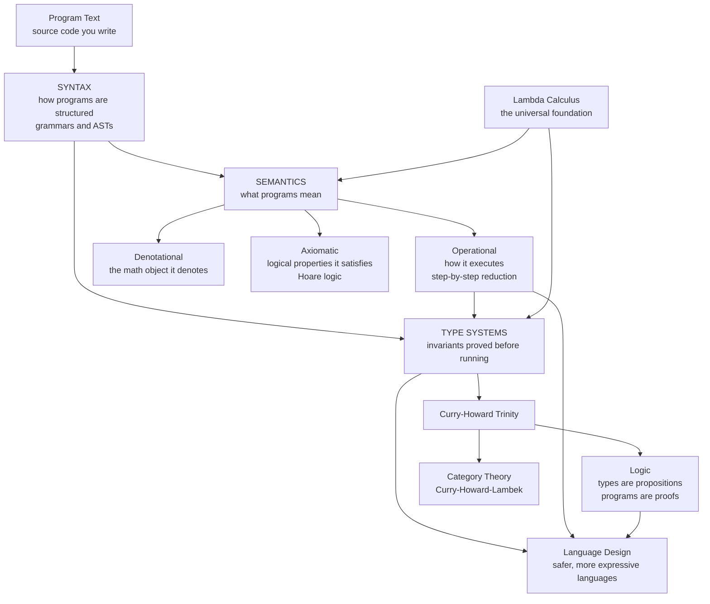

# 🔬 Programming Language Theory Overview

> [!abstract] TL;DR
> **Programming language theory (PLT)** is the *mathematical* study of programming languages — not how to *implement* them, but what they **mean** and what they **guarantee**. It answers three big questions: **syntax** (how programs are structured), **semantics** (what programs *mean*, in three complementary styles — **operational**, **denotational**, **axiomatic**), and **types** (what invariants hold *before* a program ever runs). Its foundation is Church's **lambda calculus** — functions and application, nothing else — the minimal universal model of computation underlying every functional language. Its deepest idea is the **Curry-Howard correspondence**: *types are propositions, programs are proofs, and running a program is normalizing a proof*. PLT is where **Rust's ownership**, **TypeScript's gradual types**, and **proof assistants like Coq** were born. This note opens the whole PLT vault and maps the road ahead.

---

## Intuition

**Analogy — the physics beneath the engineering.** A **compiler engineer** is like the structural engineer who *builds* a bridge: they pick the steel, weld the joints, and pour the concrete so that trucks can cross tomorrow morning. That is a craft of enormous skill — but it rests on something deeper. **Programming language theory is the physics that says which bridges can stand at all.** Before a single bolt is placed, physics tells you which loads a truss can bear, which shapes will resonate and collapse, and why a suspension design is safe where a flat slab would fail. PLT plays that role for languages: it studies what a program *means*, which category of error is *impossible by construction*, and *why* a language feature is safe — the science beneath the craft of language design.

Put differently: PLT studies programming languages the way mathematicians study number systems. A mathematician does not ask "how do I add these two numbers on paper?" — that is arithmetic, a technique. They ask "what *is* a number, which structures obey which laws, and what can we prove holds for *all* of them?" PLT asks the analogous questions about programs: not "how do I write this loop?" but **"what does this program mean, which type errors can never occur, and why is this construct sound?"** Intuition first, jargon second — the rest of this note names the machinery.

---

## How It Works

### Core Mechanics

PLT dissects a language into three layers, each with its own theory. A program is *one artifact* seen from *three angles*.

**1. Syntax — how programs are structured.** Syntax is the *shape* of well-formed programs, described by a **formal grammar** (usually a context-free grammar). It defines what strings are even legal to write and how they nest into an **abstract syntax tree (AST)**. Syntax is where PLT and compilers overlap most directly — the same context-free grammars that a parser uses, PLT treats as the raw material for everything downstream. But syntax alone says *nothing* about meaning: `if 2 <= 3 then ... else ...` is well-*formed* long before we know what it *does*. *(Vault siblings to come: `Formal_Syntax_and_Grammars`; see also [[Context_Free_Grammars_for_Parsing]] and [[Abstract_Syntax_Trees_and_Parser_Design]].)*

**2. Semantics — what programs mean.** This is the beating heart of PLT, and it comes in **three complementary styles**, each answering "what does this program mean?" from a different stance:

- **Operational semantics — *how it executes*.** Meaning is defined by a set of rewrite rules that reduce a term step by step, like showing your work in algebra. `2 + 3` reduces to `5`; `if true then a else b` reduces to `a`. **Small-step** (structural) semantics gives you the whole reduction *trace*; **big-step** (natural) semantics jumps straight to the final value. This is the most operational, machine-like view. *(Sibling to come: `Operational_Semantics`.)*
- **Denotational semantics — *what mathematical object it denotes*.** Meaning is a *function* mapping each program to an abstract mathematical value — a number, a set, or a point in a **domain** (a partially ordered structure that handles recursion and non-termination). The program `factorial` doesn't "run"; it *denotes* the mathematical factorial function. *(Sibling to come: `Denotational_Semantics`.)*
- **Axiomatic semantics — *what logical properties it satisfies*.** Meaning is described by *what you can prove* about a program using **Hoare logic**: triples `{P} c {Q}` meaning "if precondition `P` holds and command `c` terminates, then `Q` holds." You never "run" the program; you reason about it as a logical object. This is the direct ancestor of program verification. *(Sibling to come: `Axiomatic_Semantics_and_Hoare_Logic`.)*

These three are not rivals — they are three lenses on the same program, and proving them *equivalent* (that the operational trace agrees with the denotation, which validates the Hoare rules) is itself a central PLT result.

**3. Types — invariants guaranteed before running.** A **type system** is a lightweight, decidable, *static* proof method: it classifies terms so that whole classes of errors are ruled out *before execution*. Robin Milner's slogan captures the goal — **"well-typed programs don't go wrong."** Soundness is proved by two lemmas working together: **progress** (a well-typed term is either a value or can take a step — it is never *stuck*) and **preservation** (if a well-typed term steps, the result is still well-typed, with the same type). Types span a huge spectrum — from **dynamic** (checks at runtime) through **simply-typed**, **polymorphic** (Hindley-Milner, the theory behind ML/Haskell inference), all the way to **dependent types** where a type can mention a *value* (e.g., "a vector of length `n`"), letting the type system express arbitrary specifications. *(Siblings to come: `Type_Systems_Fundamentals`, `Simply_Typed_Lambda_Calculus`, `Dependent_Types_and_Advanced_Type_Systems`; the engineering side lives in [[Type_Checking_and_Type_Systems]] and [[Type_Inference_and_Hindley_Milner]].)*

**The foundation — the lambda calculus.** Underneath all of this sits Church's **lambda calculus**: a language with *only* variables, function abstraction `λx. e`, and application `e₁ e₂` — no numbers, no loops, no memory. Astonishingly, that is **Turing-complete**: it computes exactly what a Turing machine can. It is the theoretical core of every functional language and the substrate on which type systems and semantics are studied. *(Sibling to come: `The_Lambda_Calculus`; the computability angle is [[Recursive_Functions_and_Lambda_Calculus]] and [[Turing_Machines_and_the_Church_Turing_Thesis]].)*

**The deepest idea — Curry-Howard.** The **Curry-Howard correspondence** reveals that **types *are* propositions and programs *are* proofs**: a function type `A → B` is exactly the implication "A implies B," a well-typed program of that type is a *constructive proof* of that implication, and *evaluating* the program is *normalizing* the proof. Extended by **Lambek** to category theory, it becomes a *trinity* — **type theory ≅ intuitionistic logic ≅ cartesian-closed categories** — one structure wearing three costumes. This is why writing a well-typed program is *literally* constructing a mathematical proof, and why **proof assistants** (Coq, Agda, Lean) are also programming languages. *(Sibling to come: `The_Curry_Howard_Correspondence`; the logic side is [[Proof_Theory_and_Natural_Deduction]] and [[Category_Theory]].)*

### PLT vs Compilers — science vs engineering

These two fields are complementary, not competing, and the distinction is the fastest way to *place* PLT:

| | **Programming Language Theory (science)** | **Compilers (engineering)** |
|---|---|---|
| **Core question** | What does a language *mean*? What properties *hold*? | How do I *implement* this language efficiently? |
| **Central artifacts** | Semantics, type soundness, expressiveness proofs | Lexers, parsers, IRs, register allocation, codegen |
| **Typical result** | "This type system is sound" / "these two semantics agree" | "This program compiles to fast, correct machine code" |
| **Success looks like** | A theorem | A working, fast binary |
| **Where they meet** | Type systems, formal semantics, verified compilers | [[Type_Checking_and_Type_Systems]], [[Formal_Semantics_and_Verified_Compilers]] |

A compiler *implements* the language PLT *specifies*. When PLT proves a type system sound, a compiler's type checker *enforces* it; when PLT gives a formal semantics, a **verified compiler** (like CompCert) proves its translation *preserves* that semantics. See [[Compilers_Overview]] and [[Interpreters_and_Tree_Walking]] for the engineering counterpart.

### Flow / Architecture



---

## Key Concepts

**Secondary (explain to a curious beginner).**
- A programming language has a **grammar** (what you're allowed to write) and a **meaning** (what it does) — these are *separate* things, and PLT studies the meaning.
- A **type** is a promise about a value: "this is a number, not a word." A **type checker** verifies those promises *before* the program runs, catching bugs early.
- Some errors can be made *impossible* by the language's design, not just unlikely — that is the whole point of a type system.

**Undergraduate (requires a CS background).**
- **Small-step vs big-step operational semantics**: reduce term-by-term and watch the trace, versus jump straight to the final value.
- **Type soundness = progress + preservation**: well-typed programs never get "stuck," and reduction keeps them well-typed — this is Milner's *"well-typed programs don't go wrong."*
- The **lambda calculus** is Turing-complete with only abstraction and application; the **simply-typed** lambda calculus adds types and (losing Turing-completeness) guarantees termination.
- **Hindley-Milner type inference** lets ML/Haskell figure out every type with *no annotations*, via unification.

**Graduate (system-level and foundational thinking).**
- The **Curry-Howard-Lambek trinity**: intuitionistic propositional logic ≅ simply-typed lambda calculus ≅ cartesian-closed categories; proofs and programs are the *same objects*.
- **Denotational semantics via domain theory**: modeling recursion and non-termination with complete partial orders and least fixed points (Scott-Strachey).
- **Dependent type theory** (Martin-Löf) and the **propositions-as-types** program underlying Coq/Agda/Lean, up to homotopy type theory.
- **Parametricity** and "theorems for free" — the polymorphic type of a function constrains its behavior so tightly you can derive theorems from the *type alone* (Reynolds, Wadler).

---

## Python Demo

A **minimal end-to-end PLT pipeline** for a tiny typed expression language. We (1) **parse** source text into an **AST** (syntax), (2) give it a **small-step operational semantics** — a reducer that rewrites the term one step at a time (semantics), and (3) run a **type checker** (types). We then run it all on one example and *visualize* the three views: the AST, the reduction trace, and the inferred type. The point: **syntax, semantics, and types are three distinct views of the same program.**

```python
# A tiny typed expression language:  n | true | false | e+e | e*e | e<=e | if e then e else e
# Three PLT views of ONE program: SYNTAX (AST) -> SEMANTICS (small-step) -> TYPES (checker).
import re
from dataclasses import dataclass
import matplotlib.pyplot as plt

# ---------- AST (SYNTAX) ----------
@dataclass
class Num:  n: int
@dataclass
class Bul:  b: bool
@dataclass
class Add:  l: object; r: object
@dataclass
class Mul:  l: object; r: object
@dataclass
class Leq:  l: object; r: object
@dataclass
class If:   c: object; t: object; e: object

def children(t):
    if isinstance(t, (Num, Bul)):      return []
    if isinstance(t, (Add, Mul, Leq)): return [t.l, t.r]
    if isinstance(t, If):              return [t.c, t.t, t.e]

def label(t):
    return {Num: lambda: str(t.n), Bul: lambda: "true" if t.b else "false",
            Add: lambda: "+", Mul: lambda: "*", Leq: lambda: "<=",
            If:  lambda: "if"}[type(t)]()

def pretty(t):
    if isinstance(t, Num): return str(t.n)
    if isinstance(t, Bul): return "true" if t.b else "false"
    if isinstance(t, Add): return f"({pretty(t.l)} + {pretty(t.r)})"
    if isinstance(t, Mul): return f"({pretty(t.l)} * {pretty(t.r)})"
    if isinstance(t, Leq): return f"({pretty(t.l)} <= {pretty(t.r)})"
    if isinstance(t, If):  return f"if {pretty(t.c)} then {pretty(t.t)} else {pretty(t.e)}"

# ---------- PARSER (text -> AST) ----------
def tokenize(s):
    return re.findall(r'<=|[+*()]|\bif\b|\bthen\b|\belse\b|\btrue\b|\bfalse\b|\d+', s)

class Parser:
    def __init__(self, toks): self.toks, self.i = toks, 0
    def peek(self):   return self.toks[self.i] if self.i < len(self.toks) else None
    def take(self):   t = self.toks[self.i]; self.i += 1; return t
    def eat(self, x):
        assert self.peek() == x, f"expected {x!r}, got {self.peek()!r}"; self.take()
    def expr(self):                                   # 'if' binds loosest
        if self.peek() == 'if':
            self.take(); c = self.expr(); self.eat('then')
            t = self.expr(); self.eat('else'); e = self.expr(); return If(c, t, e)
        return self.comparison()
    def comparison(self):
        x = self.addition()
        if self.peek() == '<=': self.take(); return Leq(x, self.addition())
        return x
    def addition(self):
        x = self.mult()
        while self.peek() == '+': self.take(); x = Add(x, self.mult())
        return x
    def mult(self):
        x = self.atom()
        while self.peek() == '*': self.take(); x = Mul(x, self.atom())
        return x
    def atom(self):
        t = self.peek()
        if t == '(':     self.take(); e = self.expr(); self.eat(')'); return e
        if t == 'true':  self.take(); return Bul(True)
        if t == 'false': self.take(); return Bul(False)
        self.take();     return Num(int(t))

def parse(s): return Parser(tokenize(s)).expr()

# ---------- TYPE CHECKER (static: proves a type BEFORE running) ----------
def type_of(t):
    if isinstance(t, Num): return "Nat"
    if isinstance(t, Bul): return "Bool"
    if isinstance(t, (Add, Mul)):
        assert type_of(t.l) == "Nat" and type_of(t.r) == "Nat", "arith needs Nat"
        return "Nat"
    if isinstance(t, Leq):
        assert type_of(t.l) == "Nat" and type_of(t.r) == "Nat", "<= needs Nat"
        return "Bool"
    if isinstance(t, If):
        assert type_of(t.c) == "Bool", "if-condition must be Bool"
        tt, te = type_of(t.t), type_of(t.e)
        assert tt == te, "both if-branches must share a type"
        return tt

# ---------- OPERATIONAL SEMANTICS (small-step: ONE rewrite per step) ----------
def is_value(t): return isinstance(t, (Num, Bul))

def step(t):
    if isinstance(t, (Add, Mul, Leq)):
        if not is_value(t.l): return type(t)(step(t.l), t.r)   # reduce left first
        if not is_value(t.r): return type(t)(t.l, step(t.r))   # then right
        a, b = t.l.n, t.r.n                                    # both values -> compute
        return Num(a + b) if isinstance(t, Add) else \
               Num(a * b) if isinstance(t, Mul) else Bul(a <= b)
    if isinstance(t, If):
        if not is_value(t.c): return If(step(t.c), t.t, t.e)   # reduce condition
        return t.t if t.c.b else t.e                           # pick a branch

def reduce_all(t):
    trace = [t]
    while not is_value(t):
        t = step(t); trace.append(t)
    return trace

def size(t): return 1 + sum(size(c) for c in children(t))

# ---------- RUN THE PIPELINE ----------
SRC = "if 2 <= 3 then 4 + 5 * 6 else 0"
ast     = parse(SRC)                 # SYNTAX
the_typ = type_of(ast)              # TYPES  (before running!)
trace   = reduce_all(ast)          # SEMANTICS
value   = trace[-1]

print(f"source : {SRC}")
print(f"type   : {the_typ}   (proved statically, before any reduction)")
print("reduction sequence (operational semantics):")
for i, term in enumerate(trace):
    arrow = "   " if i == 0 else "-> "
    print(f"  {arrow}{pretty(term)}")
print(f"value  : {pretty(value)} : {the_typ}")

# ---------- VISUALIZE: three views of one program ----------
def layout(node, depth=0, box=[0]):
    ch = children(node); pos = {}; edges = []; lbl = {}
    if not ch:
        x = box[0]; box[0] += 1
    else:
        xs = []
        for c in ch:
            p, e, l = layout(c, depth + 1, box)
            pos.update(p); edges += e; lbl.update(l); xs.append(p[id(c)][0])
            edges.append((id(node), id(c)))
        x = sum(xs) / len(xs)
    pos[id(node)] = (x, -depth); lbl[id(node)] = label(node)
    return pos, edges, lbl

pos, edges, lbl = layout(ast)
fig = plt.figure(figsize=(15, 7))
gs = fig.add_gridspec(1, 3, width_ratios=[1.1, 1.2, 0.9])

# View 1: SYNTAX (the AST)
ax = fig.add_subplot(gs[0, 0]); ax.set_title("1. SYNTAX  (abstract syntax tree)")
for a, b in edges:
    (x1, y1), (x2, y2) = pos[a], pos[b]
    ax.plot([x1, x2], [y1, y2], color="#888", zorder=1)
for nid, (x, y) in pos.items():
    ax.scatter([x], [y], s=900, color="#4C72B0", zorder=2)
    ax.text(x, y, lbl[nid], ha="center", va="center", color="white", fontweight="bold")
ax.axis("off")

# View 2: SEMANTICS (the reduction ladder)
ax = fig.add_subplot(gs[0, 1]); ax.set_title("2. SEMANTICS  (small-step reduction)")
for i, term in enumerate(trace):
    y = len(trace) - i
    prefix = "" if i == 0 else "->  "
    ax.text(0.02, y, prefix + pretty(term), fontsize=11, family="monospace", va="center")
ax.set_ylim(0, len(trace) + 1); ax.set_xlim(0, 1); ax.axis("off")

# View 3: TYPES (term shrinks toward a value; the type is invariant)
ax = fig.add_subplot(gs[0, 2]); ax.set_title(f"3. TYPES  (invariant: {the_typ})")
sizes = [size(t) for t in trace]
ax.bar(range(len(sizes)), sizes, color="#55A868")
ax.axhline(1, ls="--", color="#C44E52", label="value reached")
ax.set_xlabel("reduction step"); ax.set_ylabel("AST node count")
ax.text(len(sizes) - 1, 1.5, f"{pretty(value)} : {the_typ}",
        ha="right", color="#C44E52", fontweight="bold")
ax.legend(loc="upper right")

fig.suptitle("One program, three PLT views: syntax -> semantics -> types", fontsize=14)
fig.tight_layout()
plt.show()   # or: fig.savefig("plt_pipeline.png", dpi=120)
```

Running it prints the reduction trace and the statically-inferred type:

```
source : if 2 <= 3 then 4 + 5 * 6 else 0
type   : Nat   (proved statically, before any reduction)
reduction sequence (operational semantics):
     if (2 <= 3) then (4 + (5 * 6)) else 0
  -> if true then (4 + (5 * 6)) else 0
  -> (4 + (5 * 6))
  -> (4 + 30)
  -> 34
value  : 34 : Nat
```

Notice the payoff: the **type** `Nat` was known *before* a single reduction step (that is the whole power of static typing), the **semantics** produced the reduction *ladder* that ends in a value, and the **syntax** was the tree that both of the other two views operated on — **three views of the one program**.

---

## Real-World Applications

> **Rust's borrow checker.** Rust's **ownership and borrowing** system is *affine type theory* (a resource-aware type system where values are used at most once) turned into a production language. PLT research on linear/affine types is exactly what lets Rust prove — at compile time, with zero runtime cost — that there are no use-after-free or data races. *(Sibling to come: `Memory_and_Ownership_Models`.)*

- **TypeScript / mypy / gradual typing.** The theory of **gradual typing** (Siek and Taha) lets a language mix statically- and dynamically-typed code soundly, so a JavaScript or Python codebase can add types incrementally. *(Sibling to come: `Gradual_and_Optional_Typing`.)*
- **Proof assistants (Coq, Agda, Lean, Isabelle).** Direct applications of Curry-Howard and dependent type theory: writing a *program* is writing a *proof*. Used to build [[Formal_Semantics_and_Verified_Compilers|CompCert]] (a C compiler proven correct) and seL4 (a verified OS kernel). *(Sibling to come: `Verified_and_Certified_Languages`.)*
- **Hindley-Milner inference** in ML, Haskell, OCaml, Rust, and Swift — you write no type annotations yet get full static checking. See [[Type_Inference_and_Hindley_Milner]].
- **WebAssembly's formal spec.** WebAssembly ships with a machine-checked **operational semantics and type-soundness proof** — a rare case of an industrial language designed *with* PLT from day one.

---

## Common Pitfalls

- **Confusing PLT with compilers.** PLT asks what a language *means* and *guarantees*; compilers ask how to *implement* it fast. You can prove a type system sound without writing a compiler, and you can hack a compiler with no soundness proof — but the best languages do both.
- **Thinking "syntax" is the hard part.** Beginners obsess over grammar and parsing; PLT's *depth* is in **semantics** and **types**, where the real theorems live. Parsing is largely a solved engineering problem.
- **Assuming "dynamically typed = untyped."** Dynamic languages *do* have types — they are just checked at runtime. The PLT distinction is *when* checking happens (static vs dynamic), not *whether* types exist.
- **Reading Curry-Howard as a loose metaphor.** It is a *precise mathematical isomorphism*, not an analogy: a proof of `A ∧ B` and a value of type `(A, B)` are literally the same object under the correspondence.
- **Believing "well-typed = correct."** Type soundness only guarantees the program won't *go wrong* in the ways the type system tracks. A well-typed program can still compute the wrong answer — types rule out *categories* of bugs, not all bugs.
- **Ignoring termination when reasoning about semantics.** A small-step reducer can loop forever; denotational semantics needs domain theory precisely to give meaning to non-terminating programs.

---

## Related Concepts

- [[Compilers_Overview]] — the engineering counterpart: PLT *specifies* a language, a compiler *implements* it.
- [[Type_Checking_and_Type_Systems]] — the compiler-side realization of the type theory PLT develops.
- [[Type_Inference_and_Hindley_Milner]] — how ML-family languages infer every type with no annotations, straight from PLT.
- [[Formal_Semantics_and_Verified_Compilers]] — where PLT semantics meets engineering: compilers proven to preserve meaning (CompCert).
- [[Interpreters_and_Tree_Walking]] — the most direct implementation of an operational semantics — a reducer that walks the AST.
- [[Recursive_Functions_and_Lambda_Calculus]] — the computability roots of the lambda calculus, PLT's foundation.
- [[Turing_Machines_and_the_Church_Turing_Thesis]] — why the lambda calculus is a *universal* model of computation.
- [[Theory_of_Computation_Overview]] — the sibling field studying *what* is computable; PLT studies *how we describe and constrain* computation.
- [[Category_Theory]] — the third leg of the Curry-Howard-Lambek trinity; the mathematics of composition behind denotational semantics.
- [[Proof_Theory_and_Natural_Deduction]] — the logic side of Curry-Howard: proofs *are* programs, and normalization *is* evaluation.
- [[Mathematical_Logic_and_Set_Theory]] — the intuitionistic logic and foundations PLT is applied on top of.
- [[Logic_and_Proof_Techniques]] — induction and structural proof, the everyday tools for proving type soundness.
- [[Logic_in_AI_and_Computation]] — how the same logical machinery reappears in automated reasoning and verification.
- [[Context_Free_Grammars_for_Parsing]] — the grammars that define PLT's "syntax" layer.
- [[Abstract_Syntax_Trees_and_Parser_Design]] — the AST, the shared artifact every semantics and type system operates on.

*(Vault siblings referenced in prose but not yet built: `The_Lambda_Calculus`, `Type_Systems_Fundamentals`, `Formal_Syntax_and_Grammars`, `Operational_Semantics`, `Denotational_Semantics`, `Axiomatic_Semantics_and_Hoare_Logic`, `The_Curry_Howard_Correspondence`, `Simply_Typed_Lambda_Calculus`, `Dependent_Types_and_Advanced_Type_Systems`, `Functional_Programming_Foundations`, `Logic_and_Constraint_Programming`, `Object_Oriented_Language_Theory`, `Concurrency_and_Process_Calculi`, `Memory_and_Ownership_Models`, `Gradual_and_Optional_Typing`, `Verified_and_Certified_Languages`.)*

---

## The Vault Roadmap

This note opens a six-section PLT vault:

1. **Foundations & Lambda Calculus** *(you are here)* — what PLT is, the lambda calculus, computation as substitution.
2. **Semantics** — operational, denotational, and axiomatic styles; Hoare logic; proving them equivalent.
3. **Type Systems** — from simply-typed to polymorphic to dependent; soundness via progress and preservation.
4. **Curry-Howard & Logic** — types as propositions, programs as proofs, and the Lambek extension to categories.
5. **Paradigms** — functional, logic/constraint, object-oriented, and concurrent languages as distinct theoretical foundations.
6. **Design & Frontiers** — memory/ownership models, gradual typing, verified languages, and open research.

---

## Review Questions

1. **(Secondary)** A program is described as "syntactically valid but semantically meaningless." Give a concrete example in the tiny language of the demo, and explain which of the three PLT layers rejects it and which accepts it.
2. **(Undergraduate)** State the **progress** and **preservation** lemmas. Explain precisely how, *together*, they justify Milner's slogan "well-typed programs don't go wrong," and give an example of a *stuck* term that a sound type system forbids.
3. **(Graduate)** The Curry-Howard correspondence says types are propositions and programs are proofs. (a) What logical connective does the function type `A → B` correspond to, and what does *evaluating* a program correspond to on the logic side? (b) The simply-typed lambda calculus is *strongly normalizing* (every program terminates). What does that fact tell you about the corresponding logic, and why does it mean the STLC is *not* Turing-complete?

---

## Sources

- Benjamin C. Pierce, *Types and Programming Languages* (TAPL), MIT Press, 2002 — the standard graduate text on type systems, soundness, and lambda calculus.
- Robert Harper, *Practical Foundations for Programming Languages* (PFPL), 2nd ed., Cambridge University Press, 2016 — [online](https://www.cs.cmu.edu/~rwh/pfpl/).
- Glynn Winskel, *The Formal Semantics of Programming Languages*, MIT Press, 1993 — the classic treatment of operational, denotational, and axiomatic semantics.
- Philip Wadler, "Propositions as Types," *Communications of the ACM* 58(12), 2015 — [PDF](https://homepages.inf.ed.ac.uk/wadler/papers/propositions-as-types/propositions-as-types.pdf).
- Robin Milner, "A Theory of Type Polymorphism in Programming," *J. Computer and System Sciences* 17(3), 1978 — origin of Hindley-Milner and *"well-typed programs don't go wrong."*

---

#programming-language-theory #plt #semantics #type-systems #language-design
