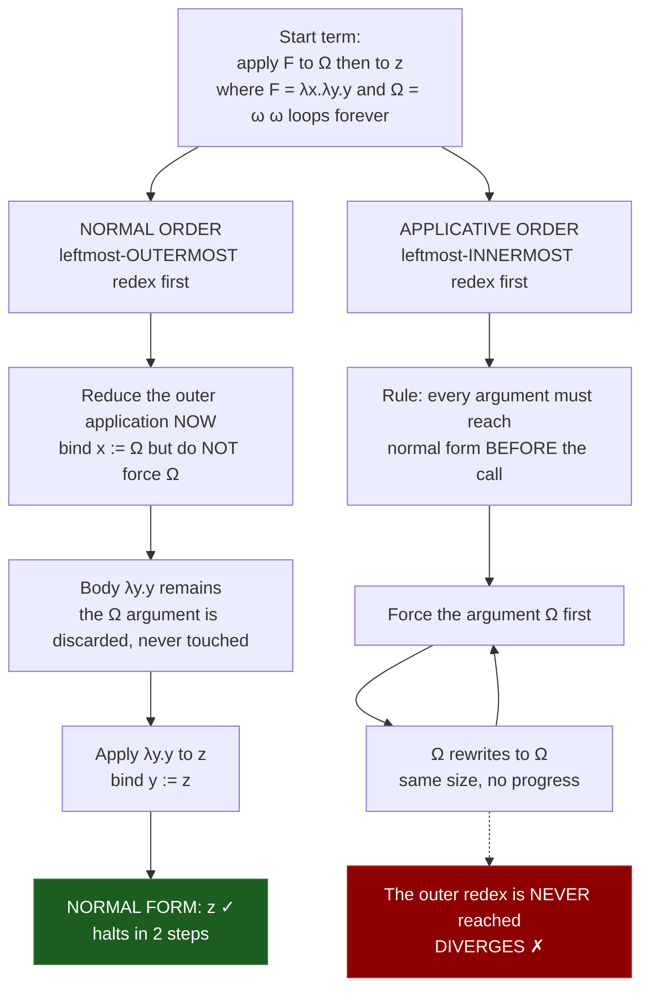

# ♻️ Reduction Strategies and Evaluation Order

> [!abstract] TL;DR
> A lambda term can contain several **redexes** (reducible sub-expressions) at once, and a **reduction strategy** decides which one to simplify next. **Church-Rosser** guarantees the answer is *unique if you reach it* — but not that you *will* reach it: **normal order** (leftmost-outermost, do not touch arguments until needed) always finds the normal form if one exists, while **applicative order** (arguments first) is simpler and faster but can loop forever on an argument that was never used. Those two abstract strategies are exactly the **call-by-name / call-by-value** split in real languages, with **call-by-need** (lazy + memoized) as Haskell's refinement — and the choice governs termination, wasted work, side-effect timing, and whether infinite data structures are even possible.

---

## Intuition

**Analogy — a recipe with optional sub-steps.** You are following a recipe: *"Combine the batter with the caramelized-onion garnish only if serving savory; otherwise discard the garnish."* Caramelizing onions takes 40 minutes. Do you start caramelizing **before** you have decided whether the dish is savory?

- The **eager cook** caramelizes the onions first, then reads the rule and throws them away for the sweet version — 40 minutes wasted. Worse, if the garnish recipe secretly called for *"a pinch of the previous batch of onions"* (an infinite regress), the eager cook would loop forever prepping an ingredient the final dish never uses.
- The **lazy cook** writes "onion garnish" on a sticky note, proceeds with the recipe, and only actually caramelizes if and when a step reaches for that note. If the dish turns out sweet, the note is discarded untouched — zero wasted minutes, and the infinite-regress garnish is never triggered.

That is the whole story. **"Evaluate the argument first" (eager / applicative order)** can waste work — or diverge — on arguments never needed. **"Pass the argument unevaluated and compute it only when actually used" (lazy / normal order)** dodges both, at the cost of possibly re-doing work if the note is consulted many times. A **reduction strategy is the cook's policy for which sub-step to resolve next**, and in the lambda calculus that policy determines whether the computation halts at all.

---

## How It Works

### Core Mechanics

In the untyped **lambda calculus** the only rewrite rule is **beta-reduction**: applying a function to an argument means substituting the argument for the bound variable, `(λx. E) A → E[x := A]`. Any sub-term of that shape `(λx. E) A` is a **redex**. A term with several redexes offers several legal next moves, and here is the deep fact:

1. **Confluence / Church-Rosser.** No matter which redexes you pick, if two reduction paths both terminate they terminate at the *same* **normal form** (up to renaming). The result is order-independent — see [[Recursive_Functions_and_Lambda_Calculus]] for the confluence proof. So the strategy never changes *what* the answer is.
2. **But termination is not confluent.** Confluence only promises agreement *when both paths reach a normal form*. Some strategies reach it; others spin forever on the *same* term. Order therefore controls **whether** you get an answer, not **which** answer.
3. **Normal order = leftmost-outermost.** Always reduce the outermost, leftmost redex first — meaning you substitute the *unevaluated* argument into the function body before ever looking at the argument. The **standardization theorem** proves normal order is **normalizing**: if a normal form exists, normal order finds it. It corresponds to **call-by-name**.
4. **Applicative order = leftmost-innermost.** Reduce arguments all the way to normal form *before* applying the function. It is simpler to implement, matches how a stack-based machine naturally works, and never duplicates argument work — but it is **not normalizing**: it can diverge on an argument that a normal-order run would have discarded. It corresponds to **call-by-value**.
5. **The canonical separating term.** Let `Ω = (λx. x x)(λx. x x)`, which beta-reduces to itself forever, and let `F = λx.λy. y`, which ignores its first argument. The term `F Ω z` has two redexes. Normal order reduces the outer one first, binding `x := Ω` **without forcing Ω**, discards it, and returns `z`. Applicative order insists on normalizing the argument `Ω` first and **never terminates**. Same term, one strategy halts, the other loops — with confluence still intact because only one path ever produces a normal form.

### From strategies to real evaluation orders

| Abstract strategy | Language mechanism | What is passed | Unused arg | Arg used N times |
|---|---|---|---|---|
| Applicative / leftmost-innermost | **Call-by-value** (C, Java, Python, ML, Rust) | the *value* | computed anyway (wasted / may diverge) | computed once |
| Normal / leftmost-outermost | **Call-by-name** (Scala `=> T`, Algol thunks) | an unevaluated **thunk** | never computed | recomputed N times |
| Normal + sharing | **Call-by-need / lazy** (Haskell, Scala `lazy val`) | a **memoized** thunk | never computed | computed at most **once** |

**Call-by-need** is the sweet spot: it is call-by-name (never forces unused arguments, so it is normalizing in practice) *plus* **memoization** so each argument is evaluated at most once — the best of both. Implementations realize this with **thunks** (heap cells holding a suspended computation) that are **forced** on demand to **weak head normal form (WHNF)** — reduced just far enough to expose the outermost constructor or lambda, then overwritten with the result so the next access is free. This graph-sharing is what lets Haskell define `ones = 1 : ones` or `fibs = 0 : 1 : zipWith (+) fibs (tail fibs)` — infinite structures consumed only as far as demanded.

### Strict vs non-strict, and the bottom element

A function is **strict** if it forces its argument (`f ⊥ = ⊥`: given a diverging input `⊥`, it diverges). It is **non-strict** if it can return a result while ignoring a diverging argument (`F` above is non-strict in its first argument). **Domain theory** models divergence as the bottom element `⊥` and makes "strictness" a precise property of a function's denotation — this is the semantic backbone linking evaluation order to meaning. Notably, **conditionals and short-circuit operators are non-strict even in eager languages**: `if`, `&&`, `||`, and Python's `and`/`or` do *not* evaluate every operand, which is exactly call-by-name applied selectively.



---

## Key Concepts

### Secondary (intuition level)
- **Eager vs lazy.** Eager: do the work up front. Lazy: postpone until the result is actually demanded.
- **Short-circuiting.** `false && expensive()` and `true || expensive()` skip `expensive()` — even C and Python evaluate lazily *here*. `if` picks one branch and ignores the other. Non-strictness is already everywhere.
- **Wasted work.** Computing an argument a function throws away is pure waste; if that argument loops forever, the waste becomes a hang.

### Undergraduate (PLT / lambda calculus)
- **Redex, beta-reduction, normal form.** A redex is `(λx.E) A`; reduce until none remain (the normal form).
- **Normal order (leftmost-outermost) vs applicative order (leftmost-innermost).** The two canonical strategies; the former is normalizing, the latter is not.
- **Church-Rosser / confluence.** Unique normal form when reached, independent of order — see [[Recursive_Functions_and_Lambda_Calculus]].
- **Standardization theorem.** Normal-order reduction finds the normal form iff one exists.
- **Call-by-value / call-by-name / call-by-need.** The three implementable evaluation strategies and their thunk/memoization mechanics.
- **WHNF and thunks.** Weak head normal form is "reduced enough to see the top constructor"; a thunk is a delayed computation forced to WHNF on demand.

### Graduate (semantics & implementation)
- **Strict vs non-strict semantics** and the **bottom `⊥`** element of **domain theory**; strictness analysis as a compiler optimization that safely turns lazy thunks into eager evaluation where no divergence can be introduced.
- **Operational semantics of strategies** as **evaluation contexts** `E[·]`: call-by-value fixes `E ::= E t | v E | ...` so the hole is dragged into arguments; call-by-name restricts it so redexes at the head fire first. The strategy becomes a *grammar of where the hole may sit*.
- **The call-by-need lambda calculus** (Ariola–Felleisen–Wadler et al.): a formal calculus with explicit `let`-sharing that proves call-by-need is observationally equivalent to call-by-name but with call-by-value's work bound.
- **Space leaks and reasoning cost.** Laziness decouples production from consumption but makes time and especially **space** behavior hard to predict — unforced thunks pile up, retaining memory (the classic lazy `foldl` leak).
- **Effects vs laziness.** Non-strict evaluation scrambles the *order and count* of side effects, which is precisely why Haskell sequences I/O through **monads** rather than raw evaluation order.
- **Graph reduction / STG / optimal reduction.** Real lazy machines share sub-terms as graphs (Wadsworth); Lévy's *optimal* reduction and Lamping's sharing graphs push work-minimization further than call-by-need.

---

## Python Demo

A tiny lambda-calculus engine implementing **normal-order** (leftmost-outermost) and **applicative-order** (leftmost-innermost) reduction, run on the separating term `(λx.λy.y) Ω z`. It then counts reduction steps across several terms and simulates the **call-by-value / call-by-name / call-by-need** work profiles. Pure stdlib plus matplotlib.

```python
"""Reduction strategies: normal order vs applicative order + CBV/CBN/CBNeed work."""
import matplotlib.pyplot as plt

# ---------- Lambda term AST ----------
class Var:
    def __init__(self, name): self.name = name
class Abs:
    def __init__(self, var, body): self.var, self.body = var, body
class App:
    def __init__(self, func, arg): self.func, self.arg = func, arg

def V(n): return Var(n)
def L(v, b): return Abs(v, b)
def A(f, x): return App(f, x)

def show(t):
    if isinstance(t, Var): return t.name
    if isinstance(t, Abs): return f"λ{t.var}.{show(t.body)}"
    f = show(t.func); a = show(t.arg)
    if isinstance(t.func, Abs): f = f"({f})"
    if isinstance(t.arg, (Abs, App)): a = f"({a})"
    return f"{f} {a}"

# ---------- Free variables + capture-avoiding substitution ----------
_fresh = [0]
def fresh(base, avoid):
    while True:
        _fresh[0] += 1
        cand = f"{base}_{_fresh[0]}"
        if cand not in avoid: return cand

def free_vars(t):
    if isinstance(t, Var): return {t.name}
    if isinstance(t, Abs): return free_vars(t.body) - {t.var}
    return free_vars(t.func) | free_vars(t.arg)

def subst(t, x, s):
    if isinstance(t, Var):
        return s if t.name == x else t
    if isinstance(t, App):
        return App(subst(t.func, x, s), subst(t.arg, x, s))
    # Abs
    if t.var == x:                      # x rebound -> stop
        return t
    if t.var in free_vars(s):           # rename to avoid capture
        nv = fresh(t.var, free_vars(s) | free_vars(t.body) | {x})
        body = subst(t.body, t.var, Var(nv))
        return Abs(nv, subst(body, x, s))
    return Abs(t.var, subst(t.body, x, s))

# ---------- One step: NORMAL order (leftmost-OUTERMOST) ----------
def normal_step(t):
    if isinstance(t, App):
        if isinstance(t.func, Abs):                 # outermost redex here
            return subst(t.func.body, t.func.var, t.arg)   # do NOT force arg
        f = normal_step(t.func)
        if f is not None: return App(f, t.arg)
        a = normal_step(t.arg)
        if a is not None: return App(t.func, a)
        return None
    if isinstance(t, Abs):
        b = normal_step(t.body)
        return Abs(t.var, b) if b is not None else None
    return None

# ---------- One step: APPLICATIVE order (leftmost-INNERMOST) ----------
def applicative_step(t):
    if isinstance(t, App):
        f = applicative_step(t.func)                # normalize function first
        if f is not None: return App(f, t.arg)
        a = applicative_step(t.arg)                 # then the argument
        if a is not None: return App(t.func, a)
        if isinstance(t.func, Abs):                 # both normal -> fire redex
            return subst(t.func.body, t.func.var, t.arg)
        return None
    if isinstance(t, Abs):
        b = applicative_step(t.body)
        return Abs(t.var, b) if b is not None else None
    return None

def run(t, step, cap=40):
    cur, n = t, 0
    while n < cap:
        nxt = step(cur)
        if nxt is None:
            return cur, n, True          # normal form reached
        cur, n = nxt, n + 1
    return cur, n, False                  # capped -> diverges

# ---------- Term builders (fresh copies each call) ----------
def OMEGA():
    return A(L("x", A(V("x"), V("x"))), L("x", A(V("x"), V("x"))))  # (λx.x x)(λx.x x)
I  = lambda: L("x", V("x"))
K  = lambda: L("x", L("y", V("x")))            # returns first arg
Fn = lambda: L("x", L("y", V("y")))            # ignores first arg

terms = {
    "I a"                : A(I(), V("a")),
    "K a b"              : A(A(K(), V("a")), V("b")),
    "(λx.g x x)(I a)"    : A(L("x", A(A(V("g"), V("x")), V("x"))), A(I(), V("a"))),
    "(λx.λy.y) Ω z"      : A(A(Fn(), OMEGA()), V("z")),
}

print("=== Reduction of the separating term (λx.λy.y) Ω z ===")
res, steps, ok = run(terms["(λx.λy.y) Ω z"], normal_step)
print(f"  NORMAL order  -> {show(res)!r}  in {steps} steps  (halts={ok})")
res, steps, ok = run(terms["(λx.λy.y) Ω z"], applicative_step)
print(f"  APPLICATIVE   -> {show(res)!r:>18}  capped at {steps} steps  (halts={ok})")

labels, no_steps, ao_steps, ao_div = [], [], [], []
for name, term in terms.items():
    _, ns, _   = run(term, normal_step)
    _, as_, ok = run(term, applicative_step)
    labels.append(name); no_steps.append(ns); ao_steps.append(as_)
    ao_div.append(not ok)

# ---------- CBV / CBN / CBNeed work simulation ----------
def count_evals(strategy, times_used):
    counter = {"n": 0}
    def thunk():
        counter["n"] += 1     # each real evaluation of the argument
        return 1
    if strategy == "cbv":                 # eager: forced ONCE up front, reused
        v = thunk()
        for _ in range(times_used): _ = v
    elif strategy == "cbn":               # by-name: recomputed on EVERY use
        for _ in range(times_used): _ = thunk()
    elif strategy == "cbneed":            # lazy+memo: at most ONCE, only if used
        box = {"done": False, "val": None}
        def memo():
            if not box["done"]:
                box["val"] = thunk(); box["done"] = True
            return box["val"]
        for _ in range(times_used): _ = memo()
    return counter["n"]

uses = list(range(0, 7))
cbv    = [count_evals("cbv",    k) for k in uses]
cbn    = [count_evals("cbn",    k) for k in uses]
cbneed = [count_evals("cbneed", k) for k in uses]

# ---------- Plot ----------
fig, (axL, axR) = plt.subplots(1, 2, figsize=(13, 5))

x = range(len(labels)); w = 0.38
axL.bar([i - w/2 for i in x], no_steps, w, label="Normal order (CBN)", color="#2e7d32")
bars = axL.bar([i + w/2 for i in x], ao_steps, w, label="Applicative order (CBV)", color="#c62828")
for i, diverged in enumerate(ao_div):
    if diverged:
        axL.text(i + w/2, ao_steps[i] + 0.5, "✗ diverges\n(capped)", ha="center",
                 va="bottom", fontsize=8, color="#c62828")
axL.set_xticks(list(x)); axL.set_xticklabels(labels, rotation=20, ha="right", fontsize=8)
axL.set_ylabel("beta-reduction steps"); axL.set_title("Steps to normal form by strategy")
axL.legend()

axR.plot(uses, cbv,    "o-", label="call-by-value (eager)",  color="#c62828")
axR.plot(uses, cbn,    "s-", label="call-by-name (re-eval)", color="#1565c0")
axR.plot(uses, cbneed, "^-", label="call-by-need (memoized)", color="#2e7d32")
axR.set_xlabel("times the argument is actually used")
axR.set_ylabel("real evaluations of the argument")
axR.set_title("Wasted vs repeated work per strategy")
axR.axvline(0, ls=":", color="gray")
axR.annotate("CBV wastes 1 eval\non an UNUSED arg", xy=(0, 1), xytext=(1.2, 2.2),
             arrowprops=dict(arrowstyle="->"), fontsize=8)
axR.legend()

plt.tight_layout(); plt.savefig("reduction_strategies.png", dpi=120)
print("\nSaved reduction_strategies.png")
```

Expected console output:

```
=== Reduction of the separating term (λx.λy.y) Ω z ===
  NORMAL order  -> 'z'  in 2 steps  (halts=True)
  APPLICATIVE   ->  '(λx.λy.y) (...) z'  capped at 40 steps  (halts=False)
```

The left plot shows normal and applicative order agreeing on `I a` (1 step) and `K a b` (2 steps), applicative order winning on `(λx.g x x)(I a)` (2 vs 3 — normal order duplicates the unreduced argument), and applicative order **diverging** on `(λx.λy.y) Ω z` while normal order halts in 2. The right plot is the money shot: **call-by-value** always costs 1 evaluation even when the argument is used zero times (wasted work, top-left), **call-by-name** grows linearly (repeats work), and **call-by-need** flatlines at "0 if unused, 1 otherwise" — normalizing like CBN, cheap like CBV.

---

## Real-World Applications

- **Haskell (call-by-need by default).** Every binding is a thunk forced to WHNF on demand; this is why `take 5 [1..]`, `foldr` short-circuiting, and stream-fusion optimizations exist. Producers and consumers are decoupled — you can write infinite generators and let the consumer decide how much to force.
- **Scala `=> T` by-name params and `lazy val`.** A parameter typed `x: => Int` is call-by-name (re-evaluated on each use); a `lazy val` is call-by-need (memoized, computed on first access) — the same distinction the demo measures, exposed as language keywords. `LazyList` gives lazy streams. See [[Scala_Functions]] and [[Scala_Types_and_Variables]].
- **Kotlin `by lazy` and `Sequence`.** `val x by lazy { ... }` is textbook call-by-need with configurable thread-safety; `asSequence()` turns eager collection pipelines into lazy ones that avoid intermediate allocations. See [[Kotlin_Delegation]] and [[Kotlin_Collections]].
- **Python generators.** `yield` produces a lazy stream computed on demand — the practical face of non-strict evaluation in an eager language, letting you stream gigabytes without materializing them. See [[Generators_and_Iterators]].
- **Short-circuit control flow everywhere.** `&&`, `||`, `?:`, guard clauses, and null-coalescing (`?.`, `??`) are non-strict islands inside strict languages — deliberate call-by-name so the second operand is never touched when the first decides the outcome.
- **Build systems and spreadsheets.** Make, Bazel, and spreadsheet engines are giant call-by-need machines: a cell/target is recomputed only when demanded and its result is cached until an input changes.

---

## Common Pitfalls

- **Assuming order changes the answer — it does not; it changes termination.** Church-Rosser fixes the normal form; the strategy only decides whether you reach it. Reaching for "which order gives the right value" is the wrong question — ask "which order terminates and how much work it costs."
- **Applicative order on unused arguments.** Passing an expensive or diverging expression to a function that ignores it. In call-by-value this is wasted CPU at best and an infinite loop / crash at worst. Guard with laziness (thunk, by-name param, generator) when an argument might be unused or non-terminating.
- **Space leaks from laziness.** Unforced thunks accumulate and retain memory — the notorious lazy `foldl (+) 0 [1..1e7]` builds a giant thunk chain and blows the stack/heap. Use strict folds (`foldl'`) or `seq`/bang patterns to force early.
- **Effects under non-strict evaluation.** With laziness the *order and number of times* a side effect runs become unpredictable, because it fires when the thunk is forced, not where it is written. This clash is precisely why effects are sequenced through **monads** rather than left to evaluation order.
- **Call-by-name mistaken for call-by-need.** By-name **re-evaluates** on each use; if the argument is a costly pure computation used many times, by-name silently multiplies the cost. Reach for `lazy val` / memoization (call-by-need) when a by-name value is consulted repeatedly.
- **Forgetting WHNF is not full normal form.** Forcing a lazy value to WHNF exposes only the outermost constructor; the tail can still be an unevaluated thunk. `length xs` forces the spine but not the elements — a frequent source of "why is it still lazy here?" confusion.

---

## Related Concepts

- [[Recursive_Functions_and_Lambda_Calculus]] — the source of beta-reduction, redexes, normal form, and the Church-Rosser confluence theorem this note builds on.
- [[Generators_and_Iterators]] — Python's practical non-strict evaluation: `yield` as an on-demand thunk producing lazy streams.
- [[Scala_Functions]] — call-by-name parameters (`x: => T`) evaluated on each use, the direct language embodiment of normal order.
- [[Scala_Types_and_Variables]] — `lazy val` as call-by-need: a memoized thunk computed at most once on first access.
- [[Kotlin_Delegation]] — `by lazy` property delegate implementing call-by-need with selectable thread-safety modes.
- [[Kotlin_Collections]] — lazy `Sequence` pipelines that defer and fuse operations, avoiding intermediate collections.

*Not yet in the vault (planned PLT siblings, referenced in prose): The Lambda Calculus, Operational Semantics (evaluation contexts), Domain Theory and Fixed Points (the `⊥` element and strictness), Monads and Effects (sequencing effects under laziness), Functional Programming Foundations, and Combinatory Logic and Fixed Points.*

---

## Review Questions

1. **(Conceptual)** Church-Rosser says the normal form is unique if reached, yet normal order and applicative order can disagree on a term like `(λx.λy.y) Ω z`. Explain precisely why this is not a contradiction — what does confluence promise, and what does it *not* promise?
2. **(Scenario)** You have a function `logIfEnabled(cond, message)` where `message` is an expensive string built from a database query. Under call-by-value in your language it slows every request even when logging is off. Which evaluation strategy fixes this, what language mechanism would you use in Scala and in Kotlin, and what new hazard does that mechanism introduce if `message` is consulted many times?
3. **(Trade-off / graduate)** Haskell's call-by-need enables infinite lists and separates production from consumption, but is infamous for space leaks and unpredictable timing of effects. Discuss the trade-off against strict call-by-value: cover normalization, the `⊥` / strictness view from domain theory, why effects push toward monads, and one situation where a strictness annotation (`seq` / `foldl'`) is the right fix.

---

## Sources

- Benjamin C. Pierce, *Types and Programming Languages*, MIT Press, 2002 — Chs. 5–7 on the lambda calculus, evaluation strategies, and operational semantics via evaluation contexts.
- Gordon D. Plotkin, "Call-by-name, Call-by-value and the λ-calculus", *Theoretical Computer Science* 1(2), 1975 — the foundational formal comparison. [PDF](https://www.sciencedirect.com/science/article/pii/0304397575900171)
- Z. M. Ariola, J. Maraist, M. Odersky, M. Felleisen, P. Wadler, "A Call-by-Need Lambda Calculus", *POPL 1995* — the formal calculus for lazy sharing. [ACM](https://dl.acm.org/doi/10.1145/199448.199507)
- Simon Peyton Jones, *The Implementation of Functional Programming Languages*, Prentice Hall, 1987 — thunks, WHNF, graph reduction, and lazy machine internals. [Free online](https://www.microsoft.com/en-us/research/publication/the-implementation-of-functional-programming-languages/)
- H. P. Barendregt, *The Lambda Calculus: Its Syntax and Semantics*, North-Holland, 1984 — Church-Rosser and the standardization theorem (normal order is normalizing).

---

#programming-language-theory #reduction-strategy #call-by-value #call-by-name #lazy-evaluation
