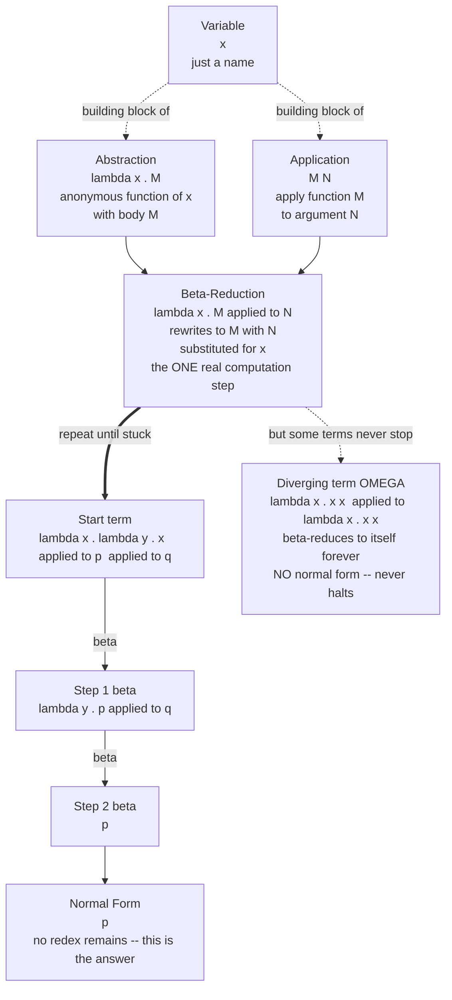

# 🧮 The Lambda Calculus

> [!abstract] TL;DR
> The **lambda calculus** is Alonzo **Church's** (1930s) minimal, universal model of computation: a language with *exactly three* things — **variables**, **abstraction** (`λx.M`, an anonymous one-argument function) and **application** (`M N`, applying a function to an argument) — and *one* real computation rule, **beta-reduction** (`(λx.M) N → M[x := N]`, "substitute the argument for the parameter"). With no numbers, booleans, loops, or data types built in, it is nonetheless **Turing-complete**: everything computable can be *encoded* as pure functions. It is the theoretical bedrock of **functional programming** (Lisp, ML, Haskell, and the `lambda`s now in Java/Python/Kotlin/Rust all descend from it), the core calculus every compiler and type theorist elaborates, and — together with the Turing machine — one leg of the **Church-Turing thesis**.

---

## Intuition

**Analogy — a programming language stripped to the bone.** Imagine a language with *nothing*. No `if`, no `while`, no `for`, no integers, no strings, no arrays, no objects — not even `true` and `false`. The only two things you are allowed to say are:

1. **"Make a function"** — "given some input I'll call `x`, produce this body." Write it `λx. body`. The function has no name; it is a value like any other, a *recipe waiting for an argument*.
2. **"Apply a function to an argument"** — take a function and hand it a value. Write it `f a`.

That is the *entire* language. It looks absurdly impoverished — you cannot even write the number 3. And yet, astonishingly, **this is enough to compute anything a computer can compute.** You *represent* the number 3 as "a function that does something three times," `true` as "a chooser that keeps the first of two options," a pair as "a function that hands both halves to whoever asks," and recursion as a function cleverly fed a copy of itself. Every data structure and control-flow construct you have ever used dissolves into pure function-making and function-applying.

The lambda calculus is that stripped-to-the-bone language — the **hydrogen atom of computation**. Just as physicists understand the whole periodic table by first understanding the simplest atom, computer scientists understand programming languages by first understanding the simplest one. Running a program in it is nothing more than repeatedly *substituting arguments into function bodies and simplifying* — computation as pure symbol manipulation, with no machine, no memory, and no clock in sight.

---

## How It Works

### Core Mechanics

**1. The entire syntax — three term forms.** A **lambda term** (`M`, `N`, …) is one of exactly three things, defined recursively:

- a **variable**: `x`, `y`, `z` — just a name;
- an **abstraction**: `λx. M` — "the anonymous function that, given a parameter `x`, returns body `M`." `x` is the **bound variable**; `M` may itself be any term;
- an **application**: `M N` — "apply function `M` to argument `N`."

There is nothing else. No primitive numbers, no keywords, no types (this note is the **untyped** calculus). By convention, application associates to the left (`M N P` means `(M N) P`) and a `λ`'s body extends as far right as possible (`λx. M N` means `λx. (M N)`). Binding, scope, and shadowing here are exactly the naming rules every language inherits (the topic of the sibling note **Names, Binding and Scope**).

**2. Alpha-conversion — bound names are placeholders.** The name of a bound variable carries no meaning: `λx. x` and `λy. y` are *the same function* (the identity). Renaming a bound variable consistently is **alpha-conversion**, and terms equal up to such renaming are treated as identical. This is not mere pedantry — it is what makes safe substitution possible.

**3. Beta-reduction — the one and only computation step.** All computation is a single rewrite rule:

$$(\lambda x.\, M)\; N \;\longrightarrow_\beta\; M[x := N]$$

"To apply an abstraction to an argument, substitute the argument `N` for every free occurrence of the parameter `x` in the body `M`." A subterm of the shape `(λx.M) N` is a **redex** (reducible expression). Reducing redexes, over and over, *is* running the program — precisely the same act as expanding `f(x) = x + 1` at `f(3)` in school algebra.

**4. Free vs bound variables, and capture-avoiding substitution.** An occurrence of a variable is **bound** if it sits inside a `λ` that names it, and **free** otherwise. In `λx. x y`, `x` is bound and `y` is free. Substitution `M[x := N]` must be **capture-avoiding**: if `N` contains a free variable that a binder inside `M` would accidentally capture, that binder must first be alpha-renamed to a fresh name. The classic trap: naively computing `(λx. λy. x)[x := y]` yields `λy. y` (the argument's free `y` got *captured* by the inner binder and silently became the identity) — the correct result is `λy'. y`. Getting this wrong is the single most common bug when implementing a reducer, and it is why binding and scope are studied as their own subject.

**5. Eta-conversion — extensionality.** A third, optional rule: `λx. (f x) → f` whenever `x` is not free in `f`. This says a function that merely forwards its argument to `f` *is* `f` — two functions are equal if they agree on all inputs (**extensionality**). Eta is about identity of functions, not about running them.

**6. Normal form — the "answer."** A term with **no remaining redexes** is in **normal form**; it cannot be reduced further, so it is the result of the computation. But not every term has one. The most famous non-terminating term is

$$\Omega \;=\; (\lambda x.\, x\, x)\,(\lambda x.\, x\, x) \;\longrightarrow_\beta\; \Omega \;\longrightarrow_\beta\; \Omega \;\longrightarrow_\beta\; \cdots$$

which beta-reduces *to itself* forever. `Ω` is the lambda-calculus face of **non-termination** — a computation that never halts — the same phenomenon that makes the **halting problem** undecidable (see **Reduction Strategies and Evaluation Order** and [[The_Halting_Problem_and_Undecidability]]).

**7. Church-Rosser / confluence — results are deterministic.** A term usually contains *several* redexes; which do you reduce first? The **Church-Rosser theorem (confluence, the "diamond property")** guarantees it does not matter for the *answer*: **if a term has a normal form, that normal form is unique**, no matter what order you reduce in. Order affects *whether* and *how fast* you reach the answer — not *what* the answer is. (Different **reduction strategies** — normal order, call-by-name, call-by-value — are the subject of a dedicated sibling note, and they map directly onto lazy vs eager evaluation in real languages.)

**8. Church encodings — data out of pure functions.** Because functions are the *only* value, everything else must be *represented* as a function:

- **Church numerals**: `n` = "apply `f` to `x`, `n` times." `0 = λf.λx. x`, `1 = λf.λx. f x`, `2 = λf.λx. f (f x)`. Then `SUCC = λn.λf.λx. f (n f x)`, and `ADD`, `MUL`, `EXP` fall out as composition.
- **Church booleans**: `TRUE = λa.λb. a` (keep the first), `FALSE = λa.λb. b` (keep the second). The boolean *is* its own `if`: `IF p a b = p a b`.
- **Pairs, lists, trees**: all encodable as higher-order functions.

This is developed fully in **Church Encodings and Computability**.

**9. Recursion with no names — fixed-point combinators.** A lambda term has no way to refer to itself by name (there are no names, only bound variables), yet recursion is essential. The trick is a **fixed-point combinator** `Y` satisfying `Y F = F (Y F)`: feed a function a copy of itself and self-reference *emerges* from pure substitution. In strict (call-by-value) settings you use the `Z` variant. Combinators and fixed points are the subject of **Combinatory Logic and Fixed Points**.

**10. Turing-completeness and the Church-Turing thesis.** This tiny calculus — only functions — computes *exactly* the class of functions a Turing machine computes; Turing himself proved the two models equivalent in 1937. Together with the general recursive functions, they define one robust, model-independent notion of "computable," the content of the **Church-Turing thesis** ([[Turing_Machines_and_the_Church_Turing_Thesis]], [[Recursive_Functions_and_Lambda_Calculus]]).

**11. History.** Church introduced the calculus around 1932-1936 as a foundation for logic. In 1936, using λ-definability, he gave the first negative answer to Hilbert's **Entscheidungsproblem** (the "decision problem": is there an algorithm to decide the truth of any first-order statement?) — months before, and independently of, Turing's tape-machine proof of the same result. The two 1936 papers, and their proven equivalence, launched computability theory.

**12. Why it matters for PLT.** The lambda calculus is the **core calculus** that every functional language elaborates: Lisp (1958) borrowed Church's `λ` directly, and Haskell/ML are essentially *typed* lambda calculi with syntax sugar. Closures, higher-order functions, and currying all trace here (**Functional Programming Foundations**). Adding a **type system** yields the **Simply Typed Lambda Calculus** and its powerful descendants (System F, dependent types), the basis of modern type theory — the boundary this untyped note sits just below.

### Flow / Architecture



*The three term forms feed the single rule `beta-reduction`. Reducing redexes repeatedly drives a term to its `normal form` (the answer); by the Church-Rosser theorem that normal form is unique when it exists. Some terms, like `Ω`, have no normal form and reduce forever — the lambda-calculus face of non-termination.*

---

## Key Concepts

**Secondary (intuitive, no CS background needed)**
- **A function is a value** — `λx. body` is just "a recipe waiting for an input," and you can pass recipes around like numbers.
- **Running = substituting** — to evaluate, copy the argument into the function's body and simplify; repeat.
- **Everything is a function** — numbers become "do something `n` times," `true`/`false` become "pick the first / pick the second."
- **Some programs never finish** — a term can reduce to itself endlessly (`Ω`); there is no built-in guarantee of halting.

**Undergraduate (a first PL or theory course)**
- **The three term forms**: variable, abstraction, application; the left-association and body-extension parsing conventions.
- **Free vs bound variables**; **alpha-conversion**; **capture-avoiding substitution** and why naive substitution corrupts meaning.
- **Beta-reduction**, **redex**, **normal form**; **eta-conversion** and extensionality.
- **Church encodings**: numerals, `SUCC`/`ADD`/`MUL`/`EXP`; booleans and `IF`; pairs and lists.
- **Confluence / Church-Rosser theorem**: uniqueness of normal forms; independence of the final result from reduction order.
- **Turing-completeness**: equivalence with Turing machines and the general recursive functions; the Church-Turing thesis.

**Graduate (advanced PL / type theory)**
- **Reduction strategies and operational semantics**: normal order, call-by-name, call-by-value; head/weak-head normal form; standardization theorem (normal order is normalizing).
- **Fixed-point combinators**: `Y` (call-by-name) vs `Z` (call-by-value); Kleene's recursion theorem; the relationship to Curry's paradox.
- **Untyped vs typed**: the **simply typed** λ-calculus enjoys **strong normalization** (every term halts) and is therefore *not* Turing-complete; System F (parametric polymorphism), the Calculus of Constructions (dependent types).
- **Curry-Howard-Lambek correspondence**: *propositions are types, proofs are programs, normalization is evaluation*, and both correspond to Cartesian closed categories.
- **Denotational semantics**: Scott domains and continuous functions giving meaning to recursion and fixed points (Scott-Strachey).
- **Combinatory logic** (`S`, `K`, `I`): variable-free computation, bracket abstraction, equivalent to the lambda calculus.

---

## Python Demo

```python
# ======================================================================
# THE UNTYPED LAMBDA CALCULUS, FROM SCRATCH.
#   * Represent terms as an AST:  Var / Abs / App  (dataclasses).
#   * Implement CAPTURE-AVOIDING substitution and normal-order BETA-REDUCTION.
#   * Reduce terms to NORMAL FORM, recording every step.
#   * Compute with CHURCH numerals:  reduce  (add 2 3)  to the numeral for 5.
#   * Print the reduction sequence step by step, and VISUALIZE term-size
#     across the reduction with matplotlib.
# Pure standard library + matplotlib (no numpy needed).
# ======================================================================
import sys
from dataclasses import dataclass
from typing import Optional, Union
import matplotlib.pyplot as plt

# Let us print the lambda glyph safely on any console (Windows included).
try:
    sys.stdout.reconfigure(encoding="utf-8")
except Exception:
    pass

# ----------------------------------------------------------------------
# 1. TERM REPRESENTATION -- the *entire* grammar of the lambda calculus.
# ----------------------------------------------------------------------
@dataclass(frozen=True)
class Var:
    name: str
@dataclass(frozen=True)
class Abs:                 # abstraction:  λ param . body
    param: str
    body: "Term"
@dataclass(frozen=True)
class App:                 # application:  func arg
    func: "Term"
    arg: "Term"

Term = Union[Var, Abs, App]

def show(t: Term) -> str:
    if isinstance(t, Var):
        return t.name
    if isinstance(t, Abs):
        return f"(λ{t.param}.{show(t.body)})"
    return f"({show(t.func)} {show(t.arg)})"

# ----------------------------------------------------------------------
# 2. FREE VARIABLES + a FRESH-NAME supply (needed to avoid capture).
# ----------------------------------------------------------------------
def free_vars(t: Term) -> set:
    if isinstance(t, Var):
        return {t.name}
    if isinstance(t, Abs):
        return free_vars(t.body) - {t.param}
    return free_vars(t.func) | free_vars(t.arg)

_fresh_n = 0
def fresh(base: str, avoid: set) -> str:
    global _fresh_n
    cand = base
    while cand in avoid:
        _fresh_n += 1
        cand = f"{base}{_fresh_n}"
    return cand

# ----------------------------------------------------------------------
# 3. CAPTURE-AVOIDING SUBSTITUTION:  t[x := s]
#    The whole subtlety of the lambda calculus lives in the Abs case.
# ----------------------------------------------------------------------
def subst(t: Term, x: str, s: Term) -> Term:
    if isinstance(t, Var):
        return s if t.name == x else t
    if isinstance(t, App):
        return App(subst(t.func, x, s), subst(t.arg, x, s))
    # Abs case:
    if t.param == x:
        return t                                    # x is re-bound here; stop
    if t.param in free_vars(s):                      # binder would CAPTURE a
        new_p = fresh(t.param, free_vars(s) | free_vars(t.body) | {x})
        renamed = subst(t.body, t.param, Var(new_p)) # alpha-rename first
        return Abs(new_p, subst(renamed, x, s))
    return Abs(t.param, subst(t.body, x, s))

# ----------------------------------------------------------------------
# 4. ONE STEP of NORMAL-ORDER beta-reduction (leftmost-outermost).
#    Returns the reduced term, or None if already in normal form.
# ----------------------------------------------------------------------
def beta_step(t: Term) -> Optional[Term]:
    if isinstance(t, App):
        if isinstance(t.func, Abs):                  # (λx.M) N  is a REDEX
            return subst(t.func.body, t.func.param, t.arg)
        red = beta_step(t.func)                       # else reduce the function
        if red is not None:
            return App(red, t.arg)
        red = beta_step(t.arg)                         # then the argument
        if red is not None:
            return App(t.func, red)
        return None
    if isinstance(t, Abs):                            # reduce under the lambda
        red = beta_step(t.body)
        return Abs(t.param, red) if red is not None else None
    return None                                       # a bare variable

def normalize(t: Term, max_steps: int = 500):
    """Reduce to normal form; return the list of terms visited."""
    seq = [t]
    for _ in range(max_steps):
        nxt = beta_step(seq[-1])
        if nxt is None:
            break
        seq.append(nxt)
    return seq

def size(t: Term) -> int:
    if isinstance(t, Var):
        return 1
    if isinstance(t, Abs):
        return 1 + size(t.body)
    return 1 + size(t.func) + size(t.arg)

# ----------------------------------------------------------------------
# 5. CHURCH NUMERALS + ADD, built as ordinary lambda terms.
#    n  =  λf.λx. f (f ( ... (f x)))   with n applications of f.
# ----------------------------------------------------------------------
def church(n: int) -> Term:
    body: Term = Var("x")
    for _ in range(n):
        body = App(Var("f"), body)
    return Abs("f", Abs("x", body))

# ADD = λm.λn.λf.λx. m f (n f x)
ADD = Abs("m", Abs("n", Abs("f", Abs("x",
        App(App(Var("m"), Var("f")),
            App(App(Var("n"), Var("f")), Var("x")))))))

def decode_church(t: Term) -> Optional[int]:
    """Read an integer back out of a normal-form Church numeral."""
    if not (isinstance(t, Abs) and isinstance(t.body, Abs)):
        return None
    f, x, body, count = t.param, t.body.param, t.body.body, 0
    while isinstance(body, App) and isinstance(body.func, Var) and body.func.name == f:
        count += 1
        body = body.arg
    return count if isinstance(body, Var) and body.name == x else None

# ======================================================================
# DEMO A -- a tiny reduction, printed step by step.
#   (λx. x x)(λx. x)  reduces to the identity  λx. x
# ======================================================================
I  = Abs("x", Var("x"))
SD = Abs("x", App(Var("x"), Var("x")))          # self-application  λx. x x
print("=== Demo A: (λx.x x)(λx.x)  →*  normal form ===")
for i, term in enumerate(normalize(App(SD, I))):
    arrow = "     " if i == 0 else "  →  "
    print(f"  step {i}: {arrow}{show(term)}")

# ======================================================================
# DEMO B -- COMPUTING with Church numerals:  add 2 3  →*  5.
#   Nothing but beta-reduction; no Python arithmetic touches the numerals
#   until the final decode.
# ======================================================================
expr = App(App(ADD, church(2)), church(3))       # the term  "add 2 3"
seq_add = normalize(expr)
print("\n=== Demo B: reduce  add 2 3  to a Church numeral ===")
print(f"  start : {show(expr)}")
print(f"  steps : {len(seq_add) - 1} beta-reductions")
print(f"  result: {show(seq_add[-1])}")
print(f"  decode: Church numeral = {decode_church(seq_add[-1])}  (expected 5)")
assert decode_church(seq_add[-1]) == 5, "add 2 3 should reduce to 5!"

# ======================================================================
# DEMO C -- the DIVERGING term Ω = (λx.x x)(λx.x x) has NO normal form.
# ======================================================================
OMEGA = App(SD, SD)
seq_omega = normalize(OMEGA, max_steps=15)        # capped: it never terminates
print("\n=== Demo C: Ω = (λx.x x)(λx.x x) diverges ===")
print(f"  after {len(seq_omega) - 1} steps still: {show(seq_omega[-1])}  (no normal form)")

# ----------------------------------------------------------------------
# 6. VISUALIZE term-size across the reduction: a CONVERGING computation
#    (add 2 3, which settles onto a flat normal form) vs a DIVERGING one
#    (Ω, whose size never settles because it never reaches normal form).
# ----------------------------------------------------------------------
add_sizes   = [size(t) for t in seq_add]
omega_sizes = [size(t) for t in normalize(OMEGA, max_steps=len(seq_add) - 1)]

fig, ax = plt.subplots(figsize=(9, 5.5))
ax.plot(range(len(add_sizes)), add_sizes, marker="o", lw=2,
        color="#2a7", label="add 2 3  (reaches normal form)")
ax.scatter([len(add_sizes) - 1], [add_sizes[-1]], s=180, marker="*",
           color="#083", zorder=5, label="normal form = Church 5")
ax.plot(range(len(omega_sizes)), omega_sizes, marker="s", ls="--", lw=2,
        color="#c33", label="Ω  (diverges -- never normalizes)")

ax.set_xlabel("beta-reduction step")
ax.set_ylabel("term size (AST nodes)")
ax.set_title("Reduction to normal form vs non-termination\n"
             "a converging computation settles; Ω reduces to itself forever")
ax.grid(True, ls=":", alpha=0.5)
ax.legend()
plt.tight_layout()
plt.savefig("lambda_reduction.png", dpi=130)
print("\nSaved reduction-size plot to lambda_reduction.png")
```

Running it prints the two-step reduction of `(λx.x x)(λx.x)` down to the identity, then reduces the term `add 2 3` — built entirely from `Var`/`Abs`/`App` — through a handful of capture-avoiding beta-steps to the Church numeral `λf.λx. f (f (f (f (f x))))`, which `decode_church` reads back as `5` (the `assert` guarantees correctness). It then shows `Ω` still equal to itself after 15 steps (it has **no** normal form), and saves a plot contrasting the two: `add 2 3`'s term-size rises as substitution duplicates subterms, then falls to a flat plateau (the star marks the unique normal form guaranteed by Church-Rosser), while `Ω`'s size never settles because the computation never halts.

---

## Real-World Applications

> **Example — Lisp, Haskell, and the `lambda` in your everyday code are the lambda calculus made executable.** McCarthy's **Lisp** (1958) took Church's `λ` almost verbatim: its `lambda` special form *is* abstraction, and evaluation *is* beta-reduction with parentheses. **Haskell** and **ML** are essentially *typed* lambda calculi dressed in syntax sugar — their laziness (a reduction strategy), higher-order functions, currying, and Hindley-Milner type inference are lambda-calculus theory shipped as a compiler ([[Type_Inference_and_Hindley_Milner]]). Every time you write `map(lambda x: x*2, xs)` in Python, `xs.map { it * 2 }` in Kotlin, `iter.map(|x| x*2)` in Rust, or `{ $0 * 2 }` in Swift, you are writing a lambda abstraction exactly as Church defined it ([[Lambda_Expressions]], [[Kotlin_Lambda_and_Higher_Order]], [[Iterators_and_Functional_Patterns]], [[Swift_Functions_and_Closures]], [[Rust_Functions_and_Closures]]).

Beyond language syntax:

- **Language semantics and compiler intermediate forms.** The formal *meaning* a language designer assigns to `if`, `let`, and recursion is given denotationally and operationally in terms of the lambda calculus and fixed points. Compilers routinely elaborate high-level programs into a small **typed lambda core** (GHC's Core, an enriched System F) before optimizing and generating code — the theory in this note is the IR of real functional compilers ([[Type_Checking_and_Type_Systems]], [[Interpreters_and_Tree_Walking]]).
- **Proof assistants and verified software.** The **Curry-Howard correspondence** — *programs are proofs, types are propositions* — is the engine of Coq, Agda, Lean, and Isabelle. Constructing a program of type `T` *is* proving proposition `T`; type-checking *is* proof-checking. This underlies the CompCert verified C compiler, verified cryptography, and Lean's `mathlib`.
- **Closures and higher-order APIs everywhere.** A **closure** — a function bundled with its captured environment — is the runtime realization of a lambda abstraction with free variables. Callbacks, `map`/`filter`/`reduce`, promises, React hooks, and dependency-injection lambdas are all lambda calculus in daily engineering practice.
- **Foundations of computability.** Church used λ-definability to give the first negative solution to the **Entscheidungsproblem** and to state the halting problem's undecidability — the reason the lambda calculus is a computability model of record, not merely a programming curiosity ([[Recursive_Functions_and_Lambda_Calculus]], [[Theory_of_Computation_Overview]]).

---

## Common Pitfalls

- **Naive substitution that captures variables.** Beta-reduction demands *capture-avoiding* substitution: before pushing an argument under a binder, alpha-rename the binder if the argument has a matching free variable. Skipping this silently corrupts meaning (e.g. turning `(λx.λy.x) y` into `λy.y` instead of `λy'. y`). This is the number-one bug when first implementing a reducer.
- **Assuming every term has a normal form.** Some terms — `Ω`, and any genuinely non-terminating computation — reduce forever. "Reduce to normal form" is a *partial* operation; a reducer must bound its steps or risk looping, exactly mirroring the undecidability of halting.
- **Confusing reduction *strategy* with the *result*.** By Church-Rosser the normal form is unique *if it exists*, but the strategy still matters: **normal order** (leftmost-outermost) will find a normal form whenever one exists, while **call-by-value** can diverge on a term that has one (e.g. eagerly evaluating an argument that is `Ω`). Strategy decides *termination and efficiency*, not the answer.
- **Expecting the naive `Y` combinator to work in a strict language.** `Y = λf.(λx. f (x x))(λx. f (x x))` diverges immediately under call-by-value (as in Python). You need the **`Z` combinator**, `λf.(λx. f (λv. x x v))(λx. f (λv. x x v))`, which eta-delays the recursive call — a classic "why does my fixed point loop forever?" trap.
- **Thinking "no types, no numbers" means "weak."** Minimalism is the *point*. The untyped lambda calculus is fully Turing-complete; paradoxically, *adding* a simple type system (the simply typed lambda calculus) makes it *strongly normalizing* and therefore strictly *weaker* — every term halts, so it can no longer express general recursion.
- **Reading beta-reduction as function *call-and-return*.** It is textual *rewriting*, not stack-based invocation: the argument term is substituted syntactically (and may be duplicated or discarded, unevaluated, depending on strategy). This is why call-by-name can skip evaluating an argument entirely and why lazy languages can be productive on infinite data.

---

## Related Concepts

- [[Recursive_Functions_and_Lambda_Calculus]] — the Theory-of-Computation companion: how λ-definability, general recursive functions, and Turing machines coincide as one notion of "computable."
- [[Turing_Machines_and_the_Church_Turing_Thesis]] — the other model of computation proven equivalent to the lambda calculus; the thesis unifying them.
- [[The_Halting_Problem_and_Undecidability]] — non-termination (`Ω`) and the impossibility of a general "does this reduce to normal form?" decider.
- [[Theory_of_Computation_Overview]] — where the lambda calculus sits in the wider map of computability and complexity.
- [[Type_Checking_and_Type_Systems]] — adding types to lambda terms; the boundary this untyped note sits just below (STLC and beyond).
- [[Type_Inference_and_Hindley_Milner]] — how ML/Haskell reconstruct the types of lambda terms automatically.
- [[Interpreters_and_Tree_Walking]] — evaluating an AST by tree-walking is a direct, engineered cousin of beta-reduction over lambda terms.
- [[Lambda_Expressions]] — Java's lambdas: Church's `λ` as a mainstream language feature.
- [[Kotlin_Lambda_and_Higher_Order]] — higher-order functions and lambdas in Kotlin, direct descendants of the calculus.
- [[Iterators_and_Functional_Patterns]] — Rust closures and functional combinators as applied lambda calculus.
- [[Swift_Functions_and_Closures]] — Swift closures: lambda abstractions capturing their environment.
- [[Rust_Functions_and_Closures]] — Rust closures and the ownership of captured variables.

*Forthcoming siblings in this PLT section — referenced in prose above and to be wikilinked once written — are **Programming Language Theory Overview**, **Reduction Strategies and Evaluation Order**, **Combinatory Logic and Fixed Points**, **Church Encodings and Computability**, **Names, Binding and Scope**, **Simply Typed Lambda Calculus**, and **Functional Programming Foundations**.*

---

## Review Questions

1. **(Conceptual)** The lambda calculus has no numbers, no booleans, no loops, and no data types — only variables, abstraction, and application. Explain (a) how the Church numeral for 3 is built, (b) what a *single beta-reduction* does, and (c) in one sentence, the deep fact that makes this three-rule system exactly as powerful as a Turing machine.
2. **(Scenario)** You implement a lambda-term reducer and test it on `(λx. λy. x) y`. Your first version returns `λy. y`; your senior says that is wrong and the answer should be `λy'. y`. What went wrong, what is the technical name for the rule your code violated, and what must a correct substitution do before pushing the argument under the inner binder? Give one more concrete term where the bug would surface.
3. **(Trade-off / significance)** The Church-Rosser theorem says a term's normal form is unique when it exists, yet real languages still argue fiercely over call-by-value vs call-by-name. (a) If the *result* is order-independent, what exactly does the choice of reduction strategy determine? (b) Give a single term on which normal order terminates but call-by-value diverges. (c) Why does *adding* a simple type system make the calculus strictly *less* computationally powerful, and what practical guarantee do you buy in exchange?

---

## Sources

- Church, A. "An Unsolvable Problem of Elementary Number Theory." *American Journal of Mathematics* 58 (1936): 345-363 — introduces λ-definability and the first negative solution to the Entscheidungsproblem.
- Church, A. "A Set of Postulates for the Foundation of Logic." *Annals of Mathematics* 33 (1932) and 34 (1933) — the original presentation of the calculus.
- Barendregt, H. P. *The Lambda Calculus: Its Syntax and Semantics*, rev. ed. North-Holland, 1984 — the definitive reference on the untyped and typed calculi, confluence, and reduction.
- Pierce, B. C. *Types and Programming Languages*. MIT Press, 2002 — chapters 5-6 give the modern PL treatment of the untyped lambda calculus and Church encodings.
- Selinger, P. *Lecture Notes on the Lambda Calculus*. arXiv:0804.3434, 2013 — a clean, self-contained modern introduction (syntax, alpha/beta/eta, confluence, combinators).
- Turing, A. M. "Computability and λ-Definability." *Journal of Symbolic Logic* 2 (1937): 153-163 — proves Turing machines and the lambda calculus define the same computable functions.

---

#programming-language-theory #lambda-calculus #beta-reduction #church #functional-programming
