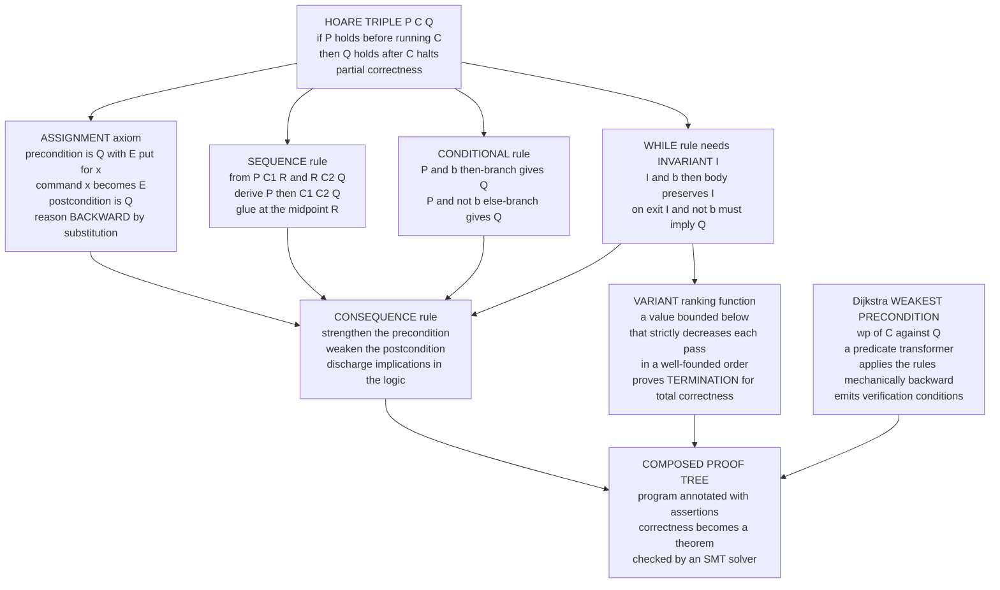

# 📜 Axiomatic Semantics and Hoare Logic

> [!abstract] TL;DR
> **Axiomatic semantics** defines what a program *means* by the **logical assertions it makes true** — not the steps it takes or the mathematical object it denotes, but the guarantee it offers. Its central notation is the **Hoare triple** `{P} C {Q}`: *if precondition `P` holds before command `C`, then postcondition `Q` holds after it (assuming `C` terminates)*. A handful of **inference rules** — one per language construct, plus the **consequence** rule — reduce "is this program correct?" to "is this logical formula valid?" The **assignment axiom** reasons **backward** by substitution; the **while rule** needs a hand-supplied **loop invariant**, and a **variant** (a value that strictly decreases) proves termination. Dijkstra's **weakest-precondition** calculus `wp(C, Q)` turns the rules into a mechanical **predicate transformer** that generates verification conditions automatically. This is the semantic style built *for* program verification — the direct ancestor of **Dafny**, **Frama-C**, **Why3**, **SPARK**, and (via **separation logic**) modern heap-manipulating proofs.

---

## Intuition

**Analogy — a contract, not a trace.** Imagine buying a machine that sorts index cards. You do **not** care about the exact motions its arms make (that would be a *trace* — a step-by-step execution). You care about the **spec sheet's contract**: *"If you feed it a stack of cards, it returns them in ascending order."* One clause states what must be **true before** you press start (cards are present, none are torn); another **promises** what will be true after (they come out sorted). You trust the machine by reading its contract, never by watching every gear turn.

Axiomatic semantics reasons about a program **exactly this way**. Instead of describing *how* the program executes (that is **operational** semantics — the trace) or *which* mathematical function it denotes (that is **denotational** semantics), it states, in the language of logic: **what must be TRUE before the program runs, and what it PROMISES afterward.** "If the input list is sorted, the returned index is correct." A program's *meaning* becomes the collection of input/output **assertions you can prove about it** — which is precisely the shape of a **correctness proof**. That is why, of the three semantic styles, this is the one verification tools are built on: you want the contract, not the choreography.

---

## How It Works

### 1. Meaning as provable assertions

The [[Programming_Language_Theory_Overview|three classical semantic styles]] are three lenses on one program. [[Operational_Semantics|Operational semantics]] says *how it runs* (a reduction relation `e → e'`). [[Denotational_Semantics|Denotational semantics]] says *what it is* (a mathematical object `⟦e⟧`, often a least fixed point over a domain — see [[Domain_Theory_and_Fixed_Points]]). **Axiomatic** semantics says *what it guarantees*: the logical properties that hold before and after. You never "run" the program; you treat it as a logical object and derive theorems about it. For **verification**, this stance is uniquely convenient — the thing you want to establish (correctness) *is already* the meaning.

### 2. The Hoare triple `{P} C {Q}`

Tony Hoare's 1969 notation is the entire subject in one line:

> `{P} C {Q}` — *if the assertion `P` (the **precondition**) holds in a state, and command `C` is executed from that state, then the assertion `Q` (the **postcondition**) holds in the resulting state.*

Two flavours of correctness ride on the fine print:

- **Partial correctness** — `Q` holds *if `C` terminates*. A program that loops forever vacuously satisfies **every** partial-correctness triple, because it never reaches an "after."
- **Total correctness** — written `[P] C [Q]` — additionally *guarantees `C` terminates*. Partial correctness plus a termination argument.

The **assertion language** `P`, `Q` is **predicate logic over the program's variables** ([[Predicate_Logic_and_Quantifiers|first-order logic with quantifiers]]): `x > 0`, `result = n*(n+1)/2`, `∀k. 0 ≤ k < i → a[k] ≤ a[k+1]`. Assertions describe *states*, not values; the program variables are the free variables of the logic.

### 3. The axioms and inference rules

Hoare logic is a **proof system**: axioms and rules that let you *derive* triples, exactly like [[Proof_Theory_and_Natural_Deduction|natural deduction]] derives propositions. Each language construct gets one rule.

**Assignment axiom (the backward one that surprises everyone).**

```
{ Q[E/x] }  x := E  { Q }
```

To make `Q` true *after* assigning `E` to `x`, require *before* the assignment that `Q` holds **with `E` substituted for `x`**. Example: to get `{ ? } x := x + 1 { x > 5 }`, substitute `x+1` for `x` in `x > 5`, giving the precondition `x + 1 > 5`, i.e. `x > 4`. You reason **backward**, from the goal to the requirement — the seed of the weakest-precondition calculus.

**Sequence (composition).** Chain two triples through a shared midpoint `R`:

```
{P} C1 {R}    {R} C2 {Q}
------------------------
    {P} C1; C2 {Q}
```

**Conditional.** Prove each branch under the guard's truth value:

```
{P ∧ b} C1 {Q}    {P ∧ ¬b} C2 {Q}
---------------------------------
 {P} if b then C1 else C2 {Q}
```

**Consequence (the glue between logic and code).** You may **strengthen** a precondition and **weaken** a postcondition, using ordinary logical implication:

```
P ⟹ P'   {P'} C {Q'}   Q' ⟹ Q
------------------------------
        {P} C {Q}
```

This rule is where the *program* rules meet the *logic*: the implications `P ⟹ P'` and `Q' ⟹ Q` are discharged by a theorem prover, not by the program structure.

**While — the rule that needs a creative leap.** A loop has unboundedly many iterations, so no finite chain of the rules above can cover it. The trick is a **loop invariant** `I` — an assertion that is *true before the loop and preserved by every iteration*:

```
{I ∧ b} C {I}
-----------------------------
{I} while b do C {I ∧ ¬b}
```

Read it: if `I` holds and the guard `b` is true, one pass of the body `C` re-establishes `I`; therefore after *any* number of passes `I` still holds, and when the loop exits, `¬b` holds too. To connect the loop to your real goal you sandwich it with **consequence**: prove `precondition ⟹ I` (the invariant holds on entry) and `I ∧ ¬b ⟹ Q` (invariant plus exit implies the postcondition). **Finding the invariant is the art** — it is the one step Hoare logic cannot mechanize, because a good invariant is a genuine insight about *why* the loop works.

### 4. Loop invariants and variants: partial vs total correctness

The **invariant** buys **partial** correctness — *if* the loop halts, `Q` holds. To upgrade to **total** correctness you must also prove the loop **terminates**, and for that you supply a **variant** (a **ranking function**): an integer-valued expression that

1. is **bounded below** (say, `≥ 0`) whenever the guard is true, and
2. **strictly decreases** on every iteration.

A strictly decreasing sequence in a **well-founded order** cannot descend forever, so the loop must stop. (Well-foundedness is the same principle underlying induction and termination arguments in the [[The_Halting_Problem_and_Undecidability|theory of computation]] — and, crucially, *no algorithm can find such a variant for arbitrary programs*, because termination is undecidable. Humans and heuristics supply them; tools check them.)

### 5. Dijkstra's weakest-precondition calculus

Hoare logic *checks* a triple you already wrote. Edsger Dijkstra's **predicate transformers** *compute* the required precondition mechanically. Define `wp(C, Q)` — the **weakest precondition** — as the *loosest* assertion on the input that guarantees `C` establishes `Q`:

- `wp(x := E, Q)   = Q[E/x]`            — substitute (the assignment axiom, read as a function)
- `wp(C1; C2, Q)   = wp(C1, wp(C2, Q))` — compose, right-to-left through the program
- `wp(if b then C1 else C2, Q) = (b ⟹ wp(C1, Q)) ∧ (¬b ⟹ wp(C2, Q))`
- `wp(while b do C, Q)` — **needs the invariant `I`**; the loop's `wp` is `I` itself, *provided* the two verification conditions `(I ∧ b) ⟹ wp(C, I)` and `(I ∧ ¬b) ⟹ Q` are discharged.

Because `wp` marches **backward** from the postcondition through straight-line code purely by substitution, it turns a program plus a spec into a single logical formula — a **verification condition** — that a solver either proves or refutes. This *verification-condition generation* is the engine inside every modern deductive verifier. Predicate transformers are themselves a *semantics* (a program **is** the function it induces on postconditions), tying axiomatic semantics back to the [[Denotational_Semantics|denotational]] view.

### 6. Soundness and (relative) completeness

Two meta-questions decide whether the whole edifice is trustworthy:

- **Soundness** — *every triple you can prove is actually true* with respect to the [[Operational_Semantics|operational semantics]]. If Hoare logic derives `{P} C {Q}`, then genuinely running `C` from any `P`-state lands in a `Q`-state. Soundness is what makes a proof *mean* something; it is established by induction over the operational rules ([[Formal_Semantics_and_Verified_Compilers|the same soundness discipline behind verified compilers]]).
- **Completeness** — *every true triple can be proved*. Here reality bites: the assertion logic is arithmetic, and by **Gödel's incompleteness theorem** no effective proof system captures all true arithmetic facts. So Hoare logic is only **relatively complete** (**Cook's theorem**, 1978): *given an oracle that decides validity in the assertion language*, every true triple **is** provable. The incompleteness is **inherited from arithmetic**, not a defect of Hoare's rules — the rules themselves lose nothing. In practice the "oracle" is an SMT solver, which is powerful but necessarily incomplete on undecidable fragments.

### 7. Separation logic — reasoning about the heap

Classic Hoare logic assumes variables are independent boxes. Real imperative programs have **pointers and mutable heaps**, where `x` and `y` might **alias** the same cell, so updating `*x` silently changes `*y`. Reasoning becomes a nightmare of "what else might this touch?" **Separation logic** (Reynolds, O'Hearn, Yang, ~2002) adds the **separating conjunction** `P * Q`, read *"the heap splits into disjoint parts, one satisfying `P`, the other `Q`."* Its killer feature is the **frame rule**: if `{P} C {Q}` and `C` only touches `P`'s footprint, then `{P * R} C {Q * R}` for any untouched `R` — **local reasoning** that lets you verify a linked-list routine without mentioning the rest of the heap. **Concurrent separation logic** extends this to threads owning disjoint resources, revolutionizing verification of pointer and concurrent programs (and connecting to [[Memory_Management_and_Allocation_Runtime|heap allocation and memory models]]). It is the theory behind Facebook's **Infer** analyzer and the **Iris** framework.

### 8. The three styles unified, and the Curry-Howard echo

[[Operational_Semantics|Operational]] = *how it runs*, [[Denotational_Semantics|denotational]] = *what it is*, axiomatic = *what it guarantees* — each best for a purpose (debugging/implementation, compositional reasoning, and **correctness proofs**, respectively). Proving them mutually consistent — that provable Hoare triples match the operational reduction — is itself a core result. There is also a **Curry-Howard echo**: a proof of a Hoare triple is, essentially, a proof term, and in **richly typed languages** (dependent types, refinement types) verification *becomes type-checking* — the spec lives in the type, and a well-typed program is a proof of its own contract. This is the bridge from `The_Curry_Howard_Correspondence` (a sibling note to come) to tools like **F\*** and **LiquidHaskell**.

### Mermaid — the Hoare triple, its rules, and their composition



---

## Key Concepts

**Secondary (explain to a curious beginner).**
- A **Hoare triple** `{P} C {Q}` is a contract: *"if `P` is true before, then `Q` is true after."*
- A **precondition** is what you must promise going in; a **postcondition** is what the program promises coming out.
- A **loop invariant** is a fact that stays true every time around a loop — it is how you reason about a loop without unrolling it forever.

**Undergraduate (requires a CS background).**
- The **assignment axiom** `{Q[E/x]} x := E {Q}` works **backward** by substitution — the single most counter-intuitive-then-obvious rule.
- **Partial vs total correctness**: partial ignores non-termination; total adds a **variant** (ranking function) proving the loop halts.
- **Dijkstra's `wp(C, Q)`** computes the weakest precondition mechanically; it generates the **verification conditions** a solver must discharge.
- The **consequence rule** is where program logic meets ordinary logical implication.

**Graduate (system-level and foundational thinking).**
- **Cook's relative completeness**: with an oracle for the assertion theory, all true triples are provable; the residual incompleteness is **inherited from arithmetic** (Gödel), not from the Hoare rules.
- **Predicate transformers as semantics**: `wp` (and `wlp`, the weakest *liberal* precondition) make a program a monotone function on the lattice of postconditions — the denotational face of axiomatic semantics.
- **Separation logic** and the **frame rule**: the separating conjunction `P * Q` enables *local reasoning* over disjoint heap footprints; concurrent separation logic extends it to resource-owning threads.
- **Verification vs testing**: a proof quantifies over *all* inputs; testing samples finitely many — the gap Hoare logic exists to close.

---

## Python Demo

We implement a tiny **weakest-precondition calculator / Hoare-logic verifier** for an imperative language with **assignment, sequence, if, and while**. The engine reasons over an assertion language of Python-syntax predicates, computing `wp` of assignment by **AST-level substitution**, `wp` of sequence by **composition**, and branching for `if`; the **while** loop consumes a supplied **invariant** and emits **verification conditions**. We verify the classic program that sums `1..n`, proving its invariant is preserved and implies the postcondition `result == n*(n+1)/2`, discharge every verification condition by **random testing over many states**, *run* the program on many inputs to confirm the proof empirically, and **visualize** the invariant holding at every iteration plus the variant driving termination. Pure stdlib (`ast`, `random`) + matplotlib.

```python
# Weakest-precondition calculator + Hoare-logic verifier for a tiny imperative language.
# Assertions are Python-syntax predicate strings; wp of assignment = AST substitution.
# We VERIFY a sum-loop against  result == n*(n+1)//2, DISCHARGE its verification
# conditions by random testing, RUN the program to confirm, and VISUALIZE the proof.
# Pure stdlib + matplotlib (no numpy required).

import ast, copy, random
import matplotlib.pyplot as plt

# ---------- Assertion language: substitute E for x in a predicate (the assignment axiom) ----------
def substitute(pred, var, expr):
    """Return `pred` with every occurrence of `var` replaced by the expression `expr`."""
    body = ast.parse(pred, mode="eval").body            # parse the predicate
    repl = ast.parse(f"({expr})", mode="eval").body     # parse the replacement expression
    class Sub(ast.NodeTransformer):
        def visit_Name(self, node):
            return copy.deepcopy(repl) if node.id == var else node
    new = ast.fix_missing_locations(Sub().visit(body))
    return ast.unparse(new)

def holds(pred, state):
    """Evaluate a predicate string over a concrete integer state (no builtins allowed)."""
    return bool(eval(pred, {"__builtins__": {}}, dict(state)))

# ---------- Abstract syntax of the imperative language ----------
class Assign:
    def __init__(self, var, expr): self.var, self.expr = var, expr
class Seq:
    def __init__(self, cmds): self.cmds = cmds
class If:
    def __init__(self, cond, then, els): self.cond, self.then, self.els = cond, then, els
class While:
    def __init__(self, cond, inv, body): self.cond, self.inv, self.body = cond, inv, body

# ---------- Weakest-precondition calculator; collects while-loop verification conditions ----------
def wp(cmd, Q, vcs):
    if isinstance(cmd, Assign):                          # wp(x:=E, Q) = Q[E/x]  (substitute)
        return substitute(Q, cmd.var, cmd.expr)
    if isinstance(cmd, Seq):                             # wp(C1;C2, Q) = wp(C1, wp(C2, Q))  (compose)
        for c in reversed(cmd.cmds):
            Q = wp(c, Q, vcs)
        return Q
    if isinstance(cmd, If):                              # branch on the guard
        wt, we = wp(cmd.then, Q, vcs), wp(cmd.els, Q, vcs)
        return f"(({cmd.cond}) and ({wt})) or ((not ({cmd.cond})) and ({we}))"
    if isinstance(cmd, While):                           # loop: use the supplied invariant I
        I, b = cmd.inv, cmd.cond
        wbody = wp(cmd.body, I, vcs)
        vcs.append(("preserved:  (I and b) => wp(body, I)", f"({I}) and ({b})", wbody))
        vcs.append(("exit:       (I and not b) => Q",       f"({I}) and (not ({b}))", Q))
        return I                                         # wp of the loop is the invariant itself
    raise TypeError(cmd)

# ---------- Concrete interpreter (to confirm the proof by actually running the program) ----------
def run(cmd, state):
    if isinstance(cmd, Assign):
        state[cmd.var] = eval(cmd.expr, {"__builtins__": {}}, dict(state))
    elif isinstance(cmd, Seq):
        for c in cmd.cmds: run(c, state)
    elif isinstance(cmd, If):
        run(cmd.then if holds(cmd.cond, state) else cmd.els, state)
    elif isinstance(cmd, While):
        while holds(cmd.cond, state):
            run(cmd.body, state)
    return state

# ================= 1. THE PROGRAM AND ITS SPECIFICATION =================
#   result := 0; i := 1; while i <= n do (result := result + i; i := i + 1)
sum_prog = Seq([
    Assign("result", "0"),
    Assign("i", "1"),
    While("i <= n",
          inv="result == (i - 1) * i // 2 and i <= n + 1",   # I: result is the sum of 1..(i-1)
          body=Seq([Assign("result", "result + i"),
                    Assign("i", "i + 1")])),
])
PRE  = "n >= 0"
POST = "result == n * (n + 1) // 2"

# ================= 2. GENERATE THE VERIFICATION CONDITIONS BY wp =================
vcs = []
entry_wp = wp(sum_prog, POST, vcs)                 # wp threaded backward through the whole program
vcs.insert(0, ("entry:      PRE => wp(program, POST)", PRE, entry_wp))

print("=== Verification conditions generated by the wp calculator ===")
for name, ante, cons in vcs:
    print(f"\n[{name}]")
    print(f"   assume : {ante}")
    print(f"   prove  : {cons}")

# ================= 3. DISCHARGE EACH VC BY RANDOM TESTING OVER MANY STATES =================
def sample_states(k):
    """A pool of states: on the invariant manifold, at loop entry, and fully arbitrary."""
    out = []
    for _ in range(k):
        r, n = random.random(), random.randint(0, 50)
        if r < 0.55:
            i = random.randint(0, 52)
            out.append({"i": i, "n": n, "result": (i - 1) * i // 2})   # sits ON the invariant
        elif r < 0.75:
            out.append({"i": 1, "n": n, "result": 0})                  # a loop-entry state
        else:
            out.append({"i": random.randint(-5, 55), "n": n,
                        "result": random.randint(-50, 2000)})          # arbitrary state
    return out

random.seed(1)
pool = sample_states(30000)
print("\n=== Discharging verification conditions by random testing ===")
vc_names, vc_frac = [], []
for name, ante, cons in vcs:
    relevant = [s for s in pool if holds(ante, s)]     # states satisfying the assumption
    passed = sum(holds(cons, s) for s in relevant)
    frac = passed / len(relevant) if relevant else 1.0
    vc_names.append(name.split(":")[0]); vc_frac.append(frac)
    print(f"  {name:42s}  {passed}/{len(relevant)} states pass  ({100*frac:.1f}%)")

# ================= 4. RUN THE PROGRAM: does it match the closed form for many n? =================
Ns = list(range(0, 41))
prog_vals = [run(sum_prog, {"n": n})["result"] for n in Ns]
closed    = [n * (n + 1) // 2 for n in Ns]
all_match = all(a == b for a, b in zip(prog_vals, closed))
print(f"\nProgram output equals n*(n+1)/2 on all n in [0,40]:  {all_match}")

# ================= 5. TRACE THE INVARIANT AND VARIANT ACROSS ITERATIONS =================
def trace(n):
    i, result, rows = 1, 0, []
    rows.append((0, i, result, (i - 1) * i // 2, n + 1 - i))          # (step, i, result, I-value, variant)
    step = 0
    while i <= n:
        result, i, step = result + i, i + 1, step + 1
        rows.append((step, i, result, (i - 1) * i // 2, n + 1 - i))
    return rows

TR = trace(12)
steps   = [r[0] for r in TR]
results = [r[2] for r in TR]
inv_val = [r[3] for r in TR]
variant = [r[4] for r in TR]

# ================= 6. VISUALIZE THE PROOF =================
fig, ax = plt.subplots(2, 2, figsize=(13, 9))

# (a) invariant preserved: actual result == predicted (i-1)*i//2 at EVERY step
ax[0, 0].plot(steps, inv_val, "-", color="#4C72B0", lw=2.5, label="invariant value  (i-1)*i//2")
ax[0, 0].plot(steps, results, "o", color="#C44E52", ms=7, label="actual  result")
ax[0, 0].set_title("Invariant holds at every iteration  (n = 12)")
ax[0, 0].set_xlabel("loop iteration"); ax[0, 0].set_ylabel("value")
ax[0, 0].legend(); ax[0, 0].grid(alpha=0.3)

# (b) variant strictly decreases to 0 -> termination (total correctness)
ax[0, 1].plot(steps, variant, "s-", color="#55A868", lw=2)
ax[0, 1].axhline(0, ls="--", color="gray", label="lower bound 0")
ax[0, 1].set_title("Variant  n+1-i  strictly decreases -> loop terminates")
ax[0, 1].set_xlabel("loop iteration"); ax[0, 1].set_ylabel("ranking function")
ax[0, 1].legend(); ax[0, 1].grid(alpha=0.3)

# (c) every verification condition discharged (fraction of relevant states passing)
bars = ax[1, 0].bar(vc_names, vc_frac, color=["#4C72B0", "#DD8452", "#55A868"])
ax[1, 0].set_ylim(0, 1.15); ax[1, 0].axhline(1.0, ls="--", color="gray")
ax[1, 0].set_title("Verification conditions discharged by testing")
ax[1, 0].set_ylabel("fraction of relevant states passing")
for bar, f in zip(bars, vc_frac):
    ax[1, 0].text(bar.get_x() + bar.get_width()/2, f + 0.03, f"{f:.0%}",
                  ha="center", fontweight="bold")

# (d) program output vs closed form: all points on y = x -> proof confirmed
ax[1, 1].plot([0, max(closed)], [0, max(closed)], "--", color="gray", label="perfect agreement  y = x")
ax[1, 1].scatter(prog_vals, closed, color="#8172B3", s=30, zorder=5)
ax[1, 1].set_title("Program result vs n*(n+1)/2  (n = 0..40)")
ax[1, 1].set_xlabel("value the PROGRAM computes")
ax[1, 1].set_ylabel("closed-form  n*(n+1)/2")
ax[1, 1].legend(); ax[1, 1].grid(alpha=0.3)

fig.suptitle("Hoare-logic proof of the sum-loop: invariant, variant, VCs, and empirical check",
             fontsize=14)
fig.tight_layout()
plt.savefig("hoare_sum_proof.png", dpi=120)
print("\nSaved plot to hoare_sum_proof.png")

# ---------- Bonus: the IF rule in action (wp of a max program) ----------
max_prog = If("x <= y", Assign("m", "y"), Assign("m", "x"))
Qmax = "(m >= x) and (m >= y) and ((m == x) or (m == y))"
print("\n=== wp of the IF-based max program ===")
print("wp =", wp(max_prog, Qmax, []))
```

**What it shows.** The `wp` calculator threads **backward** from the postcondition `result == n*(n+1)//2` through the two initial assignments and the loop, producing three **verification conditions**: *entry* (`PRE` implies the invariant holds initially), *preserved* (`I ∧ guard` implies `wp(body, I)`), and *exit* (`I ∧ ¬guard` implies the postcondition). Random testing over 30,000 states discharges all three at **100%** — empirical confidence the proof is valid — and running the program on `n = 0..40` lands every point on `y = x`. The top-left plot is the heart of the matter: the **invariant value `(i-1)*i//2` coincides with the actual `result` at every single iteration**, and the top-right plot shows the **variant `n+1-i` marching down to 0**, which is the termination half of *total* correctness. A production tool (Dafny, Why3) replaces the 30,000-state *test* with an SMT *proof* that quantifies over **all** states.

---

## Real-World Applications

> **Dafny (Microsoft Research).** Dafny is a programming language with `requires` / `ensures` / `invariant` / `decreases` clauses lifted **directly** from Hoare logic and the weakest-precondition calculus. Its compiler generates verification conditions and ships them to the **Z3** SMT solver; the loop `invariant` and `decreases` (variant) annotations in Dafny source are *literally* the `I` and ranking function from this note. Amazon used Dafny to verify parts of its authorization and storage systems.

- **Frama-C / ACSL and SPARK/Ada.** Contract-based verification for **C** and **Ada**: engineers annotate functions with ACSL or SPARK pre/postconditions and loop invariants, and the tool discharges the resulting VCs — used in avionics, rail, and nuclear software under DO-178C / EN 50128.
- **Why3.** A verification *platform* whose intermediate language (WhyML) is a direct implementation of weakest-precondition VC generation, dispatching to many provers; it is the backend for Frama-C and SPARK.
- **Separation logic in industry.** Facebook/Meta's **Infer** static analyzer uses (bi-abduction over) separation logic to find null-dereference and memory bugs across millions of lines of C/Java/Objective-C at commit time; the **Iris** framework mechanizes concurrent separation logic in Coq.
- **Design by contract.** Eiffel pioneered `require`/`ensure`/`invariant` as first-class language constructs; the idea now appears as assertions, `assert`, and contract libraries everywhere — Hoare triples as an everyday engineering discipline, even without a solver.
- **Verified compilers and kernels.** [[Formal_Semantics_and_Verified_Compilers|CompCert and seL4]] use Hoare-style refinement and axiomatic reasoning as part of their end-to-end correctness proofs.

---

## Common Pitfalls

- **A wrong or too-weak invariant.** If the invariant is not actually preserved, the *preserved* VC fails; if it is preserved but too weak, the *exit* VC (`I ∧ ¬b ⟹ Q`) fails because it does not pin down enough. The invariant must be *just strong enough* — capturing the loop's real progress — yet still hold at entry. This is the single hardest step, and no tool finds it for you in general.
- **Forgetting the termination/variant argument.** Partial correctness silently "succeeds" on infinite loops. A triple that looks proven may say nothing if the loop never halts — always ask whether you proved partial or **total** correctness.
- **Misreading the assignment axiom's direction.** Beginners write `{x > 5} x := x + 1 {x > 5}` expecting forward reasoning. The axiom substitutes into the **post**condition: `wp(x := x+1, x > 5)` is `x + 1 > 5`, i.e. `x > 4`. Reason backward, not forward.
- **Off-by-one invariants at the boundary.** The invariant must survive the *final* iteration and the exit test together. In the sum loop, `i <= n + 1` (not `i <= n`) is what makes `I ∧ ¬b` force `i = n + 1` on exit — get the bound wrong and the exit VC collapses.
- **Aliasing without separation logic.** Plain Hoare logic is unsound-in-practice for pointer programs: updating `*p` may change `*q` if they alias. Reaching for classic Hoare rules on heap code, instead of **separation logic**, produces "proofs" of false things.
- **Trusting the spec blindly.** Verification proves *the code meets the contract* — it cannot tell you the *contract* is what you wanted. A vacuous precondition (`false`) or a trivial postcondition (`true`) "verifies" anything. Garbage spec in, garbage guarantee out.

---

## Related Concepts

- [[Programming_Language_Theory_Overview]] — places axiomatic semantics as one of the three semantic styles (operational, denotational, axiomatic) and opens the PLT vault.
- [[Operational_Semantics]] — the "how it runs" style Hoare logic is proved *sound* against; the trace view versus the contract view.
- [[Denotational_Semantics]] — the "what it is" style; predicate transformers (`wp`) are the denotational face of axiomatic semantics.
- [[Domain_Theory_and_Fixed_Points]] — least-fixed-point meaning of loops, the denotational counterpart of the loop invariant.
- [[Formal_Semantics_and_Verified_Compilers]] — semantic preservation and CompCert; where axiomatic reasoning and soundness proofs meet real verified toolchains.
- [[Proof_Theory_and_Natural_Deduction]] — Hoare logic *is* a proof system; a program derivation is a proof tree built from axioms and inference rules.
- [[Predicate_Logic_and_Quantifiers]] — the assertion language of pre/postconditions is first-order logic over the program variables.
- [[Mathematical_Proof_Strategies]] — the induction and case analysis used to prove invariants preserved and loops terminating.
- [[The_Halting_Problem_and_Undecidability]] — why no algorithm supplies loop variants in general, and why verification must lean on human insight plus incomplete solvers.
- [[The_Limits_of_Computation]] — Gödel incompleteness, from which Hoare logic inherits its *relative* (not absolute) completeness via Cook's theorem.
- [[The_Class_NP_and_Verification]] — the complementary sense of "verification": checking a certificate vs constructing a correctness proof.
- [[Type_Checking_and_Type_Systems]] — refinement and dependent types push contracts into the type system, where verification becomes type-checking (the Curry-Howard echo).
- [[Memory_Management_and_Allocation_Runtime]] — the heap and pointers that separation logic was invented to reason about.
- [[Logic_in_AI_and_Computation]] — SMT solvers and automated reasoning are the engines that discharge the verification conditions `wp` generates.

*(Vault siblings referenced in prose, not yet built: `The_Curry_Howard_Correspondence`, `Verified_and_Certified_Languages`.)*

---

## Review Questions

1. **(Secondary)** A microwave's manual says: *"If you place food inside and close the door, then after 30 seconds the food is warm."* Rewrite this as a Hoare triple `{P} C {Q}`, identifying `P`, `C`, and `Q`. Then explain, in one sentence each, the difference between *partial* correctness and *total* correctness for this appliance.
2. **(Undergraduate)** Consider `{ ? } x := x * 2 { x >= 10 }`. Use the assignment axiom to compute the **weakest** precondition, and explain why reasoning *backward* (substituting into the postcondition) gives the right answer where forward reasoning would not. Then, for the loop `while i < n do i := i + 1`, propose an invariant and a variant that together prove it terminates.
3. **(Graduate)** Hoare logic is **sound** but only **relatively complete** (Cook's theorem). (a) Precisely what does the "relative" qualifier assume, and why is unconditional completeness impossible? (b) Name the theorem from mathematical logic responsible for that impossibility. (c) Explain how **separation logic's frame rule** changes the *modularity* of a correctness proof, and why classic Hoare logic cannot express the same locality for heap-mutating code.

---

## Sources

- C. A. R. Hoare, "An Axiomatic Basis for Computer Programming," *Communications of the ACM* 12(10), 1969 — the founding paper; introduces the triple and the rules. <https://dl.acm.org/doi/10.1145/363235.363259>
- Edsger W. Dijkstra, "Guarded Commands, Nondeterminacy and Formal Derivation of Programs," *Communications of the ACM* 18(8), 1975 — the weakest-precondition / predicate-transformer calculus (expanded in *A Discipline of Programming*, 1976).
- Stephen A. Cook, "Soundness and Completeness of an Axiom System for Program Verification," *SIAM Journal on Computing* 7(1), 1978 — the relative-completeness theorem.
- John C. Reynolds, "Separation Logic: A Logic for Shared Mutable Data Structures," *LICS 2002* — the foundational separation-logic paper. <https://www.cs.cmu.edu/~jcr/seplogic.pdf>
- Glynn Winskel, *The Formal Semantics of Programming Languages*, MIT Press, 1993 — operational, denotational, and axiomatic semantics, including soundness of Hoare logic, in one text.

---

#programming-language-theory #axiomatic-semantics #hoare-logic #weakest-precondition #verification
