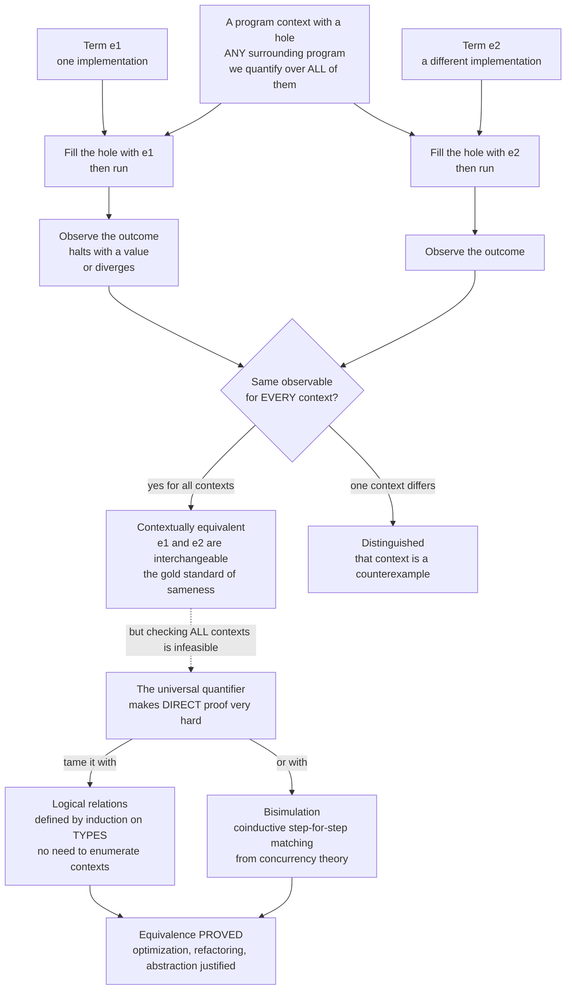

# 🟰 Contextual Equivalence and Reasoning

> [!abstract] TL;DR
> **Contextual (observational) equivalence** is the semantic *gold standard* for "these two program fragments are the same": two terms `e1` and `e2` are equivalent when, for **every** enclosing program **context** `C` with a hole, running `C` with `e1` plugged in and running `C` with `e2` plugged in yield the **same observable outcome** (same termination behavior, same final result). This is exactly the notion that *justifies* every safe optimization, every correctness-preserving refactoring, and every claim that a module's internal representation is hidden from its clients. The quantifier "for **every** context" makes it the coarsest reasonable equivalence — and makes *direct* proofs nearly impossible. The whole art is a toolkit that tames that quantifier: **logical relations** (relations built by induction on *types*), **bisimulation** (coinductive step-for-step matching from concurrency theory), **parametricity** ("free theorems" from a polymorphic type alone), and **full abstraction** (when a denotational semantics matches contextual equivalence *exactly*). It is the semantic bedrock under optimization, modularity, and the very meaning of "correct implementation."

---

## Intuition

**Analogy — the swap test for "really the same."** When are two programs *truly* the same? Not when their source code looks alike — two sorting routines can share not a single line yet compute the same thing, and two identical-looking routines can differ in one hidden detail that matters. The honest test is a **swap test**: take any larger program that *uses* the routine, tear out one copy, drop in the other, and ask — did anything anyone could *observe* change? If **no possible surrounding program** can tell them apart — no output differs, no crash appears or disappears, no infinite loop starts or stops — then for every purpose that will ever matter, they *are* the same program. Two `sort` functions are "equal" precisely when every program built on top of one behaves identically when rebuilt on the other.

That swap test is the entire idea. A **context** is that larger program with a hole in it — think of it as a program with one blank waiting to be filled, written `C` with a hole `[.]`. Contextual equivalence says: `e1` and `e2` are the same if `C` filled with `e1` and `C` filled with `e2` always produce the same *observable* behavior, **no matter which context `C` you choose**. It is the strongest, most honest notion of sameness we have — and, because "no matter which context" ranges over infinitely many programs you can never enumerate, it is famously hard to prove directly. Everything technical below is machinery for winning that "for all contexts" argument without actually checking all of them.

---

## How It Works

### The question: when are two fragments interchangeable?

This is the central question of *reasoning about programs*, and three whole engineering disciplines rest on the answer:

- **Compiler optimization.** Constant folding, common-subexpression elimination, loop-invariant hoisting, inlining — every transformation replaces a fragment `e1` with a "better" fragment `e2`. The optimization is **correct** if and only if `e1` and `e2` are contextually equivalent: no program using the code can observe the swap ([[Local_and_Global_Optimizations]], [[Interprocedural_and_Link_Time_Optimization]]).
- **Refactoring.** "Extract this into a function," "replace this list with a hash set," "memoize this" — each is a bet that the new code is *observationally the same* as the old.
- **Data abstraction.** A module promising "you can't tell how I store this internally" is making a contextual-equivalence claim: two different internal representations are indistinguishable to any *client* context.

We need a definition of "same" that is **just right**. Two candidates fail immediately:

- **Syntactic equality is too fine.** `x + x` and `2 * x` are different strings but should count as equal; demanding identical syntax would forbid every optimization.
- **Agreeing on one input is too coarse.** Two functions can return the same value on the input you tested and diverge on the next one, or agree on the return value yet differ in a side effect. A single test proves nothing.

Contextual equivalence threads the needle: coarser than syntax (it ignores *how* you compute), finer than any finite test (it quantifies over *all* uses).

### Contextual / observational equivalence — the definition

Fix a language, a notion of **program context** `C` (a program with a single hole), and a set of **observables** `Obs` — the outcomes an outsider can detect (typically: *does it terminate?* and *what final value or output does it produce?*). Then:

> `e1` and `e2` are **contextually equivalent**, written `e1 ≅ e2`, when for **every** context `C` such that both `C[e1]` and `C[e2]` are complete, runnable programs, the two programs produce the **same observable outcome**.

The heart of the definition is that universal quantifier over `C`. It is what makes `≅` the **coarsest congruence** that still respects the observations — the "true" notion of sameness, because it declares two terms equal exactly when *nothing you could ever build* distinguishes them. It is also what makes `≅` a *congruence*: because contexts can be nested arbitrarily, if `e1 ≅ e2` then you may substitute one for the other *anywhere*, and equivalence is preserved through every enclosing layer. That is precisely the property that licenses "substitute equals for equals" reasoning. And it is what makes *direct* proof brutal: to show `e1 ≅ e2` you must rule out *every* context, and to refute it you need only exhibit *one* distinguishing context.

### Observables and the observation problem

Equivalence is **relative to what you can observe** and to **how expressive the language is** — and this is not a footnote, it is the crux. Change the observations or add a language feature and the equivalence relation itself changes:

- In a **pure** functional core where a context can only observe the returned value, two functions that compute the same result are equivalent — even if one "would" log or mutate, because there is nothing in the language to *read* a log or a mutation.
- **Add mutable state**, and a context can now install a shared cell, run the term, and inspect the cell afterward. Two terms that were equivalent in the pure language can become **distinguishable**: one touches the cell, the other does not.
- **Add first-class control** (`call/cc`), **exceptions**, or **concurrency**, and contexts gain still more discriminating power — they can observe *how many times* or *in what order* a term is evaluated.

So "more expressive language" means "more contexts" means "a *finer* equivalence" (fewer pairs count as equal). This is why the same two fragments can be equal in one language and unequal in a richer one, and why reasoning about effects (state, IO, control) is delicate — the relevant theory is that of *effect systems and monads*, which quarantine exactly the observations that break naive equivalences *(sibling to come: `Monads_and_Effects`)*.

### Proof techniques that tame the all-contexts quantifier

You almost never prove `e1 ≅ e2` by reasoning about arbitrary `C` directly. Instead you build a *more tractable* relation and prove it *implies* contextual equivalence. Two families dominate:

1. **Logical relations — the workhorse.** Define a relation between terms **by induction on their type**. Two values of base type `Int` are related if they are the same integer; two *functions* of type `A -> B` are related if they map related `A`-arguments to related `B`-results; two *pairs* if their components are related; and so on, one clause per type constructor. Prove the **fundamental theorem** (every well-typed term is related to itself), and relatedness turns out to imply contextual equivalence — *without ever mentioning a context*. Logical relations are the Swiss-army knife of PLT: the same technique proves **type safety**, **strong normalization** (every program halts, in the simply typed calculus), **parametricity**, and countless specific equivalences. Recursion and mutable state break the naive induction (the "type" you are recurring on can be as big as the term), so **step-indexed logical relations** stratify the relation by a "fuel" counter of available execution steps, restoring a well-founded induction for languages with general recursion, references, and higher-order state.
2. **Bisimulation — coinductive, step-for-step matching.** Borrowed from concurrency theory, a **bisimulation** is a relation `R` between (states of) two systems such that whenever `s R t`, every step `s` can take is matched by a step `t` can take landing in related states, and vice versa. If such an `R` exists linking the start states, the systems are **bisimilar** — behaviorally identical. For programs, **applicative bisimulation** (Abramsky) relates two closed terms if, applied to any argument, they converge together and their results are again bisimilar; **environmental bisimulation** extends this to state and abstract types. Where logical relations induct on *types*, bisimulation *coinducts* on *behavior* — you exhibit one relation and check it is self-sustaining, which is often easier for stateful or infinite systems. The concurrency roots are the theory of process calculi *(sibling to come: `Concurrency_and_Process_Calculi`)*.

### Parametricity and "free theorems"

A spectacular special case of logical relations: **parametric polymorphism** forces uniform behavior. Reynolds's **abstraction theorem** and Wadler's slogan "**theorems for free**" say that a function whose type is polymorphic — say `forall a. [a] -> [a]` (works for *any* element type) — cannot inspect the elements it is given, so it must treat them *uniformly*. From the **type alone**, with no look at the code, you can derive equations the function must satisfy. For `r : forall a. [a] -> [a]`, parametricity proves `map f . r = r . map f` for every `f` — *any* list-to-list transformer commutes with mapping. This is not a heuristic; it is a theorem extracted from the logical relation for the polymorphic type, and it is the theoretical engine of **representation independence** and of the deep structure of **System F**, the polymorphic lambda calculus *(sibling to come: `Polymorphism_and_System_F`)*.

### Denotational equivalence and full abstraction

An alternative to running programs is to give each a **meaning** — a mathematical object — via a *denotational semantics* `[[.]]` *(sibling to come: `Denotational_Semantics`)*. Now you can compare **denotations** instead of behaviors: `[[e1]] = [[e2]]`. Two properties connect this to `≅`:

- **Adequacy / soundness:** if `[[e1]] = [[e2]]` then `e1 ≅ e2`. Equal denotations guarantee contextual equivalence — this is what makes denotational reasoning *safe*, and it is a friend of the compiler writer, because equal meaning implies safe substitution.
- **Full abstraction:** the semantics is *fully abstract* when the implication runs **both ways** — `[[e1]] = [[e2]]` **if and only if** `e1 ≅ e2`. A fully abstract model captures *exactly* observational equivalence, no coarser and no finer.

The celebrated **full-abstraction problem for PCF** (a simply typed lambda calculus with recursion and arithmetic) asked for such a model. The naive domain-theoretic (Scott) model is *adequate* but **not** fully abstract: it contains "parallel-or"-style elements that no PCF program can implement, so the model distinguishes terms that are contextually equal. The problem stood for two decades and was finally solved by **game semantics** (Abramsky-Jagadeesan-Malacaria and Hyland-Ong), which models a program as a *strategy* in a two-player game of questions and answers — a landmark result of the field, and the definitive link between *denotational equality* and *observational sameness*.

### Equational reasoning — the practical payoff

In a **pure** functional language, **referential transparency** (an expression can be replaced by its value without changing behavior) means contextual equivalence collapses into ordinary **equational reasoning**: you may "substitute equals for equals" and prove program identities algebraically, the way you simplify high-school algebra. `map f (map g xs) = map (f . g) xs` is proved by structural induction, then *used* freely by the compiler as a fusion optimization. This is why pure functional programs are so amenable to formal reasoning — the equational theory *is* the contextual equivalence *(sibling to come: `Functional_Programming_Foundations`)*.

### The role in compiler correctness and representation independence

Two industrial-strength payoffs close the loop:

- **Verified compilers.** A compiler is *correct* when its output is observationally equivalent to its input — a contextual-equivalence-style property called **semantic preservation**. CompCert and CakeML *prove* this theorem for a realistic C / ML, machine-checked ([[Formal_Semantics_and_Verified_Compilers]]). Every optimization pass is discharged as a preservation lemma.
- **Representation independence.** *Why* can you swap a module's internal data structure — a list for a balanced tree, say — without touching a single client? Because the two implementations are contextually equivalent *from the client's viewpoint*: clients only interact through the abstract interface, so no client context can observe the representation. This is the theory of **abstract data types** and information hiding — a parametricity/logical-relations argument at the module boundary, and the semantic justification for encapsulation *(sibling to come: `Object_Oriented_Language_Theory`)*.

**Why it matters.** Contextual equivalence is the rigorous meaning of "this refactoring is safe," "this optimization is valid," and "this abstraction leaks nothing." It is the semantic foundation under optimization *and* modularity — the reason we can build large systems out of interchangeable, independently-improvable parts.

### Flow / Architecture



*Both terms are dropped into the same universe of contexts; if the observable outcomes coincide for every context they are contextually equivalent. Because "every context" is infeasible to check directly, logical relations and bisimulation prove the equivalence without enumerating contexts.*

---

## Key Concepts

**Secondary (explain to a curious beginner).**
- Two pieces of code are *really the same* not when they *look* alike, but when **no program using one behaves differently with the other** — the "swap test."
- A **context** is just a bigger program with a blank waiting for your code to be dropped in.
- This is why it is safe to speed up or clean up code: if the swap changes nothing anyone can see, the change is correct.

**Undergraduate (requires a CS background).**
- **Contextual equivalence `e1 ≅ e2`**: for all contexts `C`, `C[e1]` and `C[e2]` have the same observable outcome; it is the **coarsest congruence** respecting the observations.
- **Too fine vs too coarse**: syntactic equality forbids optimization; a single-input test proves nothing; `≅` sits exactly between.
- **Observation-relativity**: adding **state, exceptions, or concurrency** gives contexts more discriminating power and makes the equivalence *finer* — previously-equal programs can be split apart.
- **Equational reasoning**: **referential transparency** in pure languages lets you prove program identities by substituting equals for equals.
- **Compiler correctness** = **semantic preservation**, a contextual-equivalence-style property every optimization must satisfy.

**Graduate (system-level and foundational thinking).**
- **Logical relations**: relations defined by induction on types; the **fundamental theorem**; used for type safety, strong normalization, and equivalence proofs. **Step-indexed** variants handle recursion, references, and higher-order state via a well-founded step counter.
- **Bisimulation**: coinductive, behavior-based equivalence; **applicative** and **environmental** bisimulation as complete methods for higher-order and stateful languages.
- **Parametricity / free theorems** (Reynolds, Wadler): the relational interpretation of **System F** types; representation independence for abstract data types as a corollary.
- **Full abstraction**: adequacy versus the exact match `[[e1]] = [[e2]] iff e1 ≅ e2`; the **PCF** full-abstraction problem and its resolution by **game semantics**.
- **Congruence and precongruence**: why compatibility with all contexts is the technically hard part, and why bisimilarity must be proved a congruence to be usable for substitution.

---

## Python Demo

We **explore contextual equivalence empirically**. We model a *term* as a function and a *context* as a small program with a hole that plugs the term in, runs it, and reports an **observable outcome**. We then bombard two pairs of terms with many random contexts:

- **Pair A — genuinely equivalent:** `x + x` versus `2 * x`. In Python's unbounded integers these agree on *every* input, so *every* context agrees. Testing yields 100% agreement — strong evidence, but (crucially) **not a proof**: no finite sample covers all integers and all contexts.
- **Pair B — subtly different:** two functions that return the *same value* but differ in a **side effect** (one silently logs its argument to shared state). A *value-only* context cannot tell them apart; a *state-observing* context **can**. The search eventually stumbles onto a distinguishing context — a single counterexample that refutes equivalence in the stateful language.

The demo dramatizes the theory's core moral: **testing can only *suggest* equivalence; one context is enough to *refute* it; proving it needs logical relations.**

```python
# =====================================================================
# EMPIRICALLY EXPLORING CONTEXTUAL EQUIVALENCE
#   * A "term" is a function taking (x, world); `world` is shared state.
#   * A "context" fills the hole, runs the term, and reports an
#     OBSERVABLE outcome -- either value-only or state-observing.
#   * Pair A (x+x vs 2*x) is truly equivalent: EVERY context agrees.
#   * Pair B returns the same value but one LOGS to `world`: only a
#     state-observing context distinguishes them.
#   * We plot (1) running agreement fraction and (2) the search that
#     finds -- or fails to find -- a distinguishing context.
# Pure standard library + matplotlib (no numpy needed).
# =====================================================================
import random
import matplotlib.pyplot as plt

random.seed(7)   # reproducible

# ---------------------------------------------------------------------
# TERMS.  Signature: term(x, world) -> int.  `world` is a shared list
# that a term MAY append to (a side effect) and a context MAY inspect.
# ---------------------------------------------------------------------
# Pair A -- claimed equivalent, and actually equivalent everywhere.
def a1(x, world): return x + x          # "x + x"
def a2(x, world): return 2 * x          # "2 * x"

# Pair B -- same RETURN value, but b2 has a hidden side effect.
def b1(x, world): return 2 * x                      # pure double
def b2(x, world):
    world.append(x)                                  # <-- silent log
    return 2 * x                                     # same value as b1

# ---------------------------------------------------------------------
# CONTEXTS.  A context is a program with a hole.  It (a) chooses inputs,
# (b) fills the hole with the term and runs it inside some arithmetic
# scaffolding, and (c) reports an OBSERVABLE outcome.  Two flavours:
#   * value-only  : observes just the computed number
#   * state-aware : ALSO observes the final `world` (the side effects)
# Returns the observation as a hashable tuple so we can compare them.
# ---------------------------------------------------------------------
def make_context(rng):
    coeff  = rng.randint(-5, 5)
    offset = rng.randint(-9, 9)
    n_apps = rng.randint(1, 3)          # context may call the hole many times
    inputs = [rng.randint(-1000, 1000) for _ in range(n_apps)]
    observes_state = rng.random() < 0.5 # half the contexts inspect the world

    def run(term):
        world = []                       # fresh shared state per run
        acc = offset
        for x in inputs:
            acc += coeff * term(x, world)
        if observes_state:
            return ("value+state", acc, tuple(world))
        return ("value", acc)
    return run, observes_state

# ---------------------------------------------------------------------
# EXPERIMENT.  Throw N random contexts at a pair; a context AGREES if
# C[term1] and C[term2] produce identical observations.  We record the
# running agreement fraction and the first distinguishing context, if any.
# ---------------------------------------------------------------------
def probe(term1, term2, n_contexts=400):
    rng = random.Random(1234)
    agree_flags, first_distinguisher = [], None
    for i in range(n_contexts):
        run, observes_state = make_context(rng)
        agree = (run(term1) == run(term2))
        agree_flags.append(agree)
        if not agree and first_distinguisher is None:
            first_distinguisher = (i, observes_state)
    return agree_flags, first_distinguisher

flags_A, dist_A = probe(a1, a2)      # truly equivalent
flags_B, dist_B = probe(b1, b2)      # subtly different (side effect)

def running_fraction(flags):
    out, agreed = [], 0
    for i, f in enumerate(flags, 1):
        agreed += 1 if f else 0
        out.append(agreed / i)
    return out

frac_A, frac_B = running_fraction(flags_A), running_fraction(flags_B)

# ---------------------------------------------------------------------
# REPORT
# ---------------------------------------------------------------------
print("=== Pair A: (x + x)  vs  (2 * x) ===")
print(f"  agreement over {len(flags_A)} contexts : {frac_A[-1]*100:.1f}%")
print(f"  distinguishing context found          : {dist_A}")
print("  -> 100% agreement is STRONG EVIDENCE, not a proof.\n")

print("=== Pair B: pure double  vs  double-that-logs ===")
print(f"  agreement over {len(flags_B)} contexts : {frac_B[-1]*100:.1f}%")
idx, saw_state = dist_B
print(f"  FIRST distinguishing context          : index {idx} "
      f"(state-observing = {saw_state})")
print("  -> one state-observing context REFUTES equivalence.")

# ---------------------------------------------------------------------
# VISUALIZE
# ---------------------------------------------------------------------
fig, (axL, axR) = plt.subplots(1, 2, figsize=(14, 5.5))

# Left: running agreement fraction -----------------------------------
axL.plot(range(1, len(frac_A) + 1), [f * 100 for f in frac_A],
         color="#2a7", lw=2, label="Pair A: x+x vs 2*x  (equivalent)")
axL.plot(range(1, len(frac_B) + 1), [f * 100 for f in frac_B],
         color="#c33", lw=2, label="Pair B: pure vs logging  (different)")
axL.axhline(100, ls=":", color="#888")
axL.set_xlabel("number of random contexts tested")
axL.set_ylabel("running agreement (percent)")
axL.set_title("Testing SUGGESTS equivalence -- but never PROVES it")
axL.set_ylim(40, 103)
axL.legend(loc="lower right")
axL.grid(True, ls=":", alpha=0.5)

# Right: the search for a distinguishing context ---------------------
found_B = [1 if not f else 0 for f in flags_B]            # 1 = distinguished
cum_found_B = []
running = 0
for f in found_B:
    running += f
    cum_found_B.append(running)
axR.plot(range(1, len(cum_found_B) + 1), cum_found_B,
         color="#c33", lw=2, label="Pair B: distinguishing contexts found")
axR.plot(range(1, len(flags_A) + 1), [0] * len(flags_A),
         color="#2a7", lw=2, label="Pair A: none ever found")
if dist_B is not None:
    axR.axvline(dist_B[0] + 1, ls="--", color="#900")
    axR.annotate("first counterexample\n(a state-observing context)",
                 xy=(dist_B[0] + 1, 1), xytext=(dist_B[0] + 30, 4),
                 arrowprops=dict(arrowstyle="->", color="#900"), color="#900")
axR.set_xlabel("number of random contexts tested")
axR.set_ylabel("cumulative distinguishing contexts")
axR.set_title("One context is enough to REFUTE equivalence")
axR.legend(loc="upper left")
axR.grid(True, ls=":", alpha=0.5)

fig.suptitle("Contextual equivalence, empirically: "
             "confidence from many contexts vs one decisive counterexample",
             fontsize=13)
fig.tight_layout()
plt.savefig("contextual_equivalence.png", dpi=130)
print("\nSaved plot to contextual_equivalence.png")
```

Running it prints something like:

```
=== Pair A: (x + x)  vs  (2 * x) ===
  agreement over 400 contexts : 100.0%
  distinguishing context found          : None
  -> 100% agreement is STRONG EVIDENCE, not a proof.

=== Pair B: pure double  vs  double-that-logs ===
  agreement over 400 contexts : 47.8%
  FIRST distinguishing context          : index 0 (state-observing = True)
  -> one state-observing context REFUTES equivalence.
```

The moral is exactly the theory's. **Pair A** agrees across *every* context we throw at it — reassuring, and true — yet this is only *evidence*: no finite run touches all inputs or all contexts, so testing can never *prove* `x + x ≅ 2 * x`. Establishing that requires a **logical relation** (relate two `Int`-terms iff they denote the same integer, then show the relation is preserved by every context). **Pair B** returns the identical value on every input, so a *value-only* context cannot tell the two apart — but the moment a *state-observing* context looks at the shared world, the hidden side effect is exposed and the pair is **distinguished**. That is the observation-relativity of `≅` made concrete: enrich the language with state, and previously-indistinguishable programs come apart.

---

## Real-World Applications

> **CompCert and the correctness of every optimization pass.** CompCert is a C compiler whose optimizations are *proved* to preserve observable behavior — a machine-checked **semantic-preservation** theorem, which is contextual equivalence between source and target linked into any program context. Each pass (constant propagation, common-subexpression elimination, register allocation) ships with a simulation proof; the composite is a guarantee that the compiled program is observationally the same as the source, so a miscompilation bug is *impossible by construction* ([[Formal_Semantics_and_Verified_Compilers]], [[Local_and_Global_Optimizations]]).

- **Haskell's rewrite rules and "free theorems."** GHC applies user- and library-declared rewrite rules such as **`map/map` fusion** (`map f . map g = map (f . g)`) as optimizations; their validity is a contextual-equivalence claim, and for polymorphic functions **parametricity** discharges many such equalities *from the type alone* — the library author gets the optimization "for free."
- **Data-abstraction and module systems (ML, Rust, Java).** The guarantee that changing a module's private representation cannot break clients is **representation independence** — a logical-relations / parametricity argument at the abstraction boundary. It is why `HashMap` can switch its internal probing scheme across releases without a single client changing.
- **Refactoring tools and peephole optimizers.** IDE refactorings ("extract method," "inline variable") and LLVM's `InstCombine` peephole rules are libraries of *believed* contextual equivalences; when one is wrong (it ignored overflow, aliasing, or a side effect) it is a *miscompilation* — a distinguishing context in the wild.
- **Equational reasoning in verification.** Proof assistants and tools like Coq, Agda, and Isabelle reason about programs by rewriting with proven equalities; in a pure setting these *are* contextual equivalences, and the whole edifice of verified functional software stands on substituting equals for equals ([[Proof_Theory_and_Natural_Deduction]]).

---

## Common Pitfalls

- **Confusing "equal on my tests" with "contextually equivalent."** A green test suite samples finitely many inputs and contexts; contextual equivalence quantifies over *all* of them. Testing can *refute* (one failing case) but never *prove* equivalence — the exact lesson of the demo, and the reason logical relations exist.
- **Ignoring observation-relativity.** Two fragments equal in a pure language can be split apart once you add **state, exceptions, control, or concurrency**. An "optimization" that is valid single-threaded can be a distinguishing context away from wrong under concurrency; always fix *which* language and *which* observations you mean.
- **Overlooking non-termination as an observable.** Divergence usually *counts* as an observation. Replacing an always-terminating fragment with one that can loop (or vice versa) is **not** an equivalence, even if every terminating run agrees — a trap for "optimizations" that change evaluation order under call-by-value versus call-by-name ([[The_Halting_Problem_and_Undecidability]], [[The_Lambda_Calculus]]).
- **Assuming a denotational model is fully abstract.** Equal denotations imply equivalence only if the model is **adequate**; the *converse* needs **full abstraction**, which many natural models (the Scott model of PCF) lack. Concluding `e1 ≅ e2` from `[[e1]] = [[e2]]` is fine; concluding `e1 ≢ e2` from `[[e1]] ≠ [[e2]]` is a mistake unless the model is fully abstract.
- **Forgetting that bisimilarity must be a congruence.** A bisimulation shows two terms match step-for-step, but you may only *substitute* one for the other inside larger programs once you have proved bisimilarity is a **congruence** (compatible with all contexts). Skipping the congruence proof is a classic gap.
- **Treating side-effecting code with equational reasoning.** "Substitute equals for equals" is licensed by **referential transparency**, which fails in the presence of unrestricted effects. `x = rand(); f(x, x)` is not the same as `f(rand(), rand())` — inlining a definition is only safe when the bound expression is effect-free (or the effects are tracked).

---

## Related Concepts

- [[Programming_Language_Theory_Overview]] — the parent map; contextual equivalence is the semantic notion that ties its "semantics" and "types" layers to real reasoning about programs.
- [[The_Lambda_Calculus]] — the setting in which observational equivalence, beta/eta, and the tension between reduction strategy and result are first studied; `Ω` supplies the canonical divergent observable.
- [[Formal_Semantics_and_Verified_Compilers]] — compiler correctness *is* a contextual-equivalence (semantic-preservation) theorem; CompCert and CakeML prove it end to end.
- [[Local_and_Global_Optimizations]] — every optimization must preserve observational behavior; this note supplies the definition of "must preserve."
- [[Interprocedural_and_Link_Time_Optimization]] — inlining and cross-module transformations are contextual-equivalence claims that span function and module boundaries.
- [[Type_Checking_and_Type_Systems]] — logical relations, the main equivalence-proof technique here, are also how type soundness itself is proved; types constrain which contexts can even form.
- [[Type_Inference_and_Hindley_Milner]] — the polymorphic types that inference reconstructs are exactly what make **parametricity** and "free theorems" possible.
- [[Interpreters_and_Tree_Walking]] — an interpreter *is* an operational semantics, the "run it and observe" machine the definition of `≅` quantifies over.
- [[Compilers_Overview]] — the engineering discipline whose correctness rests on the semantic notion this note formalizes.
- [[Category_Theory]] — the mathematics behind denotational models and full abstraction; relational (parametric) semantics has a categorical reading.
- [[Theory_of_Computation_Overview]] — situates *why* deciding program equivalence is uncomputable in general, the fundamental reason proofs (not algorithms) are needed.
- [[The_Halting_Problem_and_Undecidability]] — termination is an observable, and general program equivalence is undecidable — the hard limit that motivates hand-built logical relations.
- [[Proof_Theory_and_Natural_Deduction]] — equational reasoning and the fundamental theorem of logical relations are proof-theoretic arguments; the Curry-Howard link runs through here.

*Forthcoming PLT siblings referenced above in prose — to be wikilinked once written — are `Operational_Semantics`, `Denotational_Semantics`, `Axiomatic_Semantics_and_Hoare_Logic`, `Polymorphism_and_System_F`, `Functional_Programming_Foundations`, `Concurrency_and_Process_Calculi`, `Object_Oriented_Language_Theory`, and `Monads_and_Effects`.*

---

## Review Questions

1. **(Secondary / conceptual)** Explain the "swap test" for when two program fragments are *really* the same, and give one concrete reason why comparing their *source code* is too strict and why running each on a *single input* is too lenient. Why does the definition quantify over *all* contexts rather than just the ones you happen to write?
2. **(Undergraduate / scenario)** You have two functions that return the identical value on every input you test, so you declare them interchangeable and inline one for the other. A colleague adds a shared logging cache elsewhere in the system and now a test fails. (a) In the vocabulary of this note, what happened? (b) What does it reveal about the relationship between contextual equivalence and the *observations* the language permits? (c) Name one language feature whose *addition* can turn previously-equivalent programs into distinguishable ones, and explain why.
3. **(Graduate / trade-off)** Contextual equivalence quantifies over *all* contexts, which makes direct proofs infeasible. (a) Explain how a **logical relation** sidesteps the universal quantifier, and why plain induction on types fails for a language with general recursion or mutable references — and how **step-indexing** repairs it. (b) Contrast this with **bisimulation** as an equivalence-proof technique: what must you additionally prove about a bisimulation before you may use it to *substitute* one term for another? (c) A denotational model gives you `[[e1]] = [[e2]]`. State precisely what extra property the model must have before you may conclude `e1 ≢ e2` from `[[e1]] ≠ [[e2]]`, and name the classic language for which finding such a model was a famous open problem.

---

## Sources

- Benjamin C. Pierce, *Types and Programming Languages* (TAPL), MIT Press, 2002 — Ch. 15-16 and the logical-relations development; the standard treatment of type-based reasoning and observational equivalence.
- Robert Harper, *Practical Foundations for Programming Languages* (PFPL), 2nd ed., Cambridge University Press, 2016 — chapters on observational equivalence, logical relations, and parametricity; [online](https://www.cs.cmu.edu/~rwh/pfpl/).
- Philip Wadler, "Theorems for Free!," *FPCA* 1989 — the readable derivation of free theorems from polymorphic types via Reynolds's parametricity; [PDF](https://homepages.inf.ed.ac.uk/wadler/papers/free/free.pdf).
- John C. Reynolds, "Types, Abstraction and Parametric Polymorphism," *IFIP Congress*, 1983 — the abstraction theorem and the relational semantics underlying representation independence.
- Samson Abramsky, Radha Jagadeesan, Pasquale Malacaria, "Full Abstraction for PCF," *Information and Computation* 163(2), 2000 — the game-semantics solution to the PCF full-abstraction problem.
- Amal Ahmed, "Step-Indexed Syntactic Logical Relations for Recursive and Quantified Types," *ESOP* 2006 — logical relations scaled to recursion and higher-order state via step-indexing.

---

#programming-language-theory #contextual-equivalence #logical-relations #bisimulation #program-equivalence
