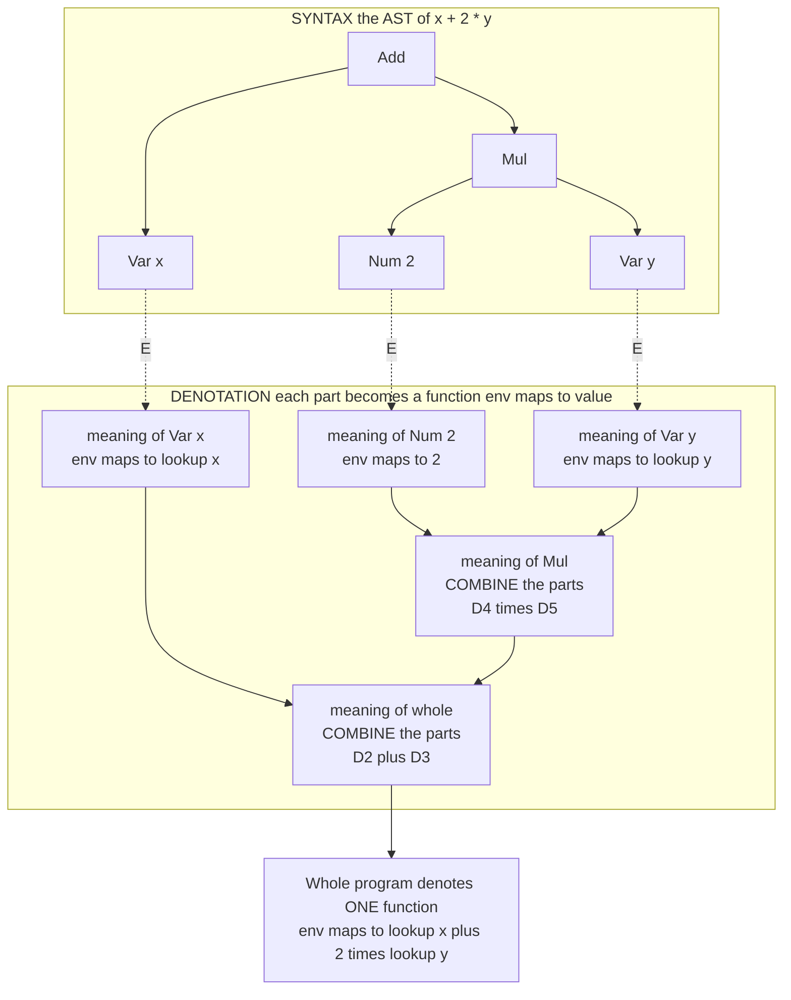

# 🧮 Denotational Semantics

> [!abstract] TL;DR
> **Denotational semantics** defines a program's meaning as the abstract **mathematical object it denotes** — a number, a function, or an element of a **domain** — rather than by how it executes. A program that adds one to its input *is* the mathematical function `n ↦ n+1`; nothing runs. Meaning is assigned by a **semantic valuation function**, written with Scott brackets **⟦·⟧**, defined by the single guiding principle of **compositionality**: the meaning of a compound is built *only* from the meanings of its parts, so `⟦ e1 + e2 ⟧ = ⟦ e1 ⟧ + ⟦ e2 ⟧`. This lets you reason about programs the way you reason about equations — **equals replace equals** — and prove two programs *equivalent* by proving their denotations equal. Its deep machinery is **Scott-Strachey domain theory**: to give loops and recursion a meaning, ordinary sets fail, so we use **complete partial orders** with a **bottom element ⊥** for non-termination, where each recursive definition denotes a **least fixed point**. Denotational thinking is why *"a program is a function"* — the worldview behind Haskell, monadic effects, and category-theoretic semantics.

---

## Intuition

**Analogy — the number, not the arithmetic.** The strings `2 + 3`, `6 − 1`, and `5` are three *different pieces of syntax*, but they all **denote the one number five**. Schoolbook algebra teaches you to ignore the surface form and the order you'd compute it in, and keep only the **value denoted** — that is why you may freely replace `2 + 3` with `5` anywhere. Denotational semantics does *exactly this to whole programs*. Instead of describing **how** a program runs — crack the egg, whisk for sixty seconds — it says **what mathematical object the program IS**. A program that increments its input simply **denotes** the function `n ↦ n+1`. Full stop. No machine, no clock, no steps.

Put another way: a phone number *denotes* a person — the meaning is the person, not the act of dialing. Denotational semantics hands every program its "person": the timeless mathematical value it points to. Once you know a program *is* the function `n ↦ n+1`, you reason about it the way you reason about any equation — substitute equals for equals, and prove two programs equal by proving their **denoted functions** equal. Two wildly different loops that both compute factorial are, denotationally, **the same object**, even though their execution traces share nothing.

---

## How It Works

### The semantic valuation function ⟦·⟧

A denotational semantics is a set of **semantic functions** that map syntax to mathematical values. By tradition each takes a phrase in *Scott brackets*. For a tiny expression-and-command language you write two:

- **⟦ e ⟧** — the meaning of an **expression** `e`, an element of some *value domain* (a number, a boolean, or a function).
- **⟦ c ⟧** — the meaning of a **command** `c`.

These are ordinary mathematical functions *in the metalanguage* (set theory or domain theory), **not** interpreters. `⟦ · ⟧` does not "run" anything; it *is* a definition, given by cases on the syntax, that pins down which mathematical object each phrase names.

### Compositionality — the defining principle

The one law that makes a semantics *denotational* is **compositionality**: the meaning of a compound phrase is a **function of the meanings of its immediate sub-phrases, with no further reference to their syntax**. Concretely:

```
⟦ e1 + e2 ⟧ = ⟦ e1 ⟧ + ⟦ e2 ⟧
⟦ c1 ; c2 ⟧ = ⟦ c2 ⟧ ∘ ⟦ c1 ⟧
```

The meaning of `e1 + e2` is obtained by taking the two *meanings* `⟦ e1 ⟧` and `⟦ e2 ⟧` and combining them with mathematical addition — you never look back at what `e1` or `e2` *looked like*. This is **Frege's principle** ("the meaning of the whole is determined by the meanings of the parts"), and it is what unlocks everything valuable:

- **Modular reasoning** — you can understand a sub-expression's meaning in isolation.
- **Equational substitution** — because `⟦ · ⟧` sees only meanings, if `⟦ e1 ⟧ = ⟦ e2 ⟧` then `e1` and `e2` are interchangeable in *every* context: **equals can replace equals**. This is the essence of **referential transparency** and the foundation of program-equivalence proofs.

A specification that peeks at syntax — "the meaning of `x + x` is *double* the value of `x`, but only when written with the same variable" — is **not** compositional and forfeits equational reasoning.

### What programs denote

The two workhorse denotations for an imperative language are:

- **Expressions denote functions from environments to values.** An expression can mention variables, so its meaning depends on an **environment** (or **store**) `σ` binding names to values. Thus `⟦ e ⟧ : Store → Value`, e.g. `⟦ x + 2 ⟧ = λσ. σ(x) + 2`.
- **Commands denote state transformers.** A statement's effect is to change the store, so a command **denotes a function from stores to stores**: `⟦ c ⟧ : Store → Store`. Assignment updates one binding; **sequencing is function composition**; a conditional selects between two transformers. The whole program is *one* state transformer, assembled by composition from its parts. *(The store/environment model, variable binding, and scope are developed in the sibling note `Names_Binding_and_Scope`.)*

### The recursion problem and domain theory

Here is the hard part. `while` loops and recursive definitions are **self-referential**: the meaning of `while b do c` is defined *in terms of itself*. Naive set-theoretic functions cannot support this — worse, in the untyped case you would need a set `D` isomorphic to its own function space `D ≅ [D → D]`, which is **impossible for ordinary sets** on cardinality grounds (Cantor).

**Dana Scott and Christopher Strachey's domain theory** rescues the enterprise. The moves:

1. Replace plain sets with **complete partial orders (CPOs / domains)**: sets equipped with an information ordering `⊑` in which every ascending chain has a **least upper bound**. `x ⊑ y` reads "`x` is a less-defined approximation of `y`."
2. Add a **bottom element `⊥`** (the least-defined value) to denote **non-termination / divergence** — the "no information yet" element.
3. Restrict to **continuous functions** (monotone, and preserving limits of chains). Continuity is the exact condition under which recursion has a solution.
4. Give each recursive definition the meaning of a **least fixed point**. If a loop's body induces a functional `F`, then `⟦ while b do c ⟧ = lfp(F)`, and by **Kleene's fixed-point theorem** that least fixed point is the limit of the ascending chain of finite approximants:

```
⊥  ⊑  F(⊥)  ⊑  F(F(⊥))  ⊑  …        lfp(F) = ⨆ Fⁿ(⊥)
```

`Fⁿ(⊥)` is "the loop, unrolled at most `n` times"; the least upper bound of that chain is the loop's true meaning. This machinery is the beating heart under denotational semantics and is developed in the sibling note `Domain_Theory_and_Fixed_Points`.

### Non-termination and ⊥

Because a loop may never stop, command denotations are **partial functions**, modeled as *total* functions into a domain that includes **⊥**. A diverging program denotes **⊥** — a perfectly good mathematical value, not an error and not "undefined behavior." This is precisely why you cannot use ordinary math functions: they have no place to send a non-terminating computation, and no way to make `f = F(f)` solvable. The `⊥`-element and continuity together turn "recursion" from a paradox into a **least fixed point**.

### Continuations and advanced denotations

Simple state transformers cannot model **non-local control flow** — jumps, exceptions, early exit. The classic denotational fix is **continuation-passing**: a command denotes a function of a **continuation** (a "rest of the program" function `Store → Answer`), so a `goto` or `throw` denotes *discarding* the current continuation. Effects such as state, I/O, and non-determinism are packaged uniformly with **monads** (Moggi's insight): a computation of type `A` denotes an element of `T A` for an effect monad `T`. *(Continuations, effect monads, and effect handlers live in the sibling note `Monads_and_Effects`.)*

### Flow / Architecture



*`E` is the semantic valuation function ⟦·⟧: it maps each syntactic node on the left to its denotation on the right — a function from environments to values. Crucially, the meaning of **Add** is assembled purely from the meanings of its two children, never from their syntax. That is compositionality made visible.*

### The three semantic styles compared

Denotational is one of three complementary ways to give a language meaning; the historical rivalry between them shaped PLT.

| Style | Meaning is… | Strengths | Weaknesses |
|---|---|---|---|
| **Denotational** *(this note)* | the **mathematical object** a program denotes, built compositionally | abstract, great for **equivalence proofs** and language **design**; implementation-independent | heavy math (domain theory); harder for effects and concurrency |
| **Operational** *(sibling `Operational_Semantics`)* | **how it executes** — step-by-step reduction rules | concrete, easy to write and to trust; now the **default** in practice | reasoning about equivalence is indirect; ties meaning to a "machine" |
| **Axiomatic** *(sibling `Axiomatic_Semantics_and_Hoare_Logic`)* | **logical properties** it satisfies, via Hoare triples `{P} c {Q}` | purpose-built for **verification** | describes properties, not full meaning |

The modern preference leans **operational + logical relations**, but denotational ideas dominate wherever you want to *prove two programs equal* or *design* a language's mathematical core.

### Adequacy and full abstraction

Two denotational quality criteria connect `⟦·⟧` back to actual execution:

- **Computational adequacy** — the denotation agrees with the operational behavior on *observable* results: `⟦ M ⟧ = ⟦ N ⟧` implies `M` and `N` behave identically when you actually run them, and a program denotes `⊥` exactly when it diverges. Adequacy is the minimum "the math matches reality" guarantee.
- **Full abstraction** — the *tight* match: `⟦ M ⟧ = ⟦ N ⟧` **iff** `M` and `N` are **contextually equivalent** (indistinguishable in every program context — see the sibling `Contextual_Equivalence_and_Reasoning`). Milner's famous **full-abstraction problem for PCF** showed the natural domain-theoretic model is adequate but *not* fully abstract: it contains "junk" elements like *parallel-or* that no PCF program can define. The celebrated resolution came decades later via **game semantics** (Abramsky-Jagadeesan-Malacaria and Hyland-Ong, ~1994-2000), which builds a fully abstract model of PCF from strategies in a dialogue game — a landmark result of the field.

---

## Key Concepts

**Secondary (explain to a curious beginner).**
- A program doesn't have to be thought of as *steps*; it can be thought of as the **single answer/function it stands for** — just as `2 + 3` stands for `5`.
- **Compositionality**: the meaning of a big thing is built only from the meanings of its smaller parts — so you can swap a piece for anything with the same meaning.
- A program that runs forever still has a meaning: a special value called **bottom (⊥)** meaning "no answer."

**Undergraduate (requires a CS background).**
- Expressions denote **`Store → Value`**; commands denote **state transformers `Store → Store`**; sequencing is **function composition**.
- Ordinary set functions can't define loops; you need **domains (CPOs)** with `⊥` and **continuous functions** so recursion has a **least fixed point** `⨆ Fⁿ(⊥)` (Kleene iteration).
- **Referential transparency** = compositionality applied to values: equal denotations are interchangeable in all contexts.
- The three styles — **operational, denotational, axiomatic** — are lenses on one program; proving them equivalent (adequacy) is itself a theorem.

**Graduate (system-level and foundational thinking).**
- **Scott's `D∞`** — a domain isomorphic to its own function space `D ≅ [D → D]`, giving a model of the *untyped* lambda calculus (impossible in plain sets; solved as an inverse limit of CPOs).
- **Full abstraction for PCF**: domain models are adequate but not fully abstract (parallel-or definability gap); resolved by **game semantics**.
- **Monadic / algebraic-effects semantics** (Moggi; Plotkin-Power): effects as a monad `T`, computations denote elements of `T A`; the modern route to modular denotations of state, I/O, exceptions.
- **Category-theoretic semantics**: denotations live in a **cartesian-closed category** (types as objects, programs as morphisms); domains and continuous maps form such a category, generalizing the whole approach — see [[Category_Theory]].

---

## Python Demo

We build a **denotational semantics** for a tiny imperative language (IMP) and prove — by cross-checking against a separate operational interpreter — that it is faithful. The key move: the semantic function turns **each AST node into a Python function** (its denotation). An expression denotes `state -> value`; a command denotes a **state transformer** `state -> state`; the meaning of a whole program is **composed from the meanings of its parts** (compositionality). The `while` loop denotes the **least fixed point** of a functional, computed by **Kleene iteration**, with divergence modeled by the bottom element `None`. Finally we *visualize* the compositional build-up.

```python
# Denotational semantics of a tiny imperative language (IMP), cross-checked
# against an operational interpreter and visualised with matplotlib.
#
# COMPOSITIONALITY:
#   E(expr)     -> a function  state -> value          (the expression's meaning)
#   C(command)  -> a function  state -> state          (a STATE TRANSFORMER)
#   the meaning of a compound is BUILT FROM the meanings of its parts.
#   A while loop denotes the LEAST FIXED POINT of a functional (domain theory),
#   here computed by Kleene iteration; BOTTOM (None) denotes divergence.
from dataclasses import dataclass
import matplotlib.pyplot as plt

# ---------------- Abstract syntax ----------------
@dataclass(frozen=True)
class Num:    n: int
@dataclass(frozen=True)
class Var:    x: str
@dataclass(frozen=True)
class Bin:    op: str; l: object; r: object     # op in {+, -, *, <=, and}
@dataclass(frozen=True)
class Skip:   pass
@dataclass(frozen=True)
class Assign: x: str; e: object
@dataclass(frozen=True)
class Seq:    c1: object; c2: object
@dataclass(frozen=True)
class If:     b: object; c1: object; c2: object
@dataclass(frozen=True)
class While:  b: object; body: object

BOTTOM = None            # the bottom element: denotes non-termination

# ---------------- E: expression denotation  (state -> value) ----------------
def E(e):
    if isinstance(e, Num):
        return lambda s: e.n
    if isinstance(e, Var):
        return lambda s: s[e.x]
    if isinstance(e, Bin):
        f, g, op = E(e.l), E(e.r), e.op        # MEANINGS of the parts
        if op == "+":   return lambda s: f(s) + g(s)
        if op == "-":   return lambda s: f(s) - g(s)
        if op == "*":   return lambda s: f(s) * g(s)
        if op == "<=":  return lambda s: 1 if f(s) <= g(s) else 0
        if op == "and": return lambda s: 1 if f(s) and g(s) else 0
    raise ValueError(e)

# ---------------- C: command denotation  (state -> state | BOTTOM) ----------------
def C(c):
    if isinstance(c, Skip):
        return lambda s: s
    if isinstance(c, Assign):
        f = E(c.e)
        return lambda s: {**s, c.x: f(s)}                     # update one binding
    if isinstance(c, Seq):
        d1, d2 = C(c.c1), C(c.c2)                             # COMPOSE transformers
        def seq(s):
            s1 = d1(s)
            return BOTTOM if s1 is BOTTOM else d2(s1)
        return seq
    if isinstance(c, If):
        b, d1, d2 = E(c.b), C(c.c1), C(c.c2)
        return lambda s: d1(s) if b(s) else d2(s)
    if isinstance(c, While):
        b, body = E(c.b), C(c.body)
        # Denotation = LEAST FIXED POINT of  F(w) = \s. if b(s) then w(body(s)) else s.
        # Kleene iteration: unroll one iteration at a time until the guard is false.
        def denotation(s, LIMIT=1_000_000):
            for _ in range(LIMIT):
                if not b(s):
                    return s
                s = body(s)
                if s is BOTTOM:
                    return BOTTOM
            return BOTTOM                                     # ran past limit -> divergence
        return denotation
    raise ValueError(c)

def while_approx(b, body, k):
    """The k-th Kleene approximant w_k of a loop denotation (unroll at most k times).
       w_0 = BOTTOM everywhere; the least upper bound of w_0 <= w_1 <= ... is the meaning."""
    def w(s):
        cur = s
        for _ in range(k):
            if not b(cur):
                return cur
            cur = body(cur)
            if cur is BOTTOM:
                return BOTTOM
        return cur if not b(cur) else BOTTOM                 # still looping -> undefined
    return w

# ---------------- Operational interpreter (independent, for cross-checking) ----------------
def op_eval(e, s):
    if isinstance(e, Num): return e.n
    if isinstance(e, Var): return s[e.x]
    a, b = op_eval(e.l, s), op_eval(e.r, s)
    return {"+": a + b, "-": a - b, "*": a * b,
            "<=": 1 if a <= b else 0,
            "and": 1 if a and b else 0}[e.op]

def op_exec(c, s, budget=1_000_000):
    if isinstance(c, Skip):   return s
    if isinstance(c, Assign): return {**s, c.x: op_eval(c.e, s)}
    if isinstance(c, Seq):
        s = op_exec(c.c1, s, budget)
        return None if s is None else op_exec(c.c2, s, budget)
    if isinstance(c, If):
        return op_exec(c.c1, s, budget) if op_eval(c.b, s) else op_exec(c.c2, s, budget)
    if isinstance(c, While):
        n = 0
        while op_eval(c.b, s):
            s = op_exec(c.body, s, budget); n += 1
            if n > budget: return None
        return s

# ---------------- Sample programs ----------------
loop_body = Seq(Assign("f", Bin("*", Var("f"), Var("n"))),
                Assign("n", Bin("-", Var("n"), Num(1))))
prog_fact = Seq(Assign("f", Num(1)),
                While(Bin("<=", Num(1), Var("n")), loop_body))          # n! into f
prog_sum  = Seq(Assign("s", Num(0)),
                While(Bin("<=", Num(1), Var("n")),
                      Seq(Assign("s", Bin("+", Var("s"), Var("n"))),
                          Assign("n", Bin("-", Var("n"), Num(1))))))     # 1+...+n into s
prog_max  = If(Bin("<=", Var("a"), Var("b")),
               Assign("m", Var("b")), Assign("m", Var("a")))            # max into m

# ---------------- Verify: denotational == operational ----------------
tests = [("factorial", prog_fact, {"n": 5}), ("factorial", prog_fact, {"n": 0}),
         ("sum 1..n",  prog_sum,  {"n": 5}), ("sum 1..n",  prog_sum,  {"n": 0}),
         ("max a b",   prog_max,  {"a": 3, "b": 7}), ("max a b", prog_max, {"a": 9, "b": 2})]
print(f"{'program':10} {'input':14} {'denotational (C)':26} {'operational':26} match")
for name, prog, s0 in tests:
    den, op = C(prog)(dict(s0)), op_exec(prog, dict(s0))
    print(f"{name:10} {str(s0):14} {str(den):26} {str(op):26} {den == op}")

# ---------------- Visualise ----------------
fig = plt.figure(figsize=(14, 6))

# Panel 1: compositional build-up of an expression's denotation on state {x:5, y:3}.
demo   = Bin("*", Bin("+", Var("x"), Num(2)), Bin("+", Var("y"), Num(1)))   # (x+2)*(y+1)
state  = {"x": 5, "y": 3}
def kids(e):  return [] if isinstance(e, (Num, Var)) else [e.l, e.r]
def tag(e):   return str(e.n) if isinstance(e, Num) else e.x if isinstance(e, Var) else e.op
def layout(node, depth=0, ctr=[0]):
    ch = kids(node); pos, ed, meta = {}, [], {}
    if not ch:
        x = ctr[0]; ctr[0] += 1
    else:
        xs = []
        for c in ch:
            p, e, m = layout(c, depth + 1, ctr)
            pos.update(p); ed += e; meta.update(m); ed.append((id(node), id(c)))
            xs.append(p[id(c)][0])
        x = sum(xs) / len(xs)
    pos[id(node)] = (x, -depth); meta[id(node)] = (tag(node), E(node)(state))
    return pos, ed, meta
pos, edges, meta = layout(demo)
ax = fig.add_subplot(1, 2, 1)
ax.set_title("Compositionality: meaning of parts -> meaning of whole\n(x+2)*(y+1) on state x=5, y=3")
for a, b in edges:
    (x1, y1), (x2, y2) = pos[a], pos[b]
    ax.plot([x1, x2], [y1, y2], color="#999", zorder=1)
for nid, (x, y) in pos.items():
    sym, val = meta[nid]
    ax.scatter([x], [y], s=1500, color="#4C72B0", zorder=2)
    ax.text(x, y + 0.03, sym, ha="center", va="center", color="white", fontweight="bold")
    ax.text(x, y - 0.12, f"= {val}", ha="center", va="center", color="#C44E52", fontweight="bold")
ax.text(pos[id(demo)][0], 0.55, "whole denotes 28", ha="center", color="#C44E52", fontweight="bold")
ax.axis("off")

# Panel 2: while-loop meaning as a LEAST FIXED POINT (Kleene iteration).
b_fac   = E(Bin("<=", Num(1), Var("n")))
body_fac = C(loop_body)
init    = {"n": 5, "f": 1}                       # after f:=1, computing 5!
ks      = list(range(0, 9))
vals    = []
for k in ks:
    r = while_approx(b_fac, body_fac, k)(dict(init))
    vals.append(None if r is BOTTOM else r["f"])
ax = fig.add_subplot(1, 2, 2)
ax.set_title("while-loop meaning = least fixed point\napproximants  bottom <= w1 <= w2 <= ... (input n=5)")
lfp = next(k for k, v in zip(ks, vals) if v is not None)
for k, v in zip(ks, vals):
    if v is None:
        ax.scatter([k], [0], marker="x", s=120, color="#C44E52")
    else:
        ax.scatter([k], [v], s=120, color="#55A868")
ax.axhline(vals[-1], ls="--", color="#55A868", alpha=0.6)
ax.annotate(f"least fixed point reached\nat k={lfp}:  5! = {vals[-1]}",
            xy=(lfp, vals[-1]), xytext=(lfp - 0.3, vals[-1] * 0.55),
            arrowprops=dict(arrowstyle="->", color="#333"), color="#333")
ax.text(0.2, vals[-1] * 0.08, "x = BOTTOM (undefined:\nnot enough unrollings)", color="#C44E52")
ax.set_xlabel("approximant index k (loop unrolled at most k times)")
ax.set_ylabel("value of f in w_k(state)")
fig.suptitle("Denotational semantics: build meaning compositionally; loops via least fixed point",
             fontsize=13)
fig.tight_layout()
plt.show()   # or: fig.savefig("denotational.png", dpi=120)
```

Running it confirms the denotational meaning **agrees exactly** with the operational interpreter on every program:

```
program    input          denotational (C)           operational                match
factorial  {'n': 5}       {'n': 0, 'f': 120}         {'n': 0, 'f': 120}         True
factorial  {'n': 0}       {'n': 0, 'f': 1}           {'n': 0, 'f': 1}           True
sum 1..n   {'n': 5}       {'n': 0, 's': 15}          {'n': 0, 's': 15}          True
sum 1..n   {'n': 0}       {'n': 0, 's': 0}           {'n': 0, 's': 0}           True
max a b    {'a': 3, 'b': 7} {'a': 3, 'b': 7, 'm': 7} {'a': 3, 'b': 7, 'm': 7}   True
max a b    {'a': 9, 'b': 2} {'a': 9, 'b': 2, 'm': 9} {'a': 9, 'b': 2, 'm': 9}   True
```

The payoff is exactly the theory: **the meaning of every compound was assembled from the meanings of its parts** (left panel — `28` is `7 × 4`, computed from the children), and the **loop's meaning is the least upper bound of its finite approximants** (right panel — `w_0 … w_4` are `⊥`, and `w_5 = w_6 = … = 120` is the fixed point). That match with the operational interpreter is *computational adequacy* in miniature.

---

## Real-World Applications

> **Haskell and "denotational design."** Purely functional languages *are* denotational semantics made practical: a Haskell value **is** the mathematical object it denotes, so **referential transparency** (compositionality applied to values) holds by construction and you refactor by equational reasoning. Conal Elliott's *denotational design* methodology specifies a library by first giving its **denotation** (what its types *mean* as math) and deriving the implementation to match.

- **Monadic and algebraic-effects semantics.** Moggi's monadic denotational semantics of effects became engineering: Haskell's `IO`, `State`, and `Either` monads, and modern **effect systems / algebraic-effect handlers** (Koka, OCaml 5, Unison), are denotational models of side effects shipped as language features. *(Sibling: `Monads_and_Effects`.)*
- **Static analysis via abstract interpretation.** Cousot-Cousot **abstract interpretation** computes a *sound approximation of a program's denotation* as a fixed point over an abstract domain — data-flow analysis, interval/sign analysis, and tools like Astrée and Infer are denotational semantics done approximately.
- **Compiler correctness and optimization.** Proving an optimization or two programs **equivalent** is proving their denotations equal; verified compilers use denotational or logical-relations models to justify meaning-preserving transformations — see [[Formal_Semantics_and_Verified_Compilers]].
- **Database query semantics.** A SQL query *denotes* a function from database instances to relations (relational algebra); query optimizers rewrite queries freely precisely because the rewrites **preserve the denotation**.
- **Language standards.** Early **Scheme** and **Algol 68** were given official **denotational definitions**, fixing meaning independently of any interpreter — the design payoff denotational semantics was invented for.

---

## Common Pitfalls

- **Thinking `⟦·⟧` "runs" the program.** A denotation is a *definition of a mathematical object*, not an execution. When you implement it in a metalanguage it looks like an interpreter, but the theory reasons about the object itself — the operational counterpart is the sibling `Operational_Semantics`.
- **Sneaking syntax into the denotation.** If a phrase's meaning depends on how it is *written* (variable names, source shape) rather than only on the meanings of its parts, you have broken **compositionality** and lost equational substitution. This is the single most common way a "denotational" semantics fails to be one.
- **Using ordinary set functions for recursion.** Plain sets give no `⊥`, no notion of "less-defined," and cannot solve `D ≅ [D → D]`. Recursion has *no* well-defined meaning without **CPOs, ⊥, and continuous functions** — the whole reason domain theory exists (sibling `Domain_Theory_and_Fixed_Points`).
- **Ignoring `⊥` / non-termination.** Treating command meanings as *total* functions equates a diverging program with some arbitrary state, silently making false theorems provable. Divergence must denote `⊥`.
- **Requiring monotonicity/continuity but not checking it.** The least-fixed-point construction only works for **continuous** functionals; a non-continuous "meaning" has no `⨆ Fⁿ(⊥)` and the whole loop denotation collapses.
- **Confusing adequacy with full abstraction.** A model can be *adequate* (agrees on observable behavior) yet **not fully abstract** (distinguishes programs that are contextually equal) — the PCF *parallel-or* gap. Assuming "adequate ⇒ fully abstract" is a classic error (sibling `Contextual_Equivalence_and_Reasoning`).
- **The metalanguage closure bug.** When you *implement* denotations, building lambdas inside a `for` loop and capturing the loop variable by reference (Python's late binding) yields the wrong denotation for every branch. Bind each part's meaning to a fresh local first — a real hazard the demo sidesteps by recursing rather than looping.

---

## Related Concepts

- [[Programming_Language_Theory_Overview]] — the parent map; denotational semantics is the "what mathematical object it denotes" corner of the three semantic styles.
- [[Recursive_Functions_and_Lambda_Calculus]] — the untyped lambda calculus whose denotational model is Scott's `D∞`; where the `D ≅ [D → D]` problem is solved.
- [[Category_Theory]] — the modern generalization: denotations as morphisms in a cartesian-closed category; the mathematics of composition behind compositionality.
- [[Set_Theory_and_Relations]] — why *plain* sets and set-theoretic functions are insufficient for recursion, motivating domains.
- [[Real_Numbers_and_Completeness]] — the least-upper-bound / completeness intuition that domains borrow: a CPO is "complete for chains" the way ℝ is complete for bounded sets.
- [[Topological_Spaces]] — the **Scott topology** on a domain makes "continuous function" literally topological continuity; the order-theoretic and topological views coincide.
- [[Formal_Semantics_and_Verified_Compilers]] — where a semantics (denotational or operational) becomes a compiler-correctness theorem.
- [[Interpreters_and_Tree_Walking]] — the operational counterpart: an interpreter realizes a step-by-step semantics, the foil to `⟦·⟧`.
- [[Type_Checking_and_Type_Systems]] — types carve out the value domains a denotation ranges over; a typed language has a typed denotational model.
- [[Abstract_Syntax_Trees_and_Parser_Design]] — the AST that the semantic function `⟦·⟧` recurses over, node by node.
- [[Theory_of_Computation_Overview]] — computability foundations; `⊥` and fixed points connect to Kleene's recursion theorem and the halting problem.
- [[Logic_and_Proof_Techniques]] — structural induction on syntax, the everyday tool for proving denotational facts and adequacy.

*(Vault siblings referenced in prose, to be built alongside this note: `Operational_Semantics`, `Domain_Theory_and_Fixed_Points`, `Axiomatic_Semantics_and_Hoare_Logic`, `Contextual_Equivalence_and_Reasoning`, `Names_Binding_and_Scope`, `Monads_and_Effects`, `Functional_Programming_Foundations`.)*

---

## Review Questions

1. **(Secondary)** The strings `2 + 3` and `5` are different syntax but denote the same number. Explain, using this analogy, what it means to say the programs `x := x + 0` and `skip` are *denotationally equal*, and why that lets you replace one with the other anywhere.
2. **(Undergraduate)** Give the compositional clauses for `⟦ c1 ; c2 ⟧` and `⟦ if b then c1 else c2 ⟧` as state transformers `Store → Store`. Then explain precisely why the clause for `while b do c` cannot be written in the same finite, non-recursive way, and what mathematical object replaces it.
3. **(Graduate)** (a) Why can there be no *set* `D` with `D ≅ [D → D]`, and how do complete partial orders with `⊥` and continuous functions make the analogous domain equation solvable? (b) Distinguish **computational adequacy** from **full abstraction**, and explain what the *parallel-or* function shows about the standard domain model of PCF — and how game semantics resolved it.

---

## Sources

- Dana S. Scott and Christopher Strachey, *Toward a Mathematical Semantics for Computer Languages*, Oxford Programming Research Group Technical Monograph PRG-6, 1971 — the founding paper of the denotational (Scott-Strachey) approach.
- Joseph E. Stoy, *Denotational Semantics: The Scott-Strachey Approach to Programming Language Theory*, MIT Press, 1977 — the classic textbook treatment.
- Glynn Winskel, *The Formal Semantics of Programming Languages*, MIT Press, 1993 — operational, denotational, and axiomatic semantics with domain theory and fixed points.
- David A. Schmidt, *Denotational Semantics: A Methodology for Language Development*, Allyn & Bacon, 1986 — [free PDF](https://people.cs.ksu.edu/~schmidt/text/densem.html).
- Eugenio Moggi, "Notions of Computation and Monads," *Information and Computation* 93(1), 1991 — monadic (denotational) semantics of effects.
- Samson Abramsky, Radha Jagadeesan, Pasquale Malacaria, "Full Abstraction for PCF," *Information and Computation* 163(2), 2000 — the game-semantics resolution of Milner's full-abstraction problem.

---

#programming-language-theory #denotational-semantics #compositionality #domain-theory #scott
