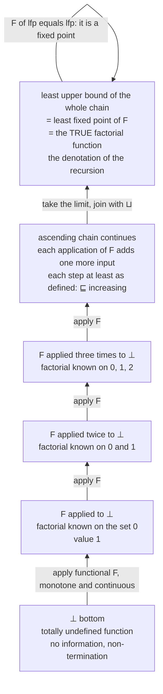

# ♾️ Domain Theory and Fixed Points

> [!abstract] TL;DR
> A recursive definition like `fact n = if n == 0 then 1 else n * fact(n-1)` is **circular** — factorial is defined in terms of itself — so ordinary set theory can't just hand you the function it "means," and to make matters worse some programs **diverge**, so the meaning must include a value for "undefined / loops forever." **Domain theory**, Dana Scott's framework beneath denotational semantics, solves both problems at once. It orders values by how *defined* they are, puts a least element **⊥ ("bottom", = no information / non-termination)** at the bottom, and shows that a recursive definition is a **continuous function** `F` on this ordered structure. **Kleene's fixed-point theorem** then says every such `F` has a **least fixed point**, computed as the limit — the *least upper bound* — of the ascending chain `⊥ ⊑ F(⊥) ⊑ F(F(⊥)) ⊑ ...`. That least fixed point **is the meaning of the recursion**: start knowing nothing, apply the definition over and over, and the growing approximation converges to exactly the function the program computes.

---

## Intuition

**Analogy — the recursion budget, developing like a photograph.** Imagine you may only run `factorial` with a fixed *depth budget*: each nested call spends one unit, and when the budget hits zero the machine throws up its hands and says **"I don't know"** — that's ⊥. With a budget of **0** you learn nothing at all: the function is defined *nowhere*. With a budget of **1** you can evaluate the base case, so you now know `fact(0) = 1` and nothing else. With a budget of **2** the outer call can lean on the budget-1 answer, so you learn `fact(1)` too. Every extra unit of budget defines the function on **exactly one more input**. No single finite budget ever gives you *all* of factorial — but the **limit as the budget grows without bound** does. That limit *is* the factorial function, and it is precisely what domain theory constructs.

The picture is a photograph developing in a tray of chemicals: it starts blank (⊥, no information), each pass reveals a little more of the image, no single early moment shows the whole picture, yet the fully developed photo is the *limit* of that ever-sharpening sequence. Domain theory makes "start from nothing, keep applying the definition, take the limit" into rigorous mathematics — and the theorem that guarantees the limit exists and is *the right answer* is the least fixed-point theorem. **Intuition first: recursion means "the limit of finite approximations," and the rest of this note names the machinery that makes that precise.**

---

## How It Works

### Core mechanics

**1. The problem, stated sharply.** A definition `fact = λn. if n == 0 then 1 else n * fact(n-1)` mentions `fact` on both sides. Set theory can define a function only in terms of things *already* built, so this equation is not a definition — it is a *constraint*, and we must exhibit an actual function that *satisfies* it. Worse, arbitrary recursive programs can loop forever, so whatever value we assign to a divergent computation must be a genuine element of our space of meanings, not an error. Domain theory answers both: it enriches "sets of values" into **ordered spaces of information** in which "undefined" is a first-class value and recursive equations always have a canonical solution.

**2. The information ordering.** Order elements by *how defined / how informative* they are, written `x ⊑ y` ("x approximates y" / "y is at least as defined as x"). The **least element ⊥ (bottom)** means "no information — the computation that never returns." For **partial functions** the ordering is concrete: `f ⊑ g` iff `f` and `g` **agree everywhere `f` is defined**, and `g` may be defined on *more* inputs. The totally-undefined function (empty graph) is ⊥; the true factorial sits far above it. Crucially this is a *partial* order: two approximations that disagree, or that are each defined where the other is not incomparably, need not be comparable at all.

**3. Complete partial orders (CPOs).** Recursion produces *chains* of ever-better approximations, and we need their **limit** to live in the space. A **CPO** is a partial order with a bottom ⊥ in which every ascending chain (more generally, every *directed* set — hence **directed-complete partial order, DCPO**) has a **least upper bound** `⊔` (the limit). CPOs are built compositionally: **flat domains** (a set of values plus ⊥, everything else incomparable — good for `Nat` or `Bool`), **product domains** `D × E` (pairs, ordered componentwise), **sum domains** (tagged unions), and — the key one — **function domains** `[D → E]` of *continuous* functions, ordered pointwise. A **Scott domain** adds mild extra structure (algebraicity, consistent-completeness) so that every element is the limit of its finite/compact approximations.

**4. Monotone and continuous functions.** Not every function on a CPO makes sense as a *computation*. A computable function must be **monotone** — *more input information can only yield more output information*, `x ⊑ y ⟹ f(x) ⊑ f(y)` — because you can never gain by knowing *less*. It must further be **continuous**: it commutes with the limits of chains, `f(⊔ xₙ) = ⊔ f(xₙ)`. Continuity is the domain-theoretic form of **computability / finiteness**: any finite amount of output depends on only a finite amount of input, so a machine can produce output from partial input without waiting for an infinite computation to finish. The functional derived from a recursive definition is always continuous.

**5. The Kleene fixed-point theorem — the payoff.** Turn the recursive equation into a **functional** `F : [D → E] → [D → E]` that takes an approximation of the function and returns a *better* one. For factorial:
`F(g) = λn. if n == 0 then 1 else n * g(n-1)`.
`F` is continuous on the CPO of partial functions. **Kleene's theorem:** every continuous `F` on a CPO with bottom has a **least fixed point**, and it is the least upper bound of the ascending chain obtained by iterating `F` from ⊥:

`lfp(F) = ⊔ₙ Fⁿ(⊥) = ⊔ { ⊥, F(⊥), F(F(⊥)), F(F(F(⊥))), ... }`.

A **fixed point** satisfies `F(m) = m` — i.e. `m` is a function that already obeys the recursive equation. The chain climbs because `⊥ ⊑ F(⊥)` (bottom is below everything) and `F` is monotone, so applying `F` preserves the order all the way up. Its limit is a fixed point, and it is the **least** one. That least fixed point **is, by definition, the denotation (meaning) of the recursive program.** (The related **Knaster-Tarski theorem** gives a least fixed point on any complete *lattice* for merely monotone `F` — more general, but non-constructive; Kleene's is the *computational*, chain-building version.)

**6. Why the *least* fixed point.** The recursive equation usually has *many* solutions. For a nonterminating loop the equation `m = F(m)` is satisfied by functions that invent arbitrary answers on inputs where the program actually loops forever. The **least** fixed point assigns ⊥ ("undefined") to exactly those inputs and adds **no arbitrary extra behavior** — it captures *only* what the definition forces. This is what makes the denotation agree with the operational reality: the meaning is defined at `n` **iff the program terminates on `n`**, and equals the value it computes.

**7. Loops and `while`.** Imperative recursion is the same story. `while b do c` denotes the least fixed point of the **state-transformer functional** `W(f) = λs. if b(s) then f(c(s)) else s`. Iterating `W` from ⊥ yields, at stage `k`, the meaning of "the loop, but forced to stop after at most `k` turns"; the limit is the true loop, **undefined (⊥) precisely on states from which the loop never exits**. This is the denotational counterpart of the axiomatic (Hoare-logic) treatment of loops via invariants.

**8. Strictness and laziness.** ⊥ turns the strict/lazy distinction into a crisp equation. A function is **strict** iff `f(⊥) = ⊥` — it *needs* its argument, so if the argument diverges, so does the call (call-by-value forces this). A **non-strict** function can return a defined result *without* evaluating a diverging argument — e.g. `const 5 ⊥ = 5` — which is exactly what **lazy / call-by-need** evaluation realizes. ⊥-propagation through a program's domains is the mathematical account of "which arguments must be evaluated," the same territory that reduction-strategy and evaluation-order analysis explores.

**9. Historical significance — a model for the untyped λ-calculus.** The untyped lambda calculus lets a term be *applied to itself* (`x x`), so a naive set-theoretic model would need a set `D` isomorphic to its own function space `D → D` — impossible by Cantor's theorem for ordinary sets, since `D → D` is strictly larger. Scott's breakthrough (**the D∞ construction**, 1969-70) built a *domain* `D∞` that **is** isomorphic to `[D∞ → D∞]` (its *continuous* self-maps, a far smaller space than all functions), giving the first mathematical model in which self-application and unrestricted recursion make sense. This is the origin of the whole field and the reason denotational semantics became possible.

### Flow / architecture



*Read bottom to top: start at ⊥ knowing nothing; each application of the continuous functional `F` climbs one rung of the information order, defining factorial on one more input; the least upper bound `⊔` of the entire chain is the least fixed point — the meaning of the recursive definition. The self-edge records that `F(lfp) = lfp`.*

---

## Key Concepts

**Secondary (explain to a curious beginner).**
- A **recursive definition** like "factorial uses factorial" looks circular. Domain theory reads it as *"start knowing nothing, apply the rule again and again, and take the limit."*
- **⊥ ("bottom")** is a real value meaning **"undefined / this computation loops forever."** Meanings of programs must include it, because some programs never stop.
- Each pass of the definition fills in **one more input**; the never-ending sequence of partial answers **converges** to the actual function. That limit is the **least fixed point**.

**Undergraduate (requires a CS background).**
- **Information ordering `⊑`:** `f ⊑ g` means `f` agrees with `g` wherever `f` is defined but `g` may be defined on more inputs; ⊥ is the empty (nowhere-defined) function.
- **CPO / DCPO:** a partial order with a bottom in which every ascending (directed) chain has a **least upper bound** `⊔` — exactly the limits recursion needs. Built compositionally from **flat**, **product**, **sum**, and **function** domains.
- **Monotone + continuous functional:** monotone = "more input info gives more output info"; continuous = "commutes with limits of chains." Continuity is the domain-theoretic stand-in for computability.
- **Kleene's fixed-point theorem:** `lfp(F) = ⊔ₙ Fⁿ(⊥)`. The meaning of a recursive definition is the least fixed point of its functional.
- **Least, not any, fixed point:** the least one adds no arbitrary values and diverges exactly where the program does.

**Graduate (system-level and foundational thinking).**
- **Scott domains, algebraicity, and compact elements:** every element is the directed join of the finite/compact elements below it; continuous maps are determined by their action on compacts.
- **Knaster-Tarski vs Kleene:** Knaster-Tarski gives least/greatest fixed points of a *monotone* map on a complete *lattice* (non-constructive, order-theoretic); Kleene gives the least fixed point of a *continuous* map on a CPO as an explicit ω-chain limit (constructive).
- **`D∞` and models of the untyped λ-calculus:** the inverse-limit construction of a domain isomorphic to its own continuous function space, resolving self-application (Scott, 1969-70).
- **Fixed points and computability:** the least-fixed-point operator internalizes the **Y combinator** — the operational fixed-point combinator of the lambda calculus — as a denotational object; both compute "the function a self-referential equation defines."
- **Powerdomains and full abstraction:** extensions for nondeterminism/concurrency, and the long-studied gap between denotational and operational equality (the *full-abstraction* problem, Plotkin's PCF).

---

## Python Demo

We compute the **least fixed point of a recursive definition by iteration**, exactly as Kleene's theorem prescribes. A **partial function** is a Python `dict` — *missing keys are ⊥ (undefined)*. The **factorial functional `F`** takes an approximation and returns a strictly better one; we iterate it from the **totally-undefined function `{}`** and watch the ascending chain `⊥ ⊑ F(⊥) ⊑ F²(⊥) ⊑ ...` fill in one more input per step, converging to the true factorial. Two plots visualize the growing **domain of definition** (the Kleene chain) and the approximations **climbing to the least fixed point**. Pure standard library plus matplotlib.

```python
# Kleene's fixed-point theorem, made concrete:
#   lfp(F) = join over n of  F^n(bottom).
# A partial function is a dict; a MISSING key means bottom (undefined / loops forever).
# F is the factorial FUNCTIONAL: given an approximation g, it returns a better one,
# directly encoding   fact n = if n == 0 then 1 else n * fact(n-1).
import matplotlib.pyplot as plt
from matplotlib import cm

BOTTOM = "_|_"          # ASCII stand-in for the bottom element  (undefined)
N_MAX  = 12             # highest input we bother to track

def true_factorial(n):  # the answer we should converge TO
    r = 1
    for k in range(2, n + 1):
        r *= k
    return r

def F(g):
    """Factorial functional: partial function -> better partial function.
    g is a dict {input: value}; a missing key = bottom.
    Base case fact(0)=1 is ALWAYS producible; the step fact(n)=n*fact(n-1)
    is producible only where g already defines fact(n-1)."""
    h = {}
    for n in range(N_MAX + 1):
        if n == 0:
            h[0] = 1                       # base case: defined unconditionally
        elif (n - 1) in g:                 # step: needs the previous approximation
            h[n] = n * g[n - 1]
        # else: leave n undefined -> it stays bottom in this approximation
    return h

# --- Build the Kleene ascending chain  bottom, F(bottom), F(F(bottom)), ... ---
chain = []
g = {}                                     # bottom: the nowhere-defined function
for _ in range(N_MAX + 2):
    chain.append(dict(g))                  # snapshot F^k(bottom)
    g = F(g)                               # climb one rung

# --- Verify the two facts Kleene's theorem promises ---
# (a) the chain is ascending in the information order: each step EXTENDS the last
for lo, hi in zip(chain, chain[1:]):
    assert all(lo[k] == hi.get(k) for k in lo), "not information-monotone!"
# (b) every approximation AGREES with the true function wherever it is defined
for approx in chain:
    assert all(v == true_factorial(k) for k, v in approx.items()), "wrong value!"

print("Iterating the factorial functional F from bottom (the undefined function):\n")
for k, approx in enumerate(chain[:7]):
    dom = sorted(approx)
    body = ", ".join(f"{n}:{approx[n]}" for n in dom) if dom else BOTTOM
    print(f"  F^{k}(bottom) = {{{body}}}"
          f"{'':<{max(0, 34 - len(body))}} defined on {dom if dom else '{}'}")
print(f"\n  ... limit (least fixed point) = the true factorial on ALL naturals.")

# --- Visualize:  domain growth (Kleene chain)  +  convergence to the lfp ---
fig, (ax1, ax2) = plt.subplots(1, 2, figsize=(14, 6))

domain_sizes = [len(a) for a in chain]
ax1.step(range(len(chain)), domain_sizes, where="post", color="#4C72B0", lw=2)
ax1.scatter(range(len(chain)), domain_sizes, color="#4C72B0", zorder=3)
ax1.set_title("Kleene ascending chain\nsize of the domain of definition grows by 1 each step")
ax1.set_xlabel("k   (number of times F is applied to bottom)")
ax1.set_ylabel("inputs on which factorial is defined")
ax1.grid(alpha=0.3)

xs_true = list(range(N_MAX + 1))
ys_true = [true_factorial(n) for n in xs_true]
ax2.plot(xs_true, ys_true, "--", color="#C44E52", lw=2,
         label="least fixed point = true factorial")
picks  = [1, 3, 5, 7, N_MAX + 1]
colors = cm.viridis([i / (len(picks) - 1) for i in range(len(picks))])
for c, k in zip(colors, picks):
    approx = chain[k]
    xs = sorted(approx)
    ax2.scatter(xs, [approx[n] for n in xs], color=c, s=45, zorder=3,
                label=f"F^{k}(bottom): defined on 0..{k - 1}")
ax2.set_yscale("log")
ax2.set_title("Approximations climbing to the least fixed point\n(each F fills in one more input)")
ax2.set_xlabel("n")
ax2.set_ylabel("factorial(n)   (log scale)")
ax2.legend(fontsize=8, loc="upper left")
ax2.grid(alpha=0.3)

fig.suptitle("Domain theory: lfp(F) = join of F^k(bottom)  — the meaning of the recursion",
             fontsize=14)
fig.tight_layout()
plt.show()     # or: fig.savefig("kleene_chain.png", dpi=120)
```

Expected console output (the ascending chain, each step defined on one more input):

```
Iterating the factorial functional F from bottom (the undefined function):

  F^0(bottom) = {_|_}                             defined on {}
  F^1(bottom) = {0:1}                             defined on [0]
  F^2(bottom) = {0:1, 1:1}                        defined on [0, 1]
  F^3(bottom) = {0:1, 1:1, 2:2}                   defined on [0, 1, 2]
  F^4(bottom) = {0:1, 1:1, 2:2, 3:6}              defined on [0, 1, 2, 3]
  F^5(bottom) = {0:1, 1:1, 2:2, 3:6, 4:24}        defined on [0, 1, 2, 3, 4]
  F^6(bottom) = {0:1, 1:1, 2:2, 3:6, 4:24, 5:120} defined on [0, 1, 2, 3, 4, 5]

  ... limit (least fixed point) = the true factorial on ALL naturals.
```

The two `assert` blocks *prove* the domain-theoretic story on this concrete instance: the chain is **information-monotone** (each approximation extends the previous one — `⊑`), and **every** approximation agrees with the true factorial wherever defined (they are all `⊑` the least fixed point). The left plot is the Kleene chain — the domain of definition growing one input per application of `F`. The right plot shows the finite approximations `Fᵏ(⊥)` climbing to fill in the true factorial curve: **no finite `k` covers everything, but the limit does**, and that limit is the denotation of the recursion.

---

## Real-World Applications

> **Static program analysis / abstract interpretation.** Every dataflow analysis in a production compiler — liveness, reaching definitions, constant propagation, available expressions — is a **least (or greatest) fixed-point computation over a lattice**, the exact same mathematics: monotone transfer functions iterated to convergence. Cousot and Cousot's **abstract interpretation** generalizes this into a Galois-connected abstract domain with **widening/narrowing** to force termination over infinite-height lattices. See [[Control_Flow_and_Data_Flow_Analysis]] — the fixed-point iteration there *is* domain theory applied to program facts.

- **Denotational semantics of real languages.** The Scott-Strachey approach gives Standard ML, Haskell, and PCF-style languages a mathematical meaning in which `letrec`, `fix`, and diverging expressions are least fixed points in a CPO — the rigorous account behind any language with general recursion.
- **Lazy evaluation and strictness analysis.** Haskell's compiler (GHC) reasons about ⊥-propagation to decide which arguments are used strictly — a compile-time approximation of "does this function need its argument," letting it evaluate eagerly and unbox without changing meaning. Strictness *is* the domain-theoretic property `f(⊥) = ⊥`.
- **The `fix` combinator in functional libraries.** `fix f = f (fix f)` in Haskell, and `Y` in the lambda calculus, are the operational realization of the least-fixed-point operator; every recursive value or knot-tying data structure is a fixed point in a domain.
- **Model checking and verification.** Reachability and CTL/µ-calculus properties are least/greatest fixed points over the lattice of state sets — the same Knaster-Tarski/Kleene machinery drives symbolic model checkers.

---

## Common Pitfalls

- **Confusing "a fixed point" with "*the* fixed point."** Recursive equations usually have many solutions; only the **least** one matches the program's real behavior by staying ⊥ (undefined) exactly where the program diverges. Picking a larger fixed point invents answers for computations that never return.
- **Forgetting monotonicity/continuity is a *requirement*, not decoration.** The theorem only applies to **continuous** functionals. A non-monotone map can lack a least fixed point or fail to be reachable by the ω-chain from ⊥ — and in program analysis a non-monotone transfer function can oscillate forever instead of converging.
- **Assuming the chain always reaches the top in finitely many steps.** Over a **finite-height** lattice iteration terminates; over an **infinite-height** domain (integer intervals, the full factorial domain) the least fixed point is the *limit* `⊔ₙ Fⁿ(⊥)`, reached only in the limit — which is why abstract interpretation needs **widening** to converge in practice.
- **Treating ⊥ as an error value or as "zero."** ⊥ means *non-termination / no information*, and it sits **below** every ordinary value in the information order. Strict functions propagate it (`f(⊥) = ⊥`); non-strict/lazy functions may not. Modeling it as a normal value breaks the whole ordering.
- **Expecting a naive set model of the untyped λ-calculus.** A set can't be isomorphic to its own full function space (Cantor). Only by restricting to **continuous** functions on a **domain** (Scott's `D∞`) does self-application get a model — a subtlety beginners routinely trip over.
- **Overreaching with domain theory when simpler tools suffice.** Full denotational/domain semantics is heavy; modern PLT often prefers **operational semantics** and **logical relations** for equivalence proofs. Domain theory remains the canonical rigorous account of *recursion* and the foundation of analysis lattices, but it is not always the lightest tool.

---

## Related Concepts

- [[Programming_Language_Theory_Overview]] — the parent map; domain theory is the machinery under the **denotational** semantics branch it introduces.
- [[Control_Flow_and_Data_Flow_Analysis]] — dataflow analysis *is* least-fixed-point iteration over a lattice; the same Kleene/Knaster-Tarski math applied to program facts.
- [[Set_Theory_and_Relations]] — partial orders, posets, and Hasse diagrams — the order-theoretic foundation the information ordering `⊑` is built on.
- [[Real_Numbers_and_Completeness]] — completeness as "every bounded set has a least upper bound"; a CPO is the order-theoretic analogue, where chains rather than bounded sets get their suprema.
- [[Metric_Spaces]] — an alternative route to "limits" and fixed points (Banach's contraction theorem); contrast its metric completeness with a CPO's order-theoretic completeness.
- [[Recursive_Functions_and_Lambda_Calculus]] — the recursion/self-application and the **Y combinator** whose *operational* fixed point the least-fixed-point operator captures denotationally.
- [[Turing_Machines_and_the_Church_Turing_Thesis]] — why non-termination is unavoidable (the halting problem), forcing meanings to include ⊥.
- [[Category_Theory]] — CPOs and continuous maps form a category; domains, initial algebras, and fixed points are naturally categorical.
- [[Mathematical_Logic_and_Set_Theory]] — the foundational logic/set theory the whole construction rests on, and where Knaster-Tarski for complete lattices lives.

*(PLT siblings referenced in prose but not yet built in this vault: `Denotational_Semantics` — domain theory is its engine; `Combinatory_Logic_and_Fixed_Points` — the operational `Y`/`fix` combinator side; `The_Lambda_Calculus` — the `D∞` model of self-application; `Reduction_Strategies_and_Evaluation_Order` — strictness and ⊥-propagation, lazy vs strict; `Axiomatic_Semantics_and_Hoare_Logic` — the `while`-loop as a least fixed point, its axiomatic counterpart.)*

---

## Review Questions

1. **(Secondary)** In the recursion-budget analogy, what does a budget of **0** correspond to, and what is the value ⊥? Explain in plain language why *no single finite budget* ever gives you the whole factorial function, yet the sequence of budgeted answers still determines it.
2. **(Undergraduate)** Write the factorial **functional** `F` explicitly and compute `F(⊥)`, `F(F(⊥))`, and `F(F(F(⊥)))` as partial functions. On which inputs is each defined? State precisely what "`f ⊑ g`" means for partial functions and verify each step of your chain is `⊑` the next.
3. **(Graduate)** A recursive equation `m = F(m)` can have many solutions. (a) For the `while (x > 0) do x := x` loop, describe two different fixed points of the corresponding state-transformer functional and explain which one is *least* and why it is the correct denotation. (b) Kleene's theorem requires `F` to be **continuous**, while Knaster-Tarski requires only **monotonicity** on a complete lattice. Explain what each buys you, why continuity makes the least fixed point *constructive* as `⊔ₙ Fⁿ(⊥)`, and give a setting where monotone-but-not-continuous still has a least fixed point that the ω-chain from ⊥ fails to reach.

---

## Sources

- Dana S. Scott and Christopher Strachey, "Toward a Mathematical Semantics for Computer Languages," Oxford PRG-6, 1971 — the founding document of denotational/domain-theoretic semantics.
- Glynn Winskel, *The Formal Semantics of Programming Languages*, MIT Press, 1993 — Chs. 5, 8-10 give the standard CPO / least-fixed-point / `while`-loop treatment.
- Carl A. Gunter, *Semantics of Programming Languages: Structures and Techniques*, MIT Press, 1992 — a thorough modern account of domains, continuity, and fixed points.
- Samson Abramsky and Achim Jung, "Domain Theory," in *Handbook of Logic in Computer Science*, Vol. 3, Oxford University Press, 1994 — the comprehensive reference on CPOs, DCPOs, and Scott domains. [PDF](https://www.cs.bham.ac.uk/~axj/pub/papers/handy1.pdf)
- Patrick Cousot and Radhia Cousot, "Abstract Interpretation," *POPL*, 1977 — lattice fixed points as the foundation of sound static analysis, the applied descendant of domain theory.

---

#programming-language-theory #domain-theory #fixed-points #cpo #least-fixed-point
